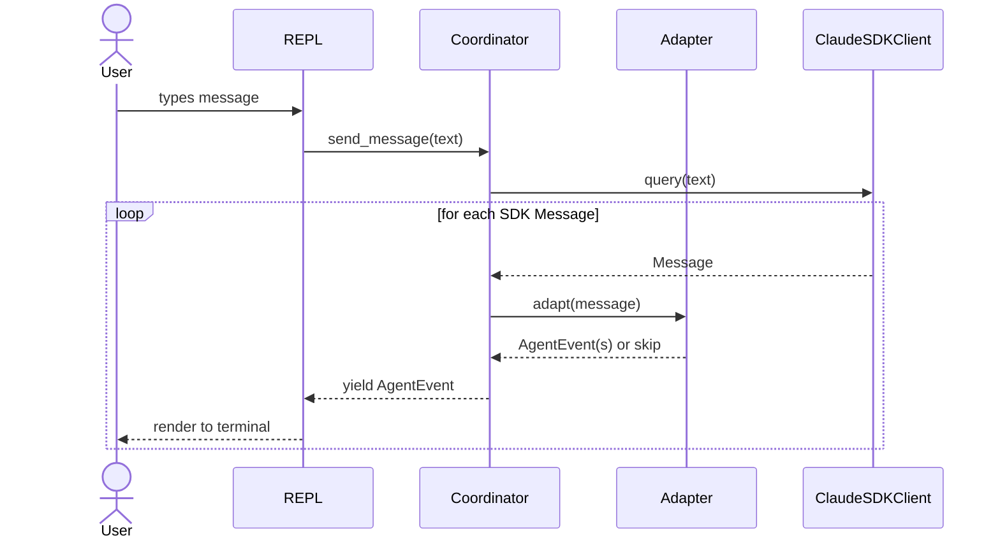
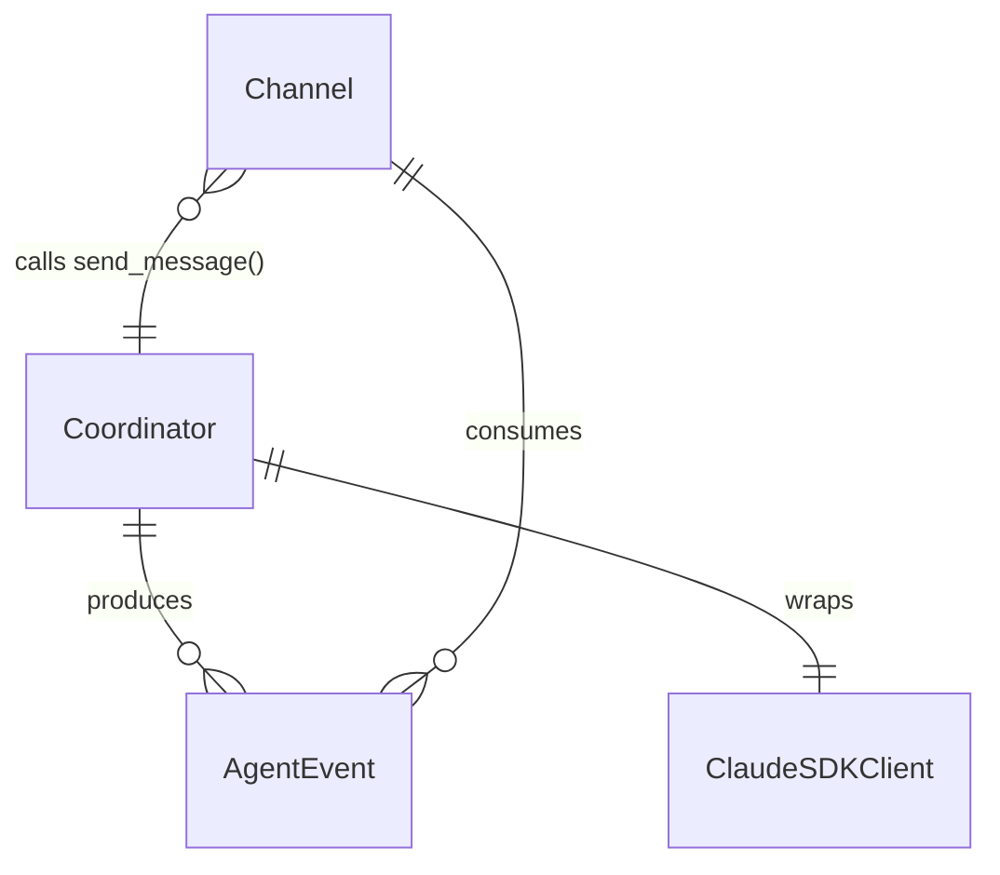

# Design: DLT-001 - Set up core agent architecture with terminal REPL

**Delta Spec**: [../delta-specs/DLT-001.md](../delta-specs/DLT-001.md)
**Status**: Approved

## Purpose

This document explains the design rationale for this delta: the modeling choices, data flow, system behavior, and architectural approach.

After implementation, the "Detected Impacts" section will guide reconciliation into feature design docs.

## Problem Context

Tachikoma needs a foundational agent architecture that every other delta builds on. The core problem is: how do we wrap the Claude Agent SDK in a way that (a) provides a clean programmatic interface for channels to send messages and receive streamed responses, (b) keeps channels decoupled from SDK internals so the SDK can evolve independently, and (c) gives us extension points where future deltas plug in pre-processing, post-processing, delegation, and idle task processing.

**Constraints:**
- The Claude Agent SDK (`claude-agent-sdk`) is async-first and spawns a Claude Code CLI process internally
- The SDK has two entry points: `query()` (stateless iterator) and `ClaudeSDKClient` (persistent session)
- The REPL is a developer tool — it needs to be functional and pleasant but doesn't need to be fancy
- This delta deliberately avoids implementing pre/post processing or delegation — just the core loop

> **Note:** The package was recently renamed from `claude-code-sdk` to `claude-agent-sdk`. Some external references may still use the old name.

**Interactions:**
- DLT-002 (Telegram) will be a second channel calling the same programmatic entry point
- DLT-003 (Delegation) will extend the coordinator to spawn sub-agents
- DLT-004 (Inactivity timeout) will monitor the session for conversation boundaries
- DLT-006 (Pre-processing) and DLT-008 (Post-processing) will hook into the message flow

## Design Overview

Three-layer architecture with clear boundaries:

```
┌─────────────────────────────────────────────────────┐
│                    Channel Layer                     │
│  ┌─────────┐  ┌──────────┐                          │
│  │  REPL   │  │ Telegram │ (future, DLT-002)        │
│  └────┬────┘  └────┬─────┘                          │
│       │             │                                │
│       ▼             ▼                                │
├─────────────────────────────────────────────────────┤
│                 Coordinator Layer                     │
│  ┌──────────────────────────────────────────┐        │
│  │  Coordinator                             │        │
│  │  send_message(text) → AsyncIterator      │        │
│  │  [AgentEvent]                            │        │
│  └────┬─────────────────────────────────────┘        │
│       │                                              │
│       ▼                                              │
│  ┌──────────────────────────────────────────┐        │
│  │  Message Adapter                         │        │
│  │  SDK Message → AgentEvent                │        │
│  └──────────────────────────────────────────┘        │
├─────────────────────────────────────────────────────┤
│                    SDK Layer                          │
│  ┌──────────────────────────────────────────┐        │
│  │  ClaudeSDKClient                         │        │
│  │  (claude-agent-sdk)                      │        │
│  └──────────────────────────────────────────┘        │
└─────────────────────────────────────────────────────┘
```

The **Coordinator** is the programmatic entry point. Channels call `send_message()` and consume the resulting `AsyncIterator[AgentEvent]`. The coordinator manages the SDK client lifecycle and transforms SDK messages into domain events via the message adapter.

The **Message Adapter** is a pure transformation layer — it maps SDK `Message` objects into our `AgentEvent` domain types, decoupling channels from SDK internals. Named `AgentEvent` (not `StreamEvent`) to avoid collision with the SDK's own `StreamEvent` type used for partial message streaming.

The **REPL** is the first channel implementation — it uses `prompt_toolkit` for async input and renders `AgentEvent`s to the terminal.

## Shape

| Part | Mechanism | Flag |
|------|-----------|:----:|
| **S1** | Python project scaffolding: pyproject.toml with `claude-agent-sdk` and `prompt-toolkit` deps, dev deps (ruff, ty, pytest + plugins), src layout (`src/tachikoma/`), `__main__.py` entry point (enables `python -m tachikoma`), justfile for task running (lint, format, typecheck, test, run), .gitignore | |
| **S2** | Coordinator module: wraps `ClaudeSDKClient` in an async context manager, exposes `send_message(text) -> AsyncIterator[AgentEvent]` where `AgentEvent` is our domain type hierarchy (TextChunk, ToolActivity, Result, Error) | |
| **S3** | Session lifecycle: coordinator manages connect/disconnect of the SDK client, creates new sessions on start, maintains conversation context across messages within a session | |
| **S4** | Message adapter: transforms SDK `Message` objects into our `AgentEvent` domain types. Handles `AssistantMessage` (extracting `TextBlock` for text and `ToolUseBlock` for tool activity from `message.content`), `ResultMessage` (checking `is_error`/`subtype` for success vs error), filters out `UserMessage` (tool results echoed back) and `SystemMessage` (session metadata) | |
| **S5** | Terminal REPL: async loop using `prompt_toolkit`'s `prompt_async()` for input with `FileHistory` persistence at `~/.tachikoma/repl_history` and a validator that prevents submitting empty/whitespace-only messages, renders `AgentEvent`s to stdout (text chunks printed inline, tool activity as status lines with tool parameters), handles Ctrl+C (exits REPL from prompt, interrupts stream during response) and Ctrl+D (exits on empty prompt) | |
| **S6** | Error boundary: catches SDK exceptions (CLINotFoundError, CLIConnectionError, ProcessError), handles in-stream errors (`AssistantMessage.error` field for auth/rate-limit/server errors, `ResultMessage.is_error` for budget errors), maps all to user-friendly `Error` events with appropriate `recoverable` flag; captures SDK startup errors (which cover multiple auth mechanisms) for fast-fail | |

### Flagged Unknowns

(none)

## Components

### Implementation Structure

| Layer/Component | Responsibility | Key Decisions |
|-----------------|----------------|---------------|
| `src/tachikoma/__main__.py` | CLI entry point, runs `asyncio.run(main())` | Minimal — wires up coordinator + REPL; enables `python -m tachikoma` |
| `src/tachikoma/coordinator.py` | Wraps `ClaudeSDKClient`, manages session lifecycle, exposes `send_message()` | Async context manager pattern; owns SDK client instance |
| `src/tachikoma/events.py` | `AgentEvent` domain type hierarchy | Dataclasses; no SDK dependency |
| `src/tachikoma/adapter.py` | Transforms SDK messages to `AgentEvent`s | Pure function, stateless; only module that imports SDK message types |
| `src/tachikoma/repl.py` | Terminal REPL using `prompt_toolkit` | Consumes `AgentEvent`s; no SDK dependency |

### Cross-Layer Contracts

**Coordinator → Channel contract:**

```
send_message(text: str) -> AsyncIterator[AgentEvent]
```

Channels send a text message and receive an async stream of `AgentEvent`s. The stream ends naturally when the agent completes its response. Channels can stop consuming the iterator early (e.g., on Ctrl+C).



**Integration Points:**
- Coordinator ↔ SDK: async context manager lifecycle (`connect`/`disconnect`), `query()` to send messages, iterate `receive_messages()` for response stream
- Coordinator ↔ Adapter: pure function call `adapt(sdk_message) -> list[AgentEvent]` (returns empty list for filtered messages like `UserMessage`)
- REPL ↔ Coordinator: async iterator protocol

### Shared Logic

- **AgentEvent types** (`events.py`): Shared between coordinator (produces) and channels (consume). No other shared logic — each layer has clear boundaries.

## Modeling

The domain model is intentionally minimal for this delta:



### AgentEvent hierarchy

```
AgentEvent (base)
├── TextChunk       — a piece of streamed text content
├── ToolActivity    — agent used a tool (name + result summary)
├── Result          — final result metadata (session, cost, usage)
└── Error           — an error occurred (message, recoverable flag)
```

**TextChunk** carries `text: str` — one fragment of the agent's response. Channels concatenate these for display.

**ToolActivity** carries `tool_name: str`, `tool_input: dict` and `result: str` — notifies the channel that the agent invoked a tool. The `tool_input` contains the tool's parameters (e.g., file path for Read, pattern for Grep, glob for Glob). The REPL displays this as a dimmed status line including relevant parameters (e.g., "Reading src/main.py...", "Searching for 'authenticate'...", "Globbing *.py..."). Telegram might show it as a subtle indicator.

**Result** carries `session_id: str | None`, `total_cost_usd: float | None`, and `usage: dict | None` — signals the response is complete. Cost and usage data supports observability even in v1.

**Error** carries `message: str` and `recoverable: bool` — indicates something went wrong. Recoverable errors (transient API failures, rate limits) let the channel continue; non-recoverable errors (missing API key, authentication failure) signal the channel to exit.

### SDK Message → AgentEvent mapping

The adapter handles the SDK `Message` union (`UserMessage | AssistantMessage | SystemMessage | ResultMessage`) as follows:

| SDK Type | Content/Field | AgentEvent | Notes |
|----------|--------------|------------|-------|
| `AssistantMessage` | `TextBlock` in `.content` | `TextChunk` | Extract text from each text block |
| `AssistantMessage` | `ToolUseBlock` in `.content` | `ToolActivity` | Extract tool name, input parameters, and result |
| `AssistantMessage` | `.error` field set | `Error` | Auth, rate limit, server errors; check error type for `recoverable` flag |
| `ResultMessage` | `is_error=False` | `Result` | Extract session_id, cost, usage |
| `ResultMessage` | `is_error=True` | `Error` | Check `subtype` for error details |
| `UserMessage` | — | (filtered) | Tool results echoed back by SDK; not relevant to channels |
| `SystemMessage` | — | (filtered) | Session metadata (e.g., `subtype="init"`); not relevant to channels |

## Data Flow

### Normal message flow

```
1. User types message in REPL via prompt_toolkit
2. REPL awaits coordinator.send_message(text)
3. Coordinator calls SDK client.query(text)
4. Coordinator iterates SDK client.receive_messages()
5. For each SDK Message:
   a. Adapter maps to AgentEvent(s) or filters out
   b. Coordinator yields AgentEvent(s)
6. REPL renders each AgentEvent:
   - TextChunk → print(text, end="", flush=True)
   - ToolActivity → print status line (dimmed)
   - Result → print newline, return to prompt
   - Error → print error message
7. REPL loops back to step 1
```

**Note on streaming granularity:** The SDK's `receive_messages()` yields complete `Message` objects. An `AssistantMessage` may contain multiple content blocks (text + tool use). For v1, this message-level granularity is acceptable — text appears in chunks per-message rather than per-token. If finer granularity is needed, the SDK supports `include_partial_messages=True` which yields incremental `StreamEvent` objects, but this adds complexity to the adapter. The message-level approach is simpler and still provides a responsive feel since the SDK yields messages as the agent produces them (including after each tool use).

### Startup flow

```
1. __main__.py runs asyncio.run(main())
2. main() creates Coordinator
3. Enters coordinator async context (connect)
4. Coordinator creates ClaudeSDKClient with options:
   - allowed_tools: ["Read", "Glob", "Grep"]
   - model: from env or default
5. Coordinator calls client.connect()
6. If connection fails → capture SDK error, print message, exit
7. main() creates REPL with coordinator reference
8. REPL enters input loop
```

### Shutdown flow

```
1. User presses Ctrl+C or Ctrl+D on empty prompt (or types "exit"/"quit")
2. prompt_toolkit raises KeyboardInterrupt (Ctrl+C) or EOFError (Ctrl+D)
3. REPL breaks out of input loop
4. Coordinator async context exits (disconnect)
5. SDK client disconnects, CLI process terminates
6. asyncio.run() completes
```

## Key Decisions

### ClaudeSDKClient over query()

**Choice**: Use `ClaudeSDKClient` as the SDK interface, not `query()`
**Why**: `ClaudeSDKClient` provides native multi-turn conversation (session state managed internally), `interrupt()` for Ctrl+C mid-stream, and lifecycle management (`connect`/`disconnect`). These map directly to REPL needs and will benefit future channels (Telegram). The `query()` function would require manual session ID tracking and lacks interrupt support.
**Sources**: Claude Agent SDK Python docs (platform.claude.com/docs/en/agent-sdk/python)
**Options Researched**: `query()` with `resume=session_id` (simpler but no interrupt, manual session tracking), `ClaudeSDKClient` (richer API, native multi-turn)
**Why This Over Alternatives**: `query()` is designed for one-off scripting tasks; `ClaudeSDKClient` is designed for interactive applications like ours. The interrupt support alone justifies the choice — without it, Ctrl+C during streaming would require killing the process.
**Consequences**:
- Pro: Native multi-turn, interrupt support, clean lifecycle
- Pro: Future deltas (DLT-002 Telegram) benefit from same session management
- Con: Tighter coupling to SDK client API shape

### prompt_toolkit for REPL input

**Choice**: Use `prompt_toolkit` with `PromptSession.prompt_async()` for terminal input
**Why**: Provides async-native input that integrates with our asyncio event loop, plus built-in history (FileHistory for persistence across sessions), multiline support, and key bindings — all without blocking the event loop.
**Sources**: prompt_toolkit docs (python-prompt-toolkit.readthedocs.io), used by IPython, pgcli, AWS CLI
**Options Researched**: `input()` via ThreadPoolExecutor (simple but no history/features), `readline` stdlib (synchronous-only), `aioconsole` (async but minimal features), `prompt_toolkit` (full-featured async REPL)
**Why This Over Alternatives**: `input()` and `readline` are synchronous and need executor wrappers, losing async integration. `aioconsole` is lightweight but has no history or key bindings. `prompt_toolkit` is the standard library for Python terminal apps — one well-maintained dependency for a significantly better experience.
**Consequences**:
- Pro: Persistent input history across sessions (FileHistory at `~/.tachikoma/repl_history`)
- Pro: Async-native, no executor hacks
- Pro: Extensible (can add completions, key bindings later)
- Con: Extra dependency (~1.5MB)

### Own domain types for streaming (AgentEvent)

**Choice**: Define `AgentEvent` type hierarchy instead of passing SDK messages to channels
**Why**: Channels should not depend on SDK internals. The SDK `Message` types expose implementation details like content blocks (TextBlock, ToolUseBlock), tool use structures, error fields, and SDK-specific metadata that channels don't need. Our `AgentEvent` types expose only what channels care about: text to display, tool activity to indicate, completion to signal, and errors to handle. Named `AgentEvent` (not `StreamEvent`) to avoid collision with the SDK's own `StreamEvent` type used for partial message streaming.
**Sources**: Research finding that SDK message types are complex (AssistantMessage has content blocks with text/tool_use sub-types, ResultMessage has subtype/is_error/usage metadata)
**Options Researched**: Pass-through SDK messages (simple but couples channels), thin wrapper re-exporting SDK types (middle ground but still coupled), own domain types (full decoupling)
**Why This Over Alternatives**: The adapter is a thin, stateless transformation — low implementation cost. The decoupling benefit is high: any SDK update to message shapes only affects the adapter, not every channel. This is especially important given that the SDK is relatively new and its API may evolve.
**Consequences**:
- Pro: Channels have zero SDK dependency
- Pro: SDK changes isolated to adapter module
- Pro: AgentEvent types are minimal and purpose-built for channel needs
- Con: Additional mapping layer (but it's a small, pure function)

### Restricted tool set via allowed_tools

**Choice**: Use `allowed_tools=["Read", "Glob", "Grep"]` to pre-approve read-only file tools
**Why**: Per the spec, "Without any other deltas, the agent is a conversationalist with basic file access." The `allowed_tools` list pre-approves these tools without prompting. Any unlisted tools the agent attempts will fall through to the default permission mode, which prompts the user. This is acceptable for a single-user dev tool — the user stays in the loop for anything beyond read access.
**Sources**: Claude Agent SDK Python docs (platform.claude.com/docs/en/agent-sdk/python)
**Consequences**:
- Pro: Read-only tools work without interruption
- Pro: User is prompted for any other tool use — no silent escalation
- Con: Agent may occasionally prompt for tools that should be denied outright (acceptable for v1)

### Message-level streaming (v1)

**Choice**: Use `receive_messages()` for message-level streaming rather than `include_partial_messages=True` for token-level streaming
**Why**: The SDK's `receive_messages()` yields complete `Message` objects. Each `AssistantMessage` arrives once the agent has produced it, including after tool use rounds. This is still responsive — text appears as the agent produces it across turns. True token-by-token streaming requires `include_partial_messages=True`, which yields SDK `StreamEvent` objects containing raw API stream deltas. This adds significant adapter complexity (handling partial content, delta accumulation, text fragment assembly) for a marginal UX improvement in a developer REPL.
**Consequences**:
- Pro: Simpler adapter — handles complete, well-typed Message objects
- Pro: No naming collision complexity (SDK `StreamEvent` type not involved)
- Con: Text appears in message-level chunks rather than character-by-character
- Note: Can upgrade to token-level streaming later by adding `include_partial_messages=True` and extending the adapter — the `AgentEvent` contract with channels remains unchanged

## System Behavior

### Scenario: Normal conversation turn

**Given**: The REPL is running and the coordinator is connected
**When**: The user types a message and presses enter
**Then**: The message is sent to the coordinator, which forwards it to the SDK client. The response streams back as `AgentEvent`s — `TextChunk`s are printed inline as they arrive (one per `AssistantMessage`). A `Result` event signals completion and the REPL shows a new prompt.
**Rationale**: Streaming at the message level provides responsive feedback; the user sees the response forming as the agent works through tool use rounds.

### Scenario: Multi-turn conversation

**Given**: The user has already sent one or more messages in the current session
**When**: The user sends a follow-up message
**Then**: The SDK client maintains conversation context internally (same session). The agent can reference prior messages in its response.
**Rationale**: `ClaudeSDKClient` manages session state — no need to replay history.

### Scenario: Ctrl+C during streaming

**Given**: The agent is streaming a response
**When**: The user presses Ctrl+C
**Then**: The REPL calls `coordinator.interrupt()` which calls `client.interrupt()`. Partial output remains visible on screen. The stream ends. The REPL exits cleanly.
**Rationale**: Ctrl+C always exits the REPL. During streaming, the current response is interrupted first, then the REPL shuts down.

### Scenario: Ctrl+C at prompt

**Given**: The REPL is waiting for user input
**When**: The user presses Ctrl+C
**Then**: `prompt_toolkit` raises `KeyboardInterrupt`. The REPL exits cleanly — coordinator disconnects, SDK client terminates.
**Rationale**: Ctrl+C always exits the application, regardless of whether the agent is streaming or idle. Use Ctrl+U to clear the current input line without exiting.

### Scenario: Ctrl+D at empty prompt (exit)

**Given**: The REPL is waiting for user input and the input buffer is empty
**When**: The user presses Ctrl+D
**Then**: `prompt_toolkit` raises `EOFError`. The REPL breaks out of the input loop. The coordinator's async context manager exits, disconnecting the SDK client. The process exits cleanly.
**Rationale**: Ctrl+D (EOF) on an empty prompt is the standard Unix signal to exit a REPL. If the prompt has content, Ctrl+D does nothing (standard behavior).

### Scenario: Empty input prevented

**Given**: The REPL is waiting for user input
**When**: The user presses enter without typing anything (or only whitespace)
**Then**: `prompt_toolkit`'s validator rejects the submission. The input is not sent; the cursor stays on the same line.
**Rationale**: Per spec AC — no request sent for empty input. Preventing submission at the input level is cleaner than accepting and discarding.

### Scenario: Authentication failure on startup

**Given**: No valid authentication is available (the SDK supports multiple auth mechanisms — API key, OAuth, etc.)
**When**: The coordinator attempts to connect the SDK client
**Then**: The SDK raises an error. The coordinator catches the SDK exception, extracts the error message, and prints it to stderr before exiting. No `Error` event is yielded since the REPL loop hasn't started.
**Rationale**: Fail fast with the SDK's own error message, which describes the specific auth failure. We don't assume which auth mechanism is in use — the SDK knows best.

### Scenario: In-stream error (rate limit, auth failure)

**Given**: The agent is streaming a response
**When**: The SDK yields an `AssistantMessage` with the `.error` field set (e.g., `"rate_limit"`, `"authentication_failed"`, `"server_error"`)
**Then**: The adapter detects the error field and produces an `Error` event. Rate limit and server errors are `recoverable=True` (conversation continues). Authentication and billing errors are `recoverable=False` (REPL exits with a clear message). Partial output remains visible.
**Rationale**: The SDK communicates some errors within the message stream rather than as exceptions. The adapter must handle both error paths.

### Scenario: Transient connection error mid-stream

**Given**: The agent is streaming a response
**When**: The API connection drops or the CLI process crashes
**Then**: The SDK raises `CLIConnectionError` or `ProcessError`. The coordinator catches it and yields an `Error` event with `recoverable=True`. Partial output remains visible. The REPL displays the error message and shows a new prompt — the conversation remains usable.
**Rationale**: Per spec AC — partial output visible, error shown, conversation continues.

### Scenario: Agent uses a tool

**Given**: The agent is processing a message
**When**: The agent decides to use a built-in tool (e.g., Read a file)
**Then**: The SDK yields an `AssistantMessage` with `ToolUseBlock` entries in its `.content`. The adapter extracts the tool name and input parameters, producing a `ToolActivity` event. Subsequent messages contain tool results (`UserMessage`, filtered) and the agent's continued response (`AssistantMessage` with `TextBlock`). The REPL renders tool activity as a dimmed status line that includes the tool's key parameters — e.g., "Reading src/main.py...", "Searching for 'authenticate'...", "Globbing **/*.py...". The agent's text response continues streaming after the tool use.
**Rationale**: Users should see that the agent is working and *what* it's doing (which file, which search term) rather than experiencing unexplained pauses or generic status.

## Open Questions

(none — all questions resolved during research, interview, and validation)

---

## Detected Impacts

### Affected Feature Designs
- None (greenfield project — no existing feature designs)

### Notes for Reconciliation
- New feature design doc should be created after implementation documenting the core agent architecture
- The Coordinator's `send_message()` contract and `AgentEvent` types will be the primary integration surface for future deltas
- DLT-002 (Telegram), DLT-003 (Delegation), DLT-004 (Inactivity), DLT-006 (Pre-processing), DLT-008 (Post-processing) all depend on the architecture established here

## Notes

- The Claude Agent SDK wraps the Claude Code CLI binary internally — the Python package bundles the CLI
- The `AgentEvent` type hierarchy is designed to be extensible — future deltas can add new event types (e.g., `DelegationStarted` for DLT-003) without modifying existing channels
- Input history is persisted via `prompt_toolkit`'s `FileHistory` at `~/.tachikoma/repl_history`, providing history across REPL sessions
- The adapter pattern used here (SDK types → domain types) may become a DES pattern if repeated in future deltas that integrate external services
- The `connect()` method on `ClaudeSDKClient` accepts an optional `prompt` parameter for sending an initial message during connection. The coordinator uses `connect()` for lifecycle only and sends messages via `query()` after connection, keeping the first message flow consistent with subsequent messages
- Dev tooling (ruff, ty, pytest, just) follows ADR-001 through ADR-005 — same Astral toolchain as other projects
