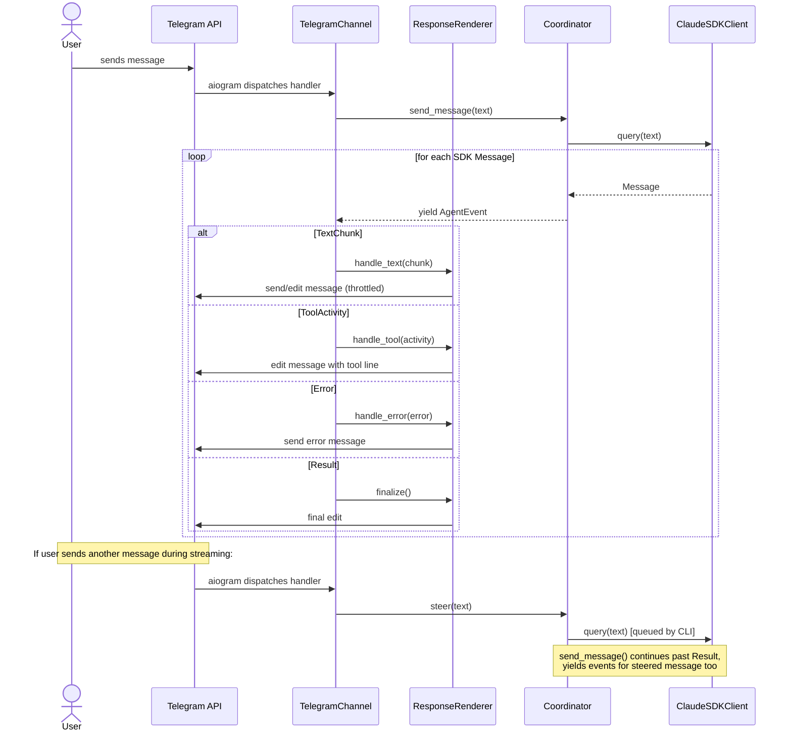

# Design: DLT-002 - Send and receive messages via Telegram

**Delta Spec**: [../delta-specs/DLT-002.md](../delta-specs/DLT-002.md)
**Status**: Approved

## Purpose

This document explains the design rationale for this delta: the modeling choices, data flow, system behavior, and architectural approach.

After implementation, the "Detected Impacts" section will guide reconciliation into feature design docs.

## Problem Context

Tachikoma needs a production-facing communication channel beyond the development REPL. Telegram is the target: a single authorized user sends text messages to a bot, the coordinator processes them, and responses stream back as formatted Telegram messages with progressive editing.

**Constraints:**
- Must integrate with the existing async coordinator (`send_message()` → `AsyncIterator[AgentEvent]`)
- Telegram's Bot API has rate limits (~30 msg/sec global, ~5 edits/min per message) and a 4096-character message size limit
- Telegram's MarkdownV2 format has strict escaping rules that break with partial markdown during streaming
- The CLI entry point must support channel selection while integrating with DLT-023's SettingsManager and bootstrap sequence
- Messages arriving while the agent is responding should be steered into the active stream (spec R2 says "queued" — this design upgrades to steering for better UX; spec should be updated during reconciliation)

**Interactions:**
- Coordinator layer (core-architecture): `send_message()` for normal turns, new `steer()` for mid-stream message injection
- Configuration system (DLT-012): new `[telegram]` section in Settings model
- Bootstrap system (DLT-023): new bootstrap hook validates Telegram config, prompts for missing values
- SettingsManager (DLT-023): CLI flag overrides applied as runtime-only settings

## Design Overview

The Telegram channel follows the same pattern as the REPL: a `TelegramChannel` class that calls `coordinator.send_message()` and consumes `AgentEvent`s, but renders them as Telegram messages instead of terminal output. The channel uses **aiogram 3.x** for bot communication and **telegramify-markdown** for formatting.

```
┌──────────────────────────────────────────────────────────────┐
│                      Entry Point                              │
│  ┌────────────────────────────────────────────────────────┐   │
│  │  cyclopts App (--channel flag)                         │   │
│  │  → SettingsManager (TOML + CLI overrides)              │   │
│  │  → Bootstrap (hooks incl. telegram validation)         │   │
│  │  → Channel dispatch (Repl or TelegramChannel)          │   │
│  └────────────────────────────────────────────────────────┘   │
├──────────────────────────────────────────────────────────────┤
│                     Channel Layer                              │
│  ┌─────────────┐  ┌───────────────────────────────────────┐   │
│  │    Repl      │  │  TelegramChannel                     │   │
│  │  (existing)  │  │  ┌─────────────────────────────────┐ │   │
│  │              │  │  │ aiogram Bot + Dispatcher + Router│ │   │
│  │              │  │  └─────────────────────────────────┘ │   │
│  │              │  │  ┌─────────────────────────────────┐ │   │
│  │              │  │  │ ResponseRenderer                │ │   │
│  │              │  │  │ (progressive edits, tool lines, │ │   │
│  │              │  │  │  message splitting, formatting) │ │   │
│  │              │  │  └─────────────────────────────────┘ │   │
│  └──────┬──────┘  └──────────────┬────────────────────────┘   │
│         │                        │                             │
│         ▼                        ▼                             │
├──────────────────────────────────────────────────────────────┤
│                   Coordinator Layer                             │
│  ┌────────────────────────────────────────────────────────┐   │
│  │  Coordinator                                           │   │
│  │  send_message(text) → AsyncIterator[AgentEvent]        │   │
│  │  steer(text) → None  (new: mid-stream injection)       │   │
│  └────────────────────────────────────────────────────────┘   │
└──────────────────────────────────────────────────────────────┘
```

The key additions:
- **`TelegramChannel`**: owns the aiogram lifecycle, handles message events, renders responses
- **`ResponseRenderer`**: manages progressive message editing, tool lines, splitting, and formatting
- **`Coordinator.steer()`**: injects a user message mid-stream via `client.query()`
- **Cyclopts CLI**: parses `--channel` flag and applies overrides to SettingsManager
- **Telegram bootstrap hook**: validates config when Telegram channel is selected

## Shape

| Part | Mechanism | Flag |
|------|-----------|:----:|
| **S1** | aiogram bot client: `Bot` + `Dispatcher` + `Router` for long polling via `dp.start_polling(bot)`. Router-level filter `F.chat.id == authorized_chat_id`. Built-in `ChatActionSender` for persistent typing indicators. | |
| **S2** | `TelegramChannel` class: owns aiogram Dispatcher lifecycle, wires message handler that calls `coordinator.send_message()` and consumes the async iterator. Receives `Coordinator` + config via constructor. | |
| **S3** | Progressive response renderer: sends initial message on first text chunk; accumulates in buffer; edits every 2s (time-based throttle); splits at paragraph boundary before 4096 chars; final edit on `Result`. | |
| **S4** | Tool activity renderer: inline tool status line within response message; each new tool replaces previous; "_🔧 Ran tools_" on text resumption. Participates in same throttled edit cycle. | |
| **S5** | telegramify-markdown formatter: `(text, entities)` tuple output → `parse_mode=None` + `entities` parameter. Applied on each edit cycle. | |
| **S6** | Authorization + validation filter: router-level `F.chat.id` filter + handler-level non-text/empty check. Silent drop. | |
| **S7** | Reconnection: aiogram's built-in `BackoffConfig` for polling failures. Custom error handler for `TelegramRetryAfter` on edits. | |
| **S8** | `TelegramSettings` config section + bootstrap hook: optional `telegram: TelegramSettings | None` on Settings. `channel: Literal["repl", "telegram"] = "repl"` on root Settings. Bootstrap hook validates telegram config when `channel == "telegram"`, prompts for missing values (with guidance on obtaining chat ID), persists via SettingsManager. `_generate_default_config()` extended with commented `[telegram]` section. Hook uses `asyncio.run()` internally for async `bot.get_me()` validation call. | |
| **S9** | Cyclopts CLI with SettingsManager override: `--channel` flag parsed by cyclopts, overrides `settings.channel` via `settings_manager.update("channel", value)` without `save()` (runtime-only). SettingsManager is single source of truth. Cyclopts auto-generates `--help` output. | |
| **S10** | Graceful shutdown: signal handlers trigger `dp.stop_polling()`. In-flight response sent as final edit. aiogram `shutdown` signal for cleanup. | |
| **S11** | Steering via `Coordinator.steer(text)`: calls `client.query(text)` and increments pending counter. `send_message()` continues past `Result` when counter > 0, decrementing on each. Channel calls `steer()` when message arrives during active response. | |

## Components

### Implementation Structure

| Layer/Component | Responsibility | Key Decisions |
|-----------------|----------------|---------------|
| `src/tachikoma/__main__.py` | Cyclopts `App` entry point: parses `--channel`, creates `SettingsManager`, applies CLI overrides, runs bootstrap, dispatches to channel | Replaces bare `asyncio.run(main())` with cyclopts; integrates with DLT-023's SettingsManager + Bootstrap |
| `src/tachikoma/telegram.py` | `TelegramChannel` class + `ResponseRenderer` class | High cohesion between channel control flow and response rendering (same pattern as `repl.py` with `Repl`/`Renderer`) |
| `src/tachikoma/coordinator.py` | Existing + new `steer()` method and pending-steers tracking in `send_message()` | Minimal change to core module |
| `src/tachikoma/config.py` | `TelegramSettings` model added to `Settings` | Extends existing config; optional section (`None` when not configured) |
| `src/tachikoma/bootstrap.py` | `telegram_hook` registered by `__main__.py` when channel is telegram | Uses DLT-023's hook system; validates config, prompts for missing values |

### Cross-Layer Contracts



**Integration Points:**
- Channel ↔ Coordinator: `send_message()` (async iterator) and `steer()` (fire-and-forget mid-stream injection)
- Channel ↔ aiogram: `Router` handler receives `Message`, `Bot` sends/edits messages
- Renderer ↔ telegramify-markdown: converts accumulated markdown to `(text, entities)` tuples on each edit cycle
- `__main__.py` ↔ SettingsManager: CLI overrides applied via `update()` without `save()` (runtime-only)
- `__main__.py` ↔ Bootstrap: `telegram_hook` registered when channel is telegram

### Shared Logic

- **`AgentEvent` types** (`events.py`): Shared between coordinator (produces) and both channels (consume). No changes needed.
- **`TOOL_DISPLAY` map**: Currently in `repl.py`. Should be extracted to a shared location since both channels need human-readable tool descriptions.

## Modeling

### New config model

```
Settings (root, frozen)
├── workspace: WorkspaceSettings
├── agent: AgentSettings
├── channel: Literal["repl", "telegram"] = "repl"  (new, top-level)
└── telegram: TelegramSettings | None = None  (new, optional)
    ├── bot_token: str
    └── authorized_chat_id: int
```

`channel` is a top-level setting defaulting to `"repl"`. Users can set it in TOML to avoid passing `--channel telegram` every time; the CLI flag overrides it via SettingsManager at runtime.

`TelegramSettings` is `None` by default. When the `[telegram]` section exists in TOML, Pydantic validates both fields as required (no defaults — both must be provided). The optional typing means the section itself is optional, but when present, its fields are mandatory. `authorized_chat_id` is a plain `int` — Telegram chat IDs can be negative (groups) and large, but Pydantic's `int` type handles the full range.

### ResponseRenderer state

```
ResponseRenderer
├── _bot: Bot
├── _chat_id: int
├── _current_message_id: int | None      (Telegram message being edited)
├── _buffer: str                          (accumulated markdown text)
├── _tool_line: str | None                (current tool status line)
├── _had_tools: bool                      (whether tools ran, for "🔧 Ran tools" marker)
├── _last_edit_time: float                (monotonic timestamp of last edit)
└── _message_count: int                   (tracks messages sent in current response, for logging)
```

The renderer exposes a `reset()` method that clears all state for a new response. The channel calls `reset()` after each `Result` event, so steered messages start with a fresh renderer.

### Coordinator additions

```
Coordinator (existing)
├── _client: ClaudeSDKClient
├── _pending_steers: int = 0              (new: count of steered messages)
├── send_message(text) → AsyncIterator    (modified: continues past Result when _pending_steers > 0)
└── steer(text) → None                    (new: increments counter, calls client.query())
```

## Data Flow

### Normal message flow (Telegram)

```
1. User sends text in Telegram
2. aiogram Router receives update, chat ID filter passes
3. Handler validates: text message, non-empty
4. ChatActionSender starts typing indicator
5. Handler calls coordinator.send_message(text)
6. For each AgentEvent:
   a. TextChunk → append to buffer, schedule throttled edit
   b. ToolActivity → set tool line, schedule throttled edit
   c. Error → send error message to chat
   d. Result → finalize (send final edit, reset renderer state)
7. Typing indicator stops when ChatActionSender context exits
```

### Throttled edit cycle

```
1. Event arrives (TextChunk or ToolActivity)
2. Update buffer/tool_line state
3. Check: has 2 seconds elapsed since last edit?
   ├─ No → skip edit (buffer continues accumulating)
   └─ Yes → format and edit
4. Format: telegramify-markdown converts buffer + tool_line → (text, entities)
5. Check: formatted text approaching 4096 chars?
   ├─ No → edit current message with (text, entities)
   └─ Yes → find last paragraph boundary, send current message up to boundary,
            start new message with remainder
6. Update _last_edit_time
7. On Result event: always send final edit regardless of throttle
```

### Message splitting

```
1. Buffer accumulates text chunks; tool line (if any) is included in character count
2. Before each edit, check if formatted output (buffer + tool line) > ~3800 chars (safety margin)
3. If over limit:
   a. Find last paragraph boundary (\n\n) before the limit in the text buffer
   b. Split: send everything up to boundary as final edit of current message
   c. Start new message with remainder + current tool line (if active)
   d. Reset _current_message_id to new message
4. If no paragraph boundary found, split at last newline
5. If no newline found, hard-split at 4096
6. Tool line near boundary: if buffer alone fits but buffer + tool line exceeds,
   finalize current message (text only), start new message with tool line
```

### Steering flow

```
1. User sends msg A → handler calls coordinator.send_message("A")
2. send_message() calls client.query("A"), iterates receive_messages()
3. Events for A stream back, channel renders them
4. User sends msg B while A is streaming
5. aiogram dispatches new handler → calls coordinator.steer("B")
6. steer() increments _pending_steers to 1, calls client.query("B")
   (asyncio-safe: _pending_steers is a plain int, no concurrent mutation
    under cooperative scheduling)
7. CLI queues B internally
8. A completes → receive_messages() yields ResultMessage for A
9. Channel sees Result → calls renderer.finalize() then renderer.reset()
10. send_message() checks _pending_steers > 0 → decrements, continues iterating
11. CLI processes B → receive_messages() yields messages for B
12. Events for B stream back through the same send_message() iteration
    Channel renders them as a new response message (renderer was reset)
13. B completes → Result, _pending_steers == 0 → break
```

The `Result` event serves as a turn boundary signal. The channel finalizes the current response and resets the renderer, so each steered message gets its own Telegram response message(s). The `send_message()` iteration does not break — it checks the counter and continues.

### Startup flow (with DLT-023 integration)

```
1. cyclopts App parses CLI args (--channel flag, typed as Literal["repl", "telegram"])
2. Create SettingsManager(config_path)
3. Apply CLI overrides via settings_manager.update() without save() (runtime-only):
   └─ --channel value → settings_manager.update("channel", channel_value)
   (future CLI flags that map to TOML fields follow the same pattern)
4. Create Bootstrap(settings_manager, prompt=input)
5. Register hooks:
   a. bootstrap.register("workspace", workspace_hook)  — DLT-023
   b. bootstrap.register("telegram", telegram_hook)     — DLT-002
      (always registered; hook checks settings.channel internally and skips if not telegram)
6. bootstrap.run()
   └─ telegram_hook:
      a. Check settings.channel == "telegram", skip otherwise
      b. Check settings.telegram is not None → if None, prompt for bot_token and
         authorized_chat_id (with guidance: "Send /start to your bot, then check
         https://api.telegram.org/bot<token>/getUpdates for your chat ID")
      c. Persist via ctx.settings_manager.update()/save()
      d. Validate token via asyncio.run(bot.get_me()) — runs sync in hook context
7. Read final settings from settings_manager.settings
8. Create Coordinator(cwd=settings.workspace.path, ...)
9. Dispatch based on settings.channel:
   ├─ "repl" → Repl(coordinator, history_path=...)
   └─ "telegram" → TelegramChannel(coordinator, settings.telegram)
10. Channel runs (repl.run() or telegram.run())
```

## Key Decisions

### aiogram 3.x over python-telegram-bot

**Choice**: Use aiogram 3.x as the Telegram bot library
**Why**: aiogram is async-native from the ground up — `dp.start_polling(bot)` is an awaitable coroutine that runs inside `asyncio.run()`, fitting perfectly with the existing async entry point. python-telegram-bot's `run_polling()` is blocking and manages its own event loop, which conflicts with our `asyncio.run(main())` architecture.
**Sources**: aiogram 3.26 docs, python-telegram-bot v22.6 docs, community comparisons (2025-2026)
**Options Researched**: aiogram 3.x, python-telegram-bot v22, pyTelegramBotAPI (telebot)
**Why This Over Alternatives**: PTB (~55k stars) has a larger community, but its blocking event loop model requires workarounds. aiogram's router/middleware/DI pattern aligns with our architecture. Built-in `ChatActionSender` auto-refreshes typing indicators.
**Consequences**:
- Pro: Native async integration with existing coordinator
- Pro: Router-level filtering, built-in ChatActionSender, clean middleware system
- Con: Smaller community (~5k stars) — fewer examples available
- Con: Rate limit handling for message edits needs manual implementation (PTB has built-in `AIORateLimiter`)

### telegramify-markdown with entities output

**Choice**: Use telegramify-markdown in `(text, entities)` tuple mode, sending with `parse_mode=None` + `entities` parameter
**Why**: Telegram's MarkdownV2 requires strict escaping and breaks with partial markdown during streaming (unclosed bold, incomplete code blocks). The entities-based approach sidesteps all parsing issues — the library converts markdown to plain text + a list of `MessageEntity` objects, and the Telegram API applies formatting from entities directly.
**Sources**: telegramify-markdown v0.5.4 docs/GitHub, Telegram Bot API docs on MessageEntity
**Options Researched**: telegramify-markdown, md2tgmd, mark2tg, telegram-markdown-entities, custom converter, plain text during streaming
**Why This Over Alternatives**: telegramify-markdown is purpose-built for LLM output, handles auto-chunking, and supports the entities approach. A custom converter would need to handle all markdown edge cases. Plain text loses formatting during streaming.
**Consequences**:
- Pro: No MarkdownV2 escaping issues during streaming
- Pro: Handles LLM output patterns (code blocks, nested formatting)
- Pro: Auto-chunking support for long messages
- Con: Additional dependency (~small)
- Con: Entity-based output may not support all formatting edge cases (to be validated during implementation)

### Time-based edit throttle (2 seconds)

**Choice**: Edit the Telegram message at most once every 2 seconds during streaming
**Why**: Telegram does not publish exact rate limits. Empirical community testing reports ~30 msg/sec global throughput and varying per-message edit limits (sources disagree on exact numbers). A 2-second interval is conservative enough to stay safe while being responsive. Simpler than hybrid approaches (time + character count).
**Sources**: Telegram Bot API FAQ, PTB wiki on flood limits, community empirical testing (limits.tginfo.me, grammY docs)
**Consequences**:
- Pro: Simple to implement — one timer check
- Pro: Conservative interval avoids rate limit issues
- Con: Fast-streaming responses may appear to "jump" on each 2s edit (acceptable trade-off)
- Note: If 2s proves too aggressive or too slow, the interval is a single constant to adjust

### Steering via Coordinator.steer()

**Choice**: Add a `steer(text)` method to the Coordinator that injects a message mid-stream by calling `client.query(text)` directly, with `send_message()` continuing past `Result` events when steered messages are pending
**Why**: The Claude Agent SDK's `query()` writes to the CLI's stdin, and the CLI queues messages internally — processing them after the current turn completes. This allows seamless message injection without interrupting the current response. The steered message's response flows through the same `receive_messages()` iteration.
**Sources**: Claude Agent SDK Python source (`client.py`), CLI internals analysis, Claude Code behavior analysis
**Consequences**:
- Pro: Seamless UX — user can send messages anytime, no "please wait" state
- Pro: Minimal coordinator change — one new method + counter in send_message loop
- Pro: Conversation context preserved — steered messages are full turns in the same session
- Con: If timing doesn't align (steer arrives after send_message breaks), the steered message's response buffers until the next send_message call
- Note: This is an optimistic design — if the CLI's queuing behavior doesn't work as expected, the fallback is adding an asyncio.Lock for serialization

### Cyclopts with SettingsManager integration

**Choice**: Use cyclopts for CLI parsing, applying flag values as runtime-only overrides to SettingsManager (no persist)
**Why**: CLI flags and TOML config are the same parameters. A `channel` field on Settings (defaulting to `"repl"`) lets users configure their default channel in TOML; the `--channel` CLI flag overrides it via `settings_manager.update("channel", value)` without `.save()`. The bootstrap and all consumers read from SettingsManager, seeing the merged result. This integrates cleanly with DLT-023's architecture.
**Sources**: cyclopts docs (async-native, Literal type for choices, auto-generated --help), DLT-023 design (SettingsManager `update()` API)
**Consequences**:
- Pro: Single source of truth for all config values (TOML and CLI)
- Pro: Users can set a default channel in TOML and still override per-launch
- Pro: Bootstrap hooks see the merged config
- Pro: cyclopts auto-generates `--help` output from type annotations
- Con: Requires DLT-023's SettingsManager `update()` to support top-level fields (currently designed for `update(section, key, value)` — may need a variant for root-level fields like `channel`)

### Optional TelegramSettings (None when unconfigured)

**Choice**: Model `telegram` as `TelegramSettings | None = None` on Settings, where `TelegramSettings` fields are all required (no defaults)
**Why**: Unlike workspace and agent settings which have sensible defaults, Telegram settings (bot token, chat ID) are secrets with no meaningful defaults. The section itself is optional (None = not configured), but when present, all fields must be provided. This prevents the application from starting with a Telegram channel and a half-configured token.
**Consequences**:
- Pro: Clear distinction — `None` means "not configured", present means "fully configured"
- Pro: Pydantic validates all fields when the section exists
- Con: Requires the bootstrap hook to check and prompt when the section is missing

## System Behavior

### Scenario: Normal Telegram message

**Given**: The bot is running and connected via long polling
**When**: The authorized user sends a text message
**Then**: The handler sends a typing indicator, calls `coordinator.send_message(text)`, and the `ResponseRenderer` progressively edits a single Telegram message with the streaming response. On completion, a final edit sends the full formatted text.

### Scenario: Message during active response (steering)

**Given**: The bot is streaming a response to message A
**When**: The user sends message B
**Then**: The handler calls `coordinator.steer("B")`. The CLI queues B internally. After A's response completes, the same `send_message()` iteration continues and streams B's response through the same event loop. The channel renders B's response as a new response message in the chat.

### Scenario: Response exceeds 4096 characters

**Given**: The agent is streaming a long response
**When**: The accumulated text approaches 4096 characters
**Then**: The renderer finds the last paragraph boundary (`\n\n`) before the limit, sends the current message as final (up to the boundary), and starts a new message with the remainder. The user sees a cleanly split response across multiple messages.

### Scenario: Tool activity during response

**Given**: The agent is processing and uses tools
**When**: A `ToolActivity` event arrives
**Then**: A tool status line (e.g., "_Reading src/main.py..._") is appended to the current response message. If another tool fires, the previous tool line is replaced. When text resumes, the tool line becomes "_🔧 Ran tools_" and new text continues below it.

### Scenario: Unauthorized user

**Given**: The bot is running
**When**: A message arrives from a chat ID that doesn't match the configured `authorized_chat_id`
**Then**: aiogram's router-level filter (`F.chat.id == authorized_chat_id`) silently drops the message. No handler is invoked, no response is sent.

### Scenario: Non-text or empty message

**Given**: The authorized user sends a photo, sticker, or empty message
**When**: The handler receives it
**Then**: Non-text content is ignored by the `F.text` filter on the handler. Empty/whitespace-only text is checked and silently ignored in the handler body.

### Scenario: Bot token invalid at startup

**Given**: The config has an invalid bot token
**When**: The application starts with `--channel telegram`
**Then**: The `telegram_hook` validates the token via `asyncio.run(bot.get_me())` (sync wrapper for the async call, running within the synchronous hook context). If it fails, startup aborts with a clear error message.

### Scenario: Missing Telegram config at startup

**Given**: No `[telegram]` section in config
**When**: The application starts with `--channel telegram`
**Then**: The `telegram_hook` detects `settings.telegram is None`, prompts the user for bot token and chat ID via `ctx.prompt` (with guidance: "Send /start to your bot, then visit `https://api.telegram.org/bot<token>/getUpdates` to find your chat ID"), persists them via `ctx.settings_manager.update()`/`.save()`, and proceeds with token validation.

### Scenario: Polling connection drops

**Given**: The bot is running and the network drops
**When**: aiogram's polling detects the disconnect
**Then**: aiogram's built-in `BackoffConfig` retries with exponential backoff. The error handler logs the event. No crash.

### Scenario: Rate limit on message edit

**Given**: The renderer edits a message
**When**: Telegram returns HTTP 429 (TelegramRetryAfter)
**Then**: The error handler catches `TelegramRetryAfter`, waits `retry_after` seconds, and the next edit cycle proceeds normally. The edit that triggered the limit is skipped (not retried).

### Scenario: Graceful shutdown

**Given**: SIGTERM or SIGINT is received
**When**: The bot is streaming a response
**Then**: The signal triggers `dp.stop_polling()`. The current accumulated text in the renderer's buffer is sent as a final edit (partial response delivered). aiogram's shutdown signal fires for cleanup. The process exits.

### Scenario: Network error during message edit

**Given**: The renderer attempts to edit a message
**When**: The network is unreachable
**Then**: The edit silently fails (caught exception). The renderer continues accumulating text and attempts the next edit on the next throttle cycle. No crash.

### Scenario: Coordinator error (recoverable)

**Given**: The coordinator yields an `Error` event with `recoverable=True`
**When**: The renderer receives it
**Then**: An error message is sent to the user in the chat. The conversation remains usable.

### Scenario: Coordinator error (non-recoverable)

**Given**: The coordinator yields an `Error` event with `recoverable=False`
**When**: The renderer receives it
**Then**: An error message is sent to the user in the chat. The bot logs the failure.

## Open Questions

- [ ] Verify telegramify-markdown's entities output mode works correctly with Telegram's `send_message(entities=...)` for all formatting types the agent produces (resolve during first implementation PR)
- [ ] Confirm aiogram's `start_polling` can be cleanly stopped from a signal handler while a response is being streamed (resolve during implementation)
- [ ] Validate that `asyncio.run()` inside a synchronous bootstrap hook doesn't conflict with the outer event loop (may need `asyncio.get_event_loop().run_until_complete()` or restructure hooks to support async)

## Spec Deviations

- **R2 (Message receiving)**: Spec says "queue messages arriving during an active response and process them sequentially." This design upgrades to steering (S11) for better UX — messages are injected mid-stream via `steer()` rather than explicitly queued. The spec should be updated during reconciliation to reflect the steering approach.

---

## Detected Impacts

### Affected Feature Designs
- **docs/feature-designs/channels/README.md** — Adds: Telegram channel as new sub-capability
- **docs/feature-designs/configuration/config-system.md** — Modifies: new `[telegram]` section in Settings; CLI override system adds a new precedence layer (defaults < TOML < CLI flags); SettingsManager gains runtime-only override pattern
- **docs/feature-designs/agent/core-architecture.md** — Modifies: Coordinator gains `steer()` method and pending-steers tracking in `send_message()`; entry point changes from bare `asyncio.run()` to cyclopts App

### Notes for Reconciliation
- Add Telegram channel entry to channels/README.md capability table
- Create new feature design `docs/feature-designs/channels/telegram.md`
- Update config-system.md to document `[telegram]` section, `channel` top-level field, CLI override precedence, and SettingsManager runtime-only update pattern
- Update core-architecture.md to document `steer()` method and the steering flow
- Update core-architecture.md startup flow to reflect cyclopts + bootstrap integration
- Update DLT-002 spec R2 to reflect steering instead of queuing
- Document cyclopts CLI pattern (potential DES candidate for CLI entry point conventions)
- Extract `TOOL_DISPLAY` map to shared location (both REPL and Telegram need it)

## Notes

- aiogram 3.x docs: https://docs.aiogram.dev/en/dev/
- telegramify-markdown: https://github.com/sudoskys/telegramify-markdown
- cyclopts: https://cyclopts.readthedocs.io/en/stable/
- The `ResponseRenderer` in `telegram.py` follows the same pattern as `Renderer` in `repl.py` — both consume `AgentEvent`s and render them to their respective outputs. This may become a DES pattern if a third channel is added.
- The steering mechanism assumes the Claude SDK CLI queues `query()` calls and processes them sequentially. If this assumption proves incorrect, the fallback is adding `asyncio.Lock` serialization in the channel handler.
- `telegram_hook` is always registered but self-skips when `settings.channel != "telegram"` (idempotent, per DLT-023 hook convention). REPL-only usage triggers no Telegram validation or prompts.
- `_pending_steers` is a plain `int` — safe under asyncio's cooperative concurrency (no preemptive thread interruption). If the project ever introduces threads, this would need an `asyncio.Lock` or atomic counter.
- `TOOL_DISPLAY` extraction target: a `display.py` module or keep in `events.py` alongside the event types (decision deferred to implementation).
