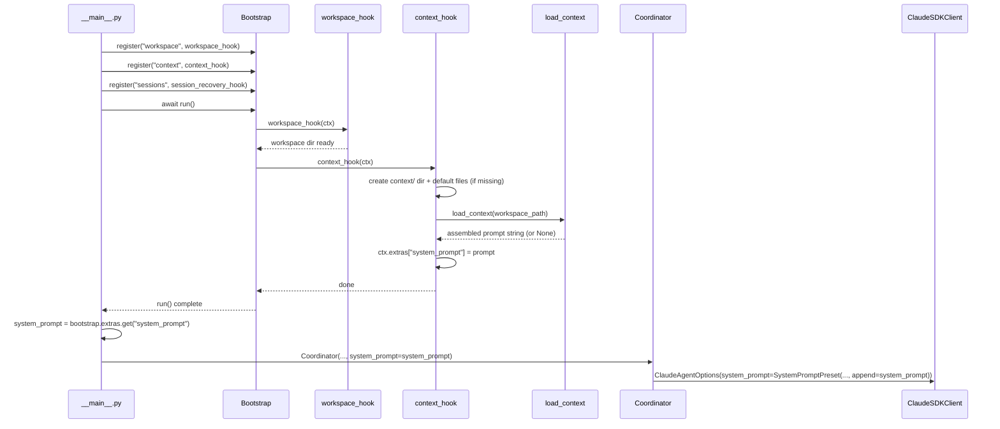

# Design: DLT-005 - Load foundational context for personality and user knowledge

**Delta Spec**: [../delta-specs/DLT-005.md](../delta-specs/DLT-005.md)
**Status**: Approved

## Purpose

This document explains the design rationale for this delta: the modeling choices, data flow, system behavior, and architectural approach.

After implementation, the "Detected Impacts" section will guide reconciliation into feature design docs.

## Problem Context

The assistant needs a consistent personality, knowledge of the user, and operational guidelines — regardless of which memories are retrieved for a given conversation. Without foundational context, the agent starts each session as a blank slate, relying entirely on dynamically retrieved memories (future DLT-006) for personality and user knowledge.

Three concerns drive the design:

1. **Identity consistency**: The agent should have the same tone, personality, and behavioral guidelines every time
2. **User knowledge baseline**: Known facts about the user (name, preferences, projects) should always be available, not contingent on memory retrieval relevance
3. **Transparency**: Users should be able to see and edit exactly what shapes the agent's behavior — no hidden configuration

**Constraints:**
- Context files must be human-readable markdown in the workspace (user-editable)
- Context is layered ON TOP of the SDK's default Claude Code system prompt, not replacing it
- Files are loaded once at startup — no hot-reload mid-session (R8, R9 are Out)
- Bootstrap hook must be idempotent (safe to run every launch)

**Interactions:**
- Workspace bootstrap (DLT-023) must run first to create the workspace directory
- DLT-018 (update core context files from conversations) will consume the file paths and format established here
- The coordinator (core architecture) receives the assembled prompt as a constructor parameter

## Design Overview

A new `context.py` module owns the entire context domain: file path definitions, default template content, a bootstrap hook for first-run initialization, and a loader that reads and assembles files into a system prompt string. The hook creates `context/` and writes default templates on first run, then loads the files and stores the assembled prompt in `ctx.extras["system_prompt"]`. The entry point reads this extra and passes it to the Coordinator, which wraps it in a `SystemPromptPreset` to append it to the SDK's default Claude Code prompt.

As part of this delta, `workspace_hook` is extracted from `bootstrap.py` into a new `workspace.py` module, establishing the pattern that each subsystem owns its bootstrap hook internally. `bootstrap.py` becomes purely the mechanism.

```
┌──────────────────────────────────────────────────────────────────┐
│                          __main__.py                              │
│                                                                  │
│  bootstrap.register("workspace", workspace_hook)  ← workspace.py │
│  bootstrap.register("context", context_hook)      ← context.py   │
│  bootstrap.register("sessions", session_recovery_hook)            │
│                                                                  │
│  await bootstrap.run()                                           │
│                                                                  │
│  system_prompt = bootstrap.extras.get("system_prompt")           │
│  Coordinator(..., system_prompt=system_prompt)                    │
└──────────────────────────────────────────────────────────────────┘
```

## Shape

| Part | Mechanism | Flag |
|------|-----------|:----:|
| **S1** | **Context bootstrap hook** — A `context_hook` function in a new `context.py` module that creates `context/` directory under workspace root and writes default template files (SOUL.md, USER.md, AGENTS.md) on first run. Skips existing files. Registered after workspace hook in `__main__.py`. | |
| **S2** | **Context loader** — A `load_context` function in `context.py` that reads the three context files, handles missing/empty/unreadable files gracefully (logs warnings per DES-002), prepends a hard-coded preamble explaining the context system, and concatenates file contents wrapped in XML tags (`<soul>`, `<user>`, `<agents>`) in order: SOUL → USER → AGENTS. Returns the assembled string. Called by the hook, result stored in `ctx.extras["system_prompt"]`. | |
| **S3** | **Coordinator system prompt integration** — Coordinator accepts a `system_prompt: str | None` parameter. When present, wraps it in `SystemPromptPreset(type="preset", preset="claude_code", append=context_string)` and sets it on `ClaudeAgentOptions.system_prompt`. `__main__.py` reads `bootstrap.extras["system_prompt"]` and passes to Coordinator. | |
| **S4** | **Default template content** — Meaningful starter content as module-level constants in `context.py`: SOUL.md with personality traits + dialogue encouragement, USER.md with user-discovery prompt, AGENTS.md explaining its purpose as behavioral instructions. | |
| **S5** | **Workspace hook extraction** — Move `workspace_hook` from `bootstrap.py` to a new `workspace.py` module. Update imports in `__main__.py`. Establishes the pattern: each subsystem owns its hook internally. `bootstrap.py` becomes purely the mechanism (Bootstrap class, BootstrapContext, BootstrapError, BootstrapHook type). | |

### Flagged Unknowns

None.

## Components

### Implementation Structure

| Layer/Component | Responsibility | Key Decisions |
|-----------------|----------------|---------------|
| `src/tachikoma/context.py` | Context file management: file path definitions, default template constants, bootstrap hook (`context_hook`), and context loader (`load_context`) | New module; single home for the context domain. DLT-018 will import from here. |
| `src/tachikoma/workspace.py` | Workspace directory creation hook (`workspace_hook`) | Extracted from `bootstrap.py`; owns the workspace initialization concern |
| `src/tachikoma/bootstrap.py` | Bootstrap mechanism only: `Bootstrap`, `BootstrapContext`, `BootstrapHook`, `BootstrapError` | `workspace_hook` removed; purely mechanism now |
| `src/tachikoma/coordinator.py` | Wraps `ClaudeSDKClient`; now accepts `system_prompt` parameter | `SystemPromptPreset` integration via `ClaudeAgentOptions.system_prompt` |
| `src/tachikoma/__main__.py` | Entry point: registers hooks, reads `system_prompt` from extras, passes to Coordinator | Hook registration order: workspace → context → sessions |

### Cross-Layer Contracts



**Integration Points:**
- context_hook ↔ Bootstrap: receives `BootstrapContext`, stores result in `ctx.extras["system_prompt"]`
- `__main__.py` ↔ Bootstrap: reads `bootstrap.extras.get("system_prompt")` after `run()`
- `__main__.py` ↔ Coordinator: passes `system_prompt` string to constructor
- Coordinator ↔ SDK: wraps string in `SystemPromptPreset` and sets on `ClaudeAgentOptions`

### Shared Logic

- **Context file paths**: Defined in `context.py` as functions of the workspace path. DLT-018 will import these to know where to write updates.
- **Default template content**: Module-level string constants in `context.py`. DLT-018 may reference these for understanding the file format.

## Modeling

The domain model is minimal — this delta introduces no persistent entities:

```
context.py
├── CONTEXT_DIR_NAME = "context"
├── CONTEXT_FILES: ordered list mapping filename → XML tag name → default content
│   ├── ("SOUL.md",   "soul",   DEFAULT_SOUL_CONTENT)
│   ├── ("USER.md",   "user",   DEFAULT_USER_CONTENT)
│   └── ("AGENTS.md", "agents", DEFAULT_AGENTS_CONTENT)
├── CONTEXT_PREAMBLE (str constant)
├── context_hook(ctx: BootstrapContext) → None
└── load_context(workspace_path: Path) → str | None
```

The three context files are plain markdown managed by the user. The system reads them as strings and assembles them into a single prompt string. No structured parsing, no metadata extraction — just string concatenation with XML delimiters.

`load_context` returns `str | None`: a non-empty assembled string when at least one file has content, or `None` when all files are missing/empty (so the coordinator can skip setting the system prompt entirely).

## Data Flow

### Bootstrap flow (context initialization)

```
1. context_hook receives BootstrapContext
2. Reads workspace_path from ctx.settings_manager.settings.workspace.path
3. Computes context_path = workspace_path / "context"
4. Creates context_path directory if missing (exist_ok=True)
5. For each of [SOUL.md, USER.md, AGENTS.md]:
   a. Check if file exists at context_path / filename
   b. If missing → write default template content
   c. If exists → skip (idempotent)
6. Calls load_context(workspace_path) to assemble the prompt
7. If result is not None → stores in ctx.extras["system_prompt"]
```

### Context loading and assembly

```
1. load_context receives workspace_path
2. Computes context_path = workspace_path / "context"
3. For each file in order (SOUL.md, USER.md, AGENTS.md):
   a. Attempt to read file contents
   b. If missing → log warning, skip
   c. If empty → skip (no section added, no warning)
   d. If unreadable (PermissionError, OSError) → log warning, skip
   e. If has content → wrap in XML tags and collect
4. If no sections collected → return None
5. Prepend hard-coded preamble to collected sections
6. Return assembled string
```

### Assembled prompt structure

```
[CONTEXT_PREAMBLE — explains the context system, file purposes, user-editability]

<soul>
[contents of SOUL.md]
</soul>

<user>
[contents of USER.md]
</user>

<agents>
[contents of AGENTS.md]
</agents>
```

### Startup flow (how prompt reaches the agent)

```
1. __main__.py registers hooks: workspace → context → sessions
2. Bootstrap.run() executes hooks in order
3. After run(), __main__.py reads bootstrap.extras.get("system_prompt")
4. Passes system_prompt to Coordinator constructor
5. Coordinator stores system_prompt
6. On __aenter__, creates ClaudeSDKClient with options:
   - If system_prompt is not None:
     SystemPromptPreset(type="preset", preset="claude_code", append=system_prompt)
   - If system_prompt is None:
     system_prompt field left as None (SDK default)
7. ClaudeSDKClient receives options with appended context
```

## Key Decisions

### Subsystem-owned hooks (pattern change)

**Choice**: Each subsystem defines its own bootstrap hook in its own module. `workspace_hook` moves to `workspace.py`, `context_hook` lives in `context.py`, `session_recovery_hook` already lives in `sessions/hooks.py`.
**Why**: Separation of concerns — `bootstrap.py` should be the mechanism, not a bag of unrelated hooks. Each subsystem owns its initialization logic. This also gives downstream deltas (DLT-018, DLT-020) clean import targets.
**Sources**: User decision during design interview; sessions package already follows this pattern.
**Options Researched**: Co-locating all hooks in `bootstrap.py` (simpler but conflates mechanism with concerns).
**Why This Over Alternatives**: Consistency with existing sessions pattern; cleaner module boundaries; better for DLT-018 reuse.

**Consequences**:
- Pro: Clean module boundaries — each subsystem is self-contained
- Pro: `bootstrap.py` stays focused and small
- Pro: DLT-018 can import `context.py` directly
- Con: One more module per subsystem (minor; each is small)

### XML tags for section delimiters

**Choice**: Wrap each file's content in XML tags (`<soul>`, `<user>`, `<agents>`) in the assembled prompt.
**Why**: XML tags provide clear, unambiguous boundaries that LLMs can reliably parse. They are commonly used in system prompts to delineate sections and are less likely to be confused with file content than markdown headings.
**Sources**: User decision during design interview; common LLM prompt engineering practice.
**Options Researched**: Markdown headings (`# SOUL`), simple separators (`---`), XML tags.
**Why This Over Alternatives**: Markdown headings could collide with content in the files themselves. Simple separators lack semantic meaning. XML tags are explicit and widely used for prompt section delineation.

**Consequences**:
- Pro: Unambiguous section boundaries
- Pro: Agent can easily reference "the content in `<soul>`" for self-awareness
- Con: Slightly more verbose than markdown headings (negligible)

### SystemPromptPreset with append (not replace)

**Choice**: Use `SystemPromptPreset(type="preset", preset="claude_code", append=context_string)` to layer context on top of the SDK's default prompt.
**Why**: The SDK's default Claude Code prompt includes tool-use instructions, safety guidelines, and agentic loop behaviors that are essential for the agent to function correctly. Replacing it would require replicating all of that. Appending is the SDK's designed mechanism for this use case.
**Sources**: SDK source code inspection — `ClaudeAgentOptions.system_prompt` accepts `str | SystemPromptPreset | None`; `SystemPromptPreset` is a `TypedDict` with `type`, `preset`, and `append` fields. Importable from `claude_agent_sdk.types`.
**Options Researched**: Full replacement via plain string, `SystemPromptPreset` with append.
**Why This Over Alternatives**: Full replacement loses all SDK built-in behaviors (tool use, safety, agentic loop). Append preserves them and is the intended extension mechanism.

**Consequences**:
- Pro: Preserves all SDK default behaviors
- Pro: Uses the SDK's designed extension point
- Pro: Future SDK updates to the default prompt automatically apply
- Con: We don't control the full system prompt (acceptable — we shouldn't)

### Context loader returns None for empty state

**Choice**: `load_context` returns `str | None` — `None` when all files are missing or empty.
**Why**: When no context files have content, there's nothing to append. Returning `None` lets the coordinator skip setting `system_prompt` entirely, which means the SDK uses its vanilla default prompt. This avoids appending just the preamble with no actual content.

**Consequences**:
- Pro: Clean no-op when no context exists
- Pro: Coordinator doesn't need to check for empty strings
- Con: None (the distinction is clear)

### Empty files are silent, missing/unreadable files warn

**Choice**: Empty files are silently skipped (no warning), while missing and unreadable files log a warning.
**Why**: The spec's R4 groups "missing, empty, or unreadable" together, but the conditions have different semantics. A missing file is unexpected after the bootstrap hook has run (something deleted it). An unreadable file is an OS-level error. Both warrant a warning. An empty file, however, is a deliberate user action — the user opened the file and removed all content, or explicitly chose not to fill it in. Warning on intentional behavior would be noisy. This design refines R4's blanket treatment into context-appropriate handling.

**Consequences**:
- Pro: No false alarms for intentional user choices
- Pro: Warnings still fire for genuinely unexpected conditions (missing, permissions)
- Con: Slight divergence from R4 wording (but aligns with R4's intent)

### Fatal vs graceful error boundary

**Choice**: Directory creation failures in `context_hook` are fatal (abort startup via BootstrapError). File read failures in `load_context` are graceful (log and continue).
**Why**: If the `context/` directory cannot be created, something is fundamentally wrong with the filesystem — the same class of failure that makes `workspace_hook` fatal. The agent cannot function if basic directory operations fail. File read failures, on the other hand, are localized — one unreadable file should not prevent the agent from starting with the remaining files.

**Consequences**:
- Pro: Consistent with workspace_hook behavior for directory-level failures
- Pro: File-level failures degrade gracefully per R4
- Con: None (clear boundary between infrastructure failure and content failure)

## System Behavior

### Scenario: First launch — no context directory

**Given**: The workspace exists but no `context/` directory
**When**: The context hook runs during bootstrap
**Then**: `context/` is created along with SOUL.md, USER.md, and AGENTS.md containing default template content. The loader reads all three files and assembles the system prompt with the preamble and XML-tagged sections.
**Rationale**: First-run initialization creates meaningful defaults that prompt the agent to engage in a personality/preference discovery conversation with the user.

### Scenario: Subsequent launch — all files exist and have content

**Given**: All three context files exist with user-customized content
**When**: The context hook runs
**Then**: The hook skips file creation (idempotent). The loader reads files and assembles the system prompt with the user's content.
**Rationale**: Idempotency — existing files are never overwritten.

### Scenario: One context file is missing

**Given**: SOUL.md and AGENTS.md exist, but USER.md was accidentally deleted
**When**: The context hook runs
**Then**: The hook recreates USER.md with default content. The loader reads all three files.
**Rationale**: Per R3 (AC: only missing file is created with default content) — selective creation preserves existing files while recovering missing ones.

### Scenario: One context file is empty

**Given**: All three files exist, but USER.md is empty (0 bytes)
**When**: The loader reads context files
**Then**: SOUL.md and AGENTS.md are wrapped in XML tags; USER.md is skipped (no `<user>` section in output). No warning is logged for empty files.
**Rationale**: An empty file is a deliberate user action, not an error. The system respects it by omitting that section.

### Scenario: Context file is unreadable (permission denied)

**Given**: SOUL.md exists but has no read permissions
**When**: The loader attempts to read it
**Then**: A warning is logged per DES-002 (`component="context"`, level=WARNING), SOUL.md is skipped, remaining files are loaded normally.
**Rationale**: Per R4 — graceful degradation. The agent starts with partial context rather than crashing.

### Scenario: All files are missing or empty

**Given**: The context directory exists but all files are missing or empty
**When**: The loader runs
**Then**: No sections are collected, `load_context` returns `None`. The coordinator starts without a custom system prompt (SDK default only). The preamble is NOT appended when there's no content.
**Rationale**: Avoids appending a meaningless preamble with no actual context.

### Scenario: User edits a context file between sessions

**Given**: The user modifies SOUL.md between app restarts
**When**: The app restarts and the context hook runs
**Then**: The loader reads the updated SOUL.md content. The agent uses the updated personality.
**Rationale**: Per R6 — context is loaded once at startup. Changes are reflected on restart.

### Scenario: User edits a context file mid-session

**Given**: The user modifies SOUL.md while the agent is running
**When**: The user continues the conversation
**Then**: The agent continues using the old SOUL.md content loaded at startup. Changes take effect on next restart.
**Rationale**: Per R9 (Out) — hot-reload is explicitly deferred. Per AC: "when the user edits a context file mid-session, then the changes are NOT reflected until the next startup."

## Open Questions

None — all design decisions resolved.

---

## Detected Impacts

### Affected Feature Designs
- **docs/feature-designs/agent/core-architecture.md** — Modifies: Coordinator constructor gains `system_prompt` parameter; `ClaudeAgentOptions` configuration expands to include `system_prompt` via `SystemPromptPreset`
- **docs/feature-designs/agent/workspace-bootstrap.md** — Modifies: `workspace_hook` moves from `bootstrap.py` to `workspace.py`; `bootstrap.py` becomes purely mechanism; subsystem-owned hook pattern established
- **docs/feature-designs/agent/README.md** — Adds: May need a new "core-context" sub-capability entry

### Notes for Reconciliation
- Core architecture design needs to document the `system_prompt` parameter on Coordinator and its flow into SDK options
- Workspace bootstrap design needs updating: `workspace_hook` location changed from `bootstrap.py` to `workspace.py`
- Bootstrap Components table needs updating — `workspace_hook` removed from `bootstrap.py` responsibility
- A new feature design doc may be needed for the "core-context" capability domain under `docs/feature-designs/agent/`
- DLT-018 (update core context files) will consume `context.py` exports — the module API established here is the contract

## Notes
- The `SystemPromptPreset` type is importable from `claude_agent_sdk.types`, not from the top-level `claude_agent_sdk` package
- The preamble content should be concise — the agent already understands markdown and XML. It needs to know: what the files are, that they're user-editable, and what each file's purpose is
- Default template content (S4) should be thoughtful but brief — lengthy defaults waste context tokens on every session until the user customizes them
- **Emptiness check**: Files should be considered "empty" when their stripped content is empty (i.e., `content.strip() == ""`). A file containing only whitespace is effectively empty and should be treated the same as a zero-byte file.
- **CONTEXT_FILES type**: The ordered mapping of (filename, xml_tag, default_content) can be a `list[tuple[str, str, str]]` or a similar structure — left to implementer's discretion
