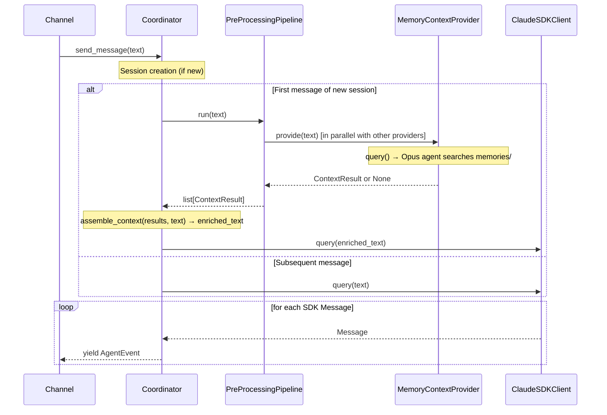
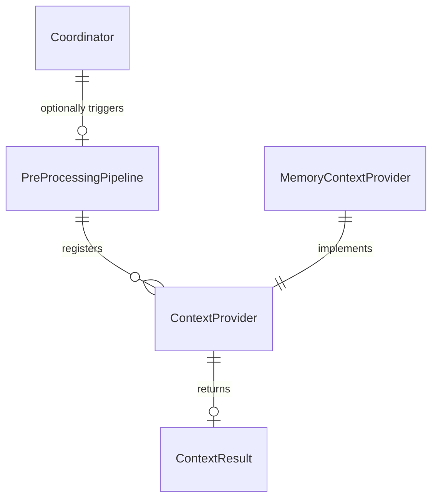

# Design: DLT-006 - Pre-process messages with memory context injection

**Delta Spec**: [../delta-specs/DLT-006.md](../delta-specs/DLT-006.md)
**Status**: Approved

## Purpose

This document explains the design rationale for this delta: the modeling choices, data flow, system behavior, and architectural approach.

After implementation, the "Detected Impacts" section will guide reconciliation into feature design docs.

## Problem Context

The coordinator currently sends user messages directly to the SDK agent with no contextual enrichment. Post-processing (DLT-007) extracts memories after conversations end, but those memories are never fed back into future conversations. Users must repeat previously shared information because the agent has no automatic access to stored knowledge.

**Constraints:**
- Pre-processing must not block the message flow — failures degrade gracefully
- The pipeline must be domain-agnostic — it knows nothing about memory, skills, or any specific provider
- Memory retrieval uses the existing file-based memory storage (episodic, facts, preferences)
- Context injection must use XML tags consistent with `<soul>`, `<user>`, `<agents>` convention (per ADR-008)
- Pre-processing runs once per session (on the first message only) — subsequent messages benefit from conversation history

**Interactions:**
- Coordinator (`core-architecture`): `send_message()` gains a pre-processing step before `client.query()` on first message of a new session
- Post-processing (`post-processing-pipeline`): architecturally parallel — both are optional pipelines managed by the coordinator, but they operate at different lifecycle points
- Memory extraction (DLT-007): provides the stored memories that this delta's memory provider searches
- Future providers (DLT-021 skills): will register as additional context providers in the same pipeline

## Design Overview

Two concerns, separated by a clean interface:

```
┌──────────────────────────────────────────────────────────────────┐
│                    PreProcessingPipeline                         │
│                    (src/tachikoma/pre_processing.py)             │
│                                                                  │
│  ContextProvider ABC ──► ContextResult(tag, content)             │
│                                                                  │
│  run(message):                                                   │
│    await gather(                                                 │
│      *[provider.provide(message) for provider in providers],     │
│      return_exceptions=True                                      │
│    )                                                             │
│    → list[ContextResult]  (successful, non-None results)         │
│                                                                  │
│  assemble_context(results, message) → enriched message           │
└──────────────────────────────────────────────────────────────────┘

┌──────────────────────────────────────────────────────────────────┐
│                    MemoryContextProvider                          │
│                    (src/tachikoma/memory/context_provider.py)     │
│                                                                  │
│  provide(message):                                               │
│    query(prompt, options=ClaudeAgentOptions(                     │
│      model="opus", effort="low",                                │
│      allowed_tools=["Read", "Glob", "Grep"],                    │
│      max_turns=8, cwd=workspace_path,                           │
│      permission_mode="bypassPermissions"                         │
│    ))                                                            │
│    → ContextResult(tag="memories", content=...)  or None         │
└──────────────────────────────────────────────────────────────────┘
```

The **PreProcessingPipeline** manages registered providers, runs them in parallel, and collects results. The **MemoryContextProvider** uses a standalone `query()` call to search stored memories with an Opus agent. The coordinator calls the pipeline on the first message of each new session, assembles the results into XML-tagged context, and prepends it to the user message.

## Shape

<!--
Mechanisms that make up the solution. Seeded during spec phase, evolved during design.
Parts describe what to build/change (mechanisms), not constraints (those belong in spec's Requirements).
Flag column: empty = mechanism is understood, ⚠️ = unknown that needs investigation (spike or research).
-->

| Part | Mechanism | Flag |
|------|-----------|:----:|
| **S1** | **ContextProvider ABC** — Abstract base class with `async provide(message: str) -> ContextResult \| None`. Each provider receives the user's first session message, returns a named context result or None. Domain-agnostic, no SDK coupling. Lives in `pre_processing.py`. | |
| **S2** | **ContextResult dataclass** — `tag: str, content: str`. Represents a named XML-tagged context block (e.g., tag=`"memories"`, content=`"Relevant files: ..."`). Validates non-empty `tag` in `__post_init__` to prevent malformed XML. Lives in `pre_processing.py`. | |
| **S3** | **PreProcessingPipeline** — Manages registered `ContextProvider`s. `register(provider)` to add. `run(message) -> list[ContextResult]` runs all providers in parallel via `asyncio.gather(return_exceptions=True)`, collects successful results, logs failures. Runs once per session (on the first message only). Lives in `pre_processing.py`. | |
| **S4** | **Context assembly** — `assemble_context(results, message)` function in `pre_processing.py` that wraps each `ContextResult` in XML tags (`<{tag}>...</{tag}>`) and prepends them to the original user message text. | |
| **S5** | **Memory context provider** — `MemoryContextProvider(ContextProvider)` in `src/tachikoma/memory/context_provider.py`. Makes a standalone `query()` call with `model="opus"`, tools=`["Read", "Glob", "Grep"]`, `effort="low"`, `max_turns=8`, `permission_mode="bypassPermissions"`, `cwd` set to workspace path. Prompt instructs the agent to search `memories/` directories using Glob/Grep to narrow candidates, Read to verify relevance, and return a ranked markdown list of up to 10 relevant files with summaries plus instructions for the main agent to read further. Extracts output via `ResultMessage.result` (when `subtype=="success"`). Returns `ContextResult(tag="memories", content=...)` or `None` if no relevant memories found. | |
| **S6** | **Coordinator integration** — In `send_message()`, when `get_active_session()` returns `None` and `create_session()` succeeds, set `is_new_session = True`. If new session and `pre_pipeline` is set: run `pipeline.run(message)`, assemble results via S4, prepend enriched context to user message text before `client.query()`. The entire pre-processing block (pipeline.run + assemble_context) is wrapped in try/except — failures are logged per DES-002 and the original unmodified message is sent to `client.query()`. If session creation fails or no registry exists, pre-processing is skipped. Subsequent messages in the same session skip pre-processing. Pipeline is an optional constructor dependency (if None, skip). | |

## Components

### Implementation Structure

| Layer/Component | Responsibility | Key Decisions |
|-----------------|----------------|---------------|
| `src/tachikoma/pre_processing.py` | `ContextProvider` ABC (interface only), `ContextResult` dataclass (with `__post_init__` tag validation), `PreProcessingPipeline` class (parallel execution with error isolation, no `asyncio.Lock` — concurrent first-messages are prevented by session registry), `assemble_context()` standalone function | Mirrors `post_processing.py` pattern — mechanism separate from domain; ABC has no SDK coupling; assembly function is a pure standalone helper; no serialization lock needed (unlike post-processing) because pre-processing only runs once per session and concurrent session creation is prevented by the registry |
| `src/tachikoma/memory/context_provider.py` | `MemoryContextProvider(ContextProvider)` — uses standalone `query()` with Opus agent and search tools to find relevant memories. Extracts result from `ResultMessage.result`. | Opus with `effort="low"` for better relevance assessment at controlled cost; `max_turns=8` as safety net; prompt uses Glob→Grep→Read narrowing strategy |
| `src/tachikoma/coordinator.py` | Integration: calls `pre_pipeline.run(message)` and `assemble_context()` on first message of new session, before `client.query()`. Entire pre-processing block wrapped in try/except (logged, original message used as fallback). | Pre-processing is optional dependency (like post-processing); `is_new_session` flag set when `get_active_session()` returns None and `create_session()` succeeds; if session creation fails or no registry, pre-processing is skipped |
| `src/tachikoma/__main__.py` | Wiring: creates `PreProcessingPipeline`, registers `MemoryContextProvider(cwd)`, passes pipeline to Coordinator | Follows same pattern as post-processing pipeline setup |

### Cross-Layer Contracts



**Integration Points:**
- Coordinator ↔ PreProcessingPipeline: `pipeline.run(message)` returns `list[ContextResult]`; called in `send_message()` before `client.query()`
- PreProcessingPipeline ↔ ContextProvider: `register(provider)` at setup; `provide(message)` called in parallel during `run()`
- MemoryContextProvider ↔ SDK: standalone `query()` call (independent of coordinator's `ClaudeSDKClient`)
- Coordinator ↔ assemble_context: pure function call to format enriched message

**Error contract:**
- Individual provider failures caught by `asyncio.gather(return_exceptions=True)` and logged per DES-002
- Pipeline failures in coordinator logged but don't propagate — message proceeds unmodified
- Memory provider: if agent query fails or returns no result, provider returns None

### Shared Logic

- **`ContextProvider` ABC** (`pre_processing.py`): shared interface between all context providers. Defines only the `provide()` contract.
- **`ContextResult` dataclass** (`pre_processing.py`): shared return type for all providers.
- **`assemble_context()` function** (`pre_processing.py`): standalone helper for wrapping results in XML tags and prepending to message.

## Modeling

```
PreProcessingPipeline
├── _providers: list[ContextProvider]
├── register(provider: ContextProvider) → None
└── run(message: str) → list[ContextResult]

ContextProvider (ABC)
└── provide(message: str) → ContextResult | None  (abstract)

ContextResult (dataclass)
├── tag: str       (e.g., "memories"; validated non-empty in __post_init__)
└── content: str   (provider's output text)

MemoryContextProvider(ContextProvider)
├── _cwd: Path     (workspace directory for agent's cwd)
└── provide(message: str) → ContextResult | None

assemble_context(results: list[ContextResult], message: str) → str  (standalone)
```



## Data Flow

### First message of session (with pre-processing)

```
1. Channel calls coordinator.send_message(text)
2. Coordinator calls registry.get_active_session() → returns None
3. Coordinator calls registry.create_session() → succeeds → is_new_session = True
4. Pre-processing block (wrapped in try/except):
   a. Coordinator calls pre_pipeline.run(text)
   b. Pipeline runs all registered providers in parallel:
      - MemoryContextProvider.provide(text):
        · Builds search prompt embedding the user message
        · Calls query() with Opus agent (Read, Glob, Grep tools)
        · Agent searches memories/ directories:
          i.   Glob to discover files in memories/episodic/, facts/, preferences/
          ii.  Grep for keywords/topics from user message
          iii. Read promising candidates (up to ~5) to verify relevance
        · Agent returns ranked markdown list or "NO_RELEVANT_MEMORIES"
        · Provider iterates query() async iterator, extracts ResultMessage.result
        · Returns ContextResult(tag="memories", content=...) or None
      - [Future providers run in parallel]
   c. Pipeline collects successful, non-None results; logs any failures per DES-002
   d. Coordinator calls assemble_context(results, text):
      - Each result wrapped: <{tag}>\n{content}\n</{tag}>
      - Blocks prepended to original message text → enriched_text
   e. If pre-processing block raises: log error per DES-002, use original text
5. Coordinator calls client.query(enriched_text or original text)
6. Response streams back as AgentEvent(s)
```

### Subsequent message (no pre-processing)

```
1. Channel calls coordinator.send_message(text)
2. Coordinator calls registry.get_active_session() → returns active session
3. is_new_session = False → skip pre-processing
4. Coordinator calls client.query(text) directly
5. Response streams back as AgentEvent(s)
```

### Edge case: session creation fails

```
1. Channel calls coordinator.send_message(text)
2. Coordinator calls registry.get_active_session() → returns None
3. Coordinator calls registry.create_session() → raises exception
4. Exception caught and logged (existing behavior) → is_new_session = False
5. Pre-processing skipped — coordinator calls client.query(text) directly
6. Response streams back as AgentEvent(s)
```

### Edge case: no registry configured

```
1. Channel calls coordinator.send_message(text)
2. No registry → skip session logic entirely → is_new_session = False
3. Pre-processing skipped — coordinator calls client.query(text) directly
4. Response streams back as AgentEvent(s)
```

## Key Decisions

### Opus with low effort for memory search

**Choice**: Use `model="opus"` with `effort="low"` for the memory search agent.
**Why**: Opus provides better reasoning for assessing memory relevance — distinguishing between superficially related and genuinely relevant memories requires judgment that benefits from a stronger model. The `effort="low"` setting keeps cost and latency reasonable by reducing reasoning depth.
**Sources**: Claude Agent SDK documentation on `effort` parameter; spike investigation (SPIKE-DLT-006-memory-prompt).
**Options Researched**: Haiku (cheapest, fastest, but weaker relevance assessment), Sonnet (middle ground), Opus with low effort (strong reasoning at controlled cost).
**Why This Over Alternatives**: Haiku was the spike's recommendation for pure cost optimization, but Opus with low effort provides materially better relevance judgment while the effort parameter controls the cost premium.

**Consequences**:
- Pro: Better relevance assessment — fewer irrelevant memories injected, fewer relevant ones missed
- Pro: `effort="low"` controls cost and latency
- Con: Higher per-call cost than Haiku, even with low effort
- Con: Slightly higher latency than Haiku

### Read/Glob/Grep only (no Agent tool)

**Choice**: Give the memory search agent only `["Read", "Glob", "Grep"]` tools — no Agent tool.
**Why**: The spike investigation found that the Agent tool adds a full additional agent invocation (~2× cost, significant latency from subprocess spawn) with no retrieval benefit. Read, Glob, and Grep are the actual search tools that an Explore subagent would use. The SDK documentation also notes "subagents cannot spawn their own subagents," and while this is a standalone query, the same principle of avoiding unnecessary nesting applies.
**Sources**: Spike investigation (SPIKE-DLT-006-memory-prompt); Claude Agent SDK documentation; existing pattern in `git/processor.py` (standalone agent with no Agent tool).
**Options Researched**: Read/Glob/Grep/Agent (with Explore subagent), Read/Glob/Grep only (direct search).
**Why This Over Alternatives**: Direct search is simpler, faster, cheaper, and achieves the same result.

**Consequences**:
- Pro: Lower cost and latency
- Pro: Simpler execution — no recursive agent spawning
- Pro: Consistent with existing standalone agent pattern (git processor)

### Once per session, not per message

**Choice**: Run pre-processing only on the first message of each new session.
**Why**: Within a session, the conversation history already provides context from the first enriched message. Running on every message would add unnecessary latency and cost. The first message establishes the conversational context; subsequent messages benefit from it through the SDK's built-in conversation management.

**Consequences**:
- Pro: Minimal latency impact — one pre-processing call per session, not per message
- Pro: Cost-effective — one agent call per session
- Con: If the conversation shifts topics mid-session, pre-processing won't re-run (mitigated by DLT-026 topic analysis which closes/reopens sessions on topic shifts)

### Pre-processing pipeline separate from post-processing

**Choice**: Create `pre_processing.py` as a separate module from `post_processing.py`, with its own ABC and pipeline class.
**Why**: Despite architectural parallels, the two pipelines have fundamentally different data flow:
- Pre-processing: receives message string → returns results (`list[ContextResult]`)
- Post-processing: receives `Session` → performs side effects (void)

Merging them into a single generic "Pipeline" abstraction would require awkward generics or sacrificing type safety. Separate modules keep each pipeline's contract clear.
**Alternatives Considered**:
- Generic pipeline with type parameters: over-engineered for two instances
- Shared base class: adds coupling between unrelated lifecycles

**Consequences**:
- Pro: Clear, focused contracts for each pipeline
- Pro: Each module is self-contained and easy to understand
- Pro: Consistent naming mirrors the existing pattern
- Con: Some structural duplication (both have ABC + Pipeline + helper)

### Free-form markdown output (not structured JSON)

**Choice**: Memory provider returns free-form markdown text, not structured JSON.
**Why**: The consumer is the main coordinator agent (an LLM), not parsing code. Consistent with existing `<soul>`, `<user>`, `<agents>` convention where context blocks contain markdown inside XML tags. Structured output (`output_format`) adds retry overhead if the agent produces invalid JSON.
**Sources**: Spike investigation; existing `context.py` patterns.
**Options Researched**: Free-form markdown, structured JSON via `output_format`, custom delimiter format.
**Why This Over Alternatives**: Markdown is natural for LLMs to produce and consume. No parsing needed. Consistent with existing patterns.

**Consequences**:
- Pro: Consistent with existing context block convention
- Pro: No parsing/validation overhead
- Pro: Robust — no format errors to handle
- Con: Content is opaque to code — can't programmatically inspect which memories were retrieved (acceptable for v1; DLT-014 observability can add logging)

### No per-provider timeout

**Choice**: Do not add `asyncio.wait_for()` timeouts around individual provider calls.
**Why**: The `max_turns=8` limit on the Opus agent already bounds the memory provider's execution. Adding explicit timeouts introduces complexity (choosing the right value, handling partial results) without clear benefit when `max_turns` is set. If a provider stalls beyond max_turns, the SDK terminates it. Other future providers can set their own max_turns as appropriate.
**Alternatives Considered**:
- Per-provider `asyncio.wait_for()`: defensive but adds complexity for minimal benefit when max_turns exists
- Pipeline-level timeout: could cut off slow-but-valid providers

**Consequences**:
- Pro: Simpler implementation
- Pro: `max_turns` provides an equivalent bound for agent-based providers
- Con: Non-agent providers (future) would need their own timeout strategy

### Non-deterministic context block ordering

**Choice**: Context blocks are assembled in the order results are collected from `asyncio.gather()` — no explicit ordering.
**Why**: The order of XML context blocks in the enriched message does not affect correctness. The main agent receives all blocks regardless of order. If ordering becomes important (e.g., memories should appear before skills), a priority/ordering mechanism can be added to `assemble_context()` later — but premature for a single provider.

**Consequences**:
- Pro: Simpler implementation — no ordering logic needed
- Con: Block order may vary between runs (cosmetic, not functional)

### ResultMessage.result for output extraction

**Choice**: Extract the memory search agent's output from `ResultMessage.result` field.
**Why**: `ResultMessage.result` contains the agent's final text response when no more tool calls are needed. It's the SDK's designed mechanism for getting the final answer from a `query()` call. The field is only populated when `subtype == "success"`.
**Sources**: Claude Agent SDK types (`ResultMessage` dataclass); spike investigation.

**Consequences**:
- Pro: Clean, direct access to the agent's final text
- Pro: `subtype` check provides a reliable success/failure signal
- Con: Must handle the case where result is None or empty (agent hit max_turns without producing a final answer)

## System Behavior

### Scenario: Relevant memories exist for first message

**Given**: Memories are stored in `memories/` directories, and a new session starts
**When**: The user sends a message related to stored memories (e.g., "What was that restaurant I liked?")
**Then**: The memory provider searches memories, finds relevant files, returns a ranked list. The pipeline assembles the result into `<memories>...</memories>` XML and prepends it to the user message. The main agent sees the enriched message and can reference/read the cited memory files.
**Rationale**: The agent gets memory pointers without needing to proactively search — context is injected before it sees the message.

### Scenario: No relevant memories for first message

**Given**: Memories exist but none are relevant to the current message, and a new session starts
**When**: The user sends a message with no relation to stored memories (e.g., "What's the weather?")
**Then**: The memory provider searches but finds no relevant files. It returns `None`. The pipeline has no results to inject. The message is sent to the agent unmodified.
**Rationale**: Avoid injecting irrelevant context that could confuse the agent or waste context window.

### Scenario: Empty memories directory

**Given**: No memory files exist yet (new installation), and a new session starts
**When**: The user sends any message
**Then**: The memory provider's agent searches via Glob and finds no files. It returns `None`. The message is sent unmodified, no error.
**Rationale**: Graceful degradation — the system works from day one, even before any memories are stored.

### Scenario: Memory provider fails

**Given**: The memory provider raises an exception (e.g., SDK connection error), and a new session starts
**When**: The pipeline runs the provider
**Then**: The exception is caught by `asyncio.gather(return_exceptions=True)` and logged per DES-002. The message proceeds to the agent unmodified. Other providers (if any) complete normally.
**Rationale**: Error isolation — one provider's failure never blocks the conversation or other providers.

### Scenario: All providers fail

**Given**: All registered providers raise exceptions
**When**: The pipeline collects results
**Then**: All failures are logged. The pipeline returns an empty list. The message is sent to the agent unmodified.
**Rationale**: The worst case is no enrichment, never a blocked conversation.

### Scenario: Second message in same session

**Given**: Pre-processing already ran on the first message of this session
**When**: The user sends a follow-up message
**Then**: Pre-processing is skipped. The message goes directly to `client.query()`. The agent already has the memory context from the first enriched message in its conversation history.
**Rationale**: Running pre-processing once per session avoids redundant latency and cost.

### Scenario: No providers registered

**Given**: PreProcessingPipeline exists but has no registered providers
**When**: The pipeline runs
**Then**: Returns an empty list immediately. The message proceeds unmodified.
**Rationale**: Pipeline is a no-op when empty — no wasted cycles.

### Scenario: Pipeline not configured

**Given**: Coordinator created without a pre-processing pipeline (`pre_pipeline=None`)
**When**: A message arrives
**Then**: Pre-processing step is skipped entirely. Behavior is identical to current implementation.
**Rationale**: Pipeline is an optional dependency — existing deployments work unchanged.

### Scenario: New session after topic change (DLT-026 future)

**Given**: DLT-026 detects a topic shift and closes/reopens the session
**When**: The next message arrives in the new session
**Then**: Pre-processing runs again because the session was just created. The memory search uses the new message's content to find relevant memories for the new topic.
**Rationale**: Session boundary = pre-processing boundary. Topic changes naturally trigger fresh context retrieval.

## Open Questions

None — all unknowns resolved during design.

---

## Detected Impacts

### Affected Feature Designs
- **docs/feature-designs/agent/core-architecture.md** — Modifies: Coordinator's `send_message()` gains a pre-processing step. Coordinator constructor adds a new optional `pre_pipeline` dependency. Data flow adds context enrichment between session creation and SDK query. Integration points section adds PreProcessingPipeline entry. Startup flow adds pre-processing pipeline creation and registration.
- **docs/feature-designs/memory/README.md** — Adds: New sub-capability entry for "memory context retrieval" alongside existing "memory-extraction".

### Notes for Reconciliation
- Core architecture design needs updated `send_message()` data flow (session creation → **pre-processing** → query → events)
- Core architecture design needs updated coordinator constructor parameters (`pre_pipeline` dependency)
- Core architecture design needs updated integration points section
- Core architecture design needs updated startup flow (pre-processing pipeline creation + registration)
- Memory domain README needs a new sub-capability entry for memory context retrieval
- A new feature design may be needed for "pre-processing pipeline" under `docs/feature-designs/agent/`
- A new feature design may be needed for "memory context retrieval" under `docs/feature-designs/memory/`

## Notes

- The memory search agent's prompt structure was designed through a spike investigation conducted during this design phase (findings incorporated into S5 and key decisions above — no separate spike artifact). Key strategy: Glob to discover → Grep to narrow → Read to verify → return ranked list.
- The `max_turns=8` limit is generous for a typical search flow (1 Glob + 1-2 Grep + 1-3 Read + 1 response = 4-7 turns).
- DLT-009 (embedding-based semantic search) could replace or augment the agent-based search in the future. The ContextProvider ABC means the memory provider can be swapped without touching the pipeline.
- The pre-processing pipeline architecture directly supports DLT-021 (skills context provider) — a skills provider would register alongside the memory provider and run in parallel.
- The `NO_RELEVANT_MEMORIES` sentinel in the agent prompt allows the provider to distinguish "searched and found nothing" from "agent error" — the former returns None cleanly, the latter is caught as an exception.
