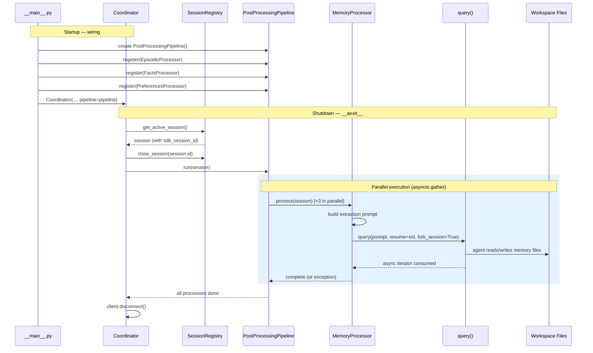
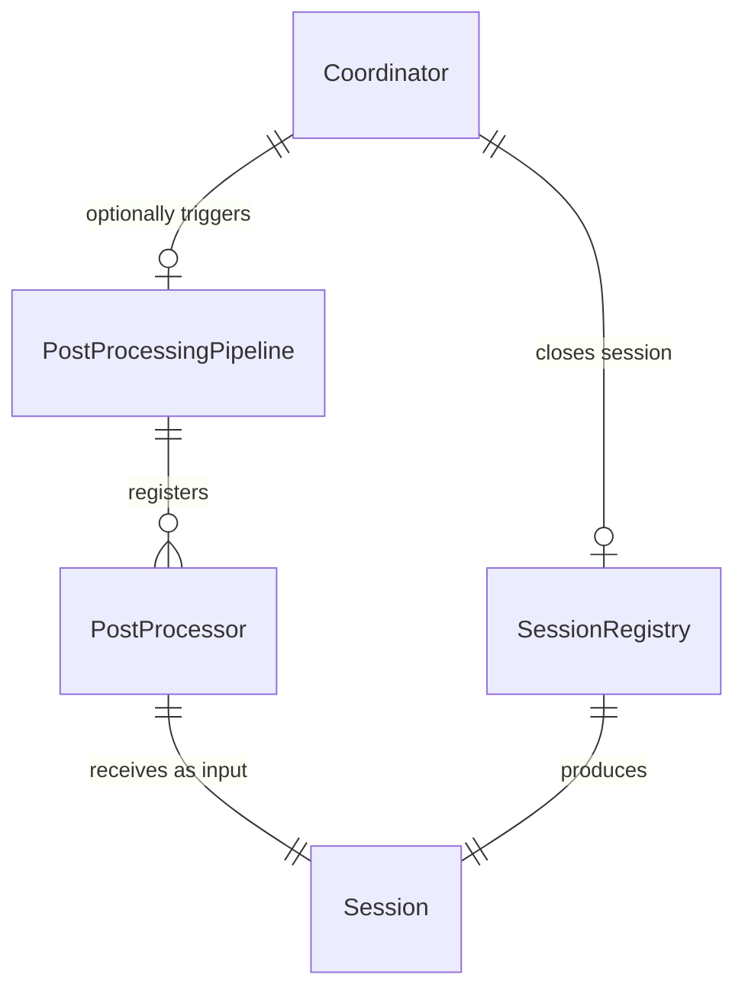

# Design: DLT-008 - Extract and store memories from conversations

**Delta Spec**: [../delta-specs/DLT-008.md](../delta-specs/DLT-008.md)
**Status**: Approved

## Purpose

This document explains the design rationale for this delta: the modeling choices, data flow, system behavior, and architectural approach.

After implementation, the "Detected Impacts" section will guide reconciliation into feature design docs.

## Problem Context

Conversations are ephemeral — once a session ends, the context is lost. The assistant needs a way to automatically extract and persist learnings so that future sessions can reference past interactions, known user information, and expressed preferences.

**Constraints:**
- Memory extraction happens after a conversation ends — it must not block the user or the shutdown flow
- The SDK's standalone `query()` function is the mechanism for session forking — it operates independently of the coordinator's `ClaudeSDKClient`
- All file I/O is performed by the forked LLM agent, not by processor code — processors are thin orchestration wrappers
- Memories are plain markdown files in the workspace — no database, human-readable and directly editable
- The post-processing pipeline must be reusable for future processors (DLT-018 core context updates)

**Interactions:**
- Coordinator (core-architecture): triggers pipeline on session close in `__aexit__`
- Sessions (sessions design): provides the `Session` dataclass with `sdk_session_id` for forking
- Workspace bootstrap: memory hook creates directory structure
- DLT-018 (future): will register its own processor with the same pipeline
- DLT-006 (future): memory context provider will consume the files produced here
- DLT-009 (future): semantic search will index the files produced here

## Design Overview

Two independent components work together: a reusable **post-processing pipeline** and a set of **memory processors** that plug into it.

```
┌──────────────────────────────────────────────────────────────┐
│                      __main__.py                               │
│                                                                │
│  pipeline = PostProcessingPipeline()                           │
│  pipeline.register(EpisodicProcessor(cwd))                     │
│  pipeline.register(FactsProcessor(cwd))                        │
│  pipeline.register(PreferencesProcessor(cwd))                  │
│                                                                │
│  Coordinator(..., pipeline=pipeline)                            │
└──────────────────────────────────────────────────────────────┘
                           │
                           ▼
┌──────────────────────────────────────────────────────────────┐
│                     Coordinator                                │
│                                                                │
│  __aexit__:                                                    │
│    1. session = registry.get_active_session()                  │
│    2. registry.close_session(session.id)                       │
│    3. if session.sdk_session_id:                               │
│         await pipeline.run(session)     ◄── triggers pipeline  │
│    4. client.disconnect()                                      │
└──────────────────────────────────────────────────────────────┘
                           │
                           ▼
┌──────────────────────────────────────────────────────────────┐
│              PostProcessingPipeline                             │
│              (src/tachikoma/post_processing.py)                 │
│                                                                │
│  run(session):                                                 │
│    async with lock:     ◄── serializes concurrent invocations  │
│      await gather(                                             │
│        processor1.process(session),                            │
│        processor2.process(session),                            │
│        processor3.process(session),                            │
│        return_exceptions=True                                  │
│      )                                                         │
└──────────────────────────────────────────────────────────────┘
                           │
              ┌────────────┼────────────┐
              ▼            ▼            ▼
         ┌─────────┐ ┌─────────┐ ┌─────────┐
         │Episodic │ │  Facts  │ │  Prefs  │
         │Processor│ │Processor│ │Processor│
         └────┬────┘ └────┬────┘ └────┬────┘
              │            │            │
              ▼            ▼            ▼
         query(prompt, resume=sdk_session_id, fork_session=True)
              │            │            │
              ▼            ▼            ▼
         memories/    memories/    memories/
         episodic/    facts/       preferences/
```

The **PostProcessingPipeline** is a generic mechanism — it knows nothing about memory. It accepts any `PostProcessor` subclass and runs them in parallel with error isolation. It lives in its own module (`post_processing.py`) so future deltas (DLT-018) can register processors without touching memory code.

Each **memory processor** is a thin ABC subclass that builds an extraction prompt and calls the standalone `fork_and_consume()` helper. The forked agent has full workspace access and autonomously reads, creates, updates, or deletes memory files — the processor code performs no file I/O.

## Shape

| Part | Mechanism | Flag |
|------|-----------|:----:|
| **S1** | **Post-processing pipeline** — A `PostProcessingPipeline` class in `src/tachikoma/post_processing.py`. Accepts registered `PostProcessor` instances, runs them all in parallel via `asyncio.gather(return_exceptions=True)`. Takes a `Session` object as input. Logs individual processor failures (per DES-002) without failing the pipeline. Uses `asyncio.Lock` to serialize concurrent pipeline invocations (forward-looking — for v1, at most one concurrent invocation occurs per shutdown). | |
| **S2** | **Pipeline integration with coordinator** — Coordinator receives the pipeline as an optional dependency (like `SessionRegistry`). In `__aexit__`, the coordinator captures the active session reference via `get_active_session()` BEFORE calling `close_session()` (which clears the internal reference). If the captured session has a valid `sdk_session_id`, the coordinator awaits `pipeline.run(session)` wrapped in a try/except that logs errors per DES-002 without propagating. Pipeline uses the standalone `query()` function (independent of `ClaudeSDKClient`), so it runs before SDK client disconnect. | |
| **S3** | **Post-processor ABC and fork helper** — An abstract base class `PostProcessor` in `post_processing.py` with a single abstract method: `async def process(session: Session) -> None`. The ABC defines only the interface contract — no SDK coupling. A separate standalone async function `fork_and_consume(session, prompt, cwd)` in the same module provides the shared forking logic: calls `query(prompt, options=ClaudeAgentOptions(cwd=cwd), resume=session.sdk_session_id, fork_session=True)` and fully consumes the async iterator. Memory processors call this helper from their `process()` implementations. Future processors (e.g., DLT-018, DLT-020) can use different SDK interaction patterns without inheriting forking behavior. | |
| **S4** | **Episodic memory processor** — `EpisodicProcessor(PostProcessor)` in `memory/episodic.py`. Contains the extraction prompt as a module-level constant. Prompt directs the agent to read `memories/episodic/`, analyze the conversation, and create or update date-stamped summary files (`YYYY-MM-DD.md`). Consolidate same-day entries. Creating nothing is valid. | |
| **S5** | **Facts memory processor** — `FactsProcessor(PostProcessor)` in `memory/facts.py`. Contains the extraction prompt as a module-level constant. Prompt directs the agent to read `memories/facts/`, identify new factual information, and create, update, or delete topic-named files. Creating nothing is valid. | |
| **S6** | **Preferences memory processor** — `PreferencesProcessor(PostProcessor)` in `memory/preferences.py`. Contains the extraction prompt as a module-level constant. Prompt directs the agent to read `memories/preferences/`, identify expressed preferences, and create, update, or delete topic-named files. Creating nothing is valid. | |
| **S7** | **Memory bootstrap hook** — `memory_hook` in `memory/hooks.py`. Creates `memories/`, `memories/episodic/`, `memories/facts/`, and `memories/preferences/` on first run (idempotent). Registered after workspace and context hooks in `__main__.py`. Follows subsystem-owned hook pattern from DLT-005. | |
| **S8** | **Pipeline wiring in `__main__.py`** — Entry point creates `PostProcessingPipeline`, registers the three memory processors, and passes the pipeline to the Coordinator constructor. Memory processors receive `cwd=workspace_path` for the forked agent's working directory. | |

### Flagged Unknowns

None.

## Components

### Implementation Structure

| Layer/Component | Responsibility | Key Decisions |
|-----------------|----------------|---------------|
| `src/tachikoma/post_processing.py` | `PostProcessor` ABC (interface only), `PostProcessingPipeline` class, `fork_and_consume` standalone helper | Separate module from memory; reusable by DLT-018; ABC has no SDK coupling; fork helper uses standalone `query()` |
| `src/tachikoma/memory/__init__.py` | Re-exports public API: `EpisodicProcessor`, `FactsProcessor`, `PreferencesProcessor`, `memory_hook` | Clean public API for the memory package |
| `src/tachikoma/memory/hooks.py` | `memory_hook`: creates `memories/` directory structure | Subsystem-owned hook pattern (DLT-005); registered after context hook |
| `src/tachikoma/memory/episodic.py` | `EpisodicProcessor(PostProcessor)` + `EPISODIC_PROMPT` constant | Prompt co-located with processor logic |
| `src/tachikoma/memory/facts.py` | `FactsProcessor(PostProcessor)` + `FACTS_PROMPT` constant | Prompt co-located with processor logic |
| `src/tachikoma/memory/preferences.py` | `PreferencesProcessor(PostProcessor)` + `PREFERENCES_PROMPT` constant | Prompt co-located with processor logic |
| `src/tachikoma/coordinator.py` | Wraps `ClaudeSDKClient`; now accepts optional `pipeline` parameter | Triggers pipeline in `__aexit__` after session close, before SDK disconnect |
| `src/tachikoma/__main__.py` | Entry point: creates pipeline, registers processors, passes to Coordinator | Hook registration: workspace → memory → sessions (context hook added when DLT-005 is implemented) |

### Cross-Layer Contracts



**Integration Points:**
- Coordinator ↔ Pipeline: `pipeline.run(session)` in `__aexit__`, after session close
- Pipeline ↔ Processors: `processor.process(session)` called in parallel via `asyncio.gather`
- Processors ↔ SDK: `query(prompt, resume=session.sdk_session_id, fork_session=True)` — standalone function, independent of `ClaudeSDKClient`
- Forked agents ↔ Workspace: agents read/write markdown files in `memories/` subdirectories
- `__main__.py` ↔ Pipeline: creates pipeline, registers processors, passes to Coordinator
- Bootstrap ↔ Memory hook: `memory_hook` creates directory structure on startup

**Error contract:**
- Individual processor failures are caught by `asyncio.gather(return_exceptions=True)` and logged per DES-002
- Pipeline failures in the coordinator are logged but never propagate — they don't block shutdown
- The pipeline itself serializes concurrent invocations via `asyncio.Lock` (though for v1, only one invocation happens per shutdown)

### Shared Logic

- **`PostProcessor` ABC** (`post_processing.py`): shared interface between all processors (memory and future DLT-018). Defines only the `process()` contract.
- **`fork_and_consume` function** (`post_processing.py`): standalone helper encapsulating the SDK `query()` forking pattern. Used by memory processors; available to future processors that need session forking.
- **`Session` dataclass** (`sessions/model.py`): shared input to the pipeline — processors read `sdk_session_id` from it.

## Modeling

The domain model is minimal — this delta introduces no persistent entities or database tables. Memory files are unstructured markdown managed entirely by the forked LLM agents.

```
PostProcessingPipeline
├── _processors: list[PostProcessor]     (registered processors)
├── _lock: asyncio.Lock                  (serializes concurrent runs)
└── run(session: Session) → None         (parallel execution)

PostProcessor (ABC)
└── process(session: Session) → None     (abstract — subclass implements)

fork_and_consume(session, prompt, cwd) → None  (standalone helper — shared forking logic)

EpisodicProcessor(PostProcessor)
├── _cwd: Path                           (workspace path for forked agent)
└── EPISODIC_PROMPT: str                 (extraction instructions)

FactsProcessor(PostProcessor)
├── _cwd: Path
└── FACTS_PROMPT: str

PreferencesProcessor(PostProcessor)
├── _cwd: Path
└── PREFERENCES_PROMPT: str
```

**Relationships:**



## Data Flow

### Pipeline trigger flow (coordinator shutdown)

```
1. Coordinator.__aexit__ fires (clean shutdown or exception)
2. Coordinator captures active session via registry.get_active_session()
   (must capture BEFORE close_session, which clears the internal reference)
3. Coordinator calls registry.close_session(session.id)
4. If captured session has sdk_session_id AND pipeline is not None:
   a. Coordinator calls pipeline.run(session) inside try/except
   b. On exception: log error per DES-002, continue to disconnect
5. Coordinator disconnects SDK client
```

### Pipeline execution flow

```
1. pipeline.run(session) acquires asyncio.Lock
2. For each registered processor, creates a coroutine: processor.process(session)
3. Runs all coroutines via asyncio.gather(return_exceptions=True)
4. Iterates results:
   a. If result is an Exception → log error with processor name (DES-002)
   b. If result is None → processor succeeded (no action needed)
5. Releases lock
```

### Memory processor flow (per processor)

```
1. processor.process(session) is called
2. Processor builds its extraction prompt (module-level constant)
3. Calls fork_and_consume(session, prompt, self._cwd):
   a. Creates ClaudeAgentOptions(cwd=self._cwd)
   b. Calls query(prompt, options=options, resume=session.sdk_session_id, fork_session=True)
   c. Async iterates over the returned generator to consume all messages
   d. The forked agent (LLM) autonomously:
      - Reads existing files in its memory subdirectory
      - Analyzes the conversation history (available via the forked session)
      - Creates, updates, or deletes memory files as needed
      - May decide no changes are needed (valid outcome)
4. Once the async iterator is exhausted, the forked session ends
```

### Startup wiring flow

```
1. __main__.py creates SettingsManager, Bootstrap
2. Registers hooks: workspace → memory → sessions
   (context hook will be added between workspace and memory when DLT-005 is implemented)
3. Runs bootstrap (memory_hook creates memories/ directories)
4. Creates PostProcessingPipeline()
5. Registers processors:
   - pipeline.register(EpisodicProcessor(cwd=workspace_path))
   - pipeline.register(FactsProcessor(cwd=workspace_path))
   - pipeline.register(PreferencesProcessor(cwd=workspace_path))
6. Creates Coordinator(..., registry=registry, pipeline=pipeline)
7. Enters coordinator async context, starts channel
8. finally: disposes session repository engine
```

## Key Decisions

### Pipeline separate from memory

**Choice**: `PostProcessingPipeline` and `PostProcessor` live in `src/tachikoma/post_processing.py`, separate from the `memory/` package.
**Why**: The spec explicitly requires reusability (R1, R7) — DLT-018 will register a core-context-update processor. Separating the mechanism from the domain follows the same pattern as `bootstrap.py` (mechanism) vs `workspace.py`/`context.py`/`sessions/hooks.py` (subsystem hooks).
**Sources**: Spec R1 ("reusable, pluggable post-processing pipeline"), R7 ("adding new post-processors without modifying the core pipeline code"); DLT-005 established the mechanism-vs-subsystem separation pattern.
**Options Researched**: Single `memory/` package containing everything (simpler upfront but couples the reusable pipeline to memory), pipeline as its own module.
**Why This Over Alternatives**: Consistent with existing separation patterns; avoids DLT-018 importing from a `memory/` package to get the pipeline interface.

**Consequences**:
- Pro: Clean separation — pipeline is domain-agnostic
- Pro: DLT-018 imports from `post_processing.py`, not `memory/`
- Pro: Consistent with bootstrap mechanism-vs-hook pattern
- Con: One more top-level module (minor)

### Coordinator owns the pipeline trigger

**Choice**: Coordinator receives the pipeline as an optional dependency and triggers it in `__aexit__` after closing the session.
**Why**: Mirrors how `SessionRegistry` is already integrated — the coordinator has optional dependencies that it calls at lifecycle boundaries. The coordinator already manages session state internally, so it's the natural place to trigger post-processing on session close.
**Sources**: Existing coordinator design (optional `registry` parameter); spec R1.1 ("triggered when a session closes").
**Options Researched**: External orchestration in `__main__.py` (cleaner separation but requires exposing session state); coordinator-owned trigger (simpler, follows existing pattern).
**Why This Over Alternatives**: External orchestration would require the coordinator to expose closed session info, adding coordination complexity. The coordinator already knows when sessions close.

**Consequences**:
- Pro: Consistent with existing registry integration pattern
- Pro: Coordinator controls the full shutdown sequence
- Con: Coordinator gains another optional dependency (acceptable — it's the lifecycle owner)

### ABC for post-processor interface with standalone fork helper

**Choice**: `PostProcessor` as an abstract base class with only the `process()` abstract method. The shared forking logic lives in a separate standalone `fork_and_consume()` function in `post_processing.py`, not as a method on the ABC.
**Why**: The ABC defines the interface contract — any processor must implement `process(session)`. The `fork_and_consume` helper is a convenience for processors that need to fork SDK sessions (all three memory processors, and likely DLT-018). Keeping it standalone avoids coupling the ABC to the SDK's `query()` function, so future processors (e.g., DLT-020 git integration) can use different SDK interaction patterns without inheriting irrelevant behavior.
**Sources**: Python `abc` module documentation; existing codebase uses both plain callables (`BootstrapHook`) and classes (`SessionRegistry`, `SessionRepository`); asyncio best practices for parallel task execution with `asyncio.gather(return_exceptions=True)`.
**Options Researched**: Plain callable type alias (simplest, matches `BootstrapHook`), `typing.Protocol` (structural typing), ABC with `_fork_and_consume` as method (couples ABC to SDK), ABC with standalone helper (decoupled).
**Why This Over Alternatives**: The callable approach lacks structure. Protocol works structurally but is less discoverable. ABC with the helper as a method couples the generic pipeline interface to a specific SDK interaction pattern. ABC with standalone helper keeps the interface generic while still sharing the forking logic.

**Consequences**:
- Pro: `PostProcessor` ABC is truly generic — no SDK coupling
- Pro: `fork_and_consume` is available to any processor that needs it
- Pro: Future processors (DLT-020) can implement `process()` without inheriting forking behavior
- Con: Slightly less discoverable than a method (processors must know to import the helper)

### Processor-per-file with co-located prompts

**Choice**: Each memory processor lives in its own file (`episodic.py`, `facts.py`, `preferences.py`) with the extraction prompt defined as a module-level constant in the same file.
**Why**: Co-locating the prompt with the processor logic keeps related concerns together. When iterating on extraction quality (DLT-017 eval suite), developers modify one file per memory type. Each file is self-contained and independently understandable.
**Options Researched**: Inline prompts in processor code (co-located), external markdown files in workspace (user-editable), dedicated `prompts.py` module (separated).
**Why This Over Alternatives**: External markdown files add runtime file I/O complexity for what is an implementation concern, not a user-facing setting. A dedicated `prompts.py` module separates things that change together. Co-located per-file is the simplest structure that keeps each processor self-contained.

**Consequences**:
- Pro: Self-contained files — each processor is fully understandable in isolation
- Pro: Simple structure — no extra modules or file loading
- Con: Prompt changes require code changes (acceptable — prompts are developer-managed)

### Pipeline trigger timing — after session close, before SDK disconnect

**Choice**: The pipeline runs in `__aexit__` after `registry.close_session()` but before `client.disconnect()`.
**Why**: The pipeline uses the standalone `query()` function (not the `ClaudeSDKClient`), so it doesn't depend on the client connection. However, running before disconnect maintains a clean ordering: session lifecycle operations complete fully before the SDK client is torn down. The session must be closed first so the pipeline receives a session with `ended_at` set and the registry is in a consistent state.

**Consequences**:
- Pro: Clean ordering — session close → post-processing → SDK disconnect
- Pro: Pipeline is independent of SDK client state (uses standalone `query()`)
- Con: Adds latency to shutdown (acceptable — extraction runs in parallel and is bounded by LLM response time)

## System Behavior

### Scenario: Normal shutdown with conversation history

**Given**: A conversation session exists with a valid `sdk_session_id`
**When**: The coordinator's `__aexit__` fires
**Then**: The session is closed via the registry. The pipeline runs all three memory processors in parallel. Each forks the session, sends its extraction prompt, and the forked agent reads/writes memory files. After all processors complete, the SDK client disconnects.
**Rationale**: This is the primary path — every clean shutdown with a meaningful conversation triggers memory extraction.

### Scenario: Shutdown without SDK session ID

**Given**: A session was created but no `Result` event was received (e.g., immediate crash after first message)
**When**: The coordinator's `__aexit__` fires
**Then**: The session is closed via the registry, but since `sdk_session_id` is None, the pipeline is NOT triggered. Shutdown proceeds directly to SDK disconnect.
**Rationale**: Without an SDK session ID, there's no session to fork. The spec AC explicitly covers this: "the pipeline skips processing and logs a warning."

### Scenario: One processor fails

**Given**: Three processors are running in parallel
**When**: The facts processor's `query()` call fails (e.g., network error, CLI process crash)
**Then**: `asyncio.gather(return_exceptions=True)` captures the exception as a return value. The episodic and preferences processors complete normally. The pipeline logs the facts processor failure per DES-002 and returns. No exception propagates.
**Rationale**: Spec R1.3 requires individual failures to be isolated. `return_exceptions=True` ensures all processors get a chance to complete.

### Scenario: Pipeline already running when new invocation arrives

**Given**: A previous pipeline invocation is still in progress
**When**: Another session close triggers `pipeline.run()`
**Then**: The second invocation awaits the `asyncio.Lock`, then runs after the first completes.
**Rationale**: Spec AC requires serialization. For v1 this is unlikely (single-user, sessions close one at a time), but the lock ensures correctness when boundary detectors (DLT-004, DLT-026) are added later.

### Scenario: Trivial conversation (user said very little)

**Given**: A session closes with minimal content
**When**: The pipeline runs all processors
**Then**: Each processor forks the session and sends its prompt. The forked agents analyze the conversation and independently determine there's nothing meaningful to extract. No files are created. This is a valid outcome — the spec explicitly states "creating nothing is valid."
**Rationale**: The intelligence is in the LLM prompts, not in the pipeline code. Processors don't pre-filter.

### Scenario: Pipeline failure during shutdown

**Given**: The pipeline raises an unexpected exception (not an individual processor failure, but the pipeline mechanism itself — e.g., `asyncio.Lock` corruption)
**When**: The coordinator catches the exception
**Then**: The error is logged per DES-002 and shutdown proceeds to SDK disconnect. The pipeline failure never propagates to the caller or blocks shutdown.
**Rationale**: Post-processing is important but not critical to shutdown. Graceful degradation is preferred, consistent with how session tracking failures are handled.

### Scenario: Multiple conversations on the same day (episodic)

**Given**: Two conversations close on 2026-03-13
**When**: The episodic processor runs for the second conversation
**Then**: The extraction prompt instructs the agent to consolidate entries for the same day rather than creating duplicates. The agent reads the existing `2026-03-13.md` and appends or rewrites the summary to include both conversations.
**Rationale**: Spec R3.1 requires consolidation over time. The prompt guides this behavior; the agent has full context from the forked session plus the existing file.

### Scenario: User manually edits a memory file

**Given**: A user edits `memories/facts/work-info.md` between sessions
**When**: The next facts processor runs
**Then**: The forked agent reads the user-edited file and respects the changes. If new information from the conversation contradicts the user's edit, the agent updates accordingly (per its extraction prompt instructions).
**Rationale**: Spec R5 ensures human readability and editability. The agent always reads existing files before making changes.

## Open Questions

None — all design decisions resolved.

---

## Detected Impacts

### Affected Feature Designs
- **docs/feature-designs/agent/core-architecture.md** — Modifies: Coordinator gains optional `pipeline` parameter; `__aexit__` triggers pipeline after session close before SDK disconnect; standalone `query()` function usage established
- **docs/feature-designs/agent/sessions.md** — Modifies: Session close now triggers post-processing pipeline; `Session` dataclass consumed by pipeline as input
- **docs/feature-designs/agent/workspace-bootstrap.md** — Adds: New memory bootstrap hook registered after context hook; hook registration order updated

### Notes for Reconciliation
- Core architecture design needs to document the `pipeline` parameter on Coordinator, updated `__aexit__` flow, and standalone `query()` usage
- Core architecture startup/shutdown flow diagrams need updating to include pipeline trigger
- Sessions design note about "post-processing pipelines (future)" should be updated to reflect actual implementation
- Workspace bootstrap design needs `memory_hook` added to hook registration order
- A new feature spec/design domain may be needed for "memory" capabilities under `docs/feature-specs/` and `docs/feature-designs/`
- DLT-006 (pre-processing with memory context) will consume the memory files produced here
- DLT-009 (semantic search) will index the memory files produced here
- DLT-017 (eval: memory extraction quality) will test the processors built here
- DLT-018 (core context updates) will register its own processor with the same `PostProcessingPipeline`

## Notes

- Forked sessions have no `max_turns` or `max_budget_usd` limits for v1. The extraction prompts are designed to be focused (read existing files, analyze conversation, make targeted changes), so sessions should be naturally short. If cost becomes an issue, limits can be added to `ClaudeAgentOptions` in `_fork_and_consume` without changing the architecture.
- Memory extraction quality (precision, recall, accuracy of categorization) is an LLM behavioral concern. The prompts defined in each processor module are the primary lever for quality. Testing extraction quality is DLT-017's domain.
- The `fork_and_consume` helper fully consumes the async iterator returned by `query()`. This ensures the forked session ends cleanly and all agent actions (file writes) complete before the processor returns.
- The pipeline's `asyncio.Lock` serialization is forward-looking — for v1 with only shutdown-triggered runs, there's at most one concurrent invocation. When DLT-004/DLT-026 boundary detectors are added, concurrent session closes become possible.
- Hook registration order in `__main__.py`: workspace → memory → sessions. When DLT-005 is implemented, `context_hook` will slot between workspace and memory. Memory hook must come after workspace (needs the workspace directory) but doesn't depend on context files or session DB.
- The coordinator must capture the active session reference via `get_active_session()` BEFORE calling `close_session()`, since the registry clears `_active_session` on close. The captured `Session` object (with its `sdk_session_id`) is then passed to the pipeline.
