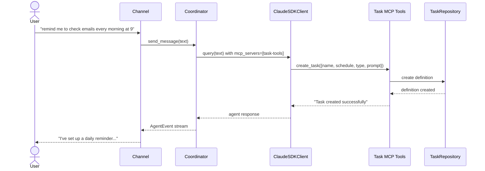
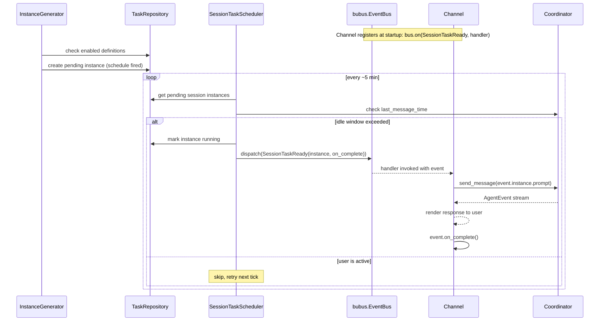
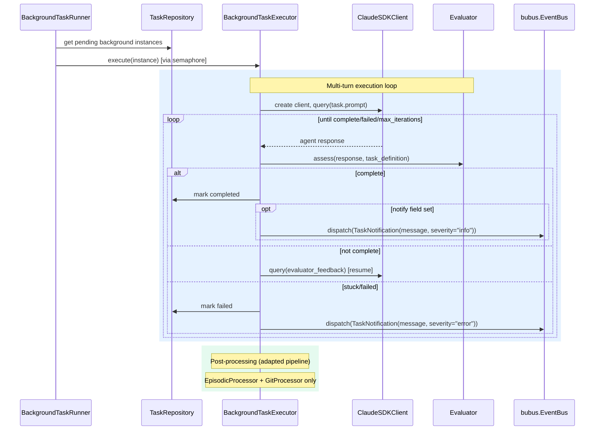
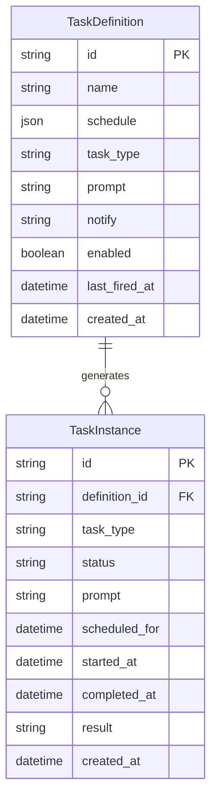
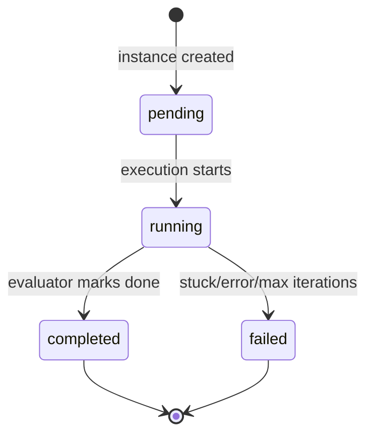

# Design: DLT-010 - Queue and process background tasks during idle time

**Delta Spec**: [../delta-specs/DLT-010.md](../delta-specs/DLT-010.md)
**Status**: Draft

## Purpose

This document explains the design rationale for this delta: the modeling choices, data flow, system behavior, and architectural approach.

After implementation, the "Detected Impacts" section will guide reconciliation into feature design docs.

## Problem Context

Tachikoma currently only responds to user-initiated messages — it has no mechanism for proactive behavior. The assistant needs the ability to create, schedule, and execute tasks autonomously: sending reminders, processing information, and following up on topics without the user manually triggering every action.

**Constraints:**
- The coordinator creates a fresh `ClaudeSDKClient` per `send_message()` call — there is no persistent agent session between messages
- Channels (Telegram/REPL) own the rendering loop — proactive messages must flow through the channel for delivery
- The post-processing pipeline is assembled once in `__main__.py` with a fixed set of processors — background tasks need a different processor selection
- SQLAlchemy async + aiosqlite is the established persistence pattern (ADR-007)
- Bootstrap hooks (DES-003) are the initialization mechanism for subsystems
- Schema migrations follow the Alembic pattern established in DLT-028

**Interactions:**
- Coordinator (`core-architecture`): gains `last_message_time` tracking and `mcp_servers` parameter for task CRUD tools
- Channels (`telegram`, `repl`): subscribe to typed events via `bubus.EventBus` for proactive session task delivery and notifications
- Post-processing pipeline (`post-processing-pipeline`): background tasks assemble a separate pipeline with selective processors (episodic + git only)
- Configuration (`config-system`): new `[tasks]` section for scheduler parameters
- Sessions (`sessions`): background task sessions are separate from the main conversation session

## Design Overview

Four concurrent async processes extend the existing architecture:

```
┌─────────────────────────────────────────────────────────────────────────┐
│                           __main__.py                                    │
│                                                                         │
│  ┌──────────────┐  ┌───────────────┐  ┌──────────────┐                 │
│  │ Instance      │  │ Session Task  │  │ Background   │                 │
│  │ Generator     │  │ Scheduler     │  │ Task Runner  │                 │
│  │ (async loop)  │  │ (async loop)  │  │ (async loop) │                 │
│  └───────┬──────┘  └───────┬───────┘  └──────┬───────┘                 │
│          │                 │                  │                          │
│          ▼                 │                  ▼                          │
│  ┌──────────────┐         │           ┌──────────────┐                 │
│  │ Task         │         │           │ Coordinator-  │                 │
│  │ Repository   │         ▼           │ like executor │                 │
│  │ (SQLite)     │  ┌───────────────┐  │ (SDK client)  │                 │
│  └──────────────┘  │ bubus         │  └──────┬───────┘                 │
│                    │ EventBus      │         │                          │
│                    │ (typed events)│◄────────┘                          │
│                    └───────┬───────┘                                    │
│                            │  dispatch/subscribe by event class         │
│                   ┌────────┴─────────┐                                  │
│                   │                  │                                   │
│                   ▼                  ▼                                   │
│            ┌──────────┐      ┌───────────┐                              │
│            │ Telegram │      │   REPL    │                              │
│            │ Channel  │      │ Channel   │                              │
│            └──────────┘      └───────────┘                              │
│                                                                         │
│  ┌───────────────────────────────────────────────────────────────┐      │
│  │                      Coordinator                               │      │
│  │  send_message() ← channels + session tasks (via event bus)    │      │
│  │  mcp_servers: task CRUD tools available in conversation       │      │
│  │  last_message_time: updated on each exchange                  │      │
│  └───────────────────────────────────────────────────────────────┘      │
└─────────────────────────────────────────────────────────────────────────┘
```

1. **Instance generator** — async loop that evaluates enabled task definitions against the current time via `cronsim`, creating pending task instances when schedules fire.

2. **Session task scheduler** — periodic async loop (~5 min) that queries pending session instances, checks idle state via `coordinator.last_message_time`, and pushes ready tasks onto an `asyncio.Queue` for channel consumption.

3. **Background task runner** — async loop that picks up pending background instances, executes them in isolated SDK sessions using a coordinator-like component, with an evaluator prompt loop assessing completion.

4. **Task MCP tools** — MCP server registered on the coordinator's `ClaudeAgentOptions.mcp_servers`, exposing task CRUD during live conversations.

## Shape

| Part | Mechanism | Flag |
|------|-----------|:----:|
| **S1** | Task definition SQLite table + SQLAlchemy model (name, schedule JSON, type, prompt, notify, enabled, last_fired_at) with Alembic migration revision | |
| **S2** | Task instance SQLite table + model (definition_id nullable, task_type, status, scheduled_for, started_at, completed_at, result, prompt) — nullable definition_id supports transient instances; `task_type` copied from definition at creation to enable direct queries without joins; Alembic migration revision | |
| **S3** | MCP tool server for task CRUD — `create_task_tools_server()` following `create_pending_signals_server` pattern, registered on coordinator's `ClaudeAgentOptions.mcp_servers` so tools are available during live conversation | |
| **S4** | Instance generator — async loop that evaluates enabled definitions via `cronsim` (timezone-aware), creates pending instances when schedule fires, skips if pending/running instance exists for same definition, updates last_fired_at, auto-disables one-shot definitions | |
| **S5** | Session task scheduler — periodic async loop (~5 min) that queries pending session instances, idle-gates via `last_message_time`, marks ready instances as running, and dispatches `SessionTaskReady` events onto the event bus for channel consumption | |
| **S6** | Session task channel integration — channel subscribes to `SessionTaskReady` events via `bus.on(SessionTaskReady, handler)`. The handler calls `coordinator.send_message()` with the task prompt, renders the response, and invokes the completion callback. Concurrent user messages during task processing are handled as steers. Channels can also use `bus.expect(SessionTaskReady, timeout=...)` for synchronous-style awaiting in the REPL input loop | |
| **S7** | Background task executor — extracts coordinator-like session management into a reusable component that manages `ClaudeSDKClient` lifecycle with `resume` for multi-turn conversation. Background executor extends this with: adapted system prompt, separate `PostProcessingPipeline` (episodic + git only), evaluator loop replacing user input. Concurrency gated by `asyncio.Semaphore` (default 3) | |
| **S8** | Background task evaluator — after each agent response, a lightweight prompt assesses output against the task definition: continue (inject feedback as next turn) / complete / fail. Detects stuck/looping agents by tracking response similarity. Max iterations configurable (default 10) | |
| **S9** | Transient notification delivery — on background task completion (with non-null `notify`) or failure, dispatch a `TaskNotification` event on the bus. Channel subscriber creates a transient session task instance and delivers it. Auto-cleanup from DB after successful delivery | |
| **S10** | Last message time tracking — coordinator-level `datetime` attribute updated on `send_message()` entry and response completion. Exposed as a property for idle gating by the session task scheduler | |
| **S11** | Bootstrap hook — `tasks_hook` in `tasks/hooks.py`: initializes task DB tables via Alembic `upgrade head`, starts instance generator, session task scheduler, and background task runner as `asyncio.Task`s, marks any previously-running instances as failed (crash recovery). Returns the event bus, task references, and repository via `bootstrap.extras`. Graceful shutdown: `__main__.py` `finally` block cancels all three async tasks, the runner marks in-progress instances as failed, and `bus.stop()` is called | |
| **S12** | Configuration section — `TaskSettings` model under `[tasks]` in config.toml: `idle_window` (default 300s), `check_interval` (default 300s), `max_iterations` (default 10), `max_concurrent_background` (default 3), `timezone` (default system tz) | |
| **S13** | Alembic migration setup — shared migration environment at `src/tachikoma/migrations/` (following DLT-028's pattern); initial baseline revision captures existing sessions schema, DLT-010 revision creates `task_definitions` and `task_instances` tables; `repository.initialize()` runs `alembic upgrade head` | |
| **S14** | Event bus — `bubus.EventBus` instance created at bootstrap, shared across all subsystems. Typed event classes: `SessionTaskReady(BaseEvent)` carrying task instance + completion callback, `TaskNotification(BaseEvent)` carrying notification message + severity. Subsystems subscribe via `bus.on(EventType, handler)` and publish via `bus.dispatch(event)`. New `bubus` dependency added to project | |

## Components

### Implementation Structure

| Layer/Component | Responsibility | Key Decisions |
|-----------------|----------------|---------------|
| `src/tachikoma/tasks/__init__.py` | Re-exports: `TaskRepository`, `tasks_hook`, `create_task_tools_server`, `TaskScheduler`, `BackgroundTaskRunner` | Clean public API for the tasks package |
| `src/tachikoma/tasks/model.py` | `TaskDefinition` and `TaskInstance` frozen dataclasses (domain types); `TaskDefinitionRecord` and `TaskInstanceRecord` ORM models; `TaskStatus` constant map; `TaskType` constant map; `ScheduleConfig` type (cron or one-shot) | Domain types stay frozen; ORM models internal to persistence; schedule stored as JSON column |
| `src/tachikoma/tasks/repository.py` | `TaskRepository` — async SQLAlchemy CRUD for definitions and instances; same pattern as `SessionRepository` (ADR-007); separate DB file (`tasks.db`) | Own DB file to avoid coupling with sessions DB; Alembic for migrations |
| `src/tachikoma/tasks/tools.py` | `create_task_tools_server()` — MCP server factory following `create_pending_signals_server` pattern; tools have closure over `TaskRepository`; `list_tasks`, `create_task`, `update_task`, `delete_task` with `cronsim` validation | Tools validate cron expressions via `CronSimError` at creation time |
| `src/tachikoma/tasks/events.py` | `SessionTaskReady(BaseEvent)` and `TaskNotification(BaseEvent)` — typed Pydantic event classes for the bubus event bus. `SessionTaskReady` carries `instance: TaskInstance` and `on_complete: Callable`. `TaskNotification` carries `message: str`, `source_task_id: str \| None`, and `severity: str` ("info" or "error") | Events are the contract between task subsystem and consumers; consumers never import repository |
| `src/tachikoma/tasks/scheduler.py` | `InstanceGenerator` — async loop evaluating definitions; `SessionTaskScheduler` — async loop dispatching `SessionTaskReady` events on the bus; both accept `TaskRepository`, `EventBus`, and config | Generator and scheduler are plain async functions started as `asyncio.Task`s |
| `src/tachikoma/tasks/executor.py` | `BackgroundTaskRunner` — async loop picking up pending background instances; `BackgroundTaskExecutor` — manages a single background task's SDK session lifecycle with evaluator loop; dispatches `TaskNotification` events on completion/failure; uses `asyncio.Semaphore` for concurrency | Extracts coordinator-like SDK client management for multi-turn background sessions |
| `src/tachikoma/tasks/hooks.py` | `tasks_hook` — bootstrap hook (DES-003): creates `EventBus`, creates DB, initializes repository, starts async loops, crash recovery; stores event bus, task references, and repository in `bootstrap.extras` | Subsystem-owned hook; idempotent; event bus created here and shared |
| `src/tachikoma/migrations/` | Alembic migration environment and revision scripts (shared across sessions and tasks); programmatic config (no `alembic.ini`); follows DLT-028 pattern | Single migration environment for all SQLAlchemy models |
| `src/tachikoma/config.py` | Extended with `TaskSettings` model: `idle_window`, `check_interval`, `max_iterations`, `max_concurrent_background`, `timezone` | Nested under `[tasks]` in config.toml |
| `src/tachikoma/coordinator.py` | Extended with: `last_message_time` property (updated on send_message entry and response completion); `mcp_servers` constructor parameter stored as `self._mcp_servers` and passed directly in `ClaudeAgentOptions(mcp_servers=...)` within `_build_options()` (not post-mutation) | Minimal coordinator changes — task subsystem is self-contained; `mcp_servers` follows same constructor pattern as `allowed_tools` and `agents` |

### Cross-Layer Contracts

**Task creation during conversation:**



**Session task injection via event bus:**



**Background task execution:**



**Integration Points:**
- Coordinator ↔ Task MCP tools: `mcp_servers` parameter on `ClaudeAgentOptions` in `_build_options()`
- Coordinator ↔ Scheduler: `last_message_time` property read by `SessionTaskScheduler`
- Channel ↔ Event bus: subscribes to `SessionTaskReady` and `TaskNotification` via `bus.on()`
- Background executor ↔ SDK: per-task `ClaudeSDKClient` with `resume` for multi-turn
- Background executor ↔ Event bus: dispatches `TaskNotification` on completion/failure
- Background executor ↔ Pipeline: separate `PostProcessingPipeline` with `EpisodicProcessor` + `GitProcessor`
- Bootstrap ↔ Task subsystem: `tasks_hook` creates `EventBus`, initializes DB, starts async loops, stores references in `extras`

**Error contract:**
- MCP tool errors: return `{"is_error": true, "content": [...]}` — agent sees error message and can retry
- Instance generator errors: logged, loop continues on next tick
- Session task scheduler errors: logged, loop continues on next tick
- Background task execution errors: instance marked `failed`, `TaskNotification` dispatched
- Event bus handler errors: bubus logs handler exceptions, event marked failed; instance stays pending for retry on next scheduler tick
- Repository errors: wrapped in `TaskRepositoryError`, logged at call sites

### Shared Logic

- **`TaskRepository`** (`tasks/repository.py`): shared by MCP tools (CRUD), instance generator (definition queries, instance creation), scheduler (instance queries), and executor (status updates). Async SQLAlchemy, same pattern as `SessionRepository`.
- **`TaskDefinition` / `TaskInstance` dataclasses** (`tasks/model.py`): frozen domain types shared across all components. ORM records are internal to the repository.
- **`bubus.EventBus`** (event bus): shared across all subsystems. Scheduler dispatches `SessionTaskReady`, executor dispatches `TaskNotification`, channels subscribe to both. Created in bootstrap, passed via `extras`. Future subsystems add new event types without modifying existing wiring.
- **`PostProcessingPipeline`**: reused for background tasks but with different processor registration (episodic + git only).

## Modeling

### TaskDefinition

```
TaskDefinition (frozen dataclass)
├── id: str                          (UUID)
├── name: str                        (human-readable label)
├── schedule: ScheduleConfig         (cron expression or one-shot datetime)
├── task_type: str                   ("session" or "background")
├── prompt: str                      (instruction for the agent)
├── notify: str | None               (notification template, null = silent)
├── enabled: bool                    (default True)
├── last_fired_at: datetime | None   (last time an instance was generated)
└── created_at: datetime             (creation timestamp)
```

### TaskInstance

```
TaskInstance (frozen dataclass)
├── id: str                          (UUID)
├── definition_id: str | None        (FK → task_definitions.id, null for transient)
├── task_type: str                   ("session" or "background", copied from definition)
├── status: str                      ("pending", "running", "completed", "failed")
├── prompt: str                      (copied from definition at creation time)
├── scheduled_for: datetime          (when the instance should execute)
├── started_at: datetime | None      (when execution began)
├── completed_at: datetime | None    (when execution finished)
├── result: str | None               (completion/failure summary)
└── created_at: datetime             (creation timestamp)
```

### ScheduleConfig

```
ScheduleConfig (frozen dataclass)
├── type: str                        ("cron" or "once")
├── expression: str | None           (cron expression, only when type="cron")
└── at: datetime | None              (target datetime, only when type="once")
```

### Entity relationships



Note: `TaskInstance.definition_id` is nullable — transient instances (notifications from background task results) have no parent definition.

### Task status lifecycle



## Data Flow

### Instance generation flow

```
1. Instance generator loop wakes up (~60s interval)
2. Query all enabled definitions from repository
3. For each definition:
   a. Parse schedule: CronSim(expr, last_fired_at or now, tz=configured_timezone)
   b. Check if next fire time ≤ now
   c. If yes, check no pending/running instance exists for this definition
   d. If clear, create TaskInstance(status="pending", task_type=definition.task_type, scheduled_for=fire_time)
   e. Update definition.last_fired_at = now
   f. If one-shot, set definition.enabled = false
4. Sleep until next tick
```

### Session task delivery flow

```
1. Session task scheduler loop wakes up (~5 min interval)
2. Query pending session task instances (status="pending", task_type="session")
3. For each instance:
   a. Read coordinator.last_message_time
   b. If (now - last_message_time) < idle_window: skip, retry next tick
   c. If idle: mark instance running, dispatch SessionTaskReady(instance, on_complete) on bus
4. Channel's SessionTaskReady handler (registered via bus.on(SessionTaskReady, handler)):
   a. Receive SessionTaskReady event
   b. Call coordinator.send_message(event.instance.prompt)
   c. Consume and render AgentEvent stream
   d. If user sends a message during processing: treated as steer()
   e. Call event.on_complete() — marks instance completed in repository
5. Sleep until next tick
```

### Background task execution flow

```
1. Background task runner loop wakes up (~30s interval)
2. Query pending background task instances
3. For each instance (gated by asyncio.Semaphore, max_concurrent=3):
   a. Mark instance as running
   b. Create BackgroundTaskExecutor with:
      - Adapted system prompt (task context + instructions)
      - Adapted pipeline (EpisodicProcessor + GitProcessor only)
      - Task instance prompt
   c. Executor creates ClaudeSDKClient, calls query(prompt)
   d. Evaluator loop (max_iterations):
      i.   Consume agent response via receive_response()
      ii.  Evaluator prompt assesses: complete / continue / stuck
      iii. If continue: call client.query(feedback) using resume
      iv.  If complete: break loop
      v.   If stuck or max iterations: mark failed, break
   e. Run adapted post-processing pipeline on the executor's session
   f. If complete and notify is set: dispatch TaskNotification(message, severity="info") on bus
   g. If failed: dispatch TaskNotification(message, severity="error") on bus
4. Sleep until next tick
```

### Task MCP tool flow

```
1. Coordinator builds ClaudeAgentOptions with mcp_servers={"task-tools": server}
2. Agent receives user request like "remind me to check emails at 9am"
3. Agent calls create_task tool with name, schedule, type, prompt
4. Tool validates:
   a. Required fields present (name, schedule, type, prompt)
   b. Type is "session" or "background"
   c. Schedule is valid: CronSim(expr, now) doesn't raise CronSimError
      or one-shot datetime is in the future
5. Tool calls repository.create_definition()
6. Returns success/error message to agent
7. Agent confirms to user
```

## Key Decisions

### General-purpose event bus via bubus

**Choice**: Use `bubus.EventBus` as a general-purpose, typed event bus shared across all subsystems. Events are Pydantic `BaseEvent` subclasses dispatched by class type. A single `EventBus` instance is created at bootstrap and passed to all subsystems that need it.
**Why**: The task subsystem needs to communicate with channels (session task delivery), the background executor needs to signal notifications, and future subsystems (memory updates, session lifecycle, proactive triggers) will need the same decoupling. A general-purpose event bus avoids point-to-point wiring between subsystems. `bubus` provides: typed events (subscribe by class), async-native `dispatch()`, `expect()` for awaiting specific events with filtering and timeout, FIFO ordering guarantees, event parent-child tracking, and optional middleware (logging, WAL persistence).
**Sources**: bubus library (PyPI: `bubus`, GitHub: `browser-use/bubus`).
**Alternatives Considered**:
- `asyncio.Queue` per use case: simple but doesn't scale — each new producer/consumer pair needs a new queue, no typed events, no fan-out to multiple subscribers
- blinker: battle-tested (Flask/Pallets) but string-based signals only, no typed event dispatch, callback-only (no await pattern)
- Custom typed event bus: ~50-80 lines, full control, but would need to reimplement features bubus already provides (FIFO, middleware, expect, history)

**Consequences**:
- Pro: Any subsystem can publish/subscribe without knowing about others — fully decoupled
- Pro: Typed events (Pydantic models) — subscribe by class, not string names
- Pro: `expect()` enables channels to await specific event types with filtering and timeout
- Pro: Event history and middleware (logging, WAL) available for debugging and reliability
- Pro: Future subsystems plug in by defining new event types — no wiring changes
- Con: Adds `bubus` dependency (Pydantic already a project dependency via `pydantic-settings`)
- Con: Relatively new library (96 stars) — but code is straightforward and actively maintained

### Coordinator-like executor for background tasks (generalized SDK session management)

**Choice**: Extract the core SDK session management pattern (create `ClaudeSDKClient`, `query()`, `receive_response()`, `resume`) into a reusable component. The background task executor extends this with: adapted system prompt, evaluator loop replacing user input, adapted post-processing pipeline.
**Why**: Background tasks behave like main conversation sessions but with the evaluator replacing the user role. The coordinator already implements the pattern of creating per-message `ClaudeSDKClient` with `resume` for continuity — the same pattern applies to background task multi-turn execution. Extracting this avoids duplicating SDK lifecycle management.
**Sources**: Current coordinator implementation (`coordinator.py`), DES-005 (generator consumption pattern).
**Alternatives Considered**:
- Standalone `query()` per turn: loses conversation continuity between evaluator turns — each turn starts fresh
- Full coordinator reuse: the coordinator has too many responsibilities (session registry, boundary detection, pre-processing) that don't apply to background tasks

**Consequences**:
- Pro: Multi-turn background tasks maintain conversation continuity via `resume`
- Pro: Reuses proven SDK lifecycle patterns
- Pro: Adapted pipeline is cleanly constructed — just different processor registration
- Con: New component to maintain, though it's simpler than the full coordinator

### User messages as steers during session task processing

**Choice**: When a user sends a message while a session task is being processed through `send_message()`, treat it as a `steer()` call on the current exchange.
**Why**: The `steer()` mechanism already exists on the coordinator — it queues a user message mid-stream and the `send_message()` loop processes it via an additional `receive_response()` call. This is the simplest approach that leverages existing infrastructure and gives the user natural interaction with the proactive message.
**Alternatives Considered**:
- Abort session task: more complex, requires cancellation logic and instance state management for retry
- Queue user message: adds latency for the user, worse UX

**Consequences**:
- Pro: Zero new infrastructure — reuses existing `steer()` mechanism
- Pro: Natural UX — user can respond to the proactive message
- Con: The agent sees both the task prompt and user message in the same turn, which could be confusing for complex tasks

### MCP tools on coordinator (not just forked sessions)

**Choice**: Register the task tools MCP server on the coordinator's `ClaudeAgentOptions.mcp_servers`, making them available in every conversation turn.
**Why**: The spec requires the agent to create/manage tasks during live conversations (R8). The existing MCP tool pattern (`create_pending_signals_server`) creates `McpSdkServerConfig` instances — the same approach works for coordinator-level registration via `ClaudeAgentOptions.mcp_servers`. The coordinator's `_build_options()` gains an `mcp_servers` parameter.
**Sources**: `context/tools.py` (`create_pending_signals_server` pattern), `claude_agent_sdk` (`ClaudeAgentOptions.mcp_servers`).
**Alternatives Considered**:
- Only in forked sessions: contradicts R8 — agent needs tools during conversation, not post-processing

**Consequences**:
- Pro: Agent can manage tasks naturally during conversation
- Pro: Follows established MCP tool pattern
- Con: Tools are available in every turn (minor overhead — the agent only calls them when relevant)

### Separate database file for tasks

**Choice**: Store task definitions and instances in `tasks.db`, separate from `sessions.db`.
**Why**: The task subsystem is independent of the sessions subsystem — they share no tables or queries. Separate DB files enable independent lifecycle management (the tasks DB can be reset without affecting session history) and avoid lock contention between the two subsystems.
**Alternatives Considered**:
- Shared DB with sessions: simpler single-file setup but couples unrelated concerns

**Consequences**:
- Pro: Independent lifecycle — task DB can be reset/migrated independently
- Pro: No lock contention between session and task operations
- Con: Two DB files to manage and dispose on shutdown

### Alembic for schema migrations (following DLT-028)

**Choice**: Use Alembic for schema migrations, following the pattern established in DLT-028.
**Why**: DLT-028 introduces Alembic to the project, replacing the hand-rolled `migrate()` pragma-check pattern. DLT-010 follows the same approach for the task tables. If DLT-010 lands before DLT-028, it introduces Alembic itself; if DLT-028 lands first, DLT-010 adds migration revisions to the existing environment.
**Sources**: DLT-028 design (S9), Alembic documentation for async SQLAlchemy.

**Consequences**:
- Pro: Proper versioned migrations with rollback capability
- Pro: Consistent with DLT-028's migration strategy
- Pro: Scales as more deltas add schema changes
- Con: Dependency on Alembic (already planned by DLT-028)

### Evaluator as a separate lightweight query (not in-session)

**Choice**: The evaluator runs as a separate standalone `query()` call (low effort, Opus) outside the background task's `ClaudeSDKClient` session. It receives the task definition prompt and the agent's latest response text, and returns structured JSON via prompt-level instructions (`{"status": "complete" | "continue" | "stuck", "feedback": "..."}`).
**Why**: Running the evaluator inside the background task's session would contaminate the task conversation with evaluation meta-prompts. A separate lightweight query keeps the evaluation isolated and uses minimal tokens (low effort mode). Structured JSON is obtained via prompt-level instructions (not `output_format`) to keep the evaluator as a simple standalone call.
**Alternatives Considered**:
- In-session evaluation: pollutes the task agent's context with meta-discussion
- SDK `output_format`: adds complexity for a simple assessment call

**Consequences**:
- Pro: Clean separation — evaluator doesn't pollute the task agent's conversation
- Pro: Lightweight — low effort, small prompt
- Con: Separate SDK query call per iteration (acceptable cost for reliability)

### Task instance status managed by scheduler, not channel

**Choice**: The `SessionTaskScheduler` marks instances as `running` before dispatching `SessionTaskReady` on the event bus, and includes a completion callback (`on_complete`) on the event object. The channel calls `event.on_complete()` after delivery — the channel never directly imports or uses `TaskRepository`.
**Why**: Channels should remain decoupled from the task subsystem. The scheduler owns the instance lifecycle and provides a simple callback on the event. The `SessionTaskReady` event carries the instance and callback, keeping the channel's responsibility to just calling `send_message()` and invoking `on_complete()`.
**Alternatives Considered**:
- Channel imports TaskRepository: breaks channel decoupling from task subsystem
- Scheduler polls for completion: adds complexity and latency

**Consequences**:
- Pro: Channel stays decoupled — only knows about events and callbacks, not repositories
- Pro: Instance lifecycle fully owned by the task subsystem
- Con: Queue carries slightly richer payloads (instance + callback tuple)

## System Behavior

### Scenario: User creates a recurring session task

**Given**: A conversation is active
**When**: The user says "remind me to check emails every morning at 9"
**Then**: The agent calls the `create_task` MCP tool with `{name: "check-emails", schedule: {type: "cron", expression: "0 9 * * *"}, task_type: "session", prompt: "Remind the user to check their emails. Be brief and friendly."}`. The tool validates the cron expression, persists the definition, and returns success. The agent confirms to the user.

### Scenario: Session task fires and user is idle

**Given**: A "check-emails" task definition exists, the instance generator created a pending instance at 9:00 AM, the user's last message was 20 minutes ago
**When**: The session task scheduler's periodic check runs
**Then**: The scheduler finds the pending session instance, checks `coordinator.last_message_time` (20 min ago > 5 min idle window), marks it running, and dispatches `SessionTaskReady` on the event bus. The channel's registered handler receives the event, calls `coordinator.send_message("Remind the user to check their emails...")`, renders the agent's response, and calls `event.on_complete()`.

### Scenario: Session task fires but user is active

**Given**: A pending session task instance exists, but the user sent a message 2 minutes ago
**When**: The session task scheduler checks
**Then**: The idle window hasn't passed (2 min < 5 min). The instance is skipped. It will be retried at the next scheduler tick (~5 min later).

### Scenario: User sends a message during session task delivery

**Given**: A session task is being processed via `coordinator.send_message()` and the channel is rendering the response
**When**: The user sends a message
**Then**: The channel calls `coordinator.steer(user_message)`. The steered message is queued by the CLI and processed after the current task response completes. Both the task response and the user's follow-up are rendered through the same `send_message()` stream.

### Scenario: One-shot task fires and auto-disables

**Given**: A one-shot task definition with `schedule: {type: "once", at: "2026-03-22T10:00:00"}` and `enabled=true`
**When**: The instance generator evaluates at 10:01
**Then**: A pending instance is created. The definition's `last_fired_at` is updated and `enabled` is set to `false`. No further instances are generated.

### Scenario: Background task completes successfully with notification

**Given**: A pending background task instance with definition `notify: "Tell the user the summary is ready"`
**When**: The background task executor picks it up
**Then**: A fresh `ClaudeSDKClient` is created with an adapted system prompt. The agent works on the task prompt. After each response, the evaluator assesses completion. When done, the instance is marked `completed` and a `TaskNotification(message=notify_content, severity="info")` is dispatched on the event bus. The channel's `TaskNotification` handler receives it and delivers the notification to the user (creating a transient session instance for idle-gated delivery if the user is active).

### Scenario: Background task gets stuck

**Given**: A background task is running and the evaluator detects the agent is looping (similar responses across iterations)
**When**: The evaluator assesses the response
**Then**: The instance is marked `failed` with a reason. A `TaskNotification(message="Background task 'summarize-notes' failed: agent appeared to be stuck in a loop.", severity="error")` is dispatched on the event bus for delivery to the user.

### Scenario: Background task reaches max iterations

**Given**: A background task has been running for 10 iterations (the configured maximum)
**When**: The 10th iteration's evaluator runs
**Then**: The evaluator forces a final assessment. If not complete, the instance is marked `failed`. A `TaskNotification` is dispatched on the event bus for the user.

### Scenario: System restarts with pending tasks

**Given**: The system had running background task instances and pending session task instances when it crashed
**When**: The `tasks_hook` runs during bootstrap
**Then**: All previously-running instances are marked as `failed` with a "shutdown" reason (crash recovery). Pending instances remain pending and will be picked up normally. The instance generator resumes and creates at most one catch-up instance per definition that was missed (using `last_fired_at`).

### Scenario: Multiple background tasks pending with concurrency limit

**Given**: 5 pending background task instances, concurrency limit is 3
**When**: The background task runner evaluates
**Then**: 3 instances start execution (gated by `asyncio.Semaphore`). The remaining 2 stay pending. As running tasks complete, the semaphore releases and pending tasks start.

### Scenario: Transient session task auto-cleanup

**Given**: A `TaskNotification` event was received by the channel and a transient session task instance (null `definition_id`) was created for idle-gated delivery
**When**: The notification is delivered and the completion callback is invoked
**Then**: The transient instance is automatically deleted from the database (no retention for transient instances).

### Scenario: Invalid cron expression in create_task

**Given**: The agent calls `create_task` with `schedule: {type: "cron", expression: "invalid"}`
**When**: The MCP tool processes the request
**Then**: `CronSim("invalid", now)` raises `CronSimError`. The tool returns `{"is_error": true, "content": [{"type": "text", "text": "Invalid cron expression: ..."}]}`. No definition is created.

### Scenario: Duplicate instance prevention

**Given**: A cron task definition already has a pending instance
**When**: The cron schedule fires again (e.g., definition has a `*/5 * * * *` schedule and the previous instance hasn't been processed yet)
**Then**: The instance generator checks for existing pending/running instances for this definition and skips creation. Only one instance per definition is active at a time.

## Open Questions

*None — all unknowns resolved during design.*

---

## Detected Impacts

### Affected Feature Designs
- **docs/feature-designs/agent/core-architecture.md** - Modifies: Coordinator gains `last_message_time` property and `mcp_servers` parameter on `_build_options()`; `__main__.py` wiring gains task tools server, bubus event bus, and background task runner
- **docs/feature-designs/configuration/config-system.md** - Adds: New `TaskSettings` model under `[tasks]` section
- **docs/feature-designs/agent/post-processing-pipeline.md** - Modifies: Documents that `PostProcessingPipeline` can be instantiated separately for background tasks with selective processor registration
- **docs/feature-designs/channels/telegram.md** - Modifies: Channel subscribes to `SessionTaskReady` and `TaskNotification` events via bubus
- **docs/feature-designs/channels/terminal-repl.md** - Modifies: REPL subscribes to `SessionTaskReady` and `TaskNotification` events; uses `bus.expect()` for integration with input loop

### Notes for Reconciliation
- New feature domain `tasks/` needs to be created in both feature-specs and feature-designs covering: task definitions, task instances, session task execution, background task execution, evaluator loop
- New cross-cutting concern: `bubus.EventBus` as the general-purpose event bus — may warrant its own feature design document under `infrastructure/` or `agent/` domain, since future deltas will add event types
- Agent domain feature design needs to document `last_message_time` tracking and `mcp_servers` on coordinator
- Configuration domain feature design needs `[tasks]` section documentation
- Channel feature designs need event bus subscription patterns documented
- Post-processing pipeline design needs note about separate instantiation for background tasks

## Notes

- The `bubus.EventBus` instance is created in the bootstrap hook and stored in `bootstrap.extras`. Channels subscribe to event types during wiring in `__main__.py` via `bus.on(SessionTaskReady, handler)` and `bus.on(TaskNotification, handler)`. The bus auto-starts its async run loop on first `dispatch()` call.
- Background task sessions are completely independent of the main conversation session. They have their own `ClaudeSDKClient` lifecycle, their own SDK session IDs, and their own post-processing pipeline instance. They do not affect `coordinator.last_message_time` or the main session registry.
- The evaluator prompt is a lightweight assessment — it receives the task definition's prompt, the agent's response, and asks: "Is this task complete? Should the agent continue? Is it stuck?" The evaluator uses structured JSON output for reliable parsing.
- `cronsim` yields timezone-aware datetimes when given a timezone-aware anchor. The instance generator uses `datetime.now(tz=ZoneInfo(configured_timezone))` as the anchor for all evaluations.
- The instance generator loop runs more frequently (~60s) than the session task scheduler (~5 min) because instance generation is cheap (DB queries only) while session task delivery involves SDK interaction.
- The background task runner's adapted system prompt explains: "You are a background task agent. You are executing a scheduled task autonomously. Complete the task described below. Your work will be saved automatically." This sets the agent's expectations for non-interactive operation.
- The `notify` field on task definitions is a nullable instruction string, not a boolean. When set, it tells the system what to include in the notification (e.g., "Summarize the results for the user"). When null, no notification is generated on completion (only on failure).
- MCP tools use the `@tool` decorator from `claude_agent_sdk` and return the standard `{"content": [...], "is_error": bool}` format. The task tools server is created once in `__main__.py` and passed to the coordinator constructor.
- One-shot schedule datetimes (`ScheduleConfig.at`) are expected in UTC from the MCP tool. The instance generator compares them against `datetime.now(tz=UTC)` for consistency with cron evaluation.
- R17 (instance cleanup by retention policy) is a nice-to-have deferred to a future delta. Completed/failed instances accumulate but are lightweight rows. The task repository can expose a `prune_old_instances(max_age)` method when needed.
- bubus `EventBus` has a configurable `max_history_size` (default 50) and a hard limit of 100 pending events. Backpressure is not a concern in practice: the instance generator only creates one pending instance per definition, and the scheduler only dispatches when idle.
- Graceful shutdown in `__main__.py`'s `finally` block: cancels the three async task loops (instance generator, session scheduler, background runner), the runner marks any in-progress background instances as `failed`, `bus.stop()` is called for clean event bus shutdown, and the task repository is disposed (`close()`) alongside the session repository.
- bubus events support `event_parent_id` tracking automatically — if a `TaskNotification` is dispatched from within a `SessionTaskReady` handler, the parent-child relationship is recorded. This provides built-in traceability for debugging event chains.
- The `SessionTaskReady.on_complete` callback is a `Callable` (closure over the repository), not a Pydantic-validated field. It is excluded from serialization via `Field(exclude=True)` since bubus events extend `BaseModel`.
