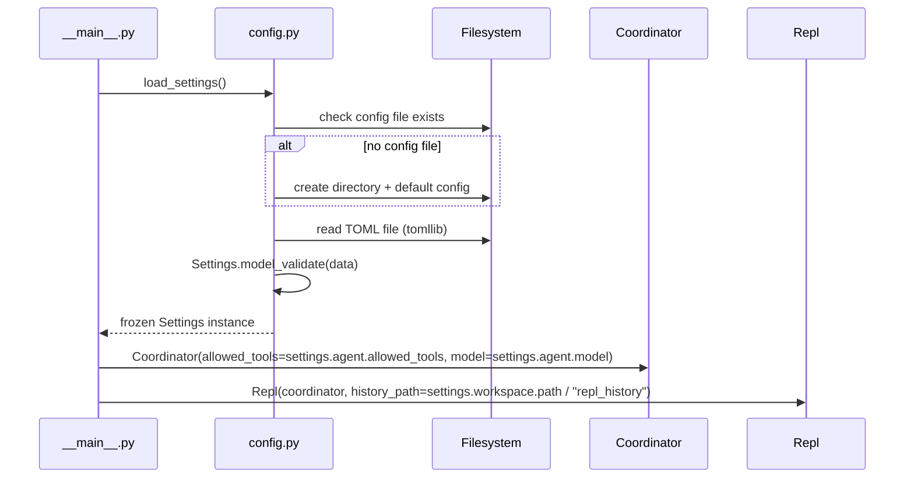
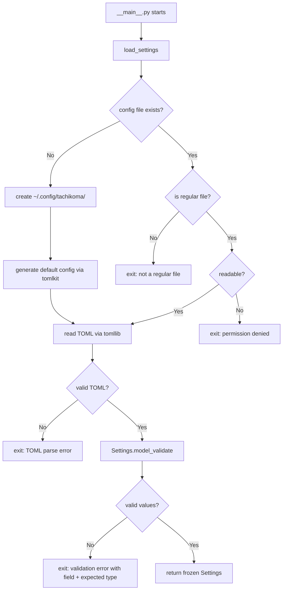

# Design: DLT-012 — Configure application parameters and secrets

**Delta Spec**: [../delta-specs/DLT-012.md](../delta-specs/DLT-012.md)
**Status**: Approved

## Purpose

This document explains the design rationale for this delta: the modeling choices, data flow, system behavior, and architectural approach.

After implementation, the "Detected Impacts" section will guide reconciliation into feature design docs.

## Problem Context

Tachikoma currently hardcodes operational parameters across multiple modules:

- `__main__.py` creates `~/.tachikoma/` and passes `allowed_tools=["Read", "Glob", "Grep"]`
- `coordinator.py` accepts `model` and `allowed_tools` as constructor args with no external source
- `repl.py` hardcodes `HISTORY_PATH = Path.home() / ".tachikoma" / "repl_history"`

This means changing any parameter requires code changes and redeployment. As more features add configuration (logging level, memory directory, Telegram token), this approach doesn't scale.

**Constraints:**
- Single-user, self-hosted deployment — enterprise-grade config management is unnecessary
- `ANTHROPIC_API_KEY` is handled natively by the Claude SDK — not managed by this system
- No environment variable overrides — a single TOML file is the sole source of truth (spec decision)
- Python 3.12+ required — `tomllib` is available in stdlib

## Design Overview

A single `config.py` module provides the entire configuration system: a typed Pydantic model hierarchy for validation, a loader function that reads TOML via stdlib `tomllib`, and a generator that produces a commented default config file using `tomlkit`.

```
┌─────────────────────────────────────────────────────────┐
│                    config.py                             │
│                                                         │
│  ┌─────────────────┐  ┌─────────────────────────────┐   │
│  │ Settings model   │  │ load_settings()             │   │
│  │ (Pydantic)       │  │  → check file exists        │   │
│  │                  │  │  → generate default if not   │   │
│  │  workspace:      │  │  → read TOML (tomllib)      │   │
│  │    path          │  │  → validate (Pydantic)      │   │
│  │  agent:          │  │  → return frozen Settings    │   │
│  │    model         │  └─────────────────────────────┘   │
│  │    allowed_tools │                                    │
│  │                  │  ┌─────────────────────────────┐   │
│  │  (extensible)    │  │ _generate_default_config()   │   │
│  └─────────────────┘  │  → build commented TOML      │   │
│                        │    via tomlkit               │   │
│                        │  → write to disk             │   │
│                        └─────────────────────────────┘   │
└─────────────────────────────────────────────────────────┘
```

Consumers (`__main__.py`, `Coordinator`, `Repl`) receive the `Settings` instance and read values from it instead of using hardcoded defaults.

## Shape

| Part | Mechanism | Flag |
|------|-----------|:----:|
| **S1** | Typed settings model using plain Pydantic `BaseModel` with nested sections (`WorkspaceSettings`, `AgentSettings`); all models use `ConfigDict(frozen=True, extra="ignore")` for immutability and forward compatibility. New sections (e.g. secrets) added by future deltas when needed. | |
| **S2** | Config loader function: reads TOML from `~/.config/tachikoma/config.toml` via `tomllib`, validates with `Settings.model_validate()`, surfaces formatted errors for invalid values, permissions issues, and filesystem anomalies | |
| **S3** | Default config generator: uses `tomlkit` to programmatically build a fully-commented TOML document (all key-value pairs as comments, no active values) from model field metadata (`description`, defaults), creates `~/.config/tachikoma/` directory if needed. Parsing the generated file yields an empty dict, so all defaults apply. | |
| **S4** | Startup integration: `__main__.py` calls config loader before coordinator/REPL creation; config failures exit with clear message | |
| **S5** | Consumer migration: replace hardcoded `allowed_tools`, `model`, workspace dir in `__main__.py`; pass config to `Coordinator`; derive REPL history path from `config.workspace.path` in `repl.py` | |

## Components

### Implementation Structure

| Layer/Component | Responsibility | Key Decisions |
|-----------------|----------------|---------------|
| `src/tachikoma/config.py` | Settings model, TOML loading, default generation | Plain Pydantic + tomllib for reading, tomlkit for writing defaults |
| `src/tachikoma/__main__.py` | Calls `load_settings()` at startup, passes config to coordinator and REPL | Config load is the first operation; failure exits before any SDK work |
| `src/tachikoma/coordinator.py` | Receives agent params from config | Constructor signature unchanged — still accepts `allowed_tools` and `model` |
| `src/tachikoma/repl.py` | Receives history path from config | `Repl.__init__` accepts `history_path: Path` instead of using module-level constant |

### Cross-Layer Contracts



### Shared Logic

- **Settings model** (`config.py`): The `Settings` instance is created once at startup and passed down. No global state — each consumer receives what it needs via constructor injection.

## Modeling

The settings model is a simple nested hierarchy matching the TOML sections:

```
Settings (root, frozen)
├── workspace: WorkspaceSettings
│   └── path: Path = ~/tachikoma
└── agent: AgentSettings
    ├── model: str | None = None (SDK default)
    └── allowed_tools: list[str] = ["Read", "Glob", "Grep"]
```

Future deltas add new sections as needed (e.g., DLT-002 adds a `secrets` section with `telegram_bot_token`).

All models — root and nested — use `ConfigDict(frozen=True, extra="ignore")`. `frozen=True` prevents accidental mutation after creation (Pydantic's frozen is per-model, not inherited, so each model must declare it explicitly). `extra="ignore"` provides forward compatibility — unknown keys in the TOML file are silently ignored rather than causing errors.

**Corresponding TOML structure:**

```toml
[workspace]
path = "~/tachikoma"

[agent]
model = "claude-sonnet-4-5"
allowed_tools = ["Read", "Glob", "Grep"]
```

### Path handling

The `workspace.path` field stores a string in TOML but is validated into a `Path` by Pydantic. A `field_validator` calls `Path.expanduser()` to expand `~` to the home directory so users can write `path = "~/tachikoma"` naturally. Only `~` expansion is supported (not `~user` syntax), which is sufficient for a single-user deployment.

## Data Flow

### Config loading (startup)



### Config consumption (runtime)

```
1. __main__.py receives Settings instance
2. Creates workspace directory: settings.workspace.path.mkdir(exist_ok=True)
3. Creates Coordinator with settings.agent.model and settings.agent.allowed_tools
4. Creates Repl with history_path = settings.workspace.path / "repl_history"
5. All hardcoded values eliminated
```

## Key Decisions

### Plain Pydantic BaseModel over pydantic-settings

**Choice**: Use `pydantic.BaseModel` + `tomllib` instead of `pydantic_settings.BaseSettings` + `TomlConfigSettingsSource`
**Why**: The spec explicitly decided against environment variable overrides — a single TOML file is the sole source of truth. pydantic-settings' main value (env vars, dotenv, multiple sources) is unused. Plain Pydantic + stdlib `tomllib` achieves the same validation, nested models, and error messages with fewer dependencies and no boilerplate `settings_customise_sources` override.
**Sources**: pydantic-settings docs (v2.3+ TOML support), web research comparing config library alternatives
**Options Researched**: pydantic-settings, dynaconf (overkill for single-user), omegaconf (no TOML), python-decouple (no TOML), typed-settings (lighter but weaker validation), plain Pydantic (chosen)
**Why This Over Alternatives**: pydantic-settings adds complexity for features we explicitly don't use. Dynaconf/omegaconf solve multi-environment problems we don't have. Plain Pydantic is the minimum viable solution.
**Consequences**:
- Pro: Zero extra dependencies beyond pydantic (tomllib is stdlib)
- Pro: Simpler code — no source priority configuration
- Pro: Full Pydantic validation, nested models, clear error messages
- Con: If env var overrides are needed later, must add pydantic-settings or handle manually

### tomlkit for default config generation

**Choice**: Use `tomlkit` to programmatically build the default config file with comments from model field metadata
**Why**: The spec requires a commented, annotated default config. `tomllib` (stdlib) is read-only. `tomli-w` can write TOML but doesn't support comments. `tomlkit` is the only library that can produce a commented TOML document programmatically. Building from model metadata keeps the template in sync with the model.
**Sources**: tomllib stdlib docs, tomli-w docs, tomlkit docs
**Options Researched**: hardcoded template string, tomli-w (no comments), tomlkit (chosen)
**Why This Over Alternatives**: A hardcoded template must be manually kept in sync with model changes. tomlkit generates from model metadata — DRY and maintainable.
**Consequences**:
- Pro: Default file stays in sync with model as fields are added
- Pro: Comments derived from field descriptions — single source of truth
- Con: Adds `tomlkit` as a runtime dependency (~100KB)

### Frozen settings instance

**Choice**: Use `ConfigDict(frozen=True)` on the root Settings model
**Why**: Configuration is loaded once at startup and consumed read-only throughout the application lifetime. Freezing prevents accidental mutation and makes the data flow clear — config is immutable input.
**Consequences**:
- Pro: Prevents bugs from accidental settings mutation
- Pro: Makes config data flow explicit and predictable
- Con: If runtime config changes are ever needed, must create a new Settings instance

### Hardcoded ~/.config over XDG_CONFIG_HOME

**Choice**: Use `~/.config/tachikoma/config.toml` directly instead of reading `XDG_CONFIG_HOME`
**Why**: The XDG Base Directory Specification says applications should use `$XDG_CONFIG_HOME` when set, falling back to `~/.config`. For a single-user, self-hosted deployment, respecting `XDG_CONFIG_HOME` adds complexity for a rare use case. The path is defined as a module-level constant in `config.py`, making it easy to change later if XDG support is needed.
**Consequences**:
- Pro: Simpler — one known location, no environment variable lookup
- Pro: Config path is predictable and documented
- Con: Users who set `XDG_CONFIG_HOME` won't have Tachikoma respect it

### extra="ignore" for forward compatibility

**Choice**: Use `ConfigDict(extra="ignore")` on all settings models
**Why**: The spec requires unknown keys to be ignored for forward compatibility. An older binary reading a newer config file (or vice versa) should work without errors. This aligns with the extensibility requirement (R5) — adding new fields with defaults doesn't break existing config files.
**Consequences**:
- Pro: Config files are forward and backward compatible
- Pro: Users won't get errors from typos in key names (debatable)
- Con: Typos in key names are silently ignored rather than flagged

## System Behavior

### Scenario: First run — no config file

**Given**: No file at `~/.config/tachikoma/config.toml`
**When**: `load_settings()` is called
**Then**: The `~/.config/tachikoma/` directory is created, a default config file with all parameters commented out and annotated is written via tomlkit, and the (effectively empty) config is loaded with all defaults.
**Rationale**: Users immediately have a config file they can inspect and customize. All defaults are documented in comments.

### Scenario: Valid config file with partial settings

**Given**: A config file with only `[workspace]` section populated
**When**: `load_settings()` is called
**Then**: Workspace settings use the file values; agent section uses its defaults. The application starts successfully.
**Rationale**: Supports incremental configuration — users only specify what they want to change.

### Scenario: Empty config file

**Given**: A config file that exists but is empty
**When**: `load_settings()` is called
**Then**: All parameters use their defaults and the application starts successfully.
**Rationale**: An empty file is valid TOML and means "use all defaults."

### Scenario: Invalid value type

**Given**: A config file with `workspace.path = 123` (number instead of string)
**When**: `load_settings()` is called
**Then**: The application exits with a clear, formatted message derived from Pydantic's `ValidationError`. The loader formats each error using the field path (`loc`), message (`msg`), and actual value (`input`) — e.g., `Configuration error: workspace -> path: Input should be a valid string (got 123)`. This formatting logic is part of S2 (the config loader).
**Rationale**: Pydantic provides structured error data; the loader transforms it into a user-friendly single message.

### Scenario: Invalid TOML syntax

**Given**: A config file with malformed TOML
**When**: `load_settings()` is called
**Then**: The application exits with the TOML parse error message identifying the line and issue.
**Rationale**: `tomllib.TOMLDecodeError` includes line/column information.

### Scenario: Config file is not readable (permission denied)

**Given**: A config file exists but is not readable by the current user
**When**: `load_settings()` is called
**Then**: The application exits with: `Cannot read config file: Permission denied: ~/.config/tachikoma/config.toml`

### Scenario: Config path is a directory

**Given**: `~/.config/tachikoma/config.toml` exists but is a directory
**When**: `load_settings()` is called
**Then**: The application exits with: `Config path is not a regular file: ~/.config/tachikoma/config.toml`

### Scenario: Cannot create config directory (permission denied)

**Given**: `~/.config/tachikoma/` cannot be created
**When**: `load_settings()` is called and no config file exists
**Then**: The application exits with a clear error about the directory creation failure.

### Scenario: Unknown keys in config

**Given**: A config file with `[workspace]\npath = "~/tachikoma"\nfoo = "bar"`
**When**: `load_settings()` is called
**Then**: `foo` is silently ignored. The application starts with `path` set and all other values at defaults.
**Rationale**: Forward compatibility — newer config keys don't break older versions.

## Open Questions

None.

---

## Detected Impacts

### Affected Feature Designs
- **docs/feature-designs/agent/core-architecture.md** — Modifies: startup flow in `__main__.py` now loads config first; `Coordinator` constructor receives values from config instead of hardcoded in entry point; the `allowed_tools` decision section should reference config as the source
- **docs/feature-designs/channels/terminal-repl.md** — Modifies: `HISTORY_PATH` module constant replaced by config-derived path; `Repl.__init__` accepts `history_path` parameter instead of using hardcoded path

### Notes for Reconciliation
- core-architecture startup flow should document config loading as the first step
- core-architecture component table should note that `__main__.py` wires config values to coordinator
- terminal-repl design should update the `Repl` constructor description to include `history_path` parameter
- A new "configuration" feature domain should be created under `docs/feature-specs/` and `docs/feature-designs/`

## Notes

- `pydantic` is not currently a direct dependency — it will be added to `pyproject.toml`. It may already be transitively available via `claude-agent-sdk`, but should be declared explicitly.
- `tomlkit` will be added as a new dependency for default config generation.
- The config file location follows the XDG Base Directory Specification (`~/.config/`), while the workspace directory defaults to `~/tachikoma` (user's home, not XDG).
