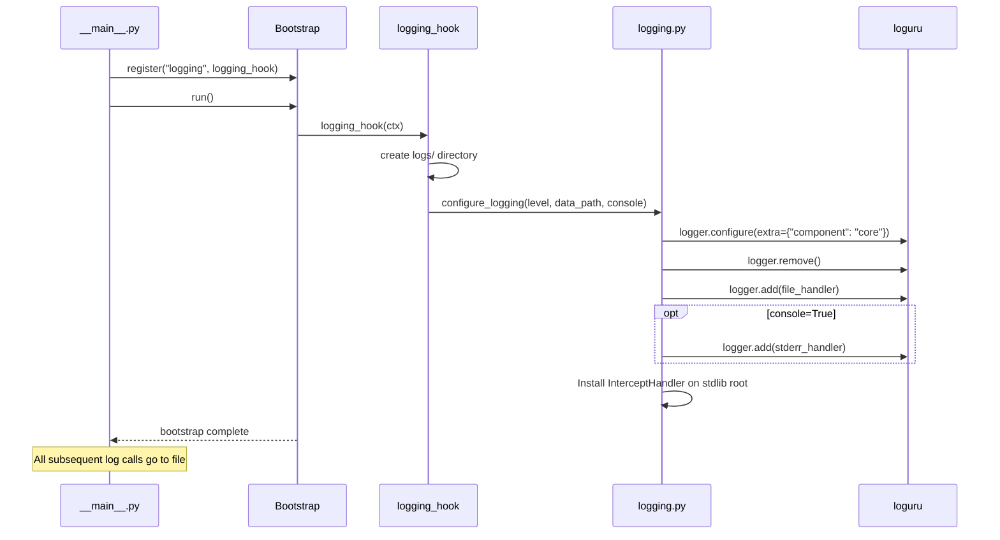
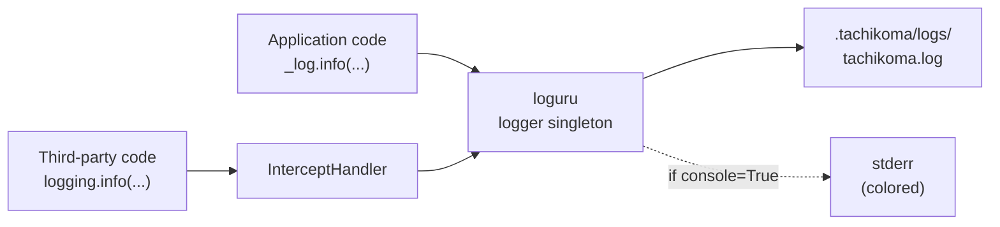

# Design: DLT-013 - Add structured logging for agent actions

**Delta Spec**: [../delta-specs/DLT-013.md](../delta-specs/DLT-013.md)
**Status**: Approved

## Purpose

This document explains the design rationale for this delta: the modeling choices, data flow, system behavior, and architectural approach.

After implementation, the "Detected Impacts" section will guide reconciliation into feature design docs.

## Problem Context

Tachikoma currently has no formal logging infrastructure. The coordinator module already imports loguru and uses `_log = logger.bind(component="coordinator")` with a few `.exception()` calls, but these go to loguru's default stderr handler with no configuration — no file output, no rotation, no level control. Other modules (`__main__.py`, `bootstrap.py`) have no logging at all. Error paths in `config.py` use `print()` to stderr, which is correct since they run before any bootstrap hooks.

**Constraints:**
- Logging must be configured via a bootstrap hook (DLT-023's system), not at import time
- Config loading errors run before the logging hook — those must remain as `print()` to stderr
- Loguru's default stderr handler is active until explicitly removed, so early bootstrap logs (workspace hook) will appear on stderr before the logging hook replaces the default
- Per ADR-006: loguru is the chosen library with 100 MB rotation, 7-day retention, gzip compression
- Per DES-002: keyword args (not f-strings), `.bind()` for component context, `.exception()` vs `.error()` for error handling

**Interactions:**
- DLT-012 (config system): `LoggingSettings` extends the existing Settings model
- DLT-023 (bootstrap): logging hook plugs into the existing hook system
- Future deltas (DLT-002, DLT-003, DLT-008, etc.): each adds its own log events following DES-002 — no changes to logging infrastructure needed

## Design Overview

A new `logging.py` module provides the full logging infrastructure: configuration function, bootstrap hook, stdlib interception handler, and a structured text format. The module is self-contained — bootstrap registers the hook, the hook calls the configuration function, and every other module in the codebase just uses `from loguru import logger` with `.bind()`.

```
┌─────────────────────────────────────────────────────────┐
│ config.py                                                │
│  Settings                                                │
│  ├── workspace: WorkspaceSettings                        │
│  ├── agent: AgentSettings                                │
│  └── logging: LoggingSettings  ◄── NEW                   │
│        ├── level: str = "INFO"                           │
│        └── console: bool = False                         │
└─────────────────────────────────────────────────────────┘
                        │
                        ▼
┌─────────────────────────────────────────────────────────┐
│ logging.py  ◄── NEW MODULE                               │
│                                                          │
│  configure_logging(level, data_path, console)            │
│    1. logger.configure(extra={"component": "core"})      │
│    2. logger.remove()  — strip default stderr handler    │
│    3. logger.add(file_handler)  — structured text        │
│    4. logger.add(stderr_handler)  — if console=True      │
│    5. Install InterceptHandler on stdlib logging root     │
│                                                          │
│  logging_hook(ctx)  — bootstrap hook                     │
│    1. Create logs/ directory                             │
│    2. Call configure_logging()                            │
│                                                          │
│  InterceptHandler(logging.Handler)                       │
│    — forwards stdlib logging → loguru                    │
└─────────────────────────────────────────────────────────┘
                        │
                        ▼
┌─────────────────────────────────────────────────────────┐
│ __main__.py                                              │
│  bootstrap.register("workspace", workspace_hook)         │
│  bootstrap.register("logging", logging_hook)  ◄── NEW   │
│  bootstrap.register("sessions", session_recovery_hook)   │
└─────────────────────────────────────────────────────────┘
```

Each instrumented module creates a module-level bound logger (`_log = logger.bind(component="name")`) and uses it with keyword args per DES-002.

## Shape

| Part | Mechanism | Flag |
|------|-----------|:----:|
| **S1** | `LoggingSettings` pydantic model in `config.py`: `level` field (default `"INFO"`, validated against known levels: DEBUG/INFO/WARNING/ERROR/CRITICAL), `console` field (default `false`). Added to `Settings` as `logging: LoggingSettings`. Config auto-generation includes commented `[logging]` section. | |
| **S2** | `configure_logging()` function in new `logging.py` module: calls `logger.configure(extra={"component": "core"})` to set global default for format string, calls `logger.remove()` to strip default handler, adds file handler (`{data_path}/logs/tachikoma.log`) with structured text format, rotation `"100 MB"`, retention `"7 days"`, compression `"gz"`, `enqueue=True`, `encoding="utf-8"`. Optionally adds stderr handler with `colorize=True` when `console=True`. Level from settings applied to both handlers. | |
| **S3** | Logging bootstrap hook (`logging_hook`) in `logging.py`: registered in `__main__.py` after workspace hook. Creates `logs/` subdirectory under data path — on PermissionError, raises `RuntimeError` describing the directory creation failure (e.g., `"Cannot create logs directory: Permission denied: {path}"`); Bootstrap's `run()` wraps this into `BootstrapError` which adds the hook name. Calls `configure_logging()` with settings and data path. | |
| **S4** | Module-level bound loggers: each instrumented module creates `_log = logger.bind(component="name")` following DES-002 conventions (keyword args, no f-strings). Coordinator already has this — other modules gain it. | |
| **S5** | Instrument existing components with explicit log levels. `__main__.py`: startup complete with workspace path (INFO), bootstrap/connection errors (ERROR). `coordinator.py` (already has `_log`): session created (INFO), session disconnected (INFO), message received (DEBUG), response complete (DEBUG), session errors already use `.exception()` (ERROR). Error-path `print()` calls in `config.py` remain since they run before the logging hook. | |
| **S6** | `InterceptHandler` class in `logging.py`: a stdlib `logging.Handler` subclass whose `emit()` maps stdlib log levels to loguru and forwards via `logger.opt(depth=depth, exception=record.exc_info).log()`. Installed via `logging.basicConfig(handlers=[InterceptHandler()], level=0, force=True)` during `configure_logging()`. | |

### Flagged Unknowns

None — loguru v0.7.3 APIs confirmed via documentation research, DLT-023's bootstrap system is already implemented, and the mechanisms are straightforward adaptations of established patterns.

## Components

### Implementation Structure

| Layer/Component | Responsibility | Key Decisions |
|-----------------|----------------|---------------|
| `src/tachikoma/config.py` | `LoggingSettings` model added to `Settings`; `_generate_default_config()` gains a new `[logging]` block (same pattern as existing `[workspace]` and `[agent]` blocks) | Pydantic with `Literal` for level validation |
| `src/tachikoma/logging.py` | `configure_logging()`, `logging_hook()`, `InterceptHandler` | New module; keeps all logging infrastructure together |
| `src/tachikoma/__main__.py` | Registers logging hook; gains startup/shutdown log statements | Hook registered after workspace, before sessions |
| `src/tachikoma/coordinator.py` | Gains additional log statements (session creation, message flow) | Already has `_log`; only new log calls needed |

### Cross-Layer Contracts

The logging infrastructure is consumed implicitly — modules import `logger` from loguru and call `.bind()`. No explicit contracts between the logging module and consumers.



**Integration Points:**
- Bootstrap ↔ logging_hook: hook receives `BootstrapContext` with settings and data path
- logging.py ↔ loguru: calls `logger.configure()`, `logger.remove()`, `logger.add()`
- logging.py ↔ stdlib logging: `InterceptHandler` installed on root logger
- All modules ↔ loguru: `from loguru import logger` + `.bind()` — no coupling to `logging.py`

## Modeling

The domain model is minimal — logging has no persistent entities. The key concepts are:

```
LoggingSettings (config model)
├── level: str — controls which messages pass through
└── console: bool — enables dev stderr output

configure_logging() — one-time setup function
├── receives level, data_path, console
├── configures loguru handlers
└── installs InterceptHandler

logging_hook() — bootstrap hook
├── creates log directory
└── delegates to configure_logging()

InterceptHandler — stdlib bridge
└── maps stdlib logging.Handler.emit() → loguru
```

There are no entities with lifecycle or state transitions. The logging system is configured once at startup and remains static for the process lifetime.

## Data Flow

### Log event flow (after configuration)



### Bootstrap configuration flow

```
1. __main__.py creates SettingsManager (config loaded, print() on errors)
2. Bootstrap registers hooks: workspace, logging, sessions
3. Bootstrap.run() executes hooks in order:
   a. workspace_hook — creates workspace + .tachikoma/ directories
   b. logging_hook:
      i.   Reads settings.logging.level and settings.logging.console
      ii.  Reads settings.workspace.data_path for log file location
      iii. Creates .tachikoma/logs/ directory (PermissionError → BootstrapError)
      iv.  Calls configure_logging(level, data_path, console)
      v.   From this point, all log calls go to file (+ stderr if console=True)
   c. session_recovery_hook — can now use logging
4. __main__.py reads final settings, logs startup success
```

### Log entry format

Each line in the log file follows this structured text format:

```
{time:YYYY-MM-DD HH:mm:ss.SSS} | {level: <8} | {extra[component]} | {name}:{function}:{line} - {message}
```

Example output:
```
2026-03-13 14:30:00.123 | INFO     | main     | tachikoma.__main__:main:25 - Startup complete: workspace={ws}
2026-03-13 14:30:01.456 | DEBUG    | coordinator | tachikoma.coordinator:send_message:95 - Message received: length={n}
2026-03-13 14:30:02.789 | ERROR    | coordinator | tachikoma.coordinator:send_message:107 - Failed to create session: err={err}
```

This format is machine-parseable via regex while remaining human-readable for development. Note: the `{message}` field can contain pipe characters, so naive pipe-splitting is unreliable — parsing should use the fixed-width level field and known prefix structure as anchors. For v1 (human-driven debugging), this is a non-issue.

## Key Decisions

### Structured text over JSON serialization

**Choice**: Use a custom format string with pipe-delimited fields instead of loguru's `serialize=True` JSON output
**Why**: This is a single-user self-hosted project with no log aggregation infrastructure. Structured text is grep-friendly, human-readable during development, and parseable with simple regex. DES-002 already establishes `key=value` in messages, making log entries self-describing.
**Sources**: loguru v0.7.3 docs; [web research on loguru structured logging patterns](https://www.dash0.com/guides/python-logging-with-loguru)
**Options Researched**: loguru `serialize=True` (JSON), structlog (rejected in ADR-006), custom format string
**Alternatives Considered**:
- `serialize=True`: Fully structured JSON, but harder to read and adds ~10-20% overhead per [web research](https://johal.in/logging-configuration-advanced-structured-logs-with-loguru-for-traceable-python-applications-2025/)
- structlog: Already rejected in ADR-006 — steeper learning curve, overkill for current needs

**Consequences**:
- Pro: Grep-friendly, human-readable, zero extra parsing overhead
- Pro: Consistent with DES-002 conventions already in place
- Con: Requires regex for programmatic parsing (vs native JSON)
- Note: Can switch to `serialize=True` later if log aggregation is added

### `enqueue=True` for file handler

**Choice**: Enable enqueued (non-blocking) writes for the file handler
**Why**: Per loguru v0.7.3 documentation, `enqueue=True` makes writes thread-safe and non-blocking by routing log messages through a queue. This is recommended for async applications and prevents I/O blocking on the event loop. Future deltas (DLT-010 background tasks) may introduce concurrent flows.

**Consequences**:
- Pro: Thread-safe writes without explicit locking
- Pro: Non-blocking — log calls return immediately
- Con: Messages may be slightly delayed in reaching the file (negligible for debugging)
- Con: On hard crash, a few queued messages may be lost. For graceful shutdown this is not an issue — Python's `asyncio.run()` teardown completes before process exit, allowing the queue to flush naturally

### New `logging.py` module over adding to `bootstrap.py`

**Choice**: Create a dedicated `logging.py` module for all logging infrastructure
**Why**: Keeps `bootstrap.py` focused on the bootstrap mechanism. The logging module contains three related items (configure function, hook, InterceptHandler) that form a cohesive unit. Future changes to logging configuration are isolated to one module.
**Alternatives Considered**:
- Co-locate in `bootstrap.py`: Mixes logging concerns with bootstrap mechanism
- Split across modules: Fragments a small, cohesive feature

**Consequences**:
- Pro: Single module for all logging infrastructure
- Pro: bootstrap.py stays generic — no library-specific code
- Con: One more module in the package

### Logging hook ordering: after workspace, before sessions

**Choice**: Register logging hook between workspace and session recovery hooks
**Why**: The workspace hook creates the `.tachikoma/` data directory that the logging hook needs for its `logs/` subdirectory. The session recovery hook benefits from having logging available (its errors would be logged rather than just printed).

**Consequences**:
- Pro: Log directory creation succeeds because parent exists
- Pro: Session recovery hook gains logging
- Con: Workspace hook itself doesn't benefit from file logging (uses loguru default stderr before it's removed)

### `diagnose=True` for exception tracebacks

**Choice**: Keep loguru's default `diagnose=True` on both handlers for v1
**Why**: Tachikoma is a single-user self-hosted project — log files are only accessible to the owner. The variable values in tracebacks are invaluable for debugging during early development. The file handler writes to the workspace data directory which is user-owned.
**Alternatives Considered**:
- `diagnose=False` for file handler, `True` for console: More secure, but splits behavior between handlers and loses debugging information in the primary log output

**Consequences**:
- Pro: Maximum debugging information in tracebacks
- Pro: Consistent behavior across handlers
- Con: If logs are ever shared externally, variable values could leak sensitive data
- Note: Revisit when multi-user or external log shipping is added

### Level validation via Literal type

**Choice**: Validate `level` field using `Literal["DEBUG", "INFO", "WARNING", "ERROR", "CRITICAL"]` in Pydantic
**Why**: Catches invalid level values at config load time with a clear Pydantic validation error, before the bootstrap hook runs. This satisfies the AC that invalid level values cause the app to exit with a clear validation error.
**Alternatives Considered**:
- Runtime validation in `configure_logging()`: Later feedback, less clear error message
- Free-form string with loguru validation: Loguru raises on unknown levels, but the error message is less user-friendly

**Consequences**:
- Pro: Invalid levels caught at startup with clear error naming the field
- Pro: Pydantic error format is consistent with other config errors
- Con: Must keep Literal in sync with loguru levels (loguru levels are stable)

## System Behavior

### Scenario: First launch — clean startup

**Given**: A valid config file exists (or defaults apply)
**When**: The application starts and the logging hook runs
**Then**: The `logs/` directory is created, loguru is configured with the file handler, and subsequent log calls (including startup success in `__main__.py`) write to `.tachikoma/logs/tachikoma.log`.
**Rationale**: The hook is idempotent — it creates directories only if missing and reconfigures loguru each time.

### Scenario: Subsequent launch — logging already configured

**Given**: The `logs/` directory already exists from a previous run
**When**: The logging hook runs
**Then**: Directory creation is a no-op (`exist_ok=True`), loguru is reconfigured (handlers are replaced via `logger.remove()` + `logger.add()`), and logging proceeds normally.
**Rationale**: `logger.remove()` clears all handlers before adding new ones, ensuring no duplicate handlers on relaunch.

### Scenario: Invalid log level in config

**Given**: A config file with `[logging] level = "VERBOSE"`
**When**: The application starts and settings are loaded
**Then**: Pydantic validation fails with a clear error naming the `logging.level` field and the expected values. The application exits before bootstrap runs.
**Rationale**: `Literal` type validation catches this at config load time, consistent with all other config validation errors.

### Scenario: Logs directory cannot be created

**Given**: The `.tachikoma/` data directory exists but the `logs/` subdirectory cannot be created (permissions)
**When**: The logging hook runs
**Then**: The hook raises a `RuntimeError` describing the failure (e.g., `"Cannot create logs directory: Permission denied: /path/to/logs"`). Bootstrap wraps it in `BootstrapError(f"Hook 'logging' failed: ...")` and the application exits with a clear error naming both the hook and the cause.
**Rationale**: Follows the same pattern as workspace_hook's PermissionError handling. The RuntimeError describes *what* failed; Bootstrap's wrapping adds *which hook* failed.

### Scenario: Log file rotation

**Given**: The log file `tachikoma.log` has reached 100 MB
**When**: A new log entry is written
**Then**: Loguru rotates the file (renaming with timestamp suffix), starts a new file, and compresses the rotated file with gzip. Files older than 7 days are removed.
**Rationale**: Per ADR-006 configuration. Loguru handles rotation, retention, and compression natively.

### Scenario: Third-party library logging

**Given**: The Claude SDK or another library emits a stdlib `logging` message
**When**: The message passes through the root logger
**Then**: `InterceptHandler` captures it, maps the level, and forwards to loguru. It appears in the log file with the third-party module's name in the source location.
**Rationale**: `logging.basicConfig(handlers=[InterceptHandler()], level=0, force=True)` captures all stdlib messages at all levels, letting loguru apply its own level filtering.

### Scenario: Development with console output

**Given**: A config file with `[logging] console = true`
**When**: The application starts and the logging hook runs
**Then**: Both the file handler and a colorized stderr handler are added. Log entries appear in both destinations.
**Rationale**: Development mode benefits from immediate visual feedback without tailing log files.

### Scenario: Pre-bootstrap error (config loading)

**Given**: The config file has invalid TOML syntax
**When**: `load_settings()` is called (before bootstrap)
**Then**: The error is printed to stderr via `print()` and the application exits. No log file entry is created.
**Rationale**: Logging isn't configured yet — the `print()` error paths in `config.py` are deliberate and must remain.

## Open Questions

- [ ] None identified

---

## Detected Impacts

### Affected Feature Designs
- **docs/feature-designs/configuration/config-system.md** — Adds: `LoggingSettings` section in the Settings model hierarchy, new `[logging]` section in default config generation
- **docs/feature-designs/agent/core-architecture.md** — Modifies: startup flow includes logging bootstrap hook, components produce structured log output
- **docs/feature-designs/agent/workspace-bootstrap.md** — Adds: logging hook documented as a registered bootstrap hook

### Notes for Reconciliation
- Config system design's Modeling section gains `logging: LoggingSettings` in the Settings hierarchy
- Core architecture design's startup flow (Data Flow section) gains step between workspace hook and session recovery hook
- Workspace bootstrap design's Notes section updates hook list to include logging hook

## Notes

- **loguru v0.7.3**: All APIs confirmed via documentation research (Context7 + web search, March 2026)
- **Pre-bootstrap logging window**: Between application start and logging hook completion, loguru's default stderr handler is active. Logs from the workspace hook appear on stderr. This is acceptable — the window is brief and only contains startup diagnostics.
- **InterceptHandler pattern**: Follows the canonical loguru pattern using `logger.opt(depth=depth, exception=record.exc_info).log()` with frame-walking to preserve original source location in log entries.
- **`diagnose=True`**: Loguru's default for exception tracebacks includes variable values. This is useful for development. If logs ever contain sensitive data, this should be revisited (set to `False` in production).
- **Future extensibility**: When new components are added (DLT-002 Telegram, DLT-003 delegation, DLT-008 memory), each module adds `_log = logger.bind(component="name")` and its own log events per DES-002. No changes to the logging infrastructure are needed.
