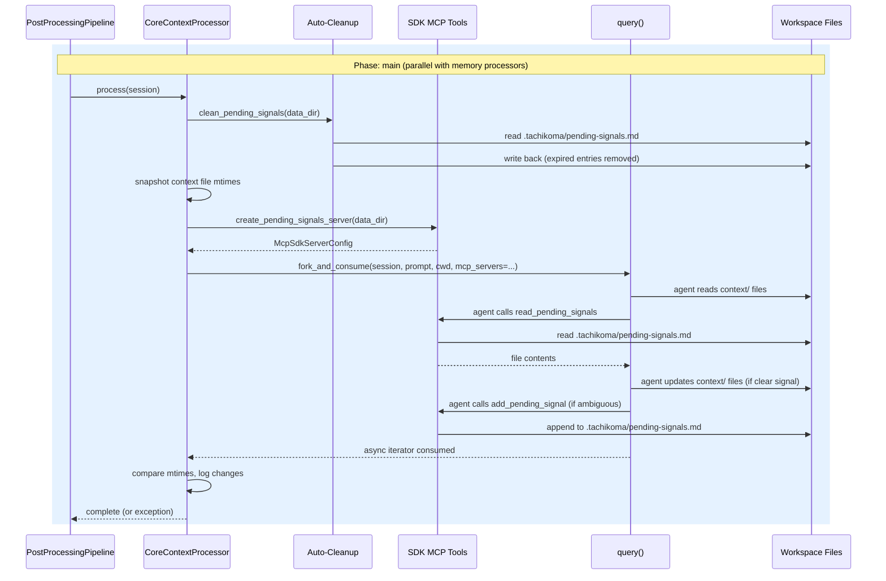
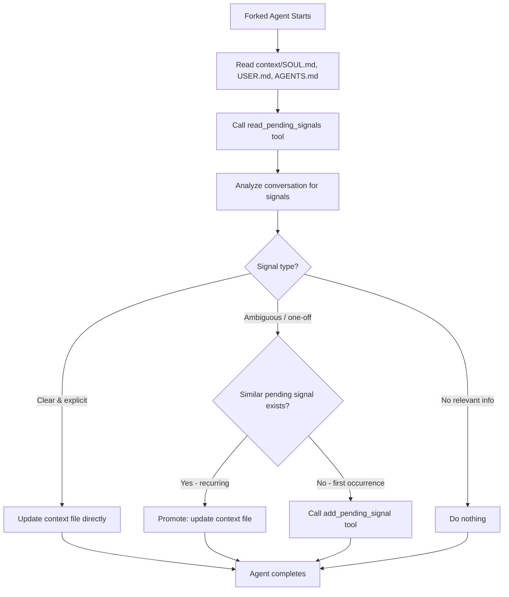

# Design: DLT-018 - Update core context files from conversation learnings

**Delta Spec**: [../delta-specs/DLT-018.md](../delta-specs/DLT-018.md)
**Status**: Approved

## Purpose

This document explains the design rationale for this delta: the modeling choices, data flow, system behavior, and architectural approach.

After implementation, the "Detected Impacts" section will guide reconciliation into feature design docs.

## Problem Context

The assistant's foundational context files (SOUL.md, USER.md, AGENTS.md) shape its personality, user knowledge, and operational behavior across all sessions. Currently, these files are only updated manually or by the coordinator during a live conversation. There is no automated mechanism to detect and apply changes from completed conversations — if the user mentions a new job, gives personality feedback, or establishes a workflow preference, that information is only captured in individual memory files (facts, preferences, episodic summaries) but not reflected in the foundational documents that the coordinator loads at startup.

**Constraints:**
- Context files carry higher weight than individual memories — they shape the system prompt via `SystemPromptPreset` (ADR-008). Updates must be conservative: only when there's clear conversational evidence
- The processor plugs into the existing post-processing pipeline (main phase), running in parallel with memory extraction processors
- All file I/O is performed by the forked LLM agent, not by processor code — consistent with the established memory extraction pattern
- Ambiguous signals must be staged and only promoted after recurrence, preventing single-conversation noise from altering foundational behavior
- The pending signals file must be managed through constrained tools (read + add), not direct file access, to prevent accidental deletion or corruption by the agent

**Interactions:**
- Post-processing pipeline: processor registers in `main` phase alongside memory processors (see [pipeline design](../feature-designs/agent/post-processing-pipeline.md))
- Context loading: reads context files assembled by `context_hook` at startup (see [core-architecture design](../feature-designs/agent/core-architecture.md))
- Git processor: finalize-phase processor auto-commits any changes made by context updates
- Memory extraction: runs in parallel, may extract overlapping information — this is acceptable (R12)

## Design Overview

A new `CoreContextProcessor` extends the `PromptDrivenProcessor` base class (introduced by this delta's DES-004 refactor) and plugs into the post-processing pipeline's main phase. On each run, the processor:

1. **Pre-step (Python code)**: auto-cleans expired entries from the pending signals file
2. **Creates SDK MCP tools**: in-process `read_pending_signals` and `add_pending_signal` tools
3. **Forks the SDK session**: sends a comprehensive prompt instructing the agent to read context files, analyze the conversation, classify signals, and act accordingly
4. **Post-step (Python code)**: logs which context files were modified for observability

```
┌───────────────────────────────────────────────────────────────┐
│                       __main__.py                              │
│                                                               │
│  pipeline = PostProcessingPipeline()                          │
│  pipeline.register(EpisodicProcessor(cwd))   ─┐              │
│  pipeline.register(FactsProcessor(cwd))       │ main phase   │
│  pipeline.register(PreferencesProcessor(cwd)) │ (parallel)   │
│  pipeline.register(CoreContextProcessor(cwd))─┘              │
│  pipeline.register(GitProcessor(cwd), phase=FINALIZE_PHASE)  │
└───────────────────────────────────────────────────────────────┘
                          │
           ┌──────────────┼──────────────┬──────────────┐
           ▼              ▼              ▼              ▼
      ┌─────────┐   ┌─────────┐   ┌─────────┐   ┌──────────┐
      │Episodic │   │  Facts  │   │  Prefs  │   │  Context │  (main)
      │Processor│   │Processor│   │Processor│   │ Processor│
      └────┬────┘   └────┬────┘   └────┬────┘   └────┬─────┘
           │              │              │              │
           ▼              ▼              ▼              ▼
      fork_and_consume(prompt, cwd)              fork_and_consume(
           │              │              │          prompt, cwd,
           ▼              ▼              ▼          mcp_servers=...)
      memories/      memories/      memories/         │
      episodic/      facts/         preferences/      ▼
                                                 context/SOUL.md
                                                 context/USER.md
                                                 context/AGENTS.md
                                                 .tachikoma/
                                                   pending-signals.md
```

As part of this delta, the shared "prompt-driven forked processor" pattern is extracted into DES-004 and all four processors are refactored to use a common `PromptDrivenProcessor` base class.

## Shape

| Part | Mechanism | Flag |
|------|-----------|:----:|
| **S1** | Context update processor — `CoreContextProcessor` in `context/processor.py`, extends `PromptDrivenProcessor` but overrides `process()` to: (a) run pending-signals auto-cleanup, (b) create SDK MCP tools, (c) snapshot context file mtimes, (d) fork with custom tools, (e) log which files changed post-fork | |
| **S2** | Context update prompt — module-level constant instructing the forked agent to: read all three context files, read pending signals via tool, analyze the conversation, classify signals as clear vs ambiguous, update files directly for clear signals, check recurrence and promote or stage for ambiguous signals via tool | |
| **S3** | Pending signals file — structured markdown at `.tachikoma/pending-signals.md` with dated entries; created on first use by the add tool (no bootstrap hook needed) | |
| **S4** | Pending signals SDK MCP tools — two tools defined with `tool()` in `context/tools.py`, bundled via `create_sdk_mcp_server()`: `read_pending_signals` (no input, returns file contents) and `add_pending_signal` (takes `{"signal": str}`, appends entry with current date); passed to forked agent via `mcp_servers` option on `fork_and_consume()` | |
| **S5** | Pending signals auto-cleanup — Python code in `process()` that reads the file, removes entries older than configurable threshold (default 30 days), writes back; runs before the forked session; no-ops gracefully if file doesn't exist or is empty; logs and continues on parse errors | |
| **S6** | DES-004: Prompt-driven forked processor — DES document describing the pattern: `PromptDrivenProcessor(PostProcessor)` base class with prompt + cwd, `fork_and_consume()` for session forking, agent autonomously manages files | |
| **S7** | PromptDrivenProcessor base class and refactor — add base class to `post_processing.py` (stores prompt + cwd, implements `process()` via `fork_and_consume()`); extend `fork_and_consume()` with optional `mcp_servers` parameter; refactor episodic, facts, preferences processors to extend the base class | |
| **S8** | Pipeline registration — register `CoreContextProcessor` in `__main__.py` in the main phase alongside existing memory processors | |
| **S9** | Convert `context.py` to `context/` package — move `load_context()`, `context_hook()`, and constants to `context/loading.py`; add `context/processor.py` and `context/tools.py`; re-export through `context/__init__.py` | |

## Components

### Implementation Structure

| Layer/Component | Responsibility | Key Decisions |
|-----------------|----------------|---------------|
| `src/tachikoma/context/` | Package containing all context concerns: loading (startup) and updating (post-processing) | Converted from flat `context.py` to package; groups loading, processor, and tools cohesively |
| `src/tachikoma/context/__init__.py` | Re-exports: `load_context`, `context_hook`, `CoreContextProcessor` | Clean public API; existing imports (`from tachikoma.context import context_hook`) continue to work. `CONTEXT_FILES` stays internal to the package — processor imports from sibling `loading` module for mtime snapshots |
| `src/tachikoma/context/loading.py` | `load_context()`, `context_hook()`, constants (`CONTEXT_FILES`, `CONTEXT_DIR_NAME`, default content, `SYSTEM_PREAMBLE`) | Moved from `context.py` unchanged; all existing behavior preserved |
| `src/tachikoma/context/processor.py` | `CoreContextProcessor(PromptDrivenProcessor)` + `CONTEXT_UPDATE_PROMPT` constant | Overrides `process()` for pre-step cleanup, MCP tools, and post-step observability; prompt co-located with processor |
| `src/tachikoma/context/tools.py` | `read_pending_signals` and `add_pending_signal` SDK MCP tools + `create_pending_signals_server()` factory | Uses `tool()` higher-order function and `create_sdk_mcp_server()` from `claude_agent_sdk`; `read_pending_signals` has empty input schema (no args), `add_pending_signal` takes `{"signal": str}`; tools have closure over `data_dir` path |
| `src/tachikoma/post_processing.py` | Extended: `PromptDrivenProcessor` base class added; `fork_and_consume()` gains optional `mcp_servers` parameter | Base class co-located with `PostProcessor` ABC and pipeline; keeps all processor infrastructure in one module |

### Cross-Layer Contracts



**Integration Points:**
- Processor ↔ Pipeline: registers in default `main` phase via `pipeline.register(CoreContextProcessor(cwd))`
- Processor ↔ SDK: `fork_and_consume(session, prompt, cwd, mcp_servers={"pending-signals": server})` — standalone `query()`, independent of `ClaudeSDKClient`
- Forked agent ↔ Context files: agent reads/writes `context/SOUL.md`, `context/USER.md`, `context/AGENTS.md` using standard Claude Code file tools
- Forked agent ↔ Pending signals: agent uses only the custom `read_pending_signals` and `add_pending_signal` MCP tools — prompt instructs against direct file access
- Processor ↔ Pending signals file: Python code manages auto-cleanup pre-fork; MCP tools manage agent interactions during fork
- Git processor ↔ Context changes: finalize-phase git processor auto-commits any file changes after all main-phase processors complete

### Shared Logic

- **`PromptDrivenProcessor`** (`post_processing.py`): new base class for processors that fork the SDK session with a prompt. Stores `_prompt` and `_cwd`, implements `process()` via `fork_and_consume()`. Used by all four processors.
- **`fork_and_consume`** (`post_processing.py`): extended with optional `mcp_servers` parameter. When provided, the `mcp_servers` dict is merged into the `ClaudeAgentOptions` for the forked session.
- **`create_pending_signals_server()`** (`context/tools.py`): factory that creates an SDK MCP server with the two pending signals tools, capturing `data_dir` via closure.

## Modeling

The domain model remains minimal — no database entities. Context files and pending signals are plain markdown managed by the forked agent (context files) and Python code + MCP tools (pending signals).

```
PromptDrivenProcessor(PostProcessor)   [NEW - base class]
├── _cwd: Path
├── _prompt: str
└── process(session) → fork_and_consume(session, prompt, cwd)

CoreContextProcessor(PromptDrivenProcessor)   [NEW]
├── _data_dir: Path                           (workspace/.tachikoma/)
├── CONTEXT_UPDATE_PROMPT: str                (module-level constant)
└── process(session) → cleanup + fork with MCP tools + log changes

EpisodicProcessor(PromptDrivenProcessor)      [REFACTORED]
├── EPISODIC_PROMPT: str
└── (inherits process() from base — no override needed)

FactsProcessor(PromptDrivenProcessor)         [REFACTORED]
├── FACTS_PROMPT: str
└── (inherits process() from base — no override needed)

PreferencesProcessor(PromptDrivenProcessor)   [REFACTORED]
├── PREFERENCES_PROMPT: str
└── (inherits process() from base — no override needed)
```

### Pending Signals File Format

The file at `.tachikoma/pending-signals.md` uses a simple structured markdown format. Each entry is a markdown list item with a date prefix:

```markdown
# Pending Signals

- **2026-03-10**: User seemed to prefer shorter responses (one-off comment: "that was too verbose")
- **2026-03-12**: User mentioned preferring dark themes in IDEs
- **2026-03-14**: User again mentioned wanting more concise responses
```

**Why markdown list items with bold date prefix:**
- Trivial to parse programmatically (regex on `- **YYYY-MM-DD**:`)
- Human-readable if the user inspects the file
- Easy for the `add` tool to append (just add a new line)
- Easy for auto-cleanup to filter by date

## Data Flow

### Context update processor flow

```
1. Pipeline calls processor.process(session)
2. Pre-step — auto-cleanup:
   a. Read .tachikoma/pending-signals.md (no-op if missing)
   b. Parse entries, filter out those older than 30 days
   c. Write back filtered content (or delete file if empty after cleanup)
   d. On parse error: log warning, continue
   Note: if cleanup deletes an empty file and the fork later stages a new
   signal, the add tool recreates it — this is the expected behavior
3. Create SDK MCP tools:
   a. Define read_pending_signals and add_pending_signal tools
   b. Bundle into McpSdkServerConfig via create_sdk_mcp_server()
4. Snapshot context file mtimes:
   a. Record mtime of context/SOUL.md, USER.md, AGENTS.md
5. Fork session with custom tools:
   a. Call fork_and_consume(session, CONTEXT_UPDATE_PROMPT, cwd,
      mcp_servers={"pending-signals": server})
   b. Forked agent autonomously:
      - Reads all three context files
      - Reads pending signals via read_pending_signals tool
      - Analyzes conversation for context-relevant information
      - For clear, explicit signals:
        → Updates the appropriate context file directly
      - For ambiguous, one-off signals:
        → Checks pending signals for semantic recurrence
        → If recurring: promotes to context file update
        → If new: stages via add_pending_signal tool
      - For conversations with no relevant information:
        → Does nothing (no-op)
6. Post-step — observability:
   a. Compare current mtimes to snapshots
   b. Log which files were modified (if any)
7. Return to pipeline
```

### Fork session data flow



## Key Decisions

### Convert context.py to context/ package

**Choice**: Transform the flat `context.py` module into a `context/` package with `loading.py`, `processor.py`, and `tools.py`.
**Why**: Groups all context concerns (loading at startup + updating post-conversation + pending signals tools) under one cohesive package. Follows the same pattern as `memory/` (which groups memory processors and hooks). Keeps the new processor and tools from bloating a single file.
**Alternatives Considered**:
- New `context_update/` package: clean separation but splits related context concerns across two top-level modules
- Flat `context_update.py`: simpler but less organized as tools are separate concern from processor

**Consequences**:
- Pro: All context concerns cohesive under one package
- Pro: Existing imports (`from tachikoma.context import context_hook`) continue to work via `__init__.py` re-exports
- Con: Requires moving existing code (low risk — pure move with no logic changes)

### SDK MCP tools for pending signals

**Choice**: Use the Claude Agent SDK's `tool()` higher-order function and `create_sdk_mcp_server()` to create in-process MCP tools for pending signals interaction. The `tool(name, description, input_schema)` function takes the tool's metadata as arguments and returns a wrapper that accepts the async handler, producing an `SdkMcpTool` instance. `read_pending_signals` uses an empty input schema (no arguments); `add_pending_signal` uses `{"signal": str}`.
**Why**: The SDK provides first-class support for custom in-process tools ([Custom Tools docs](https://platform.claude.com/docs/en/agent-sdk/custom-tools)). Tools run in the same process with no IPC overhead, have direct access to the filesystem, and integrate cleanly with `ClaudeAgentOptions.mcp_servers`. The tool API reinforces the intended access pattern (read-only + append-only) while the prompt instructs the agent not to access the file directly.
**Sources**: Claude Agent SDK v0.1.48 source code (`claude_agent_sdk/__init__.py`); [Custom Tools - Claude API Docs](https://platform.claude.com/docs/en/agent-sdk/custom-tools); [Agent SDK reference - Python](https://platform.claude.com/docs/en/agent-sdk/python)
**Options Researched**:
- SDK MCP tools (selected): in-process, no overhead, direct file access
- External MCP server (subprocess): unnecessary complexity for two simple tools
- Prompt-only constraint (no tools): less reliable — agent could access file directly with standard tools
- PreToolUse hook to block direct access: over-engineering for a prompt-reinforced constraint

**Consequences**:
- Pro: Clean, type-safe tool definitions with schema validation
- Pro: In-process execution — no subprocess overhead
- Pro: Tools reinforce the intended access pattern alongside prompt instructions
- Con: Requires extending `fork_and_consume()` to accept `mcp_servers` parameter

### Extend fork_and_consume with optional mcp_servers

**Choice**: Add an optional `mcp_servers` parameter to `fork_and_consume()`: `fork_and_consume(session, prompt, cwd, mcp_servers=None)`.
**Why**: Minimal, targeted extension. The current three memory processors don't need custom tools, so the parameter defaults to `None` (no behavior change). Only the context update processor passes it. If future processors need other options, parameters can be added incrementally.
**Alternatives Considered**:
- Accept full `ClaudeAgentOptions`: more flexible but pushes option construction to callers, including the simple memory processors that don't need it
- Create a separate fork function: code duplication

**Consequences**:
- Pro: Zero impact on existing callers (default `None`)
- Pro: Simple, targeted change
- Con: May need additional parameters in the future (acceptable — add when needed)

### PromptDrivenProcessor base class

**Choice**: Introduce a `PromptDrivenProcessor(PostProcessor)` base class in `post_processing.py` that stores `prompt` and `cwd`, implementing `process()` via `fork_and_consume()`.
**Why**: All four processors (episodic, facts, preferences, context update) follow the exact same pattern: store a prompt and cwd, call `fork_and_consume()` in `process()`. Extracting this into a base class eliminates the identical boilerplate in each processor. The context update processor overrides `process()` for its pre/post steps but still uses `fork_and_consume()` internally.
**Alternatives Considered**:
- Document pattern only (DES without code abstraction): violates R9 which requires a shared abstraction
- Mixin class: adds complexity without clear benefit over simple inheritance
- Factory function: loses the class-based structure that integrates with `PostProcessor` ABC

**Consequences**:
- Pro: Eliminates identical boilerplate across four processors
- Pro: Simple subclasses become near-empty — just a prompt constant and `super().__init__()` call
- Pro: Complex processors (context update) override `process()` naturally
- Con: One more class in the inheritance chain (PostProcessor → PromptDrivenProcessor → specific processor)

### Pending signals created on first use (no bootstrap hook)

**Choice**: The pending signals file is created by the `add_pending_signal` tool on first use. No bootstrap hook.
**Why**: The `.tachikoma/` directory already exists (created by `workspace_hook`). The auto-cleanup and read tool handle missing files gracefully (no-op / return empty). Adding a bootstrap hook would add ceremony for a file that may never be created if conversations always have clear signals.
**Alternatives Considered**:
- Bootstrap hook to create empty file: unnecessary if file may never exist; adds coupling to bootstrap

**Consequences**:
- Pro: No unnecessary file creation
- Pro: No bootstrap coupling — processor is self-contained
- Pro: Simpler overall
- Con: First `add` call creates the file (trivial)

### Observability via mtime comparison

**Choice**: The processor snapshots context file modification times (mtimes) before the fork and compares after. Changed files are logged.
**Why**: The forked agent performs file I/O, so the processor code has no direct visibility into what was changed. Mtime comparison is a simple, reliable way to detect which files were modified without parsing file contents or requiring the agent to report its actions.
**Alternatives Considered**:
- Agent reports via a `log_update` tool: adds a third MCP tool; relies on agent behavior
- Content diff before/after: more detailed but unnecessarily complex for observability logging
- No logging: violates R10

**Consequences**:
- Pro: Simple, reliable detection — Python `stat()` calls before and after fork
- Pro: No agent cooperation required
- Con: Only detects which files changed, not what changed (acceptable for logging — git diff provides the detail)

## System Behavior

### Scenario: Clear user information change

**Given**: A conversation where the user states "I just started a new job at Acme Corp"
**When**: The processor runs after session close
**Then**: The forked agent reads USER.md, finds the relevant section, and updates it with the new employer. The mtime changes, and the processor logs "Context file updated: file=USER.md". The finalize-phase git processor commits the change.
**Rationale**: Explicit, unambiguous statements with clear evidence warrant direct updates (R1, R4).

### Scenario: Ambiguous personality feedback (first occurrence)

**Given**: A conversation where the user says "that was too verbose"
**When**: The processor runs
**Then**: The forked agent classifies this as ambiguous (one-off comment, no clear directive). It calls `read_pending_signals` to check for similar entries — none found. It calls `add_pending_signal` to stage the signal with today's date. No context files are modified.
**Rationale**: One-off comments don't warrant personality changes. The pending signals mechanism captures the signal for future recurrence detection (R4, R11).

### Scenario: Recurring signal promoted to update

**Given**: A pending signals file contains "2026-03-10: User seemed to prefer shorter responses" and the user says "your answers are way too long" in a new conversation
**When**: The processor runs
**Then**: The forked agent reads pending signals and finds a semantically similar entry from two weeks ago. It determines this is a recurring pattern. It updates SOUL.md with a preference for concise responses and does NOT add a new pending signal entry. The old entry naturally ages out after 30 days.
**Rationale**: Recurrence detection promotes ambiguous signals to high-confidence updates (R11.4).

### Scenario: No relevant content in conversation

**Given**: A purely technical debugging session with no personality feedback, user information, or operational instructions
**When**: The processor runs
**Then**: The forked agent reads context files and pending signals, analyzes the conversation, and determines nothing warrants an update. No files modified, no signals added. The processor logs nothing (no mtimes changed).
**Rationale**: Conservative update policy — no action when no evidence (R7).

### Scenario: Auto-cleanup removes expired entries

**Given**: The pending signals file contains entries from 45 and 60 days ago, plus one from 5 days ago
**When**: The processor's pre-step runs
**Then**: The two expired entries (older than 30 days) are removed. The 5-day-old entry remains. If the file would be empty, it is deleted entirely.
**Rationale**: Prevents unbounded growth while giving signals a reasonable window to recur (R11.3).

### Scenario: Pending signals file does not exist

**Given**: No `.tachikoma/pending-signals.md` file exists (first run, or all entries aged out)
**When**: The processor runs
**Then**: Auto-cleanup is a no-op. The forked agent calls `read_pending_signals` and receives empty content. If it has ambiguous signals, `add_pending_signal` creates the file on first write.
**Rationale**: Graceful handling of missing file — no errors, no unnecessary file creation.

### Scenario: Malformed pending signals file

**Given**: The pending signals file contains unparseable content
**When**: Auto-cleanup attempts to parse entries
**Then**: A warning is logged and cleanup is skipped. The forked session still runs (the read tool returns the raw file content, and the agent can work with it or ignore it).
**Rationale**: Graceful degradation — parse errors in a secondary mechanism don't block the primary function (R11.3 edge case in spec).

### Scenario: Context file deleted after bootstrap

**Given**: A user manually deletes `context/USER.md`
**When**: The processor runs and the forked agent tries to read it
**Then**: The agent handles the missing file gracefully — it may create a new one with the detected information or skip updates for that file. The processor's mtime snapshot treats a missing file as "not changed" (no mtime to compare).
**Rationale**: Edge case resilience — agent handles absence without crashing.

### Scenario: Processor failure doesn't affect other processors

**Given**: The context update processor throws an exception (e.g., SDK error during fork)
**When**: Other processors are running in parallel
**Then**: The pipeline's `asyncio.gather(return_exceptions=True)` catches the exception. Other processors complete normally. The failure is logged per DES-002.
**Rationale**: Error isolation — existing pipeline design handles this.

## Open Questions

(none — all unknowns resolved during design)

---

## Detected Impacts

### Affected Feature Designs
- **docs/feature-specs/agent/post-processing-pipeline.md** — Adds: new processor type registered in main phase (context update processor)
- **docs/feature-specs/agent/core-architecture.md** — Modifies: startup flow adds new processor registration; foundational context section now also updated automatically by post-processing
- **docs/feature-specs/memory/memory-extraction.md** — Modifies: DES refactor changes processor implementation structure to use shared abstraction
- **docs/feature-designs/memory/memory-extraction.md** — Modifies: design updated to reference DES pattern; processor class hierarchy now shows PromptDrivenProcessor base
- **docs/feature-designs/agent/post-processing-pipeline.md** — Adds: context processor in pipeline diagram; PromptDrivenProcessor base class in modeling section; references to DES-004; fork_and_consume extended signature
- **docs/feature-specs/agent/workspace-bootstrap.md** — No change needed: pending signals file is created on first use, no bootstrap hook required
- **docs/design/DES-003-subsystem-bootstrap-hooks.md** — Modifies: example list references `context.py` → needs updating to `context/loading.py` (or `context/` package) after S9 package conversion

### Notes for Reconciliation
- New feature spec needed under `agent/` domain for core context updates (or integrated into existing core-architecture spec)
- DES-004 document (`docs/design/DES-004-prompt-driven-forked-processor.md`) to be created
- Memory extraction spec/design references to the fork pattern should point to DES-004
- Pipeline spec/design should list the new processor alongside existing ones and document the PromptDrivenProcessor base
- Core architecture startup flow should include the new processor registration step
- Pipeline design's `fork_and_consume` signature and shared logic section updated for the new `mcp_servers` parameter
- DES-003 example list updated: `context.py` → `context/loading.py` for `context_hook` location

## Notes

- The pending signals auto-cleanup threshold (30 days) is hardcoded but tunable via a constant. Making it configurable via the config system is out of scope — can be added later if needed.
- Recurrence detection is LLM-judgment-based (semantic similarity via the prompt), not exact string matching. The agent sees all pending signals and uses its judgment to determine if a new signal is a recurring pattern.
- Context file updates take effect on the next session, not mid-conversation. The coordinator loads context once at startup via `context_hook` → `load_context()`.
- The `PromptDrivenProcessor` base class and `fork_and_consume()` extension are documented in DES-004 and reusable by any future prompt-driven processor.
- The existing three memory processors become near-trivial after refactor — they inherit `process()` from the base class and only define their prompt constant.
