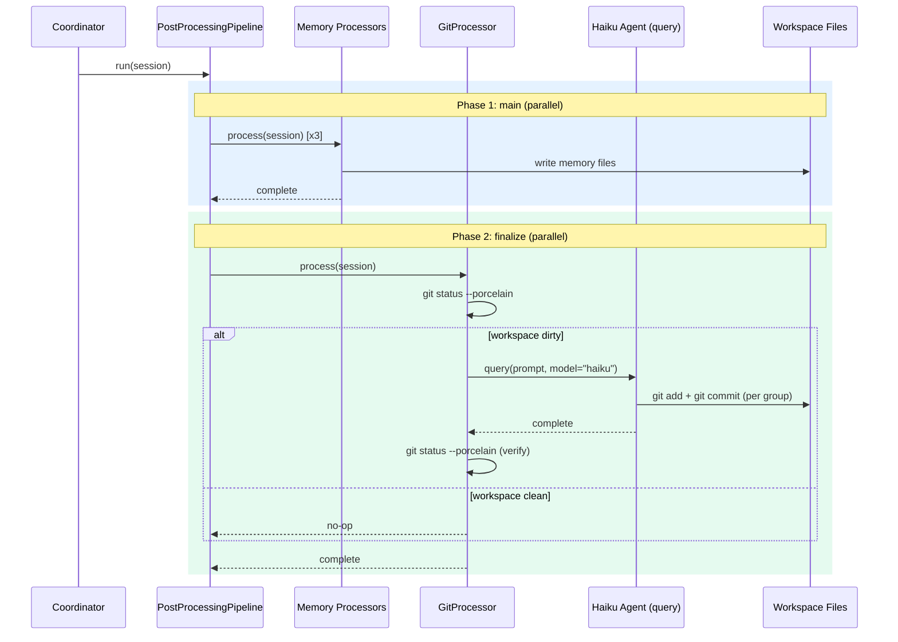
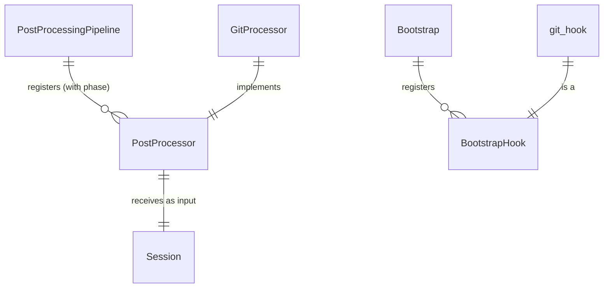

# Design: DLT-020 - Git module for workspace version tracking

**Delta Spec**: [../delta-specs/DLT-020.md](../delta-specs/DLT-020.md)
**Status**: Approved

## Purpose

This document explains the design rationale for this delta: the modeling choices, data flow, system behavior, and architectural approach.

After implementation, the "Detected Impacts" section will guide reconciliation into feature design docs.

## Problem Context

Workspace changes (memories, context files, configuration) happen as side effects of post-processing — forked LLM agents autonomously read/write files during memory extraction. These changes are invisible: there's no history, no diff, no rollback. If an extraction agent writes bad data, the user can't see what changed or revert it.

**Constraints:**
- Must run after all other post-processors complete (memory extraction writes files the git processor needs to see)
- Must not depend on gitpython or any Python git library — the agent uses bash git commands directly
- Must work on a fresh workspace with no prior git history
- No global git config dependency — committer identity configured per-repo
- Intentionally simple for v1: linear history, single branch, no merging/PRs

**Interactions:**
- DLT-008 post-processing pipeline: git processor registers in a new `finalize` phase (this delta extends the pipeline to support phased execution)
- DLT-023 workspace bootstrap: git hook registers after workspace hook to ensure the directory exists
- Memory extraction processors: their file writes are what the git processor commits

## Design Overview

Two independent components:

1. A **git bootstrap hook** that initializes the workspace as a git repo on first run (idempotent)
2. A **git post-processor** that spawns a lightweight Haiku agent to inspect, group, and commit workspace changes after each session

The post-processor requires a new pipeline capability — **phased execution** — so it runs after all memory extraction processors complete. This extends `PostProcessingPipeline` to support sequential phases (`main` → `finalize`), where processors within each phase still run in parallel.

```
┌─────────────────────────────────────────────────────────┐
│                     __main__.py                          │
│                                                          │
│  bootstrap.register("git", git_hook)  ◄── after workspace│
│                                                          │
│  pipeline.register(EpisodicProcessor(cwd))               │
│  pipeline.register(FactsProcessor(cwd))                  │
│  pipeline.register(PreferencesProcessor(cwd))            │
│  pipeline.register(GitProcessor(cwd), phase="finalize")  │
└─────────────────────────────────────────────────────────┘
                          │
              on shutdown │
                          ▼
┌─────────────────────────────────────────────────────────┐
│             PostProcessingPipeline                       │
│                                                          │
│  Phase 1: "main"                                         │
│    ┌──────────┐ ┌──────────┐ ┌──────────┐               │
│    │ Episodic │ │  Facts   │ │  Prefs   │  (parallel)    │
│    └──────────┘ └──────────┘ └──────────┘               │
│         │            │            │                       │
│         ▼            ▼            ▼                       │
│    files written to memories/                             │
│                                                          │
│  Phase 2: "finalize"                                     │
│    ┌──────────────────────┐                              │
│    │    GitProcessor      │                              │
│    │  git status dirty?   │                              │
│    │  → spawn Haiku agent │                              │
│    │  → group + commit    │                              │
│    └──────────────────────┘                              │
└─────────────────────────────────────────────────────────┘
```

## Shape

| Part | Mechanism | Flag |
|------|-----------|:----:|
| **S1** | **Git bootstrap hook** — Async function in `src/tachikoma/git/hooks.py`, registered in `__main__.py` after workspace hook. Checks for `.git` in workspace via `Path.exists()`. If missing: runs `git init`, `git config user.name/user.email` (repo-local, fixed identity), `git commit --allow-empty -m "Initial commit"` — all via `asyncio.create_subprocess_exec`. No `.gitignore` created. Idempotent (skips if `.git` exists). | |
| **S2** | **Phased pipeline execution** — Extends `PostProcessingPipeline.register()` with `phase` parameter (default `"main"`). Pipeline stores processors in `dict[str, list[PostProcessor]]`. Phase values validated at registration against a fixed set (`"main"`, `"finalize"`). `run()` executes main-phase processors in parallel first, then finalize-phase processors in parallel. Error isolation applies per-processor across both phases (finalize runs even if main processors fail). | |
| **S3** | **Git post-processor** — `PostProcessor` subclass in `src/tachikoma/git/processor.py`, registered in the `finalize` phase. Runs `git status --porcelain` via `asyncio.create_subprocess_exec` to detect changes. If clean → no-op return. If dirty → spawns fresh `query()` call (no resume/fork) with `model="haiku"`, `cwd=workspace_path`, `permission_mode="bypassPermissions"`, no resource limits. After agent completes, runs `git status --porcelain` again and logs warning if uncommitted changes remain. | |
| **S4** | **Commit agent prompt** — General-purpose prompt instructing the agent to: inspect `git status` and `git diff`, group changes into cohesive commits by subdirectory/purpose, `git add` + `git commit` per group with descriptive messages, include all non-ignored changes, never ask for confirmation. Explicitly restricts to safe git commands only (no push, branch, reset, checkout). Prompt co-located with processor as a module-level constant. | |

## Components

### Implementation Structure

| Layer/Component | Responsibility | Key Decisions |
|-----------------|----------------|---------------|
| `src/tachikoma/git/__init__.py` | Re-exports: `git_hook`, `GitProcessor` | Clean public API for the git package |
| `src/tachikoma/git/hooks.py` | `git_hook`: initializes workspace as git repo | Subsystem-owned hook pattern; uses `asyncio.create_subprocess_exec` for git commands |
| `src/tachikoma/git/processor.py` | `GitProcessor(PostProcessor)` + `GIT_COMMIT_PROMPT` constant + `query_and_consume` helper | Prompt co-located with processor; fresh `query()` (not fork); helper similar to `fork_and_consume` but without session resume |
| `src/tachikoma/post_processing.py` | Extended `PostProcessingPipeline` with phased execution | `register()` gains `phase` parameter; backward-compatible default `"main"` |

### Cross-Layer Contracts



**Integration Points:**
- Pipeline ↔ Processors: `register(processor, phase="main"|"finalize")`, `process(session)` called in parallel within each phase
- GitProcessor ↔ subprocess: `asyncio.create_subprocess_exec("git", "status", "--porcelain")` for dirty check and post-agent verification
- GitProcessor ↔ SDK: `query(prompt=GIT_COMMIT_PROMPT, options=ClaudeAgentOptions(model="haiku", cwd=..., permission_mode="bypassPermissions"))` — fresh stateless call, not a session fork
- Bootstrap ↔ Git hook: `git_hook` runs after workspace hook, uses `asyncio.create_subprocess_exec` for `git init`, `git config`, `git commit`

**Error contract:**
- Git hook failures propagate as `BootstrapError` (fail-fast, per DLT-023 R7)
- GitProcessor failures caught by `asyncio.gather(return_exceptions=True)` and logged (per DLT-008 error isolation)
- Phase-level errors don't prevent subsequent phases — the finalize phase always runs even if the main phase has failures
- Partial commits are valid — if the agent commits 1 of 3 groups then fails, those commits persist and remaining changes are picked up on the next run

### Shared Logic

- **`PostProcessor` ABC** (`post_processing.py`): shared interface. No changes to the ABC itself.
- **`query_and_consume` function** (`git/processor.py`): standalone helper for fresh `query()` calls (no session fork). Similar to `fork_and_consume` but without `resume`/`fork_session`. Propagates all exceptions to the caller — the pipeline's `gather(return_exceptions=True)` handles error isolation. Local to the git module since no other processor currently needs this pattern.
- **Phase constants** (`post_processing.py`): `MAIN_PHASE = "main"`, `FINALIZE_PHASE = "finalize"` — centralized in the pipeline module alongside the phase validation logic.

## Modeling

The domain model is minimal — no persistent entities or state. The git processor is stateless; all state lives in the workspace filesystem and git history.

```
PostProcessingPipeline
├── _phases: dict[str, list[PostProcessor]]   (processors grouped by phase)
├── _phase_order: list[str]                   (["main", "finalize"])
├── _lock: asyncio.Lock                       (serializes concurrent runs)
├── register(processor, phase="main") → None  (validates phase, appends)
└── run(session) → None                       (phases sequential, processors parallel)

GitProcessor(PostProcessor)
├── _cwd: Path
└── process(session) → None

git_hook(ctx: BootstrapContext) → None        (async bootstrap hook)

query_and_consume(prompt, cwd) → None         (standalone helper)
```



## Data Flow

### Bootstrap: git repo initialization (every launch)

```
1. __main__.py registers git_hook after workspace hook
2. bootstrap.run() executes hooks in registration order
3. git_hook(ctx) runs:
   a. Read workspace_path from ctx.settings_manager.settings
   b. Check if workspace_path / ".git" exists
      ├─ exists → skip, return immediately (idempotent)
      └─ doesn't exist → continue
   c. Run: git init
   d. Run: git config user.name "Tachikoma"
   e. Run: git config user.email "tachikoma@local"
   f. Run: git commit --allow-empty -m "Initial commit"
   g. If any subprocess returns non-zero → raise with stderr output
```

### Pipeline: phased execution

```
1. pipeline.run(session) acquires asyncio.Lock
2. For each phase in ["main", "finalize"]:
   a. Collect processors registered for this phase
   b. If none → skip phase
   c. Run all via asyncio.gather(return_exceptions=True)
   d. Log exceptions per-processor with phase context (DES-002):
      "Processor failed: processor={name} phase={phase} err={err}"
3. Release lock
```

### Git post-processor: commit flow

```
1. GitProcessor.process(session) called during finalize phase
2. Run: git status --porcelain (from workspace cwd)
   ├─ empty output → log debug, return (no-op)
   └─ non-empty → continue
3. Spawn: query(prompt=GIT_COMMIT_PROMPT, options=ClaudeAgentOptions(
       model="haiku",
       cwd=self._cwd,
       permission_mode="bypassPermissions",
   ))
4. Consume all messages from the async iterator (fully drain)
5. Run: git status --porcelain (verification)
   ├─ empty → log debug "all changes committed"
   └─ non-empty → log warning "uncommitted changes remain after git processor"
```

## Key Decisions

### Fresh query() instead of fork_and_consume

**Choice**: The git processor uses a fresh `query()` call, not `fork_and_consume` with session forking.
**Why**: The git agent doesn't need conversation history — it only needs to inspect the workspace filesystem and run git commands. A fresh call is simpler, cheaper (no forked context), and avoids coupling to the user's session. This is different from memory processors, which fork to access the conversation transcript.
**Sources**: SDK docs confirm `query()` without `resume`/`fork_session` creates a stateless call.
**Options Researched**: `fork_and_consume` (existing pattern), fresh `query()`, subprocess-only (no LLM)
**Why This Over Alternatives**: Fork adds unnecessary conversation context and cost. Subprocess-only lacks the flexibility to handle varied workspace structures intelligently — grouping logic benefits from LLM judgment.

**Consequences**:
- Pro: Cheaper per-run (no conversation context in prompt)
- Pro: Simpler — no session dependency, can run even without an active SDK session
- Con: Can't reference conversation content in commit messages (acceptable — commit messages describe file changes, not conversation topics)

### query_and_consume local to git module

**Choice**: Place the `query_and_consume` helper in `src/tachikoma/git/processor.py`, not in `post_processing.py`.
**Why**: `fork_and_consume` in `post_processing.py` is shared because multiple memory processors use it. `query_and_consume` currently has one consumer (GitProcessor). Moving it to the shared module adds API surface for no current benefit. If another processor needs fresh queries later, it can be promoted.

**Consequences**:
- Pro: Keeps `post_processing.py` focused on the shared pipeline mechanism
- Pro: Git module is self-contained
- Con: If another fresh-query processor appears, the helper needs to move (minor refactor)

### Phased execution via registration parameter

**Choice**: `register(processor, phase="main")` with default for backward compatibility.
**Why**: The pipeline controls phase knowledge, not individual processors. The ABC stays clean (no phase property). Existing callers don't change — `register(proc)` defaults to `"main"`.
**Options Researched**: ABC property (couples processor to phase concept), separate register methods (less extensible), registration parameter (clean separation)
**Why This Over Alternatives**: Registration parameter is the only option that's backward-compatible AND keeps the ABC phase-agnostic.

**Consequences**:
- Pro: Zero changes to existing `register()` calls
- Pro: ABC stays generic — processors don't know about phases
- Pro: Phase ordering is pipeline's responsibility
- Con: Phase declared at registration site, not with the processor (acceptable — `__main__.py` is the wiring point)

### Phase set as a fixed collection

**Choice**: Valid phases are `["main", "finalize"]` — a fixed list validated at registration.
**Why**: Only two phases are needed (regular processing, then cleanup/finalization). An open enum would be over-engineering. Validation at registration catches typos immediately.

**Consequences**:
- Pro: Typos caught at startup, not at runtime
- Pro: No need for priority/ordering logic
- Con: Adding a new phase requires a code change (acceptable — new phases are architectural decisions)

### Model "haiku" with no resource limits

**Choice**: Use `model="haiku"` with no `max_turns` or `max_budget_usd`.
**Why**: Haiku is the cheapest available model, appropriate for a mechanical task (inspect diff, group, commit). The task is naturally bounded (finite workspace changes) and Haiku's per-token cost is minimal. The prompt restricts the agent to a small set of git commands, inherently limiting what it can do.
**Sources**: SDK's `ClaudeAgentOptions.model` accepts a string. `"haiku"` is a valid model alias that resolves through the SDK's model resolution.

**Consequences**:
- Pro: Simplest configuration
- Pro: No risk of the agent stopping mid-commit due to turn limits
- Con: Theoretically unbounded cost in pathological cases (mitigated by Haiku's low cost and the task's natural boundary)

### Python-side dirty check before spawning agent

**Choice**: The git post-processor runs `git status --porcelain` via subprocess to detect changes before deciding whether to spawn the Haiku agent.
**Why**: Spawning an agent via `query()` has a fixed overhead (CLI process startup, model invocation). Checking `git status` in Python first is near-instant and avoids the entire agent cost for no-op cases (trivial conversations where memory processors write nothing). This is the common case — most sessions produce some changes, but idle/trivial sessions shouldn't incur LLM cost.
**Alternatives Considered**:
- Let the agent handle everything (including the no-op check): simpler code but wastes an agent call on every clean session

**Consequences**:
- Pro: Zero cost for clean workspaces
- Pro: The agent only runs when there's actual work to do
- Con: Duplicates the "is dirty?" check (Python checks, agent also sees status) — acceptable since the check is cheap

### Async subprocess for git commands

**Choice**: Use `asyncio.create_subprocess_exec` for all git subprocess calls (both in the bootstrap hook and the processor's dirty check).
**Why**: Bootstrap hooks are async functions. The git processor runs inside an async pipeline. Using async subprocess is consistent with the async execution context and doesn't block the event loop.

**Consequences**:
- Pro: Consistent with async contract
- Pro: Non-blocking (matters if other finalize-phase processors run in parallel)
- Con: Slightly more boilerplate than `subprocess.run` (acceptable)

### Git package with separate hook and processor modules

**Choice**: `src/tachikoma/git/` package with `hooks.py` and `processor.py`.
**Why**: Separates bootstrap concerns (hook) from runtime concerns (post-processor). Follows the pattern established by `memory/` package.
**Alternatives Considered**: Single `git.py` module — simpler but mixes bootstrap and runtime code.

**Consequences**:
- Pro: Clear separation of bootstrap vs. runtime
- Pro: Consistent with `memory/` package structure
- Con: More files for a small feature (acceptable)

## System Behavior

### Scenario: First launch — no git repo

**Given**: Workspace exists but has no `.git` directory
**When**: Bootstrap runs the git hook
**Then**: `git init` creates a repo, repo-local config sets identity to "Tachikoma"/"tachikoma@local", an empty initial commit is created. No `.gitignore` is created.
**Rationale**: Idempotent bootstrap; fixed identity avoids global git config dependency.

### Scenario: Subsequent launch — git repo exists

**Given**: Workspace has an existing `.git` directory
**When**: Bootstrap runs the git hook
**Then**: The hook detects `.git` exists and returns immediately.
**Rationale**: Self-determining idempotent hook, per DLT-023 pattern.

### Scenario: `.git` directory was deleted

**Given**: Workspace previously had a git repo, but `.git` was deleted
**When**: Bootstrap runs the git hook
**Then**: The hook detects no `.git` and re-initializes (same as first launch). Previous history is lost, but the workspace files are intact and will be committed fresh.
**Rationale**: Idempotent re-initialization, per R3.1.

### Scenario: Session ends with workspace changes

**Given**: Memory extraction processors wrote files to `memories/episodic/`, `memories/facts/`, and `memories/preferences/`
**When**: The finalize phase runs the git post-processor
**Then**: `git status --porcelain` detects changes. Haiku agent is spawned. Agent inspects the diff, groups by subdirectory, creates separate commits (e.g., "Update episodic memories for 2026-03-13", "Add new user preference"). Post-agent verification confirms clean workspace.
**Rationale**: Phased execution guarantees all memory writes are visible before the git processor runs.

### Scenario: Session ends with no changes

**Given**: Memory extraction found nothing to extract (trivial conversation)
**When**: The finalize phase runs the git post-processor
**Then**: `git status --porcelain` returns empty output. Processor returns immediately without spawning an agent.
**Rationale**: No-op is the cheapest path; avoids unnecessary LLM costs.

### Scenario: Main-phase processor fails

**Given**: The facts processor throws an exception during main phase
**When**: Main phase completes and finalize phase begins
**Then**: The git post-processor still runs. It commits whatever changes were successfully written by the other processors.
**Rationale**: Error isolation across phases — finalize always runs, same principle as DLT-008's per-processor error isolation.

### Scenario: Agent commits some groups but fails mid-way

**Given**: The Haiku agent successfully commits changes in `memories/episodic/` but crashes before committing `memories/facts/` changes
**When**: The git processor resumes after agent failure
**Then**: The episodic commit is preserved as valid history. The post-agent `git status` check logs a warning about remaining uncommitted changes. Those changes will be committed on the next session's post-processing run.
**Rationale**: Partial commits are by design. No rollback logic needed — the next run picks up leftovers.

### Scenario: git init fails (permissions)

**Given**: Workspace directory exists but git can't initialize (e.g., permission issue)
**When**: Bootstrap runs the git hook
**Then**: The subprocess returns non-zero. The hook raises an exception, which Bootstrap wraps as `BootstrapError("Hook 'git' failed: ...")`. Startup aborts.
**Rationale**: Fail-fast on infrastructure issues, per DLT-023 R7.

### Scenario: No global git config on the system

**Given**: The system has no `~/.gitconfig` or global git config
**When**: The git hook initializes the repo
**Then**: Commits succeed because the committer identity is set via repo-local `git config` (not global). No dependency on global config.
**Rationale**: Self-contained repo setup, per R3.2.

### Scenario: Empty main phase

**Given**: No processors are registered for the main phase
**When**: The pipeline runs
**Then**: The main phase is a no-op (empty gather). The finalize phase runs normally with the git post-processor.
**Rationale**: Phases with no processors are harmlessly skipped.

### Scenario: Unknown phase at registration

**Given**: A processor is registered with `phase="cleanup"` (invalid)
**When**: `pipeline.register()` is called
**Then**: `ValueError` is raised immediately with a message listing valid phases.
**Rationale**: Fail-fast at startup catches configuration errors early.

## Open Questions

- [ ] Prompt effectiveness with Haiku: the commit grouping prompt may need iteration based on real-world testing. The general heuristic approach is intentionally flexible, but edge cases (very large diffs, unusual file structures) may require prompt refinement.

---

## Detected Impacts

### Affected Feature Designs
- **docs/feature-designs/agent/workspace-bootstrap.md** — Adds: git bootstrap hook registered after workspace hook in the hook execution order
- **docs/feature-designs/agent/core-architecture.md** — Adds: git post-processor as a finalize-phase processor in the pipeline; `__main__.py` startup flow gains git hook registration and GitProcessor registration
- **docs/feature-designs/memory/memory-extraction.md** — Modifies: `PostProcessingPipeline` now supports phased execution (register with phase parameter); pipeline model diagram gains phase structure; execution flow description updated to include sequential phases

### Notes for Reconciliation
- Update workspace-bootstrap.md hook list to include git hook
- Update core-architecture.md startup flow to include git processor registration with `phase="finalize"`
- Update memory-extraction.md pipeline description and modeling to reflect phased execution
- Existing `PostProcessingPipeline` tests will need updating for the new internal structure (`_phases` dict replaces `_processors` list). The public API (`register()`, `run()`) is backward-compatible, but tests that directly inspect `_processors` will break.

## Notes

- The git processor intentionally does not use `fork_and_consume` — it calls `query()` directly because it doesn't need the conversation transcript. This establishes a second pattern for post-processors: fork-based (memory extraction) vs. fresh-query (git commits).
- The prompt instructs the agent to include all non-ignored changes. Since R6 specifies no `.gitignore` is created by bootstrap, all workspace content is tracked by default.
- Agent guardrails (safe git commands only) are enforced via prompt instructions, consistent with how memory processors enforce file scope constraints via prompt.
- Phase constants (`MAIN_PHASE`, `FINALIZE_PHASE`) are defined in `post_processing.py` alongside the pipeline, keeping phase knowledge centralized.
- The coordinator's `on_status` callback currently emits "Processing memories..." before the pipeline runs. With phased execution, the finalize phase (git commits) happens after memory processing. Extending the status callback for per-phase notifications is out of scope for this delta — the existing message is generic enough, and adding phase-aware status would require the pipeline to know about UI callbacks, breaking its domain-agnostic design.
