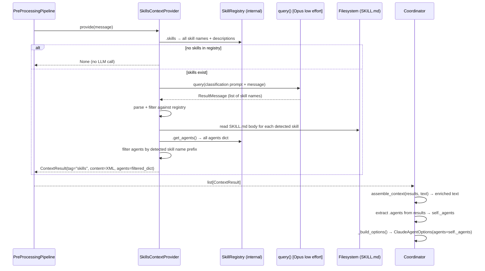
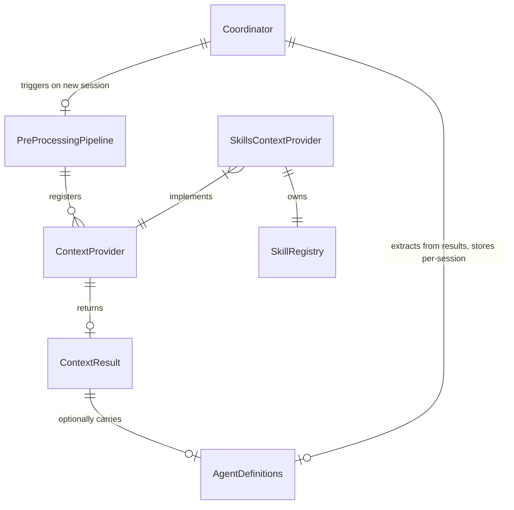

# Design: DLT-021 - Skill Detection and Context Injection

**Delta Spec**: [../delta-specs/DLT-021.md](../delta-specs/DLT-021.md)
**Status**: Draft

## Purpose

This document explains the design rationale for this delta: the modeling choices, data flow, system behavior, and architectural approach.

After implementation, the "Detected Impacts" section will guide reconciliation into feature design docs.

## Problem Context

Currently all agents from all skills are loaded at startup and passed to the coordinator, which forwards them to the SDK for every message. This means the SDK always sees every agent, regardless of relevance — wasting context and potentially degrading delegation quality when irrelevant agents compete for attention.

The skill system needs intelligence to load only the right skills per conversation session. Detection must happen before the first message is processed (pre-processing phase), and detected skills must persist for the session without re-running detection on every message.

**Constraints:**
- Detection must be LLM-based (skill descriptions + user message), not keyword/pattern matching
- The pre-processing pipeline interface (`ContextProvider` → `ContextResult`) must be extended to carry structured data (agent definitions) alongside text context, without breaking existing providers
- Provider failures must never block messages — same error contract as memory context provider
- No changes to SKILL.md format or skill registry discovery mechanism

**Interactions:**
- Pre-processing pipeline ([pre-processing-pipeline](../feature-designs/agent/pre-processing-pipeline.md)): skills provider registers alongside memory provider
- Skill registry ([skills](../feature-designs/agent/skills.md)): provider creates its own registry to discover skills and agents
- Coordinator ([core-architecture](../feature-designs/agent/core-architecture.md)): extracts agents from pipeline results, tracks per-session
- Memory context provider ([memory-context-retrieval](../feature-designs/memory/memory-context-retrieval.md)): runs in parallel with skills provider; pattern reference for agent-based providers

## Design Overview

A `SkillsContextProvider` implements the `ContextProvider` ABC and plugs into the pre-processing pipeline alongside `MemoryContextProvider`. On new session start, it classifies which skills are relevant using a forked Opus agent (low effort), injects matched skills' content as a `<skills>` XML block, and returns detected agents via a new `agents` property on `ContextResult`. The coordinator extracts agents from pipeline results and stores them for the session duration.

```
┌──────────────────────────────────────────────────────────────────────┐
│                         PreProcessingPipeline                         │
│                                                                       │
│  ┌─────────────────────────┐   ┌──────────────────────────────────┐  │
│  │  MemoryContextProvider  │   │  SkillsContextProvider           │  │
│  │  → ContextResult        │   │  → ContextResult (with agents)   │  │
│  │    tag="memories"       │   │    tag="skills"                  │  │
│  │    agents=None          │   │    agents={detected agents dict} │  │
│  └─────────────────────────┘   └──────────────────────────────────┘  │
│                                                                       │
│  asyncio.gather() → list[ContextResult]                               │
└───────────────────────────────┬───────────────────────────────────────┘
                                │
                                ▼
┌──────────────────────────────────────────────────────────────────────┐
│                          Coordinator                                  │
│                                                                       │
│  1. assemble_context(results, message) → enriched message (existing)  │
│  2. Extract .agents from results → merge → self._agents (new)         │
│  3. _build_options() → ClaudeAgentOptions(agents=self._agents)        │
└──────────────────────────────────────────────────────────────────────┘
```

## Shape

| Part | Mechanism | Flag |
|------|-----------|:----:|
| **S1** | Skills context provider — implements `ContextProvider`, creates its own `SkillRegistry` internally (self-contained, like `MemoryContextProvider` reads its own files). Uses forked Opus agent (low effort) to classify which skills are relevant based on all skill names + descriptions and the user message. Reads SKILL.md body (no frontmatter) from filesystem for detected skills. Returns `ContextResult` with `<skills>` XML block and `agents` property populated with matched skills' agent definitions filtered by namespace prefix. | |
| **S2** | Extended `ContextResult` — add `agents: dict[str, AgentDefinition] | None = None` as a specific optional property with default `None`. Existing providers that don't set `agents` continue working unchanged (backward compatible). | |
| **S3** | Coordinator per-session agent tracking — `_agents` field becomes session-scoped: populated from pipeline results after pre-processing on each new session, persists across subsequent messages, cleared on session transition. Specifically: add `self._agents = None` to `_handle_transition` alongside the existing `self._sdk_session_id = None` (coordinator.py ~line 395) so re-detection runs on the next session. | |
| **S4** | Pipeline-to-coordinator handoff — after `pipeline.run()` returns `list[ContextResult]`, the coordinator iterates results, merges all non-None `agents` dicts into a combined dict, and stores as `self._agents`. This flows into `_build_options()` → `ClaudeAgentOptions(agents=...)`. | |
| **S5** | Startup wiring changes — `SkillsContextProvider(cwd=workspace_path, cli_path=cli_path)` registered in the pre-processing pipeline. `SkillRegistry` creation and `agents=` parameter removed from `__main__.py` coordinator construction. | |

### Flagged Unknowns

(none)

## Components

### Implementation Structure

| Layer/Component | Responsibility | Key Decisions |
|-----------------|----------------|---------------|
| `src/tachikoma/skills/context_provider.py` | `SkillsContextProvider(ContextProvider)` — creates its own `SkillRegistry` in `__init__`, uses standalone `query()` with Opus low effort for classification, reads SKILL.md bodies from filesystem, assembles `<skills>` XML block, filters agents by namespace prefix. `SKILL_CLASSIFICATION_PROMPT` constant co-located with provider. Fully consumes the query() generator (DES-005). | Self-contained provider (owns registry); no tools for classification agent (pure reasoning over provided text); `frontmatter` library for stripping YAML from SKILL.md body |
| `src/tachikoma/pre_processing.py` | `ContextResult` dataclass extended with `agents: dict[str, AgentDefinition] \| None = None` field | Specific named property, not generic extras dict; default `None` preserves backward compatibility |
| `src/tachikoma/coordinator.py` | `_agents` becomes session-scoped. After pre-processing, extracts `agents` from `list[ContextResult]` and merges into `self._agents`. `_handle_transition` clears `_agents`. Constructor `agents` parameter removed. | Extraction as a private method or inline block; merge via `dict.update()` |
| `src/tachikoma/__main__.py` | Registers `SkillsContextProvider` in pre-processing pipeline. Removes `SkillRegistry` creation and `agents=` parameter from `Coordinator()` call. | Provider is self-contained — only needs `cwd` and `cli_path` |

### Cross-Layer Contracts



**Integration Points:**
- SkillsContextProvider ↔ Pipeline: registers via `pipeline.register(provider)`; `provide(message)` called in parallel with memory provider
- SkillsContextProvider ↔ SkillRegistry: internal — provider creates registry in `__init__`, reads `skills` property and calls `get_agents()`
- SkillsContextProvider ↔ SDK: standalone `query()` call for classification (no tools, low effort)
- SkillsContextProvider ↔ Filesystem: reads SKILL.md files via `frontmatter.load()` for detected skills
- Pipeline ↔ Coordinator: `pipeline.run()` returns `list[ContextResult]`; coordinator reads both `content` (text) and `agents` (structured) from results
- Coordinator ↔ SDK: `_build_options()` passes `self._agents` to `ClaudeAgentOptions(agents=...)`

**Error contract:**
- If classification agent fails (SDK error, timeout), provider catches, logs per DES-002, returns None (no agents, no context)
- If classification response is unparseable (no valid skill names), provider logs warning, returns None
- If SKILL.md file read fails for a detected skill, that skill's content and agents are skipped; other detected skills proceed
- Pipeline-level: `asyncio.gather(return_exceptions=True)` isolates provider failures from each other
- Coordinator-level: if pre-processing fails entirely, message proceeds with no agents and no context enrichment

### Shared Logic

- **`ContextResult.agents`** (`pre_processing.py`): new optional property shared between providers (production) and coordinator (consumption). Type-safe contract — no generic dict or runtime type narrowing needed.

## Modeling

```
SkillsContextProvider(ContextProvider)
├── _registry: SkillRegistry     (owned, created in __init__)
├── _cwd: Path                   (workspace directory for reading SKILL.md files)
├── _cli_path: str | None        (optional Claude CLI binary path)
└── provide(message: str) → ContextResult | None

SKILL_CLASSIFICATION_PROMPT: str  (module-level constant, embeds {skills} and {message})

ContextResult (dataclass, extended)
├── tag: str                                           (existing)
├── content: str                                       (existing)
└── agents: dict[str, AgentDefinition] | None = None   (new, default None)

Coordinator (modified fields)
├── _agents: dict[str, AgentDefinition] | None   (was: set at init; now: session-scoped)
└── agents parameter removed from __init__
```



## Data Flow

### Skills detection flow

```
1. provider.provide(message) is called
2. Check self._registry.skills — if empty dict → return None immediately (no LLM call)
3. Build classification prompt:
   - Format all skill names + descriptions from registry.skills
   - Embed user message
4. Create ClaudeAgentOptions(model="opus", effort="low", max_turns=3,
   permission_mode="bypassPermissions", cwd=self._cwd, cli_path=self._cli_path)
   Note: no allowed_tools — classification is pure reasoning, no file access needed
5. Call query(prompt=prompt, options=options)
6. Async iterate over the returned generator (fully consumed per DES-005):
   - On ResultMessage:
     a. If is_error → log warning, set result to None
     b. If result contains NO_RELEVANT_SKILLS sentinel → set result to None
     c. If result has content → parse as skill names (one per line)
7. Filter parsed names against registry.skills keys (discard unrecognized names)
8. If no valid skills detected → return None
9. For each detected skill name:
   a. Read SKILL.md body from cwd/skills/{name}/SKILL.md using frontmatter.load()
      (strip YAML frontmatter, keep markdown body)
   b. Record skill directory path: cwd/skills/{name}
   c. If read fails → log warning, skip this skill
10. Assemble <skills> XML block:
    Each skill as: skill name, directory path, SKILL.md body — clearly delineated
11. Filter registry.get_agents() into a new dict: keep agents whose namespace
    starts with any detected skill name + "/" prefix (do not mutate the
    registry's internal dict — get_agents() returns it directly)
12. Return ContextResult(tag="skills", content=xml_block, agents=filtered_agents or None)
13. If any exception during entire flow → catch, log per DES-002, return None
```

### Pipeline-to-coordinator handoff flow

```
1. pipeline.run(message) returns list[ContextResult]
2. Text assembly: assemble_context(results, message) → enriched message (existing behavior)
3. Agent extraction (new):
   a. Iterate results
   b. For each result with .agents not None: merge into combined dict
   c. If combined dict is non-empty → self._agents = combined dict
   d. If no agents found → self._agents = None
4. _build_options() uses self._agents → ClaudeAgentOptions(agents=self._agents)
```

### Session lifecycle with agents

```
New session (first message or after topic shift):
  1. Coordinator detects is_new_session
  2. Pre-processing pipeline runs (memory + skills in parallel)
  3. Coordinator extracts text context + agents from results
  4. self._agents populated from results
  5. Message sent to SDK with enriched text + detected agents

Subsequent messages (same session):
  1. Pre-processing is NOT run (existing behavior)
  2. self._agents persists from session start
  3. _build_options() passes same agents to SDK

Topic shift (session transition):
  1. _handle_transition() runs
  2. self._agents = None (cleared alongside self._sdk_session_id)
  3. New session created
  4. Pre-processing runs on next message → re-detection
```

### Startup flow changes

```
Before (current):
  1. SkillRegistry(workspace_path) created in __main__.py
  2. agents = registry.get_agents()
  3. Coordinator(agents=agents) — all agents at init

After (DLT-021):
  1. SkillsContextProvider(cwd=workspace_path, cli_path=cli_path) created
  2. pre_pipeline.register(skills_provider)
  3. Coordinator() — no agents parameter
  4. Detection happens per-session via pre-processing pipeline
```

## Key Decisions

### Provider owns its SkillRegistry

**Choice**: `SkillsContextProvider` creates `SkillRegistry` internally in `__init__`, rather than receiving it via constructor injection.
**Why**: With DLT-021, the coordinator no longer needs agents from the registry directly — agents flow through the pipeline. The provider is the sole consumer of the registry, so it can own it. This follows the same self-contained pattern as `MemoryContextProvider` (which manages its own file access).
**Alternatives Considered**:
- Registry passed via constructor from `__main__.py`: Adds coupling; requires `__main__.py` to know about the registry for no other reason
- Registry from bootstrap extras: No standardized pattern exists for passing bootstrapped objects to pre-processors

**Consequences**:
- Pro: Self-contained, consistent with `MemoryContextProvider` pattern
- Pro: Simplifies `__main__.py` wiring — provider only needs `cwd` and `cli_path`
- Con: If future consumers need the registry, it would need to be extracted (unlikely — detection flow replaces direct registry access)

### Specific named property on ContextResult

**Choice**: Add `agents: dict[str, AgentDefinition] | None = None` as a named field on `ContextResult`, not a generic extras dict.
**Why**: Type-safe and self-documenting. The coordinator knows exactly what property to read without runtime type narrowing or key lookups. The field name makes the contract explicit.
**Alternatives Considered**:
- Generic `extras: dict[str, Any] | None`: Flexible but weakly typed; consumption requires `isinstance` checks or key lookups
- Separate `ContextResultWithAgents` subclass: Breaks the uniform `list[ContextResult]` type from pipeline

**Consequences**:
- Pro: Type-safe at both production (provider) and consumption (coordinator)
- Pro: Backward compatible — existing providers don't set it, defaults to None
- Con: Adding new structured data in the future requires a new field on ContextResult (acceptable — each extension is explicit)
- Con: Introduces `AgentDefinition` import (from `claude_agent_sdk.types`) into `pre_processing.py`, which currently has zero SDK coupling. This is an intentional tradeoff: `pre_processing.py` is an internal infrastructure module (not a public interface), and the type safety benefit outweighs the coupling concern. The alternative (`dict[str, Any]`) would push type narrowing to every consumption site.

### Opus with low effort for classification

**Choice**: Use `model="opus"` with `effort="low"` for the skill classification agent.
**Why**: Classification requires understanding both skill descriptions and user intent — benefits from a stronger model. `effort="low"` keeps cost and latency reasonable. Consistent with the established `MemoryContextProvider` pattern.
**Sources**: Follows existing pattern from [memory context retrieval design](../feature-designs/memory/memory-context-retrieval.md)

**Consequences**:
- Pro: Better classification accuracy for nuanced skill matching
- Pro: Consistent with established provider pattern
- Con: Higher per-call cost than lighter models (mitigated by low effort)

### No tools for classification agent

**Choice**: The classification agent receives no tools (no `allowed_tools` parameter).
**Why**: Classification is purely reasoning over provided text (skill names, descriptions, user message). No filesystem access or search needed — all input is embedded in the prompt. Fewer tools means less latency and lower cost.
**Alternatives Considered**:
- Read/Glob/Grep like memory provider: Unnecessary — skill metadata is already in the prompt; agent doesn't need to search files

**Consequences**:
- Pro: Minimal cost and latency — single-turn reasoning
- Pro: More predictable execution (no tool loops)
- Pro: `max_turns=3` is generous for a no-tool classification task

### SKILL.md body read at detection time

**Choice**: Provider reads SKILL.md files from filesystem when skills are detected, rather than storing bodies in the registry.
**Why**: The registry stores metadata (name, description, version) for discovery. SKILL.md body is only needed for detected skills — reading at detection time avoids storing all bodies in memory. The `frontmatter` library (already a dependency) handles YAML stripping.
**Alternatives Considered**:
- Extend Skill dataclass with `body` field: Stores all bodies in memory; changes registry's data model

**Consequences**:
- Pro: Lower memory usage — only detected skills' bodies loaded
- Pro: No registry changes needed (R9 preserved)
- Con: Additional filesystem reads at detection time (negligible — one file per detected skill)

### Agent filtering by namespace prefix

**Choice**: Filter `registry.get_agents()` by checking if each agent's namespace key starts with `{detected_skill_name}/`.
**Why**: Agents are already namespaced as `skill-name/agent-name`. Prefix filtering naturally maps detected skill names to their agents without additional data structures.

**Consequences**:
- Pro: Simple, leverages existing namespace convention
- Pro: No additional data structures or registry methods needed
- Con: O(n) scan over all agents per detection (negligible — agent counts are small)

### NO_RELEVANT_SKILLS sentinel

**Choice**: The classification prompt instructs returning exactly `NO_RELEVANT_SKILLS` when no skills are relevant.
**Why**: Consistent with `MemoryContextProvider`'s `NO_RELEVANT_MEMORIES` pattern. Allows the provider to distinguish "classified and found nothing" from "agent error or unparseable response."

**Consequences**:
- Pro: Clean distinction between "no matches" and "error"
- Pro: Consistent with established sentinel pattern
- Pro: Provider can log differently for each case

## System Behavior

### Scenario: First message with relevant skills

**Given**: Skills exist in the registry, user sends a message matching one or more skills
**When**: Pre-processing runs on new session
**Then**: Provider classifies skills, detects matches, reads SKILL.md bodies, injects `<skills>` XML block, returns agents for matched skills. Coordinator stores agents for the session. SDK sees only relevant agents.
**Rationale**: Core happy path — targeted skill detection reduces context waste.

### Scenario: First message with no relevant skills

**Given**: Skills exist but none match the user's message
**When**: Pre-processing runs
**Then**: Classification agent returns `NO_RELEVANT_SKILLS`. Provider returns None (no context block, no agents). Coordinator has no agents for the session. Message proceeds with memory context only.
**Rationale**: Precision — irrelevant skills are not loaded.

### Scenario: No skills in registry

**Given**: Empty skills directory (or no skills/ directory)
**When**: Pre-processing runs
**Then**: Provider checks `registry.skills`, finds empty dict. Returns None immediately without making an LLM call.
**Rationale**: R10 — no-op when no skills exist. Avoids unnecessary API costs.

### Scenario: Subsequent message in same session

**Given**: Skills were detected on the first message
**When**: User sends a follow-up
**Then**: Pre-processing is NOT run (existing behavior — only runs on first message of new session). Agents from first detection persist via `self._agents`. SDK continues to see the same agents.
**Rationale**: R6 — session persistence without re-detection.

### Scenario: Topic shift causes new session

**Given**: Skills detected in current session
**When**: Boundary detector identifies a topic shift
**Then**: `_handle_transition` clears `self._agents`. New session created. Pre-processing runs on the first message of the new session, re-detecting skills from scratch.
**Rationale**: R6 — new session means new detection. The new topic may need different skills.

### Scenario: Classification agent fails

**Given**: Provider runs but the forked Opus agent fails (SDK error, timeout)
**When**: Exception is caught
**Then**: Provider logs the error (DES-002), returns None. No agents loaded, no skills context. Message proceeds unmodified. Other providers (memory) complete normally.
**Rationale**: R8 — detection failures never block the message.

### Scenario: Unparseable classification response

**Given**: Classification agent returns a response that can't be parsed as skill names
**When**: Provider processes the response
**Then**: Provider logs a warning, returns None. Graceful degradation — no agents, no skills context.
**Rationale**: R8 — unrecognizable responses handled gracefully.

### Scenario: SKILL.md read failure for one detected skill

**Given**: Two skills detected, but one skill's SKILL.md file is unreadable
**When**: Provider reads SKILL.md files
**Then**: The readable skill's content and agents are included. The unreadable skill is logged as a warning and skipped. The result contains partial context from the successful skill.
**Rationale**: Graceful degradation — one bad file doesn't prevent other skills from loading.

### Scenario: Multiple providers set agents on ContextResult

**Given**: SkillsContextProvider sets agents; a hypothetical future provider also sets agents
**When**: Coordinator extracts agents from pipeline results
**Then**: All agents dicts are merged via `dict.update()` — later results override earlier on key conflicts. All agents are available for the session.
**Rationale**: Future-proof — the merge pattern supports multiple agent-providing providers.

## Open Questions

(none — all resolved during design interview)

---

## Detected Impacts

### Affected Feature Designs
- **[docs/feature-designs/agent/pre-processing-pipeline.md](../feature-designs/agent/pre-processing-pipeline.md)** - Modifies: `ContextResult` extended with optional `agents` field; pipeline now carries structured data (agent definitions) alongside text context
- **[docs/feature-designs/agent/skills.md](../feature-designs/agent/skills.md)** - Modifies: Agent loading changes from all-at-startup via coordinator to per-session via skills context provider; adds skill detection and context injection as a new concern
- **[docs/feature-designs/agent/core-architecture.md](../feature-designs/agent/core-architecture.md)** - Modifies: Coordinator `_agents` becomes session-scoped instead of init-time; constructor no longer receives agents; extracts agents from pipeline results after pre-processing; `_handle_transition` clears agents

### Notes for Reconciliation
- Pre-processing pipeline feature design needs: updated `ContextResult` model with `agents` field; updated modeling section; note about structured data support
- Pre-processing pipeline feature spec needs: new requirement for optional structured data support on `ContextResult`
- Skills feature design needs: new section on skill detection and context injection; updated startup integration flow; updated key decision on "Agents Passed to SDK at Initialization" (now per-session)
- Skills feature spec needs: R4 updated from "at initialization" to "per-session based on detection"; new requirements for detection, classification, and context injection; DLT-021 removed from "Out of Scope"
- Core architecture feature design needs: updated coordinator state diagram (`_agents` session-scoped); updated startup flow (no `agents=` parameter); updated `_handle_transition` (clears agents); updated `_build_options` (session agents)
- Core architecture feature spec needs: R13 updated from "all agents at init" to "detected agents per session"
- New DES candidate: "Forked Opus agent with low effort for classification tasks" (pattern shared with memory context provider and now skills context provider)

## Notes

- The classification prompt design is an implementation detail — it embeds all skill names + descriptions and the user message, asking which skills are relevant. The exact phrasing is tuned during implementation.
- `max_turns=3` is generous for a no-tool classification task (single reasoning turn expected). `max_turns=1` would suffice; `3` provides a safety net in case the agent needs a follow-up turn. Implementer can tighten to `1` if testing confirms single-turn behavior.
- The provider fully consumes the `query()` generator (no early `return` or `break` inside `async for`). This follows DES-005 — preventing orphaned SDK resources.
- DLT-022 (skill detection quality eval) will test the precision/recall balance of the classification approach.
- The `frontmatter` library is already a project dependency (used by `SkillRegistry`), so no new dependency is needed.
