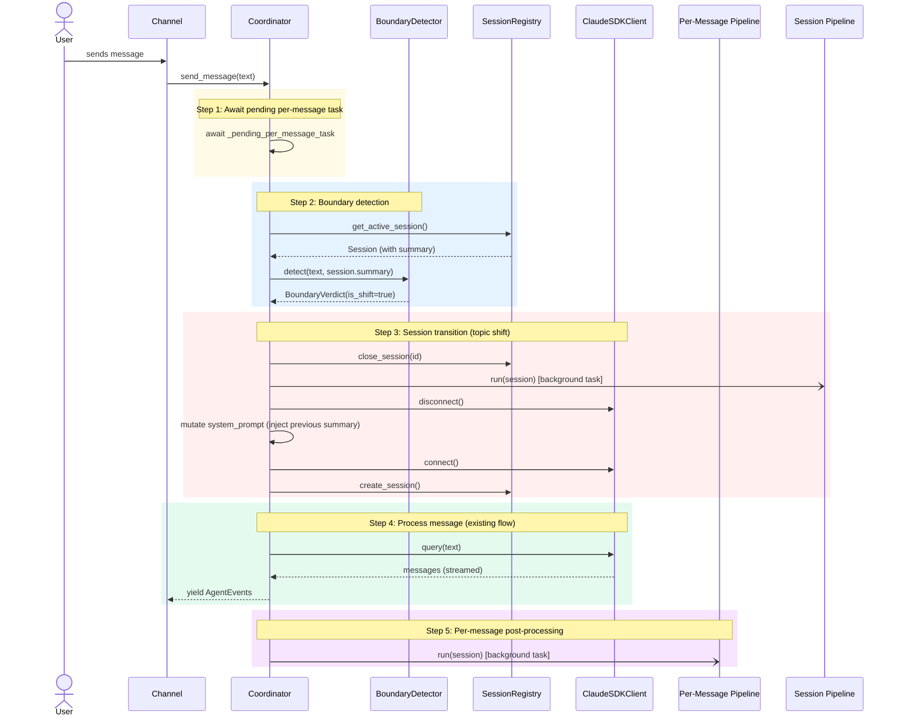
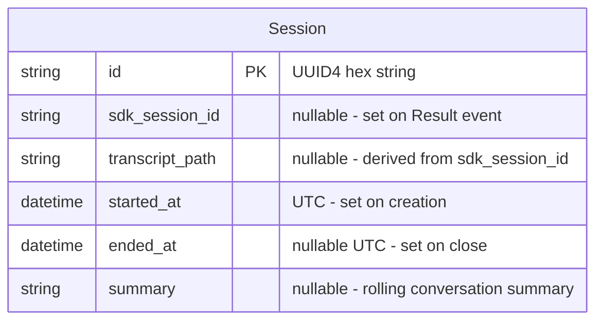
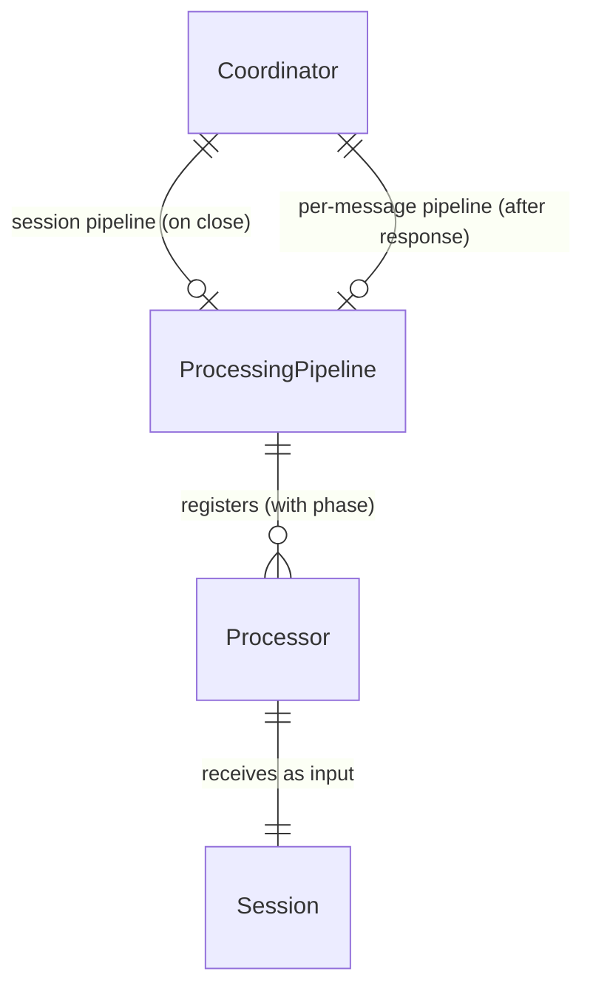

# Design: DLT-026 - Detect conversation boundaries via topic analysis

**Delta Spec**: [../delta-specs/DLT-026.md](../delta-specs/DLT-026.md)
**Status**: Approved

## Purpose

This document explains the design rationale for this delta: the modeling choices, data flow, system behavior, and architectural approach.

After implementation, the "Detected Impacts" section will guide reconciliation into feature design docs.

## Problem Context

The assistant currently treats all messages within a session as a single continuous conversation. When a user shifts topics (e.g., from discussing a Python bug to asking about dinner plans), the old topic's context bleeds into the new one — polluting agent responses and preventing proper memory extraction from the completed conversation.

**Constraints:**
- Boundary detection must add no more than 1-2 seconds to message processing latency (R6)
- Detection must operate independently of the active SDK conversation session (R12)
- Detection failures must never block message processing — fail-open to continuation (R8)
- The rolling summary must remain bounded in size regardless of conversation length (R13)
- The existing session-level post-processing pipeline must not be disrupted

**Interactions:**
- Coordinator (`core-architecture`): `send_message()` gains boundary detection gating, per-message pipeline trigger, await-pending logic, and SDK session reset
- Session registry (`sessions`): sessions can now close mid-conversation; `Session` gains a `summary` field
- Processing pipeline (`post-processing-pipeline`): pipeline is generalized from `PostProcessingPipeline`/`PostProcessor` to `ProcessingPipeline`/`Processor`, enabling reuse for per-message processing
- Session-level post-processing (`memory-extraction`, `workspace-version-tracking`): triggered asynchronously on boundary-detected session close, same as on shutdown

## Design Overview

Three new mechanisms layer onto the existing coordinator:

```
┌──────────────────────────────────────────────────────────────────┐
│                       Coordinator Layer                           │
│                                                                   │
│  send_message(text):                                              │
│    1. await pending per-message task     ◄── S4                   │
│    2. boundary check                     ◄── S5, S6               │
│       └─ if topic shift → transition     ◄── S7, S8, S9           │
│    3. process message via SDK (existing)                          │
│    4. fire per-message pipeline (async)  ◄── S3                   │
│                                                                   │
│  ┌───────────────────────────┐  ┌──────────────────────────────┐ │
│  │  BoundaryDetector         │  │  SummaryProcessor            │ │
│  │  (boundary/detector.py)   │  │  (boundary/summary.py)       │ │
│  │  standalone query() call  │  │  session fork + summarize    │ │
│  └───────────────────────────┘  └──────────────────────────────┘ │
│                                                                   │
│  ┌──────────────────────────────────────────────────────────────┐ │
│  │  ProcessingPipeline  (generic, renamed from PostProcessing)  │ │
│  │  ├── session-level instance (memory, git — existing)         │ │
│  │  └── per-message instance (summary processor — new)          │ │
│  └──────────────────────────────────────────────────────────────┘ │
└──────────────────────────────────────────────────────────────────┘
```

The **BoundaryDetector** is an independent classification agent that compares an incoming message against the current session's rolling summary. It uses a standalone `query()` call — completely decoupled from the coordinator's active SDK session.

The **SummaryProcessor** is a `Processor` that forks the SDK session after each agent response, prompting the agent to produce a bounded rolling summary of the conversation. The summary is stored on the session record for the next boundary check.

The **ProcessingPipeline** is the existing `PostProcessingPipeline` renamed and generalized — same phased execution mechanism, now usable in both session-level and per-message contexts.

## Shape

| Part | Mechanism | Flag |
|------|-----------|:----:|
| **S0** | **Pipeline generalization** — Rename `PostProcessingPipeline` → `ProcessingPipeline`, `PostProcessor` → `Processor`, module `post_processing.py` → `pipeline.py`. Move `fork_and_consume()` to a new SDK helper module (`sdk.py`). Update all existing consumers (memory processors, git processor, coordinator, `__main__.py`). | |
| **S1** | **Session summary field** — Extend `Session` dataclass and `SessionRecord` ORM with `summary: str \| None`. Add `update_summary(session_id, summary)` method to `SessionRegistry` (delegates to repository). | |
| **S2** | **Summary processor** — A `Processor` in `boundary/summary.py` that forks the SDK session via `query()` (with `resume` + `fork_session`), prompting the agent to produce a concise rolling summary (bounded to ~200 words). Collects the agent's text output from the query stream (does not use `fork_and_consume` since it needs to capture output, not discard it). Stores the result via `registry.update_summary()`. Receives the registry as a constructor dependency. | |
| **S3** | **Per-message pipeline instance and trigger** — A second `ProcessingPipeline` instance (separate from the session pipeline) with the summary processor registered. The coordinator triggers it after each agent response completes, launching `pipeline.run(session)` as a background `asyncio.Task`. | |
| **S4** | **Pending task lifecycle** — The coordinator stores a reference to the background per-message `asyncio.Task`. On new message arrival, it awaits the pending task (logging errors, not propagating) before boundary detection. On graceful shutdown (`__aexit__`), it awaits any pending task before proceeding with session close. | |
| **S5** | **Boundary detector** — A class in `boundary/detector.py` with a `detect(message, summary)` async method. Makes a standalone `query()` call (independent of active SDK session, using a fast model like Haiku for latency) with a classification prompt. Returns a simple dataclass verdict (`is_shift: bool`). Ambiguous cases default to continuation (fail-open). Response parsed from structured JSON output; non-JSON responses treated as continuation (fail-open). | |
| **S6** | **Boundary check integration** — Intercept the coordinator's `send_message()` flow: (1) await pending per-message task, (2) get active session + its summary, (3) if session exists and has a summary, run boundary detector, (4) if topic shift → delegate to transition orchestrator (S7), (5) proceed with message processing. Skip detection if no session or no summary (first message in session). | |
| **S7** | **Session transition orchestrator** — A method on the coordinator that executes on topic shift: (1) capture current session + summary, (2) close session in registry, (3) fire async session-level post-processing as background task (if valid SDK session ID) — each task registers a `done_callback` to remove itself from `_background_tasks`, (4) `disconnect()` the SDK client, (5) rebuild `SystemPromptPreset` from the **stored original system prompt** + a `<previous_conversation>` section containing the previous summary, mutate `self._options.system_prompt`, (6) `connect()` the SDK client (fresh CLI subprocess), (7) create new session in registry. The coordinator stores `self._original_system_prompt` at construction time — each transition rebuilds from this clean base, preventing summary accumulation across multiple shifts. On partial failure: if SDK reconnect fails, revert to the original system prompt (no summary) and retry `connect()`; if still fails, propagate as fatal. All other step failures are logged and degraded gracefully. | |
| **S8** | **SDK conversation context reset** — `disconnect()` the existing `ClaudeSDKClient`, rebuild `SystemPromptPreset` from `self._original_system_prompt` + previous conversation summary (using `<previous_conversation>` XML tag, consistent with existing `<soul>`, `<user>`, `<agents>` tags in context.py), mutate `self._options.system_prompt`, then `connect()` on the same client instance. The SDK creates a fresh CLI subprocess with no prior conversation context. Confirmed viable via spike: `ClaudeAgentOptions` is a mutable `@dataclass`, and `connect()` reads options fresh each time. | |
| **S9** | **Async session post-processing** — Fire the existing session-level `ProcessingPipeline` as a background `asyncio.Task` when a session closes via boundary detection. Track all background tasks in a `_background_tasks` set; each task registers a `done_callback` that removes itself from the set on completion (prevents unbounded growth). On graceful shutdown, await all remaining tasks. Log errors from background tasks without propagating. | |

## Components

### Implementation Structure

| Layer/Component | Responsibility | Key Decisions |
|-----------------|----------------|---------------|
| `src/tachikoma/pipeline.py` | Generic `Processor` ABC (interface only), `ProcessingPipeline` class (phased execution), phase constants. Renamed from `post_processing.py` — mechanism is now reusable for any processing context. | Separate module from any processor domain; ABC has no SDK coupling; phased execution unchanged |
| `src/tachikoma/sdk.py` | `fork_and_consume()` standalone helper for SDK session forking. Relocated from `post_processing.py` — SDK-specific logic separated from generic pipeline mechanism. | Isolates SDK dependency; available to any processor needing session context |
| `src/tachikoma/boundary/__init__.py` | Re-exports public API: `BoundaryDetector`, `BoundaryVerdict`, `SummaryProcessor` | Clean public API for the boundary package |
| `src/tachikoma/boundary/detector.py` | `BoundaryDetector` class: takes message + summary, returns `BoundaryVerdict` via standalone `query()`. `BoundaryVerdict` dataclass with `is_shift: bool`. | Uses standalone `query()` (independent of active SDK session); structured JSON response; fail-open on errors |
| `src/tachikoma/boundary/summary.py` | `SummaryProcessor`: implements `Processor`, forks SDK session to generate bounded rolling summary, stores via `SessionRegistry.update_summary()` | Full transcript fork (sees complete conversation); ~200 word bound; receives registry as constructor dependency |
| `src/tachikoma/coordinator.py` | Extended: `send_message()` gains await-pending → boundary check → transition → process → fire per-message pipeline. `__aexit__` gains await-pending and await-background-tasks steps. Constructor accepts new dependencies: per-message pipeline, boundary detector. | Coordinator orchestrates but doesn't own boundary/summary logic |
| `src/tachikoma/sessions/model.py` | Extended: `Session` dataclass + `SessionRecord` ORM gain `summary: str \| None` field | Frozen dataclass gains new optional field; ORM column is nullable |
| `src/tachikoma/sessions/registry.py` | Extended: `update_summary(session_id, summary)` method added | Delegates to repository; refreshes `_active_session` by re-fetching from repository (same pattern as `update_metadata`) to ensure frozen dataclass stays current |

### Cross-Layer Contracts



**Integration Points:**
- Coordinator ↔ BoundaryDetector: `detector.detect(message, summary)` returns `BoundaryVerdict`
- Coordinator ↔ Per-Message Pipeline: `pipeline.run(session)` as background `asyncio.Task` after each response
- Coordinator ↔ Session Pipeline: `pipeline.run(session)` as background `asyncio.Task` on boundary-triggered session close
- SummaryProcessor → SessionRegistry: `registry.update_summary(session_id, summary)` to persist the rolling summary
- BoundaryDetector → SDK: standalone `query()` call (independent of ClaudeSDKClient)
- SummaryProcessor → SDK: session fork via `fork_and_consume()` from `sdk.py`

**Error contract:**
- Boundary detector failures: caught by coordinator, logged, message proceeds as continuation (fail-open)
- Per-message pipeline failures: caught when awaited on next message, logged, boundary detection runs with stale summary
- Session transition partial failures: each step has explicit fallback (see S7); SDK reconnect failure → retry without summary → fatal if still fails
- Background session post-processing failures: logged, never propagate to active conversation

### Shared Logic

- **`Processor` ABC** (`pipeline.py`): shared interface between all processors — session-level (memory, git) and per-message (summary)
- **`ProcessingPipeline`** (`pipeline.py`): shared mechanism for both session-level and per-message pipeline instances
- **`fork_and_consume`** (`sdk.py`): shared helper for session forking, used by memory processors and summary processor
- **`Session` dataclass** (`sessions/model.py`): shared input to both pipeline instances, now includes `summary` field

## Modeling

### Extended Session model



The `summary` field is `None` initially (new session), populated after the first agent response by the per-message pipeline, and updated after each subsequent response.

### New domain types

```
BoundaryVerdict (frozen dataclass)
└── is_shift: bool    (True = topic shift detected, False = continuation)

BoundaryDetector
├── _cwd: Path                  (working directory for standalone query)
├── _model: str                 (fast model, e.g. "haiku" for latency)
└── detect(message, summary) → BoundaryVerdict   (async)

SummaryProcessor (implements Processor)
├── _cwd: Path                  (working directory for session fork)
├── _registry: SessionRegistry  (to persist summary updates)
└── process(session) → None     (forks session, generates summary, stores it)
```

### Pipeline relationship (generalized)



## Data Flow

### Normal message flow (continuation)

`send_message()` is an async generator — its body executes on the first `__anext__()` call (i.e., when the channel starts iterating). All pre-processing steps (await pending, boundary check, transition) run before the first `yield`. This is intentional: channels use `async for event in coord.send_message(text)` which triggers execution immediately. This is a design constraint — callers must iterate the result to trigger processing.

```
1. Channel calls async for event in coordinator.send_message(text)
   (first __anext__() triggers execution)
2. Await pending per-message task (if any) — ensures summary is fresh
3. Get active session from registry (includes summary)
4. If session exists AND has summary:
   a. Run boundary detector: detect(text, session.summary)
   b. Verdict: continuation → proceed
5. If no session → create one (existing logic)
6. Process message via SDK (existing flow: query → receive_messages → adapt → yield)
7. On Result event: update session metadata (existing logic)
8. After response completes: refresh active session from registry
   (new step — ensures _active_session has latest sdk_session_id for per-message pipeline)
9. Fire per-message pipeline as background asyncio.Task
```

### Topic shift flow

```
1-4a. Same as continuation flow
4b. Verdict: topic shift → enter transition
5. Capture current session reference + summary
6. Close session in registry (sets ended_at)
7. If session has sdk_session_id:
   a. Fire session-level post-processing as background asyncio.Task
   b. Task registers done_callback to remove itself from _background_tasks
   c. Track task in _background_tasks set
8. Disconnect SDK client (terminates CLI subprocess)
9. Rebuild SystemPromptPreset from self._original_system_prompt:
   append = original_prompt + "\n\n<previous_conversation>\n" + summary + "\n</previous_conversation>"
   (uses XML tag consistent with existing <soul>, <user>, <agents> tags)
10. Mutate self._options.system_prompt with rebuilt preset
11. Connect SDK client (spawns fresh CLI subprocess)
    - On failure: revert to original prompt (no summary), retry connect()
    - On second failure: propagate as fatal
12. Create new session in registry
13. Process message via SDK (existing flow, in new session context)
14. On Result event: update new session metadata
15. Refresh active session from registry
16. Fire per-message pipeline for new session
```

### Per-message summary update flow

```
1. Per-message pipeline.run(session) executes (background)
2. SummaryProcessor.process(session) called:
   a. Forks SDK session via query() with resume + fork_session options
   b. Fork gives agent access to full conversation transcript
   c. Prompt instructs: "Produce a concise rolling summary (~200 words max).
      Output ONLY the summary text, nothing else."
   d. Processor consumes the async iterator from query(), collecting
      text output from AssistantMessage TextBlocks
   e. Collected text is the summary string
3. Processor calls registry.update_summary(session.id, summary_text)
4. Registry persists to repository: UPDATE sessions SET summary = ...
5. Registry refreshes _active_session (re-fetch from repository)
6. Summary is now available for the next boundary check
```

Note: unlike `fork_and_consume()` (which discards output), the summary processor needs to capture the agent's text response. It uses `query()` directly and collects output rather than using the fire-and-forget helper.

### Shutdown flow (updated)

```
1. Channel signals exit
2. Coordinator __aexit__ begins:
   a. Await pending per-message task (if any)
   b. Capture active session (if any)
   c. Close session via registry
   d. If session has sdk_session_id and session pipeline registered:
      - Call on_status callback
      - Run session pipeline synchronously (existing behavior — not backgrounded on shutdown)
   e. Await all background tasks in _background_tasks set
   f. Disconnect SDK client
3. Finally block: dispose session repository engine
```

## Key Decisions

### Generalize pipeline from PostProcessing to generic Processing

**Choice**: Rename `PostProcessingPipeline` → `ProcessingPipeline`, `PostProcessor` → `Processor`, and relocate from `post_processing.py` → `pipeline.py`.
**Why**: DLT-026 introduces a second pipeline instance (per-message) that runs after each agent response — not "post-processing" in the session-close sense. The pipeline mechanism is already domain-agnostic; the naming was the only thing limiting its reuse. With two distinct use cases now, a generic name accurately reflects the mechanism's nature.
**Alternatives Considered**:
- Keep `PostProcessingPipeline` name: misleading for per-message usage — the pipeline isn't doing "post-processing" when triggered after each message
- Create a separate `MessagePipeline` class: duplicates identical mechanism logic

**Consequences**:
- Pro: Single reusable pipeline mechanism for any processing context
- Pro: Naming accurately reflects the domain-agnostic nature
- Pro: Future processing needs (pre-processing, etc.) can reuse the same mechanism
- Con: Requires updating all existing consumers (memory processors, git processor, coordinator, `__main__.py`, tests)

### Relocate fork_and_consume to dedicated SDK helper module

**Choice**: Move `fork_and_consume()` from `post_processing.py` to a new `sdk.py` module.
**Why**: `fork_and_consume` is an SDK-specific helper (it calls `query()` with `resume` and `fork_session`). The generic pipeline module should have no SDK dependency. Separating them gives the pipeline module zero external coupling.
**Alternatives Considered**:
- Keep in `pipeline.py`: couples generic pipeline to SDK import
- Move into each processor: duplicates logic

**Consequences**:
- Pro: `pipeline.py` has no SDK dependency — truly generic
- Pro: `fork_and_consume` available to any module that needs session forking
- Con: One more module to import from (trivial)

### Full transcript fork for summary generation

**Choice**: The summary processor forks the SDK session, giving the summarizer access to the complete conversation transcript for each summary generation.
**Why**: Produces the highest-quality summaries by always grounding in the full conversation. Eliminates summary drift that would occur with incremental updates (summarizing a summary). Since the per-message pipeline runs asynchronously, the fork cost doesn't block the user.
**Alternatives Considered**:
- Incremental update (previous summary + latest exchange): lower token cost but summary may drift over long conversations, information loss is cumulative

**Consequences**:
- Pro: No information loss — summary is always derived from full context
- Pro: No summary drift over long conversations
- Con: Token cost grows with conversation length (full transcript sent each time)
- Con: Each fork spawns a query call with full session context

### Boundary detector as standalone query (not session fork)

**Choice**: `BoundaryDetector` uses a standalone `query()` call with just the summary + new message — not a session fork.
**Why**: The detector needs only two inputs (summary text + incoming message text) to classify. Forking the session would send the full transcript for a simple binary classification — wasteful and slow. A standalone query with a focused prompt is lightweight and fast, meeting the 1-2 second latency requirement (R6). It also satisfies R12 (independent of active SDK session).
**Alternatives Considered**:
- Session fork: unnecessary context, higher latency, violates R6

**Consequences**:
- Pro: Minimal tokens — only summary + message + classification prompt
- Pro: Fast — meets 1-2 second budget
- Pro: Fully independent of active SDK session (R12)
- Con: No access to conversation nuances beyond the summary (acceptable — the summary captures the essence)

### Original system prompt preservation across topic shifts

**Choice**: The coordinator stores `self._original_system_prompt: str | None` at construction time (the raw system prompt string before `SystemPromptPreset` wrapping). On each topic shift, it rebuilds `SystemPromptPreset(type="preset", preset="claude_code", append=original_prompt + summary_section)` from this clean base.
**Why**: Without this, successive topic shifts would accumulate previous summaries in the append string (or lose track of which portion is original context vs. injected summary). Rebuilding from the original each time guarantees a clean, predictable system prompt regardless of how many topic shifts occur.
**Alternatives Considered**:
- Mutate the existing append string (parse out old summary, insert new): fragile, error-prone string manipulation
- Store summary separately and concatenate at query time: requires changing how the SDK receives the system prompt

**Consequences**:
- Pro: Each topic shift starts from a clean prompt — no accumulation, no parsing
- Pro: Simple implementation — one stored string, one rebuild function
- Con: Requires a new private field on Coordinator (trivial)

### Summary injection format in system prompt

**Choice**: Inject the previous conversation's summary using a `<previous_conversation>` XML tag, appended after the foundational context sections.
**Why**: The existing context system uses XML tags (`<soul>`, `<user>`, `<agents>`) per `context.py`. Using the same convention ensures the agent can reliably distinguish the summary from foundational context, and the prompt remains parseable and consistent.
**Format**: `\n\n<previous_conversation>\n{summary}\n</previous_conversation>`

**Consequences**:
- Pro: Consistent with existing XML-tag convention
- Pro: Agent can identify and use the summary section reliably
- Pro: Easy to strip out when rebuilding (though rebuilding from original makes this unnecessary)

### Fast model for boundary detection

**Choice**: The `BoundaryDetector` uses a fast model (e.g., Haiku) for its standalone `query()` call. The model is configurable via constructor parameter.
**Why**: The boundary detection call has a 1-2 second latency budget (R6). A fast, lightweight model is sufficient for binary classification (continuation vs. topic shift) and keeps latency within budget. A full-capability model would be overkill and too slow.
**Alternatives Considered**:
- Use the same model as the coordinator: unnecessarily expensive and slow for a simple classification task

**Consequences**:
- Pro: Meets 1-2 second latency target
- Pro: Lower cost per detection call
- Con: Slightly less nuanced classification (acceptable — the task is simple)

### Disconnect-reconnect for SDK context reset (confirmed via spike)

**Choice**: Reset the SDK conversation context by calling `disconnect()` → mutating `self._options.system_prompt` → `connect()` on the same `ClaudeSDKClient` instance.
**Why**: Spike investigation confirmed that `ClaudeSDKClient` supports disconnect followed by reconnect on the same instance. `ClaudeAgentOptions` is a mutable `@dataclass`, so the system prompt can be updated between calls. `connect()` reads options fresh and spawns a new CLI subprocess with no prior context.
**Sources**: Direct investigation of `claude_agent_sdk` source code (v installed in project). `ClaudeSDKClient` at `client.py:484-489` (disconnect), `client.py:94-184` (connect). `ClaudeAgentOptions` at `types.py:975` (mutable dataclass).
**Alternatives Considered**:
- Construct new client instance: works but unnecessary — same client supports reconnect
- SDK reset method: doesn't exist in the SDK

**Consequences**:
- Pro: No new client construction — simpler lifecycle
- Pro: Uses only public SDK API surface
- Pro: Fresh CLI subprocess guarantees no context bleed
- Con: Reconnect involves subprocess spawn + initialize handshake (~few seconds) — acceptable for infrequent boundary transitions

### Schema migration for summary column

**Choice**: Use `alembic` or a manual migration script to add the `summary` column to the existing `sessions` table, rather than relying on SQLAlchemy's `create_all()`.
**Why**: SQLAlchemy's `Base.metadata.create_all()` creates missing **tables** but does **not** add missing columns to existing tables. Since the `sessions` table already exists from prior runs, adding a `summary` column to the `SessionRecord` ORM model without a migration would silently leave the column missing at runtime, causing errors on first `update_summary()` call. A migration is required.
**Alternatives Considered**:
- Drop and recreate the table: loses existing session data
- `create_all()` only: does not add columns to existing tables in SQLAlchemy
- Check column existence at startup and ALTER TABLE if missing: fragile, custom migration logic

**Consequences**:
- Pro: Reliable schema evolution for existing installations
- Pro: Sets a precedent for future schema changes
- Con: Introduces migration tooling (but the project will need it eventually)

### New boundary/ package (not under sessions/)

**Choice**: Create `src/tachikoma/boundary/` as a separate package with `detector.py`, `summary.py`, and `__init__.py`.
**Why**: Boundary detection is a distinct concern from session persistence and lifecycle tracking. The `sessions/` package handles storage and recovery; `boundary/` handles topic analysis and summary generation. Mixing them would grow `sessions/` beyond its natural scope.
**Alternatives Considered**:
- Under `sessions/`: colocation, but conflates persistence with analysis

**Consequences**:
- Pro: Clear separation of concerns — each package has a focused purpose
- Pro: Follows the pattern set by `memory/`, `git/`, `sessions/` packages
- Con: More top-level packages (acceptable — the project is growing)

## System Behavior

### Scenario: Normal message continuation

**Given**: An active session with a summary, and the user sends a follow-up message on the same topic
**When**: `send_message()` runs boundary detection
**Then**: The detector classifies the message as a continuation. Processing proceeds normally through the existing flow. After the response, the per-message pipeline updates the summary asynchronously.
**Rationale**: Most messages are continuations — the common path adds only the boundary detection latency (~1-2 seconds).

### Scenario: Topic shift detected

**Given**: An active session about "Python debugging" with a summary, and the user sends "What should I make for dinner?"
**When**: The boundary detector identifies a topic shift
**Then**: The coordinator (1) closes the current session, (2) fires async session post-processing, (3) resets the SDK context with the previous summary injected into the system prompt, (4) creates a new session, (5) processes the dinner message in the fresh context. The agent responds about dinner without Python debugging context bleeding in.
**Rationale**: Clean separation ensures each conversation topic gets its own session, proper memory extraction, and fresh agent context.

### Scenario: First message (no prior session)

**Given**: No active session exists (application just started, or after a previous session was closed by inactivity timeout)
**When**: A message arrives
**Then**: Boundary detection is skipped entirely. A new session is created (existing logic). The message is processed normally.
**Rationale**: There's nothing to compare against — the first message always starts a new conversation. This also covers the startup case.

### Scenario: Second message (session exists but no summary yet)

**Given**: An active session from a recent first message, but the per-message pipeline hasn't completed yet (no summary)
**When**: A second message arrives quickly
**Then**: Boundary detection is skipped (session has no summary). The message proceeds normally.
**Rationale**: Without a summary, there's no basis for comparison. The fail-safe is to treat the message as a continuation. The per-message pipeline will eventually produce a summary for subsequent messages.

### Scenario: Boundary detector errors

**Given**: An active session with a summary
**When**: The boundary detector fails (SDK error, timeout, malformed response)
**Then**: The error is logged. The message proceeds as a continuation (fail-open). The conversation is never blocked by detection failures.
**Rationale**: Boundary detection is a quality-of-life feature — it should enhance the experience but never degrade it. False continuations are preferable to blocked messages.

### Scenario: Pending per-message task still running

**Given**: The per-message pipeline from the previous response is still running (summary being generated)
**When**: A new message arrives
**Then**: The coordinator awaits the pending task before proceeding to boundary detection. If the pending task fails, the error is logged and detection proceeds with whatever summary is available (possibly stale).
**Rationale**: Awaiting ensures the summary is as fresh as possible for accurate boundary detection (R11). Failure tolerance ensures the message isn't blocked.

### Scenario: SDK reconnect fails during topic shift

**Given**: A topic shift is detected and the transition sequence begins
**When**: `connect()` fails after `disconnect()` + prompt mutation
**Then**: The coordinator reverts the system prompt mutation (removes previous summary injection) and retries `connect()`. If the retry also fails, the error propagates as fatal (the SDK is unreachable).
**Rationale**: The system must always end in a usable state. The most critical invariant is a working SDK connection. Retrying without the summary injection eliminates the prompt as a potential failure cause.

### Scenario: Graceful shutdown with background tasks

**Given**: Background tasks are running (session post-processing from a recent topic shift, and/or a pending per-message task)
**When**: The application shuts down
**Then**: The coordinator awaits the pending per-message task, then closes the active session and runs session pipeline (synchronously, as before), then awaits all tracked background tasks, then disconnects the SDK.
**Rationale**: Ensures all post-processing completes cleanly (R14) — no orphaned background tasks or lost memory extractions.

### Scenario: Multiple rapid topic shifts

**Given**: The user sends several messages in quick succession, each on a different topic
**When**: Each message triggers a topic shift
**Then**: Each shift creates a new background session post-processing task. All tasks are tracked in the `_background_tasks` set and complete independently. Each transition resets the SDK context.
**Rationale**: Each session close is independent. Background tasks don't interfere with each other or with the active conversation.

## Open Questions

None — all flagged unknowns have been resolved.

---

## Detected Impacts

### Affected Feature Designs
- **docs/feature-designs/agent/post-processing-pipeline.md** — Modifies: Pipeline renamed from `PostProcessingPipeline`/`PostProcessor` to `ProcessingPipeline`/`Processor`. Module renamed from `post_processing.py` to `pipeline.py`. `fork_and_consume()` relocated to `sdk.py`. Pipeline now used in two contexts: session-level and per-message.
- **docs/feature-designs/agent/core-architecture.md** — Modifies: Coordinator's `send_message()` gains boundary detection gating, per-message pipeline trigger, await-pending logic, and SDK session reset. `__aexit__` shutdown flow gains await-pending and await-background-tasks steps. Constructor accepts new dependencies (per-message pipeline, boundary detector). References to `PostProcessingPipeline` updated to `ProcessingPipeline`.
- **docs/feature-designs/agent/sessions.md** — Modifies: `Session` model gains `summary: str | None` field. `SessionRegistry` gains `update_summary()` method. Sessions can now close mid-conversation via boundary detection.
- **docs/feature-designs/memory/** — Modifies: Memory processors import from `pipeline.py` (was `post_processing.py`) and `sdk.py` (for `fork_and_consume`).

### Notes for Reconciliation
- Core architecture design needs updated data flow for `send_message()` (await pending → boundary check → process → per-message pipeline)
- Core architecture design needs updated shutdown flow (await pending + await background tasks)
- Post-processing pipeline design needs full rename to generic processing pipeline, with two-context usage documented
- Post-processing pipeline **spec** (`docs/feature-specs/agent/post-processing-pipeline.md`) also needs naming updates (`PostProcessor` → `Processor`, `PostProcessingPipeline` → `ProcessingPipeline` in the Shared Interface section)
- Sessions design needs updated model (summary field) and new `update_summary()` method
- A new feature design may be needed for "conversation boundary detection" under `docs/feature-designs/agent/`
- Memory processor designs need updated import paths (`pipeline` and `sdk` modules)

## Notes

- The pipeline generalization (S0) is a prerequisite for the rest of the delta — it should be implemented first
- The boundary detection latency target (1-2 seconds) refers to the detector call itself, not the await-pending step (which may take longer if the previous summary generation is slow)
- The `CLAUDE_AGENT_SDK_SKIP_VERSION_CHECK` env var (discovered during S8 spike) could be passed through `ClaudeAgentOptions.env` to speed up reconnect, but this is an optimization for later
- The SummaryProcessor collects text output from the forked query stream directly (not via file) — this differs from memory processors which instruct the agent to write files. The summary is transient data that goes into the database, not a persistent workspace artifact
