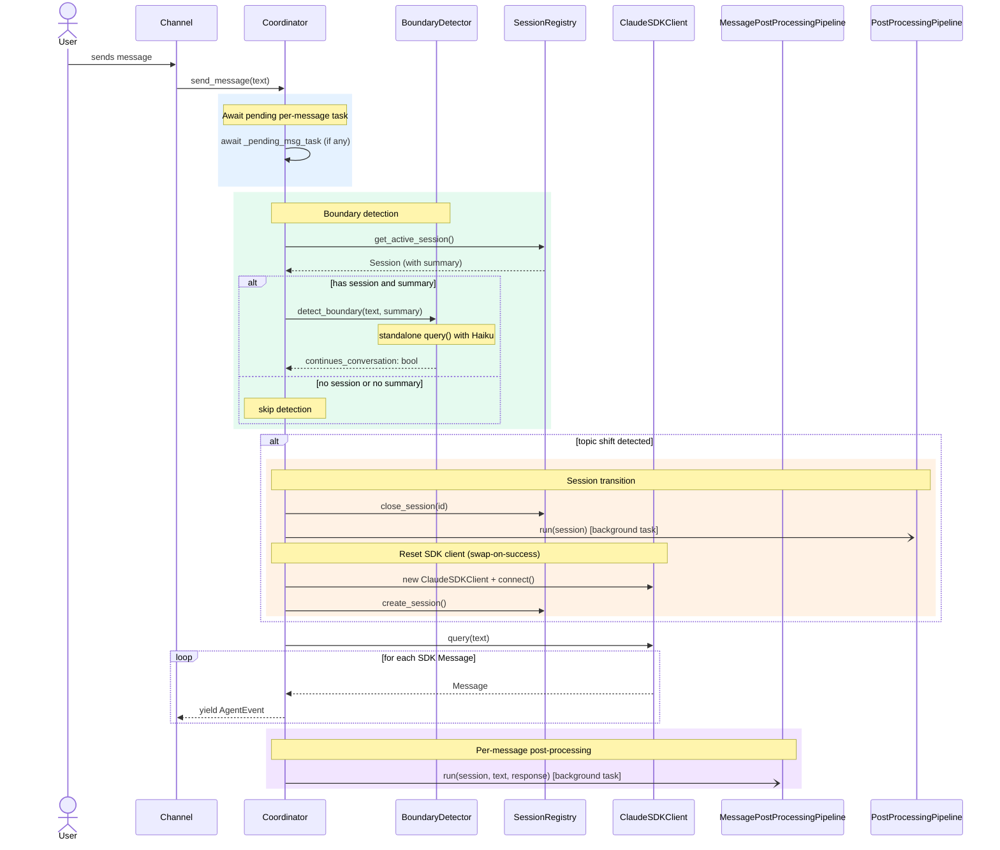
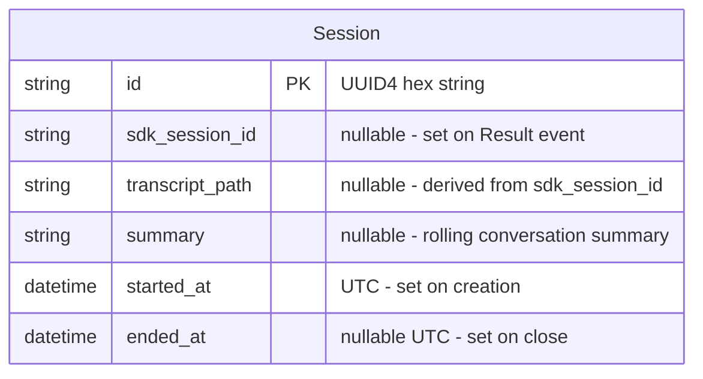
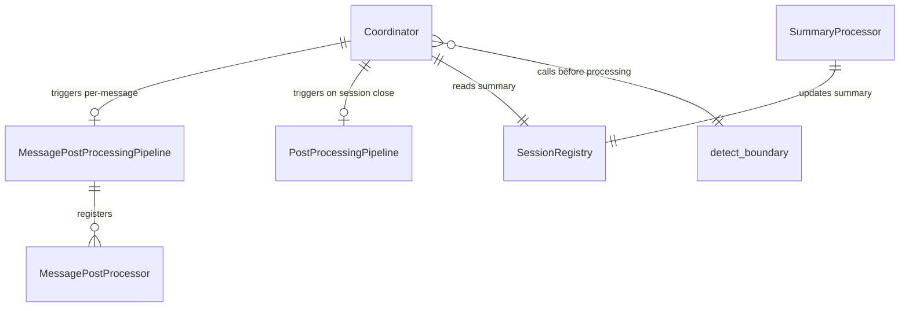

# Design: DLT-026 - Detect conversation boundaries via topic analysis

**Delta Spec**: [../delta-specs/DLT-026.md](../delta-specs/DLT-026.md)
**Status**: Approved

## Purpose

This document explains the design rationale for this delta: the modeling choices, data flow, system behavior, and architectural approach.

After implementation, the "Detected Impacts" section will guide reconciliation into feature design docs.

## Problem Context

The current system treats all messages as belonging to a single, long-running conversation. When the user changes topics, the old conversation's context bleeds into the new one — the SDK session carries prior history, and post-processing (memory extraction) doesn't run until full shutdown. This means: (a) the agent may reference stale context from a previous topic, (b) memory extraction is delayed until the process stops, and (c) there's no clean separation between distinct conversations for downstream analysis.

**Constraints:**
- Boundary detection must add no more than 1-2 seconds to message processing latency (R6)
- Detection must not interfere with or depend on the coordinator's active SDK session (R12)
- Failures must never block message processing — fail-open to continuation (R8)
- The rolling summary must stay concise regardless of conversation length (R13)
- On graceful shutdown, all background tasks must complete before exit (R14)

**Interactions:**
- Coordinator (`core-architecture`): `send_message()` gains boundary detection gating, per-message post-processing trigger, await-pending logic, and SDK client replacement
- Sessions (`sessions`): Session model gains a `summary` field; sessions can now close mid-conversation
- Post-processing pipeline (`post-processing-pipeline`): Pipeline infrastructure is reused for per-message processing with a new processor interface
- Memory extraction (`memory-extraction`): Session post-processing is now triggered asynchronously on topic shift, not just on shutdown

## Design Overview

Three new mechanisms layer onto the existing coordinator:

```
┌──────────────────────────────────────────────────────────────────────┐
│                    Coordinator.send_message() flow                    │
│                                                                      │
│  ┌─────────────┐   ┌──────────────┐   ┌────────────┐   ┌─────────┐ │
│  │ Await       │──▶│ Boundary     │──▶│ Session    │──▶│ Process │ │
│  │ pending     │   │ detection    │   │ transition │   │ message │ │
│  │ post-proc   │   │ (Haiku)      │   │ (if shift) │   │ (SDK)   │ │
│  └─────────────┘   └──────────────┘   └────────────┘   └────┬────┘ │
│                                                              │      │
│                                        ┌─────────────────────┘      │
│                                        ▼                            │
│                              ┌──────────────────┐                   │
│                              │ Per-message       │                   │
│                              │ post-processing   │                   │
│                              │ (background task) │                   │
│                              └──────────────────┘                   │
└──────────────────────────────────────────────────────────────────────┘
```

1. **Boundary detection** — A standalone `query()` call using Haiku that classifies whether a new message continues the current conversation or starts a new topic. Uses JSON schema output for reliable parsing. Runs before the coordinator processes the message.

2. **Session transition** — On topic shift, an orchestrated sequence closes the old session, fires async session post-processing, resets the SDK client (new instance with updated system prompt), and creates a new session. Uses a swap-on-success pattern to guarantee the coordinator always has a working client.

3. **Per-message post-processing** — A separate pipeline (`MessagePostProcessingPipeline`) with its own processor interface that runs after each agent response. The summary processor generates/updates a rolling conversation summary using Haiku, storing it on the session record for the next boundary check.

## Shape

| Part | Mechanism | Flag |
|------|-----------|:----:|
| **S1** | **Session summary field** — Extend the session model (`Session` dataclass + `SessionRecord` ORM) with a `summary: str \| None` field. Add an `update_summary()` method to the registry that persists the summary on the active session record. | |
| **S2** | **Summary processor** — A `MessagePostProcessor` implementation that makes a standalone `query()` call with `model="haiku"`, no tools, passing the previous summary + latest user message + assistant response. Outputs an updated rolling summary (5-8 sentences, topic-focused) and stores it via `registry.update_summary()`. Uses an "update the existing summary" prompt pattern for stability. | |
| **S3** | **Per-message pipeline and trigger** — A `MessagePostProcessingPipeline` with its own processor interface (`MessagePostProcessor` ABC with `process(session, user_message, agent_response)`). Separate from the session-level `PostProcessingPipeline`. The coordinator triggers it after each agent response completes, launching it as a background `asyncio.Task`. | |
| **S4** | **Pending task lifecycle** — The coordinator stores a reference to the background per-message task. Before boundary detection, it awaits completion (logging errors, not propagating). On graceful shutdown (`__aexit__`), it awaits any pending per-message task and all background session post-processing tasks before exiting. | |
| **S5** | **Boundary detector** — A callable that makes an independent standalone `query()` call with `model="haiku"`, no tools, and JSON schema output (`{"continues_conversation": boolean}`). Receives the incoming message text and the current session summary. Prompt biases strongly toward continuation — only clear, unambiguous topic shifts return `false`. Parses the structured output from `ResultMessage`. | |
| **S6** | **Boundary check integration** — Extends the coordinator's `send_message()` flow: after awaiting any pending per-message post-processing (S4), read the current session summary from the registry, run the boundary detector (skip if no active session or no summary yet), and branch on the verdict — continuation proceeds normally, topic shift triggers the session transition (S7). | |
| **S7** | **Session transition orchestrator** — Method on the coordinator triggered on topic shift. Sequence: (1) capture active session snapshot (frozen dataclass), (2) close session in registry (try/except, log errors), (3) fire async session post-processing as background task if session has `sdk_session_id` (S9), (4) reset SDK client using swap-on-success pattern (S8) — build new options with previous summary in system prompt, construct new `ClaudeSDKClient`, connect it, only then disconnect old client; if new client fails, keep old client and log error, (5) create new session in registry (try/except, log errors). | |
| **S8** | **SDK conversation context reset** — Construct a new `ClaudeSDKClient` with new `ClaudeAgentOptions`. The new options include an updated `SystemPromptPreset` whose `append` field contains the base system prompt plus the previous conversation's summary. Swap-on-success: connect new client first, disconnect old client only after success. The coordinator replaces its internal `_client` reference. | |
| **S9** | **Async session post-processing** — Fire the existing session-level `PostProcessingPipeline` as a background `asyncio.Task` when a session closes via boundary detection. Track all background tasks in a list on the coordinator. On graceful shutdown, await all remaining tasks. Log errors from background tasks without propagation. | |

## Components

### Implementation Structure

| Layer/Component | Responsibility | Key Decisions |
|-----------------|----------------|---------------|
| `src/tachikoma/sessions/model.py` | Extend `Session` dataclass with `summary: str \| None` field; extend `SessionRecord` ORM with matching nullable `summary` column; `to_domain()` maps it through | New nullable column on both dataclass and ORM; schema migration required (see Notes) |
| `src/tachikoma/sessions/repository.py` | Extend `update()` method contract to accept `summary` as a valid field alongside `sdk_session_id`, `transcript_path`, and `ended_at` | Docstring update needed to document the new accepted field |
| `src/tachikoma/sessions/registry.py` | Add `update_summary(session_id, summary)` method following the same pattern as `update_metadata()`: persist to DB via `repository.update()`, then re-fetch via `repository.get_by_id()` and replace the `_active_session` reference (required because `Session` is a frozen dataclass) | Re-fetch-and-replace pattern ensures the in-memory reference is atomically updated with the new summary |
| `src/tachikoma/boundary/__init__.py` | Re-exports public API: `BoundaryDetector`, `detect_boundary` | New package for boundary detection |
| `src/tachikoma/boundary/detector.py` | `detect_boundary(message, summary, cwd)` — standalone `query()` with Haiku, JSON schema output, returns `bool` (`True` = continues conversation). `cwd` is passed from the coordinator's `self._cwd`. | Independent of coordinator; pure function + SDK call |
| `src/tachikoma/boundary/prompts.py` | Prompt templates for boundary detection and summary generation | Separated for easy iteration and testing |
| `src/tachikoma/boundary/summary.py` | `SummaryProcessor` — `MessagePostProcessor` that calls standalone `query()` with Haiku to update the rolling summary | Uses incremental pattern: previous summary + latest exchange → updated summary |
| `src/tachikoma/message_post_processing.py` | `MessagePostProcessor` ABC (`process(session, user_message, agent_response)`) and `MessagePostProcessingPipeline` class | Parallel to `post_processing.py` but with a different interface reflecting the per-message context |
| `src/tachikoma/coordinator.py` | Extended `send_message()` flow, `_handle_transition()`, `_reset_sdk_client()`, per-message pipeline trigger, pending task lifecycle, background task tracking | Core orchestration; all new logic in the coordinator |
| `src/tachikoma/__main__.py` | Wire up boundary detector and per-message pipeline as coordinator dependencies | Follows existing pattern of constructing dependencies in `main()` |

### Cross-Layer Contracts

**Extended `send_message()` flow:**



**Integration Points:**
- Coordinator ↔ `detect_boundary`: pure function call, returns `bool`, catches all errors and defaults to `True` (continuation)
- Coordinator ↔ `MessagePostProcessingPipeline`: `run(session, user_message, agent_response)`, launched as `asyncio.Task`, reference stored on coordinator
- Coordinator ↔ `PostProcessingPipeline` (existing): same `run(session)` call, but now also fired as background `asyncio.Task` during transitions (not just on shutdown)
- Coordinator ↔ `ClaudeSDKClient`: now supports mid-lifecycle client replacement via `_reset_sdk_client()`
- `SummaryProcessor` ↔ `SessionRegistry`: calls `update_summary()` to persist the rolling summary

**Error contract:**
- Boundary detection errors: caught in coordinator, logged, default to continuation (fail-open per R8)
- Per-message pipeline errors: caught by `asyncio.gather(return_exceptions=True)` within the pipeline, logged
- Session transition errors: each step wrapped in try/except; SDK reset uses swap-on-success (fallback to old client)
- Background session post-processing errors: caught in task wrapper, logged, no propagation

### Shared Logic

- **`MessagePostProcessor` ABC** (`message_post_processing.py`): shared interface for per-message processors. Separate from session-level `PostProcessor`.
- **`Session` dataclass** (`sessions/model.py`): extended with `summary` field. Shared input to both pipelines and the boundary detector.
- **Prompt templates** (`boundary/prompts.py`): shared between summary processor and boundary detector. Centralized for easy iteration.

## Modeling

### Extended Session model



The `summary` field is nullable — it's `None` until the first per-message post-processing run completes (after the first agent response). Boundary detection is skipped when summary is `None`.

### New domain types

```
MessagePostProcessor (ABC)
└── process(session: Session, user_message: str, agent_response: str) → None

MessagePostProcessingPipeline
├── _processors: list[MessagePostProcessor]
├── _lock: asyncio.Lock  (serializes concurrent runs — defensive, since coordinator
│                          awaits the pending task before launching another, but
│                          protects against future callers or race conditions)
├── register(processor) → None
└── run(session: Session, user_message: str, agent_response: str) → None

SummaryProcessor (MessagePostProcessor)
├── _registry: SessionRegistry
├── _cwd: Path
└── process(session, user_message, agent_response) → None
    └── standalone query() with Haiku → update summary

detect_boundary(message: str, summary: str, cwd: Path) → bool
└── standalone query() with Haiku, JSON schema → True (continues) / False (shift)
```

### Component relationships



## Data Flow

### Normal message flow (continuation)

```
1. Channel calls coordinator.send_message(text)
2. Coordinator awaits any pending per-message task (S4)
   - If task pending: await it, log any errors
   - If no task: proceed immediately
3. Coordinator reads active session from registry
4. If active session exists AND session has a summary:
   a. Call detect_boundary(text, session.summary, cwd) (S5)
   b. Standalone Haiku query returns {"continues_conversation": true}
   c. Proceed normally
5. If no active session: create one via registry (existing behavior)
6. Coordinator calls SDK client.query(text), streams response (existing behavior)
7. During streaming, coordinator accumulates response text:
   - Initialize response_chunks: list[str] = []
   - For each TextChunk event yielded, append event.text to response_chunks
   - Events are still yielded to the channel as before — accumulation is internal
8. After Result event triggers break from the message loop:
   a. Join accumulated chunks: response_text = "".join(response_chunks)
   b. Re-fetch active session from registry (it may have been updated by metadata)
   c. Launch per-message pipeline as background task (S3):
      asyncio.create_task(msg_pipeline.run(session, text, response_text))
   d. Store task reference on coordinator (S4)
   Note: The per-message pipeline launch happens inside the generator body,
   after the break but before the generator returns. The generator's execution
   frame holds the accumulated text and the active session reference.
9. Channel renders response (events were yielded during step 7)
```

### Topic shift flow

```
1. Steps 1-3 same as above
4. detect_boundary returns {"continues_conversation": false}
5. Coordinator calls _handle_transition(text):
   a. Capture active session snapshot (frozen Session dataclass)
   b. Close session in registry (try/except, log errors) (S7)
   c. If session had sdk_session_id:
      - Fire session post-processing as background task (S9):
        task = asyncio.create_task(pipeline.run(session))
        Add task to _background_tasks list
   d. Reset SDK client (S8):
      - Build new ClaudeAgentOptions with updated system prompt
        (base system prompt + previous conversation summary)
      - Construct new ClaudeSDKClient with new options
      - await new_client.connect()
      - If success: await old_client.disconnect(), replace self._client
      - If failure: log error, keep old client (stale context, but functional)
   e. Create new session in registry (try/except, log errors) (S7)
6. Coordinator calls new SDK client.query(text)
7. Normal streaming + per-message post-processing trigger
```

### System prompt composition on topic shift

```
1. Read base system prompt from coordinator's stored reference
   (the original system_prompt string passed at construction)
2. Append previous conversation summary:

   {base_system_prompt}

   # Previous Conversation
   The user was previously discussing the following topic. This is provided
   for brief context only — do not continue the previous conversation unless
   the user explicitly refers back to it.

   {previous_summary}

3. Wrap in SystemPromptPreset(type="preset", preset="claude_code", append=...)
4. Build new ClaudeAgentOptions with the composed system prompt
```

### Shutdown flow (extended)

```
1. Channel signals exit
2. Coordinator __aexit__:
   a. Await any pending per-message task (S4)
   b. Capture active session, close it via registry (existing)
   c. Run session post-processing pipeline synchronously (existing, for shutdown session)
   d. Await all background session post-processing tasks (S9):
      await asyncio.gather(*_background_tasks, return_exceptions=True)
      Log any errors
   e. Disconnect SDK client (existing)
3. finally: dispose session repository engine (existing)
```

### Summary processor data flow

```
1. SummaryProcessor.process(session, user_message, agent_response) called
2. Read previous summary from session.summary (may be None for first exchange)
3. Build prompt:
   - System: "You are a conversation summarizer..."
   - User: previous summary + latest exchange + instructions
4. Call standalone query() with:
   - model="haiku"
   - system_prompt=SUMMARY_SYSTEM_PROMPT (plain string, not Claude Code preset)
   - No tools (summary is a text-only task)
   - cwd from constructor
5. Consume response, extract text from AssistantMessage
6. Call registry.update_summary(session.id, extracted_text)
7. Registry persists to DB via repository.update(session_id, summary=...),
   then re-fetches the session via repository.get_by_id() and replaces
   _active_session with the new frozen Session instance (same re-fetch
   pattern as update_metadata())
```

## Key Decisions

### Haiku for boundary detection and summarization

**Choice**: Use `model="haiku"` for both `detect_boundary` and `SummaryProcessor` standalone `query()` calls.
**Why**: Both tasks are simple (binary classification and short text summarization). Haiku is 3x cheaper, has the fastest latency, and comfortably meets the 1-2 second budget (R6). The `model` parameter on `ClaudeAgentOptions` is passed as `--model` to the CLI subprocess.
**Sources**: SDK source code (`types.py` line 989, `subprocess_cli.py` lines 207-208). Model pricing: Haiku $1/$5 per MTok vs Sonnet $3/$15.
**Options Researched**: Haiku (fastest, cheapest), Sonnet (better but overkill for this), configurable model (added complexity without demonstrated need).
**Why This Over Alternatives**: The tasks are simple enough that Haiku's capabilities are more than sufficient. If classification quality proves insufficient, the model can be changed without structural changes.
**Consequences**:
- Pro: Sub-second detection latency, minimal cost per message
- Pro: Both calls are independent — model choice doesn't affect the coordinator's main session
- Con: Slightly less capable than Sonnet for ambiguous edge cases

### Incremental summarization over full-transcript fork

**Choice**: Summary processor receives previous summary + latest exchange via function arguments, not via SDK session fork.
**Why**: Constant-cost per invocation regardless of conversation length. No subprocess spawning for a text-only task. Research from progressive summarization literature shows incremental summaries are "reliable and usable" for topic tracking, with ~10% content drift (acceptable for boundary detection where topic identity, not factual precision, matters).
**Sources**: Progressive summarization patterns (arXiv:2308.15022). LangChain ConversationSummaryBufferMemory precedent.
**Options Researched**: Incremental (previous summary + latest exchange), full-transcript fork via `fork_and_consume()`, hybrid (periodic full-transcript refresh).
**Why This Over Alternatives**: Fork-based approach costs grow linearly with conversation length, spawns a full Claude Code subprocess with tools loaded. The incremental approach is bounded, fast, and sufficient.
**Consequences**:
- Pro: O(1) cost per summarization call regardless of conversation length
- Pro: No subprocess spawning — uses lightweight standalone `query()`
- Con: Small accuracy drift over very long conversations (~10% content affected)
- Con: Cannot recover from a badly drifted summary without starting fresh

### JSON schema output for boundary detection

**Choice**: Use `output_format={"type": "json_schema", "schema": {"type": "object", "properties": {"continues_conversation": {"type": "boolean"}}, "required": ["continues_conversation"], "additionalProperties": false}}` for the boundary detector.
**Why**: Eliminates parsing ambiguity entirely. The SDK passes `--json-schema` to the CLI, and the result is available in `ResultMessage.structured_output` as a parsed dict. Boolean field means no string matching or normalization needed.
**Sources**: SDK source code (`types.py` line 1040, `subprocess_cli.py` lines 320-327). `ResultMessage.structured_output` returns parsed JSON.
**Options Researched**: JSON schema via `output_format` (structured, typed), plain text single word (fragile parsing), XML tags (unnecessary complexity).
**Why This Over Alternatives**: Structured output is the most reliable way to get a clean signal from an LLM. Other formats require regex or string matching that can break on edge cases.
**Consequences**:
- Pro: Zero parsing ambiguity — result is a Python dict with a boolean
- Pro: Schema validation happens at the SDK level
- Con: Requires the model to support structured output (Haiku does)

### Separate `MessagePostProcessor` interface

**Choice**: New `MessagePostProcessor` ABC with `process(session, user_message, agent_response)` and `MessagePostProcessingPipeline`, separate from the existing `PostProcessor`/`PostProcessingPipeline`.
**Why**: Per-message processing is a fundamentally different concept from session-level processing. Session processors receive a closed session and fork it for analysis. Message processors receive the latest exchange inline and update session state. Different inputs, different lifecycle, different triggering semantics. A separate interface makes this distinction explicit.
**Options Researched**: Extend existing `PostProcessor` ABC with extra parameters, store exchange data on session model, separate interface.
**Why This Over Alternatives**: Extending the existing ABC would change the signature for all existing processors (memory extraction, git). Storing exchange data on the session model pollutes the session with transient data. A separate interface is clean and follows the principle of keeping interfaces focused.
**Consequences**:
- Pro: Existing `PostProcessor` implementations untouched
- Pro: Clear semantic distinction between session-level and per-message processing
- Pro: Per-message pipeline can have its own error isolation and lifecycle
- Con: Two pipeline types to understand (but they serve clearly different purposes)

### Boundary detection in the coordinator (not a separate orchestrator)

**Choice**: Integrate boundary detection, transition logic, and per-message pipeline trigger directly into the coordinator's `send_message()`.
**Why**: The coordinator already owns session lifecycle (create, close, update metadata), SDK client lifecycle (connect, disconnect), and post-processing triggering. Boundary detection is tightly coupled to these concerns — it reads session state, potentially closes/creates sessions, and replaces the SDK client. A separate orchestrator would need access to all the coordinator's internals, creating tight coupling without clear separation.
**Options Researched**: Extend coordinator directly, separate `ConversationLifecycleManager` wrapping the coordinator.
**Why This Over Alternatives**: A wrapper would need to reach into coordinator internals (client replacement, session state) anyway. Keeping it in the coordinator follows the existing pattern where the coordinator is the single owner of session + SDK lifecycle.
**Consequences**:
- Pro: Related concerns stay together — session lifecycle, SDK lifecycle, boundary detection
- Pro: No new indirection layer
- Con: Coordinator grows in complexity (mitigated by extracting boundary detection and summary logic to a separate `boundary/` package)

### Swap-on-success for SDK client reset

**Choice**: When resetting the SDK conversation context, construct and connect a new `ClaudeSDKClient` before disconnecting the old one. Only swap references after the new client is confirmed working.
**Why**: SDK investigation confirmed that `ClaudeSDKClient` doesn't support clean reconnection — a new instance is needed. The swap-on-success pattern guarantees the coordinator always has a working client. If the new client fails to connect, the old client (with stale context) is retained — the user gets prior conversation context bleeding through, but the system remains functional. This aligns with R7/R8 (graceful degradation).
**Sources**: SDK source code investigation (spike S8). `ClaudeSDKClient.disconnect()` nullifies internal state. `connect()` creates new transport from `self.options`. Options are consumed at `connect()` time.
**Options Researched**: Swap-on-success (new instance first), disconnect-then-reconnect (same instance), disconnect-then-new-instance (no fallback).
**Why This Over Alternatives**: Disconnect-first approaches leave the coordinator without a working client if reconnection fails. Same-instance reconnection relies on undocumented behavior.
**Consequences**:
- Pro: Coordinator always has a working SDK client
- Pro: Graceful degradation — stale context beats no functionality
- Con: Briefly holds two SDK client instances (two CLI subprocesses) during the swap

## System Behavior

### Scenario: Normal message (continuation)

**Given**: An active session with a summary from the previous exchange
**When**: A new message arrives on the same topic
**Then**: Pending per-message task is awaited, boundary detector classifies as continuation, message is processed normally by the existing SDK session, per-message pipeline is triggered as a background task to update the summary.
**Rationale**: This is the common path — most messages continue the current conversation.

### Scenario: Topic shift detected

**Given**: An active session with a summary about "Python testing"
**When**: A new message arrives about "What should I have for dinner?"
**Then**: Boundary detector classifies as topic shift. Transition orchestrator: closes current session, fires async session post-processing (memory extraction), resets SDK client with summary of previous conversation in system prompt, creates new session, processes the message in the fresh context.
**Rationale**: Clear topic shift triggers full session lifecycle — old session gets post-processed, new session starts clean.

### Scenario: First message (no prior session)

**Given**: No active session exists (first message ever, or after startup)
**When**: A message arrives
**Then**: Boundary detection is skipped. A new session is created via the existing `create_session()` flow. Message processed normally.
**Rationale**: No session = nothing to compare against. Skip detection to avoid pointless overhead (R7).

### Scenario: Second message (no summary yet)

**Given**: An active session exists but has no summary (per-message pipeline hasn't completed yet after the first exchange)
**When**: The second message arrives
**Then**: Boundary detection is skipped (no summary to compare against). Message proceeds normally. After this exchange, the per-message pipeline produces a summary for future boundary checks.
**Rationale**: Without a summary, boundary detection cannot function. Skipping is the correct fail-open behavior (R7).

### Scenario: Boundary detection fails (SDK error, timeout)

**Given**: An active session with a summary
**When**: The boundary detector's `query()` call fails
**Then**: Error is logged, message proceeds as continuation (fail-open). The coordinator catches the exception and defaults to `continues_conversation=True`.
**Rationale**: Boundary detection is a best-effort enhancement. Message processing must never be blocked by detection failures (R8).

### Scenario: SDK client reset fails during transition

**Given**: A topic shift is detected and the transition sequence begins
**When**: The new `ClaudeSDKClient` fails to connect
**Then**: Error is logged. The old client is retained (swap-on-success pattern). A new Tachikoma session is still created in the registry. The message is processed with the old client — the user gets stale context from the previous conversation but the system remains functional.
**Rationale**: Stale context is better than a dead system. The acceptance criteria explicitly allow this degraded state (R7).

### Scenario: Per-message post-processing still running when next message arrives

**Given**: The per-message pipeline (summary update) from the previous exchange is still running
**When**: A new message arrives
**Then**: The coordinator awaits the pending task before proceeding to boundary detection. If the task fails, the error is logged and boundary detection runs with whatever summary is available (possibly stale).
**Rationale**: The summary must be up-to-date for accurate boundary detection (R11). Awaiting ensures consistency.

### Scenario: Multiple rapid topic shifts

**Given**: The user sends several messages that each trigger a topic shift
**When**: Background session post-processing tasks accumulate
**Then**: Each task runs independently. All tasks are tracked in the coordinator's `_background_tasks` list. Completed tasks are pruned from the list on each new topic shift (to avoid unbounded growth — `asyncio.Task` objects retain references to results/exceptions). Failed tasks are logged but don't affect others. On shutdown, all remaining tasks are awaited.
**Rationale**: Fire-and-forget with tracking and cleanup. Each session's post-processing is independent (R2, R14).

### Scenario: Graceful shutdown with background tasks

**Given**: Background session post-processing tasks are running from previous topic shifts, and a per-message task is pending
**When**: The system shuts down gracefully
**Then**: The coordinator's `__aexit__` awaits the pending per-message task, runs shutdown pipeline for the current session, then awaits all background tasks via `asyncio.gather(return_exceptions=True)`. Errors are logged. SDK client is disconnected last.
**Rationale**: Ensures all memory extraction and summary updates complete before exit (R14).

### Scenario: Per-message pipeline processor fails

**Given**: The summary processor encounters an error during its `query()` call
**When**: The per-message pipeline handles the failure
**Then**: The error is logged. The conversation continues uninterrupted. On the next exchange, the per-message pipeline runs again independently — no permanent failure state. The summary may be stale (from a prior successful run) or `None` (if it never succeeded), causing boundary detection to be skipped on the next message.
**Rationale**: Each per-message pipeline invocation is independent. Failure on one exchange doesn't poison future exchanges (R3 AC).

## Open Questions

*All previously open questions from the spec-phase shape have been resolved through spikes:*

- [x] ~~S2: Summary prompt design~~ → Incremental approach, Haiku, 5-8 sentence cap, "update" prompt pattern
- [x] ~~S5: Boundary detection prompt design~~ → JSON schema boolean output, Haiku, continuation-biased prompt
- [x] ~~S7: Session transition ordering~~ → Capture → close → async post-processing → swap-on-success SDK reset → create session
- [x] ~~S8: SDK client reconnection~~ → New instance required; options consumed at `connect()` time; swap-on-success pattern

---

## Detected Impacts

### Affected Feature Designs
- **docs/feature-designs/agent/core-architecture.md** — Modifies: Coordinator's `send_message()` gains boundary detection gating, await-pending logic, per-message post-processing trigger, and SDK client replacement. The `__aexit__` shutdown flow changes to await background post-processing tasks. Coordinator constructor accepts new dependencies (per-message pipeline, boundary detector config). Coordinator stores base system prompt for recomposition on topic shift.
- **docs/feature-designs/agent/sessions.md** — Modifies: `Session` dataclass and `SessionRecord` ORM gain a `summary: str | None` field. `SessionRegistry` gains `update_summary()` method. Sessions can now close mid-conversation (boundary detection), not just on shutdown or crash recovery.
- **docs/feature-designs/agent/post-processing-pipeline.md** — Modifies: Pipeline infrastructure is now used in two contexts — session-level (existing, triggered on session close and now also async during transitions) and per-message (new `MessagePostProcessingPipeline` with its own interface). The existing `PostProcessingPipeline` class itself doesn't change but its usage pattern expands.
- **docs/feature-designs/agent/workspace-bootstrap.md** — No change: no new bootstrap hooks needed. Boundary detector and per-message pipeline are wired in `__main__.py`, not via bootstrap.

### Notes for Reconciliation
- Core architecture design needs updated `send_message()` sequence diagram (await pending → boundary check → process → per-message post-processing)
- Core architecture design needs updated shutdown flow (await background post-processing tasks)
- Core architecture design needs updated coordinator constructor (new dependencies)
- Sessions design needs `summary` field in domain model and ORM model documentation
- Sessions design needs `update_summary()` method documented
- Sessions design needs updated "Session close mechanism" section (boundary detection as a new close trigger)
- Post-processing pipeline design needs a note about the per-message usage context and the new `MessagePostProcessor` interface
- A new feature design may be needed for "conversation boundary detection" under `docs/feature-designs/agent/`

## Notes

- The `boundary/` package encapsulates all boundary detection logic (detector, summary processor, prompts), keeping the coordinator focused on orchestration. The `SummaryProcessor` lives in `boundary/summary.py` rather than alongside `message_post_processing.py` because it is cohesively tied to boundary detection — its output (the rolling summary) exists primarily to feed the boundary detector.
- Both Haiku calls (detection and summarization) use standalone `query()` — they never touch the coordinator's `ClaudeSDKClient`. This satisfies R12 (independence from active session)
- The `MessagePostProcessingPipeline` follows the same patterns as `PostProcessingPipeline` (parallel execution, error isolation via `asyncio.gather(return_exceptions=True)`, lock serialization) but with a different processor interface
- The coordinator stores the base `system_prompt` string (not the `SystemPromptPreset`) so it can recompose the system prompt on topic shifts by appending the previous conversation summary
- On a second (or subsequent) topic shift, only the *immediately previous* conversation's summary is injected — not a chain of all prior summaries. This is intentional: the summary serves as brief context to help the agent understand what just came before, not a complete history. Older conversations are preserved in memory extraction, not in the system prompt.
- The `fork_and_consume()` helper in `post_processing.py` is not used by the boundary detection or summary subsystem — those use direct `query()` calls without session forking
- **Schema migration**: Adding the `summary` column to an existing `sessions` table requires explicit handling. SQLAlchemy's `create_all()` only creates missing tables — it does not add columns to existing ones. The implementation should add an `ALTER TABLE sessions ADD COLUMN summary TEXT` migration step in the session recovery hook (before `recover_interrupted()`), guarded by a check for column existence. This is acceptable for the current single-user deployment; a proper migration framework (e.g., Alembic) is not justified yet.
