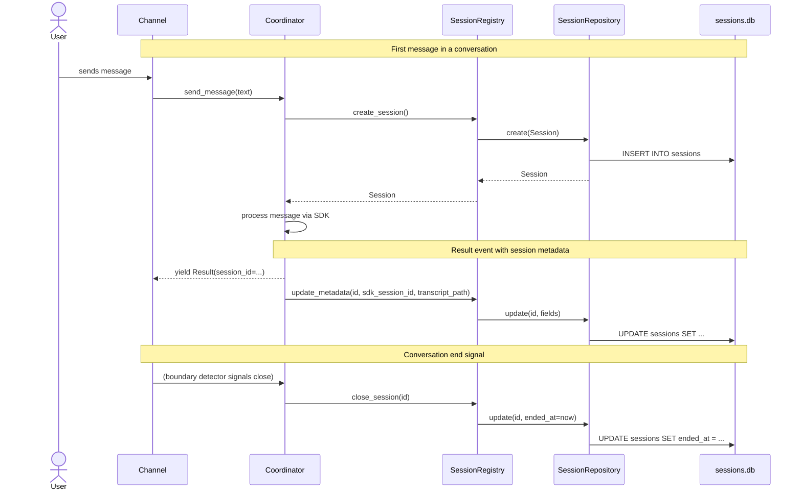
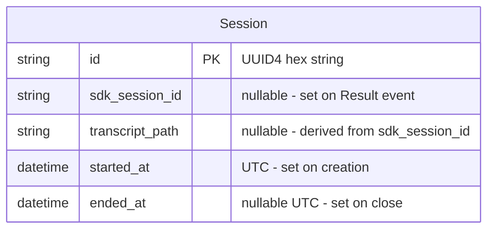

# Design: DLT-027 - Track conversation sessions

**Delta Spec**: [../delta-specs/DLT-027.md](../delta-specs/DLT-027.md)
**Status**: Draft

## Purpose

This document explains the design rationale for this delta: the modeling choices, data flow, system behavior, and architectural approach.

After implementation, the "Detected Impacts" section will guide reconciliation into feature design docs.

## Problem Context

Tachikoma needs a persistent record of conversation sessions so that downstream features (memory extraction via DLT-008, boundary detection via DLT-026/DLT-004) can identify which conversation to analyze and when sessions start and end. Currently the coordinator manages an SDK client session, but nothing persists session metadata across restarts or provides queryable history.

**Constraints:**
- Single-user, single-process deployment -- no concurrent writers to worry about
- Sessions table will be small (at most thousands of rows after extended use)
- Must integrate with the existing bootstrap hook system (DLT-023) for crash recovery
- The codebase is async-first; bootstrap hooks are currently synchronous but will be migrated to async as part of this delta
- SQLite is an embedded file-based database, satisfying the spirit of VISION.md's "no database for v1" constraint

**Interactions:**
- Coordinator (core-architecture): creates sessions on first message, updates metadata on Result events
- Boundary detectors (DLT-026, DLT-004): signal session close
- Post-processing pipelines (DLT-008): query completed sessions for analysis
- Bootstrap system (DLT-023): recovery hook runs on startup to close interrupted sessions

## Design Overview

Four components implement the session tracking system, plus a migration of the bootstrap system to async:

```
┌──────────────────────────────────────────────────────────────┐
│                     Coordinator Layer                          │
│  ┌────────────────────────────────────────────────────────┐   │
│  │  Coordinator                                           │   │
│  │  ┌──────────────────────┐                              │   │
│  │  │ SessionRegistry      │ create / close / update      │   │
│  │  └──────────┬───────────┘                              │   │
│  └─────────────┼──────────────────────────────────────────┘   │
│                │                                               │
├────────────────┼──────────────────────────────────────────────┤
│                │        Persistence Layer                       │
│                ▼                                               │
│  ┌────────────────────────────────────────────────────────┐   │
│  │  SessionRepository (SQLAlchemy 2.0 async)              │   │
│  │  ┌──────────────────────┐                              │   │
│  │  │  AsyncEngine         │ sqlite+aiosqlite             │   │
│  │  │  async_sessionmaker  │                              │   │
│  │  └──────────┬───────────┘                              │   │
│  └─────────────┼──────────────────────────────────────────┘   │
│                │                                               │
│                ▼                                               │
│  ┌────────────────────────────────────────────────────────┐   │
│  │  sessions.db  (.tachikoma/sessions.db)                 │   │
│  └────────────────────────────────────────────────────────┘   │
├──────────────────────────────────────────────────────────────┤
│                     Bootstrap Layer                             │
│  ┌────────────────────────────────────────────────────────┐   │
│  │  session_recovery_hook (async)                          │   │
│  │  → registry.recover_interrupted()                       │   │
│  └────────────────────────────────────────────────────────┘   │
└──────────────────────────────────────────────────────────────┘
```

The **SessionRegistry** is the facade that the coordinator and boundary detectors call. It owns the business logic (creation serialization, status derivation, crash recovery) and delegates persistence to the **SessionRepository**. The repository uses SQLAlchemy 2.0's async ORM with `aiosqlite` for the SQLite backend.

The **bootstrap system is migrated to async** so that hooks can natively `await` async operations like database access, eliminating the need for `asyncio.run()` workarounds inside hooks.

## Shape

| Part | Mechanism | Flag |
|------|-----------|:----:|
| **S1** | Session model -- SQLAlchemy ORM model (`DeclarativeBase`) with columns: `id` (UUID string, primary key), `sdk_session_id` (nullable string), `transcript_path` (nullable string), `started_at` (datetime UTC), `ended_at` (nullable datetime UTC). A separate frozen dataclass serves as the domain representation returned to callers, with a computed `status` property that derives open/closed/interrupted from field presence. | |
| **S2** | SQLAlchemy async repository -- `SessionRepository` class owns an `AsyncEngine` (created via `create_async_engine("sqlite+aiosqlite:///<path>")`) and an `async_sessionmaker`. Provides async methods: `create()`, `update()`, `get_by_id()`, `get_by_time_range()`, `get_open_sessions()`. Lazy initialization: engine and schema are created on first async access via an `async initialize()` method that uses `conn.run_sync(Base.metadata.create_all)`. Engine disposal on close. Repository operations that fail raise `SessionRepositoryError` (wrapping SQLAlchemy exceptions) so callers get a clean error contract. | |
| **S3** | Session registry -- async facade exposing `create_session()`, `close_session()`, `update_metadata()`, `get_active_session()`, `recover_interrupted()`. Serializes creation via an internal `asyncio.Lock` to prevent duplicate active sessions. Called by coordinator (create/close/update) and boundary detectors (close). Delegates persistence to S2. | |
| **S4** | Bootstrap recovery hook -- async hook registered via DLT-023's hook system; on every launch, calls `registry.recover_interrupted()` to detect sessions with null `ended_at` and mark them with best-effort end timestamps (transcript file mtime if available, otherwise current time); idempotent. | |
| **S5** | Async bootstrap migration -- `BootstrapHook` type changes from `Callable[[BootstrapContext], None]` to `Callable[[BootstrapContext], Awaitable[None]]`; `Bootstrap.run()` becomes `async def run()`; `__main__.py` changes `bootstrap.run()` to `await bootstrap.run()`; existing `workspace_hook` becomes `async def workspace_hook(ctx)` (body unchanged, just async signature). `BootstrapContext` gains an `extras: dict[str, Any]` field for hooks to pass objects to the caller. Unblocks all future hooks that need async operations. | |

### Flagged Unknowns

None -- all mechanisms are understood.

## Components

### Implementation Structure

| Layer/Component | Responsibility | Key Decisions |
|-----------------|----------------|---------------|
| `src/tachikoma/sessions/model.py` | SQLAlchemy ORM model (`SessionRecord`) + frozen dataclass (`Session`) + `DeclarativeBase` | Separate ORM model from domain dataclass; callers never see SQLAlchemy types |
| `src/tachikoma/sessions/repository.py` | `SessionRepository`: async engine lifecycle, CRUD operations, schema creation, time-range queries | Owns SQLAlchemy engine + session factory; all SQL is behind async methods |
| `src/tachikoma/sessions/registry.py` | `SessionRegistry`: business logic facade, creation lock, crash recovery, status derivation | Receives repository via constructor; owns the `asyncio.Lock` |
| `src/tachikoma/sessions/__init__.py` | Re-exports `Session`, `SessionRegistry`, `SessionRepository`, `SessionRepositoryError` | Clean public API for the sessions package |
| `src/tachikoma/bootstrap.py` | `Bootstrap`, `BootstrapContext`, `BootstrapHook` (now async), `workspace_hook` (now async) | Async migration: `run()` becomes `async def`, hook type becomes `Awaitable` |
| `src/tachikoma/sessions/errors.py` | `SessionRepositoryError`: wraps SQLAlchemy exceptions for clean error contract | Callers catch one domain exception, not SQLAlchemy internals |
| `src/tachikoma/__main__.py` | Creates repository + registry after bootstrap; registers `session_recovery_hook`; disposes engine on shutdown via try/finally | Hook registration order: workspace -> session recovery; repository created after workspace exists |

### Cross-Layer Contracts



**Integration Points:**
- Coordinator -> SessionRegistry: `create_session()` on first message, `update_metadata()` on Result events, `close_session()` on boundary signals
- SessionRegistry -> SessionRepository: all persistence delegated
- SessionRepository -> SQLAlchemy AsyncEngine -> aiosqlite -> sessions.db
- Bootstrap -> SessionRegistry: `recover_interrupted()` on startup
- `__main__.py` -> Bootstrap: registers `session_recovery_hook` after workspace hook

**Session close mechanism (pre-DLT-026/DLT-004):**

Before boundary detectors are implemented, session close is handled by two mechanisms:
1. **Coordinator disconnect**: When the coordinator's async context exits (application shutdown, REPL exit), it calls `registry.close_session()` for the active session in its `__aexit__`.
2. **Crash recovery**: If the application crashes without clean shutdown, the bootstrap recovery hook closes interrupted sessions on next launch.

Once DLT-026 (topic analysis) and DLT-004 (inactivity timeout) are implemented, they become the primary close signals. The coordinator disconnect close remains as a final safety net for clean shutdown.

**Error contract:**

Repository methods raise `SessionRepositoryError` on persistence failures (wrapping the underlying SQLAlchemy exception as `__cause__`). The registry propagates these errors to callers. During bootstrap, errors from the recovery hook are wrapped in `BootstrapError` per the existing hook error contract. Callers (coordinator, boundary detectors) should log and handle `SessionRepositoryError` gracefully -- a session tracking failure should not crash the conversation.

### Shared Logic

- **`Session` dataclass** (`sessions/model.py`): shared between registry (produces) and consumers like post-processing pipelines (consume). No SQLAlchemy dependency for consumers.
- **`SessionRepository`** lifecycle: created in `__main__.py`, passed to registry constructor, also needs explicit close (engine disposal) on shutdown.

## Modeling

### Domain model



### Session dataclass (domain representation)

```
Session (frozen dataclass)
├── id: str                           (UUID4 hex, generated at creation)
├── sdk_session_id: str | None        (populated from Result event)
├── transcript_path: str | None       (derived from SDK session ID)
├── started_at: datetime              (UTC, set at creation time)
├── ended_at: datetime | None         (UTC, set when session closes)
└── status: SessionStatus (property)  (derived, not persisted)
    ├── "open"        — ended_at is None
    ├── "closed"      — ended_at is set AND sdk_session_id is set
    └── "interrupted" — ended_at is set AND sdk_session_id is None
```

`SessionStatus` is a `Literal["open", "closed", "interrupted"]` type.

### SQLAlchemy ORM model

```
SessionRecord (DeclarativeBase)
├── __tablename__ = "sessions"
├── id: Mapped[str]                   (primary_key=True)
├── sdk_session_id: Mapped[str | None]
├── transcript_path: Mapped[str | None]
├── started_at: Mapped[datetime]
├── ended_at: Mapped[datetime | None]
└── index on started_at               (for time-range queries)
```

The ORM model is internal to the persistence layer. A `to_domain()` method on `SessionRecord` converts to the frozen `Session` dataclass. The registry and all callers work exclusively with `Session` instances.

### SQLAlchemy infrastructure

```
Base (DeclarativeBase)
└── SessionRecord inherits from Base

AsyncEngine
├── url: "sqlite+aiosqlite:///<data_path>/sessions.db"
└── echo: False (production), True (debug)

async_sessionmaker(engine, expire_on_commit=False)
└── produces AsyncSession instances for each operation

Schema creation (async):
  async with engine.begin() as conn:
      await conn.run_sync(Base.metadata.create_all)
  (Base.metadata.create_all is sync; run_sync bridges it into the async engine)
```

## Data Flow

### Session creation (first message)

```
1. Coordinator receives first message of a conversation
2. Coordinator calls registry.create_session()
3. Registry acquires asyncio.Lock
4. Registry generates UUID4 hex string as session ID
5. Registry creates Session(id=..., started_at=utcnow(), ...)
6. Registry calls repository.create(session)
7. Repository opens AsyncSession, adds SessionRecord, commits
8. Registry releases lock, returns Session to coordinator
9. Coordinator proceeds with send_message()
```

### Session metadata update (on Result event)

```
1. Coordinator receives Result event with session_id from SDK
2. Coordinator calls registry.update_metadata(
     session_id=active_session.id,
     sdk_session_id=result.session_id,
     transcript_path=derive_transcript_path(result.session_id)
   )
3. Registry calls repository.update(id, sdk_session_id=..., transcript_path=...)
4. Repository opens AsyncSession, queries by ID, updates fields, commits
```

The `transcript_path` is derived from the SDK session ID using the known Claude SDK directory structure: `~/.claude/projects/<sanitized-cwd>/<session-id>.jsonl`, where `<sanitized-cwd>` replaces `/` with `-` and strips the leading `-`.

**Known SDK coupling**: This derivation logic depends on the Claude SDK's internal file naming convention. If the SDK changes its transcript storage format, this path derivation will break. The derivation should be isolated to a single helper function so it can be updated in one place. If the SDK ever exposes transcript paths directly, prefer that over manual derivation.

### Session close (boundary detection)

```
1. Boundary detector (DLT-026 or DLT-004) signals conversation end
2. Signal reaches coordinator, which calls registry.close_session(id)
3. Registry calls repository.update(id, ended_at=utcnow())
4. If session was already closed (ended_at set), operation is idempotent
5. If no active session exists, operation is a no-op
```

### Crash recovery (bootstrap)

```
1. __main__.py runs workspace bootstrap (workspace_hook creates .tachikoma/)
2. __main__.py creates SessionRepository(data_path / "sessions.db")
3. await repository.initialize() — creates engine, runs create_all via run_sync
4. __main__.py creates SessionRegistry(repository)
5. session_recovery_hook runs (registered as bootstrap hook):
   → calls registry.recover_interrupted()
6. recover_interrupted():
   a. Queries repository.get_open_sessions() (ended_at IS NULL)
   b. For each open session:
      - If sdk_session_id is set AND transcript file exists:
        set ended_at = file mtime (crash after Result but before close)
      - If sdk_session_id is set AND transcript file not found:
        set ended_at = current time
      - If sdk_session_id is None:
        set ended_at = current time (crash before first Result)
   c. Updates via repository.update() for each
7. Bootstrap completes, coordinator starts normally
```

### Query by time range

```
1. Caller provides (start, end) datetime range
2. Registry calls repository.get_by_time_range(start, end)
3. Repository queries:
   SELECT * FROM sessions
   WHERE started_at < :range_end
     AND (ended_at IS NULL OR ended_at > :range_start)
   ORDER BY started_at DESC
4. Open sessions (ended_at IS NULL) are included if started_at < range_end
5. Returns list of Session dataclass instances
```

### Startup flow (updated with async bootstrap)

```
1. __main__.py runs asyncio.run(main())
2. Creates SettingsManager
3. Creates Bootstrap(settings_manager)  (still sync construction)
4. Registers hooks:
   a. bootstrap.register("workspace", workspace_hook)          — async, creates dirs
   b. bootstrap.register("sessions", session_recovery_hook)    — async, recovers interrupted
5. await bootstrap.run()  — executes hooks sequentially with await
   a. workspace_hook: ensures .tachikoma/ directory exists
   b. session_recovery_hook:
      i.  Creates SessionRepository(data_path / "sessions.db")
      ii. await repository.initialize() — engine + schema via run_sync
      iii.Creates SessionRegistry(repository)
      iv. await registry.recover_interrupted() — closes stale sessions
      v.  Stores repository + registry on BootstrapContext for __main__ to retrieve
6. Reads final settings
7. Retrieves repository + registry from bootstrap context
8. Creates Coordinator(registry=registry, ...)
9. try:
     async with Coordinator as coordinator:
       Channel runs
   finally:
     await repository.close()  — disposes engine (always runs)
```

**Why create repository inside the hook?** The session recovery hook needs the repository and registry to run crash recovery. Creating them inside the hook (after workspace_hook has ensured the data directory exists) solves two problems: (a) the data directory is guaranteed to exist, and (b) the recovery runs immediately with a live repository. The hook stores the created repository and registry on the `BootstrapContext` so `__main__.py` can retrieve them after bootstrap completes.

To support this, `BootstrapContext` gains an `extras: dict[str, Any]` field -- a simple bag for hooks to pass objects to the caller. The workspace hook does not use it; the session hook stores `repository` and `registry` in it.

## Key Decisions

### SQLAlchemy 2.0 async over raw aiosqlite

**Choice**: Use SQLAlchemy 2.0 with async ORM and `aiosqlite` backend
**Why**: Provides typed ORM models with `Mapped[T]` columns, built-in schema creation via `Base.metadata.create_all()`, and establishes a persistence pattern for future tables. The user is familiar with SQLAlchemy.
**Sources**: SQLAlchemy 2.0 asyncio docs, aiosqlite 0.22.1 PyPI
**Options Researched**: raw aiosqlite, SQLAlchemy 2.0 async, Tortoise ORM, SQLModel, Peewee with peewee-aio
**Why This Over Alternatives**: Raw aiosqlite is lighter but provides no ORM benefits. Tortoise ORM pulls in 4 transitive dependencies and uses a global initialization pattern. SQLModel's async SQLite path is under-documented. Peewee's async SQLite story is fragmented across third-party libraries. SQLAlchemy is the industry standard with robust async support and good type hints in 2.0.
**Consequences**:
- Pro: Typed ORM model, built-in schema management, established pattern
- Pro: Familiar to the user, extensive documentation and ecosystem
- Pro: Scales naturally if more tables are added (e.g., tasks for DLT-010)
- Con: Heavier dependency than raw aiosqlite for a single-table use case
- Con: Requires explicit engine disposal on shutdown
- Con: Known issue with aiosqlite v0.22.0 connection cleanup (monitor during implementation)

### Async bootstrap migration

**Choice**: Migrate `BootstrapHook` type to async and `Bootstrap.run()` to `async def`
**Why**: The session recovery hook needs to call async repository methods. Rather than using `asyncio.run()` workarounds inside sync hooks (which conflicts with the outer event loop), migrating the entire hook system to async is cleaner and unblocks all future hooks that need async operations. DLT-002's design already noted this tension with its Telegram validation hook.
**Consequences**:
- Pro: Hooks can natively await async operations (DB access, network calls)
- Pro: Resolves DLT-002's open question about `asyncio.run()` inside sync hooks
- Pro: `workspace_hook` migration is trivial (add `async` keyword, body unchanged)
- Con: Breaking change to `BootstrapHook` type signature -- all existing hooks and tests must be updated
- Con: Adds `await` to `__main__.py`'s bootstrap call

### Separate ORM model from domain dataclass

**Choice**: `SessionRecord` (SQLAlchemy ORM) is internal to the persistence layer; callers receive frozen `Session` dataclasses
**Why**: Prevents SQLAlchemy types from leaking into the coordinator, boundary detectors, and post-processing pipelines. The `Session` dataclass has no SQLAlchemy dependency, keeping the domain layer clean. This follows the existing pattern where `AgentEvent` dataclasses decouple channels from SDK internals.
**Consequences**:
- Pro: Consumers never import SQLAlchemy
- Pro: Domain model is a plain frozen dataclass -- easy to test, serialize, inspect
- Pro: Consistent with the adapter pattern used for SDK messages
- Con: Requires a `to_domain()` mapping step in the repository

### Derived session status (not persisted)

**Choice**: Session status (`open`/`closed`/`interrupted`) is a computed property on the `Session` dataclass, not a database column
**Why**: Status is fully derivable from `ended_at` and `sdk_session_id`. Storing it would create a synchronization risk. The derivation logic is trivial: `ended_at is None` = open, `ended_at is not None and sdk_session_id is not None` = closed, `ended_at is not None and sdk_session_id is None` = interrupted.
**Consequences**:
- Pro: No stale status -- always consistent with underlying fields
- Pro: Simpler schema -- fewer columns to maintain
- Con: Cannot query by status directly in SQL (must filter in Python or use a computed SQL expression)

### UUID4 hex string for session IDs

**Choice**: Use `uuid.uuid4().hex` (32-character hex string) as session IDs
**Why**: Universally unique without coordination. Hex format is compact (no dashes), URL-safe, and works as a plain string primary key in SQLite. No auto-increment needed since sessions are created infrequently.
**Consequences**:
- Pro: No ID collision risk, no sequence coordination
- Pro: Meaningful as a standalone identifier (can reference in logs, memory entries)
- Con: 32 characters vs shorter auto-increment integers (negligible for this table size)

### Session close mechanism pre-DLT-026/DLT-004

**Choice**: Before boundary detectors exist, sessions are closed by the coordinator's `__aexit__` (on clean shutdown) and by crash recovery (on unclean shutdown)
**Why**: DLT-027 provides the registry infrastructure; DLT-026 and DLT-004 provide the boundary detection signals. Until those deltas are implemented, the only close signals are application exit and crash recovery. This is sufficient for v1 since the primary consumers (memory extraction, post-processing) need the session record to exist and eventually close -- the exact close timing is less critical before boundary detection.
**Consequences**:
- Pro: DLT-027 is self-contained and testable without boundary detectors
- Pro: Sessions always close eventually (either on shutdown or crash recovery)
- Con: Without boundary detection, multi-topic conversations are tracked as a single session (acceptable for v1)

### Engine disposal via try/finally in __main__

**Choice**: Wrap the coordinator/channel run in a try/finally block that always calls `await repository.close()`
**Why**: SQLAlchemy's `AsyncEngine` must be explicitly disposed to prevent resource leaks and `RuntimeError: Event loop is closed` warnings. A try/finally ensures disposal runs even if the coordinator or channel raises an exception.
**Consequences**:
- Pro: Engine always disposed, no dangling connections
- Pro: Clean shutdown even on error paths
- Con: Adds nesting to `__main__.py` (acceptable)

### Logging integration per DES-002

**Choice**: All session components use structured logging via loguru with `logger.bind(component="sessions")`
**Why**: Per ADR-006 and DES-002, all components should use structured loguru logging. Session lifecycle events (create, close, recover) are important operational signals.
**Consequences**:
- Pro: Consistent with project logging conventions
- Pro: Session lifecycle visible in logs for debugging
- Key log points: session created (INFO), session closed (INFO), metadata updated (DEBUG), recovery started/completed (INFO), repository error (ERROR with `.exception()`)

### Sessions as a package (not a single module)

**Choice**: Organize session-related code as `src/tachikoma/sessions/` package with `model.py`, `repository.py`, `registry.py`
**Why**: Three distinct concerns (domain model, persistence, business logic facade) benefit from separate modules. A single `sessions.py` would grow unwieldy as the model includes both ORM and domain types, the repository handles engine lifecycle plus CRUD, and the registry manages business rules.
**Consequences**:
- Pro: Clear separation of concerns, easy to navigate
- Pro: Each module can be tested independently
- Con: More files than a single module (acceptable for clarity)

## System Behavior

### Scenario: First message creates a session

**Given**: No active session exists
**When**: The coordinator receives the first message of a conversation
**Then**: `registry.create_session()` generates a new session with a UUID4 ID and the current UTC timestamp as `started_at`. The session is persisted to the database. The coordinator proceeds to process the message.
**Rationale**: Sessions are created eagerly on first message, before the SDK processes the request, so that even if the SDK call fails, the session start is recorded.

### Scenario: Result event populates metadata

**Given**: An active session exists with `sdk_session_id` and `transcript_path` both null
**When**: The coordinator receives a `Result` event with a `session_id` from the SDK
**Then**: `registry.update_metadata()` sets `sdk_session_id` and derives `transcript_path` from the SDK session ID using the known directory structure.
**Rationale**: The SDK assigns its own session ID internally; the registry captures it on the first Result event for cross-referencing with SDK transcripts.

### Scenario: Boundary detector closes a session

**Given**: An active session with `ended_at` null
**When**: A boundary detector (DLT-026 or DLT-004) signals conversation end
**Then**: `registry.close_session()` sets `ended_at` to the current UTC timestamp. The session transitions from "open" to "closed" status.
**Rationale**: Closing sets the end timestamp, enabling time-range queries and signaling post-processing pipelines.

### Scenario: Close on already-closed session (idempotent)

**Given**: A session with `ended_at` already set
**When**: A close signal is received again
**Then**: The operation completes without error or change. The existing `ended_at` is preserved.
**Rationale**: Boundary detectors may fire redundantly; idempotency prevents errors.

### Scenario: Close with no active session (no-op)

**Given**: No active session exists
**When**: A close signal is received
**Then**: The operation completes without error.
**Rationale**: Edge case handling -- no crash, no side effects.

### Scenario: Concurrent creation serialization

**Given**: Two creation signals arrive nearly simultaneously (e.g., boundary detector triggers new session while coordinator is also creating)
**When**: Both attempt `create_session()`
**Then**: The `asyncio.Lock` in the registry serializes the operations. Only one session is created per signal, and no duplicates occur.
**Rationale**: Under asyncio's cooperative concurrency, the lock prevents interleaving of create operations.

### Scenario: Crash recovery on startup (no Result received)

**Given**: The application crashed before the coordinator received a Result event, leaving a session with `ended_at` null and `sdk_session_id` null
**When**: The application restarts and the `session_recovery_hook` runs
**Then**: `registry.recover_interrupted()` finds the open session, sets `ended_at` to the current time. The session has "interrupted" status (no `sdk_session_id`).
**Rationale**: No transcript file reference exists, so current time is the best-effort end timestamp.

### Scenario: Crash recovery on startup (Result received, close missed)

**Given**: The application crashed after receiving a Result event (so `sdk_session_id` is set) but before the session was closed, leaving `ended_at` null
**When**: The application restarts and the `session_recovery_hook` runs
**Then**: `registry.recover_interrupted()` finds the open session. Since `sdk_session_id` is set, it derives the transcript path and checks if the transcript file exists. If found, `ended_at` is set to the file's last modified time. If not found, `ended_at` is set to the current time. The session has "closed" status (both `ended_at` and `sdk_session_id` are set).
**Rationale**: The transcript file's mtime provides a more accurate end timestamp than the current time, since the crash may have happened some time ago.

### Scenario: Recovery with no open sessions (idempotent)

**Given**: All sessions in the database have `ended_at` set
**When**: The recovery hook runs
**Then**: No changes are made. The hook completes silently.
**Rationale**: Idempotent per DLT-023 R3 -- safe to run on every launch.

### Scenario: Query by time range

**Given**: Sessions exist spanning various time periods
**When**: Querying with a time range `(start, end)`
**Then**: All sessions whose span overlaps the range are returned, ordered by `started_at` descending. Open sessions (null `ended_at`) are treated as ongoing and included if `started_at < range_end`.
**Rationale**: Overlap semantics capture sessions that were active during any part of the query window.

### Scenario: Query by session ID

**Given**: A session with a known ID exists
**When**: Querying by that ID
**Then**: The matching `Session` is returned.
**Rationale**: Direct lookup for post-processing and cross-referencing.

### Scenario: Query by ID with no match

**Given**: No session matches the provided ID
**When**: Querying by ID
**Then**: `None` is returned (not an error).
**Rationale**: Callers handle the absence case; no exceptions for missing data.

### Scenario: Database file does not exist

**Given**: No `sessions.db` file in the data directory
**When**: The `SessionRepository` is initialized
**Then**: SQLAlchemy creates the database file and the `sessions` table via `Base.metadata.create_all()`.
**Rationale**: Auto-creation on first access means no separate migration step is needed.

### Scenario: Schema creation failure

**Given**: The data directory is not writable (permissions issue)
**When**: The repository attempts to create the database
**Then**: SQLAlchemy raises an error. The bootstrap hook wraps it in `BootstrapError` with a clear message.
**Rationale**: Fail-fast at startup with actionable error.

### Scenario: Application shutdown (clean)

**Given**: The application is shutting down normally (REPL exit, signal)
**When**: The shutdown sequence runs
**Then**: The coordinator's `__aexit__` calls `registry.close_session()` for the active session (if any). Then the `finally` block in `__main__.py` calls `await repository.close()`, which calls `await engine.dispose()` to cleanly close all database connections.
**Rationale**: The try/finally in `__main__.py` ensures engine disposal runs even if the coordinator or channel raises an exception. Explicit disposal prevents `RuntimeError: Event loop is closed` warnings from garbage-collected connections.

### Scenario: Repository operation failure during conversation

**Given**: A conversation is active and the coordinator calls a registry method
**When**: The underlying repository operation fails (e.g., disk full, I/O error)
**Then**: The repository raises `SessionRepositoryError`. The coordinator logs the error per DES-002 conventions and continues the conversation -- session tracking failure should not crash the user's conversation.
**Rationale**: Session tracking is important but not critical to message processing. Graceful degradation is preferred over crashing.

## Open Questions

None -- all design decisions have been resolved.

---

## Detected Impacts

### Affected Feature Designs
- **docs/feature-designs/agent/workspace-bootstrap.md** -- Modifies: Bootstrap hook system changes from sync to async. `BootstrapHook` type, `Bootstrap.run()`, and `workspace_hook` all become async. This is a fundamental change to the hook system's contract.
- **docs/feature-designs/agent/core-architecture.md** -- Modifies: Coordinator gains a `SessionRegistry` dependency. Session lifecycle (create on first message, update on Result, close on boundary signal) integrates into the message processing flow. Startup flow adds repository/registry creation and session recovery hook.

### Notes for Reconciliation
- workspace-bootstrap.md must be updated to document async hook type and async `run()` method
- core-architecture.md startup flow should include repository/registry creation and session recovery hook registration
- core-architecture.md should document the coordinator's session tracking responsibility
- A new "sessions" sub-capability under the agent domain may be warranted to document session registry behavior long-term
- VISION.md "File-based -- no database for v1" should be clarified to acknowledge SQLite as an embedded file-based database
- DLT-002's design (S8) noted `asyncio.run()` workaround for async validation in sync hooks; the async bootstrap migration resolves this -- DLT-002's telegram_hook becomes a native async hook

## Notes

- SQLAlchemy 2.0 async docs: https://docs.sqlalchemy.org/en/20/orm/extensions/asyncio.html
- aiosqlite: https://github.com/omnilib/aiosqlite
- The `SessionRepository` follows the same decoupling pattern as the message adapter: SQLAlchemy types are internal, callers see only domain dataclasses
- `expire_on_commit=False` is used on the `async_sessionmaker` to allow attribute access on `SessionRecord` instances after commit (before `to_domain()` conversion)
- The `sessions` package structure sets a precedent for future persistence needs (e.g., tasks for DLT-010 could follow the same model/repository/registry pattern)
- The async bootstrap migration is a small but breaking change -- all existing tests for bootstrap hooks must be updated to use `async def` hooks and `await bootstrap.run()`
- **Test structure per DES-001**: Tests for the sessions package should mirror the src structure: `tests/sessions/test_model.py` (unit tests for Session dataclass and status derivation), `tests/sessions/test_repository.py` (integration tests with real SQLite via aiosqlite), `tests/sessions/test_registry.py` (tests for business logic, mocking the repository). Bootstrap test updates go in the existing `tests/test_bootstrap.py`.
- **`BootstrapContext.extras`**: The `extras: dict[str, Any]` field on `BootstrapContext` is a pragmatic escape hatch for hooks that need to pass objects back to `__main__.py`. It is not a general-purpose service locator -- its use should remain limited to bootstrap-time object creation. If more hooks need this pattern, consider a more structured approach (e.g., typed slots).
