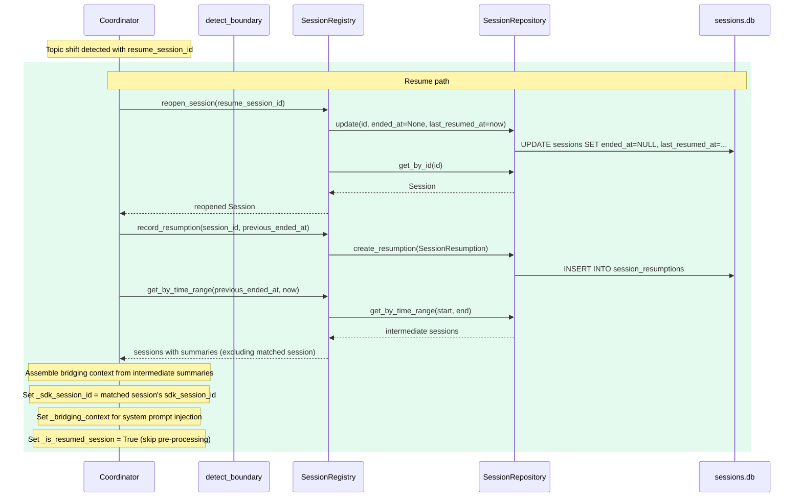
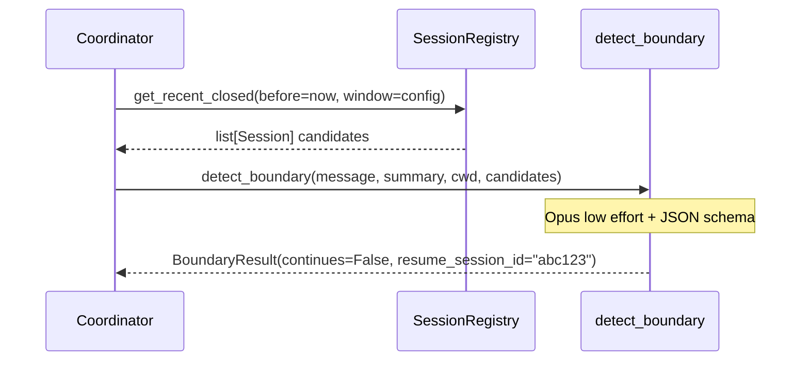
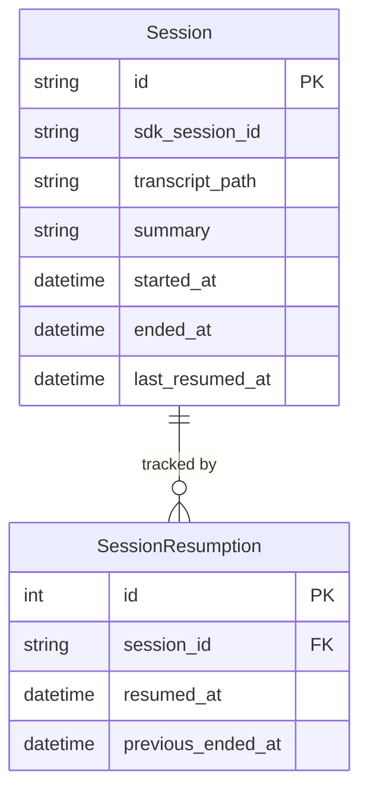

# Design: DLT-028 - Resume conversation on topic revisit

**Delta Spec**: [../delta-specs/DLT-028.md](../delta-specs/DLT-028.md)
**Status**: Approved

## Purpose

This document explains the design rationale for this delta: the modeling choices, data flow, system behavior, and architectural approach.

After implementation, the "Detected Impacts" section will guide reconciliation into feature design docs.

## Problem Context

When the boundary detector identifies a topic shift, the coordinator always starts a fresh SDK session and creates a new Tachikoma session. If the user returns to a previously discussed topic (e.g., "back to the Python project"), the prior conversation context is lost — the agent starts from scratch without history of what was already discussed.

**Constraints:**
- Boundary detection already adds 1-2 seconds of latency; session matching must fit within the same detection call (no additional round-trip)
- The SDK's `resume` parameter accepts a session ID string and restores full conversation context — this is the mechanism for context restoration
- Sessions without `sdk_session_id` (interrupted sessions) cannot be resumed — there is no SDK context to restore
- Fail-open is mandatory: any failure in matching or resumption must fall through to the existing fresh-session behavior
- The 1:1 mapping between Tachikoma sessions and SDK sessions must be preserved — no forking

**Interactions:**
- Boundary detection (`boundary-detection`): `detect_boundary()` gains session matching alongside topic classification
- Sessions (`sessions`): registry gains reopen capability and a new `SessionResumption` tracking model
- Coordinator (`core-architecture`): `_handle_transition()` gains a resume branch; `_build_options()` gains bridging context injection
- Post-processing pipeline (`post-processing-pipeline`): `PromptDrivenProcessor` gains resumption-awareness to avoid re-extracting already-processed content
- Configuration (`config-system`): new lookup window parameter

## Design Overview

Three changes layer onto the existing topic-shift flow:

```
┌─────────────────────────────────────────────────────────────────────────┐
│                    Enhanced _handle_transition() flow                    │
│                                                                         │
│  ┌──────────────┐   ┌────────────────┐   ┌──────────────────────────┐  │
│  │ detect_       │──▶│ resume_        │──▶│ Resume path              │  │
│  │ boundary()   │   │ session_id     │   │ reopen + bridging ctx    │  │
│  │ (enhanced)   │   │ present?       │   │ + record resumption      │  │
│  └──────────────┘   └───────┬────────┘   └──────────────────────────┘  │
│                             │ no                                        │
│                             ▼                                           │
│                     ┌──────────────────────────────────────┐           │
│                     │ Fresh-session path (unchanged)        │           │
│                     │ close + new session + previous summary │           │
│                     └──────────────────────────────────────┘           │
└─────────────────────────────────────────────────────────────────────────┘
```

1. **Enhanced boundary detection** — The existing `detect_boundary()` call gains a list of recent closed session candidates. The prompt is updated to include their summaries alongside IDs. When a topic shift matches a candidate, the JSON response includes a `resume_session_id`. The detection model and effort level remain unchanged (Opus, low effort).

2. **Coordinator resume path** — When `resume_session_id` is present, `_handle_transition()` reopens the matched session (clears `ended_at`, makes it active), sets `_sdk_session_id` to the matched session's existing SDK session ID, records a `SessionResumption` event, assembles bridging context from intermediate sessions, and skips pre-processing. The next `send_message()` call creates a `ClaudeSDKClient` with `resume=sdk_session_id`, restoring the full prior conversation context.

3. **Post-processing awareness** — When a resumed session eventually closes, `PromptDrivenProcessor.process()` augments the fork prompt with a resumption boundary instruction so forked agents skip already-processed content.

## Shape

| Part | Mechanism | Flag |
|------|-----------|:----:|
| **S1** | Enhanced boundary detection output — modify `detect_boundary()` to accept a list of recent session candidates (id + summary pairs), update the detection prompt to include candidates and instruct single-best-match selection, change JSON schema from `{"continues_conversation": bool}` to `{"continues_conversation": bool, "resume_session_id": str \| null}`, return a structured result dataclass instead of a bare `bool` | |
| **S2** | Recent sessions query — add `SessionRepository.get_recent_closed(before: datetime, window: timedelta)` that returns closed sessions with non-null `sdk_session_id` within the window, ordered by `ended_at` descending; expose through `SessionRegistry` | |
| **S3** | Session reopen mechanism — `SessionRegistry.reopen_session(session_id)` clears `ended_at` via repository, re-fetches and replaces `_active_session` (same pattern as `update_metadata()`); returns the reopened `Session`; validates session exists and is closed before reopening | |
| **S4** | SessionResumption model and persistence — new frozen `SessionResumption` dataclass (`session_id`, `resumed_at`, `previous_ended_at`), `SessionResumptionRecord` ORM model in sessions package, repository CRUD (`create_resumption`, `get_resumptions_for_session`), migration for new table | |
| **S5** | Coordinator resume path — `_handle_transition()` gains `resume_session_id` parameter and returns `bool` (True = resumed). If `resume_session_id` present → reopen matched session via registry (S3), record resumption (S4), set `_sdk_session_id` to matched session's `sdk_session_id` (direct resume, no fork — preserves 1:1 session mapping), assemble and set `_bridging_context` for injection (S6), return True; `send_message()` uses return value to set `is_new_session=False` (skipping pre-processing) and compute `resume_id` from `_sdk_session_id`. If reopen fails → fall through to fresh-session behavior, return False; if no match → current fresh-session behavior, return False | |
| **S6** | Bridging context assembly and injection — query intermediate sessions via existing `get_by_time_range(previous_ended_at, now)`, exclude the matched session, filter those with summaries, concatenate chronologically, store on `_bridging_context`; `_build_options()` appends bridging section to system prompt when set (same one-time-then-clear pattern as `_previous_summary`) | |
| **S7** | Configuration — new `agent.session_resume_window` config entry (timedelta, default 1 day); consumed by coordinator when querying recent sessions (S2) | |
| **S8** | Post-processing resumption awareness — add `last_resumed_at: datetime \| None` to `Session` dataclass and ORM model (migration); set by coordinator on reopen (S3/S5); `PromptDrivenProcessor.process()` checks `session.last_resumed_at` and appends a resumption boundary instruction to the fork prompt before calling `fork_and_consume()`; `CoreContextProcessor` (which overrides `process()`) applies the same augmentation | |
| **S9** | Alembic migration setup — introduce Alembic for schema migrations, replacing the hand-rolled `migrate()` pragma-check pattern; create initial revision capturing existing schema (`sessions` table with `summary` column), then a DLT-028 revision adding `last_resumed_at` column to `sessions` and creating `session_resumptions` table; `repository.initialize()` runs `alembic upgrade head` instead of `create_all()` + `migrate()` | |

## Components

### Implementation Structure

| Layer/Component | Responsibility | Key Decisions |
|-----------------|----------------|---------------|
| `src/tachikoma/boundary/detector.py` | Enhanced `detect_boundary()` — accepts recent session candidates, returns `BoundaryResult` dataclass with `continues` bool and optional `resume_session_id` | Session matching piggybacks on the existing Opus low-effort detection call; no additional round-trip |
| `src/tachikoma/boundary/prompts.py` | Updated boundary detection prompts — system prompt gains session matching instructions, user prompt gains candidate session list | Candidates formatted as ID + summary pairs for the LLM to match against |
| `src/tachikoma/sessions/model.py` | Extended `Session` dataclass with `last_resumed_at` field; new `SessionResumption` dataclass; new `SessionResumptionRecord` ORM model; new `BoundaryResult` dataclass in boundary package | Domain types stay in their respective packages; ORM models stay internal to persistence |
| `src/tachikoma/sessions/repository.py` | New `get_recent_closed()` query; new `create_resumption()` and `get_resumptions_for_session()` methods; removes hand-rolled `migrate()` method | Migrations handled by Alembic (see S9); repository focuses on CRUD operations only |
| `src/tachikoma/sessions/migrations/` | Alembic migration environment and revision scripts for schema evolution | Alembic replaces the manual `migrate()` pragma-check pattern; initial revision captures existing schema, DLT-028 revision adds `last_resumed_at` column and `session_resumptions` table |
| `src/tachikoma/sessions/registry.py` | New `reopen_session()` and `get_recent_closed()` facade methods; new `record_resumption()` method | Re-fetch-and-replace pattern for `_active_session` consistency |
| `src/tachikoma/coordinator.py` | Enhanced `_handle_transition()` with resume branch, returns `bool` (True = session was resumed); new `_bridging_context` state; `_build_options()` gains bridging context section; `send_message()` uses return value to set `is_new_session` correctly (False for resume, True for fresh) and compute `resume_id` | Bridging context uses same one-time-then-clear pattern as `_previous_summary`; `_handle_transition()` return value replaces the unconditional `is_new_session = True` that currently follows every transition |
| `src/tachikoma/post_processing.py` | `PromptDrivenProcessor.process()` checks `session.last_resumed_at` and augments prompt before `fork_and_consume()` | Dynamic augmentation — zero changes to individual processor prompt constants |
| `src/tachikoma/context/processor.py` | `CoreContextProcessor.process()` applies same resumption boundary prompt augmentation | Mirrors base class augmentation since it overrides `process()` |
| `src/tachikoma/config.py` | New `session_resume_window` field on `AgentSettings` | Integer seconds in TOML, converted to `timedelta` via validator |

### Cross-Layer Contracts

**Resume path through the coordinator:**



**Enhanced boundary detection call:**



**Integration Points:**
- Coordinator ↔ `detect_boundary`: now passes `candidates: list[SessionCandidate]` and receives `BoundaryResult` instead of `bool`
- Coordinator ↔ `SessionRegistry`: new calls to `get_recent_closed()`, `reopen_session()`, `record_resumption()`
- `PromptDrivenProcessor` ↔ `Session`: reads `last_resumed_at` to determine if prompt augmentation is needed
- `_build_options()` ↔ `_bridging_context`: same pattern as `_previous_summary` — append once, clear after first message

**Error contract:**
- `detect_boundary` errors: caught in coordinator, logged, default to continuation (fail-open, unchanged)
- `BoundaryResult` with invalid `resume_session_id` (not found in registry): fall through to fresh-session behavior with warning log
- `reopen_session` failure: fall through to fresh-session behavior with warning log
- SDK resume failure (`CLIConnectionError`, `ProcessError` on first message of resumed session): caught by existing error handling in `send_message()`, yields `Error(recoverable=True)`
- `record_resumption` failure: logged, session still resumed — tracking is best-effort
- Bridging context assembly failure: logged, session resumed without bridging context

### Shared Logic

- **`BoundaryResult` dataclass** (`boundary/detector.py`): shared between detector (produces) and coordinator (consumes). Contains `continues: bool` and `resume_session_id: str | None`.
- **`SessionCandidate`** (`boundary/detector.py`): lightweight `(id, summary)` pair passed to the detector. Avoids coupling the boundary package to the full `Session` dataclass.
- **`Session` dataclass** (`sessions/model.py`): extended with `last_resumed_at: datetime | None`. Shared input to post-processing pipeline — processors read this field.
- **Resumption prompt augmentation**: logic shared conceptually between `PromptDrivenProcessor.process()` and `CoreContextProcessor.process()`, but implemented in each since `CoreContextProcessor` overrides the base method.

## Modeling

### Extended Session dataclass

```
Session (frozen dataclass)
├── id: str
├── started_at: datetime
├── sdk_session_id: str | None
├── transcript_path: str | None
├── summary: str | None
├── ended_at: datetime | None
├── last_resumed_at: datetime | None       ← NEW
└── status: SessionStatus (property)
```

### New SessionResumption dataclass

```
SessionResumption (frozen dataclass)
├── session_id: str                        (FK → sessions.id)
├── resumed_at: datetime                   (UTC, when resumption occurred)
└── previous_ended_at: datetime            (UTC, when session was closed before this resumption)
```

### New SessionResumptionRecord ORM model

```
SessionResumptionRecord (DeclarativeBase)
├── __tablename__ = "session_resumptions"
├── id: Mapped[int]                        (primary_key=True, autoincrement)
├── session_id: Mapped[str]                (ForeignKey("sessions.id"))
├── resumed_at: Mapped[datetime]           (DateTime(timezone=True))
├── previous_ended_at: Mapped[datetime]    (DateTime(timezone=True))
└── index on session_id
```

### New BoundaryResult and SessionCandidate

```
BoundaryResult (frozen dataclass)
├── continues: bool                        (True = continuation, False = topic shift)
└── resume_session_id: str | None          (matched session ID, only when continues=False)

SessionCandidate (frozen dataclass)
├── id: str                                (session ID)
└── summary: str                           (session summary for LLM matching)
```

### Entity relationships



## Data Flow

### Enhanced boundary detection (topic shift with candidate matching)

```
1. Coordinator receives message, active session has a summary
2. Coordinator queries registry.get_recent_closed(before=now, window=config_window)
   - Repository: SELECT * FROM sessions
     WHERE ended_at IS NOT NULL
       AND sdk_session_id IS NOT NULL
       AND ended_at > (now - window)
     ORDER BY ended_at DESC
3. Coordinator builds SessionCandidate list: [(id, summary) for s in recent if s.summary]
4. Coordinator calls detect_boundary(message, summary, cwd, candidates=candidates)
5. detect_boundary() builds prompt with current summary + candidate summaries
6. Opus low effort query with enhanced JSON schema:
   {"continues_conversation": bool, "resume_session_id": str | null}
7. Returns BoundaryResult(continues=False, resume_session_id="abc123")
   or BoundaryResult(continues=False, resume_session_id=None) for fresh shift
   or BoundaryResult(continues=True, resume_session_id=None) for continuation
```

### Resume path (topic shift with match)

```
1. detect_boundary returns BoundaryResult(continues=False, resume_session_id="abc123")
2. Coordinator calls _handle_transition(previous_session, resume_session_id="abc123")
3. Close current session in registry (same as current behavior)
4. Fire async session post-processing for closed session (same as current behavior)

5. Reopen matched session:
   a. registry.reopen_session("abc123")
   b. Repository: UPDATE sessions SET ended_at=NULL, last_resumed_at=now WHERE id="abc123"
   c. Registry re-fetches and replaces _active_session
   d. Returns reopened Session
   e. If reopen fails → fall through to fresh-session behavior (steps 3-4 already done,
      proceed with clear _sdk_session_id + create new session), return False

6. Record resumption:
   a. registry.record_resumption(session_id="abc123", previous_ended_at=...)
   b. Repository: INSERT INTO session_resumptions (session_id, resumed_at, previous_ended_at)
   c. Failure logged but doesn't block (best-effort)

7. Set coordinator state:
   a. self._sdk_session_id = reopened_session.sdk_session_id
   b. self._bridging_context = assembled bridging text (see step 8)

8. Assemble bridging context:
   a. Query sessions via existing get_by_time_range(previous_ended_at, now)
   b. Filter those with summaries, exclude the matched session itself
   c. Concatenate summaries chronologically
   d. self._bridging_context = assembled text (or None if empty)

9. Return True (session was resumed)

10. Back in send_message():
    - _handle_transition() returned True → set is_new_session = False
    - Re-fetch active session from registry (the reopened session)
    - resume_id = self._sdk_session_id (matched session's SDK ID, not None)
    - Pre-processing is skipped (is_new_session is False)
    - _build_options(resume=resume_id) appends bridging context to system prompt

    Contrast with fresh-session path where _handle_transition() returns False:
    - is_new_session = True (current behavior)
    - resume_id = None (self._sdk_session_id was cleared)
    - Pre-processing runs for the new session
```

### Fresh-session path (topic shift without match — unchanged)

```
1. detect_boundary returns BoundaryResult(continues=False, resume_session_id=None)
2. Coordinator calls _handle_transition(previous_session, resume_session_id=None)
3. Same as current behavior: close session, fire post-processing, clear _sdk_session_id,
   store _previous_summary, create new session
4. Return False (fresh session, not a resume)
5. Back in send_message(): is_new_session = True, resume_id = None (current behavior)
```

### System prompt composition on resume

```
1. _build_options() reads base system prompt
2. If _bridging_context is set, append bridging section:

   {base_system_prompt}

   # Resumed Conversation
   You are resuming a previous conversation with the user. The full prior
   conversation context is available through the SDK session history.

   Since your last exchange, the following conversations occurred:

   {bridging_context}

   Use this context to understand what happened between sessions, but focus
   on the user's current message.

3. Clear _bridging_context after use (one-time injection)
4. Wrap in SystemPromptPreset(type="preset", preset="claude_code", append=...)
```

### Post-processing with resumption awareness (S8)

```
1. Resumed session eventually closes (topic shift or shutdown)
2. Pipeline calls processor.process(session) — session has last_resumed_at set
3. PromptDrivenProcessor.process() checks session.last_resumed_at:
   a. If set: augment self._prompt with boundary instruction:
      "\n\nIMPORTANT: This session was resumed at {last_resumed_at}. Content
      before this point was already processed during a previous session closure.
      Only extract NEW information from messages after the resumption point."
   b. If None: use self._prompt unchanged
4. Call fork_and_consume(session, augmented_prompt, cwd)
5. CoreContextProcessor.process() applies same augmentation before its fork_and_consume() call
```

## Key Decisions

### Session matching within the existing boundary detection call

**Choice**: Extend the existing `detect_boundary()` call to include session matching, rather than adding a separate matching step.
**Why**: The boundary detector already runs an Opus low-effort query with the incoming message and current session summary. Adding candidate session summaries to the same prompt lets the LLM do topic matching and boundary classification in a single round-trip. A separate matching call would add another 1-2 seconds of latency.
**Sources**: Current boundary detection design shows the call already uses structured JSON output and low effort — adding a nullable field to the schema and candidate context to the prompt is a minimal extension.
**Alternatives Considered**:
- Separate matching call after detection: doubles latency for every topic shift
- Embedding-based similarity search: requires additional infrastructure (vector store, embedding model) for marginal accuracy gain over LLM matching
- Keyword/TF-IDF matching: brittle for conversational text

**Consequences**:
- Pro: Zero additional latency — matching rides the existing detection call
- Pro: The LLM sees both the current summary and candidates simultaneously, enabling nuanced matching
- Con: The detection prompt grows with candidate count (bounded by the lookup window)
- Con: Increased token usage per detection call (proportional to candidate summaries)

### Direct resume without fork (preserving 1:1 session mapping)

**Choice**: Use `resume=sdk_session_id` without `fork_session=True` when resuming a matched session.
**Why**: Each Tachikoma session maps 1:1 to an SDK session. Forking would create a new SDK session ID, effectively orphaning the original. Direct resume preserves the mapping — the same `sdk_session_id` continues, the transcript file grows continuously, and the session record stays coherent.
**Sources**: Claude SDK documentation confirms `resume` restores full conversation context; `fork_session=True` creates a new branch with a new session ID.
**Options Researched**: `resume` (direct continuation), `resume + fork_session` (creates new session, discards old), `continue_conversation` (resumes most recent, no ID control).
**Why This Over Alternatives**: Fork creates a new session ID which breaks the Tachikoma session's `sdk_session_id` reference. Direct resume keeps everything consistent.

**Consequences**:
- Pro: 1:1 session mapping preserved — Tachikoma session always points to the same SDK session
- Pro: Transcript file grows continuously (old + new content in one file)
- Pro: Simpler — no need to update `sdk_session_id` or `transcript_path` after resumption
- Con: The full transcript includes already-processed content, making S8 (post-processing awareness) important

### Dynamic prompt augmentation for post-processing awareness (S8)

**Choice**: `PromptDrivenProcessor.process()` checks `session.last_resumed_at` and appends a resumption boundary instruction to the fork prompt. No changes to individual processor prompt constants.
**Why**: Spike investigation evaluated four options: (A) add metadata to Session + modify all processor prompts, (B) inject repository into processors, (C) augment at base class level, (D) structural transcript truncation. Option C has the smallest blast radius — the base class handles 3 of 4 processors automatically, and `CoreContextProcessor` (which overrides `process()`) needs a small modification.
**Sources**: Spike analysis of existing codebase (`PromptDrivenProcessor`, `CoreContextProcessor`, and all 3 simple processor subclasses).
**Options Researched**: (A) per-processor prompt modification, (B) repository injection into processors, (C) base class augmentation, (D) transcript truncation (not feasible — SDK replays full history).
**Why This Over Alternatives**: (A) requires changing all 4 processor prompts and pollutes `Session` with processing-specific data; (B) breaks the clean processor interface; (D) is not supported by the SDK.

**Consequences**:
- Pro: Zero changes to individual processor prompt constants (EPISODIC_PROMPT, FACTS_PROMPT, etc.)
- Pro: 3 of 4 processors handled automatically by base class
- Pro: `CoreContextProcessor` needs only a small augmentation before its existing `fork_and_consume()` call
- Con: Relies on LLM instruction-following — but consequences of imperfect compliance are low-severity (mild redundancy, not data corruption)
- Con: Existing prompts already have built-in idempotency ("consolidate," "update existing files"), providing a natural safety net

### Bridging context as one-time system prompt injection

**Choice**: Store bridging context on `_bridging_context` and inject into the system prompt via `_build_options()` on the first message only, then clear — same pattern as `_previous_summary`.
**Why**: The bridging context serves the same purpose as the previous summary in fresh-session transitions: give the agent brief context about what happened in between. The one-time-then-clear pattern is already established and tested.
**Alternatives Considered**:
- Persistent bridging context for the entire session: unnecessary — the agent absorbs the context on the first message
- Injecting via the user message (pre-processing): conflates user input with system context

**Consequences**:
- Pro: Consistent with existing `_previous_summary` pattern
- Pro: No extra system prompt tokens after the first message
- Con: If the first message fails (e.g., SDK error), the bridging context is lost — but the SDK session history still has the full prior context

### `last_resumed_at` on Session dataclass (not separate query)

**Choice**: Add `last_resumed_at: datetime | None` directly to the `Session` dataclass and ORM model, set by the coordinator on reopen.
**Why**: The field carries meaningful session lifecycle data — it represents when the session was most recently resumed. Processors receive it automatically via the existing `process(session)` interface without any signature changes. The alternative (querying `SessionResumption` records from within processors) would break the clean separation between processors and persistence.
**Alternatives Considered**:
- Query `SessionResumption` from processors: breaks the architecture where processors only receive a `Session` dataclass (no repository coupling)
- Separate `ProcessingContext` wrapper: adds indirection for a single field

**Consequences**:
- Pro: No changes to the `PostProcessor` ABC or `process()` signature
- Pro: Meaningful domain data — part of the session lifecycle, not a processing hack
- Pro: Requires a schema migration (new column), handled cleanly by Alembic (S9)
- Con: Slightly enlarges the Session dataclass

### Alembic for schema migrations (replacing hand-rolled migrate())

**Choice**: Introduce Alembic as the schema migration tool, replacing the manual `migrate()` method that uses pragma_table_info checks and raw ALTER TABLE statements.
**Why**: DLT-028 introduces both a new column (`last_resumed_at` on `sessions`) and a new table (`session_resumptions`). The hand-rolled `migrate()` pattern doesn't scale — each new migration requires a new pragma check block, there's no versioning, no rollback capability, and no way to tell which migrations have been applied. Alembic is the standard migration tool for SQLAlchemy, supports async engines via `run_async`, and provides proper versioning with up/down revisions.
**Sources**: Alembic is SQLAlchemy's official companion migration tool, maintained by the same team (Mike Bayer). Current version supports async engines natively.
**Alternatives Considered**:
- Continue with hand-rolled `migrate()`: doesn't scale as more deltas add schema changes; no versioning or rollback
- Other migration tools (yoyo, piccolo): less integration with SQLAlchemy ORM, additional learning curve

**Consequences**:
- Pro: Proper migration versioning — each revision has an ID and up/down functions
- Pro: `alembic upgrade head` is idempotent and tracks applied revisions in `alembic_version` table
- Pro: Scales naturally as more deltas add schema changes
- Pro: Supports async SQLAlchemy engines via `run_async`
- Pro: Standard SQLAlchemy tooling — well-documented, widely understood
- Con: Adds `alembic` as a runtime dependency
- Con: Requires an initial "baseline" revision capturing the existing schema (so Alembic can manage databases created before its introduction)
- Con: Slightly more setup than the previous one-off pragma checks (migration env, alembic.ini equivalent)

## System Behavior

### Scenario: Topic shift matches a recent session

**Given**: An active session about "dinner plans," a closed session from 2 hours ago about "Python testing" with `sdk_session_id` set
**When**: The user sends "Let's get back to the Python tests"
**Then**: Boundary detector classifies as topic shift with `resume_session_id` pointing to the Python testing session. Coordinator closes the dinner session, fires its post-processing, reopens the Python testing session, records a resumption event, assembles bridging context (the dinner session summary), injects it into the system prompt. The next SDK call uses `resume=<python_session_sdk_id>`, restoring full Python testing conversation history.

### Scenario: Topic shift with no matching session

**Given**: An active session about "dinner plans," no recent closed sessions about the new topic
**When**: The user sends "What's the weather like?"
**Then**: Boundary detector classifies as topic shift with `resume_session_id=None`. Coordinator follows the existing fresh-session path unchanged: close current session, clear SDK ID, store previous summary, create new session.

### Scenario: Topic shift with candidates but no match

**Given**: An active session, recent closed sessions exist within the lookup window
**When**: The user sends a message about a completely new topic
**Then**: Boundary detector sees the candidates but determines none match. Returns `BoundaryResult(continues=False, resume_session_id=None)`. Fresh-session path follows.

### Scenario: Matched session not found in registry

**Given**: Boundary detector returns a `resume_session_id` that no longer exists (e.g., data corruption)
**When**: Coordinator calls `reopen_session()` with the invalid ID
**Then**: Registry returns an error or None. Coordinator logs a warning and falls through to the fresh-session path. The user's message is processed normally in a new session.

### Scenario: Matched session is already open (edge case)

**Given**: Boundary detector returns a `resume_session_id` pointing to a session that is somehow already open
**When**: Coordinator calls `reopen_session()`
**Then**: Registry detects the session is not closed, logs a warning, returns None/error. Coordinator falls through to fresh-session path.

### Scenario: SDK rejects the resumed session ID

**Given**: A session is successfully reopened but the SDK session has expired or been invalidated
**When**: The coordinator creates a `ClaudeSDKClient` with `resume=sdk_session_id`
**Then**: The SDK raises `CLIConnectionError` or `ProcessError`. The existing error handling in `send_message()` catches it and yields `Error(recoverable=True)`. The session remains reopened in the registry with a stale `sdk_session_id`. On the next message, boundary detection runs against the active session's summary. If it classifies as continuation, `send_message()` will attempt `resume` again with the same stale ID — which will fail again. The user can recover by sending a different-topic message (which triggers a fresh-session transition) or the session can be closed and recreated on restart via crash recovery. This is an acceptable degradation: SDK session expiry is rare in practice (sessions persist across process restarts via the SDK's transcript files).

### Scenario: Resumption tracking fails

**Given**: A session is successfully reopened
**When**: `record_resumption()` fails (database error)
**Then**: The error is logged but the session is still resumed. Tracking is best-effort per R7.

### Scenario: No recent closed sessions within window

**Given**: No sessions closed within the configured lookup window (default 1 day)
**When**: A topic shift is detected
**Then**: The candidate list is empty. `detect_boundary()` runs with no candidates — the prompt includes only the current summary. Behavior is identical to current (no matching possible). Fresh-session path follows.

### Scenario: Resumed session closes and post-processing runs

**Given**: A session was resumed (has `last_resumed_at` set)
**When**: The session closes (topic shift or shutdown) and post-processing runs
**Then**: Processors receive the session with `last_resumed_at` set. `PromptDrivenProcessor.process()` augments the fork prompt with a boundary instruction telling the forked agent to only extract content after the resumption timestamp. Existing idempotency instructions in individual prompts ("consolidate," "update existing files") provide an additional safety net.

### Scenario: Continuation (no topic shift) with candidates available

**Given**: An active session with a summary, recent closed sessions exist
**When**: A message continues the current topic
**Then**: Boundary detector receives candidates but classifies as continuation. Returns `BoundaryResult(continues=True, resume_session_id=None)`. No transition occurs. The candidates were fetched but not used. This is acceptable — the query is lightweight (small table, indexed).

### Scenario: Session resumed, closed, then resumed again

**Given**: A session that was previously resumed and then closed again
**When**: A new topic shift matches this session again
**Then**: The session is reopened again. `last_resumed_at` is updated to the new resumption time. A second `SessionResumption` record is created. Post-processing for the previous closure ran when it closed, so the new closure's post-processing only needs to handle content after this latest resumption.

### Scenario: Bridging context with many intermediate sessions

**Given**: A session is matched for resumption and 10 intermediate sessions occurred since it was last closed
**When**: Bridging context is assembled
**Then**: All intermediate session summaries are included chronologically. Sessions without summaries are excluded. The number of intermediate sessions within a 1-day lookup window is naturally bounded (users don't have hundreds of distinct conversations per day).

## Open Questions

*None — all unknowns resolved during design.*

---

## Detected Impacts

### Affected Feature Designs
- **docs/feature-designs/agent/boundary-detection.md** - Modifies: `detect_boundary()` signature, return type, prompt templates, JSON schema; data flow gains candidate fetching
- **docs/feature-designs/agent/sessions.md** - Modifies: `Session` dataclass gains `last_resumed_at` field; `SessionRecord` gains column; repository replaces `migrate()` with Alembic; registry gains `reopen_session()`, `get_recent_closed()`, `record_resumption()` methods; Adds: `SessionResumption` dataclass, `SessionResumptionRecord` ORM model, `session_resumptions` table, Alembic migration environment
- **docs/feature-designs/agent/core-architecture.md** - Modifies: coordinator `_handle_transition()` gains resume branch; `_build_options()` gains bridging context section; `send_message()` gains `_is_resumed_session` flag for pre-processing skip; coordinator state gains `_bridging_context` and `_is_resumed_session`
- **docs/feature-designs/agent/post-processing-pipeline.md** - Modifies: `PromptDrivenProcessor.process()` gains resumption-aware prompt augmentation
- **docs/feature-designs/configuration/config-system.md** - Adds: `agent.session_resume_window` configuration entry

### Notes for Reconciliation
- Boundary detection design needs updated `detect_boundary()` signature and return type, updated prompt templates, new `BoundaryResult` and `SessionCandidate` types, updated data flow for candidate fetching
- Sessions design needs `last_resumed_at` field documentation, `SessionResumption` model documentation, new registry methods (`reopen_session`, `get_recent_closed`, `record_resumption`), migration approach updated from hand-rolled `migrate()` to Alembic
- Core architecture design needs updated `_handle_transition()` flow with resume branch, updated `_build_options()` with bridging context section, new coordinator state fields, updated sequence diagram
- Post-processing pipeline design needs updated `PromptDrivenProcessor.process()` documentation for resumption-aware augmentation
- Config system design needs new `agent.session_resume_window` parameter documentation in model hierarchy

## Notes

- The candidate fetching query (`get_recent_closed`) runs on every message where boundary detection fires (active session + summary + cwd). The sessions table is small (at most thousands of rows) and the query filters on indexed `ended_at` with a narrow time window, so performance is negligible.
- Bridging context includes all intermediate session summaries without a cap. Within a 1-day lookup window, the number of intermediate sessions is naturally bounded — users don't have hundreds of distinct conversations per day. Each summary is 5-8 sentences, so even 10 intermediate sessions add modest prompt size.
- The `SessionResumption` model uses an auto-incrementing integer PK (unlike Session which uses UUID). This is a deliberate choice: resumption records are append-only audit entries with no need for external references by ID.
- The `last_resumed_at` field on Session is updated in-place (same DB row) rather than derived from the `SessionResumption` table. This avoids joining tables during the hot path (post-processing reads Session, not SessionResumption).
- When `detect_boundary()` receives an empty candidates list, the prompt naturally falls through to pure boundary classification — the LLM simply has no candidates to match against and returns `resume_session_id=null`.
- `BoundaryResult` replaces the bare `bool` return from `detect_boundary()`. This is a breaking change to the function's return type — the coordinator (only caller) and its test mocks must be updated. The coordinator's fail-open behavior now defaults to `BoundaryResult(continues=True, resume_session_id=None)` on errors.
- `SessionCandidate` is defined in the `boundary` package (`boundary/detector.py`) alongside `BoundaryResult`. The coordinator constructs `SessionCandidate` instances from `Session` objects — this is a lightweight coupling (the coordinator already imports from `boundary` for `detect_boundary()`).
- The resume path in `_handle_transition()` calls `close_session()` on the current session before `reopen_session()` on the matched session. Between these two calls, `_active_session` is briefly `None` in the registry. This is safe because the coordinator is single-threaded async and no concurrent code accesses `_active_session` during the transition.
- `_handle_transition()` returns `bool` (True = session was resumed, False = fresh session created). This replaces the previous void return and is used by `send_message()` to determine `is_new_session` and `resume_id`. The current code unconditionally sets `is_new_session = True` after transition — the return value is essential for the resume path to work correctly (must set `is_new_session = False` to skip pre-processing and use `resume_id = self._sdk_session_id`).
- Schema migration strategy: Alembic replaces the hand-rolled `migrate()` method (S9). An initial "baseline" revision captures the existing schema (sessions table with summary column). A DLT-028 revision adds the `last_resumed_at` column and creates the `session_resumptions` table. `repository.initialize()` runs `alembic upgrade head` (async-compatible) instead of `create_all()` + `migrate()`. For fresh installs, Alembic creates all tables from scratch; for existing databases, it applies only the pending revisions. The Alembic migration environment is configured programmatically (no `alembic.ini` file) with the async engine URL derived from `db_path`.
- Bridging context assembly uses the existing `get_by_time_range(start, end)` repository method (not `get_recent_closed`). `get_recent_closed` is used only for candidate fetching. These are different queries with different semantics: `get_recent_closed` filters by closed status and SDK session presence within a sliding window; `get_by_time_range` returns all sessions overlapping a range (used to find what happened between the matched session's closure and now).
