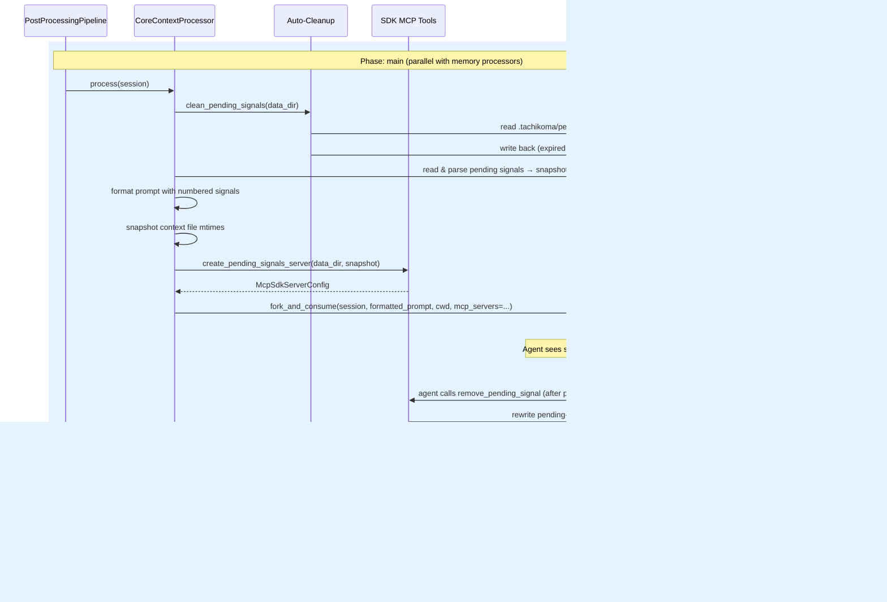
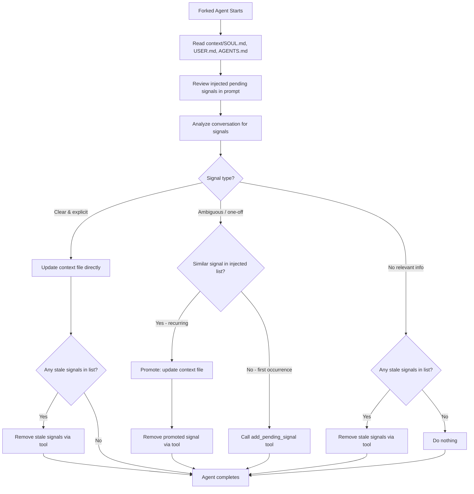

# Design: DLT-029 - Complete pending signals lifecycle with removal and auto-injection

**Delta Spec**: [../delta-specs/DLT-029.md](../delta-specs/DLT-029.md)
**Status**: Draft

## Purpose

This document explains the design rationale for this delta: the modeling choices, data flow, system behavior, and architectural approach.

After implementation, the "Detected Impacts" section will guide reconciliation into feature design docs.

## Problem Context

The context update post-processor currently provides `read_pending_signals` and `add_pending_signal` MCP tools to the forked agent. When the agent promotes a recurring signal to a context file update, it has no way to remove the original pending signal — it lingers in `.tachikoma/pending-signals.md` until the 30-day auto-cleanup expires it. This creates unnecessary noise for future forked sessions: the agent keeps seeing already-promoted signals and must re-evaluate them each time.

Additionally, the forked agent must make an explicit `read_pending_signals` tool call at the start of every session just to see what signals exist. Since signals are always needed, this tool call adds latency and token cost with no benefit.

**Constraints:**
- Changes are scoped to `context/tools.py` and `context/processor.py` — no new files or packages
- Must follow the existing DES-004 pattern (`CoreContextProcessor` already overrides `process()` for pre/post steps)
- The pre-fork snapshot approach (spec decision) means index-to-signal mapping is frozen for the forked session's lifetime
- All-or-nothing semantics for batch removal (spec AC: partial state is not acceptable)

**Interactions:**
- `CoreContextProcessor.process()` — orchestrates pre-fork setup, fork, and post-fork logging
- `create_pending_signals_server()` — factory that produces the MCP server config for the forked session
- `clean_pending_signals()` — pre-fork auto-cleanup (unchanged by this delta)
- `fork_and_consume()` — forks the SDK session with prompt and MCP tools

## Design Overview

The delta makes three coordinated changes across two files:

1. **Auto-injection (processor.py):** Before forking, the processor reads and parses the pending signals file, builds a numbered list (`S1: **date**: text`, ...), and injects it into the prompt by replacing a `{pending_signals_section}` placeholder in `CONTEXT_UPDATE_PROMPT`. The `self._prompt` attribute retains the unformatted template; `process()` creates a local `formatted_prompt` variable for each invocation, ensuring the template is reusable across calls. The parsed entries become the **snapshot** — a list of `(date_str, signal_text)` tuples that freezes the index-to-signal mapping for the session.

2. **Tool changes (tools.py):** The `read_pending_signals` tool is removed (auto-injection replaces it). A new `remove_pending_signal` tool is added, accepting `{"indices": list[int]}`. The factory signature becomes `create_pending_signals_server(data_dir: Path, snapshot: list[tuple[str, str]])` — the remove tool captures the snapshot via closure to resolve indices to entries and rewrite the file. The snapshot is treated as immutable; removals compute a filtered copy for file writing without mutating the original list.

3. **Prompt and description updates (both files):** The prompt instructions are rewritten to describe the full lifecycle (stage → promote+remove → cleanup stale), and tool descriptions are updated to convey each tool's role.

## Shape

| Part | Mechanism | Flag |
|------|-----------|:----:|
| **S1** | In `processor.py`, pre-fork: read and parse pending signals file using existing `_ENTRY_PATTERN` regex. Build a numbered list string (`S1: **date**: text`, ...). Replace the `{pending_signals_section}` placeholder in `CONTEXT_UPDATE_PROMPT` via `str.replace()` into a local `formatted_prompt` variable (`self._prompt` stays as unformatted template). Store parsed entries as the index→entry snapshot (list of tuples). | |
| **S2** | Remove `read_pending_signals` tool definition and its registration in `create_pending_signals_server()`. | |
| **S3** | Add `remove_pending_signal` tool accepting `{"indices": list[int]}`. Pass the pre-fork snapshot to `create_pending_signals_server(data_dir, snapshot)` as a new parameter. The tool validates all indices against the snapshot (all-or-nothing), computes a filtered copy (snapshot is immutable), then rewrites the file from the filtered entries. Empty file after removal → delete file (consistent with `clean_pending_signals`). | |
| **S4** | Rewrite the `CONTEXT_UPDATE_PROMPT` instructions: replace "read pending signals via tool" with "review the injected signals below"; add lifecycle guidance for promote+remove and stale cleanup; add `{pending_signals_section}` placeholder. | |
| **S5** | Update `add_pending_signal` description to "Stage a new ambiguous signal for future recurrence detection". Add `remove_pending_signal` description explaining index-based removal and its role as the cleanup/promotion step. | |

### Flagged Unknowns

None — all mechanisms are well-understood, scoped to two existing files with clear patterns to follow.

## Components

### Implementation Structure

| Layer/Component | Responsibility | Key Decisions |
|-----------------|----------------|---------------|
| `src/tachikoma/context/processor.py` | Pre-fork signal reading, snapshot creation, prompt formatting, fork orchestration | Snapshot built pre-fork; `self._prompt` stays as template, `process()` uses `str.replace()` into local `formatted_prompt`; snapshot passed to tool factory |
| `src/tachikoma/context/tools.py` | MCP tool definitions: `add_pending_signal` (staging) and `remove_pending_signal` (cleanup); factory `create_pending_signals_server(data_dir, snapshot)`; `clean_pending_signals()` utility (unchanged) | Remove tool uses snapshot closure (immutable — filtered copy for writes); all-or-nothing batch validation; file rewrite from filtered entries |

### Cross-Layer Contracts



**Integration Points:**
- Processor ↔ Pipeline: unchanged — registers in default `main` phase
- Processor ↔ Tools: factory now takes `snapshot` parameter for remove tool closure
- Processor ↔ Prompt: `CONTEXT_UPDATE_PROMPT` is a template constant; `str.replace()` fills the `{pending_signals_section}` placeholder at runtime into a local variable
- Forked agent ↔ Pending signals: agent uses `add_pending_signal` (staging) and `remove_pending_signal` (cleanup) — no read tool, no direct file access
- Remove tool ↔ File: rewrites file from snapshot minus removed entries (not in-place editing)

## Modeling

No new domain entities. The domain model remains minimal — context files and pending signals are plain markdown.

The **snapshot** is the only new data structure: a `list[tuple[str, str]]` of `(date_str, signal_text)` tuples, created by parsing the pending signals file pre-fork using the existing `_ENTRY_PATTERN` regex. Indices are 1-based (matching `S1..Sn` in the prompt).

```
CoreContextProcessor(PromptDrivenProcessor)   [DES-004]
├── _data_dir: Path                           (.tachikoma/)
├── CONTEXT_UPDATE_PROMPT: str                (module-level template constant)
└── process(session)
    ├── clean_pending_signals()               (pre-step, unchanged)
    ├── _read_pending_signals_snapshot()       (NEW: parse file → snapshot)
    ├── str.replace() into local formatted_prompt (NEW: template stays in self._prompt)
    ├── create_pending_signals_server(         (CHANGED: +snapshot param)
    │     data_dir, snapshot)
    ├── fork_and_consume(formatted_prompt, …)
    └── mtime comparison                      (post-step, unchanged)
```

### Pending Signals File Format

Unchanged:
```markdown
# Pending Signals

- **2026-03-10**: User seemed to prefer shorter responses
- **2026-03-14**: User again mentioned wanting more concise responses
```

### Prompt-Injected Signals Format

The numbered list injected into the prompt:
```
## Current Pending Signals

S1: **2026-03-10**: User seemed to prefer shorter responses
S2: **2026-03-14**: User again mentioned wanting more concise responses
```

When no signals exist:
```
## Current Pending Signals

No pending signals at this time.
```

## Data Flow

### Context update processor flow (updated)

```
1. Pipeline calls processor.process(session)
2. Pre-step — auto-cleanup:
   a. Read .tachikoma/pending-signals.md (no-op if missing)
   b. Parse entries, filter out those older than 30 days
   c. Write back filtered content (or delete file if empty after cleanup)
   d. On parse error: log warning, continue
3. NEW — Read and snapshot pending signals:
   a. Read .tachikoma/pending-signals.md (no-op if missing/empty)
   b. Parse entries with _ENTRY_PATTERN → snapshot: list[(date, text)]
   c. Build numbered section string (S1..Sn) or "No pending signals"
   d. Replace {pending_signals_section} placeholder via str.replace() → local formatted_prompt
4. Create SDK MCP tools:
   a. Define add_pending_signal and remove_pending_signal tools
   b. Pass snapshot to factory (remove tool closure)
   c. Bundle into McpSdkServerConfig via create_sdk_mcp_server()
5. Snapshot context file mtimes (unchanged)
6. Fork session with custom tools:
   a. Call fork_and_consume(session, formatted_prompt, cwd,
      mcp_servers={"pending-signals": server})
   b. Forked agent autonomously:
      - Reads all three context files
      - Reviews pending signals already visible in prompt context
      - Analyzes conversation for context-relevant information
      - For clear, explicit signals:
        → Updates the appropriate context file directly
      - For ambiguous, one-off signals:
        → Checks injected signals for semantic recurrence
        → If recurring: promotes to context file update
          AND removes promoted signal via remove_pending_signal
        → If new: stages via add_pending_signal tool
      - For stale/irrelevant injected signals:
        → Removes via remove_pending_signal tool
      - For conversations with no relevant information:
        → Does nothing (no-op)
7. Post-step — observability (unchanged)
8. Return to pipeline
```

### Fork session data flow (updated)



## Key Decisions

### Template placeholder with str.replace() for prompt injection

**Choice**: Use a `{pending_signals_section}` placeholder in the `CONTEXT_UPDATE_PROMPT` constant, filled via `str.replace()` at runtime. `self._prompt` retains the unformatted template; `process()` creates a local `formatted_prompt` for each invocation.
**Why**: Keeps the prompt as a single readable block with a small dynamic slot. `str.replace()` is brace-safe — the prompt is a markdown string that could contain literal `{` and `}` in examples or code blocks without causing errors (unlike `str.format()` which treats braces as format specifiers). The processor already overrides `process()` (DES-004 complex processor pattern), so replacing the placeholder there is natural.

**Alternatives Considered**:
- `str.format()`: Would require escaping all literal braces in the markdown prompt as `{{`/`}}`. Fragile — future prompt edits could introduce unescaped braces and cause runtime errors.
- Builder function (`build_context_update_prompt(signals)`): More explicit about dynamic nature, but scatters the prompt across function and template pieces. Unnecessary complexity for a single placeholder.

**Consequences**:
- Pro: Prompt stays readable as a single constant — the placeholder is self-documenting
- Pro: Brace-safe — no risk of `KeyError`/`ValueError` from markdown content
- Pro: Consistent with DES-004 — prompt is still a module-level constant, just with one dynamic slot
- Pro: `self._prompt` stays reusable across invocations (no mutation)

### Snapshot passed via factory parameter

**Choice**: `create_pending_signals_server(data_dir, snapshot)` receives the pre-fork snapshot as a parameter. The `remove_pending_signal` tool captures it via closure.
**Why**: The snapshot must be built in `processor.py` (which reads the file pre-fork and formats the prompt), then shared with the remove tool in `tools.py`. Passing it as a parameter to the factory is the cleanest boundary — the factory doesn't need to know how the snapshot was created.

**Alternatives Considered**:
- Have the factory read the file itself: Would duplicate parsing logic and couple the factory to file I/O timing
- Pass snapshot via a shared mutable object: Unnecessary indirection for a value that's frozen at creation time

**Consequences**:
- Pro: Clean separation — processor owns reading, factory owns tool creation
- Pro: Snapshot is immutable once created (list of tuples)
- Con: Factory signature changes (minor — only one caller)

### All-or-nothing batch removal

**Choice**: When removing multiple indices, validate all before removing any. If any index is invalid, return an error and remove nothing.
**Why**: Spec AC requires atomic semantics — partial removal would leave the file in an inconsistent state where some indices from the prompt are removed and others aren't, confusing the agent.

**Alternatives Considered**:
- Best-effort removal (remove valid, skip invalid): Simpler but violates spec AC; partial state is harder to reason about

**Consequences**:
- Pro: Deterministic — either all removed or none removed
- Pro: Agent can trust that a successful call removed exactly what it asked for
- Con: One bad index fails the whole batch (acceptable — indices come from the prompt, so they should all be valid)

### File rewrite from snapshot (immutable snapshot)

**Choice**: The remove tool rewrites `.tachikoma/pending-signals.md` by computing a filtered copy of the snapshot (excluding removed indices) and writing the result. The snapshot list itself is never mutated — this preserves stable index mapping across multiple sequential removals within a session.
**Why**: The snapshot is the source of truth for the forked session. The file may have been modified externally (by `add_pending_signal` appending new entries) or by a concurrent process. Rewriting from the snapshot ensures the removed entries are exactly the ones the agent saw in its prompt. Externally added entries between snapshot time and removal time may be lost — acceptable per spec AC (single-user, sequential system).

**Consequences**:
- Pro: Removal is exact — snapshot indices map deterministically to entries
- Pro: Simple implementation — filter snapshot, write result
- Pro: Immutable snapshot means sequential removals always use stable indices (no corruption from prior removals)
- Con: Entries added by `add_pending_signal` during the same session are overwritten if a removal also happens (see next decision)

### Tool ordering within a forked session

**Choice**: The prompt instructions guide the agent to perform all removals before any new staging. The lifecycle order is: analyze → promote+remove → cleanup stale → stage new signals.
**Why**: Since the remove tool rewrites the file from the immutable snapshot (excluding removed entries), any signals added by `add_pending_signal` before a removal would be lost when the file is rewritten. Ordering removals before additions avoids this — newly appended signals are written after the last rewrite.

**Consequences**:
- Pro: Simple, no merge logic needed between snapshot and appended entries
- Pro: Aligns with the natural lifecycle flow (cleanup before staging)
- Con: Agent must follow ordering guidance (enforced by prompt instructions, not code)

## System Behavior

### Scenario: Recurring signal promoted and removed

**Given**: Pending signals file contains `- **2026-03-10**: User seemed to prefer shorter responses`. Prompt injects it as `S1`. New conversation has user saying "your answers are way too long".
**When**: The forked agent runs
**Then**: Agent sees S1 in prompt, detects semantic recurrence, updates SOUL.md with concise preference, and calls `remove_pending_signal` with `indices: [1]`. The signal is removed from the file immediately.
**Rationale**: This is the core lifecycle improvement — promoted signals are cleaned up in the same session, not left to age out over 30 days.

### Scenario: Stale signal cleaned up

**Given**: Pending signals file contains `- **2026-03-05**: User mentioned liking dark themes`. Prompt injects it as `S1`. Several conversations have passed with no recurrence.
**When**: The forked agent runs and determines S1 is stale/irrelevant
**Then**: Agent calls `remove_pending_signal` with `indices: [1]` to clean it up.
**Rationale**: The agent can now proactively clean stale signals instead of waiting for the 30-day auto-cleanup.

### Scenario: Batch removal of multiple signals

**Given**: Pending signals file contains 5 entries, injected as S1-S5. Agent promotes S2 and determines S4 is stale.
**When**: Agent calls `remove_pending_signal` with `indices: [2, 4]`
**Then**: Both S2 and S4 are removed in a single call. S1, S3, S5 remain.
**Rationale**: Batch removal reduces tool calls and keeps the operation atomic.

### Scenario: Sequential removals use original indices

**Given**: Prompt contains S1, S2, S3. Agent removes S1, then later wants to remove S3.
**When**: Agent calls `remove_pending_signal` with `indices: [3]` (not `[2]`)
**Then**: S3 is correctly removed. Indices refer to the original prompt numbering, not shifted positions.
**Rationale**: The pre-fork snapshot freezes the index mapping. This is explicitly documented in the prompt instructions so the agent knows indices are stable.

### Scenario: Invalid index in batch fails entire operation

**Given**: Prompt contains S1, S2, S3. Agent calls `remove_pending_signal` with `indices: [1, 5]`.
**When**: The tool processes the request
**Then**: Returns error "Invalid indices: 5 (valid range: 1-3)". No signals are removed.
**Rationale**: All-or-nothing semantics prevent partial state. The agent can retry with corrected indices.

### Scenario: Empty indices list is a no-op

**Given**: Agent calls `remove_pending_signal` with `indices: []`
**When**: The tool processes the request
**Then**: Returns success. No signals are removed, file unchanged.
**Rationale**: Defensive handling — an empty list is technically valid.

### Scenario: All signals removed — file deleted

**Given**: Pending signals file contains 2 entries (S1, S2). Agent removes both.
**When**: The remove tool processes the request
**Then**: After removal, no entries remain. The file is deleted (consistent with `clean_pending_signals` behavior).
**Rationale**: Consistent empty-file handling across cleanup and removal.

### Scenario: No pending signals exist

**Given**: No `.tachikoma/pending-signals.md` file exists (or it's empty)
**When**: The processor reads signals pre-fork
**Then**: Snapshot is empty. Prompt section says "No pending signals at this time." No MCP tools error — add tool still works if the agent stages a new signal.
**Rationale**: Graceful handling of the zero-signals case.

### Scenario: New ambiguous signal staged (existing behavior preserved)

**Given**: Agent encounters a new ambiguous signal ("user mentioned preferring dark themes") with no similar entry in the injected list
**When**: Agent calls `add_pending_signal` with the signal text
**Then**: Signal is appended to the file with today's date (unchanged behavior).
**Rationale**: The staging path is unaffected by this delta — only the add tool description is updated to clarify its lifecycle role.

## Open Questions

None — all design decisions are resolved.

---

## Detected Impacts

### Affected Feature Designs
- **docs/feature-designs/agent/core-context-updates.md** - Modifies: Sequence diagram (remove `read_pending_signals` call, add auto-injection and `remove_pending_signal` calls), data flow (updated fork session flow), tool inventory in Implementation Structure table (`read_pending_signals` → `remove_pending_signal`), integration points (remove read tool reference, add remove tool), system behavior scenarios (update "Recurring signal promoted" to include explicit removal)
- **docs/feature-specs/agent/core-context-updates.md** - Modifies: R9.2 (tools list), R9.4 (explicit removal vs aging out), acceptance criteria referencing `read_pending_signals`

### Notes for Reconciliation
- Update R9.2 to reference "add and remove" tools plus auto-injection instead of "read and add" tools
- Update R9.4 to state that promoted signals are explicitly removed rather than naturally aging out
- Replace all `read_pending_signals` references in acceptance criteria with auto-injection behavior
- Add acceptance criteria for the remove tool and index-based removal
- Update sequence diagram in feature design: remove `read_pending_signals` tool call, add snapshot/injection step, add `remove_pending_signal` call
- Update fork session flowchart in feature design to match delta design's updated flow
- Update `tools.py` description in Implementation Structure table: `read_pending_signals` → `remove_pending_signal`
- Update integration points: "read and add MCP tools" → "add and remove MCP tools" + "auto-injection"
- Update "Recurring signal promoted" scenario to include explicit removal step
- Update DELTAS.md description to say "by index" instead of "by matching its text content"

## Notes

- The snapshot reuse of `_ENTRY_PATTERN` from `tools.py` means parsing logic is shared — the processor imports and uses the same regex
- `str.replace()` is used instead of `str.format()` for the single placeholder — brace-safe and simpler for markdown content
- The prompt instructions enforce tool ordering (removals before additions) to avoid the snapshot rewrite overwriting freshly-appended entries
