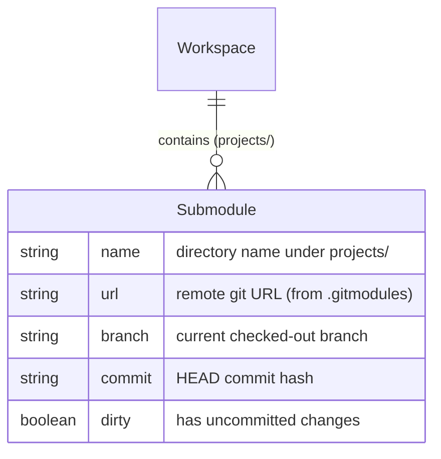
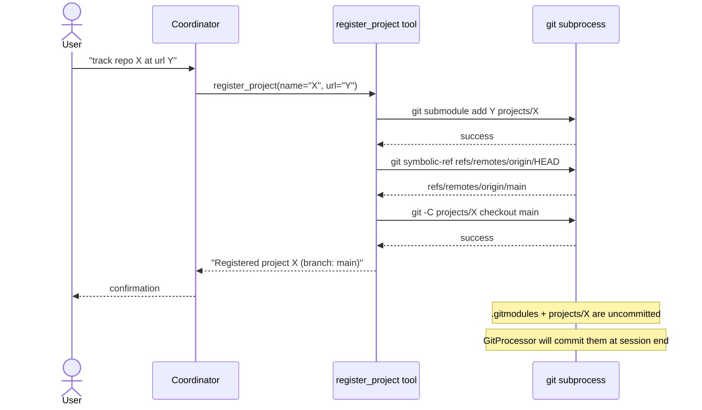
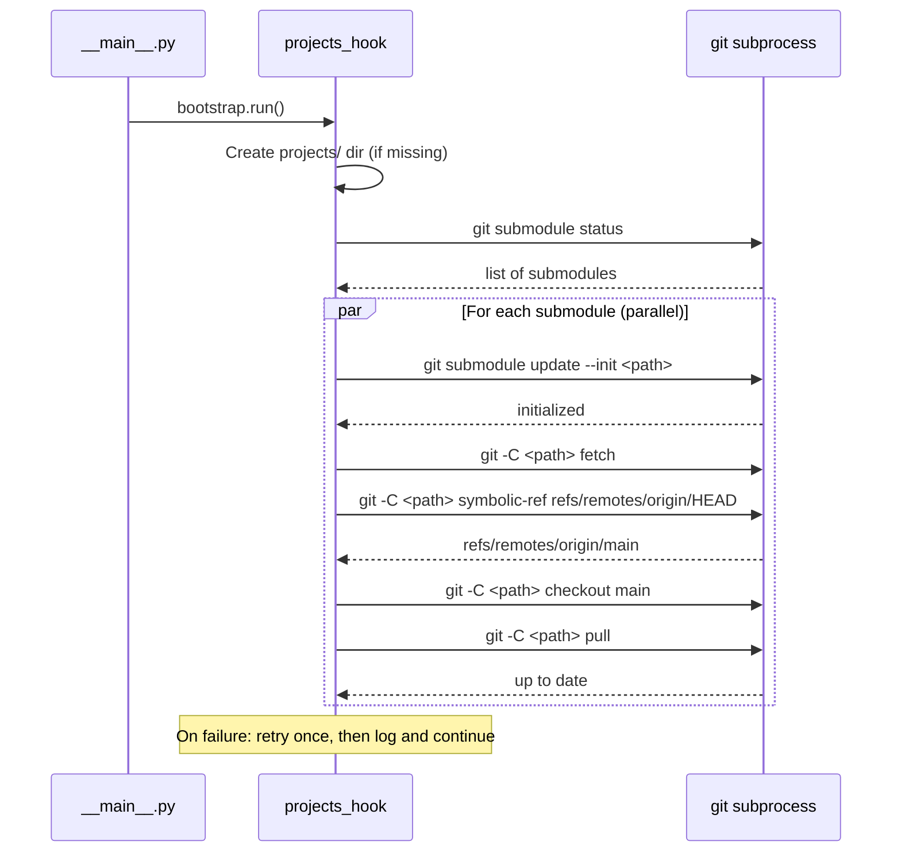
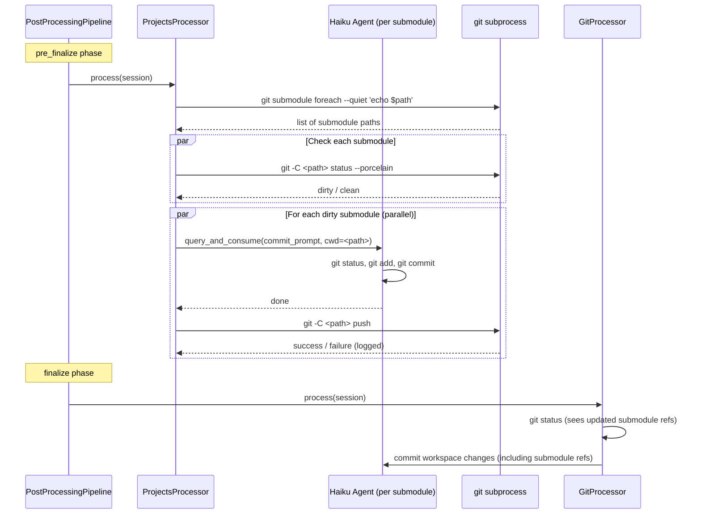

# Design: DLT-030 - Manage external project repositories

**Delta Spec**: [../delta-specs/DLT-030.md](../delta-specs/DLT-030.md)
**Status**: Draft

## Purpose

This document explains the design rationale for this delta: the modeling choices, data flow, system behavior, and architectural approach.

After implementation, the "Detected Impacts" section will guide reconciliation into feature design docs.

## Problem Context

The assistant currently operates within a single workspace git repository that tracks internal state (memories, context files, configuration). Users want the assistant to also manage external code repositories — checking out projects, making changes, and contributing back — alongside this workspace.

**Constraints:**
- External repos must not pollute the workspace's internal git history with unrelated file changes
- The workspace git history should track *which version* of each external repo is checked out (for reproducibility)
- Multiple submodules must be synced, committed, and pushed without creating a sequential bottleneck
- Git authentication is the user's responsibility — the system must fail clearly on auth errors, not silently
- The coordinator agent must be able to register/deregister projects during live conversations (not just in post-processing)

Git submodules satisfy the first two constraints natively: they isolate each project's history while recording the checked-out commit in the parent repo's tree.

## Design Overview

A new `projects` package (`src/tachikoma/projects/`) with five components, plus two infrastructure changes:

```
┌─────────────────────────────────────────────────────────────────┐
│                        __main__.py                              │
│  registers: hook, processor, context provider, MCP tools        │
└─────────┬──────────┬──────────────┬──────────────┬──────────────┘
          │          │              │              │
     ┌────▼────┐ ┌──▼───────┐ ┌───▼────────┐ ┌───▼──────────┐
     │ Hook    │ │ Processor│ │ Context    │ │ MCP Tools    │
     │ (boot)  │ │ (post)   │ │ Provider   │ │ (coordinator)│
     └────┬────┘ └────┬─────┘ └─────┬──────┘ └──────┬───────┘
          │           │             │                │
          └───────────┴─────────────┴────────────────┘
                              │
                      ┌───────▼───────┐
                      │  git helpers  │
                      │  (shared)     │
                      └───────────────┘
```

**Components:**
1. **Bootstrap hook** — creates `projects/` dir, initializes and pulls all submodules on startup
2. **Post-processor** — commits and pushes dirty submodules at session end, before GitProcessor
3. **Context provider** — injects project awareness at session start
4. **MCP tools** — `register_project` and `deregister_project` available to coordinator during conversations
5. **Git helpers** — shared async subprocess wrappers for submodule operations

**Infrastructure changes:**
- New `pre_finalize` pipeline phase between `main` and `finalize`
- `ContextResult` extended with optional `mcp_servers` field — context providers can carry MCP tools alongside text context (aligned with DLT-021's pattern of extending `ContextResult` with `agents`)
- Coordinator extracts `mcp_servers` from pipeline results per-session, stores them, and passes to `ClaudeAgentOptions`

**Wiring:** The `ProjectsContextProvider` creates the MCP server internally and returns it via `ContextResult.mcp_servers`. The coordinator extracts MCP servers from pipeline results after pre-processing, stores them per-session (`self._mcp_servers`), and passes them to `ClaudeAgentOptions` in `_build_options()`. This follows the same pipeline-to-coordinator handoff pattern that DLT-021 establishes for agents.

## Shape

| Part | Mechanism | Flag |
|------|-----------|:----:|
| **S1** | Bootstrap hook: create `projects/` dir, discover submodules from `.gitmodules`, init and pull all in parallel (1 retry per submodule, log failures, continue), check out default branch per remote HEAD ref | |
| **S2** | Projects post-processor: extends `PostProcessor`, checks each submodule for uncommitted changes, spawns fresh Haiku agent per dirty submodule via `query_and_consume()` (in parallel) to commit, then pushes each via subprocess; registered in `pre_finalize` phase | |
| **S2a** | Pipeline `pre_finalize` phase: new phase constant added between `main` and `finalize` in `PostProcessingPipeline` phase order, enabling projects processor to complete before GitProcessor | |
| **S3** | `register_project` MCP tool: runs `git submodule add <url> projects/<name>` via subprocess, resolves default branch from `git symbolic-ref refs/remotes/origin/HEAD`, checks out default branch | |
| **S4** | `deregister_project` MCP tool: checks for uncommitted changes via `git status --porcelain`, warns + requires `force` flag if present, removes via `git submodule deinit` + `git rm` + directory cleanup | |
| **S5** | Projects context provider: extends `ContextProvider`, reads `projects/` submodules, returns `ContextResult(tag="projects", content=..., mcp_servers={"projects": projects_server})` with names, paths, branches (or commit hash if detached) and project management MCP tools; returns None if no projects | |
| **S5a** | Extended `ContextResult` with `mcp_servers` — add optional `mcp_servers` field (same type as `ClaudeAgentOptions.mcp_servers`, default `None`). Aligned with DLT-021's pattern of adding `agents` to `ContextResult`. Coordinator extracts `mcp_servers` from pipeline results per-session, stores as `self._mcp_servers`, passes to `_build_options()` | |
| **S6** | Shared git helpers module: async subprocess wrappers for submodule operations (add, remove, status check, branch detection, pull, push, default branch resolution) used by hooks, processor, and tools | |

## Components

### Implementation Structure

| Layer/Component | Responsibility | Key Decisions |
|-----------------|----------------|---------------|
| `projects/__init__.py` | Package exports | Re-exports hook, processor, provider, server factory |
| `projects/hooks.py` | Bootstrap hook (`projects_hook`) | Follows DES-003; runs after git hook in registration order |
| `projects/processor.py` | `ProjectsProcessor` post-processor | Extends `PostProcessor` directly (not `PromptDrivenProcessor` — no session fork needed); session param unused; registered in `pre_finalize` phase |
| `projects/context_provider.py` | `ProjectsContextProvider` pre-processor | Extends `ContextProvider`; pure filesystem reads + creates MCP server internally; returns both text context and `mcp_servers` on `ContextResult` |
| `projects/tools.py` | MCP tool definitions + server factory | Follows `context/tools.py` pattern; closure over workspace path |
| `projects/git.py` | Shared async git helpers | Pure subprocess wrappers; no SDK dependency |
| `post_processing.py` | Pipeline phase infrastructure | Add `PRE_FINALIZE_PHASE` to `_VALID_PHASES` frozenset and `_phase_order` list; `__init__` pre-population `{p: [] for p in _VALID_PHASES}` handles it automatically |
| `pre_processing.py` | `ContextResult` extension | Add `mcp_servers` field (same type as `ClaudeAgentOptions.mcp_servers`, default `None`); backward compatible — existing providers don't set it |
| `coordinator.py` | MCP server extraction from pipeline results | After pre-processing, iterate results, merge non-None `mcp_servers` dicts, store as `self._mcp_servers` per-session; pass to `_build_options()` → `ClaudeAgentOptions`; clear on session transition |

### Cross-Layer Contracts

**MCP Tool Contract — `register_project`:**
```
Input:  { "name": str, "url": str }
Output: { "content": [{"type": "text", "text": "..."}] }
        | { "content": [...], "is_error": true }
```

**MCP Tool Contract — `deregister_project`:**
```
Input:  { "name": str, "force": bool (default false) }
Output: { "content": [{"type": "text", "text": "..."}] }
        | { "content": [...], "is_error": true }
```

**Context Provider Contract — `ProjectsContextProvider`:**
```
Input:  message: str (unused — projects context is static per session)
Output: ContextResult(
          tag="projects",
          content="<project list>",
          mcp_servers={"projects": McpSdkServerConfig}
        ) | None
```

**Integration Points:**
- Bootstrap hook writes to `BootstrapContext.extras` — no direct coupling to other components
- Processor uses `query_and_consume()` from `git/processor.py` — reuses existing pattern for spawning commit agents
- MCP tools and context provider both read filesystem state independently — no shared mutable state
- Error isolation: each component handles its own failures (log + continue) without affecting others

### Shared Logic

- **`projects/git.py`**: Centralizes all git subprocess calls. Used by hooks (init/pull), processor (status/push), tools (add/remove), and context provider (branch detection). This avoids duplicating subprocess boilerplate and ensures consistent error handling across components.
- **`git/processor.py:query_and_consume()`**: Reused by `ProjectsProcessor` to spawn Haiku commit agents. Not duplicated — imported directly. Note: this creates a `projects` → `git` cross-subsystem import for a generic utility function. Acceptable for now; if more subsystems need fresh agent spawning, extract to a shared `tachikoma/agent_utils.py` module.

**Submodule commit prompt**: The processor uses a dedicated `SUBMODULE_COMMIT_PROMPT` constant (not the workspace-specific `GIT_COMMIT_PROMPT`). The submodule prompt instructs the Haiku agent to: (1) read recent `git log` entries to learn the project's commit style and conventions (e.g., conventional commits, prefixes, casing), (2) check for any commit instructions in the repo (CONTRIBUTING.md, CLAUDE.md, etc.), (3) run `git status` and `git diff` in the submodule, (4) group changes by purpose/directory, (5) create descriptive commits following the project's own commit style. Unlike the workspace prompt, it does **not** reference workspace-specific directories (`memories/`, `context/`). It uses generic code-change grouping logic but adapts to each project's conventions.

## Modeling

No database entities. Project state is entirely filesystem-derived:



**State sources:**
- **Registry**: `.gitmodules` file (managed by `git submodule add/remove`)
- **Current branch**: `git -C <path> symbolic-ref --short HEAD` (or commit hash if detached)
- **Dirty status**: `git -C <path> status --porcelain`
- **Default branch**: `git -C <path> symbolic-ref refs/remotes/origin/HEAD` (after fetch)

There is no separate persistence layer — git itself is the source of truth for project state.

## Data Flow

### Registration Flow



### Startup Sync Flow



### Session-End Commit/Push Flow



## Key Decisions

### New `pre_finalize` Pipeline Phase

**Choice**: Add a third phase `pre_finalize` between `main` and `finalize` in `PostProcessingPipeline`.
**Why**: The projects processor must complete before `GitProcessor` so that submodule reference updates are included in the workspace commit. Within a phase, processors run in parallel — there's no ordering guarantee. A new phase provides clean sequential ordering without changing the parallel semantics of existing phases.
**Alternatives Considered**:
- Sequential execution within finalize: Would change existing finalize semantics; any future finalize processor would also be forced sequential.
- Composite processor (GitProcessor calls projects internally): Couples unrelated concerns; breaks single-responsibility.

**Consequences**:
- Pro: Minimal change (add constant to `_VALID_PHASES` and `_phase_order`); clean phase separation
- Con: Pipeline now has three phases instead of two; slight additional complexity in phase model

### MCP Tools via ContextResult (Pipeline-Driven Pattern)

**Choice**: Extend `ContextResult` with an optional `mcp_servers` field. The `ProjectsContextProvider` creates the MCP server internally and returns it alongside text context. The coordinator extracts `mcp_servers` from pipeline results and stores them per-session, passing to `ClaudeAgentOptions` in `_build_options()`.
**Why**: This aligns with DLT-021's established pattern where `ContextResult` carries structured data (agents) alongside text context, and the coordinator extracts it from pipeline results. Context providers become the single entry point for injecting both knowledge (text) and capabilities (agents, MCP tools) into the coordinator. This avoids adding ad-hoc parameters to the Coordinator constructor for each new capability type.
**Alternatives Considered**:
- Add `mcp_servers` parameter directly to `Coordinator.__init__()`: Works but creates a separate wiring path outside the pipeline. Each new capability type would need another constructor parameter. The pipeline-driven approach is more extensible and consistent with DLT-021's direction.

**Consequences**:
- Pro: Consistent with DLT-021's `agents` pattern — context providers are the unified injection mechanism for both text and structured capabilities
- Pro: Coordinator constructor stays clean — no per-capability parameters needed
- Pro: MCP servers are session-scoped (created fresh each session) with automatic cleanup on transition
- Con: Introduces `McpSdkServerConfig` type import into `pre_processing.py` (same trade-off DLT-021 makes with `AgentDefinition`)

### Fresh `query()` for Submodule Commits (Not Session Fork)

**Choice**: Use `query_and_consume()` (fresh agent, no session fork) to generate commits per submodule, matching the `GitProcessor` pattern.
**Why**: Commit generation doesn't need conversation context — it only needs to inspect the submodule's git status and create descriptive commits. A fresh Haiku agent is cheaper and faster than forking the full session. This exactly matches how `GitProcessor` already works.
**Alternatives Considered**:
- Direct `git add -A && git commit` via subprocess: Simpler but produces generic single commits without intelligent grouping by purpose.
- Single agent for all submodules: Would process sequentially; violates R4.3 (no sequential bottleneck).

**Consequences**:
- Pro: Consistent with existing workspace commit pattern; descriptive grouped commits; parallel execution
- Con: One Haiku agent call per dirty submodule (cost scales with number of dirty submodules)

### Default Branch via `git symbolic-ref`

**Choice**: Resolve default branch using `git symbolic-ref refs/remotes/origin/HEAD` after fetch/clone.
**Why**: This reads the locally cached remote HEAD reference — no network call needed after the initial clone/fetch. It's fast and reliable. The reference is set automatically by `git clone` (which `git submodule add` uses internally) and updated on `git fetch`.
**Alternatives Considered**:
- `git remote show origin`: Makes a network call every time; slower and can fail if offline.
- `git ls-remote --symref <url> HEAD`: Requires the URL (not always convenient); always a network call.

**Consequences**:
- Pro: Fast (local read), no network dependency after initial clone
- Con: If the remote's default branch changes *after* clone, the local ref won't update until the next `git fetch` (which happens on every startup sync, so staleness is bounded)
- Edge case: `refs/remotes/origin/HEAD` may not exist on cold init (older git versions, or submodule initialized without a full clone). The git helpers include a fallback: if `symbolic-ref` fails, use `git remote show origin` as a one-time network call to resolve the default branch. If that also fails, fall back to `main`

## System Behavior

### Scenario: First Project Registration

**Given**: No projects exist yet; `projects/` directory exists (created by bootstrap hook)
**When**: The coordinator calls `register_project(name="my-app", url="git@github.com:user/my-app.git")`
**Then**: The submodule is added under `projects/my-app`, checked out to the remote's default branch, and `.gitmodules` + `projects/my-app` appear as uncommitted changes in the workspace
**Rationale**: The uncommitted state is intentional — `GitProcessor` will commit the submodule addition at session end, maintaining the workspace's version tracking integrity

### Scenario: Registration with Existing Name

**Given**: A project named "my-app" already exists under `projects/`
**When**: `register_project(name="my-app", url="...")` is called
**Then**: The tool returns an error: "Project 'my-app' already exists"
**Rationale**: `git submodule add` would fail anyway; catching it early provides a clearer message

### Scenario: Registration with Invalid URL

**Given**: The provided git URL is unreachable or requires unconfigured authentication
**When**: `register_project` calls `git submodule add`
**Then**: The subprocess fails; the tool cleans up any partial state (`git submodule deinit`, remove directory) and returns an error with the git stderr output
**Rationale**: Partial state (half-added submodule) would break subsequent operations; cleanup ensures idempotent retry

### Scenario: Startup with Conflicting Submodule

**Given**: A submodule has local unpushed commits that conflict with remote changes
**When**: The startup pull runs and `git pull` fails with merge conflict
**Then**: The failure is logged with details, the submodule is left in its pre-pull state, and other submodules continue syncing
**Rationale**: The user must resolve conflicts manually; the system shouldn't silently discard local work. Other submodules shouldn't be blocked by one conflict.

### Scenario: Successful Deregistration

**Given**: `projects/my-app` exists with no uncommitted changes
**When**: `deregister_project(name="my-app")` is called
**Then**: The submodule is fully removed (`git submodule deinit`, `git rm`, directory cleanup). The `.gitmodules` modification and index removal remain as uncommitted changes — `GitProcessor` will commit them at session end.
**Rationale**: Consistent with registration flow — workspace changes from project operations are committed by GitProcessor, not by the tools themselves

### Scenario: Deregistration with Uncommitted Changes

**Given**: `projects/my-app` has uncommitted modifications
**When**: `deregister_project(name="my-app")` is called without `force=true`
**Then**: The tool returns a warning listing the uncommitted changes and requires `force=true` to proceed
**Rationale**: Prevents accidental data loss; the user must explicitly acknowledge they're discarding changes

### Scenario: Session End with Multiple Dirty Submodules

**Given**: Two submodules (`project-a`, `project-b`) have uncommitted changes; one submodule (`project-c`) is clean
**When**: The projects post-processor runs in `pre_finalize` phase
**Then**: `project-c` is skipped. `project-a` and `project-b` each get a Haiku agent spawned in parallel. After commits complete, each is pushed. If `project-b`'s push fails (e.g., non-fast-forward), the failure is logged and `project-a`'s push succeeds independently. Then `GitProcessor` runs in `finalize` and commits the updated submodule references.
**Rationale**: Parallel processing per R4.3; error isolation per R4.2; GitProcessor ordering per R5

### Scenario: Push Failure (Non-Fast-Forward)

**Given**: A submodule's remote has advanced since last pull
**When**: The push fails with non-fast-forward error
**Then**: The failure is logged with a message indicating the remote has diverged. The local commits remain intact and will be reconciled on the next startup pull.
**Rationale**: Force-pushing would destroy remote work. The next startup sync will attempt to pull and merge, giving the user a chance to resolve.

### Scenario: No Submodules Registered

**Given**: No `.gitmodules` file exists or no submodules are configured
**When**: The bootstrap hook runs
**Then**: It creates `projects/` directory (idempotent) and completes as a no-op
**Rationale**: The hook must be safe to run on every startup regardless of whether projects are configured

### Scenario: Context Injection with Detached HEAD

**Given**: A project's submodule is in detached HEAD state (e.g., after `git submodule update` without checkout)
**When**: The context provider runs
**Then**: It reports the short commit hash instead of a branch name (e.g., `abc1234 (detached)`)
**Rationale**: The agent should know the project state even when it's unusual; detached HEAD is a recoverable state that the startup hook normally resolves

## Open Questions

- [ ] None — all flagged unknowns resolved during design

---

## Detected Impacts

### Affected Feature Designs
- **docs/feature-designs/agent/core-architecture.md** - Modifies + Adds: register projects bootstrap hook, ProjectsProcessor in pre_finalize phase, ProjectsContextProvider in pre-processing; coordinator extracts `mcp_servers` from pipeline results per-session
- **docs/feature-designs/agent/workspace-bootstrap.md** - Adds: new projects_hook after git hook in registration sequence
- **docs/feature-designs/agent/workspace-version-tracking.md** - Modifies: GitProcessor now also commits submodule reference updates (no code change, but design doc should note this)
- **docs/feature-designs/agent/post-processing-pipeline.md** - Modifies: new `pre_finalize` phase added to phase order
- **docs/feature-designs/agent/pre-processing-pipeline.md** - Modifies: `ContextResult` extended with optional `mcp_servers` field (aligned with DLT-021's `agents` extension); ProjectsContextProvider registered alongside MemoryContextProvider

### Notes for Reconciliation
- workspace-bootstrap: add projects_hook to the registered hooks list; document parallel init/pull behavior
- workspace-version-tracking: note that GitProcessor now commits submodule reference changes alongside workspace changes (no implementation change needed — GitProcessor already commits all uncommitted changes)
- post-processing-pipeline: document new `pre_finalize` phase in phase model; update phase diagram
- pre-processing-pipeline: document `mcp_servers` field on `ContextResult` (alongside DLT-021's `agents` field); document ProjectsContextProvider
- core-architecture: document coordinator `mcp_servers` extraction from pipeline results per-session; document `_handle_transition` clearing `_mcp_servers`
- New feature doc needed: `docs/feature-specs/agent/project-management.md` + `docs/feature-designs/agent/project-management.md`

## Notes

- The `query_and_consume()` function from `git/processor.py` is reused for submodule commit generation — no duplication needed
- All git operations use `asyncio.create_subprocess_exec()` for async subprocess management
- The MCP tool pattern follows `context/tools.py` exactly: `@tool()` decorator with closure over workspace path, `create_sdk_mcp_server()` factory
- Per DES-005, all `query()` generators are fully consumed (no early `break` or `return`)
