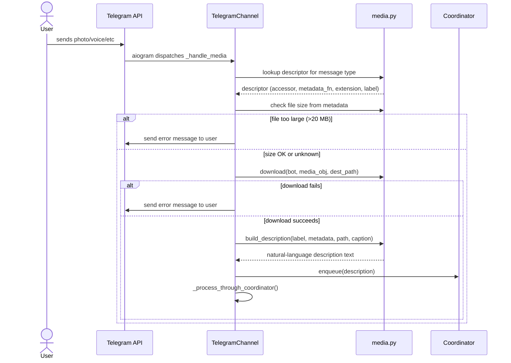

# Design: DLT-035 - Receive images and audio from Telegram

**Delta Spec**: [../delta-specs/DLT-035.md](../delta-specs/DLT-035.md)
**Status**: Approved

## Purpose

This document explains the design rationale for this delta: the modeling choices, data flow, system behavior, and architectural approach.

After implementation, the "Detected Impacts" section will guide reconciliation into feature design docs.

## Problem Context

The Telegram channel currently registers a single aiogram handler for `F.text` messages. All other content types — photos, voice messages, audio files, documents, stickers, videos, video notes, and animations — are silently ignored. Users cannot share visual or audio content with the agent.

**Constraints:**
- Telegram Bot API limits file downloads to 20 MB
- The agent (Claude SDK) receives text input — media files must be described as text with a file path the agent can access via its existing tools (Read for images, Bash for audio)
- Media handlers must follow the same buffering behavior as text messages (enqueue + process through coordinator)
- Temp files must be cleaned up eventually but survive across conversation turns

**Interactions:**
- Telegram channel (`telegram.py`): new handler and descriptor table alongside existing text handler
- Coordinator layer: reuses existing `enqueue()` / `_process_through_coordinator()` — no changes needed
- Bootstrap system (`__main__.py`): new `media_hook` registered following DES-003

## Design Overview

The design follows a **media proxy pattern**: each supported media message is downloaded to a local temp folder and forwarded to the agent as a natural-language text description containing metadata and the file path. The agent then decides how to process the file using its existing tools.

A **single catch-all handler** covers all 8 supported media types. Type-specific logic (field access, metadata extraction, file extension) is driven by a **declarative descriptor table** rather than if/elif chains — adding a new media type means adding a row to the table.

```
┌──────────────────────────────────────────────────────────────┐
│                     Telegram Channel                          │
│                                                               │
│  ┌────────────────────┐   ┌─────────────────────────────┐    │
│  │  Text Handler       │   │  Media Handler (catch-all)   │    │
│  │  F.text             │   │  F.photo | F.voice | ...     │    │
│  │  → enqueue(text)    │   │  → descriptor lookup         │    │
│  │                     │   │  → size check                 │    │
│  │                     │   │  → download to temp folder    │    │
│  │                     │   │  → build description          │    │
│  │                     │   │  → enqueue(description)       │    │
│  └─────────┬──────────┘   └──────────────┬────────────────┘    │
│            │                             │                     │
│            ▼                             ▼                     │
│  ┌───────────────────────────────────────────────────────┐    │
│  │  _process_through_coordinator() (shared)               │    │
│  └───────────────────────────────────────────────────────┘    │
├──────────────────────────────────────────────────────────────┤
│  ┌───────────────────────────────────────────────────────┐    │
│  │  Coordinator (unchanged)                               │    │
│  │  enqueue() → send_message() → AgentEvent stream        │    │
│  └───────────────────────────────────────────────────────┘    │
└──────────────────────────────────────────────────────────────┘

┌──────────────────────────────────────────────────────────────┐
│  Bootstrap                                                    │
│  ┌───────────────────────────────────────────────────────┐    │
│  │  media_hook: ensure /tmp/tachikoma-media exists,       │    │
│  │  delete files older than 30 days                       │    │
│  └───────────────────────────────────────────────────────┘    │
└──────────────────────────────────────────────────────────────┘
```

## Shape

| Part | Mechanism | Flag |
|------|-----------|:----:|
| **S1** | Register a single catch-all aiogram handler for all supported media types (`F.photo \| F.voice \| F.audio \| F.document \| F.sticker \| F.video \| F.video_note \| F.animation`), filtered by authorized chat ID | |
| **S2** | Media descriptor table: a declarative mapping from media type to extraction logic — field accessor (e.g., `message.photo[-1]`), metadata builder, default file extension, and media type label. The catch-all handler looks up the descriptor and delegates to it | |
| **S3** | Download function: validate file size from metadata (`file_size` field) against 20 MB limit before download; call `bot.download(media_obj, destination=Path)` to save; on failure or size-limit rejection from Telegram API, send error message to user in chat | |
| **S4** | Description builder: for each media type, construct a natural-language text description from metadata (dimensions, duration, title, etc.) plus the saved file path; append caption as user's message if present | |
| **S5** | File naming: generate unique filenames to prevent overwrites. Types with an original filename (documents, audio, video) use `{uuid}-{original_filename}` to preserve context; types without (photos, voice, stickers, video notes, animations) use `{uuid}.{ext}` with a type-appropriate extension | |
| **S6** | Wire media handler to enqueue the description text through the existing coordinator path (`enqueue()` + `_process_through_coordinator()`) — same buffering behavior as text messages | |
| **S7** | Bootstrap hook (`media_hook`): create `/tmp/tachikoma-media` on startup; delete files older than 30 days; follows DES-003 pattern — defined in a media module, registered in `__main__.py` | |

### Flagged Unknowns

None — all mechanisms use well-understood patterns from the existing codebase and aiogram's stable API.

## Components

### Implementation Structure

| Layer/Component | Responsibility | Key Decisions |
|-----------------|----------------|---------------|
| `src/tachikoma/media.py` (new) | Media descriptor table, download function, description builder, file naming, `media_hook` bootstrap function | New module — high cohesion between all media-related logic; bootstrap hook lives here per DES-003 |
| `src/tachikoma/telegram.py` | `_handle_media` catch-all handler; handler registration in `__init__`; delegates to `media.py` functions | Media handler follows same pattern as `_handle_message` for text |
| `src/tachikoma/__main__.py` | Registers `media_hook` in bootstrap sequence | Hook registered immediately before `telegram` hook — the temp folder must exist before polling starts, but has no dependency on other subsystems |

### Cross-Layer Contracts



**Integration Points:**
- Channel ↔ `media.py`: function calls — `resolve_media()` returns the media object + descriptor, `download_media()` saves file and returns path, `build_description()` returns text
- Channel ↔ Coordinator: same `enqueue()` + `_process_through_coordinator()` as text handler
- `media_hook` ↔ Bootstrap: follows DES-003 pattern (defined in media module, registered in `__main__.py`)
- Channel ↔ Telegram API: `bot.download(media_obj, destination=Path)` for file download; `bot.send_message()` for error messages to user

### Shared Logic

- **File naming** (`generate_media_filename`): Used by all media types to produce UUID-based filenames with appropriate extensions
- **Description building** (`build_description`): Shared function that composes the final text from a media type label, type-specific metadata lines, file path, and optional caption

## Modeling

### Media descriptor table

The descriptor table is an **ordered sequence** — resolution iterates in order and returns the first match. Ordering matters because aiogram populates multiple fields for some message types (e.g., an animation message sets both `message.animation` and `message.document`). More specific types must appear before generic ones.

```
MEDIA_DESCRIPTORS: ordered sequence of (field_name, descriptor)
1. "animation"  → { accessor: msg.animation,  ext: ".mp4",                     label: "Animation" }
2. "sticker"    → { accessor: msg.sticker,    ext: .webp/.tgs/.webm (by type), label: "Sticker" }
3. "video_note" → { accessor: msg.video_note, ext: ".mp4",                     label: "Video note" }
4. "photo"      → { accessor: msg.photo[-1],  ext: ".jpg",                     label: "Photo" }
5. "voice"      → { accessor: msg.voice,      ext: ".ogg",                     label: "Voice message" }
6. "video"      → { accessor: msg.video,      ext: ".mp4",                     label: "Video" }
7. "audio"      → { accessor: msg.audio,      ext: from file_name or ".mp3",   label: "Audio file" }
8. "document"   → { accessor: msg.document,   ext: from file_name,             label: "Document" }
```

**Why this order**: `animation` before `document` (animations set both fields), `video_note` before `video` (defensive), `document` last (most generic — many types also set it as a fallback).

Each descriptor provides:
- **accessor**: how to extract the downloadable media object from the message
- **extension resolver**: how to determine the file extension (fixed, from `file_name`, or from sticker type)
- **label**: human-readable name for the description
- **metadata builder**: function that extracts type-specific metadata fields into description lines

### Metadata per type

| Type | Metadata fields |
|------|----------------|
| Photo | dimensions (width x height), file size |
| Voice | duration (seconds), MIME type |
| Audio | title, performer, duration — missing fields omitted |
| Document | original filename, MIME type, file size |
| Sticker | emoji, format (regular/animated/video) |
| Video | duration, dimensions |
| Video note | duration, diameter (length field) |
| Animation | duration, dimensions |

### File extension resolution

| Type | Extension source |
|------|-----------------|
| Photo | Always `.jpg` (Telegram serves largest size as JPEG) |
| Voice | Always `.ogg` (Telegram encodes voice as Opus in OGG) |
| Audio | From `file_name` if present, else `.mp3` |
| Document | From `file_name` if present, else no extension |
| Sticker | `.tgs` if `is_animated`, `.webm` if `is_video`, else `.webp` (regular) |
| Video | From `file_name` if present, else `.mp4` |
| Video note | Always `.mp4` |
| Animation | Always `.mp4` |

### Constants

```
MEDIA_TEMP_DIR = Path("/tmp/tachikoma-media")
TELEGRAM_MAX_FILE_SIZE = 20 * 1024 * 1024  # 20 MB in bytes
MEDIA_CLEANUP_DAYS = 30
```

## Data Flow

### Media message happy path

```
1. User sends photo/voice/etc in Telegram
2. aiogram Router receives update, chat ID filter passes
3. _handle_media handler invoked (catch-all for all media types)
4. Resolve media: iterate descriptor table in priority order (animation → ... → document),
   find first non-None field on message → returns (media_object, descriptor)
5. Size pre-check: read media_object.file_size
   ├─ file_size known and > 20 MB → send error to user, return
   └─ file_size unknown or within limit → continue
6. Generate filename: UUID + descriptor's extension resolver
7. Download: bot.download(media_object, destination=MEDIA_TEMP_DIR / filename)
   ├─ TelegramAPIError → send error to user, return
   └─ success → continue
8. Build description:
   a. Start with label line: "The user sent a photo (1280x720, 245 KB)."
   b. Add metadata details using descriptor's metadata builder
   c. Add file path line: "The file is saved at /tmp/tachikoma-media/abc123.jpg"
   d. If caption present: append "The user said: \"Check this out\""
9. Enqueue: coordinator.enqueue(description_text)
10. If not already processing: _process_through_coordinator()
    (same flow as text messages from here)
```

### Bootstrap: media temp folder

```
1. media_hook(ctx) runs during bootstrap
2. Create MEDIA_TEMP_DIR if missing (mkdir with exist_ok)
3. Scan directory for files older than MEDIA_CLEANUP_DAYS
4. Delete each old file (log warnings on failure, don't abort)
5. Log summary: created/exists, files cleaned
```

### Error paths

```
Size pre-check failure:
  1. file_size > 20 MB
  2. Send message to user: "This file is too large to download (XX MB).
     Telegram bots can only download files up to 20 MB."
  3. Return (no download attempted, conversation continues)

Download failure:
  1. bot.download() raises TelegramAPIError
  2. Log the error
  3. Send message to user: "Failed to download the file. Please try again."
  4. Return (conversation continues)

Unexpected size limit from API (file_size was None or wrong):
  1. bot.download() or bot.get_file() raises TelegramBadRequest
  2. Handled same as download failure
```

## Key Decisions

### Single catch-all handler with descriptor table

**Choice**: One handler registered for all media types, with a declarative descriptor table driving the per-type logic
**Why**: Keeps handler registration minimal (one line instead of eight). The descriptor table makes per-type behavior explicit, scannable, and easy to extend. Adding a new media type is a single table entry rather than a new handler method.
**Sources**: aiogram 3.26 docs — `F.photo | F.voice | ...` filter composition confirmed working; `bot.download()` accepts any `Downloadable` object directly
**Options Researched**: Per-type handlers (more aiogram-idiomatic but significant boilerplate for 8 types), single handler with if/elif (less readable than a table)
**Why This Over Alternatives**: The descriptor table approach is the most compact and maintainable. Per-type handlers would each follow the identical pattern (resolve → size check → download → describe → enqueue) with only the metadata extraction differing — exactly the variation a descriptor table captures.

**Consequences**:
- Pro: Single registration, single handler, all variation in a scannable table
- Pro: Easy to add new types (one table entry)
- Con: Slightly less discoverable than separate handler methods (mitigated by clear table documentation)

### New `media.py` module

**Choice**: Create a dedicated `media.py` module for all media-related logic (descriptors, download, description building, file naming, bootstrap hook)
**Why**: The media handling logic (descriptor table, download function, description builder, file naming, bootstrap hook) has high internal cohesion and low coupling to the rest of `telegram.py`. Keeping it in `telegram.py` would significantly grow an already large module (800+ lines). The bootstrap hook must live in its owning module per DES-003.
**Sources**: DES-003 (subsystem bootstrap hooks), existing pattern of `workspace.py` owning `workspace_hook`
**Options Researched**: Adding everything to `telegram.py` (too large), splitting into multiple modules (over-engineered for this scope)
**Why This Over Alternatives**: Single new module keeps cohesion high without over-splitting. The telegram module imports from media and delegates — clean separation.

**Consequences**:
- Pro: `telegram.py` stays focused on channel lifecycle and rendering
- Pro: Media logic is self-contained and testable in isolation
- Pro: Bootstrap hook placement follows DES-003 naturally

### Hardcoded `/tmp/tachikoma-media` temp folder

**Choice**: Use a fixed path under `/tmp` for downloaded media files
**Why**: Media files are ephemeral by nature — they're consumed by the agent within the current or next conversation turn. `/tmp` is semantically correct for temporary files, is cleaned by the OS on reboot, and avoids polluting the workspace data directory with binary blobs.
**Options Researched**: Workspace data path (`~/.tachikoma/media`), configurable path via settings
**Why This Over Alternatives**: Workspace storage would persist large binary files indefinitely between reboots. A configurable path adds settings complexity for a location that rarely needs customization. The 30-day bootstrap cleanup provides additional hygiene.

**Consequences**:
- Pro: No config needed, predictable location
- Pro: OS cleanup on reboot provides a safety net
- Con: Files don't survive reboot (acceptable — they're ephemeral)

### Natural-language descriptions

**Choice**: Construct human-readable natural-language descriptions rather than structured/labeled format
**Why**: The agent processes these descriptions as natural language input. A conversational format ("The user sent a photo...") fits naturally into the message flow and requires no special parsing. The file path is always on its own line for easy extraction.
**Options Researched**: Structured labels (`[Photo] 1280x720\nFile: ...`), JSON format, markdown format
**Why This Over Alternatives**: Natural language reads naturally in the conversation context. Structured formats would work but feel mechanical for what is essentially a message from the user. The agent handles both equally well, so we optimize for readability.

**Consequences**:
- Pro: Reads naturally in conversation flow
- Pro: Consistent with how other system messages are formatted
- Con: Slightly more tokens than a terse structured format (negligible)

### Pre-check file size from metadata before download

**Choice**: Check `file_size` from the media object's metadata before attempting download. If it exceeds 20 MB, send an error immediately without calling `bot.download()`.
**Why**: Avoids a wasted network round-trip and a Telegram API error. The `file_size` field is available on all media types (though optional — may be `None`). When `None`, we attempt the download and handle the API error if it occurs.
**Sources**: aiogram 3.26 type definitions — all media types expose `file_size: int | None`; Telegram Bot API docs confirm 20 MB download limit
**Options Researched**: Always attempt download and catch the error (simpler but wasteful), use `bot.get_file()` to check `file_path is None` (extra API call)
**Why This Over Alternatives**: The metadata check is free (no API call) and covers the common case. The fallback error handling covers the edge case where `file_size` is `None`.

**Consequences**:
- Pro: No wasted API calls for obviously too-large files
- Pro: Faster user feedback
- Con: `file_size` may be `None` in rare cases — handled by fallback error path

## System Behavior

### Scenario: Photo message received

**Given**: The bot is running and the authorized user sends a photo with caption "What's in this image?"
**When**: The aiogram router dispatches to `_handle_media`
**Then**: The handler resolves the photo descriptor, takes `message.photo[-1]` (largest size), downloads it to `/tmp/tachikoma-media/{uuid}.jpg`, builds the description "The user sent a photo (1280x720, 245 KB). The file is saved at /tmp/tachikoma-media/{uuid}.jpg\n\nThe user said: \"What's in this image?\"", and enqueues it. The agent receives this text and can use its Read tool to view the image.
**Rationale**: The agent's Read tool supports images natively — the file path in the description is sufficient for it to access the content.

### Scenario: Voice message received

**Given**: The bot is running and the authorized user sends a voice message
**When**: The handler resolves the voice descriptor
**Then**: Downloads the voice file as `.ogg`, builds description with duration and MIME type, enqueues it. The agent can use Bash to process the audio file if needed (e.g., transcription via external tool).
**Rationale**: Voice files are OGG/Opus — the agent can decide how to handle them based on the description.

### Scenario: Document with original filename

**Given**: A user sends a PDF document named "report.pdf"
**When**: The handler resolves the document descriptor
**Then**: The file is saved as `/tmp/tachikoma-media/{uuid}-report.pdf` preserving the original filename in the generated name. The description includes the original filename, MIME type, and file size.
**Rationale**: Preserving the original filename (appended to the UUID) helps the agent understand what the file is while preventing name collisions.

### Scenario: File exceeds 20 MB (size known)

**Given**: A user sends a large video file where `file_size` metadata indicates 35 MB
**When**: The handler checks `file_size` against the 20 MB limit
**Then**: The handler sends an error message to the user: "This file is too large to download (35.0 MB). Telegram bots can only download files up to 20 MB." No download is attempted. The conversation remains usable.
**Rationale**: Fail-fast with a clear message rather than wasting a network round-trip.

### Scenario: File exceeds 20 MB (size unknown)

**Given**: A user sends a file where `file_size` is `None` in the metadata, but the actual size exceeds 20 MB
**When**: The handler attempts `bot.download()` and the Telegram API returns an error
**Then**: The error is caught, an error message is sent to the user, and the conversation continues.
**Rationale**: Graceful degradation when metadata is incomplete.

### Scenario: Download fails due to network error

**Given**: A media message is received but the network is unreliable
**When**: `bot.download()` raises a `TelegramAPIError`
**Then**: The error is logged, an error message is sent to the user ("Failed to download the file. Please try again."), and the conversation remains usable.
**Rationale**: Network errors are transient — inform the user and let them retry.

### Scenario: Media message arrives mid-stream

**Given**: The bot is streaming a response to a previous message
**When**: The user sends a photo
**Then**: The handler downloads the photo and enqueues the description via `coordinator.enqueue()`. The `_is_processing` flag causes the handler to return after enqueue (same as text message buffering). The description is processed after the current response completes.
**Rationale**: Same buffering semantics as text messages — no special handling needed.

### Scenario: Unsupported message type

**Given**: A user sends a contact, location, or poll
**When**: The message arrives
**Then**: Neither the text handler (`F.text`) nor the media handler (`F.photo | F.voice | ...`) matches. The message is silently dropped by aiogram's router.
**Rationale**: The filter composition explicitly lists supported types — everything else is naturally excluded.

### Scenario: Sticker with different formats

**Given**: A user sends an animated sticker (.TGS format)
**When**: The handler resolves the sticker descriptor
**Then**: The file extension is determined by checking `sticker.is_animated` (→ `.tgs`) and `sticker.is_video` (→ `.webm`), defaulting to `.webp` for regular stickers. The description notes the format.
**Rationale**: Stickers come in three formats — the extension must match the actual content.

### Scenario: Bootstrap creates temp folder

**Given**: The application starts for the first time (no `/tmp/tachikoma-media` exists)
**When**: `media_hook` runs during bootstrap
**Then**: The directory is created. No cleanup needed (empty directory).
**Rationale**: Idempotent initialization per DES-003 — safe to run every launch.

### Scenario: Bootstrap cleans old files

**Given**: The application starts and `/tmp/tachikoma-media` contains files from 45 days ago and 5 days ago
**When**: `media_hook` runs
**Then**: The 45-day-old files are deleted. The 5-day-old files are preserved. Deletion failures are logged but don't abort bootstrap.
**Rationale**: Graceful cleanup — old files shouldn't block startup.

## Open Questions

None — all design decisions are resolved.

---

## Detected Impacts

### Affected Feature Designs
- **docs/feature-designs/channels/telegram.md** - Modifies: adds media handler registration alongside text handler; adds media download→describe→enqueue data flow; adds descriptor table as a component; updates handler registration section
- **docs/feature-designs/agent/workspace-bootstrap.md** - Adds: `media_hook` entry in bootstrap hook registration order (immediately before `telegram` hook)

### Notes for Reconciliation
- Telegram feature design needs a new "Media Handler" section in Components showing the catch-all handler and its relationship to `media.py`
- Telegram feature design's "Cross-Layer Contracts" sequence diagram needs a media message branch
- Telegram feature design's handler registration section needs to show both `F.text` and media filter
- Bootstrap feature design's hook registration order list needs `media_hook` entry
- The `media.py` module is a new component — the Telegram feature design should reference it as an integration point

## Notes

### Research sources
- aiogram 3.26.0 installed package — inspected `Bot.download()` signature, all media type model fields (`PhotoSize`, `Voice`, `Audio`, `Document`, `Sticker`, `Video`, `VideoNote`, `Animation`), `F` filter attributes, and `ContentType` enum via runtime introspection
- aiogram v3.27.0 documentation (via Context7) — confirmed `F.photo | F.voice` filter composition, `bot.download()` accepting `Downloadable` objects, `message.photo[-1]` for largest size, 20 MB download limit on `File` class
- Telegram Bot API documentation — confirmed 20 MB bot download limit, file types and metadata fields

### Implementation notes
- All media types expose `file_id` and implement `Downloadable`, so `bot.download(media_obj)` works directly without extracting `file_id` first
- `message.photo` is always a `list[PhotoSize]` — `message.photo[-1]` is the largest resolution
- `VideoNote` has no `mime_type` field (unlike all other audio/video types)
- `file_size` is `int | None` on all media types — the `None` case is handled by the fallback error path
- Animation messages set both `message.animation` and `message.document` — the descriptor table ordering ensures `animation` is matched first
- The `media_hook` registration position: immediately before `telegram` hook. The temp folder must exist before polling starts, but all bootstrap hooks complete before `telegram_channel.run()` is called, so the only real constraint is that it runs before the channel. Placing it right before `telegram` groups media and telegram concerns together in the registration order
- aiogram dispatches handlers concurrently for different messages. Two media messages arriving simultaneously would each run `_handle_media` concurrently, but UUID-based filenames prevent collisions and each handler enqueues independently
