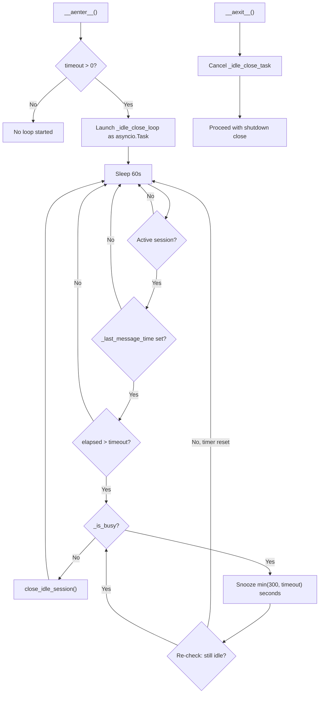

# Design: DLT-036 - Auto-close idle sessions

**Delta Spec**: [../delta-specs/DLT-036.md](../delta-specs/DLT-036.md)
**Status**: Draft

## Purpose

This document explains the design rationale for idle session auto-close: the periodic check mechanism, busy-state detection, session close behavior, and integration with the existing coordinator lifecycle.

After implementation, the "Detected Impacts" section will guide reconciliation into feature design docs.

## Problem Context

Sessions currently close only via boundary detection (topic shift) or clean shutdown. When a conversation simply trails off — the user stops messaging without changing topics — the session stays open indefinitely. Post-processing (memory extraction, context updates, git commit) never runs until the process restarts or the user sends a message on a different topic.

**Constraints:**
- Must not interfere with active message processing or task delivery
- Must integrate with the coordinator's existing session lifecycle (close, post-processing, SDK state clearing)
- Configuration lives in the `[agent]` section, independent of the task scheduler's `[tasks]` idle window
- Errors must never crash the application
- The loop must be cleanly cancellable on shutdown

**Interactions:**
- Coordinator (`coordinator.py`): Gains idle close loop and close method, follows existing `_handle_transition()` close pattern
- Sessions (`sessions/registry.py`): `close_session()` called on idle timeout — existing, idempotent
- Post-processing pipeline: Async post-processing triggered on idle close — same as boundary detection
- Configuration (`config.py`): New `session_idle_timeout` field in `AgentSettings`

## Design Overview

Two new methods on the coordinator implement idle session auto-close:

```
┌──────────────────────────────────────────────────────────────┐
│                       Coordinator                            │
│                                                              │
│  ┌────────────────────────────────┐                         │
│  │ _idle_close_loop()             │ asyncio.Task            │
│  │  ├── sleep 60s                 │ launched in __aenter__   │
│  │  ├── check: active session?    │ cancelled in __aexit__   │
│  │  ├── check: last_message_time? │                         │
│  │  ├── check: elapsed > timeout? │                         │
│  │  ├── check: busy?             │                         │
│  │  │   ├── yes → snooze          │                         │
│  │  │   └── no → close            │                         │
│  │  └── loop                      │                         │
│  └────────────────────────────────┘                         │
│                    │                                         │
│                    ▼                                         │
│  ┌────────────────────────────────┐                         │
│  │ close_idle_session()           │                         │
│  │  ├── close session in registry │ follows _handle_transition│
│  │  ├── fire async post-proc      │ close pattern, but does │
│  │  ├── clear SDK state           │ NOT create a new session │
│  │  └── store previous summary    │                         │
│  └────────────────────────────────┘                         │
└──────────────────────────────────────────────────────────────┘
```

The loop checks every 60 seconds whether `_last_message_time` exceeds `session_idle_timeout`. If the coordinator is busy (message exchange active, messages queued, or per-message post-processing in flight), the close is snoozed for `min(300, session_idle_timeout)` seconds and retried. On close, the session follows the same pattern as `_handle_transition()` but does not create a new session — the next user message creates one naturally via the first-message path.

## Shape

| Part | Mechanism | Flag |
|------|-----------|:----:|
| **S1** | Add `session_idle_timeout` field to `AgentSettings` (default 900s, 0 disables) and update default config generation | |
| **S2** | Periodic idle-close loop on the coordinator — async task launched in `__aenter__` (if timeout > 0), cancelled in `__aexit__` before shutdown close. Checks every 60s if `_last_message_time` exceeds timeout. Skips if no active session or no `_last_message_time`. Errors logged, loop continues. | |
| **S3** | `close_idle_session()` method on coordinator — close session in registry, fire async post-processing (if `sdk_session_id` set), clear `_sdk_session_id`, `_agents`, `_mcp_servers`, store `_previous_summary`. Does NOT create a new session — next message follows first-message path. Shares close-and-clear pattern with `_handle_transition()`; implementation may extract a shared helper. | |
| **S4** | Busy-state check before idle close — `_client is not None` (message exchange active) OR `has_pending_messages` (queue not empty) OR `_pending_msg_task is not None and not done` (per-message post-processing in flight). If busy, snooze for `min(300, session_idle_timeout)` seconds and retry. | |

## Components

### Implementation Structure

| Layer/Component | Responsibility | Key Decisions |
|-----------------|----------------|---------------|
| `src/tachikoma/config.py` | `AgentSettings` gains `session_idle_timeout: int = 900` field with description. Default config generation updated. | Field in `[agent]` section, not `[tasks]` — independent of task scheduler |
| `src/tachikoma/coordinator.py` | `Coordinator.__init__` gains `session_idle_timeout: int = 900` parameter (passed from `__main__.py` as `settings.agent.session_idle_timeout`). New `_idle_close_loop()` periodic check, `close_idle_session()` close action, `_idle_close_task` field for lifecycle management, `_is_busy` property for busy detection. | Methods on coordinator — avoids exposing internals to external module. Plumbing follows existing `session_resume_window` pattern. |

### Cross-Layer Contracts

```mermaid
sequenceDiagram
    participant Loop as _idle_close_loop
    participant Coord as Coordinator
    participant Registry as SessionRegistry
    participant Pipeline as PostProcessingPipeline

    Loop->>Coord: check _last_message_time
    Loop->>Coord: check _is_busy

    alt Not busy and timeout exceeded
        Loop->>Coord: close_idle_session()
        Coord->>Registry: close_session(id)
        Coord->>Pipeline: run(session) [async task]
        Note over Coord: Clear _sdk_session_id, _agents, _mcp_servers
        Note over Coord: Store _previous_summary
    else Busy
        Note over Loop: Snooze min(300, timeout) seconds
        Loop->>Loop: retry after snooze
    end
```

**Integration Points:**
- `_idle_close_loop` ↔ coordinator state: reads `_last_message_time`, `_client`, `has_pending_messages`, `_pending_msg_task` — accessed internally via private fields and existing property
- `close_idle_session()` ↔ `SessionRegistry`: calls `close_session()` (existing, idempotent)
- `close_idle_session()` ↔ `PostProcessingPipeline`: fires async `run()` as background task (same pattern as `_handle_transition()`)
- `__aenter__` / `__aexit__`: loop lifecycle tied to coordinator context manager

**Error contract:**
- Loop errors: caught per-iteration, logged, loop continues on next cycle
- `close_idle_session()` errors: caught by the loop, logged, retried on next cycle
- `CancelledError`: propagated cleanly on shutdown (loop exits)

### Shared Logic

- **Session close + state clearing**: `close_idle_session()` and `_handle_transition()` share the same close-and-clear pattern (registry close, async post-processing, SDK state clear, summary storage). Implementation may extract a shared helper to avoid duplication, but this is an implementation detail.
- **`_is_busy` property**: Encapsulates the busy-state check used by the idle close loop. Not used elsewhere currently but could serve future needs.

## Modeling

No new domain types. The feature adds:

- One config field (`session_idle_timeout: int`) to `AgentSettings`
- Three additions to the coordinator:
  - `_idle_timeout: int` — the configured timeout in seconds
  - `_idle_close_task: asyncio.Task[None] | None` — reference to the running loop task
  - `_is_busy: bool` (property) — derived from `_client`, `_message_buffer`, `_pending_msg_task`

## Data Flow

### Idle close loop lifecycle



### Idle close action (`close_idle_session()`)

```
1. Capture active session snapshot from registry
2. Close session in registry (set ended_at — idempotent)
3. If session has sdk_session_id:
   a. Fire async post-processing as background task
   b. Add to _background_tasks list
   c. Prune completed tasks
4. Clear _sdk_session_id = None
5. Clear _agents = None
6. Store _previous_summary = session.summary
7. Clear _mcp_servers = {}
8. Log: "Session closed due to idle timeout"
```

Steps 1-7 mirror `_handle_transition()` exactly, minus that method's step 8 (create new session). The next user message follows the normal first-message path — `send_message()` detects no active session, creates one, runs pre-processing.

### Snooze retry loop

```
1. Timeout exceeded — enter snooze loop
2. While _is_busy:
   a. Sleep min(300, session_idle_timeout) seconds
   b. Re-check: is there still an active session?
   c. Re-check: has _last_message_time been reset? (elapsed < timeout)
      → If yes: exit snooze loop, return to main check cycle (timer reset)
   d. Re-check: is coordinator still busy?
      → If yes: repeat snooze
3. Coordinator no longer busy — proceed to close_idle_session()
```

The snooze loop re-evaluates all conditions after each snooze. If a new message arrived during the snooze, `_last_message_time` will have been reset and the elapsed check returns the loop to normal cycling.

### Shutdown ordering

```
__aexit__():
  1. Cancel _idle_close_task (prevents race with shutdown close)
  2. Await pending per-message task (existing)
  3. Get active session (existing)
  4. Close active session (existing — no-op if idle close already closed it)
  5. Run post-processing (existing)
  6. Await background tasks (existing — catches post-processing from idle close)
```

Cancelling the loop first prevents a race condition where both the idle loop and `__aexit__` attempt to close the session simultaneously. If `close_idle_session()` already ran, `get_active_session()` returns None and `__aexit__` skips gracefully.

## Key Decisions

### Idle close loop on the coordinator (not a standalone module)

**Choice**: Implement `_idle_close_loop()` and `close_idle_session()` as coordinator methods, launched as an asyncio task in `__aenter__`.
**Why**: The idle close needs access to many private coordinator fields: `_last_message_time`, `_client`, `_message_buffer`, `_pending_msg_task`, `_sdk_session_id`, `_agents`, `_mcp_servers`, `_previous_summary`, `_registry`, `_pipeline`, `_background_tasks`. A standalone module would require 10+ parameters or exposing all these internals.
**Alternatives Considered**:
- Standalone async function (like `session_task_scheduler`): Would need many callbacks/dependencies, creating a wide interface surface. The task scheduler works as standalone because it only needs `last_message_time` via a single callback; idle close needs deep coordinator access.

**Consequences**:
- Pro: All session lifecycle logic in one place (create, close, transition, idle close)
- Pro: No need to expose private coordinator state
- Pro: Loop lifecycle naturally tied to coordinator context manager
- Con: Coordinator grows by ~50-60 lines (mitigated by the logic being straightforward)

### Busy check via existing state (no task delivery tracking)

**Choice**: Check `_client is not None`, `has_pending_messages`, and `_pending_msg_task` status. No tracking of `SessionTaskReady` dispatch-to-delivery gap.
**Why**: The queue check (`has_pending_messages`) naturally catches most of the dispatch-to-delivery gap — channels call `coordinator.enqueue()` before processing, putting the message in the buffer. Additionally, `_last_message_time` is updated at the START of `send_message()`, so the idle timer resets as soon as processing begins. The 60-second check interval provides a large margin against the tiny gap (milliseconds) between enqueue and `send_message()` entry.
**Alternatives Considered**:
- Shared pending-task counter incremented on dispatch, decremented on `on_complete()`: Adds coupling between scheduler, channels, and idle closer for a gap that is practically unobservable.
- Event bus-based tracking with `TaskDeliveryStarted`/`TaskDeliveryCompleted` events: Additional event types for a simple counter — over-engineered for the problem.

**Consequences**:
- Pro: Zero coupling to task scheduling subsystem
- Pro: No new shared state or tracking objects
- Pro: Uses only existing coordinator fields
- Con: Theoretical gap between `SessionTaskReady` dispatch and `enqueue()` — but the 60s check interval and `_last_message_time` reset make this unobservable in practice

### No new session on idle close

**Choice**: `close_idle_session()` closes the session and clears state but does NOT create a new session. The next user message follows the normal first-message path.
**Why**: This matches the spec (R5) and keeps idle close simple. Creating a session eagerly would waste a session ID if the user doesn't return, and would need to handle pre-processing without a message.
**Alternatives Considered**:
- Create a new session immediately (like `_handle_transition()`): Wastes resources if user doesn't return, premature session creation without a message to drive pre-processing.

**Consequences**:
- Pro: Simpler than `_handle_transition()` — no session creation logic
- Pro: No wasted session IDs
- Pro: Normal first-message path handles pre-processing naturally

## System Behavior

### Scenario: Normal idle close

**Given**: An active session with `_last_message_time` set, coordinator is idle
**When**: The idle check runs and `elapsed > session_idle_timeout`
**Then**: `close_idle_session()` closes the session, fires async post-processing, clears SDK state, stores previous summary. The next user message creates a new session via the first-message path.
**Rationale**: The primary use case — conversations that trail off get their post-processing triggered automatically.

### Scenario: Snooze on busy coordinator

**Given**: An active session with elapsed time exceeding timeout, but a message exchange is in progress (`_client is not None`)
**When**: The idle check runs
**Then**: Close is snoozed for `min(300, session_idle_timeout)` seconds. After the snooze, conditions are re-checked: if the coordinator is still busy, another snooze applies; if `_last_message_time` was reset (new message completed), the idle timer starts fresh.
**Rationale**: Ensures idle close never interrupts an active exchange.

### Scenario: Snooze on queued messages

**Given**: An active session with elapsed time exceeding timeout, but `has_pending_messages` is true (messages waiting in the buffer)
**When**: The idle check runs
**Then**: Close is snoozed — same behavior as any busy state. The queued messages will be processed, resetting `_last_message_time`.
**Rationale**: Messages may be enqueued by channels before `send_message()` starts (e.g., session task delivery). The queue check catches this window.

### Scenario: Message arrives during snooze

**Given**: Idle close was snoozed because the coordinator was busy
**When**: A new message exchange completes during the snooze period, updating `_last_message_time`
**Then**: After the snooze, re-check finds `elapsed < session_idle_timeout` and the idle timer starts fresh.
**Rationale**: The snooze is effectively cancelled — the new activity resets the inactivity measurement.

### Scenario: No active session

**Given**: No active session exists (app just started, or session was already closed)
**When**: The idle check runs
**Then**: The check is skipped — no action taken.
**Rationale**: Nothing to close.

### Scenario: Active session with no message exchange

**Given**: An active session exists but `_last_message_time` is None (session created but no message processed yet)
**When**: The idle check runs
**Then**: The check is skipped — cannot determine inactivity without a reference point.
**Rationale**: Avoids closing a session that was just created.

### Scenario: Timeout set to 0 (disabled)

**Given**: `session_idle_timeout = 0` in configuration
**When**: The coordinator enters its context
**Then**: No idle close loop is started. The coordinator behaves as before this delta.
**Rationale**: Provides an opt-out mechanism.

### Scenario: Shutdown with idle close loop running

**Given**: The idle close loop is running (sleeping or snoozed)
**When**: `__aexit__` executes on shutdown
**Then**: The loop task is cancelled first. If idle close already closed the session, `__aexit__` finds no active session and skips its close. If the session is still active, `__aexit__` handles the close normally.
**Rationale**: Cancelling the loop first prevents a race between idle close and shutdown close.

### Scenario: Session without SDK session ID

**Given**: An active session that was created but never received an agent response (no `sdk_session_id`)
**When**: Idle timeout fires
**Then**: Session is closed in registry, but post-processing is skipped (no transcript to analyze). SDK state clearing is still performed.
**Rationale**: Same behavior as boundary detection and shutdown — post-processing requires a valid SDK session.

### Scenario: Idle close fails mid-execution

**Given**: `close_idle_session()` encounters an error (e.g., registry failure)
**When**: The loop catches the exception
**Then**: Error is logged, loop continues. On the next 60-second cycle, the check runs again and may retry the close.
**Rationale**: Graceful degradation — transient errors are retried automatically.

### Scenario: Snooze duration capped to timeout

**Given**: `session_idle_timeout = 120` (2 minutes)
**When**: A snooze occurs (coordinator is busy)
**Then**: Snooze duration is `min(300, 120) = 120` seconds, not the default 300.
**Rationale**: Snooze should never exceed the timeout itself — otherwise a 2-minute timeout would wait 5 minutes on snooze.

## Open Questions

(none — all unknowns resolved)

---

## Detected Impacts

### Affected Feature Designs
- **docs/feature-designs/agent/sessions.md** — Modifies: adds idle timeout as a third session close mechanism (alongside boundary detection and shutdown)
- **docs/feature-designs/configuration/config-system.md** — Adds: `session_idle_timeout` field in AgentSettings model

### Notes for Reconciliation
- Sessions design "Session close mechanism" section needs idle timeout listed as a third runtime mechanism
- Sessions design sequence diagram could show idle close path
- Config design Modeling section needs `session_idle_timeout: int = 900` in AgentSettings tree
- Config spec "Configuration Loading" AC needs `session_idle_timeout` default documented

## Notes

- The 60-second check interval means there can be up to 60 seconds of delay between the actual timeout expiry and the close execution. This is acceptable per the spec (AC for R3).
- `_last_message_time` is updated at the START of `send_message()` and again after response completion. This provides a supplementary guard — the elapsed time will be near-zero during normal exchanges. However, the `_is_busy` check is the primary protection against idle close firing during an active exchange, since `_last_message_time` only reflects the most recent dequeued message and would not protect against very long exchanges exceeding the timeout.
- The close pattern in `close_idle_session()` mirrors `_handle_transition()` steps 1-6 exactly. If these diverge in the future, a shared helper should be extracted to keep them in sync.
