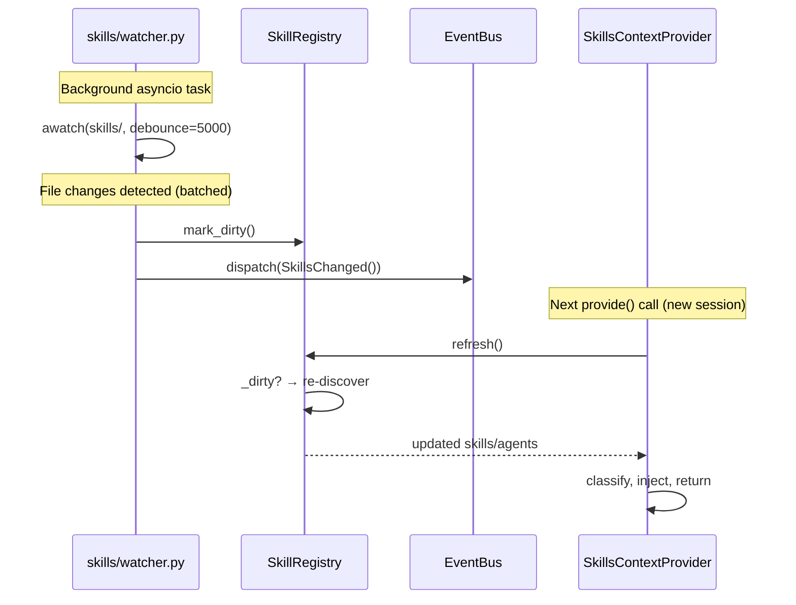

# Design: DLT-038 - Hot-reload skills at runtime

**Delta Spec**: [../delta-specs/DLT-038.md](../delta-specs/DLT-038.md)
**Status**: Approved

## Purpose

This document explains the design rationale for this delta: the modeling choices, data flow, system behavior, and architectural approach.

After implementation, the "Detected Impacts" section will guide reconciliation into feature design docs.

## Problem Context

The skill registry loads once during bootstrap and never refreshes. Since the agent can create and modify skill files during execution (e.g., via the skill authoring guide), newly authored or updated skills are invisible until the next application restart. This forces a restart cycle during skill development — the agent creates a skill, but cannot use it until the user restarts.

**Constraints:**
- Re-scan must preserve existing error handling (invalid skills skipped, valid ones loaded)
- Re-scan must be transparent to the context provider — no API change to `provide()`
- Mid-session skill changes must not affect the current session's detected skills (session stability invariant)
- Burst changes during skill authoring must coalesce into a single refresh, not one per file change
- Watcher lifecycle must integrate with existing bootstrap/shutdown patterns

**Interactions:**
- Skills bootstrap hook (DES-003) creates the directory and now also creates the shared registry
- Filesystem watcher monitors the skills directory as a background asyncio task
- Registry dirty flag bridges the watcher and the provider's refresh cycle
- Event bus (ADR-009) carries `SkillsChanged` events for future consumers (e.g., DLT-045 context invalidation)
- Graceful shutdown cancels the watcher task alongside scheduler tasks

## Design Overview

A filesystem watcher monitors `workspace/skills/` using `watchfiles.awatch()` and sets a dirty flag on the shared `SkillRegistry` when changes are detected. The `SkillsContextProvider` checks this flag at the start of each `provide()` call — if dirty, the registry re-discovers skills from disk before proceeding. A `SkillsChanged` event is emitted on the bubus event bus for future consumers. The watcher coalesces burst changes via a 5-second debounce window.

The registry moves from provider-owned to a shared resource in bootstrap extras, following the pattern used by `database` and `session_registry`. This allows both the provider and the watcher to reference the same registry instance.

```
┌──────────────────────────────────────────────────────────┐
│ __main__.py                                              │
│                                                          │
│  ┌──────────────────┐  ┌──────────────────────────────┐  │
│  │ Watcher Task      │  │ SkillsContextProvider        │  │
│  │ (asyncio.Task)    │  │                              │  │
│  │                   │  │  provide():                  │  │
│  │ awatch(skills/)   │  │    registry.refresh()        │  │
│  │   ↓ changes       │  │    ... classification ...    │  │
│  │ registry.mark()   │  │                              │  │
│  │ bus.dispatch()    │  └───────────┬──────────────────┘  │
│  └─────────┬─────────┘              │                     │
│            │                        │                     │
│            └────────┐  ┌────────────┘                     │
│                     ▼  ▼                                  │
│            ┌──────────────────┐                           │
│            │  SkillRegistry   │                           │
│            │  (bootstrap      │                           │
│            │   extras)        │                           │
│            │                  │                           │
│            │  _dirty flag     │                           │
│            │  refresh()       │                           │
│            │  _discover()     │                           │
│            └──────────────────┘                           │
└──────────────────────────────────────────────────────────┘
```

## Shape

| Part | Mechanism | Flag |
|------|-----------|:----:|
| **S1** | `SkillRegistry.refresh()` method: checks `_dirty` flag — if dirty, saves old dict references, builds fresh dicts via `_discover()`, resets flag; restores old references on failure. If not dirty, no-op. Exposes `mark_dirty()` for external callers | |
| **S2** | `watchfiles.awatch()` loop in `skills/watcher.py` running as a background asyncio task, monitoring `workspace/skills/` recursively with `rust_timeout=500` for responsive shutdown; top-level exception handler logs errors and exits gracefully | |
| **S3** | 5-second debounce via `watchfiles.awatch(debounce=5000)` — coalesces burst changes (directory + SKILL.md + agent files) into a single yield | |
| **S4** | When the watcher yields changes: call `registry.mark_dirty()` + dispatch `SkillsChanged(BaseEvent[None])` on the event bus | |
| **S5** | `SkillsContextProvider.provide()` calls `registry.refresh()` at start, before reading `registry.skills` — transparent to callers, no signature change | |
| **S6** | `SkillsContextProvider` receives `SkillRegistry` via constructor injection (no longer creates its own) — registry comes from bootstrap extras | |
| **S7** | Skills bootstrap hook extended: creates `SkillRegistry` and stores it in `ctx.extras["skill_registry"]` alongside directory creation | |
| **S8** | Watcher task created in `__main__.py` alongside scheduler tasks, cancelled in `finally` block — follows existing graceful shutdown pattern | |

## Components

### Implementation Structure

| Layer/Component | Responsibility | Key Decisions |
|-----------------|----------------|---------------|
| `skills/registry.py` | `SkillRegistry`: discovery, storage, refresh with dirty flag | Swap-on-success refresh; `mark_dirty()` as external API; `refresh()` as internal check-and-rescan |
| `skills/watcher.py` | `watch_skills()` async function: monitors skills directory, signals registry, dispatches events; top-level exception handler prevents silent task death | Uses `watchfiles.awatch()` with 5s debounce and 500ms rust_timeout; `DefaultFilter` (default) filters noise from hidden files and `__pycache__` |
| `skills/events.py` | `SkillsChanged(BaseEvent[None])`: typed event for skill change notification | Follows bubus event pattern (ADR-009); no payload — signals "something changed" |
| `skills/context_provider.py` | `SkillsContextProvider`: classification and injection, with refresh-before-read | Constructor receives registry instead of creating its own |
| `skills/hooks.py` | `skills_hook`: directory creation + registry creation in bootstrap extras | Follows DES-003; registry stored as `ctx.extras["skill_registry"]` |
| `__main__.py` | Watcher task lifecycle: creation, cancellation alongside scheduler tasks | Same pattern as `instance_generator`, `session_task_scheduler`, `background_task_runner` |

### Cross-Layer Contracts

**Watcher → Registry → Provider flow:**



**Integration Points:**
- Watcher ↔ Registry: `mark_dirty()` — write-only, no return value
- Watcher ↔ EventBus: `dispatch(SkillsChanged())` — fire-and-forget
- Provider ↔ Registry: `refresh()` before `skills` property access — synchronous dirty check, then discovery if needed
- Bootstrap ↔ Registry: hook creates registry, stores in `ctx.extras`
- `__main__.py` ↔ Watcher: task creation/cancellation via `asyncio.create_task` / `task.cancel()`

### Shared Logic

- **`SkillRegistry._discover()`**: Reused by both initial construction and refresh — the same scan logic runs in both cases
- **Error isolation pattern**: Both initial discovery and refresh skip invalid skills with warning logs (existing behavior, preserved)

## Modeling

### SkillRegistry (extended)

The constructor changes: currently takes `workspace_path` and computes `skills_path` as a local variable. After this delta, `_skills_path` is stored as an instance attribute so `refresh()` can re-run `_discover()` without receiving the path again.

```
SkillRegistry
├── _dirty: bool                         (new — set by watcher, cleared by refresh)
├── _skills_path: Path                   (new — constructor stores workspace_path / "skills" for reuse)
├── mark_dirty() → None                 (new — external API for watcher)
├── refresh() → None                    (new — check dirty, re-discover if needed)
├── _discover(skills_path) → None       (existing — reused by refresh)
├── _agents: dict[str, AgentDefinition]  (existing)
├── _skills: dict[str, Skill]            (existing)
└── (existing public API unchanged)
```

### SkillsContextProvider (modified)

```
SkillsContextProvider(ContextProvider)
├── _registry: SkillRegistry     (now received via constructor, not created)
├── _agent_defaults: AgentDefaults
└── provide(message) → ContextResult | None
    └── calls registry.refresh() at start (new)
```

### SkillsChanged event (new)

```
SkillsChanged(BaseEvent[None])
└── (no fields — signals "skills changed on disk")
```

## Data Flow

### Skill Change Detection and Refresh

```
1. File change occurs in workspace/skills/
   (create dir, write SKILL.md, add agent .md, modify, delete)

2. watchfiles.awatch() accumulates changes during debounce window (5s)
   └── Burst of changes coalesced into single yield

3. Watcher loop receives change set
   ├── registry.mark_dirty()          → sets _dirty = True
   └── bus.dispatch(SkillsChanged())  → notifies subscribers

4. Next new session starts, coordinator calls pre-processing pipeline
   └── SkillsContextProvider.provide(message)
       ├── registry.refresh()
       │   ├── _dirty is True → proceed
       │   ├── Save references: old_agents, old_skills
       │   ├── Clear dicts, run _discover(skills_path)
       │   ├── Success (including empty result when dir absent) → reset _dirty = False
       │   └── Exception during _discover() → restore old_agents, old_skills, log error
       └── Continue with classification using refreshed registry
```

### Startup Integration (modified)

```
1. Bootstrap runs skills_hook
   ├── Creates workspace/skills/ if missing (existing)
   └── Creates SkillRegistry(workspace_path) → ctx.extras["skill_registry"] (new)

2. __main__.py retrieves registry from bootstrap.extras["skill_registry"]

3. __main__.py creates SkillsContextProvider(agent_defaults, registry)
   └── Provider receives registry (no longer creates its own)

4. __main__.py creates watcher task:
   asyncio.create_task(watch_skills(skills_path, registry, bus))

5. Shutdown:
   ├── Cancel watcher task (alongside scheduler tasks)
   ├── await asyncio.gather(*tasks, return_exceptions=True)
   └── bus.stop()
```

## Key Decisions

### watchfiles for Filesystem Watching

**Choice**: Use `watchfiles` (by Samuel Colvin / pydantic team) for filesystem monitoring.
**Why**: Rust-backed for performance, built-in async support (`awatch()`), native debounce parameter, actively maintained by the pydantic ecosystem. The `debounce` parameter directly satisfies R9 (burst coalescing) without custom logic.
**Sources**: watchfiles documentation (PyPI, GitHub — pydantic/watchfiles); verified `awatch()` API supports `debounce` (ms), `rust_timeout` (ms), `recursive` (bool), `watch_filter` parameters.
**Options Researched**:
- `watchfiles`: Rust-backed, async-native, debounce built in, pydantic team
- `watchdog`: Pure Python, more widely known, but requires manual async bridge and custom debounce logic
- `inotify` / `asyncinotify`: Linux-only, no debounce, no cross-platform support
- Built-in `pathlib` polling: No OS-level events, wasteful polling loop

**Why This Over Alternatives**: `watchfiles` is the only option that provides async-native watching with built-in debounce. `watchdog` would require wrapping its callback-based API in an async bridge and implementing custom debounce — more code for the same result. The library is small, actively maintained, and used by `uvicorn` for auto-reload.
**Consequences**:
- Pro: Native debounce eliminates custom coalescing logic
- Pro: `awatch()` async generator integrates naturally with asyncio task pattern
- Pro: Rust backend is efficient on large directories
- Con: Adds a new dependency (`watchfiles`)
- Con: Cancellation latency bounded by `rust_timeout` (mitigated by setting to 500ms)

### Registry in Bootstrap Extras (Shared Resource)

**Choice**: Create `SkillRegistry` in the bootstrap hook and store in `ctx.extras["skill_registry"]`, shared between provider and watcher.
**Why**: The registry is now consumed by two components (provider and watcher). Follows the established pattern for shared resources — `database` and `session_registry` are both created during bootstrap and shared via extras.
**Alternatives Considered**:
- Provider owns registry, watcher gets reference via `provider.registry` property: Couples watcher setup to provider internals
- Registry created in `__main__.py`: Works but doesn't follow bootstrap pattern for subsystem initialization

**Consequences**:
- Pro: Consistent with existing shared-resource pattern (database, session_registry)
- Pro: Clean separation — bootstrap creates, `__main__.py` wires
- Con: Changes the "Provider Owns Its SkillRegistry" decision from the feature design (documented as detected impact)

### Dirty Flag with Swap-on-Success Refresh

**Choice**: Use a boolean dirty flag set by the watcher, checked by the provider. Refresh uses swap-on-success: save old references, re-discover into fresh dicts, restore on failure.
**Why**: Minimizes coupling — the watcher only sets a flag, the provider controls when to actually re-scan. Swap-on-success ensures the registry always has a valid state even if `_discover()` fails mid-scan. The dirty check avoids unnecessary re-scans when no changes occurred.
**Alternatives Considered**:
- Direct re-scan on file change: Risks running `_discover()` during a partially-written skill authoring session (before debounce settles)
- In-place mutation (clear + repopulate): If `_discover()` fails partway through, registry is left in partial state

**Consequences**:
- Pro: Simple, safe, no locking needed (single-threaded asyncio)
- Pro: Failed refresh preserves previous valid state
- Con: Brief window where dirty flag is set but not yet processed (acceptable — next `provide()` picks it up)

### 5-Second Debounce

**Choice**: Set `debounce=5000` (5 seconds) on `watchfiles.awatch()`.
**Why**: Skill authoring involves creating a directory, writing SKILL.md, and potentially adding multiple agent files. A 5-second window gives ample time for all files to settle before triggering a single re-scan. The default 1.6s would be too aggressive for this use case.
**Alternatives Considered**:
- 1.6s (watchfiles default): Might trigger multiple re-scans during authoring
- 2-3s: Faster feedback but risk of split events during slow file operations
- 10s: Too slow for interactive skill development feedback

**Consequences**:
- Pro: Single re-scan per authoring burst
- Pro: Generous window for manual file operations
- Con: Up to 5s delay before new skills become available (acceptable given session boundary constraint)

### DefaultFilter for watch_filter

**Choice**: Use `DefaultFilter` (the `watchfiles` default) — no explicit `watch_filter` parameter passed to `awatch()`.
**Why**: Skills directories contain `.md` files and subdirectories, which `DefaultFilter` passes through. It filters noise from hidden files (`.git`, `.DS_Store`), `__pycache__`, editor swap files (`.swp`, `.tmp`), and other common artifacts. This reduces spurious dirty-flag triggers without missing valid skill changes.
**Alternatives Considered**:
- `watch_filter=None` (disable all filtering): Catches everything but triggers on editor temp files, `.git` artifacts, and other noise — each causing a harmless but unnecessary no-op re-scan
- Custom filter for `.md` files only: Would miss directory creation/deletion events, which are relevant for skill addition/removal

**Consequences**:
- Pro: Filters common noise without custom logic
- Pro: `.md` files and directory operations pass through naturally
- Con: If a skill stores non-standard files that `DefaultFilter` ignores (e.g., dotfiles), changes to those wouldn't trigger re-scan — acceptable since skills are `.md`-based

### task.cancel() for Watcher Shutdown

**Choice**: Use `task.cancel()` to stop the watcher, not `watchfiles`' `stop_event` parameter.
**Why**: All existing background tasks in `__main__.py` (scheduler tasks) use `task.cancel()` with `asyncio.gather(*tasks, return_exceptions=True)`. Using the same pattern keeps shutdown logic uniform and avoids a special case for the watcher. The `rust_timeout=500` setting ensures the `CancelledError` propagates within 500ms — fast enough for graceful shutdown.
**Alternatives Considered**:
- `stop_event` (asyncio.Event passed to `awatch()`): Cleaner internal shutdown but introduces a different pattern from existing tasks; the watcher would need to check the event rather than catching `CancelledError`

**Consequences**:
- Pro: Uniform shutdown pattern across all background tasks
- Pro: No additional coordination (event object) needed
- Con: `CancelledError` propagation latency bounded by `rust_timeout` (500ms) — acceptable

### SkillsChanged Event with No Payload

**Choice**: `SkillsChanged(BaseEvent[None])` carries no data — signals "skills changed on disk."
**Why**: The event's purpose is to notify future consumers (e.g., DLT-045 context invalidation) that skills have changed. Consumers that need details can query the registry. Adding change details would couple the event to `watchfiles` internals.
**Alternatives Considered**:
- Event with change set (paths + change types): More informative but no current consumer needs it

**Consequences**:
- Pro: Simple, minimal coupling
- Pro: Consistent with event bus usage — events carry only what consumers need
- Con: Consumers that need change details must query the registry

## System Behavior

### Scenario: Skill created during active session

**Given**: User is in an active session. Agent creates a new skill (directory + SKILL.md + agent files).
**When**: Watcher detects changes after 5s debounce, marks registry dirty.
**Then**: Current session is unaffected (R6 — session stability). Next new session's `provide()` call triggers refresh, discovering the new skill.
**Rationale**: Session stability is preserved by the existing coordinator behavior — `provide()` only runs on the first message of a new session via the `is_new_session` guard.

### Scenario: Burst file creation during skill authoring

**Given**: Watcher is running. Skill authoring creates: `my-skill/` directory, `my-skill/SKILL.md`, `my-skill/agents/helper.md` within 2 seconds.
**When**: Debounce window (5s) expires after the last change.
**Then**: A single change set is yielded. `mark_dirty()` called once. One `SkillsChanged` event dispatched. One re-scan on next `provide()`.
**Rationale**: The 5s debounce coalesces the burst (R9).

### Scenario: Invalid skill added

**Given**: A new skill directory is created with malformed SKILL.md (bad YAML).
**When**: Watcher detects change, marks dirty. Next `provide()` triggers refresh.
**Then**: `_discover()` logs warning for the invalid skill and skips it. Other valid skills load normally. Registry state is consistent.
**Rationale**: Existing error handling in `_discover()` is reused (R3).

### Scenario: Re-scan failure (e.g., permission error)

**Given**: Registry is dirty. `_discover()` fails with an exception during refresh.
**When**: `refresh()` catches the exception.
**Then**: Old dict references are restored. Registry retains previous valid state. Error is logged. `_dirty` remains `True` so the next `provide()` retries.
**Rationale**: Swap-on-success ensures the registry is never left in a partial state.

### Scenario: Skills directory deleted

**Given**: The entire `workspace/skills/` directory is deleted.
**When**: Watcher detects deletion, marks dirty. Next `provide()` triggers refresh.
**Then**: `_discover()` finds no directory, returns with empty dicts. This is a successful refresh (not a failure), so the swap completes and the dirty flag resets. Registry becomes empty (no skills, no agents). System continues operating without skills.
**Rationale**: `_discover()` already handles missing directory gracefully. An absent directory producing empty dicts is the correct "gracefully empties itself" behavior per R5, not an error case that should restore old references.

### Scenario: Application startup — watcher begins

**Given**: Application starts. Bootstrap creates skills directory and registry.
**When**: `__main__.py` creates the watcher task.
**Then**: Watcher starts monitoring `workspace/skills/`. Since the directory was just created (or already exists), `awatch()` begins watching immediately.
**Rationale**: Bootstrap ensures the directory exists before the watcher starts, avoiding the `awatch()` non-existent directory limitation.

### Scenario: Graceful shutdown

**Given**: Watcher task is running.
**When**: Application initiates shutdown (channel.run() returns).
**Then**: `finally` block cancels watcher task alongside scheduler tasks. `asyncio.gather()` collects results. `CancelledError` is expected and silent. `rust_timeout=500` ensures cancellation is responsive (< 500ms latency).
**Rationale**: Follows existing graceful shutdown pattern for background tasks.

### Scenario: Watcher encounters OS-level error

**Given**: The watcher is running. The OS reports an error (e.g., inotify watch limit exhaustion on Linux).
**When**: `awatch()` raises an exception from the Rust backend.
**Then**: The watcher's top-level exception handler logs the error and allows the task to terminate. The registry retains its last known state. Skills continue to work but won't hot-reload until the application is restarted.
**Rationale**: The watcher is a best-effort enhancement. A watcher failure should not crash the application or lose existing registry state. Logging ensures the operator can diagnose the issue.

### Scenario: No changes since last re-scan

**Given**: Registry was refreshed. No file changes have occurred.
**When**: `provide()` calls `refresh()`.
**Then**: `_dirty` is `False`. `refresh()` is a no-op. No filesystem access, no re-discovery.
**Rationale**: Dirty flag avoids unnecessary re-scans (R2).

## Open Questions

- (none — all questions resolved during interview)

---

## Detected Impacts

### Affected Feature Designs
- **`docs/feature-designs/agent/skills.md`** — Modifies: "Provider Owns Its SkillRegistry" decision changes to shared registry via bootstrap extras; adds filesystem watcher and dirty-flag refresh as new components; adds `SkillsChanged` event; updates data flow with watcher → dirty flag → refresh path

### Notes for Reconciliation
- Update "Provider Owns Its SkillRegistry" key decision to reflect shared registry via bootstrap extras
- Add watcher as a new component in the Implementation Structure table
- Add `SkillsChanged` event to the system
- Update Startup Integration data flow to show bootstrap creating registry
- Add refresh mechanism to the SkillRegistry data type description
- Add "Scenario: Skill change detected at runtime" to System Behavior
- Update Design Overview diagram to show watcher component

## Notes

- `watchfiles` must be added to `pyproject.toml` as a new dependency (not currently in the project)
- `watchfiles` is maintained by the pydantic team (Samuel Colvin) and used by `uvicorn` for auto-reload
- DLT-045 (invalidate skills context on skill file changes) will subscribe to `SkillsChanged` events
- The `rust_timeout=500` setting makes shutdown responsive but slightly increases CPU usage from more frequent Python/Rust boundary crossings — negligible for a single-user application
