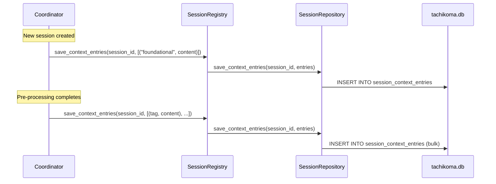
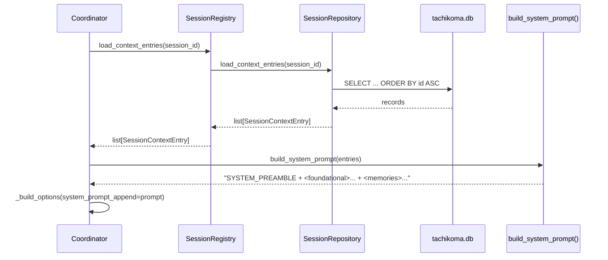
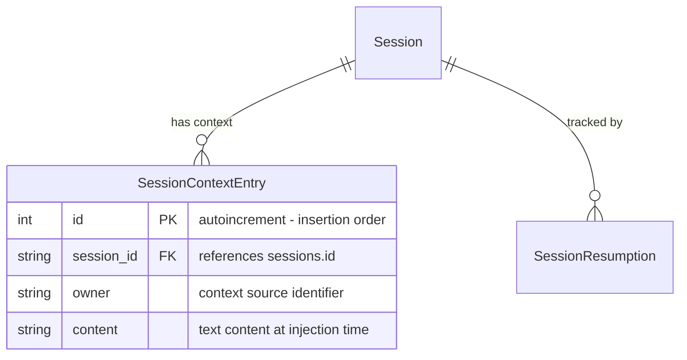

# Design: DLT-041 - Persist Session Context to Database

**Delta Spec**: [../delta-specs/DLT-041.md](../delta-specs/DLT-041.md)
**Status**: Draft

## Purpose

This document explains the design rationale for this delta: the modeling choices, data flow, system behavior, and architectural approach.

After implementation, the "Detected Impacts" section will guide reconciliation into feature design docs.

## Problem Context

Context injected into conversations is currently assembled in-memory and split across two injection paths: foundational context goes into the system prompt (via `SystemPromptPreset.append`), while pre-processing results are prepended to the user's message text (via `assemble_context()`). Neither path persists what the agent saw, so context is lost between per-message SDK client recreations, cannot be inspected or debugged, and forked sessions have no mechanism to inherit the parent session's context.

**Constraints:**
- Per-message SDK client creation (fresh `ClaudeSDKClient` each exchange, `resume` for continuity)
- Existing session tracking uses SQLAlchemy 2.0 async + aiosqlite (ADR-007)
- System prompt composition via `SystemPromptPreset.append` (ADR-008)
- Single-user, single-process deployment

**Interactions:**
- Coordinator: saves entries at lifecycle points, rebuilds system prompt from DB on each client creation
- Sessions: new model associated with `Session`, extends persistence layer
- Pre-processing pipeline: results consumed for persistence instead of message-text injection
- Post-processing pipeline: fork helpers gain optional context restoration
- Context loading: foundational file loading decoupled from `SYSTEM_PREAMBLE`

## Design Overview

A new `SessionContextEntry` model captures every piece of context injected into a session. The coordinator saves entries at each lifecycle point (session creation, pre-processing, boundary detection) and assembles the system prompt from persisted entries before every SDK client creation. A pure `build_system_prompt()` function in the context package replaces the current split injection paths.

```
┌──────────────────────────────────────────────────────────────┐
│                     Coordinator Layer                          │
│                                                                │
│  Session creation → save "foundational" entry                  │
│  Post pre-processing → save provider entries                   │
│  Boundary detection → save transition entries                  │
│  Before client creation → load entries → build prompt          │
│                                                                │
├───────────────────────────┬────────────────────────────────────┤
│  Context Assembly         │   Session Persistence              │
│  ┌─────────────────────┐  │  ┌──────────────────────────────┐ │
│  │build_system_prompt() │  │  │ SessionRegistry              │ │
│  │(context/assembly.py) │  │  │ save/load context entries    │ │
│  └─────────────────────┘  │  └──────────────┬───────────────┘ │
│                           │                 │                  │
│                           │  ┌──────────────▼───────────────┐ │
│                           │  │ SessionRepository            │ │
│                           │  │ context entry CRUD            │ │
│                           │  └──────────────┬───────────────┘ │
│                           │                 │                  │
│                           │  ┌──────────────▼───────────────┐ │
│                           │  │ session_context_entries table │ │
│                           │  └──────────────────────────────┘ │
└───────────────────────────┴────────────────────────────────────┘
```

## Shape

| Part | Mechanism | Flag |
|------|-----------|:----:|
| **S1** | `SessionContextEntry` frozen dataclass + `SessionContextEntryRecord` ORM model in `sessions/model.py` — autoincrement PK (insertion order = assembly order), FK to sessions, owner string, content text | |
| **S2** | Context entry persistence methods on existing `SessionRepository` — `save_context_entries(session_id, entries)` bulk save, `load_context_entries(session_id)` ordered by PK. Exposed through `SessionRegistry` facade | |
| **S3** | `build_system_prompt(entries)` pure function in `context/assembly.py` — prepends `SYSTEM_PREAMBLE`, wraps each entry in `<owner>` XML tags, concatenates. Returns `SYSTEM_PREAMBLE` alone when entries list is empty (graceful degradation fallback) | |
| **S4** | Coordinator saves entries inline at lifecycle points: foundational on session creation, provider results after pre-processing, transition context on boundary detection. Loads entries and calls `build_system_prompt()` before every `_build_options()`. Receives `foundational_context` instead of `system_prompt` | |
| **S5** | Pre-processing injection path removed — `assemble_context()` deleted, results no longer prepended to message text. Persisted via S4, assembled via S3 | |
| **S6** | Fork helpers (`fork_and_consume`, `fork_and_capture`) gain optional `system_prompt_append: str | None` param; when provided, set as `SystemPromptPreset(append=...)` on the fork's `ClaudeAgentOptions` | |
| **S7** | `session_context_entries` table migration — `Base.metadata.create_all()` handles new installs automatically; pragma-check in `Database._run_migrations()` as defense-in-depth for existing databases (consistent with `session_resumptions` pattern) | |

### Flagged Unknowns

None — all mechanisms use established patterns from the existing codebase.

## Components

### Implementation Structure

| Layer/Component | Responsibility | Key Decisions |
|-----------------|----------------|---------------|
| `src/tachikoma/sessions/model.py` | New `SessionContextEntry` dataclass + `SessionContextEntryRecord` ORM model | Autoincrement PK for insertion ordering; lives with session models (FK relationship) |
| `src/tachikoma/sessions/repository.py` | New `save_context_entries()` and `load_context_entries()` methods on `SessionRepository` | Bulk save via `session.add_all()`; load ordered by PK ascending |
| `src/tachikoma/sessions/registry.py` | Pass-through methods: `save_context_entries(session_id, entries)` and `load_context_entries(session_id)` on `SessionRegistry` | Maintains facade pattern; single `save_context_entries` always takes a list (no singular variant) |
| `src/tachikoma/sessions/__init__.py` | Re-exports `SessionContextEntry` | Extends public API |
| `src/tachikoma/context/assembly.py` | `build_system_prompt(entries)` pure function | Imports `SYSTEM_PREAMBLE` from `context.loading`; no DB dependency |
| `src/tachikoma/context/loading.py` | `load_context()` modified to return XML-wrapped files without `SYSTEM_PREAMBLE`; renamed to `load_foundational_context()`. `context_hook()` stores as `foundational_context` in extras | Decouples file loading from preamble |
| `src/tachikoma/context/__init__.py` | Updated exports: adds `build_system_prompt`, replaces `load_context` with `load_foundational_context` | |
| `src/tachikoma/coordinator.py` | Saves entries at lifecycle points; loads entries and assembles prompt before client creation | Replaces `system_prompt` param with `foundational_context`; removes `_previous_summary` and `_bridging_context` in-memory state |
| `src/tachikoma/pre_processing.py` | `assemble_context()` function removed | No longer needed — results persist to DB |
| `src/tachikoma/post_processing.py` | `fork_and_consume()` and `fork_and_capture()` gain optional `system_prompt_append` param | Optional; callers build the string |
| `src/tachikoma/database.py` | Migration for `session_context_entries` table in `_run_migrations()` | Pragma-check pattern consistent with DLT-027/028 |
| `src/tachikoma/__main__.py` | Passes `foundational_context` and wires updated coordinator constructor | Replaces `system_prompt` from extras |

### Cross-Layer Contracts

**Context entry save flow (coordinator → registry → repository → DB):**



**Context assembly flow (coordinator → registry → assembly):**



**Integration Points:**
- Coordinator → SessionRegistry: `save_context_entries(session_id, entries)` for saving (always takes a list — single entries wrapped by caller), `load_context_entries(session_id)` for loading
- Coordinator → `build_system_prompt()`: pure function call with loaded entries
- `fork_and_consume/capture` → `SystemPromptPreset`: optional `system_prompt_append` sets the append field on the fork's `ClaudeAgentOptions`
- `context_hook` → extras: stores `foundational_context` (replaces `system_prompt`)
- `__main__.py` → Coordinator: passes `foundational_context` instead of `system_prompt`

### Shared Logic

- **`build_system_prompt()`** (`context/assembly.py`): Shared between coordinator (normal message flow) and any caller that needs to restore context for forks. Pure function — no DB dependency.
- **`SessionContextEntry`** dataclass: Shared between repository (produces), coordinator (passes to save), and assembly function (consumes for build).

## Modeling

### Domain model



### SessionContextEntry dataclass (domain)

```
SessionContextEntry (frozen dataclass)
├── id: int                    (autoincrement PK, determines assembly order)
├── session_id: str            (FK → sessions.id)
├── owner: str                 (context source identifier)
└── content: str               (text content at time of injection)
```

### SessionContextEntryRecord (ORM)

```
SessionContextEntryRecord (DeclarativeBase)
├── __tablename__ = "session_context_entries"
├── id: Mapped[int]            (primary_key=True, autoincrement)
├── session_id: Mapped[str]    (ForeignKey("sessions.id"))
├── owner: Mapped[str]
├── content: Mapped[str]
└── index on session_id        (for load-by-session queries)
```

### Owner identifiers

| Owner | Source | When Created |
|-------|--------|--------------|
| `foundational` | SOUL.md + USER.md + AGENTS.md (XML-wrapped) | New session creation |
| `previous-summary` | Previous session's rolling summary | Topic shift (fresh session path) |
| `bridging-context` | Intermediate session summaries | Session resumption |
| `memories` | `MemoryContextProvider` | Pre-processing (first message of new session) |
| `projects` | `ProjectsContextProvider` | Pre-processing (first message of new session) |
| `skills` | `SkillsContextProvider` | Pre-processing (first message of new session) |

## Data Flow

### New session — first message

```
1. Coordinator creates session via registry → has session_id
2. Save "foundational" entry (loaded by context_hook via load_foundational_context(),
   stored in ctx.extras["foundational_context"], passed to coordinator at startup)
   - If foundational_context is None/empty → no entry saved
3. Pre-processing pipeline runs in parallel (memories, projects, skills providers)
4. For each successful ContextResult → save entry with owner=result.tag, content=result.content
   - Failed/None results → no entry saved
5. MCP servers and agents still extracted from results in-memory (not persisted)
6. Load entries via registry → list[SessionContextEntry] ordered by id ASC
7. build_system_prompt(entries) → SYSTEM_PREAMBLE + XML-wrapped entries
8. _build_options(system_prompt_append=prompt) → SystemPromptPreset
9. Create fresh ClaudeSDKClient, process message
```

### Topic shift — fresh session

```
1. Boundary detection identifies topic shift (no resume target)
2. _handle_transition() closes old session, fires post-processing
3. Creates new session via registry → has new session_id
4. Save "previous-summary" entry for new session
   (content includes "# Previous Conversation" header text)
5. Back in send_message(): save "foundational" entry, run pre-processing, save provider entries
6. Load all entries → build system prompt
   (includes previous-summary + foundational + provider entries)
7. Proceed with client creation
```

### Session resumption

```
1. Boundary detection identifies resume target
2. _handle_transition() closes current session, reopens target session
3. Save "bridging-context" entry for resumed session
   (content includes "# Resumed Conversation" header text)
4. Back in send_message(): is_new_session=False → skip foundational and pre-processing
5. Load all entries for resumed session → build system prompt
   (original foundational + provider entries still in DB, plus new bridging-context)
6. Proceed with client creation (resume=sdk_session_id of resumed session)
```

### Subsequent message (same session)

```
1. Coordinator receives message, session exists
2. No entry saves (foundational/pre-processing/transition only on first message)
3. Load entries from DB for current session → build system prompt
4. _build_options(resume=sdk_session_id, system_prompt_append=prompt)
5. Proceed with client creation
```

### Fork with context restoration (opt-in)

```
1. Caller loads entries via registry.load_context_entries(session.id)
2. Calls build_system_prompt(entries) → system_prompt_append string
3. Calls fork_and_consume(session, prompt, agent_defaults,
     system_prompt_append=system_prompt_append)
4. fork_and_consume sets SystemPromptPreset(append=...) on ClaudeAgentOptions
5. Forked agent receives full session context in its system prompt
```

## Key Decisions

### Insertion-order assembly (no priority map)

**Choice**: Entries are assembled in PK order (autoincrement), which reflects insertion order. The coordinator saves entries in the correct sequence.
**Why**: The processing pipeline naturally produces context in the right order (foundational first, then transition, then providers). A priority map would duplicate this ordering as a second source of truth.
**Alternatives Considered**:
- Fixed priority map per owner: More explicit but creates a redundant ordering mechanism that must stay in sync with save logic
- Explicit position column: Flexible but adds write-time complexity for no current benefit

**Consequences**:
- Pro: Single source of ordering truth (save order)
- Pro: Simpler model (no priority/position field)
- Con: Correctness depends on the coordinator saving in the right sequence — enforced by code structure, not data constraint

### Assembly logic in context/ package

**Choice**: `build_system_prompt()` lives in `context/assembly.py`
**Why**: The context package already owns context loading and the `SYSTEM_PREAMBLE` constant. Assembly is a context concern. The function is also used by fork helpers outside the sessions package.
**Alternatives Considered**:
- Sessions package: Context entries are session-associated, but assembly is a context operation
- Standalone coordinator-level module: Coordinator orchestrates but doesn't own context logic

**Consequences**:
- Pro: Context logic stays together (loading, preamble, assembly)
- Pro: Clean import direction (context imports from sessions, not vice versa)
- Con: Cross-package dependency (context → sessions for the `SessionContextEntry` dataclass)

### Context entries on existing SessionRepository

**Choice**: Add `save_context_entries()` and `load_context_entries()` to the existing `SessionRepository` rather than creating a separate repository.
**Why**: `SessionRepository` already handles `SessionRecord` and `SessionResumptionRecord`. Context entries have the same lifecycle (session-scoped, FK to sessions). The existing pattern is one repo for all session-related tables.
**Alternatives Considered**:
- Separate `SessionContextRepository`: Cleaner SRP but adds a class and session_factory threading for no practical benefit

**Consequences**:
- Pro: Consistent with existing pattern
- Pro: No new classes to wire up in bootstrap
- Con: `SessionRepository` grows (but remains focused on session-related persistence)

### Transition context persists for session lifetime

**Choice**: `previous-summary` and `bridging-context` entries persist in the DB and appear in every subsequent message's system prompt (not just the first message).
**Why**: With DB-driven assembly, all entries for a session are loaded on every client creation. Excluding transition entries after the first message would require tracking "consumed" state. The transition context remains relevant throughout the session — the agent benefits from knowing the conversation's origin.
**Alternatives Considered**:
- Mark entries as "consumed" after first load: Adds a column and query complexity for marginal benefit
- Delete entries after first message: Loses the content integrity guarantee (R8)

**Consequences**:
- Pro: Simpler assembly (no consumed/unconsumed distinction)
- Pro: Agent retains full context throughout session
- Pro: Content always available for inspection (R6)
- Con: Slight increase in system prompt size for subsequent messages (transition context is typically short)
- Note: This is a deliberate improvement over the current implementation, which discards transition context after the first message. The spec does not constrain transition context lifetime, so persistence is a design choice that benefits the agent's awareness throughout the session

### Fork context restoration via pre-built string

**Choice**: Fork helpers accept `system_prompt_append: str | None` — callers build the string, fork helpers just set it on options.
**Why**: Keeps fork helpers simple (no DB dependency). Callers that want context restoration already have access to the registry and assembly function.
**Alternatives Considered**:
- Fork helpers accept session_factory + session_id: Couples fork helpers to the database
- New `ContextAwareForker` class: Over-abstraction for a simple parameter pass

**Consequences**:
- Pro: Fork helpers stay simple (no DB imports)
- Pro: Caller has full control over what context to include
- Con: Caller must coordinate load + build (two calls)

### Coordinator uses registry (not session_factory directly)

**Choice**: The coordinator calls context entry methods on `SessionRegistry` (which delegates to `SessionRepository`), rather than receiving a `session_factory` and operating on the DB directly.
**Why**: The coordinator already has the registry dependency. Adding `session_factory` would create a second persistence path. The registry facade pattern is established for all session-related operations.
**Alternatives Considered**:
- Pass `session_factory` to coordinator: Direct DB access bypasses the registry facade
- Dedicated context service: Over-abstraction when the registry already exists as the facade

**Consequences**:
- Pro: Single persistence path through registry
- Pro: No new dependencies on coordinator constructor
- Con: Registry gets pass-through methods (but they're trivial)

## System Behavior

### Scenario: First message creates session with full context

**Given**: No active session, foundational context loaded, 3 pre-processing providers
**When**: The coordinator receives the first message
**Then**: Session created, "foundational" entry saved, pre-processing runs, up to 3 provider entries saved. System prompt assembled from all entries.
**Rationale**: Entries are saved before assembly, ensuring the DB is the source of truth.

### Scenario: Pre-processing provider fails

**Given**: A new session with 3 registered providers
**When**: `MemoryContextProvider` fails but `ProjectsContextProvider` and `SkillsContextProvider` succeed
**Then**: Two entries saved (projects, skills). No memories entry created. System prompt contains foundational + projects + skills. Error logged per DES-002.
**Rationale**: Error isolation — one provider's failure doesn't block others (existing pipeline behavior).

### Scenario: Context entry save fails

**Given**: A new session with foundational context
**When**: Saving the foundational entry fails (DB error)
**Then**: Error logged. Pre-processing continues. Assembly builds from whatever entries were saved. If no entries, system prompt is `SYSTEM_PREAMBLE` only.
**Rationale**: Context persistence failures must not interrupt conversations (R7, consistent with session tracking pattern).

### Scenario: Context loading fails during assembly

**Given**: A session with persisted entries
**When**: Loading entries from DB fails
**Then**: Error logged. System prompt falls back to `SYSTEM_PREAMBLE` only. Conversation continues with reduced context.
**Rationale**: Graceful degradation (R7) — agent can still function without dynamic context.

### Scenario: Subsequent message rebuilds from DB

**Given**: A session with persisted entries (foundational + 3 providers)
**When**: The second message arrives
**Then**: Entries loaded from DB. Same system prompt assembled (deterministic, R2). No new entries saved.
**Rationale**: DB is source of truth; per-message client creation rebuilds from persisted state (R3).

### Scenario: Topic shift with previous summary

**Given**: Active session with summary "Discussing project setup"
**When**: Boundary detection identifies topic shift (no resume target)
**Then**: Old session closed. New session created. "previous-summary" entry saved with wrapped summary. Foundational and provider entries saved after pre-processing. System prompt includes all entries.
**Rationale**: Transition context persisted for the new session's lifetime.

### Scenario: Session resumption with bridging context

**Given**: A closed session being resumed with intermediate sessions
**When**: `_handle_transition()` reopens the target session
**Then**: "bridging-context" entry saved for resumed session. No new foundational or provider entries (originals still in DB). System prompt includes original entries + bridging context.
**Rationale**: Resumed sessions inherit their original context and gain awareness of intermediate conversations.

### Scenario: Fork with context restoration

**Given**: A completed session with persisted entries
**When**: A processor loads entries and calls `fork_and_consume()` with `system_prompt_append`
**Then**: Forked agent receives the parent session's full context via `SystemPromptPreset(append=...)`.
**Rationale**: Opt-in context restoration (R5) for forks that need to understand session context.

### Scenario: Fork without context restoration (default)

**Given**: A completed session
**When**: A processor calls `fork_and_consume()` without `system_prompt_append`
**Then**: Behavior unchanged — forked agent has no system prompt context (only conversation history via resume).
**Rationale**: Default behavior preserved; context restoration is opt-in.

### Scenario: All foundational files missing

**Given**: All context files (SOUL.md, USER.md, AGENTS.md) missing or empty
**When**: A new session starts
**Then**: No "foundational" entry created. System prompt contains `SYSTEM_PREAMBLE` + whatever provider entries are saved.
**Rationale**: Matches existing behavior where missing files are skipped silently.

### Scenario: Querying entries for debugging

**Given**: A session ID
**When**: Entries are queried via `load_context_entries(session_id)`
**Then**: All entries for that session returned in insertion order. Empty list if no entries exist.
**Rationale**: Supports R6 (queryable for inspection and debugging).

## Open Questions

None — all design decisions resolved.

---

## Detected Impacts

### Affected Feature Designs
- **docs/feature-designs/agent/sessions.md** — Adds: `SessionContextEntry` model, `SessionContextEntryRecord` ORM, repository methods (`save_context_entries`, `load_context_entries`), registry pass-through methods
- **docs/feature-designs/agent/core-architecture.md** — Modifies: coordinator constructor (`system_prompt` → `foundational_context`), `_build_options()` simplification (receives pre-built `system_prompt_append`), inline context saving in `send_message()` and `_handle_transition()`, removal of `_previous_summary`/`_bridging_context` in-memory state, startup flow (`context_hook` stores `foundational_context`)
- **docs/feature-designs/agent/pre-processing-pipeline.md** — Modifies: `assemble_context()` function removed; pipeline results consumed by coordinator for DB persistence and system prompt assembly instead of message-text injection
- **docs/feature-designs/agent/post-processing-pipeline.md** — Modifies: `fork_and_consume()` and `fork_and_capture()` gain optional `system_prompt_append` parameter for context restoration
- **docs/feature-designs/agent/boundary-detection.md** — Modifies: transition context (`previous-summary`, `bridging-context`) now persisted as DB entries instead of held as coordinator in-memory state

### Notes for Reconciliation
- Sessions design needs new `SessionContextEntry` model, repository methods, and registry pass-throughs
- Core architecture design needs updated coordinator state (remove `_previous_summary`/`_bridging_context`, add `_foundational_context`), updated `_build_options()` signature, new inline save steps in `send_message()` and `_handle_transition()`, updated startup flow
- Pre-processing design should note `assemble_context()` is removed; results consumed by coordinator for persistence
- Post-processing design should document new `system_prompt_append` parameter on fork helpers
- Boundary detection design should note transition context persistence change
- Context loading section needs `load_foundational_context()` function and updated `context_hook` behavior

## Notes

- The `SYSTEM_PREAMBLE` is static code, always prepended by `build_system_prompt()` but never persisted as an entry (per spec scope exclusion)
- Non-text artifacts from pre-processing (MCP servers, agent definitions) remain in-memory — the database tracks prompt content only
- The `build_system_prompt()` pure function enables straightforward unit testing without DB fixtures
- Entry owners map directly to `ContextResult.tag` for pre-processing providers, ensuring consistency
- Existing `PromptDrivenProcessor` subclasses remain unchanged — fork context restoration opt-in happens in future deltas as needed, not as part of this delta
