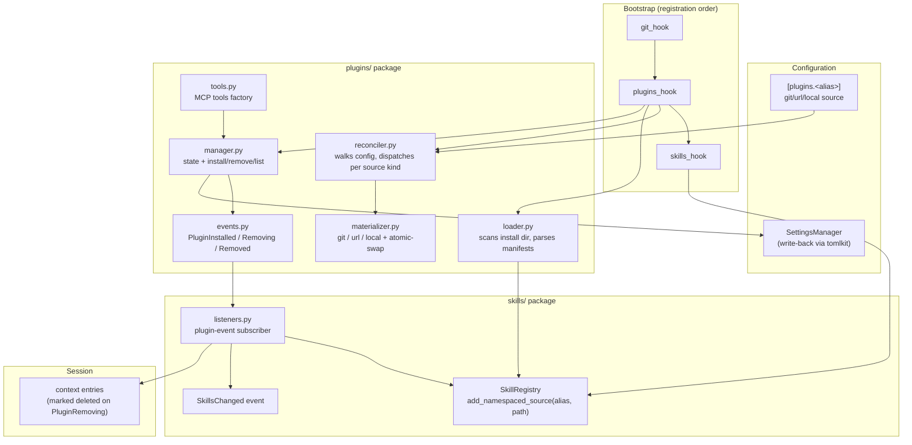
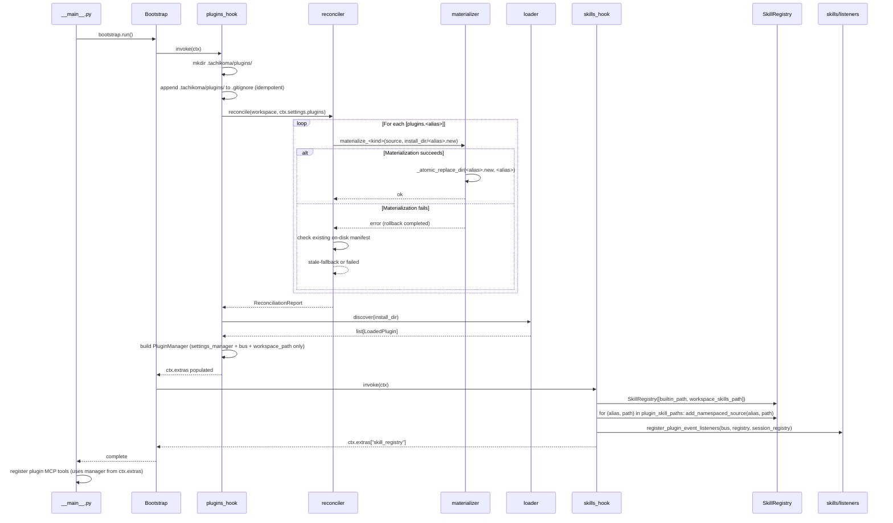

# Design: DLT-048 - Plugin system with install, discovery, and loading

**Delta Spec**: [../delta-specs/DLT-048.md](../delta-specs/DLT-048.md)
**Status**: Draft

## Purpose

This document explains the design rationale for DLT-048: how the plugin system is modeled and integrated, how plugin sources are materialized and reconciled across three source variants (git, url, local), how the plugin loader hands off skill paths to the existing skills subsystem, how the namespacing model preserves isolation between plugin sources, and how event-based decoupling keeps the plugin manager and the skills subsystem cleanly separated.

After implementation, the "Detected Impacts" section will guide reconciliation into feature design docs (`docs/feature-designs/agent/skills.md`, `docs/feature-designs/agent/workspace-bootstrap.md`, `docs/feature-designs/configuration/config-system.md`, and a new `docs/feature-designs/plugins/`).

## Problem Context

Tachikoma is a personal assistant whose capabilities live in two layers — a core agent runtime and a per-workspace `skills/` directory the user authors by hand. To grow the ecosystem without forcing every contribution through core, the assistant needs an extension surface that lets third-party plugins ship reusable skills declared in config, materialized at startup from a configured source, and registered into the existing `SkillRegistry` without colliding with built-in or workspace skills.

**Constraints:**
- **Reuse, don't parallel.** Plugin skills must flow into the same `SkillRegistry` consumed by the per-message classifier and the coordinator's agent derivation; building a parallel skill path would duplicate behavior the skills feature spec already documents (R5–R7, R23, R26–R27, R32–R33).
- **Skills only.** This delta is intentionally narrow — plugins contributing MCP tool servers, slash commands, context providers, post-processors, secondary channels, and boundary hooks are deferred (DLT-049–051, DLT-053). CC plugins that declare those surfaces install successfully, but their non-skill contributions are silently ignored with one INFO log per skipped contribution type per plugin.
- **Fail-safe.** A broken plugin (unreachable source, malformed manifest, missing skill directory) must never block startup or affect other plugins. Per-plugin failure isolation applies in materialization, discovery, manifest parsing, and registry registration.
- **CC compatibility for ecosystem leverage.** Plugins shaped as Claude Code plugins (`.claude-plugin/plugin.json`) are recognized so Tachikoma can install them as-is and benefit from the existing CC plugin community.
- **Atomic on-disk state.** The install directory is regenerable from config — but mid-write failures during reconciliation must not leave a half-replaced plugin folder; the prior valid copy must remain intact. The atomic-swap idiom must work for non-empty directories on POSIX.
- **No new long-lived dependencies.** The codebase already shells out to `git` for sync and uses `tomlkit` for write-back. The plugin system reuses both rather than adding GitPython, dulwich, or similar.

**Interactions:**
- **`SkillRegistry`** ([skills.md design](../feature-designs/agent/skills.md)) — gains `add_namespaced_source(alias, path)`; `_skills` keys become qualified (`<alias>:<name>` for plugin skills, bare for default-namespace); `Skill` gains `namespace: str | None` and a `qualified_name` property.
- **Bootstrap** ([workspace-bootstrap.md design](../feature-designs/agent/workspace-bootstrap.md)) — a new `plugins_hook` registers between `git_hook` and `skills_hook`. It materializes sources, runs discovery, instantiates the `PluginManager`, exposes both via `ctx.extras`, and appends `.tachikoma/plugins/` to workspace `.gitignore`.
- **Configuration** ([config-system.md design](../feature-designs/configuration/config-system.md)) — adds a top-level `plugins: dict[str, PluginSource] = {}` Pydantic field with a discriminated-union element type. The `SettingsManager` gains a sub-table write helper (`update_plugin_entry(alias, source)` / `remove_plugin_entry(alias)`) so install/remove can mutate `[plugins.<alias>]` while preserving comments.
- **Event bus** (ADR-009) — three new events: `PluginInstalled`, `PluginRemoving`, `PluginRemoved`. The skills module subscribes and translates them into `add_namespaced_source` / `remove_namespaced_source` calls + `SkillsChanged` dispatch + active-session entry-marking. The plugin manager itself has no skill registry coupling.
- **Sessions** ([sessions.md design](../feature-designs/agent/sessions.md)) — on `PluginRemoving`, an active session's already-injected plugin skill entries get a removal-notice prepended to their `content` and `metadata["deleted"] = True` set; this leverages the session registry's existing entry-update path.

## Design Overview

The plugin system is a self-contained `tachikoma/plugins/` package whose components map cleanly onto the existing subsystem pattern (bootstrap hook, manager class, event types, MCP tool factory). It plugs into the `SkillRegistry` at exactly one point — `add_namespaced_source(alias, path)` — and otherwise communicates outward via three typed events on the project's `bubus` event bus.

A bootstrap hook (`plugins_hook`) runs between `git_hook` and `skills_hook` to materialize each declared `[plugins.<alias>]` entry from its configured source — a shallow git clone, an HTTPS archive download + extraction, or a local-path copy — and then runs manifest discovery to build a list of `LoadedPlugin` records. The hook constructs a `PluginManager` (the runtime owner of plugin state and install/remove operations) and stashes both the manager and the discovered skill-source list in `ctx.extras` for the skills hook to consume.



The MCP tool factory (`install_plugin` / `list_plugins` / `remove_plugin`) closes over the manager and is registered as an MCP server in `__main__.py` alongside the tasks tool server. Concurrency between install/remove operations and any in-flight reconciliation is serialized by a single `asyncio.Lock` owned by the manager — coarse-grained, matching the project's existing pattern in `MessagePostProcessingPipeline`.

The skills subsystem listens for plugin events via a subscriber registered in `skills_hook`. On `PluginInstalled` and `PluginRemoved`, the listener calls `registry.mark_dirty()` and dispatches its own `SkillsChanged` event — keeping ownership of "skill registry needs refresh" inside the skills module. On `PluginRemoving` (fired before directory deletion so paths still exist), the listener walks the active session's context entries, prepends a removal-notice line to entries whose `metadata["skill_name"]` matches one of the removed plugin's namespaced skills, and sets `metadata["deleted"] = True`.

## Shape

| Part | Mechanism | Flag |
|------|-----------|:----:|
| **S1** | `[plugins.<alias>]` Pydantic discriminated-union schema in `config.py`. Three variants: `GitPluginSource` (`git` URL or `gh:owner/repo` / `github:owner/repo` shorthand expanded by field-validator + optional `subdir` + required `ref`; SHA-shaped refs rejected at validation), `UrlPluginSource` (`url` HTTPS-only + recognized archive extension `.tar.gz`/`.tgz`/`.zip` + optional `subdir`), `LocalPluginSource` (absolute `path`). Discriminated by which of `git`/`url`/`path` is present; a Pydantic root validator enforces mutual exclusion. Top-level field `plugins: dict[str, PluginSource] = {}`. Alias regex `[a-z0-9][a-z0-9-]*` enforced via the dict-key-validator pattern. | |
| **S2** | Plugin manifest parser (`plugins/manifest.py`): Pydantic `TachikomaManifest` for `tachikoma-plugin.toml` (fields: `name`, `version?`, `description`, `skills: list[str] = []`) and `CcManifest` for `.claude-plugin/plugin.json` (only `name` required per the [CC reference](https://code.claude.com/docs/en/plugins-reference); `skills` accepts a path string overriding default discovery). Unified into an internal `PluginManifest` dataclass holding metadata + resolved skill directory paths. Native takes precedence; CC non-skill contributions silently ignored with one INFO log per type per plugin. | |
| **S3** | Source materializer (`plugins/materializer.py`): three async functions (`materialize_git`, `materialize_url`, `materialize_local`) sharing one atomic-swap helper `_atomic_replace_dir(new, dst)` that does `os.rename(dst, dst.old)` → `os.rename(new, dst)` → `shutil.rmtree(dst.old, ignore_errors=True)` with rollback on failure (the [pip-style pattern](https://github.com/pypa/pip/blob/main/src/pip/_internal/utils/misc.py)). Git path runs `git clone --depth 1 --branch <ref> <git_url> <tmp>` via the existing `tachikoma.git.sync.run_git()` helper. URL path streams the archive with stdlib `urllib.request.urlopen`, writes to a tempfile, extracts via `tarfile`/`zipfile`, auto-strips a single leading directory if the extracted root contains exactly one item, drills into `subdir` if specified. Local path uses `shutil.copytree`. All three feed a sibling `<dst>.new` directory before the swap. | |
| **S4** | Plugin reconciliation (`plugins/reconciler.py`): walks `[plugins]` config; dispatches to S3 by source kind; on materialization failure, retains an existing copy if its on-disk manifest's `name` (or alias-key match for non-Tachikoma manifests) matches the configured alias and emits status `stale-fallback`, otherwise `failed`. Removes orphan directories not declared in config. Returns a `ReconciliationReport` dataclass listing per-alias outcome, status, and diagnostic. Per-plugin failure isolation via try/except around each entry. | |
| **S5** | Plugin discovery (`plugins/loader.py`): scans `.tachikoma/plugins/` after reconciliation, parses each plugin's manifest via S2, validates structure (every declared skill directory must exist on disk; missing dirs WARN and are excluded but the plugin still loads if at least one valid dir remains), and produces a list of `LoadedPlugin` records (alias, manifest, status, diagnostic, contributed-skill paths). | |
| **S6** | Plugins bootstrap hook (`plugins/hooks.py`): registered in `__main__.py` between `git_hook` and `skills_hook`. (1) Creates `.tachikoma/plugins/` (`mkdir(parents=True, exist_ok=True)`); (2) appends `.tachikoma/plugins/\n` to workspace `.gitignore` idempotently using the `git/hooks.py:_append_missing_entries` pattern; (3) reconciles + discovers (S4 + S5); (4) constructs the `PluginManager` (S8); (5) stores `ctx.extras["plugin_manager"]` and `ctx.extras["plugin_skill_paths"] = list[(alias, skills_dir_path)]` for the skills hook to consume. | |
| **S7** | `SkillRegistry` namespacing extension. Two new methods: `add_namespaced_source(alias: str, path: Path)` reuses the `_load_skill` flow but threads `alias` through, constructing each `Skill` with `namespace=alias`; `remove_namespaced_source(alias: str)` removes from `_skill_sources` every path that was added under `alias`, deletes from `_skills` every entry whose `namespace == alias`, deletes the corresponding agents from `_agents`, and clears `_chain_cache`. Storage: `_skills` dict key is `Skill.qualified_name` — `f"{alias}:{name}"` for plugin skills, bare `name` for default-namespace. `Skill` dataclass gains `namespace: str \| None = None` and a `qualified_name` property. Agents stored as `f"{qualified_name}/{agent_name}"`. To support `remove_namespaced_source`, the registry tracks `_namespaced_source_paths: dict[str, list[Path]]` (alias → paths added under that alias). The skills hook iterates `ctx.extras["plugin_skill_paths"]` and calls `add_namespaced_source` per entry after default sources are loaded; runtime install/remove invoke these methods only via the plugin-event listener (S11). | |
| **S8** | `PluginManager` class (`plugins/manager.py`): in-memory `dict[alias, LoadedPlugin]`; methods `list()`, `install(source: PluginSource, alias: str \| None = None)`, `remove(alias: str)`. Receives `SettingsManager`, `EventBus`, `workspace_path`. Does NOT depend on `SkillRegistry` or `session_registry` — those are handled by the plugin-event listener (S11), preserving the Q7 decoupling boundary. Single `asyncio.Lock` serializes install/remove (they mutate both the install directory and the config file). Install: materialize source to a temp directory → parse manifest → resolve alias (explicit arg > manifest.name) → check alias collision against current config → atomic-move temp into `.tachikoma/plugins/<alias>/` → write `[plugins.<alias>]` config entry via `SettingsManager` → store `LoadedPlugin` in `_loaded` → dispatch `PluginInstalled` (listener registers skills). Remove: dispatch `PluginRemoving(alias, namespaced_skill_names)` (listener marks active session entries deleted) → drop config entry via `SettingsManager` → atomic-rmtree `.tachikoma/plugins/<alias>/` (on rmtree failure, log + record diagnostic in tool response, still clear `_loaded[alias]` and continue — config is source of truth, orphan cleaned by next reconcile per AC-MCP-REM-3) → `del self._loaded[alias]` → dispatch `PluginRemoved` (listener removes skills from registry). | |
| **S9** | Plugin MCP tools server (`plugins/tools.py`): factory `create_plugin_tools_server(manager: PluginManager) -> McpSdkServerConfig` mirroring `tasks/tools.py`. Three tools (`install_plugin`, `list_plugins`, `remove_plugin`) defined as inner `@tool()` functions closing over `manager`. Pydantic input arg models (`InstallPluginArgs`, `RemovePluginArgs`); standard `{"is_error": True/False, "content": [...]}` response shape. Errors include the manager's diagnostic message. Tool server registered in `__main__.py` alongside `task_tools_server`. | |
| **S10** | `.gitignore` registration: implemented inside S6's hook, appending `.tachikoma/plugins/\n` via `git/hooks.py:_append_missing_entries` (the only existing hook that mutates `.gitignore`). Idempotent — the helper checks for exact-line presence before appending. | |
| **S11** | Plugin events (`plugins/events.py`): three `bubus` `BaseEvent` subclasses — `PluginInstalled` (carries `alias`, `LoadedPlugin`), `PluginRemoving` (carries `alias`, `list[str]` of namespaced skill names; fired before directory deletion so subscribers can resolve still-valid paths), `PluginRemoved` (carries `alias`). Skills module subscribes via `skills/listeners.py` registered inside `skills_hook` (the listener has registry + session_registry + bus references). Listener responsibilities: on `PluginInstalled` → call `registry.add_namespaced_source(alias, skills_path)` for each skills directory in `event.plugin.manifest.skill_dirs`, then `bus.dispatch(SkillsChanged())`. On `PluginRemoving` → call `_mark_session_entries_deleted(alias, skill_names)` which queries the active session's context entries via `session_registry`, finds entries with `metadata["skill_name"] in skill_names`, prepends a removal-notice line to entry `content` (`**[Plugin removed: '{alias}'. Files under .tachikoma/plugins/{alias}/ may no longer be available on disk.]**\n\n`), and sets `metadata["deleted"] = True` — registry untouched at this stage (paths still on disk). On `PluginRemoved` → call `registry.remove_namespaced_source(alias)`, then `bus.dispatch(SkillsChanged())`. The listener does NOT call `registry.mark_dirty()` because `add_namespaced_source` and `remove_namespaced_source` already update `_skills` synchronously — `mark_dirty` is the filesystem-watcher path's mechanism and is redundant here. | |
| **S12** | Failure isolation infrastructure: per-plugin `try/except` boundaries in S2 (manifest parse), S3 (materialize), S5 (discover), S7 (registry register). Structured logging via `_log = logger.bind(component="plugins")` with per-call `_log.bind(plugin=alias)` to tag every log line with the offending alias. Errors recorded against the plugin's `LoadedPlugin.diagnostic` field where applicable so the `list_plugins` MCP tool surfaces them to the agent. | |
| **S13** | Skill dependency resolution semantics for plugin skills (resolves the spec's S12-flagged unknown). Bare `dep` resolves only in default namespace (built-in + workspace) via `self._skills.get(dep)`; `:dep` (leading-colon sentinel meaning "this plugin") resolves within the resolving skill's own plugin namespace via `self._skills.get(f"{anchor.namespace}:{dep}")` (anchor's namespace is known because `resolve_chain` is called with a known anchor `Skill`); `<other>:dep` resolves within the named plugin namespace via `self._skills.get(f"<other>:{dep}")`. Plugin authors cannot reference sibling plugin skills via bare names — they must use `:dep`. `_validate_deps` walks all skills; for plugin skills, `:`-prefixed deps are checked against the skill's own namespace, qualified deps against the cross-namespace, bare deps against default namespace. The DFS in `resolve_chain` uses `current_skill.namespace` to expand `:`-prefixed entries before lookup. | |

(All S-parts are mechanisms — no remaining flagged unknowns.)

### Coverage check (R → Shape)

| Requirement | Shape parts addressing it |
|---|---|
| R0 | All (the system as a whole) |
| R1 | S1 |
| R2 | S3, S4, S6 |
| R3 | S2 |
| R4 | S2 |
| R5 | S7 |
| R6 | S1 (alias regex + sub-table key), S8 (install_plugin alias arg), S9 (tool surface) |
| R7 | S2, S5, S12 |
| R8 | S4 |
| R9 | S3, S4, S5, S7, S12 |
| R10 | S8, S9 |
| R11 | S8, S9 |
| R12 | S8, S9, S11 (live entry-marking on Remove) |
| R13 | S6, S10 |
| R14 (out of scope) | — confirmed not addressed |

Every requirement maps to at least one shape part; every shape part traces to at least one requirement.

## Components

### Implementation Structure

| Layer/Component | Responsibility | Key Decisions |
|-----------------|----------------|---------------|
| `src/tachikoma/plugins/__init__.py` | Re-exports `PluginManager`, `LoadedPlugin`, `PluginManifest`, `PluginSource`, `PluginInstalled`, `PluginRemoving`, `PluginRemoved`, `plugins_hook`, `create_plugin_tools_server` | Package module mirroring `tachikoma/skills/__init__.py` |
| `src/tachikoma/plugins/sources.py` | Pydantic source models: `GitPluginSource`, `UrlPluginSource`, `LocalPluginSource`, `PluginSource = GitPluginSource \| UrlPluginSource \| LocalPluginSource` (discriminated union); root validator on the wrapping container enforces mutual exclusion of `git`/`url`/`path` fields | Lives alongside but separately from `config.py` to keep the config module from accumulating plugin-specific validators; `config.py` imports `PluginSource` for the top-level `plugins` field |
| `src/tachikoma/plugins/manifest.py` | Pydantic `TachikomaManifest` and `CcManifest`; `parse_manifest(plugin_dir: Path) -> PluginManifest \| None` with native-takes-precedence logic; `PluginManifest` dataclass unifying both formats | Native manifest validation strict (description required, skills paths must be relative); CC manifest tolerant (only `name` required per the [CC reference](https://code.claude.com/docs/en/plugins-reference)); non-skill CC contributions logged at INFO and dropped |
| `src/tachikoma/plugins/materializer.py` | `materialize_git(source, dst)`, `materialize_url(source, dst)`, `materialize_local(source, dst)` async functions; private `_atomic_replace_dir(new, dst)` helper | Stdlib only — `urllib.request`, `tarfile`, `zipfile`, `shutil`, `os`. Git path delegates to existing `tachikoma.git.sync.run_git()` (no GitPython/dulwich/pygit2). Atomic-swap follows the pip pattern (verified by [WebFetch / pip source](https://github.com/pypa/pip/blob/main/src/pip/_internal/utils/misc.py)) — `os.replace` does NOT work for non-empty directories per the [Python 3.12 docs](https://docs.python.org/3.12/library/os.html#os.replace) |
| `src/tachikoma/plugins/reconciler.py` | `reconcile(workspace_path, plugins_config) -> ReconciliationReport`; per-entry try/except; orphan removal | Always-on re-materialization (matches spec R2); orphan detection via `set(install_dir_subdirs) - set(plugins_config.keys())`; stale-fallback decision uses on-disk manifest's `name` matched against alias |
| `src/tachikoma/plugins/loader.py` | `discover(plugins_dir) -> list[LoadedPlugin]`; reads each subdir's manifest via `manifest.parse_manifest`; validates skill directory existence | Loader runs after reconciler; failure of one plugin's manifest does not affect others |
| `src/tachikoma/plugins/manager.py` | `PluginManager` class with `list()`, `install()`, `remove()`; owns `asyncio.Lock`; depends only on `SettingsManager`, `EventBus`, `workspace_path` | Single class, not split into submodules — matches the project's tasks subsystem pattern. Lock granularity is per-manager (one lock for both install and remove); coarse-grained matches `MessagePostProcessingPipeline` precedent. Manager does NOT touch the skill registry directly — that work is delegated to the plugin-event listener per Q7 |
| `src/tachikoma/plugins/hooks.py` | `plugins_hook(ctx)`: directory creation + `.gitignore` registration + reconcile + discover + manager construction; writes `ctx.extras["plugin_manager"]` and `ctx.extras["plugin_skill_paths"]` | Follows DES-003 (subsystem-owned bootstrap hooks); registered in `__main__.py` between `git_hook` and `skills_hook` |
| `src/tachikoma/plugins/events.py` | `PluginInstalled`, `PluginRemoving`, `PluginRemoved` `BaseEvent` subclasses | Follows ADR-009 (bubus event bus); typed payloads; `PluginRemoving` deliberately fires before directory deletion so subscribers see paths still on disk |
| `src/tachikoma/plugins/tools.py` | `create_plugin_tools_server(manager) -> McpSdkServerConfig`; three closure-captured `@tool()` functions | Matches `tasks/tools.py` factory pattern (DES-006); Pydantic args, standard error envelope. Tool server registered in `__main__.py` alongside `task_tools_server` |
| `src/tachikoma/skills/listeners.py` | `register_plugin_event_listeners(bus, registry, session_registry)`: subscribes to all three plugin events; on `PluginInstalled` calls `registry.add_namespaced_source` and dispatches `SkillsChanged`; on `PluginRemoving` marks active-session entries deleted (registry untouched while paths still on disk); on `PluginRemoved` calls `registry.remove_namespaced_source` and dispatches `SkillsChanged` | Lives in skills module (per Q7 decoupling decision); registered inside `skills_hook` after listener has registry/session_registry/bus available. Owns ALL skill-registry mutation triggered by plugin events — manager never calls registry directly |
| `src/tachikoma/skills/registry.py` (extension) | New `add_namespaced_source(alias, path)` and `remove_namespaced_source(alias)` methods; `Skill` gains `namespace: str \| None = None` and `qualified_name` property; `_skills` keys become qualified; new `_namespaced_source_paths: dict[str, list[Path]]` tracks paths added per alias for the remove path; `_load_skill` accepts optional `namespace` param; `resolve_chain` and `_validate_deps` updated for the dep-resolution rule (S13) | Minimal-change extension — core `_discover` / `_load_skill` flow unchanged for default-namespace skills; namespacing applied only on the new entrypoints and dep resolution. `remove_namespaced_source` keeps `_skill_sources` from growing monotonically across install/remove cycles |
| `src/tachikoma/config.py` (extension) | Top-level `plugins: dict[str, PluginSource] = {}` field on `Settings`; new `SettingsManager.update_plugin_entry(alias, source)` and `remove_plugin_entry(alias)` methods that operate on `tomlkit.table(is_super_table=True)` for the `[plugins]` parent and `tomlkit.table()` for each `[plugins.<alias>]` sub-table | tomlkit super-table pattern verified by [Context7 docs](https://github.com/python-poetry/tomlkit) (v0.13.3, 2025-06-10); existing `update()` only handles single-level sections — adding a sub-table-aware helper is necessary and localized to the plugin use case |

### Cross-Layer Contracts

**Bootstrap → PluginManager → SkillRegistry → MCP tools contract:**

```
plugins_hook(ctx)
    │
    ├── 1. Create .tachikoma/plugins/ (mkdir parents=True exist_ok=True)
    ├── 2. Append .tachikoma/plugins/ to .gitignore (idempotent line check)
    ├── 3. report = reconcile(workspace_path, ctx.settings_manager.settings.plugins)
    │      └── For each [plugins.<alias>]:
    │          ├── materialize_<kind>() → temp staging dir
    │          ├── _atomic_replace_dir(staging, install_dir / alias)
    │          └── Record per-alias status (loaded / stale-fallback / failed)
    ├── 4. plugins = discover(install_dir)
    ├── 5. manager = PluginManager(
    │          settings_manager=ctx.settings_manager,
    │          bus=...,
    │          workspace_path=workspace_path,
    │          loaded={p.alias: p for p in plugins},
    │      )
    ├── 6. ctx.extras["plugin_manager"] = manager
    └── 7. ctx.extras["plugin_skill_paths"] = [(p.alias, skills_dir) for p in plugins
                                               for skills_dir in p.skill_dirs
                                               if p.status == "loaded"]

skills_hook(ctx)  [unchanged for default sources, extended for plugin sources]
    │
    ├── … existing default-source registry construction …
    ├── For (alias, path) in ctx.extras.get("plugin_skill_paths", []):
    │   └── registry.add_namespaced_source(alias, path)
    ├── ctx.extras["skill_registry"] = registry
    └── register_plugin_event_listeners(bus, registry, session_registry)

__main__.py  [after bootstrap.run()]
    │
    ├── manager = bootstrap.extras["plugin_manager"]
    ├── plugin_tools_server = create_plugin_tools_server(manager)
    └── mcp_servers["plugins"] = plugin_tools_server
```

Bootstrap ordering: `plugins_hook` builds the manager and writes `plugin_skill_paths` to `ctx.extras` for `skills_hook` to consume. The skills hook constructs the `SkillRegistry`, calls `add_namespaced_source` for each plugin path (synchronous bootstrap-time registration, not via events), then registers the plugin-event listener. Runtime install/remove operations dispatched via the manager flow through the listener which calls the registry's namespaced methods.

This separation keeps each hook focused on its own concern and avoids any late-binding window — the manager has no `skill_registry` reference at all (the registry is mutated only through the listener, which has its own ref).

**install_plugin flow (validate-then-write):**

```
install_plugin(source, alias=None) [held under PluginManager._lock]
    │
    ├── 1. tmp_dir = mkdtemp under .tachikoma/plugins/.staging/
    ├── 2. materialize_<kind>(source, tmp_dir / "content")
    │      └── If fails → cleanup tmp_dir, return error (config not mutated)
    ├── 3. manifest = parse_manifest(tmp_dir / "content")
    │      └── If fails → cleanup tmp_dir, return error (config not mutated)
    ├── 4. resolved_alias = alias or manifest.name
    ├── 5. If resolved_alias in current_config.plugins → return collision error
    │      (cleanup tmp_dir; if alias was not provided, error message suggests
    │       retrying with explicit alias arg per AC-MCP-INST-3)
    ├── 6. _atomic_replace_dir(tmp_dir / "content", install_dir / resolved_alias)
    ├── 7. settings_manager.update_plugin_entry(resolved_alias, source)
    │      └── settings_manager.save()
    ├── 8. self._loaded[resolved_alias] = LoadedPlugin(...)
    └── 9. await bus.dispatch(PluginInstalled(alias=resolved_alias, plugin=...))
        │
        └── skills listener: registry.add_namespaced_source(alias, skills_path)
                              + bus.dispatch(SkillsChanged())
```

Validate-then-write order is mandated by AC-MCP-INST-1: the temp materialization and manifest parse both succeed before the config is mutated. Any failure at steps 2–5 leaves the config untouched and discards the temp staging.

The manager itself does NOT call `add_namespaced_source` — the listener owns that step in response to the dispatched event. Because `bus.dispatch()` awaits all subscribers to completion (per ADR-009 / bubus pattern), the registry is updated before `install_plugin` returns success to the agent.

**remove_plugin flow (event-first directory cleanup):**

```
remove_plugin(alias) [held under PluginManager._lock]
    │
    ├── 1. plugin = self._loaded.get(alias)
    │      └── If None → return "not found" error (config not mutated)
    ├── 2. namespaced_skills = [s.qualified_name for s in plugin.contributed_skills]
    ├── 3. await bus.dispatch(PluginRemoving(alias, namespaced_skills))
    │      └── skills listener marks active session's entries deleted
    │          (paths still exist on disk — entries can reference them safely)
    ├── 4. settings_manager.remove_plugin_entry(alias)
    │      └── settings_manager.save()
    ├── 5. try: _atomic_rmtree(install_dir / alias)
    │      except OSError as e:
    │          log error; collect e for tool response diagnostic
    │          (config is already removed — orphan dir will be collected
    │           by the next reconcile per AC-MCP-REM-3; we still proceed)
    ├── 6. del self._loaded[alias]                    # always runs
    ├── 7. await bus.dispatch(PluginRemoved(alias))   # always runs
    │      └── skills listener: registry.remove_namespaced_source(alias)
    │                            + bus.dispatch(SkillsChanged())
    └── 8. return success (with rmtree-failure diagnostic if step 5 errored)
```

`PluginRemoving` is dispatched before directory deletion so the listener can include the still-valid on-disk path in the removal-notice text injected into entries (and the registry is intentionally left untouched at this stage so any concurrent classifier still sees the soon-to-be-removed skills as known). After `PluginRemoved`, the listener removes the namespaced source from the registry — `_skills` and the `_namespaced_source_paths` entry for this alias are dropped synchronously, so the next message's classifier candidate list excludes the removed plugin's skills. Active-session entries that were already injected continue to function (per AC-MCP-REM-1 and the Q6 decision) and now carry the deletion notice + `metadata["deleted"] = True`.

Crucially, `_loaded[alias]` deletion and `PluginRemoved` dispatch happen even on rmtree failure — the config is the source of truth, the manager state must stay consistent with it, and AC-MCP-REM-3 explicitly accepts an orphan directory cleaned by the next reconcile. Reporting the rmtree error in the tool response gives the agent visibility without blocking forward progress.

**MCP tool response contract:**

```
install_plugin Args (Pydantic):
    source: GitPluginSource | UrlPluginSource | LocalPluginSource  (discriminated)
    alias: str | None = None

install_plugin Response (success):
    { "is_error": false, "content": [{ "type": "text", "text": "<json with alias,
       manifest fields, status>" }] }

install_plugin Response (error):
    { "is_error": true, "content": [{ "type": "text", "text": "<diagnostic>" }] }

list_plugins Args: (none)
list_plugins Response:
    { "is_error": false, "content": [{ "type": "text",
       "text": "<json array of {alias, source, ref, status, diagnostic, skills}>" }] }

remove_plugin Args:
    alias: str

remove_plugin Response:
    Same envelope as install_plugin
```

The shape mirrors `tasks/tools.py` exactly — Pydantic input args + `is_error` envelope + JSON-encoded text content (DES-006 SDK MCP Tool Server Factory).

**Integration Points:**
- `plugins_hook ↔ Bootstrap`: registered as standard hook between `git_hook` and `skills_hook`; writes `plugin_manager` and `plugin_skill_paths` to `ctx.extras` (DES-003)
- `plugins_hook ↔ git/hooks.py:_append_missing_entries`: imported and reused for `.gitignore` idempotent append; module function call, no instance state
- `PluginManager ↔ SettingsManager`: late-bound write access; `update_plugin_entry` / `remove_plugin_entry` are new methods that wrap tomlkit super-table manipulation
- `PluginManager ↔ SkillRegistry`: late-bound (set in `__main__.py` after both hooks complete); manager calls `add_namespaced_source` on install and relies on the listener to refresh on remove
- `PluginManager ↔ EventBus`: dispatches three events; manager does not subscribe to anything
- `plugins/tools.py ↔ PluginManager`: factory closure over manager; one MCP server registered alongside `task_tools_server` in `__main__.py`
- `skills/listeners.py ↔ PluginEvents`: subscribes via `bus.subscribe(PluginInstalled, ...)` etc.; subscriber registration happens inside `skills_hook` so the listener has all the dependencies
- `skills/listeners.py ↔ session_registry`: queries the active session's context entries; calls existing entry-update path to set `metadata["deleted"] = True` and prepend the notice to `content`

### Shared Logic

What's shared between components and why:
- **`_atomic_replace_dir(new, dst)` helper**: shared between three materializer paths (git/url/local). Owns the pip-style triple-step swap with rollback. Lives in `materializer.py` to keep filesystem semantics close to the materialize functions.
- **`_append_missing_entries` import**: reused from `git/hooks.py`. The plugins hook needs the same idempotency pattern for `.gitignore` and there is no reason to duplicate the implementation. A small refactor surfaces it as a public helper if its scope grows beyond two callers.
- **`run_git()` import**: reused from `git/sync.py`. The plugins materializer's git path runs `git clone --depth 1 --branch <ref>` through the same async-subprocess wrapper the workspace sync uses. Keeps git-binary invocation homogeneous and auditable.

## Modeling

### Source models (Pydantic discriminated union)

```
PluginSource = GitPluginSource | UrlPluginSource | LocalPluginSource

GitPluginSource (frozen Pydantic, extra="forbid")
├── git: str                  (URL after gh:/github: shorthand expansion)
├── subdir: str | None = None
└── ref: str                  (branch or tag name; SHA-shaped rejected)

UrlPluginSource (frozen Pydantic, extra="forbid")
├── url: HttpsUrl             (HTTPS-only, validator)
├── subdir: str | None = None
└── (extension validator on url field — .tar.gz/.tgz/.zip)

LocalPluginSource (frozen Pydantic, extra="forbid")
└── path: Path                (must be absolute, validator)
```

The discriminated-union dispatch happens via the *presence* of the `git` / `url` / `path` field. Each variant uses `extra="forbid"` so that a TOML entry with a misspelled discriminator (e.g., `gits = "..."`) fails fast with a clear error. A root-level pre-validator on the wrapping container enforces "exactly one source field present."

### Manifest models

```
TachikomaManifest (Pydantic)             [tachikoma-plugin.toml]
├── name: str
├── version: str | None = None
├── description: str
└── skills: list[str] = []                (relative paths to skill dirs)

CcManifest (Pydantic)                     [.claude-plugin/plugin.json — subset only]
├── name: str
├── version: str | None = None
├── description: str | None = None
├── skills: str | None = None             (path string per CC reference)
└── (commands, mcpServers, agents, hooks, lspServers, monitors, themes, outputStyles
     — accepted but ignored, logged at INFO)

PluginManifest (frozen dataclass)         [unified internal model]
├── name: str
├── version: str | None
├── description: str | None
├── source_format: Literal["tachikoma", "cc"]
└── skill_dirs: list[Path]                (resolved absolute paths within plugin dir)
```

Native takes precedence: when both files are present, the Tachikoma manifest is loaded and the CC file is ignored entirely (AC-MP-5). This means a plugin author migrating from CC to Tachikoma can keep both files during transition.

**Path-traversal protection (security)**: a `field_validator` on `TachikomaManifest.skills` and `CcManifest.skills` rejects any path that is absolute, contains `..` segments, or otherwise resolves outside the plugin directory. A malicious or buggy manifest declaring `skills = ["../../../etc"]` would be rejected at parse time with a clear error and the plugin would be marked `failed` (per R7 / R9), never reaching the registry. The validator uses `pathlib.PurePosixPath` for portable component analysis and additionally re-checks after resolution that the absolute path stays within the plugin's install directory.

### LoadedPlugin record

```
LoadedPlugin (frozen dataclass)
├── alias: str
├── source: PluginSource                  (the configured source spec, post-validation)
├── manifest: PluginManifest | None        (None if status != loaded — e.g., stale-fallback
│                                          may still have a manifest; failed may not)
├── status: Literal["loaded", "stale-fallback", "failed"]
├── diagnostic: str | None                 (None when loaded; populated otherwise)
├── contributed_skills: list[Skill]        (the namespaced skills registered by S7)
└── plugin_dir: Path                       (absolute, .tachikoma/plugins/<alias>/)
```

`contributed_skills` carries the actual `Skill` instances the registry holds, making `list_plugins` capable of returning skill names (R11) without walking the registry separately.

### Skill (existing — extended)

```
Skill (frozen dataclass)                   [extended]
├── name: str                              (bare folder name; unchanged)
├── description: str
├── body: str
├── path: Path
├── version: str | None = None
├── depends_on: tuple[str, ...] = ()
├── namespace: str | None = None           (NEW — plugin alias or None for default)
└── qualified_name: str (property)         (NEW — f"{namespace}:{name}" or bare name)
```

The `qualified_name` property is what the registry uses as a dict key. `Skill.name` keeps the bare folder name so plugin authors can refer to their own skills in metadata or logs without having to know the user's chosen alias.

### Plugin events

```
PluginInstalled(BaseEvent[None])
├── alias: str
└── plugin: LoadedPlugin

PluginRemoving(BaseEvent[None])
├── alias: str
└── namespaced_skill_names: list[str]      (e.g., ["code-review:linter", ...])

PluginRemoved(BaseEvent[None])
└── alias: str
```

The split between `Removing` (pre-cleanup) and `Removed` (post-cleanup) gives subscribers the right timing for path-dependent vs. registry-dependent reactions. `PluginRemoving` is the one place where session-entry-marking happens — paths are still resolvable, and the SkillsChanged dispatch hasn't happened yet so the entries' metadata accurately reflects "soon-to-be-deleted plugin."

### Configuration model addition

```
Settings (existing, extended)
├── … existing fields …
└── plugins: dict[str, PluginSource] = {}  (NEW — discriminated-union element)

# Example TOML:
# [plugins.code-review]
# git = "gh:example/code-review-plugin"
# subdir = "plugin"
# ref = "v1.2.0"
#
# [plugins.local-dev]
# path = "/home/user/dev/my-plugin"
#
# [plugins.docs-pack]
# url = "https://github.com/example/docs/archive/refs/tags/v0.3.0.tar.gz"
# subdir = "tachikoma-plugin"
```

## Data Flow

### Startup reconciliation



### Install flow (`install_plugin` MCP tool)

```mermaid
sequenceDiagram
    participant Agent
    participant Tool as install_plugin tool
    participant Mgr as PluginManager
    participant Mat as materializer
    participant Mfst as manifest parser
    participant SM as SettingsManager
    participant Reg as SkillRegistry
    participant Bus as EventBus
    participant SLis as skills listener

    Agent->>Tool: install_plugin(source, alias?)
    Tool->>Mgr: install(source, alias)
    Mgr->>Mgr: acquire _lock
    Mgr->>Mat: materialize_<kind>(source, tmp_staging)
    alt materialize fails
        Mat-->>Mgr: error
        Mgr-->>Tool: error response (config not mutated)
        Tool-->>Agent: { is_error: true, ... }
    else materialize succeeds
        Mat-->>Mgr: ok
        Mgr->>Mfst: parse_manifest(tmp_staging)
        alt parse fails or skills missing
            Mfst-->>Mgr: error
            Mgr-->>Tool: error (config not mutated, tmp cleaned)
        else parse succeeds
            Mgr->>Mgr: resolve_alias(arg or manifest.name)
            alt alias collision
                Mgr-->>Tool: collision error (config not mutated)
            else
                Mgr->>Mat: _atomic_replace_dir(tmp_staging, install_dir/<alias>)
                Mgr->>SM: update_plugin_entry(alias, source); save()
                Mgr->>Mgr: _loaded[alias] = LoadedPlugin(...)
                Mgr->>Bus: dispatch(PluginInstalled(...))
                Bus->>SLis: deliver
                SLis->>Reg: add_namespaced_source(alias, skills_path)
                SLis->>Bus: dispatch(SkillsChanged())
                Mgr-->>Tool: success
                Tool-->>Agent: { is_error: false, content: {...metadata} }
            end
        end
    end
    Mgr->>Mgr: release _lock
```

### Remove flow (`remove_plugin` MCP tool)

```mermaid
sequenceDiagram
    participant Agent
    participant Tool as remove_plugin tool
    participant Mgr as PluginManager
    participant SM as SettingsManager
    participant Bus as EventBus
    participant SLis as skills listener
    participant Reg as SkillRegistry
    participant SR as session_registry

    Agent->>Tool: remove_plugin(alias)
    Tool->>Mgr: remove(alias)
    Mgr->>Mgr: acquire _lock
    alt alias not found
        Mgr-->>Tool: "not found" error
    else alias found
        Mgr->>Mgr: collect namespaced_skill_names
        Mgr->>Bus: dispatch(PluginRemoving(alias, names))
        Bus->>SLis: deliver
        SLis->>SR: list active session context entries
        SR-->>SLis: entries
        loop For each entry with skill_name in names
            SLis->>SR: update entry: prepend notice, set metadata["deleted"]=true
        end
        Note over SLis,Reg: Registry not touched yet — paths still on disk
        Mgr->>SM: remove_plugin_entry(alias); save()
        Mgr->>Mgr: try _atomic_rmtree(install_dir/<alias>)
        Note over Mgr: rmtree failure is non-fatal — diagnostic recorded
        Mgr->>Mgr: del self._loaded[alias]   (always)
        Mgr->>Bus: dispatch(PluginRemoved(alias))   (always)
        Bus->>SLis: deliver
        SLis->>Reg: remove_namespaced_source(alias)
        SLis->>Bus: dispatch(SkillsChanged())
        Mgr-->>Tool: success (with diagnostic if rmtree failed)
    end
    Mgr->>Mgr: release _lock
```

After `PluginRemoved`, the listener's `remove_namespaced_source(alias)` call drops every plugin-owned `Skill` (those with `namespace == alias`), every agent under `<alias>:*`, every entry in `_namespaced_source_paths[alias]`, and clears `_chain_cache`. The next message's classifier candidate list excludes the removed plugin's skills automatically — no `mark_dirty` + `refresh()` round-trip needed because the registry was mutated synchronously inside the listener.

## Key Decisions

### Subprocess git via `asyncio.create_subprocess_exec`

**Choice**: Run `git clone --depth 1 --branch <ref> <url> <dest>` via the existing `tachikoma.git.sync.run_git()` async-subprocess helper. No GitPython, dulwich, or pygit2.
**Why**: The codebase already uses subprocess for git (see `tachikoma/git/sync.py`). Adding a Python git library introduces a dependency that adds nothing functional for a one-shot clone — GitPython is itself a wrapper around the same git binary, dulwich's shallow-clone support is incomplete in v0.22.x, and pygit2 requires libgit2 native binaries.
**Sources**:
- Internal `tachikoma/git/sync.py:run_git()` — existing async-subprocess wrapper used for workspace sync
- doc-researcher synthesis: GitPython 3.1.44 (March 2025) shells out to git binary; dulwich 0.22.8 (Feb 2025) has incomplete shallow-clone semantics; pygit2 1.17.0 requires libgit2
- Python 3.12 docs: `asyncio.create_subprocess_exec` is the async-native subprocess pattern
**Options Researched**: subprocess (chosen), GitPython, dulwich, pygit2, ad-hoc HTTP-only fetch via `urllib`
**Why This Over Alternatives**: zero new dependencies, homogeneous git-binary invocation across the codebase, async-native, no native binary requirement, one-shot semantics don't benefit from a long-lived library object
**Consequences**:
- Pro: no new deps; matches existing pattern (`run_git()`)
- Pro: failure modes match the rest of the system (RuntimeError with stderr message)
- Con: requires `git` on `$PATH` — same constraint the workspace-sync feature already imposes
- Con: `--branch` accepts only branch/tag names, not commit SHAs (acceptable; AC-PSD-11 enforces this at config-validation time)

### Pip-style atomic-swap for directory replacement

**Choice**: `_atomic_replace_dir(new, dst)` performs `os.rename(dst, dst.old)` → `os.rename(new, dst)` → `shutil.rmtree(dst.old, ignore_errors=True)` with rollback on failure. This is the pattern pip uses internally for atomic directory replacement.
**Why**: `os.replace` does NOT work for non-empty target directories (raises `OSError` on both POSIX and Windows per the Python 3.12 docs). The triple-step rename pattern is the canonical workaround — it preserves atomicity at each individual step (each `os.rename` succeeds because its target does not exist) and avoids the window where `dst` is missing entirely (which the alternative `rmtree-then-rename` produces).
**Sources**:
- [Python 3.12 docs — `os.replace`](https://docs.python.org/3.12/library/os.html#os.replace) (verified by doc-researcher)
- [pip's `replace_dir_with_new_dir` in `_internal/utils/misc.py`](https://github.com/pypa/pip/blob/main/src/pip/_internal/utils/misc.py)
- POSIX.1-2017 `rename(2)` — atomic if dst is empty or nonexistent
**Options Researched**: `os.replace` (rejected — fails for non-empty dirs), `shutil.rmtree` + `os.rename` (rejected — leaves a window where dst doesn't exist), `os.rename` triple-step with rollback (chosen), Linux-only `renameat2(RENAME_EXCHANGE)` (rejected — non-portable)
**Why This Over Alternatives**: maximum atomicity from the live-path observer's perspective (dst points to either the old content or the new content with no gap), portable across POSIX, rollback path is straightforward
**Consequences**:
- Pro: correctness across all spec ACs that mention "atomic rename"
- Pro: matches a battle-tested upstream pattern (pip)
- Con: requires `dst.old` cleanup — `shutil.rmtree(dst.old, ignore_errors=True)` is non-atomic but only runs after the live path is stable
- Con: requires `new` and `dst` to be on the same filesystem; we ensure this by staging under `.tachikoma/plugins/.staging/` next to the install directory

### Pydantic discriminated-union for source variants

**Choice**: Three Pydantic models (`GitPluginSource`, `UrlPluginSource`, `LocalPluginSource`) discriminated by the presence of `git`/`url`/`path` fields. A root validator on the wrapping container enforces mutual exclusion.
**Why**: The existing `Settings` hierarchy is Pydantic; adding plugins uses the same validation infrastructure (frozen models, `extra="forbid"`, field validators). Discriminated union via field-presence (rather than a tagged `kind` field) keeps the TOML ergonomic — users write `[plugins.foo]\ngit = "..."` rather than `[plugins.foo]\nkind = "git"\ngit = "..."`.
**Sources**:
- Existing pattern in `tachikoma/config.py` — `WorkspaceSettings`, `AgentSettings`, etc. are frozen Pydantic models
- Pydantic v2 discriminated-union docs (v2 series, used in `claude-agent-sdk` transitive dep)
**Options Researched**: tagged-union with explicit `kind` discriminator (rejected — verbose for users), single flat model with optional fields and runtime exactly-one validator (rejected — no per-variant type narrowing for downstream code), frozen dataclasses with manual validation (rejected — diverges from existing config patterns)
**Why This Over Alternatives**: matches `Settings` patterns, ergonomic TOML, type-narrowing at use sites, leverages existing Pydantic validation infrastructure
**Consequences**:
- Pro: each variant has its own validators (`gh:` shorthand, HTTPS check, absolute-path check)
- Pro: type-narrowing in downstream code (`if isinstance(source, GitPluginSource): ...`)
- Con: a small amount of root-validator boilerplate to enforce the exactly-one rule
- Con: invariant must be re-enforced on `install_plugin` MCP tool args (Pydantic does it automatically since the args use the same models)

### tomlkit super-table for `[plugins.<alias>]` sub-tables

**Choice**: When writing a new plugin entry, use `tomlkit.table(is_super_table=True)` for the `[plugins]` parent (so its children render as dotted-key headers `[plugins.foo]`) and plain `tomlkit.table()` for each `[plugins.<alias>]` sub-table. Removal uses `del plugins[alias]`. The existing `SettingsManager.update()` only handles single-level sections — two new methods (`update_plugin_entry`, `remove_plugin_entry`) wrap the super-table manipulation.
**Why**: tomlkit (v0.13.3, June 2025) is already a project dependency for `SettingsManager` write-back. The super-table flag is the documented way to make programmatically-constructed parent tables render as dotted-key headers (v0.13.3 specifically fixed sub-table removal ordering — PR #432).
**Sources**:
- [tomlkit Context7 docs (v0.13.3, 2025-06-10)](https://github.com/python-poetry/tomlkit) — verified by doc-researcher
- Existing `SettingsManager.update()` and `_doc.add(section, tomlkit.table())` pattern in `tachikoma/config.py:347-350`
**Options Researched**: super-table pattern (chosen), nested-literal form with manual indentation, dict-based assignment (rejected — produces inline tables not header tables), tomli-w (rejected — no comment preservation)
**Why This Over Alternatives**: preserves user comments and formatting, idiomatic tomlkit, fixed in current version
**Consequences**:
- Pro: comments and formatting preserved across install/remove
- Pro: `[plugins.foo]` dotted-key header is conventional and readable
- Pro: removal works cleanly (`del plugins[alias]`) post-v0.13.3
- Con: `update_plugin_entry` and `remove_plugin_entry` are new methods — mitigated by tight scope (two methods, one super-table parent)

### Unified `_skills` dict with namespaced keys

**Choice**: Plugin skills and default-namespace skills share the same `SkillRegistry._skills: dict[str, Skill]` keyed by qualified name (`<alias>:<name>` for plugin, bare for default). One new method `add_namespaced_source(alias, path)` is the only public extension; `_load_skill` accepts an optional `namespace` parameter.
**Why**: A separate `_plugin_skills: dict[str, dict[str, Skill]]` would force every consumer (`resolve_chain`, classifier prompt, agent derivation, dep validator) to iterate two structures and merge. Unified storage with qualified keys means the existing string-name code path "just works" for plugin skills — the classifier, dep resolver, and derived-agent logic operate on string names regardless of provenance.
**Sources**:
- Internal `tachikoma/skills/registry.py:_skills` — current single-dict pattern
- skills.md feature spec R26 ("registry filtering uses namespaced names") and R27 ("metadata `skill_name` carries namespaced name") — already commit to qualified-name semantics
**Options Researched**: unified dict + qualified keys (chosen), separate namespaced dict, sub-registry composition (rejected — too much new abstraction)
**Why This Over Alternatives**: minimum touchpoints in consumers (resolve_chain, classifier, derive_agents); qualified keys are already the spec's downstream contract; no new abstraction layer
**Consequences**:
- Pro: classifier prompt rendering, agent derivation, and dep resolution work unchanged for plugin skills
- Pro: single source of truth for skill registration
- Pro: `add_namespaced_source` is the only new public method
- Con: `_load_skill` gets an optional namespace parameter (small change)

### `Skill.namespace` field separate from `name`

**Choice**: Add `namespace: str | None = None` to the `Skill` dataclass. Keep `name` as the bare folder name. Add a `qualified_name` property returning `f"{namespace}:{name}"` when namespaced, bare `name` otherwise. The registry key uses `qualified_name`.
**Why**: Separating identity (`name` = "what the plugin author named this skill") from positioning (`namespace` = "what alias the user gave the plugin") keeps both concepts addressable. Plugin metadata (logs, error messages, `list_plugins` output) often wants the bare name; lookup wants the qualified form. A unified `name = "code-review:linter"` field would force every consumer that wants the bare name to split on `:`.
**Sources**:
- Internal `tachikoma/skills/registry.py:Skill` — frozen dataclass with field-level identity
- skills.md feature spec R7 (skill ownership/origin tracking) — implicitly needs origin metadata
**Options Researched**: namespace field separate from name (chosen), name-as-qualified-form (rejected — loses bare name)
**Why This Over Alternatives**: round-trippable bare name; explicit `qualified_name` property for lookup; doesn't break existing default-namespace consumers (`namespace=None` → `qualified_name == name`)
**Consequences**:
- Pro: bare name preserved for logs, error messages, plugin-author-facing strings
- Pro: `qualified_name` property is the single lookup-key formula
- Con: `Skill` gains one optional field — backwards-compatible (default None)

### Pydantic for manifest validation

**Choice**: `TachikomaManifest` and `CcManifest` are Pydantic models. Native is strict (`description` required, `skills` is a list of relative-path strings). CC is tolerant (only `name` required; non-skill fields ignored at model level by `extra="ignore"` plus per-field warning-log on contributions we explicitly ignore).
**Why**: Plugin manifests come from disk and need validation similar to the main `Settings` config. Reusing Pydantic keeps validation patterns consistent and provides the same error-message quality (field name + expected type + actual value).
**Sources**:
- Existing `tachikoma/config.py` — Pydantic-based config validation
- [Claude Code Plugins reference](https://code.claude.com/docs/en/plugins-reference) — CC manifest schema; `name` is the only required field when manifest is present
**Options Researched**: Pydantic (chosen), frozen dataclass + manual validation, attrs
**Why This Over Alternatives**: matches `Settings` pattern; field-level validators for skill-paths-must-be-relative; tolerant CC parsing via `extra="ignore"` + per-field handlers
**Consequences**:
- Pro: error messages match the rest of the config system
- Pro: tolerant CC parsing (an unknown CC field does not fail the load)
- Pro: native manifest is strict — typos surface at validation time
- Con: two manifest models to keep in sync — small surface, well-bounded

### Explicit-prefix dep resolution with bare-default-ns fallback

**Choice**: For a plugin skill's `depends_on` entries:
- bare `dep` → resolve in default namespace only (`self._skills.get(dep)`)
- `:dep` (leading-colon sentinel) → resolve in the resolving skill's own plugin namespace (`self._skills.get(f"{anchor.namespace}:{dep}")`)
- `<other>:dep` → resolve in the named plugin namespace (`self._skills.get(f"{other}:{dep}")`)

Plugin authors cannot reference sibling plugin skills via bare names — they must use `:dep`.
**Why**: Plugin authors don't know the user's chosen alias, so they cannot write `<their-alias>:sibling`. Explicit prefixes (`:dep` for own-plugin, `<other>:dep` for cross-plugin) make intent visible at the dep declaration. Bare names continue to mean "default namespace" so the common case — a plugin skill depends on the built-in `workflow-authoring-guide` — stays ergonomic.
**Sources**:
- Original spec's S12 flagged unknown — required design-time resolution
- Internal `tachikoma/skills/registry.py:resolve_chain` — DFS resolver where the anchor `Skill` is known so its namespace is available
**Options Researched**:
- (i) Own-namespace-first, fallback to default (rejected — implicit, surprising)
- (ii) Default-namespace-only (rejected — plugins cannot express intra-plugin deps)
- (iii) Explicit-prefix-required with bare-default-ns fallback (chosen — most explicit, intent is visible)
**Why This Over Alternatives**: chosen interpretation makes intent explicit at the dep site; built-in deps stay ergonomic; intra-plugin and cross-plugin deps are visibly distinct.
**Consequences**:
- Pro: dep semantics are visible at the declaration site
- Pro: cross-plugin deps require the user to know both alias names — reasonable barrier
- Pro: built-in/workspace deps (the common case) require no special syntax
- Con: plugin authors must learn the `:` sentinel — mitigated by clear validation errors and documentation in the plugin authoring guide

### Soft removal with deletion-marker notice

**Choice**: On `remove_plugin`, the active session's already-injected plugin skill entries get:
1. A removal-notice line prepended to `content`: `**[Plugin removed: '{alias}'. Files under .tachikoma/plugins/{alias}/ may no longer be available on disk.]**`
2. `metadata["deleted"] = True`

The skill body remains in the prompt for the rest of the session. Subsequent sessions skip the deleted skill via the existing "registry lookup failure" path (already documented in skills.md).
**Why**: Spec AC-MCP-REM-1 explicitly says "the active session's already-loaded plugin skill entries continue to function for the rest of the session." Strict immediate removal would violate this. Adding the notice gives the agent accurate information about on-disk state — important because the skill body may reference paths like `<plugin-dir>/scripts/foo.sh` that the agent might try to read.
**Sources**:
- Spec AC-MCP-REM-1 (the authoritative behavior)
- skills.md feature design "Registry Lookup Failure for Deleted Skills" key decision
**Options Researched**: soft removal with notice (chosen), strict immediate removal (rejected — violates AC-MCP-REM-1), soft removal without notice (rejected — agent unaware of broken paths)
**Why This Over Alternatives**: complies with the spec while informing the agent of the on-disk reality
**Consequences**:
- Pro: AC-MCP-REM-1 satisfied; agent informed of path validity
- Pro: notice text is fixed — easy to test and maintain
- Con: `metadata["deleted"]` is a new metadata key (we must verify the session model accepts arbitrary metadata; existing code suggests metadata is a dict so this is additive)

### Event-based decoupling between plugins and skills (registry mutation owned by listener)

**Choice**: Three plugin-owned events (`PluginInstalled`, `PluginRemoving`, `PluginRemoved`) dispatched by `PluginManager`. The `PluginManager` does NOT depend on `SkillRegistry` or `session_registry` — its only outward couplings are `SettingsManager`, `EventBus`, and `workspace_path`. The skills module subscribes via `skills/listeners.py`; on `PluginInstalled` the listener calls `registry.add_namespaced_source(alias, path)` and dispatches `SkillsChanged`; on `PluginRemoving` it marks active session entries deleted (registry untouched while paths still on disk); on `PluginRemoved` it calls `registry.remove_namespaced_source(alias)` and dispatches `SkillsChanged`. The listener does NOT call `registry.mark_dirty()` because both namespaced-source methods update `_skills` synchronously — `mark_dirty` is the filesystem-watcher path's mechanism for deferred re-scan and is redundant when the change is direct.
**Why**: Per Q7. Owning the registry-mutation behavior in the skills module via a listener gives the cleanest separation of concerns — `PluginManager` reports facts ("plugin was installed/removed"), `skills/listeners.py` translates those facts into registry mutations and `SkillsChanged` dispatches. The plugin manager has no transitive dependency on the skills subsystem; the skills subsystem owns its registry's mutation semantics. Future contribution-surface deltas (DLT-049–051, DLT-053) attach to plugin events without ever going through the plugin manager.
**Sources**:
- ADR-009 (general-purpose event bus via bubus) — establishes the event-driven architecture
- Internal `tachikoma/skills/watcher.py` — the watcher mutates the registry directly (calls `mark_dirty`) AND dispatches `SkillsChanged`; the plugin path skips `mark_dirty` because the namespaced-source methods are synchronous mutations, whereas the watcher's "files changed on disk" is a deferred-rescan signal
- Internal `tachikoma/skills/registry.py:add_source` — already updates `_skills` synchronously when called; `add_namespaced_source` and `remove_namespaced_source` follow the same pattern
**Options Researched**:
- (a) Direct manager-to-registry calls (manager calls `add_namespaced_source` directly + dispatches an event whose handler also calls `mark_dirty`) — rejected; partial decoupling with redundant work and a dual source of truth for "skills changed"
- (b) Event-based decoupling with listener owning ALL registry mutation (chosen) — single source of truth, manager has zero registry coupling
- (c) Manager calls registry directly with no events — rejected; closed off the future-extension story for DLT-049–053
**Why This Over Alternatives**: cleanest separation; no late-binding of `manager.skill_registry` needed (manager simply has no such attribute); future plugin-event consumers don't pull plugin manager dependencies; redundant `mark_dirty` removed
**Consequences**:
- Pro: skills subsystem owns the "what to do when plugins change" decision end-to-end
- Pro: `PluginManager` is testable in isolation with only a `SettingsManager` and a `bus` stub
- Pro: future deltas attach via events without touching `PluginManager`
- Pro: no late-binding window or `None`-attribute hazard in the manager
- Con: `bus.dispatch` must be awaited so the registry is updated before the tool returns success — a property of bubus we rely on (and verify in tests)

### Stdlib `urllib` + `tarfile`/`zipfile` for URL-source materialization

**Choice**: Stream URL archives via `urllib.request.urlopen`, write to tempfile, extract via `tarfile.open()` (tar.gz/tgz) or `zipfile.ZipFile()` (zip). No `requests`, `httpx`, or third-party archive libraries.
**Why**: All three modules are in Python's standard library since long before 3.12. They handle the streaming + extraction needs of the URL source variant with no new dependencies. The only sophistication needed is the auto-strip-single-leading-directory rule, which is straightforward dict-iteration.
**Sources**:
- Python 3.12 stdlib docs — `urllib.request`, `tarfile`, `zipfile`
- Existing project dep tree — adding `requests`/`httpx` would be a cost without benefit for one-shot startup downloads
**Options Researched**: stdlib (chosen), `requests` + `tarfile` (rejected — adds dep), `httpx` + `tarfile` (rejected — adds dep), shell out to `curl` + `tar` (rejected — system-tool dependency)
**Why This Over Alternatives**: zero new deps; well-established stdlib APIs; sufficient for HTTPS download + archive extraction
**Consequences**:
- Pro: no new dependencies
- Pro: HTTPS verification is on by default in `urllib.request` since Python 3.4.3 (per [PEP 476](https://peps.python.org/pep-0476/))
- Con: progress reporting is manual if we ever want it (acceptable — startup-time, not interactive)
- Con: `urllib.request` is blocking — wrap in `loop.run_in_executor` for the async context, matching the existing pattern for blocking work
- Note: HTTPS certificate verification is on by default in `urllib.request` since Python 3.4.3 ([PEP 476](https://peps.python.org/pep-0476/)) — no explicit context configuration needed

### GitHub shorthand expansion in field validator

**Choice**: A Pydantic `field_validator` on `GitPluginSource.git` detects `gh:owner/repo` and `github:owner/repo` prefixes and rewrites them in the in-memory model to `https://github.com/owner/repo.git`. The original TOML form is preserved on disk (the validator only affects the in-memory string).
**Why**: Adding a separate source variant for GitHub shorthand would proliferate variants and mutual-exclusion paths. The shorthand is purely syntactic sugar over a git URL — handling it at validation time gives uniform downstream code (materializer sees only `https://...` URLs).
**Sources**:
- Pydantic v2 field validators (used elsewhere in `Settings` for path expansion, etc.)
- npm/pnpm convention — `npm install <user>/<repo>` shorthand for GitHub URLs is the closest cousin
**Options Researched**: separate `GhPluginSource` variant (rejected — proliferates types), shorthand at materializer level (rejected — config validation should already produce a canonical URL), shorthand expansion in the field validator (chosen)
**Why This Over Alternatives**: localized; downstream code sees one canonical URL form
**Consequences**:
- Pro: TOML stays ergonomic for the common case
- Pro: uniform downstream materializer logic
- Pro: invalid shorthand (e.g., `gh:`) fails at validation with a clear error
- Con: `gh:` and `github:` are both recognized — minor surface for typos; documented clearly

### Single `PluginManager` class (not split)

**Choice**: One `PluginManager` class owns: (a) in-memory state, (b) install/remove/list operations, (c) the `asyncio.Lock` serializing operations, (d) interaction with `SettingsManager`, `SkillRegistry`, `EventBus`, `session_registry`. No separation into Reconciler / Loader / Manager classes — those are module-level functions called by the manager (and by the bootstrap hook).
**Why**: The tasks subsystem (`tachikoma/tasks/`) follows the same pattern: a single `TaskRepository` for state plus module-level scheduling/execution functions. Splitting into multiple classes for "separation" without functional benefit would add ceremony.
**Sources**:
- Internal `tachikoma/tasks/repository.py` and `tachikoma/tasks/executor.py` — single-class state owner pattern
- Internal `tachikoma/sessions/registry.py` — `SessionRegistry` as single state owner
**Options Researched**: single class (chosen), split into Reconciler/Loader/Manager classes, module-level functions only (rejected — would lose lock-as-state)
**Why This Over Alternatives**: matches existing tasks/sessions patterns; one place to find install/remove/list logic
**Consequences**:
- Pro: one obvious owner of plugin state and operations
- Pro: matches existing patterns
- Pro: lock is naturally a class instance attribute
- Con: the class is moderately large — mitigated by short methods and module-level helpers (`reconcile`, `discover`, `materialize_*` are functions, not methods)

## System Behavior

### Invariants

1. **Atomic install state**: at any point, `.tachikoma/plugins/<alias>/` either contains the plugin's content from a prior successful materialization or does not exist. There is never a half-written or torn state visible to readers (per the pip-style triple-step swap).

2. **Validate-then-write order**: `install_plugin` never mutates the on-disk config until the source has been materialized to temp and the manifest has parsed successfully. Failures at materialization or parse-time leave config untouched.

3. **Per-plugin failure isolation**: any plugin failing at materialization, manifest parse, validation, or registry registration does not affect other plugins or core startup. Failures are recorded in the plugin's `LoadedPlugin.diagnostic` and surfaced via `list_plugins`.

4. **Namespace isolation**: plugin skills are stored in `_skills` under qualified keys `<alias>:<name>` and cannot collide with default-namespace skills (built-in + workspace) or with other plugins' skills.

5. **Always-on re-materialization**: every reconciliation pass re-materializes every declared plugin from its source. Re-running reconciliation in the same process with no config or source changes produces an equivalent install-directory state and emits no spurious WARN/ERROR logs.

### Scenario: Fresh workspace, no plugins configured

**Given**: `.tachikoma/plugins/` does not exist; `[plugins]` is absent or empty.
**When**: `plugins_hook` runs.
**Then**: `.tachikoma/plugins/` is created; `.tachikoma/plugins/` is appended to `.gitignore` (if not already present); reconciliation walks an empty list (no-op); discovery returns no plugins; `PluginManager` is constructed with empty `_loaded`; `ctx.extras["plugin_skill_paths"]` is an empty list.
**Rationale**: empty configuration is a valid initial state.

### Scenario: Single git plugin, happy path

**Given**: `[plugins.code-review]` declares `git = "gh:example/code-review"`, `subdir = "plugin"`, `ref = "v1.0.0"`. Network is reachable.
**When**: `plugins_hook` runs.
**Then**: shallow clone fetches the repo at `v1.0.0` into a temp dir; `temp/plugin/` is copied into `.tachikoma/plugins/code-review.new/`; atomic-swap renames `.new` over (nonexistent) `code-review/`; manifest parses successfully (either format); skill paths are added to `ctx.extras["plugin_skill_paths"]`; `LoadedPlugin.status = "loaded"`. The skills hook later registers `code-review:linter` etc. into the registry.
**Rationale**: happy path validates the full pipeline end-to-end.

### Scenario: Git plugin source unreachable, valid stale copy on disk

**Given**: `[plugins.code-review]` declares a git source. Network is unreachable (DNS failure or HTTP error). `.tachikoma/plugins/code-review/` exists from a prior successful run with a valid manifest naming `code-review`.
**When**: `plugins_hook` runs.
**Then**: shallow clone fails; reconciler reads the existing on-disk manifest, confirms its name matches the alias; retains the stale copy; emits `WARNING` log with the network error; sets `LoadedPlugin.status = "stale-fallback"` and populates `diagnostic` with the fetch failure. Plugin still loads with skills available — but `list_plugins` shows the stale-fallback status so the agent knows the plugin may be at an older ref than configured.
**Rationale**: per AC-REC-5; resilient reconciliation prevents transient network failures from disabling working plugins.

### Scenario: URL plugin, archive download succeeds, single-leading-directory auto-strip

**Given**: `[plugins.docs-pack]` declares `url = "https://github.com/example/docs/archive/refs/tags/v0.3.0.tar.gz"` (no `subdir`). The archive contains a single top-level directory `docs-0.3.0/` with the plugin contents inside.
**When**: `plugins_hook` runs.
**Then**: archive is streamed to a tempfile; extraction expands into a temp staging dir whose root contains exactly one entry (`docs-0.3.0/`); auto-strip rule promotes `docs-0.3.0/` contents to the install root; `_atomic_replace_dir` swaps into `.tachikoma/plugins/docs-pack/`; manifest parses; status `loaded`.
**Rationale**: per AC-REC-12; this is the conventional GitHub-archive layout — auto-strip removes the friction of asking the user to specify `subdir`.

### Scenario: URL plugin, archive contains multiple top-level entries

**Given**: `[plugins.multi]` declares `url = "https://example.com/multi-plugin.zip"`. The zip contains `tachikoma-plugin.toml`, `skills/`, and `README.md` at the top level (no enclosing directory).
**When**: `plugins_hook` runs.
**Then**: extraction produces a temp staging root with three top-level entries; auto-strip rule does NOT apply (more than one entry); the staging root itself is the install root; atomic-swap proceeds; manifest parses.
**Rationale**: per AC-REC-12; a plugin author who explicitly authored a "flat" archive should not have their layout disturbed.

### Scenario: URL plugin with explicit subdir

**Given**: `[plugins.deeper]` declares `url = "https://example.com/monorepo.tar.gz"` and `subdir = "tachikoma-plugin"`. The archive contains `monorepo-1.0/` at the top level (auto-stripped) and inside it `tachikoma-plugin/` (the plugin) plus other unrelated content.
**When**: `plugins_hook` runs.
**Then**: extraction expands into temp; auto-strip promotes `monorepo-1.0/` contents; `subdir = "tachikoma-plugin"` resolves relative to the post-auto-strip root; only `tachikoma-plugin/` contents are copied to the install dir.
**Rationale**: per AC-REC-13; subdir is composable with auto-strip.

### Scenario: Local plugin, path inaccessible

**Given**: `[plugins.dev]` declares `path = "/home/user/missing/plugin"`. The path does not exist.
**When**: `plugins_hook` runs.
**Then**: materialization fails (FileNotFoundError); reconciler checks for an existing `.tachikoma/plugins/dev/` — none exists; status `failed`, `diagnostic` names the missing path; `LoadedPlugin` recorded with status failed; other plugins continue loading.
**Rationale**: per AC-REC-6 and R9; per-plugin failure isolation.

### Scenario: Concurrent install attempts for different aliases

**Given**: Two `install_plugin` MCP tool calls are dispatched in quick succession (different aliases). Both manifests parse successfully.
**When**: Both are dispatched concurrently to `PluginManager.install`.
**Then**: the manager's `asyncio.Lock` serializes them — the first install fully completes (materialize → manifest → config write → skill registration → event dispatch) before the second begins. `list_plugins` after both returns both plugins with `status: loaded`. No torn config writes.
**Rationale**: per AC-MCP-INST-9; coarse-grained locking is sufficient because install/remove are infrequent and the alternative (per-alias locks) is more complex without functional benefit.

### Scenario: install_plugin with manifest-name collision and no explicit alias

**Given**: A plugin's manifest declares `name = "linter"`. Config already has `[plugins.linter]` from a prior install. Agent invokes `install_plugin(source, alias=None)`.
**When**: The tool runs.
**Then**: source materializes to temp; manifest parses; resolved alias = `"linter"` (from manifest name); collision detected against existing config; tool returns error: "alias 'linter' is already installed; retry with explicit alias argument"; temp materialization cleaned; config not mutated.
**Rationale**: per AC-MCP-INST-3; the explicit-alias retry path lets the agent install two plugins that happen to share a manifest name without forcing manual config editing.

### Scenario: Manifest declares non-existent skill directory

**Given**: A plugin's `tachikoma-plugin.toml` declares `skills = ["skills/code", "skills/docs"]`. `skills/code/` exists; `skills/docs/` does not.
**When**: Discovery validates skill directories.
**Then**: `WARNING` log names the missing `skills/docs`; the missing entry is excluded from `LoadedPlugin.skill_dirs`; the plugin loads with `status = "loaded"` (at least one valid dir remains); only `skills/code` is registered into the `SkillRegistry`.
**Rationale**: per AC-MP-8; partial validity is preferable to all-or-nothing rejection.

### Scenario: Removal of an active plugin while session has its skills loaded

**Given**: An active session has context entries with `metadata["skill_name"] = "code-review:linter"` (the plugin skill is loaded into the prompt). Agent invokes `remove_plugin("code-review")`.
**When**: The tool runs.
**Then**: manager dispatches `PluginRemoving("code-review", ["code-review:linter", ...])`; skills listener queries the active session's entries; entries with matching `skill_name` get a removal-notice line prepended to `content` and `metadata["deleted"] = True` set (registry not yet touched). Manager removes the config entry, atomic-rmtrees the install dir, deletes from `_loaded`, dispatches `PluginRemoved`; skills listener calls `registry.remove_namespaced_source("code-review")` (synchronously dropping all `code-review:*` skills + agents from `_skills`/`_agents`) and dispatches `SkillsChanged`. The rest of the session continues with the marked entries (the agent can still read the skill body but is informed the on-disk paths may be invalid). The next message's classifier candidate list excludes the removed plugin's skills.
**Rationale**: per AC-MCP-REM-1 and the Q6 decision; soft removal preserves session continuity while informing the agent of on-disk reality.

### Scenario: remove_plugin succeeds at config write but rmtree fails

**Given**: Agent invokes `remove_plugin("foo")`. The config entry is dropped successfully, but `_atomic_rmtree(install_dir / "foo")` fails (e.g., a file inside the dir is held open by another process, or a permission error on a sub-path).
**When**: The tool runs.
**Then**: the rmtree exception is caught and recorded into a diagnostic string; `_loaded["foo"]` is still deleted; `PluginRemoved("foo")` is still dispatched (so the listener removes the namespaced source from the registry — internal state stays consistent with the now-removed config entry). The tool response is `is_error: false` with a diagnostic text noting the orphan dir. On next bootstrap, the reconciler sees `.tachikoma/plugins/foo/` with no matching `[plugins.foo]` config entry and removes it as an orphan (per AC-REC-4).
**Rationale**: per AC-MCP-REM-3 and Issue #5 from the design review; config is the source of truth for "is this plugin installed?" — internal state must follow config; orphan cleanup is deferred to the next reconcile pass.

### Scenario: Skill dependency resolution — plugin skill depends on built-in via bare name

**Given**: A plugin skill `code-review:planner` declares `depends_on: ["workflow-authoring-guide"]` (bare name). `workflow-authoring-guide` is a built-in skill in the default namespace.
**When**: `resolve_chain("code-review:planner")` runs.
**Then**: DFS walks the anchor's `depends_on`; bare `workflow-authoring-guide` is looked up in `_skills["workflow-authoring-guide"]` (default namespace); chain returns `[workflow-authoring-guide, code-review:planner]`.
**Rationale**: per S13; bare names mean default namespace, supporting the common case (plugin depends on built-in).

### Scenario: Skill dependency resolution — plugin skill depends on a sibling plugin skill

**Given**: A plugin skill `code-review:planner` declares `depends_on: [":linter"]` (leading-colon sentinel). The sibling `code-review:linter` exists.
**When**: `resolve_chain("code-review:planner")` runs.
**Then**: DFS sees `":linter"`; strips leading colon, resolves anchor's namespace (`code-review`), looks up `_skills["code-review:linter"]`; chain returns `[code-review:linter, code-review:planner]`.
**Rationale**: per S13; `:dep` is the explicit sibling-within-this-plugin syntax.

### Scenario: Skill dependency resolution — plugin skill depends on a different plugin's skill

**Given**: A plugin skill `code-review:planner` declares `depends_on: ["docs-pack:glossary"]` (qualified). The other plugin `docs-pack` is loaded with skill `docs-pack:glossary`.
**When**: `resolve_chain("code-review:planner")` runs.
**Then**: DFS looks up `_skills["docs-pack:glossary"]` directly; chain returns `[docs-pack:glossary, code-review:planner]`.
**Rationale**: per S13; qualified names work for cross-plugin deps when the user knows both aliases.

### Scenario: Reconciliation runs twice with no changes

**Given**: A workspace with three loaded plugins. `plugins_hook` runs; later in the same process, `install_plugin` is invoked (which triggers a partial reconcile via the manager).
**When**: Both reconciliation passes complete.
**Then**: each plugin re-materializes successfully (always-on); install-dir state matches the post-first-pass state; no spurious WARN/ERROR logs; `list_plugins` shows the same statuses across both passes.
**Rationale**: per AC-REC-10; idempotent re-materialization is required so that crash-recovery and out-of-band edits don't surprise users.

### Scenario: Plugin event dispatched before skills listener registered

**Given**: Hypothetical race where `PluginInstalled` is dispatched before `skills_hook` registers the listener.
**When**: The event is dispatched.
**Then**: bus delivers to no subscriber; the event is a no-op. **In practice this race cannot occur**: the `PluginManager` is constructed in `plugins_hook` and dispatches events only from `install_plugin` / `remove_plugin` MCP tool handlers; the MCP tool server is registered in `__main__.py` AFTER `bootstrap.run()` returns (i.e., after `skills_hook` has registered the listener). The manager itself dispatches no events during its own construction. Bootstrap-time registration of plugin skills uses the synchronous `ctx.extras["plugin_skill_paths"]` handoff to `skills_hook`, not events — so even at bootstrap there is no event dispatched before the listener is in place.
**Rationale**: hook ordering plus the synchronous `ctx.extras` handoff at bootstrap together guarantee correctness; the event path is reserved for runtime install/remove which can only happen after the listener is registered.

---

## Detected Impacts

### Affected Feature Designs

- **`docs/feature-designs/agent/skills.md`** — Modifies:
  - **R7** (skills bootstrap hook) — extends to consume `ctx.extras["plugin_skill_paths"]` and call `add_namespaced_source` per entry; the registry is constructed with default sources first, then plugin sources via the new method
  - **R17 / multi-source precedence** — adds a section on plugin namespacing as a separate dimension from default-namespace last-wins; precedence within the default namespace remains built-in → workspace, while plugin namespaces are isolated
  - **R21–R24 / filesystem watcher** — no change. The watcher continues to monitor `workspace/skills/` only; plugin install directories are not watched. Plugin skill change happens exclusively through `install_plugin` / `remove_plugin` (and at startup reconciliation), which trigger `SkillsChanged` via the skills listener for plugin events
  - **R23 / SkillsChanged event** — extends: dispatched both by the filesystem watcher (today) and by the plugin event listener on `PluginInstalled` / `PluginRemoved`
  - **R26 / registry filtering for classification** — clarifies that registry filtering uses qualified names so plugin skills participate in unloaded-set checks correctly
  - **R27 / metadata identifying skill name** — clarifies that `metadata["skill_name"]` carries the qualified name (`<alias>:<skill-name>`) for plugin-sourced skills
  - **R32 / dependency resolution** — extends with the explicit-prefix rule from S13: bare → default ns; `:dep` → own-plugin sibling; `<other>:dep` → cross-plugin
  - **R33 / pinned skills** — pinning a plugin skill uses the qualified form
  - **R15 / preamble Skills section** — adds a one-line note that skills can also come from installed plugins
  - **Skill dataclass / registry storage** — adds the `namespace` field and `qualified_name` property; `_skills` keyed by qualified name; both `add_namespaced_source(alias, path)` and `remove_namespaced_source(alias)` methods, with `_namespaced_source_paths` tracking dict for symmetry
  - **Skill organization** — notes that plugin skills live under `<workspace>/.tachikoma/plugins/<alias>/<skills-path>/...`

- **`docs/feature-designs/agent/workspace-bootstrap.md`** — Modifies:
  - Adds the `plugins_hook` to the registered-hooks list, ordered between `git_hook` and `skills_hook`
  - Notes that the plugins hook also appends an entry to workspace `.gitignore` (idempotent line check, reusing `git/hooks.py:_append_missing_entries`)
  - Notes that `__main__.py` retrieves `plugin_manager` from `ctx.extras` and registers the plugin MCP tools after both hooks complete (no manager-side dependency on `skill_registry` — registry mutation is owned entirely by `skills/listeners.py` reacting to plugin events)

- **`docs/feature-designs/configuration/config-system.md`** — Modifies:
  - Adds `plugins: dict[str, PluginSource]` to the recognized top-level fields with discriminated-union element type
  - Documents the alias-as-sub-table-key model (`[plugins.<alias>]`) and the alias regex constraint
  - Adds two new methods to `SettingsManager`: `update_plugin_entry(alias, source)` and `remove_plugin_entry(alias)`, each operating on a `tomlkit.table(is_super_table=True)` `[plugins]` parent
  - Plugin install/remove operations exercise the existing settings write-back capability; ACs verify comments and formatting are preserved across `install_plugin` / `remove_plugin` calls

- **New: `docs/feature-specs/plugins/`** and **`docs/feature-designs/plugins/`** — Creates a new feature domain documenting plugin-loading capability:
  - Overview, source variants (git/url/local), manifest formats (Tachikoma-native and CC-aliased), reconciliation behavior, MCP tools (install/list/remove), namespacing model, status enum, plugin events
  - Documents the MCP tool surface introduced by this delta (since no existing feature spec is the natural home for it)

### Notes for Reconciliation

- Update `docs/feature-specs/README.md` and `docs/feature-designs/README.md` to add the `plugins` domain row
- Update `skills.md` per the modifications listed above (registry extension, namespacing, dep resolution rule, watcher non-change clarification)
- Update `workspace-bootstrap.md` registered-hooks list to insert the plugins hook between git and skills
- Update `config-system.md` to add the `plugins` field, the discriminated-union element, and the two new SettingsManager methods
- Mark **DLT-056 (Plugin removal)** as `✓ Reconciled (subsumed by DLT-048)` in DELTAS.md when this delta is reconciled
- DLT-049 / DLT-050 / DLT-051 / DLT-053 reference DLT-048's plugin-loading framework in their design phase. DLT-051 specifically remains valid post-DLT-048: its scope is plugins shipping skills that themselves provide MCP tool servers (depends on DLT-054), distinct from this delta's scope of plugins contributing skills only

## Notes

- Research sources cited inline in Key Decisions:
  - [Claude Code Plugins reference](https://code.claude.com/docs/en/plugins-reference) — manifest schema, skills directory layout
  - [tomlkit v0.13.3 release (2025-06-10)](https://github.com/python-poetry/tomlkit/releases/tag/0.13.3) — sub-table API, super-table flag, PR #432 fix for child-table removal ordering
  - [pip's `replace_dir_with_new_dir`](https://github.com/pypa/pip/blob/main/src/pip/_internal/utils/misc.py) — atomic-swap pattern
  - [Python 3.12 docs — `os.replace`](https://docs.python.org/3.12/library/os.html#os.replace) — non-empty-dir behavior
  - [PEP 476](https://peps.python.org/pep-0476/) — HTTPS certificate verification on by default since Python 3.4.3
  - GitPython 3.1.44 / dulwich 0.22.8 / pygit2 1.17.0 — comparison synthesis (doc-researcher)
- `git_hook`'s `_append_missing_entries` helper is currently private (`_`-prefixed) but reused here; recommend lifting it to a public utility (`workspace.gitignore.append_missing_entries`) or accepting the cross-module private import for now. Decision deferred to implementation; either is acceptable.
- Future expansion of source URI types (HTTPS-tarball already added in this delta; GitHub shorthand already added; OCI artifacts and marketplace lookup deferred to a later delta) is a localized change at the Pydantic discriminated-union level. No architectural blocker.
- The `_namespaced_source_paths` tracking dict on `SkillRegistry` keeps install/remove symmetric — avoiding the monotonic growth of `_skill_sources` that a naive append-only design would suffer across many install/remove cycles within a single process.
