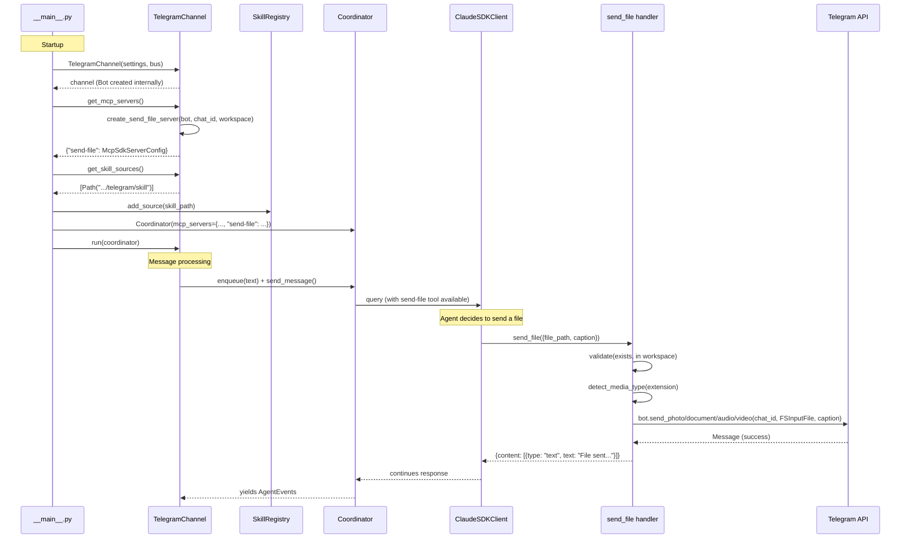

# Design: DLT-063 — Send files and media to users

**Delta Spec**: [../delta-specs/DLT-063.md](../delta-specs/DLT-063.md)
**Status**: Draft

## Purpose

This document explains the design rationale for this delta: the modeling choices, data flow, system behavior, and architectural approach.

After implementation, the "Detected Impacts" section will guide reconciliation into feature design docs.

## Problem Context

The agent needs to deliver files (images, documents, audio, video) directly to the user's Telegram chat during a conversation. Today, the agent can only respond with text — if it generates an image or creates a document, the user must manually locate it in the workspace.

**Constraints:**
- MCP tool servers are registered with the coordinator at construction time as base servers, or contributed per-session via pre-processing. The `send_file` tool needs the Telegram Bot instance and chat ID, which are channel-specific resources.
- The coordinator doesn't know about channels — channels hold a reference to the coordinator, not the other way around.
- The REPL channel has no file-sending capability (terminals can't render media inline), so the tool must be conditionally available.
- Telegram Bot API enforces a 50MB upload limit for bot file uploads; `send_photo` has a stricter 10MB limit.

**Interactions:**
- Coordinator layer: receives channel-provided MCP servers as base servers
- Telegram channel: owns the Bot instance and chat ID; creates the tool server
- Skills system: channel provides a skill source directory; `SkillRegistry` discovers and loads the skill; `SkillsContextProvider` classifies relevance per-message
- Agent: calls `send_file` MCP tool during conversation; receives skill-based instructions on usage

## Design Overview

This delta introduces two complementary changes: a **Channel protocol** that lets channels declare capabilities (tools and skills), and a **`send_file` MCP tool server** that the Telegram channel provides through this protocol.

The Channel protocol defines three methods with default no-op implementations: `get_mcp_servers()` (returns channel-specific tools), `get_skill_sources()` (returns paths to channel-provided skills), and `async run(coordinator)` (the main loop). Both `Repl` and `TelegramChannel` implement this protocol. The lifecycle in `__main__.py` changes: the channel is created first, its capabilities are extracted, and then the coordinator is created with the channel's tools merged in.

The `send_file` tool server follows DES-006: a factory in `telegram/tools.py` creates the server with the Bot and chat ID captured via closure. Media type is detected from file extensions and routed to the appropriate aiogram send method. File validation (existence, workspace boundary) and Telegram API errors are returned as tool errors.

Agent instructions come through a built-in skill shipped within the telegram package. The `SkillsContextProvider` classifies it as relevant when file-sending topics arise, injecting it into context only when needed.

```
┌─────────────────────────────────────────────────────────────┐
│                      Entry Point (__main__.py)              │
│  1. Create channel (Bot, settings — no coordinator yet)     │
│  2. channel.get_mcp_servers() → {"send-file": server}      │
│  3. channel.get_skill_sources() → [telegram/skill/]        │
│  4. Add skill sources to SkillRegistry                     │
│  5. Create coordinator(mcp_servers={...channel tools...})   │
│  6. channel.run(coordinator)                                │
└─────────────────────────────────────────────────────────────┘

┌─────────────────────────────────────────────────────────────┐
│                     Channel Layer                           │
│  ┌────────────────────┐  ┌──────────────────────────────┐   │
│  │  Repl              │  │  TelegramChannel             │   │
│  │  (no tools/skills) │  │  ┌────────────────────────┐  │   │
│  │                    │  │  │ send_file tool server   │  │   │
│  │                    │  │  │ (telegram/tools.py)     │  │   │
│  │                    │  │  └────────────────────────┘  │   │
│  │                    │  │  ┌────────────────────────┐  │   │
│  │                    │  │  │ telegram/skill/SKILL.md│  │   │
│  │                    │  │  └────────────────────────┘  │   │
│  └────────────────────┘  └──────────────────────────────┘   │
│         │                        │                          │
│         ▼                        ▼                          │
├─────────────────────────────────────────────────────────────┤
│                   Coordinator Layer                          │
│  ┌───────────────────────────────────────────────────────┐  │
│  │  Coordinator                                          │  │
│  │  _base_mcp_servers = {"task-tools": ...,              │  │
│  │                        "send-file": ...}              │  │
│  └───────────────────────────────────────────────────────┘  │
└─────────────────────────────────────────────────────────────┘
```

## Shape

| Part | Mechanism | Flag |
|------|-----------|:----:|
| **S1** | **Channel protocol** — define `Channel` base with default no-op methods: `get_mcp_servers() -> dict`, `get_skill_sources() -> list[Path]`, and `async run(coordinator) -> None`. Repl and TelegramChannel implement it. | |
| **S2** | **`send_file` MCP tool server** — `create_send_file_server(bot, chat_id, workspace_path)` in `src/tachikoma/telegram/tools.py` following DES-006. TelegramChannel creates this in `get_mcp_servers()` using its own Bot instance and settings. | |
| **S3** | **Media type detection** — extension-to-method map: image extensions → `bot.send_photo`, audio → `bot.send_audio`, video → `bot.send_video`, everything else → `bot.send_document`. Uses aiogram `FSInputFile` for local uploads. | |
| **S4** | **Error capture** — file validation (existence, workspace boundary via `Path.resolve()` + `is_relative_to()`) and Telegram API errors wrapped as `is_error` tool responses. No retry. | |
| **S5** | **Telegram tools skill** — built-in skill at `src/tachikoma/telegram/skill/SKILL.md` with `send_file` usage instructions. Channel returns this path via `get_skill_sources()`. | |
| **S6** | **Lifecycle adjustment** — create channel before coordinator in `__main__.py`, extract tools and skill sources, pass to coordinator and skill registry. Channel's `run()` receives the coordinator. | |
| **S7** | **Telegram module promotion** — move `telegram.py` → `telegram/__init__.py` (channel + renderer), add `telegram/tools.py` (tool server factory), add `telegram/skill/SKILL.md` (agent instructions). | |

## Components

### Implementation Structure

| Layer/Component | Responsibility | Key Decisions |
|-----------------|----------------|---------------|
| `src/tachikoma/channel.py` | `Channel` protocol with default no-op `get_mcp_servers()`, `get_skill_sources()`, and abstract `async run(coordinator)`. Defines the contract all channels follow. Both `Repl` and `TelegramChannel` explicitly inherit from `Channel` to get default implementations. | Protocol with explicit subclassing — provides structural subtyping semantics AND default implementations for `get_mcp_servers()` (returns `{}`) and `get_skill_sources()` (returns `[]`); `run()` takes coordinator as parameter enabling pre-coordinator channel construction |
| `src/tachikoma/telegram/__init__.py` | `TelegramChannel(Channel)` class (moved from `telegram.py`) + `ResponseRenderer`. Overrides `get_mcp_servers()` to create and return the `send_file` tool server. Overrides `get_skill_sources()` to return path to the `skill/` directory within the package. `run(coordinator)` sets `self._coordinator`, moves event bus subscriptions here (not `__init__`), then starts polling. Existing import paths (`from tachikoma.telegram import TelegramChannel, telegram_hook`) preserved via package `__init__` re-exports. | Module promotion from flat file to package; Bot created in `__init__`, reused by tool server factory; coordinator set at `run()` time, not construction; event bus subscriptions deferred to `run()` to avoid handlers firing before coordinator is set |
| `src/tachikoma/telegram/tools.py` | `create_send_file_server(bot, chat_id, workspace_path)` factory following DES-006. Defines `send_file` tool with Pydantic args model. Extracted `handle_send_file()` async function for testability. | Closure captures bot, chat_id, workspace_path; handler validates path then dispatches to appropriate `bot.send_*` method based on extension; returns `is_error` responses for all failure modes |
| `src/tachikoma/telegram/skill/SKILL.md` | Built-in skill providing `send_file` usage instructions. Frontmatter: `description: "Instructions for sending files and media to the user via Telegram (images, documents, audio, video)"`. Body: explains the `send_file` tool — when to use it (after generating files, when file content is more useful than text), parameters (`file_path`, `caption`), supported media types, and that the file must exist in the workspace. | Shipped as package data; discovered via `get_skill_sources()` → `SkillRegistry.add_source()`; description field drives `SkillsContextProvider` relevance classification |
| `src/tachikoma/repl.py` | `Repl(Channel)` class updated to inherit from `Channel`. Constructor no longer takes coordinator. `run(coordinator)` sets coordinator then enters input loop. Default no-op `get_mcp_servers()` and `get_skill_sources()` inherited from `Channel`. Event bus subscriptions moved from `__init__` to `run()` for consistency with the new lifecycle. | Minimal change — constructor and run() signature adjust; inherits defaults from Channel |
| `src/tachikoma/skills/registry.py` | New `add_source(path)` method on `SkillRegistry`: appends to `_skill_sources` and calls `_discover(path)` to load skills from the new source immediately. Must be called during startup before any message processing begins — the registry's `refresh()` method (called by `SkillsContextProvider.provide()`) re-scans all `_skill_sources`, so added sources are included in subsequent refreshes. | Enables post-construction source addition for channel-provided skills; maintains last-wins precedence (channel sources added after built-in and workspace); channel sources are static (package resources, not watched by filesystem watcher) |
| `src/tachikoma/__main__.py` | Lifecycle reordering: create channel before coordinator; call `channel.get_mcp_servers()` and merge with other base servers; call `channel.get_skill_sources()` and `registry.add_source()` for each path; pass coordinator to `channel.run()`. | Channel dispatch still based on `settings.channel`; channel creation moves above coordinator `async with` block |

### Cross-Layer Contracts



**Integration Points:**
- Channel → Coordinator: `get_mcp_servers()` provides tool servers at construction; `run(coordinator)` receives coordinator for message processing
- Channel → SkillRegistry: `get_skill_sources()` provides skill directory paths; `add_source()` integrates them
- Tool server → Telegram API: aiogram `Bot.send_photo/send_document/send_audio/send_video` with `FSInputFile`
- Tool server → Agent: success/error responses via MCP tool result contract (`content` / `is_error`)
- SkillsContextProvider → Agent: per-message skill classification injects `send_file` instructions when relevant

### Shared Logic

- **Media type detection**: `detect_media_type(path) → str` function in `telegram/tools.py` — returns a category string (`"photo"`, `"audio"`, `"video"`, or `"document"`) based on file extension. The handler dispatches to the appropriate `bot.send_*` method based on this category. Extracted for testability.
- **File validation**: `validate_file_path(file_path, workspace_path) → Path` function in `telegram/tools.py` — resolves the path (relative to workspace if not absolute), checks existence and workspace containment. Returns the resolved `Path` on success, raises `ValueError` with a descriptive message on failure. Extracted for testability.

## Modeling

### Channel protocol

```
Channel (Protocol — with explicit subclassing for defaults)
├── get_mcp_servers() → dict[str, McpSdkServerConfig]    (default: {})
├── get_skill_sources() → list[Path]                      (default: [])
└── async run(coordinator: Coordinator) → None

Repl(Channel)         — inherits defaults, only overrides run()
TelegramChannel(Channel) — overrides get_mcp_servers(), get_skill_sources(), run()
```

### TelegramChannel (updated construction)

```
TelegramChannel
├── _settings: TelegramSettings
├── _bot: Bot                          (created at __init__)
├── _dispatcher: Dispatcher
├── _router: Router
├── _coordinator: Coordinator | None   (set in run(), None until then)
├── _is_processing: bool
├── _bus: EventBus | None
├── get_mcp_servers() → {"send-file": McpSdkServerConfig}
├── get_skill_sources() → [Path(...telegram/skill)]
└── async run(coordinator) → None      (sets _coordinator, starts polling)
```

### send_file tool args

```
SendFileArgs (Pydantic BaseModel)
├── file_path: str                     (required — absolute or workspace-relative path)
└── caption: str | None = None         (optional — Field(max_length=1024) per Telegram limit)
```

### Media type categories

```
MEDIA_TYPES = {
    "photo":    {".png", ".jpg", ".jpeg", ".gif", ".webp"},
    "audio":    {".mp3", ".ogg", ".wav", ".flac"},
    "video":    {".mp4", ".avi", ".mov", ".webm"},
}
# Anything not in the above → "document"
```

## Data Flow

### send_file tool execution

```
1. Agent calls send_file(file_path="report.pdf", caption="Monthly report")
2. Tool handler receives args, Pydantic validates (including caption max_length=1024)
3. Resolve path:
   ├─ If not absolute → join with workspace_path (workspace_path / file_path)
   └─ Call .resolve() to canonicalize (eliminates .., symlinks)
   Note: ~ expansion is NOT performed — the agent operates in workspace context
4. Validate file:
   ├─ resolved.exists() == False → return is_error "File not found: {path}"
   └─ resolved.is_relative_to(workspace_path.resolve()) == False → return is_error "File must be within workspace"
5. Detect media type from extension:
   ├─ .png/.jpg/.jpeg/.gif/.webp → "photo"
   ├─ .mp3/.ogg/.wav/.flac → "audio"
   ├─ .mp4/.avi/.mov/.webm → "video"
   └─ anything else → "document"
6. Create FSInputFile(resolved_path)
7. Dispatch to appropriate bot method:
   ├─ "photo"    → bot.send_photo(chat_id, photo=file, caption=caption)
   ├─ "audio"    → bot.send_audio(chat_id, audio=file, caption=caption)
   ├─ "video"    → bot.send_video(chat_id, video=file, caption=caption)
   └─ "document" → bot.send_document(chat_id, document=file, caption=caption)
8. On success → return {content: [{type: "text", text: "File sent: {filename}"}]}
9. On TelegramAPIError → return {is_error: True, content: [{type: "text", text: "{error}"}]}
```

### Lifecycle change in __main__.py

```
Before (current):
  1. Bootstrap → skill_registry, foundational_context, ...
  2. Create pipelines
  3. Create task_tools server
  4. Create coordinator(mcp_servers={"task-tools": task_tools})
  5. Create channel(coordinator, settings)
  6. channel.run()

After (new):
  1. Bootstrap → skill_registry, foundational_context, ...
  2. Create channel(settings, bus)  ← no coordinator yet
  3. channel_mcp = channel.get_mcp_servers()
  4. for path in channel.get_skill_sources():
         skill_registry.add_source(path)
  5. Create pipelines
  6. Create task_tools server
  7. all_mcp = {"task-tools": task_tools, **channel_mcp}
  8. Create coordinator(mcp_servers=all_mcp)
  9. channel.run(coordinator)
```

## Key Decisions

### Channel protocol over ad-hoc wiring

**Choice**: Define a `Channel` protocol with `get_mcp_servers()`, `get_skill_sources()`, and `run(coordinator)`. Both `Repl` and `TelegramChannel` explicitly inherit from `Channel` to get default implementations.
**Why**: Channels are the natural owner of channel-specific capabilities. A protocol makes this explicit and extensible — any future channel can provide tools and skills through the same interface without modifying `__main__.py` wiring logic. Explicit subclassing gives channels default no-op implementations for `get_mcp_servers()` and `get_skill_sources()` (Python Protocols only provide defaults to classes that explicitly inherit). Channels that don't need tools or skills (like Repl) just inherit the defaults.
**Sources**: Existing codebase patterns (DES-003 for subsystem hooks, DES-006 for tool server factories); Python Protocol for structural subtyping.
**Options Researched**: (1) Ad-hoc factory functions per channel, (2) Separate ChannelCapabilities object, (3) Channel protocol, (4) ABC. Protocol chosen over ABC because it supports structural subtyping checks while still providing defaults via explicit inheritance.
**Why This Over Alternatives**: The channel already exists as an object — giving it capability methods keeps the abstraction count down and maps naturally to the lifecycle (create channel → query capabilities → use).
**Consequences**:
- Pro: Generic, extensible — REPL or future channels can provide tools/skills the same way
- Pro: No new abstraction — capabilities live on the channel object
- Pro: Clean lifecycle — channel is created, queried, then started
- Con: Repl constructor changes (drops coordinator param, receives it in `run()`)

### Skill-based context injection over system prompt

**Choice**: Ship `send_file` usage instructions as a built-in skill within the telegram package, loaded via `get_skill_sources()` and the standard skill detection pipeline.
**Why**: The skills system already handles conditional context injection — skills are classified per-message by the `SkillsContextProvider` and only loaded when relevant. This means the agent only sees `send_file` instructions when (a) the Telegram channel is active (skill is registered) and (b) the conversation involves file-sending topics (skill is classified as relevant). Hardcoding instructions in foundational context would waste context on every message regardless of relevance.
**Sources**: Existing skill system (see `skills/hooks.py` for built-in skill path resolution, `skills/context_provider.py` for per-message classification).
**Options Researched**: (1) Hardcode in AGENTS.md foundational context, (2) Add as conditional foundational context entry, (3) Channel-provided skill. Option 1 is always present even in REPL; option 2 requires custom foundational context injection that bypasses the skills system.
**Why This Over Alternatives**: Follows existing patterns — built-in skills already ship from source code (e.g., `skill-authoring-guide`). Per-message classification prevents context waste. Channel ownership makes the skill's lifecycle match the tool's lifecycle.
**Consequences**:
- Pro: Context-efficient — only loaded when relevant
- Pro: Follows existing patterns — no new injection mechanism
- Pro: Channel-scoped — absent when channel doesn't provide it
- Con: Depends on LLM classification accuracy (mitigated by clear skill description)

### Standalone Bot instance reuse

**Choice**: The `TelegramChannel` creates its `Bot` instance at construction time (as it does today) and passes it to the `send_file` tool server factory. The same `Bot` instance handles both message rendering (via `ResponseRenderer`) and file sending (via the tool server).
**Why**: aiogram's `Bot` is a thin async HTTP client wrapper — it's stateless and safe to use from multiple callsites concurrently. Creating a second Bot instance would add no benefit since both would use the same token and Telegram treats them identically.
**Sources**: aiogram 3.x documentation — `Bot` is an async HTTP client, not a stateful connection.
**Options Researched**: (1) Share Bot between channel and tool, (2) Create separate Bot for tool server. Both are valid but sharing is simpler.
**Why This Over Alternatives**: Fewer objects, no confusion about "which bot," same HTTP session pool.
**Consequences**:
- Pro: Simple — one Bot instance, shared naturally via closure
- Pro: No lifecycle coordination between two bot instances
- Note: Concurrent file sends and message edits are safe — aiogram Bot is async and thread-safe

### aiogram FSInputFile for local uploads

**Choice**: Use `FSInputFile(path)` from aiogram for all local file uploads to Telegram.
**Why**: `FSInputFile` is aiogram's canonical file upload mechanism. It wraps a local path, handles chunked streaming, and integrates directly with all `bot.send_*` methods. No need to read files into memory.
**Sources**: aiogram 3.x docs (v3.27.0) — `FSInputFile` for local file uploads; `InputFileUnion` type accepts `FSInputFile`.
**Options Researched**: `FSInputFile` (local path), `BufferedInputFile` (in-memory bytes), `URLInputFile` (remote URL). Only `FSInputFile` applies — files are local workspace paths.
**Why This Over Alternatives**: Files are on disk, not in memory or at URLs. `FSInputFile` streams without loading entire file into memory.
**Consequences**:
- Pro: Streaming upload — handles large files (up to 50MB) without memory pressure
- Pro: Native aiogram integration — type-safe with all send methods

### SkillRegistry.add_source() for channel skills

**Choice**: Add an `add_source(path)` method to `SkillRegistry` that appends to `_skill_sources` and immediately discovers skills from the new path.
**Why**: The skill registry is created during bootstrap (via `skills_hook`) before the channel exists. The channel needs to contribute skill sources after bootstrap. Rather than restructuring the bootstrap order, adding a method to accept additional sources post-construction is minimal and follows the existing multi-source pattern.
**Sources**: Existing `SkillRegistry` architecture — already supports multiple sources with last-wins precedence.
**Options Researched**: (1) Add source method, (2) Restructure bootstrap to include channel, (3) Pass channel skill paths to bootstrap hook via extras. Option 2 is over-engineering; option 3 couples bootstrap to channel selection logic.
**Why This Over Alternatives**: Minimal change, follows existing multi-source pattern, no bootstrap restructuring needed.
**Consequences**:
- Pro: Clean extension point — any subsystem can add sources post-construction
- Pro: Maintains last-wins precedence — channel skills added last, can override built-in/workspace
- Note: Channel sources are not watched by the filesystem watcher (acceptable — they're package resources, not user-editable)

## System Behavior

### Scenario: Agent sends a photo during conversation

**Given**: The agent is processing a conversation in the Telegram channel and has generated an image file
**When**: The agent calls `send_file` with the image path and a caption
**Then**: The tool validates the file exists and is within the workspace, detects it as a photo from the extension, calls `bot.send_photo(chat_id, FSInputFile(path), caption=caption)`, the photo appears in the Telegram chat immediately, and the tool returns a success confirmation to the agent.

### Scenario: Agent sends multiple files in one response

**Given**: The agent is streaming a response and wants to share several files
**When**: The agent calls `send_file` multiple times during the response
**Then**: Each call executes independently and in order. Each file appears in the chat at the point where the tool was called, interleaved with text messages.

### Scenario: File not found

**Given**: The agent calls `send_file` with a path to a file that doesn't exist
**When**: The tool validates the path
**Then**: The tool returns `is_error: True` with message "File not found: {path}". The agent can inform the user or try an alternative.

### Scenario: File outside workspace

**Given**: The agent calls `send_file` with a path like `/etc/passwd`
**When**: The tool validates the resolved path against the workspace boundary
**Then**: The tool returns `is_error: True` with message "File must be within the workspace: {path}". The path traversal is blocked.

### Scenario: Telegram API rejects file (general size limit)

**Given**: The agent calls `send_file` with a valid 60MB file
**When**: The Telegram API returns a 400 error for exceeding the 50MB limit
**Then**: The aiogram `TelegramAPIError` is caught and returned as `is_error: True` with the API error message. No retry.

### Scenario: Photo exceeds 10MB limit

**Given**: The agent calls `send_file` with a large 15MB PNG image
**When**: The tool detects it as a photo from the extension and calls `bot.send_photo`
**Then**: The Telegram API rejects the upload (photos have a 10MB limit, stricter than the general 50MB). The error is returned as `is_error: True`. The agent can retry by informing the user or suggesting compression. No automatic fallback to `send_document` — the API error message gives the agent enough context to decide.

### Scenario: Network error during upload

**Given**: The agent calls `send_file` with a valid file
**When**: A network error occurs during the upload
**Then**: The aiogram `TelegramNetworkError` is caught and returned as `is_error: True`. No retry. The agent can inform the user.

### Scenario: REPL channel — no send_file tool

**Given**: The agent is running with the REPL channel
**When**: The agent processes messages
**Then**: The REPL's `get_mcp_servers()` returns `{}` and `get_skill_sources()` returns `[]`. The `send_file` tool is not registered and the skill is not available. The agent cannot attempt to send files.

### Scenario: Skill loaded on relevant message

**Given**: The Telegram channel is active and the `send_file` tool is registered
**When**: The user asks "can you generate an image and send it to me?"
**Then**: The `SkillsContextProvider` classifies the telegram-tools skill as relevant and injects its content into the agent's context. The agent sees instructions on how to use `send_file`.

### Scenario: Skill not loaded on irrelevant message

**Given**: The Telegram channel is active
**When**: The user asks "what's the weather like?"
**Then**: The `SkillsContextProvider` does not classify the telegram-tools skill as relevant. No `send_file` instructions are injected. The tool is still available (registered as base server) but the agent is unlikely to use it without instructions.

### Scenario: Relative path resolution

**Given**: The agent calls `send_file` with a relative path like `output/chart.png`
**When**: The tool resolves the path
**Then**: The path is resolved against the workspace root: `workspace_path / "output/chart.png"`, then canonicalized via `.resolve()`. If the resolved file exists and is within the workspace, it's sent normally.

### Scenario: Path traversal via .. components

**Given**: The agent calls `send_file` with a path like `output/../../etc/passwd`
**When**: The tool resolves the path
**Then**: `.resolve()` canonicalizes the path to `/etc/passwd`. The `is_relative_to(workspace_path)` check fails and returns `is_error: True` with "File must be within the workspace."

## Open Questions

(none — all unknowns resolved)

---

## Detected Impacts

### Affected Feature Designs
- **[channels/telegram.md](../feature-designs/channels/telegram.md)** — Adds: file delivery capability via `send_file` tool server; module promotion to package; Channel protocol implementation with `get_mcp_servers()` and `get_skill_sources()`
- **[channels/terminal-repl.md](../feature-designs/channels/terminal-repl.md)** — Modifies: Repl implements Channel protocol; constructor drops coordinator param; `run()` receives coordinator
- **[channels/README.md](../feature-designs/channels/README.md)** — Adds: Channel protocol definition and channel-provided capabilities pattern
- **[agent/skills.md](../feature-designs/agent/skills.md)** — Adds: `SkillRegistry.add_source()` method for post-construction source registration; channel-provided skill sources as a new source category

### Notes for Reconciliation
- Add Channel protocol definition to `channels/README.md` as an architectural element
- Update `channels/telegram.md` components table to reflect package structure (`telegram/__init__.py`, `telegram/tools.py`, `telegram/skill/`)
- Add file sending requirement (R13) to `channels/telegram.md` requirements table
- Update `channels/terminal-repl.md` to reflect new constructor/run() signature
- Update `agent/skills.md` skill sources diagram to include channel-provided sources
- Add `add_source()` method to skill registry component description in `agent/skills.md`

## Notes

### Sources Consulted

- **aiogram 3.x** (v3.27.0): Documentation searched via context7 for `FSInputFile`, `Bot.send_photo`, `Bot.send_document`, `Bot.send_audio`, `Bot.send_video` method signatures and parameters. Confirmed: `FSInputFile(path)` for local uploads; `caption` parameter on all send methods (0-1024 chars); `InputFileUnion` accepts `FSInputFile`, `file_id` string, or URL string.
- **Telegram Bot API**: File size limits confirmed — 50MB general bot upload limit; `send_photo` has a 10MB limit; `send_audio` optimized for MP3/M4A (music player display); `send_video` optimized for MPEG4 (inline player).
- **Python Protocol**: Verified that Protocols support default method implementations for classes that explicitly inherit from them (explicit subclassing pattern).

### Implementation Notes

- Telegram caption limit: 1024 characters (enforced via Pydantic `max_length` for clearer error messages)
- aiogram `send_audio` displays in Telegram's music player for MP3/M4A; other audio formats are delivered but may not play inline
- Non-MPEG4 video sent via `send_video` is delivered as a document by Telegram
- The filesystem watcher does not monitor channel-provided skill paths — these are package resources (not user-editable), so runtime changes would only occur via code deployment
- `~` (home directory) expansion is not performed in path resolution — the agent operates in workspace context and should provide workspace-relative or absolute paths
- Event bus subscriptions (`SessionTaskReady`, `Notification`) are deferred from `__init__` to `run()` in both channels, ensuring `self._coordinator` is set before any event handler can fire
