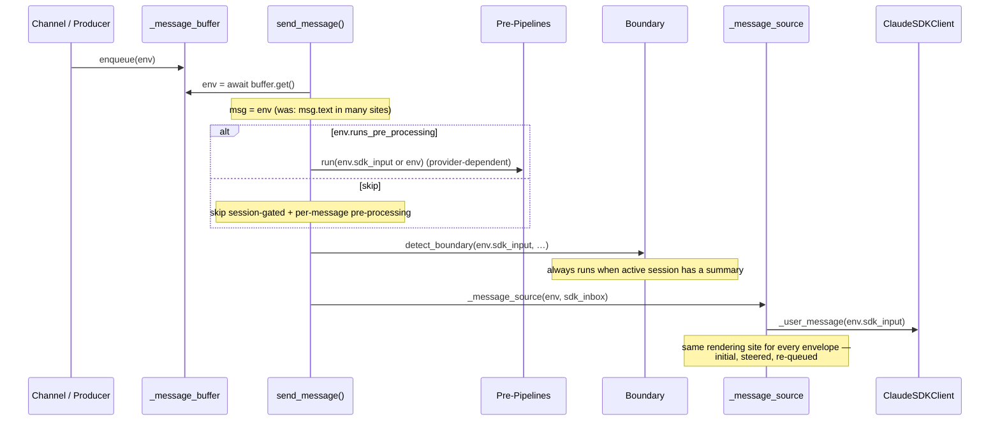
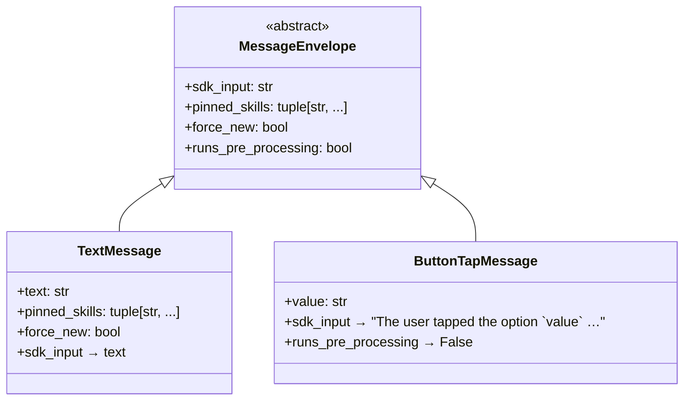

# Design: DLT-067 — Telegram inline button support

**Delta Spec**: [../delta-specs/DLT-067.md](../delta-specs/DLT-067.md)
**Status**: Draft

## Purpose

This document explains the design rationale for this delta: the modeling choices, data flow, system behavior, and architectural approach.

After implementation, the "Detected Impacts" section will guide reconciliation into feature design docs.

## Problem Context

The Telegram channel today is a pure text-in / text-out interface. Whenever the agent wants a structured answer ("yes / no", "pick one of three"), it has to ask the user to type the choice. That works on a laptop but is friction on a phone — keyboard pop-up, fat-fingered typos, no visual grouping of options, no way for the agent to be sure the user is responding to *this* prompt and not changing topic.

Telegram already provides the native primitive that solves this: **inline keyboards**. An inline keyboard is a grid of tappable buttons attached to a message; tapping a button delivers a `CallbackQuery` to the bot carrying a short opaque `callback_data` payload. The user gets one-tap input on mobile; the bot gets an unambiguous, machine-readable answer.

The constraint that complicates this is that **the user's typed turns and the user's button taps must remain distinguishable end-to-end**. If we render a tap to text and feed it into the coordinator as if it were typed, the agent can't tell whether the user wrote "approve" or tapped the **Approve** button — they look identical at the SDK boundary. That ambiguity has knock-on effects: the per-message pre-processing pipeline (skill classifier) will treat the tap as a fresh user intent and run an LLM classification call on it; the memory provider may try to recall memories for a button label; boundary detection can over-trigger.

**Constraints:**
- The Claude Agent SDK exposes a single user-message slot on each turn (a string fed via `client.connect()` / the message source). Any "this turn is a tap, not typed" signal has to be encoded into that string.
- `callback_data` is a 64-byte opaque blob. There's no place to attach metadata server-side that the bot can read at tap time without storing it.
- The bot must acknowledge a `CallbackQuery` within ~30 seconds via `callback_query.answer()` or the user sees a stuck spinner. The ack must not be blocked by agent processing — the agent could be mid-stream on another message and take minutes.
- aiogram 3.x's `callback.message` becomes `InaccessibleMessage` for messages older than 48h; the `chat_id` + `message_id` pair on it still works for explicit Bot API calls.
- The coordinator's message-buffer / forwarder / SDK-inbox plumbing is currently typed `IncomingMessage` / `str` — passing a richer envelope requires touching each producer and the SDK-input rendering site.
- DLT-125 (modality-aware envelope) will later extend the envelope hierarchy with media subtypes; this delta's envelope abstraction must be the foundation DLT-125 builds on, not a button-specific shim.

**Interactions:**
- Coordinator (`coordinator.py`) — message buffer, deferred queue, forwarder, `_message_source`, send_message control flow, pre-processing-pipeline triggering.
- Telegram channel (`telegram/__init__.py`) — aiogram dispatcher, the existing `_delivery_lock` busy/idle branching pattern, `ResponseRenderer`.
- MCP tool plumbing — DES-006 factory pattern (closure-captured `bot`+`chat_id`, Pydantic args, extracted handler), DES-006 array-arg caveat (JSON-encoded string for `buttons`).
- Per-message pre-processing pipeline (`per_message_pre_processing.py`, `skills/context_provider.py`) — provider signature touches the envelope type; skip semantics for taps.
- All envelope producer sites — REPL (`repl.py`), Telegram (text / media / commands / buffered delivery), task executor.

## Design Overview

Two coupled changes land in this delta:

**1. Envelope abstraction (foundation).** Today's `IncomingMessage` becomes the first concrete subtype (`TextMessage`) of a small typed hierarchy. The hierarchy is rooted on a `MessageEnvelope` abstract base that owns **all the per-envelope behavior the coordinator and its pipelines need** as property hooks:

```
MessageEnvelope (abstract)
├── sdk_input            → str        (required: text yielded to the SDK)
├── pinned_skills        → tuple      (default: empty)
├── force_new            → bool       (default: False)
└── runs_pre_processing  → bool       (default: True)
```

The base is the queue element type for `_message_buffer`, `_deferred_queue`, and the per-turn `sdk_inbox`. Every code path that today carries `IncomingMessage` or `str` carries `MessageEnvelope` instead. Subtypes override the hooks; pipelines and the coordinator dispatch on those hooks rather than `isinstance`-checking the subtype.

**2. Button presentation + tap routing (the feature).** A new MCP tool `present_buttons` (in a new `telegram/buttons.py` following DES-006) builds an `InlineKeyboardMarkup` from agent-provided rows of `{label, value}` pairs and sends it as a fresh Telegram message. A new aiogram `callback_query` handler on the `TelegramChannel`'s router receives taps, acknowledges immediately, applies the authorization filter, schedules keyboard removal as a detached task, wraps the chosen value in a `ButtonTapMessage`, and routes the envelope through the same `_delivery_lock.locked()` branching today's `_handle_message` uses.

`ButtonTapMessage`'s `sdk_input` renders as explicit prose — *"The user tapped the option `<value>` out of the options you displayed."* — and its `runs_pre_processing` returns `False`, so the agent unambiguously sees a tap turn and the per-message and session-gated pre-processing pipelines skip the work that doesn't apply to it.

```
┌────────────────────────────────────────────────────────────────────────────┐
│                            Telegram Channel                                  │
│                                                                              │
│   present_buttons MCP tool ─────────► bot.send_message(reply_markup=…)       │
│   (telegram/buttons.py)                                                      │
│                                                                              │
│   @router.callback_query handler ◄────── user taps button                    │
│       │                                                                      │
│       ├── callback.answer()    (always first — spinner clear)                │
│       ├── auth filter          (from_user.id == authorized_chat_id)          │
│       ├── detached Task        (edit_message_reply_markup=None if single)    │
│       └── ButtonTapMessage(value=…) ──► _delivery_lock.locked() branching    │
│                                                │                             │
└────────────────────────────────────────────────┼─────────────────────────────┘
                                                 │
                                                 ▼
┌────────────────────────────────────────────────────────────────────────────┐
│                                Coordinator                                   │
│                                                                              │
│   _message_buffer  : Queue[MessageEnvelope]                                  │
│   _deferred_queue  : Queue[MessageEnvelope]                                  │
│   sdk_inbox        : Queue[MessageEnvelope]   (per-turn)                     │
│                                                                              │
│   send_message():                                                            │
│      msg = await _message_buffer.get()                                       │
│      if msg.runs_pre_processing: run pre/per-message pipelines               │
│      always: boundary detection (consumes msg.sdk_input)                     │
│      _message_source(msg, sdk_inbox) → yields _user_message(env.sdk_input)   │
│         (single rendering site — initial + steered + re-queued)              │
└────────────────────────────────────────────────────────────────────────────┘
```

Producers (REPL, Telegram text/media/commands, buffered delivery, task executor) all switch from `IncomingMessage(...)` to `TextMessage(...)`. The field set on `TextMessage` matches `IncomingMessage` 1:1 (text + pinned_skills + force_new), so producer-side changes are mechanical renames.

## Shape

| Part | Mechanism | Flag |
|------|-----------|:----:|
| **S1** | New MCP tool server in `telegram/buttons.py` following DES-006: closure-captured `bot` + `chat_id`, Pydantic `PresentButtonsArgs(prompt: str, buttons: str, single_use: bool = True)`, extracted handler `handle_present_buttons()`. The `buttons` arg is a JSON-encoded string (DES-006 array-arg caveat) parsed via module-level `_decode_buttons()`. Handler builds `InlineKeyboardMarkup(inline_keyboard=[[InlineKeyboardButton(text=label, callback_data=_pack(value, single_use)) …]])` from the rows, calls `bot.send_message(chat_id, prompt, reply_markup=markup)`, returns `{message_id: …}` on success or `{is_error: True, …}` on validation/API failure | |
| **S2** | aiogram `@router.callback_query(F.data.startswith("btn"))` handler in `TelegramChannel`. Order: `await callback.answer()` first (broad-except so a flaky `answer()` cannot block routing — R4 AC), then in-handler check `callback.from_user.id == authorized_chat_id` (unauthorized → done, spinner already cleared, R8), then schedule keyboard removal as a detached `asyncio.Task` (no sequential dependency with routing — R12), then unpack `callback.data` to recover (value, single_use), construct `ButtonTapMessage(value=…)`, and apply the same `_delivery_lock.locked()` branching today's `_handle_message`/`_handle_media` use (busy → `enqueue`, idle → lock + enqueue + `_process_through_coordinator` + drain deferred) | |
| **S3** | Envelope hierarchy in `message.py`: abstract `MessageEnvelope(ABC)` base with property hooks (`sdk_input: str` [abstract via `@abstractmethod`], `pinned_skills: tuple[str, ...]` [default ()], `force_new: bool` [default False], `runs_pre_processing: bool` [default True]). `TextMessage(text, pinned_skills, force_new)` is a `@dataclass(frozen=True)` subclass that declares `text` / `pinned_skills` / `force_new` as dataclass fields and overrides the abstract `sdk_input` with `@property def sdk_input(self) -> str: return self.text` — exact field set of today's `IncomingMessage`. `ButtonTapMessage(value)` is a `@dataclass(frozen=True)` subclass that declares `value` as a field, overrides `sdk_input` with the explicit-tap prose, and overrides `runs_pre_processing` to return `False`; it does not accept `pinned_skills` as a constructor argument (taps inherit the empty default). The coordinator's `_message_buffer`, `_deferred_queue`, and per-turn `sdk_inbox` are all typed `Queue[MessageEnvelope]`; the forwarder's held-item type becomes `MessageEnvelope | None` and its cancellation-defence finally clause re-enqueues an envelope (not a string) to `_message_buffer`; `_drain_back` recovers envelopes from the inbox directly, dropping today's `IncomingMessage(text=...)` re-wrap at `coordinator.py:1091` | |
| **S4** | SDK-input rendering at the `_message_source` boundary: `_message_source(initial: MessageEnvelope, inbox: Queue[MessageEnvelope])` yields `_user_message(env.sdk_input)` for both the initial envelope and every envelope read from the inbox. One rendering site for all paths (initial, steered, re-queued). Initial enqueue path also threads the envelope (no parallel string path) | |
| **S5** | Keyboard removal via detached `asyncio.Task` calling `bot.edit_message_reply_markup(chat_id, message_id, reply_markup=None)` when single-use. Single-use bit is encoded into `callback_data` itself: prefix `"btn1:"` = single-use, `"btnN:"` = multi-use. The handler reads the prefix to decide whether to remove — stateless across restarts; no per-message state to track. Errors logged at warning; `TelegramBadRequest("message is not modified")` treated as no-op (consistent with `_flush` / `_send_chunks` handling) | |
| **S6** | Tap routing reuses the existing `_delivery_lock.locked()` branching pattern from `_handle_message` / `_handle_media`. Mid-stream taps (`enqueue` only, forwarder routes to live `sdk_inbox` as a steering message); idle taps (lock + enqueue + process + drain deferred). The deferred queue is never *triggered* by taps — `_handle_callback_query` only ever calls `enqueue()`, never `enqueue_deferred()`. (The deferred queue's parameter type still becomes `MessageEnvelope` per S9 because the `/new` and `/queue` command branches in `_handle_message` enqueue `TextMessage` envelopes there; the type widening doesn't change the routing semantics — it's just plumbing.) | |
| **S7** | Authorization in the callback_query handler (not a router-level filter): `callback.from_user.id == authorized_chat_id`. Unauthorized taps still get `answer()` so the originator's spinner clears, then are dropped (no value reaches the agent, no keyboard removal for that prompt) — implements R8's "still acknowledged, otherwise silently dropped" requirement | |
| **S8** | Input validation in `PresentButtonsArgs` + `_decode_buttons()`: per-button `value` ≤ 58 bytes (64-byte `callback_data` limit minus `"btn1:"` / `"btnN:"` prefix; documented in tool description), non-empty `label` / `value`, non-empty rows, at least one row, sane button count cap. Validation errors return `{is_error: True, …}` naming the offending field via `ValueError`-to-result mapping in the wrapper | |
| **S9** | Envelope adoption at producer sites: `TextMessage(...)` replaces `IncomingMessage(...)` at every site that constructs the envelope today — REPL (`_handle_user_input`, buffered delivery in `_deliver`), Telegram (`_handle_message` for both the plain-text branch and the `/new` and `/queue` command branches that flow through `enqueue_deferred`, `_handle_media`, `_deliver` for buffered delivery), task executor (background-task delivery). `enqueue()` and `enqueue_deferred()` both retype their parameter from `IncomingMessage` to `MessageEnvelope`. Each call site swaps the constructor name; field set is preserved 1:1 (text + pinned_skills + force_new). `IncomingMessage` is deleted | |
| **S10** | Pre-processing pipelines respect `envelope.runs_pre_processing`. Coordinator's `send_message()` skips both session-gated pre-processing and per-message pre-processing when `msg.runs_pre_processing is False`. Boundary detection, cold-start resume, and SDK rendering still run unconditionally on `sdk_input` | |
| **S11** | `MessageContextProvider.provide()` signature changes from `IncomingMessage` to `MessageEnvelope`. Provider implementations (`skills/context_provider.py`) read `message.sdk_input` (was `message.text`) and `message.pinned_skills` — both available on the base. No isinstance branching needed in providers (and they're skipped entirely for `runs_pre_processing=False`, so providers never see a `ButtonTapMessage`) | |

### Flagged Unknowns

_None. All shape parts describe concrete mechanisms; design-phase research resolved the seed's open questions (envelope discriminator, SDK-input shaping location, MCP tool placement, `single_use` state tracking)._

## Components

### Implementation Structure

| Layer/Component | Responsibility | Key Decisions |
|-----------------|----------------|---------------|
| `src/tachikoma/message.py` | Envelope hierarchy: abstract `MessageEnvelope` with property hooks (`sdk_input`, `pinned_skills`, `force_new`, `runs_pre_processing`) and two concrete frozen-dataclass subtypes — `TextMessage(text, pinned_skills, force_new)` (semantic equivalent of today's `IncomingMessage`) and `ButtonTapMessage(value)`. `IncomingMessage` is removed | Abstract base with default-property hooks (not `Protocol`) so subtypes inherit sensible defaults and only override what they need; frozen dataclasses preserve today's value-equality semantics |
| `src/tachikoma/coordinator.py` | `_message_buffer`, `_deferred_queue`, per-turn `sdk_inbox`, forwarder, and `_message_source` are all retyped to carry `MessageEnvelope`. `_message_source` becomes the single SDK-input rendering site — yields `_user_message(env.sdk_input)` for the initial envelope and every envelope pulled from the inbox. `send_message()` gates pre-processing pipelines on `msg.runs_pre_processing`; boundary detection and cold-start resume consume `msg.sdk_input` and run unconditionally. `_drain_back` recovers envelopes directly. `enqueue` / `enqueue_deferred` accept `MessageEnvelope` | One rendering site for all message paths; pipelines stay envelope-agnostic via property hooks |
| `src/tachikoma/per_message_pre_processing.py` | `MessageContextProvider.provide()` signature changes from `IncomingMessage` to `MessageEnvelope` (keyword args unchanged) | Providers read `message.sdk_input` + `message.pinned_skills` — both available on the base, no isinstance branching |
| `src/tachikoma/skills/context_provider.py` | Provider reads `message.sdk_input` instead of `message.text`; `message.pinned_skills` access is unchanged (same property name on the base) | One-line read site change; no behavior change for `TextMessage` (sdk_input == text) |
| `src/tachikoma/memory/context_provider.py` | Per-message provider (extends `MessageContextProvider`) whose `provide()` signature retypes from `IncomingMessage` to `MessageEnvelope` along with the other per-message providers; reads `message.sdk_input` instead of `message.text` at the prompt-rendering site. The session-gated `MemoryContextProvider` variant (if any) is unchanged because the session-gated pipeline already takes text via `pre_pipeline.run(msg.sdk_input, ...)` | One-line read site change; no behavior change for `TextMessage` (sdk_input == text); skipped entirely for envelopes with `runs_pre_processing=False` |
| `src/tachikoma/telegram/buttons.py` | **New module.** DES-006 factory: `create_buttons_server(bot, chat_id) -> McpSdkServerConfig`. Module-level `_decode_buttons(raw: str) -> list[list[Button]]` parses the JSON-string `buttons` arg (DES-006 array-arg pattern); module-level `_pack(value, single_use)` and `_unpack(data)` handle the `callback_data` prefix encoding (`btn1:` / `btnN:`). Pydantic `PresentButtonsArgs(prompt, buttons, single_use)` and inner `Button(label, value)`. Extracted async handler `handle_present_buttons()` for testability per DES-006 | Separate module from `tools.py`/`pinning.py` — buttons are an unrelated concern; mirrors the `pinning.py` precedent |
| `src/tachikoma/telegram/__init__.py` | `TelegramChannel` gains a `_handle_callback_query` router handler. Router registration adds `@self._router.callback_query(F.data.startswith("btn"))(self._handle_callback_query)`. `get_mcp_servers()` includes the new buttons server (third entry alongside send-file and telegram-pinning). All existing producer-side `IncomingMessage(...)` constructions become `TextMessage(...)` (text path, media path, buffered delivery path) | Inline auth check in handler (not router filter) so unauthorized taps still get acknowledged per R8 |
| `src/tachikoma/repl.py` | `IncomingMessage(text=text)` calls become `TextMessage(text=text)`; buffered-delivery call becomes `TextMessage(text=event.prompt, pinned_skills=event.pinned_skills())` | Mechanical rename |
| `src/tachikoma/tasks/executor.py` | `IncomingMessage(text=prompt, pinned_skills=pinned_skills)` becomes `TextMessage(...)` | Mechanical rename |

### Cross-Layer Contracts

#### Button presentation tool

```
present_buttons(
  prompt: str,
  buttons: str,             # JSON-encoded [[{"label": str, "value": str}, …], …]
  single_use: bool = True,
)
  → { "content": [{ "type": "text", "text": "Buttons sent (message_id: <id>)" }] }
  | { "is_error": True, "content": [{ "type": "text", "text": "<reason>" }] }
```

Validation rules (returned as `is_error: True`):
- `buttons` is not valid JSON, or does not encode a non-empty list of non-empty lists
- any `label` is empty or non-string
- any `value` is empty, non-string, or longer than 58 bytes when UTF-8 encoded
- total button count exceeds a sane cap (e.g., 100) to stay within Telegram's payload-size envelope

Success returns the sent message's Telegram ID in the result text so the agent can reference it later (e.g., "the prompt I sent at message 4291 was answered").

**Tool description text** (the `@tool(..., description=...)` block — per DES-006 the description must include a concrete JSON example because the agent can't infer the JSON-string format from the schema alone):

```
Present a Telegram inline keyboard of tappable buttons in the active chat.

Parameters:
- prompt (str, required): The message text shown above the buttons.
- buttons (str, required): A JSON-encoded list of rows. Each row is a list of
  button objects with {label, value}. label is shown on the button; value is
  the machine-readable identifier you receive back on tap.
  Example: '[[{"label": "Yes", "value": "yes"}, {"label": "No", "value": "no"}],
              [{"label": "Cancel", "value": "cancel"}]]'
- single_use (bool, optional, default True): If true, the keyboard is removed
  from the message after any button is tapped. If false, the keyboard remains
  attached and further taps from the same message are routed normally.

Returns the sent message's Telegram ID on success, or an error result on
validation/API failure. Per-button value must be ≤ 58 UTF-8 bytes; per-button
label must be non-empty; at least one row with at least one button is required.

When the user taps a button, you will receive a turn explicitly framed as
"The user tapped the option `<value>` out of the options you displayed.",
so you can distinguish taps from typed input. Use this for structured
prompts like yes/no, multiple-choice, or confirm/cancel.
```

#### Tap routing sequence

```mermaid
sequenceDiagram
    actor User
    participant TG as Telegram API
    participant Router as aiogram Router
    participant Chan as TelegramChannel
    participant Coord as Coordinator
    participant SDK as ClaudeSDKClient

    User->>TG: tap button
    TG->>Router: CallbackQuery
    Router->>Chan: _handle_callback_query(cb)
    Chan->>TG: callback_query.answer()
    Note over Chan: catch-all on answer() — never blocks routing

    alt cb.from_user.id != authorized_chat_id
        Note over Chan: drop — no keyboard removal, no envelope
    else authorized
        Chan-)+TG: detached Task: edit_message_reply_markup(None) if single-use
        Note over Chan: log + swallow errors; "message is not modified" → no-op

        Chan->>Chan: ButtonTapMessage(value=_unpack(cb.data))

        alt _delivery_lock.locked() (mid-exchange)
            Chan->>Coord: enqueue(tap)
            Note over Coord: forwarder routes onto live sdk_inbox<br/>as steering message
            Coord->>SDK: yield _user_message(tap.sdk_input)
        else idle
            Chan->>Coord: enqueue(tap) + _process_through_coordinator()
            Note over Coord: send_message() picks tap up,<br/>skips pre-processing (runs_pre_processing=False),<br/>runs boundary detection on sdk_input,<br/>yields _user_message(tap.sdk_input) to SDK
        end
    end
```

#### Envelope-aware coordinator flow



**Integration Points:**
- **Channel ↔ Coordinator**: `enqueue(MessageEnvelope)`, `enqueue_deferred(MessageEnvelope)` (signatures gain envelope type; ABI-compatible at the channel level since channels construct the envelope locally)
- **Coordinator ↔ Pre-processing pipelines**: gated on `env.runs_pre_processing`; otherwise unchanged (`pre_pipeline.run(env.sdk_input, ...)`, `msg_pre_pipeline.run(env, ...)`)
- **Coordinator ↔ SDK**: `_message_source` yields one `_user_message(env.sdk_input)` per envelope; the SDK contract is unchanged (still a string)
- **TelegramChannel ↔ aiogram callback router**: new `@router.callback_query(F.data.startswith("btn"))` handler; auth filter is in-handler, not at the router level
- **buttons.py ↔ TelegramChannel**: factory returns `McpSdkServerConfig`; channel includes it in `get_mcp_servers()` alongside `send-file` and `telegram-pinning`
- **buttons.py ↔ tap handler**: contract is the `callback_data` prefix convention (`btn1:<value>` / `btnN:<value>`) — both sides import the same `_pack` / `_unpack` helpers from `buttons.py` so the wire format has one source of truth

### Shared Logic

- **`callback_data` pack/unpack**: `_pack(value: str, single_use: bool) -> str` and `_unpack(data: str) -> tuple[str, bool]` live in `telegram/buttons.py` and are imported by `TelegramChannel._handle_callback_query`. One module owns the wire format; the channel doesn't redefine the prefix. This is a slight extension of DES-006 (which normally scopes module-level helpers to the wrapper inside the same factory module) — the cross-module share is intentional so the wire format has one author and one consumer.
- **Envelope property names**: `sdk_input`, `pinned_skills`, `force_new`, `runs_pre_processing` are the only contract between envelope producers/consumers — never `isinstance` checks. Adding a third envelope subtype (e.g., DLT-125's media subtypes) doesn't change consumers as long as it implements these hooks.

#### No-`isinstance` audit

Every coordinator site that touches a message envelope reads only the four hooks. Explicit per-site verification:

| Site | Access | Hook used |
|------|--------|-----------|
| `send_message()` re-queue loop dequeue | `msg = await _message_buffer.get()` | — (carries through) |
| `send_message()` `force_new` branch | `msg.force_new` | `force_new` |
| `send_message()` boundary detection | `msg.sdk_input` | `sdk_input` |
| `send_message()` cold-start resume call | `msg.sdk_input` | `sdk_input` |
| `send_message()` session-gated pre-processing gate | `msg.runs_pre_processing` | `runs_pre_processing` |
| `send_message()` session-gated pre-processing call | `pre_pipeline.run(msg.sdk_input, ...)` | `sdk_input` |
| `send_message()` per-message pre-processing gate | `msg.runs_pre_processing` | `runs_pre_processing` |
| `send_message()` per-message pre-processing call | `msg_pre_pipeline.run(msg, ...)` | (envelope passed; provider reads `sdk_input` + `pinned_skills`) |
| `send_message()` SDK rendering | `_message_source(msg, sdk_inbox)` | `sdk_input` (inside `_message_source`) |
| `send_message()` per-message post-processing | `msg_pipeline.run(session, msg.sdk_input, response, ...)` | `sdk_input` |
| `_message_source()` yield | `_user_message(env.sdk_input)` | `sdk_input` |
| `_forwarder()` shuffle | `inbox.put_nowait(envelope)` | — (carries through) |
| `_drain_back()` recover | direct re-enqueue | — (carries through) |
| `_handle_encoding_error` | operates on `Session`, not the envelope | — |
| `_attempt_cold_start_resume` | `detect_boundary(message, ...)` where `message=msg.sdk_input` | `sdk_input` |

No site requires `isinstance` discrimination. Adding a future envelope subtype with new fields (e.g., DLT-125 media attachments) does not require editing any of the above sites unless the subtype needs a new hook.

## Modeling

### Envelope hierarchy



Default hook values on the base:
- `pinned_skills = ()`
- `force_new = False`
- `runs_pre_processing = True`

`TextMessage` overrides exactly the three fields today's `IncomingMessage` carries (and `sdk_input` returns `text`). `ButtonTapMessage` overrides `sdk_input` and `runs_pre_processing`; the other defaults are correct as-is.

**Implementation notes:**
- The abstract base is `class MessageEnvelope(ABC)`; `sdk_input` is declared with `@property @abstractmethod` so the base cannot be instantiated even via dataclass machinery.
- Subtypes are `@dataclass(frozen=True)` classes that declare their fields as dataclass fields and override the abstract `sdk_input` with `@property def sdk_input(self) -> str: ...`. The `@dataclass(frozen=True)` decorator coexists with property overrides because the overridden name is declared on the class via `@property`, not as a dataclass field — dataclass machinery only looks at type-annotated class attributes.
- `force_new` lives on the base (default `False`) rather than only on `TextMessage` because the coordinator reads it uniformly via `msg.force_new`. Putting the default on the base means subtypes that never set it to True (i.e., everything except `TextMessage`) inherit the correct behavior automatically. The alternative — `getattr(msg, "force_new", False)` at the coordinator — works but obscures the contract; explicit hook-on-base is clearer.
- `ButtonTapMessage` does not accept `pinned_skills` as a constructor argument. Taps inherit the empty default. Pinning is a property of typed-message producer sites (session-task delivery), not tap producers; a future delta that needs to pin skills on a non-text envelope adds a field on that subtype, not on `ButtonTapMessage`.

### Queue element types

```
_message_buffer  : asyncio.Queue[MessageEnvelope]
_deferred_queue  : asyncio.Queue[MessageEnvelope]
sdk_inbox        : asyncio.Queue[MessageEnvelope]   (per-turn, lifetime = one exchange)
```

The three queues all carry the base type. The SDK-side string boundary is at `_message_source.yield _user_message(env.sdk_input)` — and only there.

### `callback_data` wire format

```
"btn1:<value>"      single-use button (keyboard removed on tap)
"btnN:<value>"      multi-use button (keyboard preserved)
```

The router filter is `F.data.startswith("btn")` — matches both prefixes; the unpack step pulls out the variant and the value. The 64-byte hard limit minus the 5-byte prefix gives a 59-byte value budget; the design pins this at 58 bytes for safety in case the prefix conventions evolve.

## Data Flow

### Button presentation (agent → user)

```
1. Agent (mid-conversation) decides to ask a structured question
2. Agent calls present_buttons(prompt="Keep going?",
                                buttons='[[{"label":"Yes","value":"y"},
                                            {"label":"No","value":"n"}]]',
                                single_use=true)
3. PresentButtonsArgs.model_validate(args) — schema-level validation
4. _decode_buttons(parsed.buttons) — JSON parse + per-button validation:
   - non-empty rows / row list
   - non-empty label / value
   - len(value.encode("utf-8")) ≤ 58
   - total button count ≤ cap
   on any failure → return {is_error: True, content: [...reason...]}
5. Build InlineKeyboardMarkup:
   inline_keyboard = [
     [InlineKeyboardButton(text=b.label,
                           callback_data=_pack(b.value, single_use))
      for b in row]
     for row in decoded
   ]
6. await bot.send_message(chat_id, prompt, reply_markup=markup)
   on TelegramAPIError (rate limit, invalid markup, network)
   → return {is_error: True, content: [...api error...]}
7. Return {content: [{type: "text", text: "Buttons sent (message_id: <id>)"}]}
```

### Tap reception (user → agent)

```
1. User taps a button in Telegram
2. Telegram delivers CallbackQuery to the bot (aiogram polls)
3. Router routes to _handle_callback_query (matched by F.data.startswith("btn"))
4. await callback.answer()
   - try/except — log and continue on any error
   - spinner is cleared regardless of agent state
5. if callback.from_user.id != self._settings.authorized_chat_id:
   - log debug; return (drop the tap entirely; no keyboard removal,
     no envelope construction, no agent visibility)
6. value, single_use = _unpack(callback.data)
7. if single_use:
     asyncio.create_task(self._remove_keyboard(callback.message.chat.id,
                                               callback.message.message_id))
   - detached: no sequential dependency with routing
   - inside the task: try/except, log warning on failure,
     treat "message is not modified" as no-op
8. tap = ButtonTapMessage(value=value)
9. if self._delivery_lock.locked():
     self._coordinator.enqueue(tap)        # steers into in-flight session
     return
   async with self._delivery_lock:
     self._coordinator.enqueue(tap)
     await self._process_through_coordinator()
     await self._drain_deferred_queue()
```

### Envelope through the coordinator

```
1. send_message() guard: buffer empty → return
2. msg = await _message_buffer.get()              # was: msg.text everywhere below
3. (existing) await previous _pending_msg_task
4. (existing) get/create active session
5. force_new branch: if msg.force_new and active session → transition
   - For TextMessage from /new, msg.force_new=True; for ButtonTapMessage, False
6. Boundary detection: if active session has summary and not cold-start-resumed:
   - detect_boundary(msg.sdk_input, active, …)    # was: msg.text
   - identical logic; ButtonTapMessage's sdk_input is its rendered prose
7. Foundational context save for new sessions (unchanged)
8. if is_new_session and self._pre_pipeline is not None:
     if msg.runs_pre_processing:
       self._pre_pipeline.run(msg.sdk_input, on_status=on_status)
     else:
       # skip — ButtonTapMessage carries no fresh user intent
9. Context entry load + system prompt build (unchanged — operates on DB entries)
10. if self._msg_pre_pipeline is not None and active is not None:
      if msg.runs_pre_processing:
        self._msg_pre_pipeline.run(msg, …)         # pipeline takes MessageEnvelope;
                                                    # providers read msg.sdk_input
                                                    # and msg.pinned_skills
      else:
        # skip — providers (skill classifier) would see only the rendered prose
11. Build ClaudeAgentOptions + ClaudeSDKClient (unchanged)
12. sdk_inbox = asyncio.Queue[MessageEnvelope]()
13. message_source = _message_source(msg, sdk_inbox)   # carries envelope, not str
14. forwarder reads MessageEnvelope from _message_buffer, puts into sdk_inbox
15. _message_source:
      yield _user_message(initial.sdk_input)
      while True:
        env = await sdk_inbox.get()
        yield _user_message(env.sdk_input)         # single rendering site
16. Per-message post-processing: pipeline.run(session, msg.sdk_input, response, …)
    - For TextMessage: sdk_input == text → identical to today
    - For ButtonTapMessage: sdk_input is the tap prose → exchange summary will
      reflect the tap clearly
17. _drain_back recovers envelopes from sdk_inbox and re-populates _message_buffer
    (no IncomingMessage(text=...) wrapping — envelopes flow back unchanged)
18. Re-queue loop: buffer empty → break; otherwise next iteration
```

## Key Decisions

### KD-1: Envelope hook surface — properties on the base, not external dispatch tables

**Choice**: `MessageEnvelope` is an abstract base class with property hooks (`sdk_input`, `pinned_skills`, `force_new`, `runs_pre_processing`); subtypes override the hooks. Coordinator and pipelines invoke the hooks; they never `isinstance`-check the envelope or call into per-subtype helpers.
**Why**: Adding a new envelope subtype (DLT-125's media subtypes, future tap variants, future first-class command envelopes) means writing one new class. Consumers — coordinator, providers, post-processors — don't change. This is the open/closed principle applied to message kinds: open to new subtypes, closed to consumer modification. It also keeps subtype-specific knowledge in one place (the subtype) rather than smeared across the coordinator and every pipeline.
**Sources**: aiogram 3.x docs (subclass-based message types are the established idiom in the same async ecosystem); CPython `abc` / dataclass docs for the `@property`+frozen-dataclass combination (per katachi:doc-researcher synthesis).
**Options Researched**:
- Pydantic discriminated union with `Literal` tag: stronger serialization story but we don't serialize envelopes anywhere; adds Pydantic-level boilerplate (validators, model config) for zero benefit.
- Runtime-checkable `Protocol`: avoids inheritance but loses default values on the base — every subtype must implement every hook, even the ones it would inherit verbatim. Loses exhaustiveness from the type checker.
- Sealed dataclass union (`TextMessage | ButtonTapMessage` typed alias) with external dispatcher (`render_sdk_input(env)` switching on type): consumers stay typed but every new subtype requires editing the dispatcher in the coordinator — exactly the smearing we want to avoid.
**Why This Over Alternatives**: The user's stated principle ("avoid type-specific logic on places that are supposed to be general") rules out external dispatch. Pydantic adds weight we don't need. Protocols lose defaults. Abstract base + property hooks is the smallest design that satisfies the principle and stays Python-idiomatic.
**Consequences**:
- Pro: New envelope kinds extend the type without touching consumers
- Pro: `mypy` / `ty` catch missing hook overrides via abstract-method errors
- Pro: Default values on the base mean subtypes only override what's actually different
- Con: `MessageEnvelope` is technically instantiable as a dataclass even with abstract properties unless we mark them with `@abstractmethod`; we do mark `sdk_input` abstract to prevent that

### KD-2: SDK-input rendering at the `_message_source` boundary

**Choice**: `_message_source(initial: MessageEnvelope, inbox: Queue[MessageEnvelope])` yields `_user_message(env.sdk_input)` for both the initial envelope and every envelope it reads from the inbox. The per-turn `sdk_inbox` is typed `Queue[MessageEnvelope]`; the forwarder forwards envelopes unchanged.
**Why**: Today the forwarder reads `IncomingMessage` from `_message_buffer`, projects out the `text` field, and pushes the string into the per-turn `Queue[str]`. The initial-message path renders the text in the caller and passes it to `_message_source(initial=msg.text, …)`. There are *two* string-extraction sites that have to agree, and the forwarder strips structure (e.g., a `ButtonTapMessage`'s tap-ness) before the rendering decision can be made. Moving the inbox to carry envelopes consolidates rendering into one site; structure survives to the rendering point; every message path (initial / steered / re-queued / drain-back recovery) is symmetric.
**Sources**: read of `src/tachikoma/coordinator.py:_message_source`, `_forwarder`, `_drain_back`; the spec's R5.1 — "Envelope-to-SDK-input shaping is performed at the `_message_source` boundary (or its inline equivalent) so every message path — initial, steered, and re-queued — shares the same rendering logic".
**Options Researched**:
- Forwarder renders to text (current `Queue[str]` shape): two rendering sites, lossy at the forwarder, must change `_drain_back` to fabricate envelopes from strings on the recovery path (already a code smell today).
- Render at enqueue time: structure lost before the buffer; mid-stream steering taps would arrive at the SDK as text with no way for the coordinator to know it was a tap, breaking the `runs_pre_processing` gating for steered taps.
- Render at the `_message_source` boundary on envelopes (chosen): single site, structure preserved until the very last step before SDK ingestion.
**Why This Over Alternatives**: Single rendering site is the property R5.1 explicitly wants. The current forwarder-strips-to-string design exists because `IncomingMessage`'s only payload was `text` — once we add a non-text envelope, the rendering decision has to move downstream.
**Consequences**:
- Pro: One rendering site = one source of truth for the SDK contract
- Pro: `_drain_back` simplifies — no more `IncomingMessage(text=…)` re-wrapping
- Pro: Steered taps render correctly because the envelope survives into `_message_source`
- Pro: The `_forwarder` cancellation-defence invariant survives the type change unchanged — the held item (previously `IncomingMessage`, now `MessageEnvelope`) is still re-enqueued to `_message_buffer` in the finally clause if cancellation lands between `get()` and `put_nowait()`. The pattern is identical; only the static type changes.
- Con: The forwarder's type changes; producers that today put strings into the per-turn inbox (none in the codebase, but conceivable in tests) would need to change

### KD-3: `runs_pre_processing` as an envelope hook, not a coordinator switch

**Choice**: The decision to skip pre-processing pipelines for a given envelope is a property of the envelope itself (`runs_pre_processing: bool` hook). The coordinator's `send_message()` reads this hook and skips both the session-gated and per-message pipelines when it's False.
**Why**: The alternative — coordinator-side isinstance branching (`if isinstance(msg, ButtonTapMessage): skip pre-processing`) — was explicitly rejected in the design interview. The envelope owns its own behavior. When DLT-125 introduces media envelopes, they may or may not want pre-processing; the answer lives on the media envelope, not in another coordinator branch.
**Sources**: design interview decision Q5 + Q1 (user direction: "I want to avoid type-specific logic on places that are supposed to be general").
**Options Researched**:
- Coordinator branches on type (`isinstance(msg, ButtonTapMessage)`): rejected per the interview.
- Pre-processing pipelines decide internally (each provider returns None for taps): each provider needs a button-tap branch, duplicating the skip logic N times; also wastes the pipeline-orchestration overhead (status emission, task creation) even when every provider is going to skip.
- Pipeline-level "should I run" hook on the pipeline itself, looking at the envelope: equivalent to KD-3 but reads as "the pipeline knows about envelopes" rather than "the envelope knows what it participates in". Less aligned with the open/closed principle.
**Why This Over Alternatives**: Aligns with the user's interview direction; matches the "envelope owns its behavior" pattern KD-1 establishes.
**Consequences**:
- Pro: Pipeline-skip granularity is per-envelope-kind, decided at the envelope's definition site
- Pro: Coordinator stays envelope-agnostic — reads the hook, branches once
- Con: All-or-nothing — currently no way for an envelope to participate in *some* providers and skip others; we accept this until a future delta has a concrete need
- Con: A `ButtonTapMessage` that happens to be the first message of a new session (stale-tap cold-start scenario) gets a session with no provider-supplied context entries. This is intentional — a tap value carries no semantic intent the providers can act on — but it means tap-cold-start sessions start "blank" until a regular `TextMessage` arrives. See the "Stale tap across restart" scenario for the full path.

### KD-4: `callback_data` prefix carries the single-use bit

**Choice**: Encode the single-use semantics into `callback_data` itself: `"btn1:<value>"` for single-use buttons, `"btnN:<value>"` for multi-use. The tap handler reads the prefix to decide whether to remove the keyboard.
**Why**: The alternative is to store per-message state at button-presentation time ("message ID 4291 was sent with single_use=True") and look it up at tap time. That state has to survive process restarts (taps work across restarts per R9) — meaning a DB table — or we accept that single-use semantics are lost on restart, which is surprising. Encoding the flag into `callback_data` is stateless: the same prefix arrives on the tap regardless of whether the bot restarted.
**Sources**: Telegram Bot API docs (callback_data is opaque to Telegram; bot owns the format); aiogram callback_query docs (F.data filters work on prefixes via `startswith`).
**Options Researched**:
- Per-message DB table (`button_presentations(message_id, single_use)`): adds a table for one boolean; restart-resilience requires the DB; lookup adds latency.
- In-memory dict on the channel: lost on restart; misaligns with R9's stale-tap guarantee.
- Always remove keyboard (no multi-use): violates R7's `single_use=False` option.
- Encode in `callback_data` (chosen): stateless, no DB, survives restarts, no lookup latency.
**Why This Over Alternatives**: Telegram's `callback_data` is exactly designed for the bot's own opaque payload; using 1 byte for a flag is well within the budget.
**Consequences**:
- Pro: Stateless — no DB, no in-memory tracking, no lookup
- Pro: Restart-resilient — the tap arrives with its single-use bit intact
- Pro: Trivial to test — pack and unpack are pure functions
- Con: 5-byte prefix eats into the 64-byte `callback_data` budget; we cap value at **58** bytes (64 − 5 = 59 is the literal max; we reserve one byte for future prefix schema evolution — e.g., a third variant like `"btn2:"` for a hypothetical "force-confirm" semantic)

### KD-5: Detached keyboard-removal task, not inline

**Choice**: Keyboard removal runs as a detached `asyncio.Task` spawned immediately after the authorization check. It does not block tap routing.
**Why**: R12 requires that "keyboard-removal failures after a tap (e.g., message no longer exists, edit rate-limited) are logged but never block tap routing — the tap value still reaches the agent." If keyboard removal were inline (`await bot.edit_message_reply_markup(...)`), a network stall or rate limit on the edit would delay the envelope reaching the coordinator's enqueue path. Detaching the edit means the envelope is enqueued in O(microseconds) while the edit retries independently.
**Sources**: read of `src/tachikoma/telegram/__init__.py:_handle_buffered_delivery` — same "detach to free the event-bus thread" pattern used for buffered delivery.
**Options Researched**:
- Inline `await`: ties routing to API success; violates R12.
- `asyncio.shield(asyncio.create_task(...))`: equivalent to detach but with extra complexity.
- Background `asyncio.gather` with the enqueue: serializes failure paths.
**Why This Over Alternatives**: Direct task creation is the simplest detach pattern and matches what `_handle_buffered_delivery` already does for the same reason.
**Consequences**:
- Pro: Routing latency is independent of Telegram edit latency
- Pro: Failures are isolated to the edit path
- Con: Detached task references are held briefly until completion — we use the existing `set` + `add_done_callback(discard)` pattern from `_delivery_tasks`

### KD-6: Inline auth check after `answer()`, not router-level filter

**Choice**: The aiogram router does not filter `CallbackQuery` by `from_user.id`. Instead, `_handle_callback_query` calls `await callback.answer()` first (so every tap clears its spinner) and then checks `callback.from_user.id == authorized_chat_id`, dropping unauthorized taps after the ack.
**Why**: R8 mandates that "non-matching taps are still acknowledged (so the originator's spinner clears) and otherwise silently dropped." A router-level filter on `from_user.id` would prevent the handler from running entirely for unauthorized taps — meaning `answer()` would never fire, leaving the unauthorized user staring at a spinner for 30 seconds. Doing the ack first and the auth check in-handler is the only ordering that satisfies R8.
**Sources**: aiogram 3.x docs (`@router.callback_query()` filters skip non-matching events entirely; the `CallbackQuery.answer()` deadline is documented as 30 seconds before the spinner becomes persistent — per katachi:doc-researcher synthesis).
**Options Researched**:
- Router-level filter (`F.from_user.id == authorized_id`): violates R8's "still acknowledged" clause.
- Separate "auth-failure handler" with reversed filter: race-prone (both handlers may match if filters overlap); convoluted for one boolean check.
- In-handler check after ack (chosen): single handler, single ack site, R8-compliant.
**Why This Over Alternatives**: R8 explicitly requires the ack-then-drop ordering. The router filter would short-circuit the ack.
**Consequences**:
- Pro: Unauthorized taps always get their spinner cleared
- Pro: One handler, one code path
- Con: A token amount of work is done for unauthorized taps (parse `from_user.id`, log) — negligible

### KD-7: Raw `InlineKeyboardMarkup`, not `InlineKeyboardBuilder`

**Choice**: `present_buttons` builds the inline keyboard via raw `InlineKeyboardMarkup(inline_keyboard=[[InlineKeyboardButton(...), …], …])` rather than via aiogram's `InlineKeyboardBuilder` API.
**Why**: The agent-supplied `buttons` argument is already a list-of-lists of `{label, value}`. That structure maps 1:1 onto `InlineKeyboardMarkup.inline_keyboard`. Using `InlineKeyboardBuilder` would require iterating the rows, calling `.row()` for each row, calling `.button()` for each button, and finally `.as_markup()` — same end result, more boilerplate, plus an intermediate stateful builder object we'd need to dispose of. The builder adds value when the keyboard's row layout is computed dynamically (e.g., "lay out N buttons with `.adjust(2,1)`"), which is not our case — the agent already chose the row layout.
**Sources**: aiogram 3.x `InlineKeyboardBuilder` docs (per katachi:doc-researcher synthesis) — the builder is the idiomatic ergonomic API but `InlineKeyboardMarkup` is the underlying type and accepts the same shape.
**Options Researched**:
- `InlineKeyboardBuilder` + `.row()` per agent row + `.as_markup()`: more steps, equivalent output.
- `InlineKeyboardBuilder` + `.adjust(*sizes)`: needs us to compute `sizes` from the row structure — slightly worse because the layout is already explicit.
- Raw `InlineKeyboardMarkup` (chosen): direct, no extra abstraction.
**Why This Over Alternatives**: Builder ergonomics shine when the bot composes the layout; here the agent owns the layout and the raw constructor maps directly onto it.
**Consequences**:
- Pro: One fewer aiogram abstraction in the call site
- Pro: The construction code reads exactly like the JSON the agent sent
- Con: If a future delta wants dynamically-adjusted rows (e.g., paginated lists), it may want to switch to the builder

### KD-8: `IncomingMessage` is removed, not aliased

**Choice**: `IncomingMessage` is deleted from `message.py`. Producers explicitly construct `TextMessage(...)` (or `ButtonTapMessage(...)`). No `IncomingMessage = TextMessage` alias is left behind.
**Why**: Tachikoma is a single-tenant codebase with no external consumers. A type alias would invite confusion — two names for the same thing, no signal about why the rename happened. The fish-or-cut-bait approach: rename every call site in the same delta, delete the old name, force every reader to learn the new vocabulary once.
**Sources**: project convention (CLAUDE.md): "Avoid backwards-compatibility hacks like renaming unused _vars, re-exporting types, adding // removed comments for removed code, etc. If you are certain that something is unused, you can delete it completely."
**Options Researched**:
- Alias (`IncomingMessage = TextMessage`): zero migration work for existing call sites, but leaves the codebase with two names that mean the same thing.
- Deprecation warning on alias: extra ceremony for an internal-only type.
- Rename + delete (chosen): one delta, one vocabulary.
**Why This Over Alternatives**: Matches the project's stated stance on backwards-compatibility hacks. The call-site rename is mechanical (9 call sites grepped).
**Consequences**:
- Pro: One name for the concept; new readers don't wonder which to use
- Pro: Tests that reference `IncomingMessage` fail at import time, so we know we caught them all
- Con: The delta touches more files than an alias would — but the touches are mechanical

## System Behavior

### Scenario: Single-row two-button prompt, happy-path tap while idle

**Given**: Agent calls `present_buttons(prompt="Continue?", buttons='[[{"label":"Yes","value":"yes"},{"label":"No","value":"no"}]]', single_use=True)` mid-conversation; user is idle.
**When**: Telegram delivers the message; user taps **Yes**; the bot's `CallbackQuery` handler runs.
**Then**: `callback.answer()` clears the spinner. Auth check passes. A detached task fires `edit_message_reply_markup(reply_markup=None)`. Handler unpacks `("yes", True)` from `"btn1:yes"`. `_delivery_lock` is free, so the handler acquires it, enqueues `ButtonTapMessage(value="yes")`, and processes through the coordinator. Coordinator reads the envelope; `runs_pre_processing=False` skips both pre-processing pipelines; boundary detection runs on the rendered prose (no shift detected — active session continues); `_message_source` yields `_user_message("The user tapped the option `yes` out of the options you displayed.")` to the SDK; agent responds normally; renderer streams the response. Telegram shows the original prompt with no keyboard attached.

### Scenario: Tap while the agent is mid-stream

**Given**: Agent is streaming a response to a prior typed message (delivery lock held); user taps a button on an earlier message.
**When**: Handler runs.
**Then**: `callback.answer()` clears the spinner. Auth passes. Detached task removes the keyboard. `_delivery_lock.locked()` is True, so the handler calls `coordinator.enqueue(ButtonTapMessage(...))` and returns. The coordinator's forwarder picks up the envelope and pushes it onto the per-turn `sdk_inbox`. `_message_source` yields `_user_message(env.sdk_input)` to the SDK as a steering message in the active session. The agent receives the tap while still composing its prior response and incorporates it.

### Scenario: Unauthorized tap (group chat scenario)

**Given**: Bot is a member of a group chat alongside other users; a non-authorized member taps a button on a message the bot sent there.
**When**: Handler runs.
**Then**: `callback.answer()` clears the originator's spinner. `callback.from_user.id != authorized_chat_id`. Handler logs at debug and returns. No keyboard removal occurs (the prompt remains tappable for the authorized user). No envelope is constructed. No value reaches the agent.

### Scenario: Stale tap across restart

**Given**: Process restarted; `_message_buffer` and `_active_renderer` are empty; user taps a button on a message sent before the restart.
**When**: Handler runs.
**Then**: Identical to the idle happy path — `callback.answer()` succeeds (Telegram allows answering even old queries within the 24-hour callback window), auth passes. `callback.message` may be a regular `Message` (recent prompt) or an `InaccessibleMessage` (>48h old); either way the design accesses only `callback.message.chat.id` and `callback.message.message_id`, both of which are guaranteed present on `InaccessibleMessage` per aiogram 3.x docs. Keyboard removal is attempted via `bot.edit_message_reply_markup(chat_id, message_id, reply_markup=None)`; if Telegram returns "message to edit not found" the detached task logs at warning and the tap still routes. `ButtonTapMessage` is enqueued; `send_message()` picks it up. Because there's no active session, cold-start resume runs against the rendered prose; in the typical case no match is found and a fresh session is created with the tap value as the seed message. **Critically**: because `ButtonTapMessage.runs_pre_processing is False`, the session-gated pre-processing pipeline (memory, projects, skills) does NOT run for this seed message — the new session starts with no provider-supplied context. This is intentional (KD-3's "all-or-nothing" Consequences): a tap value carries no semantic intent the providers can act on, so the priming would be wasted. The session's context is seeded the next time the user types a regular message (which triggers a new pipeline run through the existing boundary-shift / new-session paths) — or the agent can ask the user what the tap was about.

### Scenario: Two taps in rapid succession on a single-use prompt

**Given**: User taps **Yes**, then within ~100ms taps **No** before the first keyboard-removal edit has completed.
**When**: Both handlers run.
**Then**: Both taps are acknowledged independently. The first detached keyboard-removal task removes the keyboard. The second detached task issues the same edit and Telegram responds with `TelegramBadRequest("message is not modified")`; the task catches this specific error and treats it as a no-op (same pattern as `_flush`/`_send_chunks`). Both `ButtonTapMessage` envelopes are enqueued — `Yes` first (FIFO), `No` second. The agent sees both taps as separate turns; it's the agent's responsibility to interpret rapid-fire taps (the system does not deduplicate per R5 AC).

### Scenario: Tool call with malformed `buttons` JSON

**Given**: Agent calls `present_buttons(prompt="…", buttons="not valid json")`.
**When**: `_decode_buttons("not valid json")` runs inside the tool wrapper.
**Then**: `json.JSONDecodeError` raises `ValueError("buttons must be a JSON-encoded list of rows: …")`. The wrapper catches the `ValueError` and returns `{is_error: True, content: [{type: "text", text: "buttons must be a JSON-encoded list of rows: ..."}]}`. No Telegram message is sent. The agent sees the error and can self-correct.

### Scenario: Tool call with `value` over 58 bytes

**Given**: Agent calls `present_buttons(..., buttons='[[{"label":"OK","value":"<60-byte-string>"}]]')`.
**When**: `_decode_buttons` validates the per-button `value` length.
**Then**: Returns `{is_error: True, content: [{type: "text", text: "Button value 'aaa…aaa' exceeds 58-byte limit (60 bytes)"}]}`. No message sent. The agent can shorten the value or re-encode.

### Scenario: Telegram rate-limits `send_message` during button presentation

**Given**: Agent calls `present_buttons` while Telegram is rate-limiting the bot.
**When**: `bot.send_message(...)` raises `TelegramRetryAfter`.
**Then**: Caught as a `TelegramAPIError` subclass; tool returns `{is_error: True, content: [{type: "text", text: "Telegram API error: ..."}]}` with the retry-after duration in the message. No automatic retry — the agent can decide whether to retry, fall back to typed prompt, or inform the user.

### Scenario: Keyboard removal fails because the message was deleted

**Given**: User taps a button; before the detached keyboard-removal task runs, the user (or an admin in a group context) deletes the original message.
**When**: `bot.edit_message_reply_markup(...)` raises `TelegramBadRequest("message to edit not found")`.
**Then**: The detached task catches the exception and logs at warning. The tap value still reaches the agent through the independent enqueue path. The agent's response goes through unaffected (the prompt is gone from the chat history, but the agent doesn't depend on it being there).

### Scenario: REPL channel — `present_buttons` is not registered

**Given**: Agent is running with the REPL channel.
**When**: Agent processes messages.
**Then**: `Repl.get_mcp_servers()` returns `{}`; the buttons server (which lives only in `TelegramChannel.get_mcp_servers()`) is not registered. The `present_buttons` tool name is unknown to the agent — same behavior as `send_file` and `pin_message` in REPL today.

### Scenario: All envelope producers swap to `TextMessage`

**Given**: A typed message arrives via Telegram (`_handle_message`); a media message arrives (`_handle_media`); a buffered delivery dispatches (`_deliver`); a session task triggers (`tasks/executor.py`); the REPL accepts user input (`_handle_user_input`).
**When**: Each producer constructs the envelope it enqueues.
**Then**: Every producer constructs `TextMessage(...)` (with the same field set today's `IncomingMessage` carries). No producer constructs `IncomingMessage` (it no longer exists). The coordinator behaves identically — `TextMessage.sdk_input == self.text`, `pinned_skills` and `force_new` are passed through to the same coordinator branches that read them today. This is a no-behavior-change refactor at all producer sites; only the type name changes.

### Scenario: Skill classifier on a tap

**Given**: User taps a button; `ButtonTapMessage` reaches the coordinator's per-message pre-processing branch.
**When**: Coordinator checks `msg.runs_pre_processing`.
**Then**: Returns False. The per-message pipeline is skipped entirely — no skill classifier LLM call, no status events emitted from the pipeline, no entries saved. The flow proceeds directly to `_build_options` + `_message_source`. The agent still has whatever skills were already loaded from prior turns in the session via context-entry persistence.

## Open Questions

_None remaining. All seed questions (envelope discriminator strategy, SDK-input shaping location, MCP tool placement, single-use state tracking) have been resolved by KD-1, KD-2, the new module choice, and KD-4 respectively. Design-review feedback applied; see commit history for the iteration._

---

## Detected Impacts

### Affected Feature Designs

- **`docs/feature-designs/channels/telegram.md`** — **Adds**: a new sub-section to "Implementation Structure" covering `telegram/buttons.py` (DES-006 factory for `present_buttons`); a new entry in the `_handle_callback_query` handler under the channel control-flow; the Cross-Layer Contracts diagram gains a tap branch; `get_mcp_servers()` gains a third server entry (`telegram-buttons`); the Notes section gains a paragraph on the `callback_data` prefix convention and the ack-first auth ordering.
- **`docs/feature-designs/agent/core-architecture.md`** — **Modifies**: the data-flow section to describe envelope-aware `_message_source` rendering and `runs_pre_processing` gating; the `Coordinator state and methods` block to retype `_message_buffer` / `_deferred_queue` / per-turn inbox to `Queue[MessageEnvelope]`; the modeling section to describe the envelope hierarchy at the coordinator boundary; the Key Decisions section gains a new entry on the envelope hook surface (links back to KD-1 here).
- **`docs/feature-designs/agent/pre-processing-pipeline.md`** — **Modifies (light)**: documents that the pipeline is gated on `envelope.runs_pre_processing` and that providers receive `MessageEnvelope` (reading `sdk_input` / `pinned_skills` via the base hooks).
- **`docs/feature-designs/agent/skills.md`** — **Modifies (light)**: the skill classifier provider documentation updates to reference `message.sdk_input` instead of `message.text` and notes the no-isinstance-branching contract.
- **`docs/feature-designs/channels/terminal-repl.md`** — **Modifies (light)**: REPL constructs `TextMessage` envelopes; one-line update to the `_handle_user_input` and `_deliver` paragraphs.
- **`docs/feature-designs/delivery/priority-buffer.md`** — **Modifies (light)**: `BufferedDelivery` consumers (Telegram, REPL) wrap the digest prompt in a `TextMessage` envelope.
- **`docs/feature-designs/tasks/background-task-execution.md`** — **Modifies (light)**: the executor's coordinator-enqueue site wraps the synthesized prompt in a `TextMessage` envelope.

### Notes for Reconciliation

- `channels/telegram.md` needs the new `telegram-buttons` MCP server documented alongside `send-file` and `telegram-pinning`, plus a `_handle_callback_query` entry in the channel control-flow. The "Event Rendering" table does not change (taps don't produce events for the response renderer). A new sequence diagram for the tap path may be helpful in Cross-Layer Contracts; the existing media-flow sequence is the closest analog.
- `agent/core-architecture.md`'s `Coordinator state and methods` block currently lists `_message_buffer: asyncio.Queue[IncomingMessage]` and `_deferred_queue: asyncio.Queue[IncomingMessage]` — both retype to `Queue[MessageEnvelope]`. The data-flow narrative ("dequeue msg_A, run full pipeline") doesn't change in structure but the rendering step gains "via `env.sdk_input`".
- All pipelines that name "the user message" need a one-line update: "the user message" is now "the envelope's `sdk_input`" at the rendering boundary. Behavior is unchanged for `TextMessage`.
- **Relationship to DLT-125**: DLT-067 lands the minimal envelope abstraction with two subtypes (text + button-tap). DLT-125 will extend the hierarchy with media-modality subtypes — the base `MessageEnvelope` hook set (`sdk_input`, `pinned_skills`, `force_new`, `runs_pre_processing`) is intentionally generic enough to absorb media envelopes without changing the consumer-side contract.
- No new ADR or DES anticipated. The MCP tool follows DES-006 unchanged; the envelope hierarchy is small enough that a cross-cutting DES doesn't yet earn its keep — once a third or fourth subtype lands (DLT-125), the pattern may be worth distilling into a DES.

## Notes

- aiogram 3.x docs for `InlineKeyboardMarkup` / `InlineKeyboardButton` / `@router.callback_query()` / `CallbackQuery.answer()` / `bot.edit_message_reply_markup`: verified via katachi:doc-researcher synthesis. Key gotchas: 64-byte `callback_data` limit; 30-second `answer()` deadline before the spinner becomes persistent; `callback.message` may be `InaccessibleMessage` for messages >48h old (but `chat_id` + `message_id` still work via explicit Bot API calls); `callback.from_user` vs `callback.message.chat` is the authorized-user-vs-chat distinction R8 calls out.
- `InlineKeyboardBuilder` from `aiogram.utils.keyboard` is the modern aiogram 3.x idiom, but raw `InlineKeyboardMarkup(inline_keyboard=[[...], [...]])` maps 1:1 onto the agent-provided row structure and is more direct here.
- The `CallbackData` class from `aiogram.filters.callback_data` is the structured-data idiom; for our needs the simple prefix-string approach is sufficient and one fewer abstraction to learn.
- The new `telegram/buttons.py` module mirrors `telegram/pinning.py` in structure: DES-006 factory, extracted handler, Pydantic args, plus the array-arg JSON-string pattern from DES-006's later section.
- The envelope hierarchy intentionally exposes hooks (`runs_pre_processing`) that go beyond rendering — DLT-125's media subtypes may add their own hooks (e.g., "carries an attachment that needs MIME-type-aware handling"). The abstract base is the extension point.
