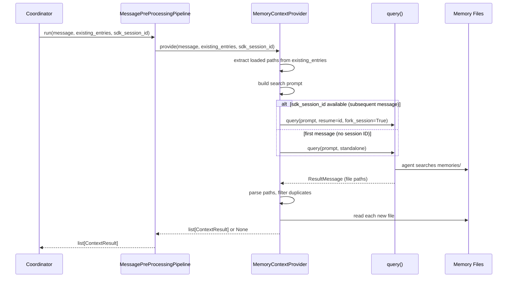

# Design: DLT-076 - Re-evaluate memory context per message

**Delta Spec**: [../delta-specs/DLT-076.md](../delta-specs/DLT-076.md)
**Status**: Draft

## Purpose

This document explains the design rationale for this delta: how to move the memory context provider from session-gated to per-message evaluation, including session forking for conversation context, prompt updates for agent-driven search decisions, and individual entry management with metadata-based deduplication.

After implementation, the "Detected Impacts" section will guide reconciliation into feature design docs.

## Problem Context

The memory context provider currently runs once on the first message of a new session (session-gated `PreProcessingPipeline`). Its output is persisted as a single context entry and reused for all subsequent messages. When the conversation topic evolves, initially retrieved memories may no longer be relevant, and memories that would be highly relevant to follow-up messages are never injected.

**Constraints:**
- The SDK session ID is only available after the first response completes — the first message always operates without conversation context
- The per-message pipeline already exists (`MessagePreProcessingPipeline`) with one provider (skills); the memory provider must integrate without disrupting it
- Memory files are small local markdown files in `memories/{episodic,facts,preferences}/`
- Provider failures must never block the conversation (existing error isolation contract)
- Must follow DES-005 (fully consume `query()` generator) and DES-002 (logging conventions)

**Interactions:**
- Per-message pre-processing pipeline (`per_message_pre_processing.py`): memory provider registers as a `MessageContextProvider`
- Coordinator (`coordinator.py`): passes SDK session ID through the pipeline; moves memory registration from session-gated to per-message
- Memory extraction (`memory-extraction`): provides the stored memories that this provider searches
- Bootstrap (`__main__.py`): registration moves from `pre_pipeline` to `msg_pre_pipeline`

## Design Overview

Convert `MemoryContextProvider` from `ContextProvider` to `MessageContextProvider` and register it in the per-message pipeline. Extend the `MessageContextProvider` ABC and `MessagePreProcessingPipeline` with an `sdk_session_id` parameter so the memory provider can fork the coordinator's session. When an SDK session ID is available (subsequent messages), the provider forks the session to give the search agent full conversation context for informed relevance decisions. On the first message (no session ID yet), it falls back to a standalone query.

The agent returns relevant memory file paths. The provider reads each file, filters out paths already present in `existing_entries` (via `memory_path` metadata), and returns one `ContextResult` per new memory file. This mirrors the skills provider pattern (agent classifies, provider assembles entries).

```
┌──────────────────────────────────────────────────────────────────┐
│                    MemoryContextProvider                          │
│                    (MessageContextProvider)                       │
│                                                                  │
│  provide(message, existing_entries, sdk_session_id):             │
│    1. Extract loaded memory paths from existing_entries metadata │
│    2. Build search prompt with user message                      │
│    3. If sdk_session_id → query(fork_session=True, resume=id)   │
│       Else → query(standalone, no fork)                         │
│    4. Parse file paths from agent response                       │
│    5. Filter out already-loaded paths                            │
│    6. Read each file, create ContextResult per file              │
│    → list[ContextResult]  or  None                              │
└──────────────────────────────────────────────────────────────────┘
```

## Shape

| Part | Mechanism | Flag |
|------|-----------|:----:|
| **S1** | Convert `MemoryContextProvider` from `ContextProvider` to `MessageContextProvider`, register in per-message pipeline instead of session-gated pipeline | |
| **S2** | Extend `MessageContextProvider.provide()` and `MessagePreProcessingPipeline.run()` with `sdk_session_id: str | None = None` keyword arg; coordinator passes `self._sdk_session_id` at call site | |
| **S3** | Use `fork_session=True` + `resume=sdk_session_id` when SDK session ID is available (subsequent messages); fall back to standalone `query()` on first message (no session ID yet) | |
| **S4** | Update prompt: when forked (has conversation context), instruct agent to evaluate whether the new message warrants searching for additional memories; when standalone (first message), instruct to search as before | |
| **S5** | Return `list[ContextResult]` with one entry per memory file, each with tag `"memories"` and metadata `{"memory_path": "<path>"}` for identification | |
| **S6** | Check `existing_entries` metadata (`memory_path` key) to skip memories already present in context — never remove, only append | |

## Components

### Implementation Structure

| Layer/Component | Responsibility | Key Decisions |
|-----------------|----------------|---------------|
| `src/tachikoma/per_message_pre_processing.py` | `MessageContextProvider` ABC and `MessagePreProcessingPipeline` — extended with `sdk_session_id: str | None = None` keyword arg on both `provide()` and `run()` | Follows same pass-through pattern as `existing_entries`; providers that don't need it ignore it |
| `src/tachikoma/memory/context_provider.py` | `MemoryContextProvider(MessageContextProvider)` — forks session when SDK session ID available, parses file paths from agent response, reads files, creates per-file `ContextResult` entries with metadata | Agent returns paths (classification), provider reads files (assembly) — mirrors skills provider pattern; uses `memory_path` metadata key per ADR-011 |
| `src/tachikoma/__main__.py` | Registration: moves `MemoryContextProvider` from `pre_pipeline.register()` to `msg_pre_pipeline.register()` | Single line change in wiring |
| `src/tachikoma/coordinator.py` | Passes `sdk_session_id=self._sdk_session_id` to `msg_pre_pipeline.run()` | SDK session ID is already available at the call site; minimal change |

### Cross-Layer Contracts



**Integration Points:**
- Coordinator ↔ Pipeline: `msg_pre_pipeline.run(message, existing_entries=entries, sdk_session_id=self._sdk_session_id)` — new keyword arg added
- Pipeline ↔ Providers: `provide(message, existing_entries=entries, sdk_session_id=sdk_session_id)` — passed through to all providers
- Memory provider ↔ SDK: `query(prompt, options=ClaudeAgentOptions(resume=id, fork_session=True, ...))` for subsequent messages; standalone `query()` for first message
- Memory provider ↔ Filesystem: `Path.read_text()` to read memory files after agent identifies relevant paths

**Error contract:**
- If `query()` fails (SDK error, fork failure, expired session) → catch, log per DES-002, return None
- If agent returns error (`ResultMessage.is_error`) → log warning, return None
- If agent exhausts `max_turns` → return None
- If file read fails (file deleted between search and read) → skip that file, log warning, continue with remaining files

### Shared Logic

- **`MEMORY_PATH_META_KEY = "memory_path"`** — constant co-located with provider, used for both writing metadata on new entries and reading metadata from existing entries (deduplication)
- **`MEMORIES_OWNER = "memories"`** — constant for the entry owner tag, used in both `ContextResult` creation and `extract_memory_paths()` filtering
- **`extract_memory_paths(entries)`** — helper function extracting loaded memory paths from `existing_entries` metadata. Filters by `entry.owner == MEMORIES_OWNER` and reads `metadata["memory_path"]`. Mirrors `extract_skill_names()` in the skills provider (which filters by `entry.owner == SKILLS_OWNER`).

## Modeling

```
MemoryContextProvider(MessageContextProvider)
├── _agent_defaults: AgentDefaults     (cwd, cli_path, env, model)
└── provide(message, existing_entries, sdk_session_id) → list[ContextResult] | None

MEMORY_SEARCH_PROMPT: str              (module-level constant, embeds {message})
MEMORIES_OWNER: str = "memories"
MEMORY_PATH_META_KEY: str = "memory_path"

extract_memory_paths(entries: list[SessionContextEntry]) → set[str]
    (filters by owner == MEMORIES_OWNER, reads metadata[MEMORY_PATH_META_KEY])

MessageContextProvider (ABC) — updated signature:
└── provide(message, *, existing_entries, sdk_session_id) → list[ContextResult] | None

MessagePreProcessingPipeline — updated signature:
└── run(message, *, existing_entries, sdk_session_id) → list[ContextResult]
```

## Data Flow

### Memory provider flow (per message)

```
1. provider.provide(message, existing_entries, sdk_session_id) is called
2. Extract loaded memory paths: extract_memory_paths(existing_entries)
3. Build search prompt by embedding user message into MEMORY_SEARCH_PROMPT
4. Branch on sdk_session_id:
   a. If available → ClaudeAgentOptions(resume=sdk_session_id, fork_session=True,
      model=agent_defaults.model, effort="low", max_turns=8,
      allowed_tools=["Read", "Glob", "Grep"],
      permission_mode="bypassPermissions", cwd=agent_defaults.cwd)
   b. If None → ClaudeAgentOptions(model=agent_defaults.model, effort="low",
      max_turns=8, allowed_tools=["Read", "Glob", "Grep"],
      permission_mode="bypassPermissions", cwd=agent_defaults.cwd)
5. Call query(prompt=prompt, options=options)
6. Async iterate over generator (fully consume per DES-005):
   - On ResultMessage:
     a. If is_error → log warning
     b. If result == "NO_RELEVANT_MEMORIES" → no paths
     c. If result has content → parse file paths (one per line)
7. Validate paths: resolve each path against workspace root and reject any
   path that does not fall within the memories/ directory
8. Filter out paths already in loaded_paths set
9. For each new path:
   a. Read file content via Path.read_text()
   b. Create ContextResult(tag="memories", content=content,
      metadata={"memory_path": path})
10. Return list of ContextResults, or None if empty
11. If any exception → catch, log per DES-002, return None
```

### Pipeline pass-through flow

```
1. Coordinator: msg_pre_pipeline.run(text, existing_entries=entries,
   sdk_session_id=self._sdk_session_id)
2. Pipeline: for each provider, call provide(message, existing_entries=entries,
   sdk_session_id=sdk_session_id) in parallel via asyncio.gather
3. Skills provider: ignores sdk_session_id, uses existing_entries for dedup
4. Memory provider: uses sdk_session_id for fork, existing_entries for dedup
5. Pipeline flattens list results, returns to coordinator
6. Coordinator persists new entries to DB
```

## Prompt Structure

The `MEMORY_SEARCH_PROMPT` is a single adaptive template handling both forked (conversation context available) and standalone (first message) modes. Structural outline:

```
Section 1: Role and task
  "You are a memory search agent. Your task is to find memories relevant
   to the user's current message."

Section 2: Conversation context guidance (handles both modes)
  "If you can see previous conversation messages above this prompt, use them
   to evaluate whether the latest message introduces topics not already covered
   by the conversation. If no previous messages are visible, search based
   solely on the user's message below."

Section 3: Search strategy
  Same as current: Glob to discover → Grep to narrow → Read to verify.
  Memory directories: episodic/, facts/, preferences/.

Section 4: Output format (changed from current)
  "Return ONLY the file paths of relevant memories, one per line.
   Do not include descriptions, summaries, or other text.
   Paths must be relative to the workspace root (e.g., memories/facts/restaurants.md)."

Section 5: No-search sentinel
  "If no relevant memories are found — or if you determine the existing
   conversation context already covers what's needed — respond with exactly:
   NO_RELEVANT_MEMORIES"

Section 6: User's message
  "{message}"
```

Key changes from current prompt:
- **Added**: Section 2 — conditional guidance for conversation context (enables agent-driven search decision per R3)
- **Changed**: Section 4 — agent returns bare file paths instead of formatted markdown with summaries (enables per-file `ContextResult` parsing)
- **Changed**: Section 5 — sentinel instruction covers both "nothing found" and "already covered" cases

## Key Decisions

### Extend ABC with sdk_session_id parameter

**Choice**: Add `sdk_session_id: str | None = None` as a keyword arg to `MessageContextProvider.provide()` and `MessagePreProcessingPipeline.run()`.
**Why**: The SDK session ID is a legitimate piece of per-message context that any future forking provider would need. Follows the same pass-through pattern as `existing_entries` — not every provider uses it, but it's available. Keeps the interface explicit and typed.
**Sources**: Claude Agent SDK docs (via doc-researcher) — confirmed `fork_session=True` + `resume=session_id` is the correct mechanism for read-only session branching.
**Options Researched**:
- Option A (chosen): Extend ABC — explicit, typed, follows existing pattern
- Option B: Set on provider instance — breaks pipeline abstraction, couples coordinator to memory subsystem
- Option C: Generic context dict — weakly typed, overkill for a single parameter

**Consequences**:
- Pro: Explicit, typed, self-documenting interface change
- Pro: Future forking providers get the parameter for free
- Pro: Follows the `existing_entries` precedent — consistent ABC evolution pattern
- Con: Adds a parameter that only one provider currently uses (acceptable — `existing_entries` has the same characteristic)

### Agent returns file paths, provider reads content

**Choice**: The memory search agent returns relevant file paths (one per line). The provider reads each file via `Path.read_text()` and assembles `ContextResult` entries.
**Why**: Separates relevance judgment (agent) from content assembly (provider code). Mirrors the skills provider pattern where the agent classifies names and the provider looks up content from the registry. Makes the agent's output simple and parseable without structured output overhead.
**Options Researched**:
- Agent returns paths only (chosen): simple parsing, provider controls content format
- Agent returns JSON with paths + content: adds structured output complexity, retry overhead on invalid JSON
- Agent returns full markdown with embedded content: harder to parse into individual entries

**Consequences**:
- Pro: Simple, parseable agent output (one path per line)
- Pro: Provider controls exact content format of each entry
- Pro: Consistent with skills provider pattern (DES-007-adjacent)
- Con: Files are read twice (agent reads for relevance, provider reads for content) — negligible for small local markdown files

### Single adaptive prompt

**Choice**: Use one prompt template that handles both forked (with conversation context) and standalone (first message) modes. The prompt instructs the agent to use conversation context if available, and search based solely on the message otherwise.
**Why**: When forked, the agent sees the full conversation transcript before the prompt — it naturally has the context. When standalone, there's no prior transcript. A single prompt with conditional guidance handles both cases without maintaining two separate prompts.

**Consequences**:
- Pro: Single prompt to maintain
- Pro: Graceful degradation — same agent behavior whether context is present or not
- Con: Slightly longer prompt to cover both modes (negligible with `effort="low"`)

### memory_path metadata key

**Choice**: Use `{"memory_path": "<relative-path>"}` as the metadata on each memory `ContextResult`, following the pattern established by ADR-011 (structured metadata on context entries).
**Why**: Mirrors `{"skill_name": "name"}` from the skills provider. Enables deduplication by matching metadata in `existing_entries` without parsing content. The path is relative to workspace root (e.g., `memories/facts/restaurants.md`).

**Consequences**:
- Pro: Consistent with ADR-011 and skills provider pattern
- Pro: Stable identifier (file path doesn't change between searches)
- Pro: Enables exact deduplication without content comparison

### Path validation for agent-returned file paths

**Choice**: After parsing file paths from the agent's response, resolve each path against the workspace root and reject any path that does not fall within the `memories/` directory. Log a warning for rejected paths.
**Why**: The agent is an LLM that could return arbitrary paths — including paths outside `memories/` or paths with `../` traversal. Without validation, the provider would read arbitrary files and inject their content into the main agent's context. This mirrors how the skills provider validates returned names against the registry (`if name in self._registry.skills`).

**Consequences**:
- Pro: Prevents accidental or adversarial content injection from outside the memory directory
- Pro: Consistent with skills provider's validation pattern
- Con: Minimal — one `Path.resolve()` check per returned path

### Preserved model and tool configuration

**Choice**: Keep `model=self._agent_defaults.model`, `effort="low"`, `max_turns=8`, `allowed_tools=["Read", "Glob", "Grep"]`, `permission_mode="bypassPermissions"` from the current implementation. The model is read from `AgentDefaults` (typically Opus), not hardcoded.
**Why**: These settings are well-tuned for the memory search use case. The addition of `fork_session` doesn't change the agent's tool needs or reasoning requirements. Opus with low effort provides the best relevance assessment at controlled cost.

**Consequences**:
- Pro: No regression in search quality
- Pro: No additional cost beyond the fork overhead itself
- Pro: `max_turns=8` still adequate (fork doesn't add turns — it provides transcript context)

### First DES-007 provider to use fork_session

**Choice**: This is the first `MessageContextProvider` to use `fork_session=True` + `resume` in its `query()` call. Existing DES-007 providers (skills, current memory) use standalone `query()` without session context.
**Why**: The memory search agent needs conversation context to make informed relevance decisions on subsequent messages. The forking pattern is established in post-processing (DES-004), but this is its first use in pre-processing.

**Consequences**:
- Pro: Reuses established SDK pattern (`fork_session=True` + `resume`)
- Con: Extends DES-007 beyond its current scope — consider updating DES-007 during reconciliation to document the "forking low-effort classification agent" variant

## System Behavior

### Scenario: First message of session (no SDK session ID)

**Given**: A new session with no SDK session ID yet
**When**: The memory provider runs on the first message
**Then**: Provider calls `query()` without `resume`/`fork_session` (standalone). Agent searches memories based on the message alone. Provider reads relevant files, creates per-file `ContextResult` entries. Behavior is equivalent to the current implementation but produces individual entries instead of a single block.

### Scenario: Follow-up message introduces new topic

**Given**: A session with an existing SDK session ID, memory entries already loaded for the initial topic
**When**: A second message introduces a new topic
**Then**: Provider forks the session (`resume=id, fork_session=True`). Agent sees conversation context, evaluates the new topic, searches memories, returns relevant file paths. Provider filters out already-loaded paths via `existing_entries` metadata, reads new files, returns new `ContextResult` entries. Main agent receives both original and new memories.

### Scenario: Follow-up message continues same topic

**Given**: A session with conversation context, relevant memories already loaded
**When**: A follow-up message continues the same topic
**Then**: Provider forks the session. Agent sees conversation context, evaluates the message, determines no new memories are needed. Agent returns `NO_RELEVANT_MEMORIES`. Provider returns None. Message proceeds with existing memory context intact.

### Scenario: Memory already loaded (deduplication)

**Given**: Memory file `memories/facts/restaurants.md` is already in `existing_entries` (metadata `{"memory_path": "memories/facts/restaurants.md"}`)
**When**: Agent returns that path as relevant
**Then**: Provider filters it out during the deduplication step. Only genuinely new memory files produce new entries.

### Scenario: Fork failure (expired or invalid session)

**Given**: The SDK session referenced by `sdk_session_id` has expired or become invalid
**When**: The provider attempts to fork
**Then**: `query()` raises an exception. Provider catches it, logs per DES-002, returns None. The conversation proceeds unaffected. Other per-message providers (skills) complete normally.

### Scenario: Agent exhausts max_turns

**Given**: The memory search agent uses all 8 turns without producing a `ResultMessage`
**When**: The async iterator completes
**Then**: No file paths are parsed. Provider returns None. Message proceeds unmodified.

### Scenario: Memory file deleted between search and read

**Given**: Agent identifies `memories/facts/old-topic.md` as relevant
**When**: Provider attempts to read the file but it has been deleted (race condition with memory extraction)
**Then**: `Path.read_text()` raises `FileNotFoundError`. Provider logs warning, skips that file, continues with remaining files.

## Open Questions

None — all unknowns resolved during design.

---

## Detected Impacts

### Affected Feature Designs
- **docs/feature-designs/memory/memory-context-retrieval.md** - Modifies: `ContextProvider` → `MessageContextProvider`; single `ContextResult` → `list[ContextResult]` with per-file entries and metadata; standalone `query()` → conditional fork; new prompt; new `extract_memory_paths()` helper
- **docs/feature-designs/agent/pre-processing-pipeline.md** - Modifies: `MessageContextProvider.provide()` gains `sdk_session_id` param; `MessagePreProcessingPipeline.run()` gains `sdk_session_id` param; memory provider registration moves from session-gated to per-message section

### Notes for Reconciliation
- Memory context retrieval design needs major rewrite: new class hierarchy, result format, prompt, data flow, and key decisions
- Pre-processing pipeline design needs updates to `MessageContextProvider` ABC signature, `MessagePreProcessingPipeline.run()` signature, and coordinator integration section
- Memory README may need update to reflect per-message retrieval behavior
- DES-007 may need a new variant documenting the "forking low-effort classification agent" pattern (first use of `fork_session` in pre-processing)

## Notes

- The forked session's new ID is not stored or tracked — it's a throwaway branch used solely for the search agent's context. The coordinator's main session is never modified by the fork.
- On first message, the provider behavior is functionally equivalent to the current implementation but produces per-file entries instead of a single markdown block. This is a format change, not a behavioral one.
- The `extract_memory_paths()` helper mirrors `extract_skill_names()` in the skills provider — both read metadata from `existing_entries` for deduplication.
- DLT-009 (embedding-based semantic search) could still replace or augment the agent-based search. The `MessageContextProvider` ABC means the memory provider can be swapped without touching the pipeline.
