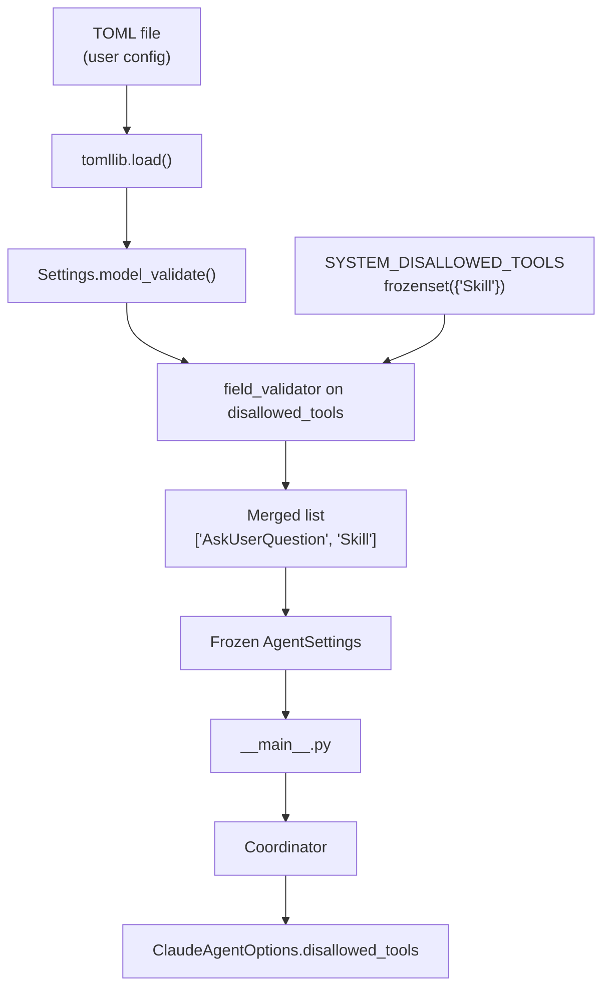

# Design: DLT-087 - Disable Claude Code built-in skills in default config

**Delta Spec**: [../delta-specs/DLT-087.md](../delta-specs/DLT-087.md)
**Status**: Draft

## Purpose

This document explains the design rationale for this delta: the modeling choices, data flow, system behavior, and architectural approach.

After implementation, the "Detected Impacts" section will guide reconciliation into feature design docs.

## Problem Context

Claude Code ships with a built-in `Skill` tool (slash-command system) that shadows Tachikoma's own skill subsystem. When both are available, the agent conflates the two systems and routes skill invocations incorrectly. The `Skill` tool must be blocked at the SDK level via `disallowed_tools`.

**Constraints:**
- The block must be non-overridable — present even when a user customizes `disallowed_tools` in their config
- User-configured disallowed tools must be preserved (non-destructive merge)
- The auto-generated default config should reflect the effective merged result
- DLT-073 will later extend the same system-level set with cron tools (`CronCreate`, `CronDelete`, `CronList`), so the mechanism must be extensible

## Design Overview

A module-level constant defines the system-blocked tools set. A Pydantic `field_validator` on `AgentSettings.disallowed_tools` merges this set into whatever the user configured, deduplicating while preserving insertion order. The default config generator is updated to reflect the effective (post-validator) default rather than the raw field default.

No new modules, no new dependencies, no changes to the Coordinator or SDK integration layer — the merge happens entirely within the config model, so all downstream consumers automatically receive the merged list.

## Shape

| Part | Mechanism | Flag |
|------|-----------|:----:|
| **S1** | Define `SYSTEM_DISALLOWED_TOOLS = frozenset({"Skill"})` as a module-level constant in `config.py` | |
| **S2** | Add `@field_validator('disallowed_tools', mode='after')` on `AgentSettings` that merges the system set into the user value, deduplicating with `dict.fromkeys` to preserve insertion order | |
| **S3** | Update the default config generator: instantiate a default `AgentSettings()` before the field loop, then read each field's value from the instance (`getattr(defaults, name)`) instead of `field_info.default` — the loop still iterates `model_fields` for names and descriptions | |

## Components

### Implementation Structure

| Layer/Component | Responsibility | Key Decisions |
|-----------------|----------------|---------------|
| `src/tachikoma/config.py` — constant | Defines system-blocked tools as an immutable set | `frozenset` for immutability and clear intent |
| `src/tachikoma/config.py` — `AgentSettings` | Merges system tools into user-configured `disallowed_tools` via field validator | `field_validator` over `model_validator` — avoids frozen-model workaround |
| `src/tachikoma/config.py` — `_generate_default_config()` | Shows effective defaults (including system tools) in the auto-generated config | Reads from default instance instead of raw field metadata |

### Cross-Layer Contracts

**Integration Points**:
- No contract changes. The `disallowed_tools` field type (`list[str]`) and its consumption path (`config.py` → `__main__.py` → `Coordinator` → `ClaudeAgentOptions`) remain identical. The merge is transparent to all consumers.

## Modeling

The only new domain concept is the **system-level tool block set** — a constant set of tool names that are always blocked regardless of user configuration.

```
SYSTEM_DISALLOWED_TOOLS: frozenset[str]  ──merge──►  AgentSettings.disallowed_tools: list[str]
                                                              ▲
                                                     User config (TOML)
```

The merge produces a `list[str]` — user entries first (preserving their order), then system entries that aren't already present. The result type is unchanged from the current `list[str]`.

## Data Flow



**Step-by-step:**
1. TOML is loaded — `disallowed_tools` may be absent (default `["AskUserQuestion"]`), explicitly set, or empty (`[]`)
2. Pydantic validates the field value as `list[str]`
3. The `field_validator(mode='after')` runs: merges user list with `SYSTEM_DISALLOWED_TOOLS`, deduplicates via `dict.fromkeys`
4. Result is stored in the frozen `AgentSettings` instance
5. All downstream consumers receive the merged list without changes

## Key Decisions

### field_validator over model_validator

**Choice**: Use `@field_validator('disallowed_tools', mode='after')` instead of `@model_validator(mode='after')`
**Why**: The merge involves only one field and a module-level constant — no cross-field access needed. A `field_validator` receives the value and returns the merged result directly. A `model_validator` on a frozen model would require `object.__setattr__` to bypass the immutability guard, adding unnecessary complexity.
**Sources**: Pydantic v2 docs — `field_validator` is a classmethod that receives and returns the field value; `model_validator(mode='after')` receives `self` and requires `object.__setattr__` on frozen models.
**Options Researched**:
- `field_validator(mode='after')`: Classmethod, receives value, returns merged value. No frozen-model workaround needed.
- `model_validator(mode='after')`: Instance method, full `self` access. Requires `object.__setattr__` on frozen models. More powerful but unnecessary here.
- `field_validator(mode='before')`: Runs before type validation — would need to handle non-list inputs. Unnecessarily complex.
**Why This Over Alternatives**: Simplest approach that satisfies requirements. Follows existing codebase pattern (`env` field already uses a `field_validator`).

**Consequences**:
- Pro: Simplest implementation, no frozen-model workarounds
- Pro: Consistent with existing `field_validator` pattern on `AgentSettings.env`
- Con: Cannot access other fields — acceptable since the merge only needs the constant

### frozenset for system constant

**Choice**: Use `frozenset` for `SYSTEM_DISALLOWED_TOOLS`
**Why**: Communicates immutability. Prevents accidental mutation. Set semantics enable O(1) membership checks (relevant when DLT-073 extends this with cron tools).
**Options Researched**:
- `frozenset`: Immutable, set semantics, hashable
- `tuple`: Immutable but ordered and allows duplicates — weaker semantics
- `set`: Mutable — could be accidentally modified
**Why This Over Alternatives**: `frozenset` best communicates "fixed set of tool names that never changes at runtime."

**Consequences**:
- Pro: Immutable, clear semantics
- Pro: DLT-073 can extend by defining its own constant and unioning

### Effective defaults in config generator

**Choice**: Instantiate a default `AgentSettings()` in the config generator and read attribute values instead of raw `field_info.default`
**Why**: The raw `field_info.default` for `disallowed_tools` is `["AskUserQuestion"]` — it doesn't reflect the validator's merge. Reading from a default instance naturally picks up any validators, including the new system-tools merge.
**Options Researched**:
- Read from default instance: General, future-proof — any validator on any field is automatically reflected
- Special-case `disallowed_tools` in the generator: Targeted but fragile — must be updated whenever a new validated field is added
- Change the field's Pydantic default to include `"Skill"`: Duplicates the constant, diverges from the "user default" semantics
**Why This Over Alternatives**: General approach that works for any validated field, not just this one. No special-casing.

**Consequences**:
- Pro: Config generator automatically reflects all validators
- Pro: No field-specific special-casing in the generator
- Con: Creates a throwaway `AgentSettings()` instance during config generation — negligible cost

## System Behavior

### Scenario: Default config — no user customization

**Given**: A fresh install with no explicit `disallowed_tools` in the TOML file
**When**: Settings are loaded
**Then**: The field default `["AskUserQuestion"]` is validated, the `field_validator` merges in `"Skill"`, and the effective list is `["AskUserQuestion", "Skill"]`
**Rationale**: System tools are always present, even with defaults

### Scenario: User has custom disallowed tools

**Given**: A user config with `disallowed_tools = ["AskUserQuestion", "WebSearch"]`
**When**: Settings are loaded
**Then**: The effective list is `["AskUserQuestion", "WebSearch", "Skill"]` — all user entries preserved, "Skill" appended
**Rationale**: Non-destructive merge preserves user intent (R3)

### Scenario: User sets empty list

**Given**: A user config with `disallowed_tools = []`
**When**: Settings are loaded
**Then**: The effective list is `["Skill"]` — system block still present
**Rationale**: Non-overridable (R2) — even an empty list gets the system tools

### Scenario: User already includes "Skill"

**Given**: A user config with `disallowed_tools = ["AskUserQuestion", "Skill"]`
**When**: Settings are loaded
**Then**: The effective list is `["AskUserQuestion", "Skill"]` — no duplicate
**Rationale**: `dict.fromkeys` deduplicates while preserving first occurrence order

### Scenario: Auto-generated config

**Given**: No config file exists
**When**: The default config is generated
**Then**: The commented `disallowed_tools` line shows `["AskUserQuestion", "Skill"]` — reflecting the effective merged default
**Rationale**: User sees what's actually in effect, not the raw field default

## Open Questions

None — all design decisions resolved.

---

## Detected Impacts

### Affected Feature Designs
- **docs/feature-designs/configuration/config-system.md** - Modifies: The modeling section's `AgentSettings` model tree needs to document the system-level merge on `disallowed_tools` and the `SYSTEM_DISALLOWED_TOOLS` constant
- **docs/feature-specs/configuration/config-system.md** - Modifies: The AC on line 39 states `agent.disallowed_tools` defaults to `["AskUserQuestion"]` — needs updating to reflect the effective merged default `["AskUserQuestion", "Skill"]` and document the system-level merge behavior

### Notes for Reconciliation
- Update config-system feature spec AC to document that the effective default for `disallowed_tools` is `["AskUserQuestion", "Skill"]` due to system-level merge
- Update config-system feature design modeling section to show `SYSTEM_DISALLOWED_TOOLS` and the merge validator
- Document that `"Skill"` is always present in the final disallowed tools list regardless of user config
- Note the extensibility point for DLT-073 (cron tools)

## Notes

- `field_validator` import already exists in `config.py` (used by `WorkspaceSettings.expand_home` and `AgentSettings.validate_env_values`)
- No new dependencies required
- The `frozenset` constant is trivially extensible — DLT-073 can define `SYSTEM_DISALLOWED_CRON_TOOLS` and the validator can union both sets, or simply add entries to the existing constant
- `SYSTEM_DISALLOWED_TOOLS` is a plain module-level constant — importable by tests and by DLT-073 without any export ceremony
