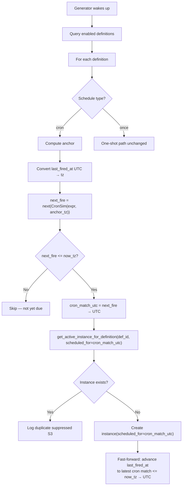

# Design: DLT-090 - Prevent duplicate task instances from scheduler

**Delta Spec**: [../delta-specs/DLT-090.md](../delta-specs/DLT-090.md)
**Status**: Approved

## Purpose

This document explains the design rationale for this delta: the modeling choices, data flow, system behavior, and architectural approach.

After implementation, the "Detected Impacts" section will guide reconciliation into feature design docs.

## Problem Context

The instance generator creates duplicate task instances for the same cron period due to three interacting bugs:

1. **Tolerance window fires early and repeatedly** — the condition `(next_fire - now_tz).total_seconds() < 60` causes the generator to fire before the cron time actually arrives AND to re-fire every 60-second loop iteration while the tolerance holds.
2. **`scheduled_for` stores wall-clock time** — `scheduled_for` is set to `now_utc` (creation time) instead of the cron match time, making it impossible to identify which period an instance belongs to.
3. **Duplicate check is too narrow** — `get_active_instance_for_definition` only considers pending/running instances. Once a task completes within a cron period, the check passes and another instance is created.

**Constraints:**
- The fix must preserve catch-up-on-restart behavior (one instance per missed definition)
- One-shot task behavior must remain unchanged
- The `cronsim` library is already used; no new dependencies needed
- Changes are confined to `scheduler.py` and `repository.py`

## Design Overview

The design tightens the cron firing condition to only fire after a cron match time has definitively passed, and broadens the duplicate check to cover the entire cron period. The key enabler is storing the actual cron match time in `scheduled_for` and `last_fired_at`, which anchors both the duplicate check and future cron evaluation to period boundaries rather than wall-clock times.

## Shape

| Part | Mechanism | Flag |
|------|-----------|:----:|
| **S1** | Remove tolerance window from cron evaluation — change `should_fire` to only fire when `next_fire <= now_tz` (strict, no lookahead). Compute anchor by converting `last_fired_at` from UTC to the evaluation timezone (or start-of-hour in `tz` for first run). Pass anchor to CronSim to get `next_fire`. Convert `next_fire` to UTC as `cron_match_utc`. Set `scheduled_for` to `cron_match_utc`. After creating the instance, fast-forward `last_fired_at` to the latest cron match at or before `now_tz` (to skip intermediate missed periods on catch-up) converted to UTC. | |
| **S2** | Add `scheduled_for` parameter to `get_active_instance_for_definition`. Change query to match instances where `scheduled_for` equals the given time AND status is pending, running, or completed (excludes failed to allow retry). Caller passes `cron_match_utc` from S1. | |
| **S3** | Add info-level log when the safety net (S2) suppresses a duplicate instance, including definition name and the cron match time that was already covered. | |

## Components

### Implementation Structure

| Layer/Component | Responsibility | Key Decisions |
|-----------------|----------------|---------------|
| `src/tachikoma/tasks/scheduler.py` | Cron evaluation and instance creation | Remove tolerance; use cron match time for `scheduled_for` and `last_fired_at` |
| `src/tachikoma/tasks/repository.py` | Period-aware duplicate query | Modify existing method signature; expand status filter to include completed |

### Integration Points

- **Scheduler -> Repository**: `get_active_instance_for_definition(definition_id, scheduled_for=cron_match_utc)` — the new parameter threads the cron match time from firing logic to duplicate check
- **cronsim anchor**: `last_fired_at` is stored as UTC but must be converted to the evaluation timezone (`tz`) before passing to CronSim, since CronSim generates match times in the anchor's timezone. The exclusive-anchor behavior naturally skips already-fired periods

## Modeling

No new entities or schema changes. The existing `TaskInstance.scheduled_for` and `TaskDefinition.last_fired_at` fields change semantics:

| Field | Before | After |
|-------|--------|-------|
| `TaskInstance.scheduled_for` | Wall-clock time when instance was created (`now_utc`) | Cron match time the instance belongs to |
| `TaskDefinition.last_fired_at` | Wall-clock time when instance was created (`now_utc`) | Cron match time that was last fired |

This semantic shift enables period-based deduplication without any schema migration — the column types remain `DateTime(timezone=True)`.

## Data Flow

### Instance generation flow (revised)



**Key changes from current flow:**
1. No tolerance window — strict `next_fire <= now_tz` only
2. `last_fired_at` (UTC) is converted to evaluation timezone before passing to CronSim
3. `cron_match_utc` (derived from `next_fire`) is used for `scheduled_for` and the safety net query
4. After creating an instance, `last_fired_at` is fast-forwarded to the latest cron match at or before `now_tz` (converted to UTC) to limit catch-up to one instance per restart
5. Safety net checks pending/running/completed (not just pending/running)

### Safety net query

```
SELECT * FROM task_instances
WHERE definition_id = :def_id
  AND scheduled_for = :cron_match_utc
  AND status IN ('pending', 'running', 'completed')
LIMIT 1
```

Failed instances are excluded so a new instance can be created as a retry within the same period.

## Key Decisions

### Strict firing condition (no tolerance)

**Choice**: Remove the `< 60` tolerance window entirely, using only `next_fire <= now_tz`.
**Why**: The tolerance was meant to handle timing jitter but actually causes early firing and repeated firing within the same period. CronSim already handles the timing correctly — if the generator wakes up slightly late (up to `GENERATION_INTERVAL_SECONDS`), the next fire time has already passed, so the strict condition fires correctly. The spec explicitly accepts firing up to 60s late (R1).

**Consequences**:
- Pro: Eliminates the root cause of duplicate firing
- Pro: Simpler, easier to reason about
- Con: A task scheduled for 09:00 fires at 09:00-09:59 depending on generator alignment (acceptable per R1)

### Cron match time as `scheduled_for`; fast-forwarded anchor as `last_fired_at`

**Choice**: Store the cron match time (from CronSim's `next_fire`, converted to UTC) in `scheduled_for`. For `last_fired_at`, fast-forward to the latest cron match at or before `now_tz` (converted to UTC) instead of storing `cron_match_utc` directly.
**Why**: Using the cron match time for `scheduled_for` creates a stable period identifier that enables deduplication. Multiple generator iterations within the same period produce the same `cron_match_utc`, so the safety net can detect duplicates. Fast-forwarding `last_fired_at` to the latest match before now ensures that after a restart with multiple missed periods, only one catch-up instance is created — subsequent CronSim evaluations anchor past all missed periods and land on the next future period.

**Consequences**:
- Pro: Enables period-based deduplication (S2)
- Pro: CronSim anchor naturally advances to next period
- Pro: `scheduled_for` now has clear semantic meaning ("which period is this for")
- Pro: Catch-up is limited to one instance per definition per restart (R4)
- Con: Existing instances in the database have `scheduled_for` = wall-clock time (no migration needed — they'll simply never match a future cron match time, so no false duplicate suppression)

### Convert `last_fired_at` to evaluation timezone for CronSim anchor

**Choice**: Convert `last_fired_at` from UTC to the configured evaluation timezone before passing it as the CronSim anchor.
**Why**: CronSim generates match times in the anchor's timezone. Since `last_fired_at` is stored as UTC, passing it directly to CronSim would generate matches at "9am UTC" instead of "9am local" for expressions like `0 9 * * *`. Converting to the evaluation timezone ensures cron matches are computed in the user's timezone. This fixes a pre-existing bug in the current code where the UTC anchor produces incorrect match times for non-UTC timezones.

**Consequences**:
- Pro: Cron expressions evaluate correctly in non-UTC timezones
- Pro: Fixes a pre-existing timezone bug
- Con: None — the conversion is a single `.astimezone(tz)` call

### Modify existing method in-place (Option A)

**Choice**: Add `scheduled_for` parameter to `get_active_instance_for_definition` and change its query semantics, rather than creating a new method.
**Why**: The method is only called from one place (`instance_generator`). Creating a new method would leave the old one unused. Modifying in-place keeps the API surface small.

**Consequences**:
- Pro: Minimal diff, no dead code
- Pro: Single method for duplicate checking
- Con: Method name doesn't fully reflect new semantics (checks period, not just "active" instances) — acceptable since the docstring will be updated

## System Behavior

### Scenario: Normal cron period — single fire

**Given**: An enabled cron task definition with `last_fired_at` from the previous period
**When**: The generator wakes up after the next cron match time has passed
**Then**: `last_fired_at` is converted from UTC to the evaluation timezone and passed as the CronSim anchor. CronSim computes `next_fire` after the anchor. Since `next_fire <= now_tz`, the safety net is checked. No instance exists for this period. A pending instance is created with `scheduled_for = cron_match_utc`. `last_fired_at` is fast-forwarded to the latest cron match at or before `now_tz` (which in the normal case equals `cron_match_utc` since only one period has passed).
**Rationale**: This is the happy path — each period produces exactly one instance.

### Scenario: Same period re-evaluated — no duplicate

**Given**: A cron task that already fired in the current period (instance exists with matching `scheduled_for`)
**When**: The generator runs again within the same period
**Then**: `last_fired_at` was updated to `cron_match_utc`, so CronSim anchors past the current period and returns the next period's match time. Since that time hasn't passed yet, `next_fire > now_tz`, and the generator skips without even reaching the safety net.
**Rationale**: The primary dedup mechanism is the `last_fired_at` anchor advancing past the current period. The safety net (S2) is a backup for edge cases.

### Scenario: Safety net catches duplicate (edge case)

**Given**: A race condition or unexpected state where `last_fired_at` wasn't updated but an instance already exists for the current period
**When**: The generator evaluates the definition and `next_fire <= now_tz`
**Then**: The safety net finds an existing instance with matching `scheduled_for` (pending, running, or completed). No new instance is created. An info log is emitted.
**Rationale**: Defense in depth — the safety net catches anything the primary mechanism misses.

### Scenario: Failed instance allows retry

**Given**: A cron task where the instance for the current period has status `failed`
**When**: The generator evaluates the definition
**Then**: If `last_fired_at` was updated (normal case), CronSim skips to the next period. If `last_fired_at` wasn't updated (crash before update), the safety net query excludes failed instances, allowing a new instance to be created for the same period.
**Rationale**: Failed tasks should be retryable within the same period (R2).

### Scenario: Catch-up after restart

**Given**: The system was down for multiple cron periods (e.g., a `*/5 * * * *` task missed 3 periods)
**When**: The generator runs after restart
**Then**: `last_fired_at` still holds the last fired cron match time (converted to `tz` for the anchor). CronSim computes the first match after that, which has already passed. One catch-up instance is created with `scheduled_for = cron_match_utc` (the first missed period). Then `last_fired_at` is fast-forwarded to the latest cron match at or before `now_tz` — this skips all intermediate missed periods. On the next iteration, CronSim anchors past all missed periods and returns the next future period, which hasn't passed yet, so no additional instances are created.
**Rationale**: The fast-forward mechanism ensures exactly one catch-up instance per definition per restart event (R4), regardless of how many periods were missed.

### Scenario: One-shot task unchanged

**Given**: An enabled one-shot task definition with `last_fired_at is None`
**When**: The scheduled datetime has passed
**Then**: The one-shot code path is unaffected by cron changes — it uses `schedule.at` for `scheduled_for` (already the correct time). The definition is disabled after firing.
**Rationale**: One-shot path is separate from cron path in the generator (R5).

### Scenario: Generator wakes up just before cron boundary

**Given**: A cron task with expression `*/5 * * * *`, current time is 09:04:58
**When**: The generator evaluates the definition
**Then**: CronSim gives `next_fire = 09:05`. Since `09:05 > 09:04:58`, `should_fire` is false. On the next iteration (~60s later at ~09:05:58), `09:05 <= 09:05:58`, so it fires. The task fires up to 60s late, which is acceptable per R1.
**Rationale**: No tolerance window means no early firing. Lateness is bounded by `GENERATION_INTERVAL_SECONDS`.

## Open Questions

None — all unknowns resolved during research.

---

## Detected Impacts

### Affected Feature Designs
- **docs/feature-designs/tasks/task-management.md** - Modifies: Instance generation flow (Data Flow section), duplicate prevention logic (System Behavior), `scheduled_for` semantics (Modeling)

### Notes for Reconciliation
- Update "Instance generation flow" in Data Flow to reflect strict firing condition and cron match time usage
- Update `scheduled_for` description in Modeling to say "cron match time" instead of "when the instance should execute"
- Add note about period-based deduplication in System Behavior scenarios
- Update "Instance Generation" acceptance criteria to reflect cron-period-aware dedup (covers pending/running/completed)

## Notes

- `cronsim` anchor behavior confirmed: `CronSim(expr, anchor)` yields times strictly after the anchor, so passing the cron match time as `last_fired_at` naturally skips to the next period
- `last_fired_at` must be converted from UTC to the evaluation timezone before passing to CronSim — CronSim generates matches in the anchor's timezone
- The fast-forward for `last_fired_at` can be implemented by iterating CronSim from `cron_match_utc` until the next match exceeds `now_tz`, then using the last match that didn't exceed it
- No database migration needed — `scheduled_for` and `last_fired_at` column types are unchanged; only the stored values change semantically
- Existing instances with old `scheduled_for` values won't cause false duplicate suppression since they'll never match a future cron match time
- This delta also fixes a pre-existing timezone bug where `last_fired_at` (UTC) was passed directly to CronSim without timezone conversion
