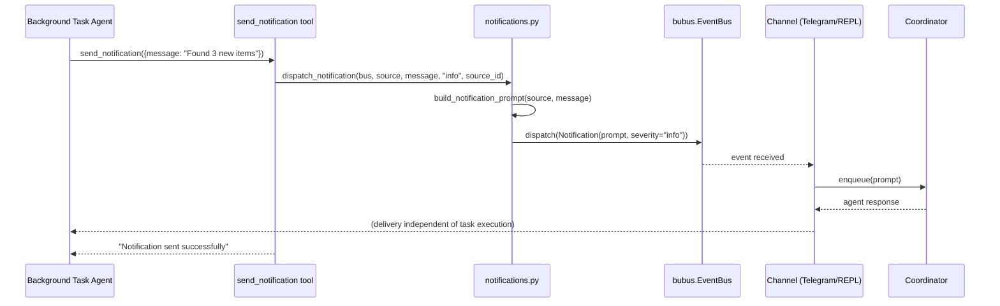
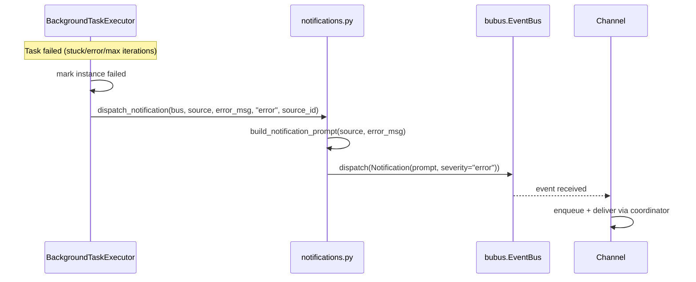

# Design: DLT-091 — Replace task notify field with agent-driven notification tool

**Delta Spec**: [../delta-specs/DLT-091.md](../delta-specs/DLT-091.md)
**Status**: Draft

## Purpose

This document explains the design rationale for this delta: the modeling choices, data flow, system behavior, and architectural approach.

After implementation, the "Detected Impacts" section will guide reconciliation into feature design docs.

## Problem Context

Background task notifications are currently gated by a static `notify` field on `TaskDefinition`. When set, the executor forks the task session with the `notify` prompt to generate a context-aware message; when null, successful tasks complete silently. This all-or-nothing approach decided at task creation time has several limitations:

- The agent cannot decide *at runtime* whether results are worth notifying about
- No support for progress updates during long-running tasks
- The fork-based generation adds latency (one SDK invocation) and complexity (fallback chain)
- The `notify` field mixes concerns — it's both a flag ("should I notify?") and an instruction ("generate text using this prompt")

**Constraints:**
- `TaskNotification` events are consumed by both Telegram and REPL channels — any event type change must update both subscribers
- The existing `SessionTaskReady` event in `tasks/events.py` is unaffected and stays in the tasks package
- Database migration must handle existing databases that have the `notify` column with data
- The MCP tool must only be available during background task execution, not in regular conversations

**Interactions:**
- Background task executor (`executor.py`): registers notification MCP server, calls shared dispatch for failures
- Channels (`telegram.py`, `repl.py`): subscribe to notification events and route through coordinator
- Event bus (ADR-009): dispatches generic notification events
- System preamble (`context/loading.py`): describes available tools to the agent
- Database (`database.py`): schema migration to drop column

## Design Overview

The notification capability is extracted from the tasks subsystem into a standalone `src/tachikoma/notifications.py` module. This module owns the generic `Notification` event type, a unified prompt template builder, a shared dispatch function, and a `send_notification` MCP tool server factory. The executor's fork-based notification generation is removed entirely — the background task agent calls `send_notification` directly during execution for success notifications, while the executor calls the shared dispatch function for automatic failure notifications.

```
┌─────────────────────────────────────────────────────┐
│                 notifications.py                     │
│                                                      │
│  Notification(BaseEvent)    ← generic event type     │
│  build_prompt(source, content)                       │
│  dispatch_notification(bus, source, content, ...)    │
│  create_notification_server(bus, source, source_id)  │
│    └─ send_notification tool                         │
│         └─ calls dispatch_notification()             │
└──────────────────────┬──────────────────────────────┘
                       │
         ┌─────────────┼──────────────┐
         │             │              │
    ┌────▼────┐  ┌─────▼─────┐  ┌────▼────┐
    │Executor │  │ Telegram  │  │  REPL   │
    │(failure │  │ Channel   │  │ Channel │
    │ path)   │  │(subscribe)│  │(subscribe│
    └─────────┘  └───────────┘  └─────────┘
```

## Shape

| Part | Mechanism | Flag |
|------|-----------|:----:|
| **S1** | Drop `notify` column from `task_definitions` via `ALTER TABLE DROP COLUMN` in `_run_migrations()` — pragma check if column exists, then drop | |
| **S2** | Remove `notify` from `TaskDefinition` dataclass, `TaskDefinitionRecord` ORM model, `CreateTaskArgs`, `UpdateTaskArgs`, `list_tasks` output in `tools.py`, and `TaskRepository` (`create_definition` record construction, `update_definition` accepted fields docstring) | |
| **S3** | Remove `_generate_notification()`, `_dispatch_notification()`, `fork_and_capture` import, and all notification prompt constants from executor; failure path calls `dispatch_notification()` from the notifications module. Cancellation path (`CancelledError`) remains unchanged — no notification on cancel, matching current behavior | |
| **S4** | Create `src/tachikoma/notifications.py` with: (a) `Notification` event (generic, replaces `TaskNotification`), (b) `build_notification_prompt(source, content)` — single template builder with generic framing, (c) `dispatch_notification(bus, source, content, severity, source_id)` — builds prompt and dispatches event, (d) `create_notification_server(bus, source, source_id)` — DES-006 factory producing `send_notification` MCP tool that calls `dispatch_notification()` | |
| **S5** | Executor registers the notification MCP server on the background SDK client's `mcp_servers` — factory receives bus and task context; tool only available during background execution | |
| **S6** | Update `SYSTEM_PREAMBLE` Tasks section (remove `notify` references) and `BACKGROUND_TASK_SYSTEM_PROMPT` (add `send_notification` guidance) | |
| **S7** | Update all `TaskNotification` subscribers (Telegram channel, REPL channel, `tasks/__init__.py`) to import `Notification` from the new module; remove `TaskNotification` from `tasks/events.py` | |

## Components

### Implementation Structure

| Layer/Component | Responsibility | Key Decisions |
|-----------------|----------------|---------------|
| `src/tachikoma/notifications.py` | Generic notification module: `Notification` event type, `build_notification_prompt()` template builder, `dispatch_notification()` shared dispatch, `create_notification_server()` MCP tool factory | Standalone module (not in tasks package) for reusability; single dispatch path for all notification sources; DES-006 factory pattern |
| `src/tachikoma/tasks/executor.py` | Background task execution; registers notification MCP server per-execution; calls `dispatch_notification()` for failure path | Removes `_generate_notification()`, `_dispatch_notification()`, `fork_and_capture` import, and notification prompt constants |
| `src/tachikoma/tasks/model.py` | Domain types and ORM — `notify` field removed from `TaskDefinition` and `TaskDefinitionRecord` | Field removal only; no structural changes |
| `src/tachikoma/tasks/repository.py` | Remove `notify` from `create_definition` record construction and `update_definition` accepted fields docstring | Docstring and field cleanup only |
| `src/tachikoma/tasks/tools.py` | MCP tools for task management — `notify` removed from create/update args and list output | Parameter removal only |
| `src/tachikoma/tasks/events.py` | `SessionTaskReady` remains; `TaskNotification` removed (moved to notifications module as `Notification`) | Only `SessionTaskReady` stays in the tasks package |
| `src/tachikoma/tasks/__init__.py` | Re-exports updated — removes `TaskNotification` | Channels import `Notification` from `notifications` module directly |
| `src/tachikoma/database.py` | `_run_migrations()` gains a pragma check + `ALTER TABLE DROP COLUMN` for `notify` | Reverse of existing add-column pattern |
| `src/tachikoma/context/loading.py` | `SYSTEM_PREAMBLE` Tasks section updated | Remove `notify` references from tool descriptions |
| `src/tachikoma/telegram.py` | Subscribes to `Notification` instead of `TaskNotification` | Import path change only |
| `src/tachikoma/repl.py` | Subscribes to `Notification` instead of `TaskNotification` | Import path change only; queue type annotation updated |

### Cross-Layer Contracts

**Agent-driven notification during background execution:**



**Automatic failure notification:**



**Integration Points:**
- Notification module ↔ Event bus: dispatches `Notification` events
- Executor ↔ Notification module: registers MCP server per-execution, calls dispatch for failures
- Channels ↔ Event bus: subscribe to `Notification` events (same delivery pattern as before)
- MCP tool ↔ Notification module: tool handler calls `dispatch_notification()` — same function as executor failure path

**Error contract:**
- `send_notification` with empty message: returns `is_error` response to agent, no event dispatched
- `dispatch_notification` bus error: logged, does not propagate — bubus `dispatch()` enqueues synchronously and handler exceptions are caught internally (recorded on event results but never raised to the dispatcher). This means both the MCP tool handler and the executor failure path can call `dispatch_notification()` without try/except around the dispatch itself.
- `send_notification` dispatch failure: returns error to agent, task execution continues unaffected

### Shared Logic

- **`dispatch_notification()`**: Single function used by both the MCP tool handler and the executor's failure path — ensures consistent prompt building and event dispatch with no duplication
- **`build_notification_prompt()`**: Single template builder producing the same generic framing (timestamp, notification identification, delivery instruction) regardless of source

## Modeling

### Notification event (replaces TaskNotification)

```
Notification(BaseEvent[None])
├── prompt: str                          (coordinator-routed notification prompt, built by build_notification_prompt)
├── source_id: str | None                (ID of source that triggered this, e.g., task instance ID)
└── severity: Literal["info", "error"]   ("info" for success, "error" for failures)
```

The event is generic — it carries a pre-built prompt and severity, with no task-specific fields. The `source_id` is optional and opaque (any subsystem can provide its own identifier).

### Notification prompt template

```
build_notification_prompt(source: str, content: str) -> str
```

Produces:

```
--- Notification ---
Source: {source}
Time: {timestamp}

{content}

Deliver this notification to the user, keeping your message concise.
```

The `source` parameter is caller-provided (e.g., `"Background task: Daily Report"` or any future notification source). The `content` is the raw message — either the agent's text from `send_notification` or a failure description from the executor.

### TaskDefinition (after change)

```
TaskDefinition (frozen dataclass)
├── id: str
├── name: str
├── schedule: ScheduleConfig
├── task_type: str
├── prompt: str
├── enabled: bool
├── last_fired_at: datetime | None
└── created_at: datetime | None
```

The `notify: str | None` field is removed.

## Data Flow

### Agent-driven notification flow

```
1. Background task agent executes with send_notification tool available
2. Agent decides results are worth notifying:
   a. Calls send_notification(message="Found 3 new relevant papers")
   b. Tool handler validates message is non-empty
   c. Tool handler calls dispatch_notification(bus, source, message, "info", source_id)
   d. dispatch_notification calls build_notification_prompt(source, message) to wrap content
   e. dispatch_notification creates Notification event and dispatches on bus
   f. Tool handler returns success to agent
3. Agent can call send_notification again for progress updates (R7)
4. Channel receives Notification event, enqueues prompt into coordinator
5. Coordinator processes and delivers to user
```

### Failure notification flow

```
1. Executor detects failure (stuck, error, max iterations)
2. Executor marks instance as failed
3. Executor calls dispatch_notification(bus, source, error_description, "error", instance_id)
   where source = f"Background task: {task_name}"
4. Same path as agent-driven: build_notification_prompt → Notification event → bus → channel
```

### Schema migration flow

```
1. Database.initialize() calls _run_migrations()
2. Pragma check: SELECT * FROM pragma_table_info('task_definitions') WHERE name='notify'
3. If column exists: ALTER TABLE task_definitions DROP COLUMN notify
4. Log migration completed
```

## Key Decisions

### Generic notification module outside tasks package

**Choice**: Create `src/tachikoma/notifications.py` as a standalone module rather than keeping notification logic in `tasks/`.
**Why**: Notifications are a cross-cutting concern. The event type, prompt template, and dispatch function have no inherent dependency on the task subsystem. Future notification sources (e.g., memory system alerts, project change notifications) can use the same module without depending on the tasks package.

**Alternatives Considered**:
- `src/tachikoma/tasks/notifications.py`: Keeps notification code in the tasks package. Rejected because it couples a generic capability to a specific subsystem and would require future notification sources to import from tasks.
- Notification logic inline in executor: Current approach. Rejected because it duplicates the dispatch pattern between success and failure paths and can't be reused.

**Consequences**:
- Pro: Any subsystem can dispatch notifications without importing from tasks
- Pro: Clean separation — tasks package focuses on scheduling and execution
- Con: New top-level module to maintain

### Single dispatch path for all notifications

**Choice**: Both the `send_notification` MCP tool and the executor's failure path call the same `dispatch_notification()` function.
**Why**: Avoids duplicating prompt building and event dispatch logic. The only difference between the two paths is who calls the function and the severity level — the shared function handles everything else.

**Consequences**:
- Pro: One place to change if prompt format or dispatch behavior evolves
- Pro: Guaranteed consistency between agent-driven and failure notifications
- Con: None significant

### ALTER TABLE DROP COLUMN for notify removal

**Choice**: Use SQLite's `ALTER TABLE ... DROP COLUMN` directly rather than a table rebuild.
**Why**: The `notify` column is nullable, not indexed, not part of any constraint, and not referenced by foreign keys — it qualifies for direct drop. Python 3.12+ bundles SQLite 3.41.2+, well above the 3.35.0 minimum required for `DROP COLUMN` support. The migration uses the same pragma-based check pattern as existing add-column migrations but in reverse.
**Sources**: SQLite documentation (3.35.0 release notes), Python 3.12/3.13 bundled SQLite versions.

**Alternatives Considered**:
- Table rebuild (CREATE new → copy → DROP old → rename): Universally compatible but unnecessarily complex given the SQLite version guarantee.
- Leave column in place, just stop using it: Simpler migration but leaves dead schema and potential confusion.

**Consequences**:
- Pro: Clean schema — no dead columns
- Pro: Simple, reversible migration step
- Con: Would fail on SQLite < 3.35.0 (not a concern with Python 3.12+ requirement)

### Notification MCP server registered per-execution

**Choice**: The `create_notification_server()` factory is called per-execution in `BackgroundTaskExecutor`, capturing the event bus, task name, and instance ID via closure. The resulting server is added to the executor's `ClaudeAgentOptions.mcp_servers`.
**Why**: The `send_notification` tool needs per-execution context (which task is running, its name for the prompt source) and must only be available during background task execution — not in regular conversations. The DES-006 factory pattern supports exactly this: per-invocation state captured in closures, server registered only where needed.

**Consequences**:
- Pro: Tool is scoped to background execution — agent can't call it in conversations
- Pro: Each execution gets its own tool instance with correct task context
- Pro: Follows established DES-006 pattern
- Con: One more MCP server per background task execution (negligible overhead)

## System Behavior

### Scenario: Agent sends notification during background task

**Given**: A background task is executing with `send_notification` available
**When**: The agent calls `send_notification` with message "Found 3 new papers on quantum computing"
**Then**: The message is wrapped with the generic notification template (source = "Background task: {task_name}", timestamp, framing), a `Notification` event with severity "info" is dispatched, and the tool returns success to the agent. The channel receives the event and routes it through the coordinator for delivery.
**Rationale**: The agent controls when and what to notify — it can evaluate its results and decide whether they're worth surfacing.

### Scenario: Agent sends multiple notifications

**Given**: A long-running background task is executing
**When**: The agent calls `send_notification` at different stages ("Starting analysis...", "Processed 50/100 items", "Analysis complete: 3 anomalies found")
**Then**: Each call independently dispatches a `Notification` event and is delivered independently. No state accumulates between calls.
**Rationale**: Each dispatch is stateless — the tool just wraps and dispatches.

### Scenario: Agent sends empty notification

**Given**: A background task is executing
**When**: The agent calls `send_notification` with an empty message
**Then**: The tool returns an error response ("Message cannot be empty") without dispatching any event. Task execution continues.
**Rationale**: Empty notifications provide no value and would produce malformed prompts.

### Scenario: Background task fails

**Given**: A background task reaches max iterations / gets stuck / throws an error
**When**: The executor detects the failure
**Then**: The instance is marked failed, and `dispatch_notification()` is called with source = "Background task: {task_name}", the error description, severity "error", and instance ID. The same prompt template and dispatch path as agent-driven notifications is used.
**Rationale**: Failure notifications are automatic because the agent can no longer act after failure. The shared dispatch function ensures consistent formatting.

### Scenario: Agent sends notification then task fails

**Given**: A background task agent called `send_notification` with a progress update
**When**: The task subsequently fails
**Then**: Both the agent's notification and the automatic failure notification are delivered independently — they are separate `Notification` events dispatched at different times.
**Rationale**: Notifications are fire-and-forget; each dispatch is independent.

### Scenario: Notification dispatch fails

**Given**: A background task agent calls `send_notification`
**When**: The event bus dispatch encounters an error (e.g., handler throws)
**Then**: bubus catches the handler exception internally (errors are recorded on the event but not propagated). The `dispatch_notification()` function logs the dispatch and returns. The tool handler returns success to the agent. Task execution is unaffected.
**Rationale**: Notification delivery should never interfere with task execution. bubus's error isolation makes this the default behavior.

### Scenario: send_notification called outside background execution

**Given**: The agent is in a normal conversation (not a background task)
**When**: It attempts to use `send_notification`
**Then**: The tool is not available — it doesn't appear in the MCP tool listing because the notification server is only registered on the executor's SDK client, not on the coordinator's base MCP servers.
**Rationale**: The tool is scoped by construction — it's only added to `mcp_servers` during background execution.

## Open Questions

None — all unknowns resolved during design.

---

## Detected Impacts

### Affected Feature Designs
- **docs/feature-designs/tasks/task-management.md** — Modifies: TaskDefinition model diagram (drop `notify`), MCP tools component description (remove `notify` from create/update/list), preamble key decision (remove `notify` behavioral note), ER diagram (remove `notify` from TaskDefinition entity), notes section (remove `notify` explanation)
- **docs/feature-designs/tasks/background-task-execution.md** — Modifies: Notification section rewritten (agent-driven via tool instead of fork-based), "Fork-based notification generation" key decision replaced with "Agent-driven notification via MCP tool", sequence diagram updated (remove fork path, show tool dispatch), data flow updated (remove fork, add tool path), system behavior scenario "Background task completes with notification" rewritten, `BACKGROUND_TASK_SYSTEM_PROMPT` content updated, component table updated (executor no longer owns notification generation), cross-layer contracts updated (no fork, tool-based dispatch), remove `fork_and_capture` from integration points

### Notes for Reconciliation
- `TaskNotification` event references in both feature designs should become `Notification` (from `tachikoma.notifications`)
- The "Fork-based notification generation with coordinator routing" key decision in background-task-execution design is fully superseded
- The `notify` field description in task-management design's notes section should be removed
- The ER diagram in task-management design needs `notify` removed from `TaskDefinition` entity
- Preamble documentation in task-management design needs tool descriptions updated (no `notify` parameter)
- The background-task-execution component table should note that the notification MCP server is registered per-execution
- `BACKGROUND_TASK_SYSTEM_PROMPT` content in background-task-execution design needs updating

## Notes

- The `Notification` event is intentionally generic — it carries `source_id` (opaque string) rather than `source_task_id`, enabling future non-task notification sources
- The `build_notification_prompt()` function accepts a `source` string rather than structured task metadata — this keeps the notification module decoupled from task domain concepts
- bubus `dispatch()` is synchronous (enqueue) with async handler execution — calling `await bus.dispatch(event)` waits for handlers to complete, but handler errors are caught internally and don't propagate, so dispatch is safe to call from both MCP tool handlers and the executor
