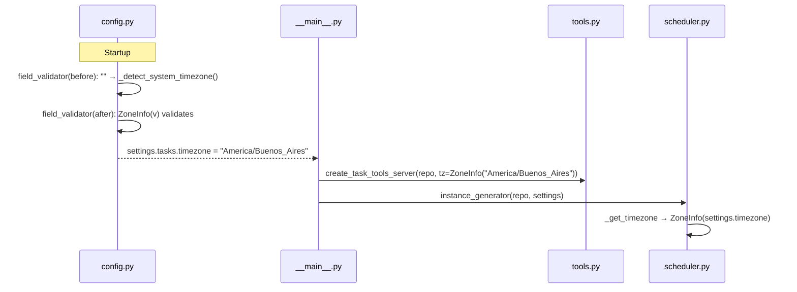
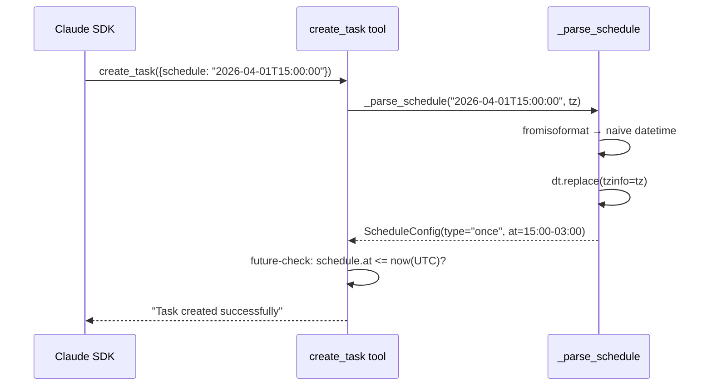
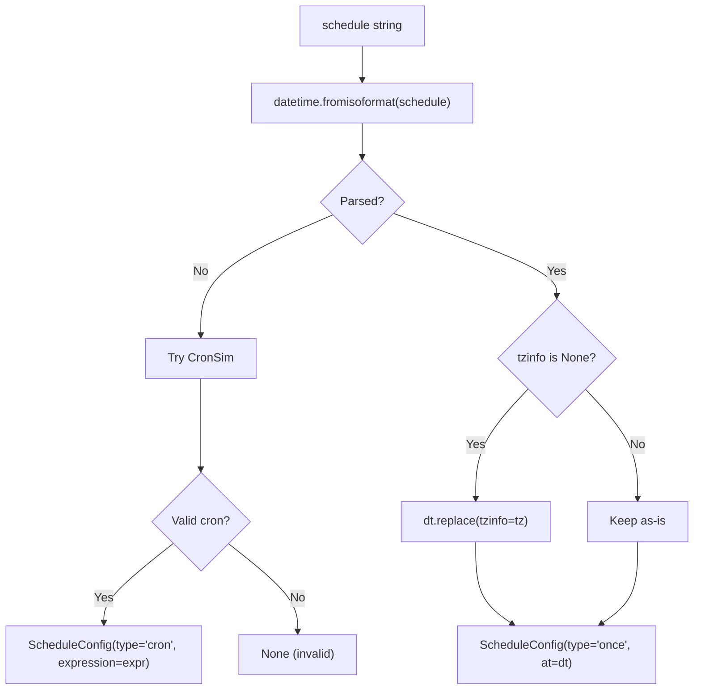

# Design: DLT-092 - Timezone-aware scheduling for one-shot tasks

**Delta Spec**: [../delta-specs/DLT-092.md](../delta-specs/DLT-092.md)
**Status**: Draft

## Purpose

This document explains the design rationale for this delta: the modeling choices, data flow, system behavior, and architectural approach.

After implementation, the "Detected Impacts" section will guide reconciliation into feature design docs.

## Problem Context

One-shot task schedules specified as bare ISO datetimes (e.g., `2026-04-01T15:00:00`) are currently interpreted as UTC. When a user says "remind me at 3pm," the agent creates a task at 15:00 UTC — which fires at the wrong local time. The configured `tasks.timezone` setting exists but only affects cron evaluation in the scheduler; the MCP tools layer ignores it entirely.

Additionally, `TaskSettings.timezone` defaults to an empty string with fallback logic scattered in the scheduler's `_get_timezone()`. Invalid timezone values are silently ignored at runtime rather than failing at startup.

**Constraints:**
- Python 3.12+ (stdlib `zoneinfo` and `tomllib` available; `fromisoformat` handles `Z` suffix)
- Single-user, self-hosted deployment on Linux/macOS
- Pydantic frozen models for configuration (ADR-007 persistence pattern)
- MCP tool server factory pattern (DES-006)

**Interactions:**
- `config.py` (`TaskSettings`): timezone field default and validation
- `tasks/tools.py` (`_parse_schedule`, `_format_schedule`, `create_task_tools_server`): schedule parsing and display
- `tasks/scheduler.py` (`_get_timezone`, `instance_generator`): timezone resolution for cron evaluation
- `context/loading.py` (`SYSTEM_PREAMBLE`): agent guidance on datetime formats
- `__main__.py`: plumbing timezone from settings to task tools server

## Design Overview

The fix centers on two changes: (1) make `TaskSettings.timezone` always resolve to a valid timezone key at config load time, and (2) plumb that timezone into the MCP tools layer so `_parse_schedule` stamps naive datetimes with the configured timezone instead of UTC.

The timezone field stays as `str` in the Pydantic model (for TOML serialization and config generation compatibility) but gains validators that ensure it's always a valid IANA timezone key after loading. System timezone auto-detection resolves the `/etc/localtime` symlink to extract the IANA name (e.g., `America/Buenos_Aires`). Consumers create `ZoneInfo` instances from the validated string (cheap due to `ZoneInfo`'s internal cache).

## Shape

| Part | Mechanism | Flag |
|------|-----------|:----:|
| **S1** | Add a `_detect_system_timezone()` helper and two Pydantic `field_validator`s on `TaskSettings.timezone`: `mode='before'` converts `""` to the system timezone IANA name (resolved from `/etc/localtime` symlink, fallback `"UTC"`); `mode='after'` validates via `ZoneInfo(v)` and raises `ValueError` for invalid strings. Field default stays `""` for config generation; validated value is always a valid IANA timezone key. | |
| **S2** | Simplify `scheduler.py:_get_timezone()` to `return ZoneInfo(settings.timezone)` — no fallback logic since settings are already validated at startup. | |
| **S3** | Add `timezone: ZoneInfo` parameter to `create_task_tools_server()`. In `__main__.py`: `create_task_tools_server(task_repository, timezone=ZoneInfo(settings.tasks.timezone))`. Timezone resolved once at construction, passed to inner tool closures. | |
| **S4** | Rewrite `_parse_schedule(schedule, tz)` — use `datetime.fromisoformat(schedule)` directly (drop `.replace("Z", "+00:00")` since Python 3.12+ handles `Z` natively). If result is naive (`tzinfo is None`), stamp with `dt.replace(tzinfo=tz)`. If aware, preserve as-is. | |
| **S5** | Update `_format_schedule(schedule, tz)` — for one-shot schedules, call `schedule.at.astimezone(tz)` to convert to configured timezone before formatting. | |
| **S6** | Update `create_task` and `update_task` tool description strings to document timezone behavior and accepted datetime formats. | |
| **S7** | Update `SYSTEM_PREAMBLE` Tasks/Scheduling section to document that bare ISO datetimes are interpreted in the user's configured timezone, with format examples (bare, `Z`, offset). | |

### Flagged Unknowns

(none)

## Components

### Implementation Structure

| Layer/Component | Responsibility | Key Decisions |
|-----------------|----------------|---------------|
| `src/tachikoma/config.py` (`TaskSettings`) | Timezone field validation: empty → system tz IANA name, invalid → startup error | `_detect_system_timezone()` helper + two chained `field_validator`s (`before` + `after`); field stays `str` for TOML compat |
| `src/tachikoma/tasks/tools.py` (`create_task_tools_server`) | Receives `ZoneInfo` at construction, passes to `_parse_schedule` and `_format_schedule` | Timezone resolved once in `__main__.py`, shared via closure |
| `src/tachikoma/tasks/tools.py` (`_parse_schedule`) | Parses schedule string into `ScheduleConfig`; stamps naive datetimes with configured tz | Uses `replace(tzinfo=tz)` for naive, preserves aware as-is |
| `src/tachikoma/tasks/tools.py` (`_format_schedule`) | Formats `ScheduleConfig` for display in configured timezone; called from both `list_tasks` and `create_task` closures | Uses `astimezone(tz)` to convert before formatting |
| `src/tachikoma/tasks/scheduler.py` (`_get_timezone`) | Returns `ZoneInfo` from validated settings string | No fallback logic — validation happens at config load |
| `src/tachikoma/__main__.py` | Plumbs timezone from `settings.tasks` to `create_task_tools_server` | `ZoneInfo(settings.tasks.timezone)` resolved once |
| `src/tachikoma/context/loading.py` (`SYSTEM_PREAMBLE`) | Documents datetime format behavior for the agent | Static text update in Scheduling section |

### Cross-Layer Contracts

**Timezone plumbing from config to tools:**



**Task creation with timezone-aware parsing:**



### Shared Logic

- **`ZoneInfo` caching**: `ZoneInfo(key)` returns a cached singleton per key. Multiple calls to `ZoneInfo(settings.tasks.timezone)` in `__main__.py` and `scheduler.py` reuse the same object.
- **`_parse_schedule` and `_format_schedule`**: Both receive `tz: ZoneInfo` as a parameter. These are module-level functions called by the tool closures — the timezone is captured once when the server is created. Both `list_tasks` and `create_task` closures call `_format_schedule`.

## Modeling

No new entities or relationships. The existing `ScheduleConfig.at` field (a `datetime`) gains timezone awareness — it was already `datetime | None`, now it will always be timezone-aware when populated (either from explicit offset or from the configured timezone).

The `TaskSettings.timezone` field type remains `str` but its invariant changes: after validation, it is always a valid IANA timezone key, never an empty string.

## Data Flow

### Datetime parsing flow (updated `_parse_schedule`)



**Examples with `tz = ZoneInfo("America/Argentina/Buenos_Aires")` (UTC-3):**

| Input | `fromisoformat` result | Naive? | Output `at` |
|-------|----------------------|--------|-------------|
| `2026-04-01T15:00:00` | `2026-04-01 15:00:00` (naive) | Yes | `2026-04-01T15:00:00-03:00` |
| `2026-04-01T15:00:00Z` | `2026-04-01 15:00:00+00:00` | No | `2026-04-01T15:00:00+00:00` |
| `2026-04-01T15:00:00+05:30` | `2026-04-01 15:00:00+05:30` | No | `2026-04-01T15:00:00+05:30` |

### Schedule display flow (updated `_format_schedule`)

```
1. Read schedule.at (timezone-aware datetime)
2. Convert: local_dt = schedule.at.astimezone(tz)
3. Format: local_dt.strftime('%Y-%m-%d %H:%M %Z')
```

This ensures all one-shot times display in the user's configured timezone regardless of how they were originally specified.

### Config validation flow (updated `TaskSettings`)

```
1. TOML loads timezone field (string, possibly "")
2. field_validator(mode='before'): "" → _detect_system_timezone()
   → resolves /etc/localtime symlink to IANA name (e.g. "America/Buenos_Aires")
   → falls back to "UTC" if resolution fails
3. Pydantic type coercion (str → str, no-op)
4. field_validator(mode='after'): ZoneInfo(v) — raises ValueError if invalid
5. Result: settings.tasks.timezone is always a valid IANA timezone key
```

## Key Decisions

### Keep timezone field as `str` (not `ZoneInfo`)

**Choice**: The `TaskSettings.timezone` field type remains `str` with Pydantic validators ensuring validity, rather than changing the type to `ZoneInfo`.
**Why**: The field is loaded from TOML (a string) and needs to work with `_generate_default_config()` which inspects field defaults via `isinstance(default, str)`. Changing to `ZoneInfo` would require adjusting config generation logic. Since `ZoneInfo` instances are cached singletons, the cost of `ZoneInfo(settings.timezone)` at consumer call sites is negligible.
**Sources**: Python zoneinfo docs confirm `ZoneInfo(key)` returns a cached singleton per key. Pydantic v2 docs confirm `field_validator` runs during construction on frozen models.
**Options Researched**:
- `ZoneInfo` field type: cleaner consumer API but breaks config generation and TOML serialization assumptions
- `str` with validators: compatible with existing config system, validation still happens at startup
**Why This Over Alternatives**: Minimal disruption to the config subsystem while achieving the same guarantee (invalid values fail at startup).
**Consequences**:
- Pro: Config generation, SettingsManager write-back, and TOML serialization all work unchanged
- Pro: Invalid values still fail at startup with clear Pydantic error
- Con: Consumers must call `ZoneInfo(settings.timezone)` (trivial cost)

### Resolve system timezone via `/etc/localtime` symlink

**Choice**: When `tasks.timezone` is not configured, detect the system timezone by resolving the `/etc/localtime` symlink target and extracting the IANA name from the path (everything after `zoneinfo/`). Falls back to `"UTC"` if resolution fails.
**Why**: Zero extra dependencies. Produces the real IANA timezone name (e.g., `"America/Buenos_Aires"`), which means logs, display, and `ZoneInfo` all use the canonical key. `ZoneInfo("localtime")` was initially considered but fails on many Linux distributions (verified on Arch Linux) because `ZoneInfo` searches `TZPATH` directories, not `/etc/localtime` directly.
**Sources**: Python zoneinfo docs confirm `ZoneInfo` only searches `TZPATH` directories (typically `/usr/share/zoneinfo/`). Verified on the project's Arch Linux dev system: `ZoneInfo("localtime")` raises `ZoneInfoNotFoundError`, while `/etc/localtime` → `/usr/share/zoneinfo/America/Buenos_Aires` resolves correctly.
**Options Researched**:
- `ZoneInfo("localtime")`: fails on Arch Linux and other distros where `/usr/share/zoneinfo/localtime` doesn't exist — **rejected**
- `/etc/localtime` symlink resolution: zero deps, works on Linux/macOS, gives real IANA name
- `tzlocal.get_localzone()`: most robust (handles Windows, containers, non-symlink copies), adds dependency
**Why This Over Alternatives**: Symlink resolution works on the project's target platforms (Linux/macOS). Zero dependencies. Gives the real IANA name for logging clarity. The fallback to `"UTC"` handles edge cases (non-symlink copy, missing file) gracefully.
**Consequences**:
- Pro: Zero new dependencies
- Pro: Logs and display show the real IANA timezone name
- Pro: Correct timezone math (DST transitions, offsets)
- Con: Fails silently to UTC if `/etc/localtime` is a copy (not a symlink) or the path structure doesn't contain `zoneinfo/` — acceptable for single-user self-hosted deployment

### Drop `.replace("Z", "+00:00")` workaround

**Choice**: Use `datetime.fromisoformat(schedule)` directly without pre-processing the `Z` suffix.
**Why**: Python 3.11+ `fromisoformat()` handles `Z` natively. The project requires Python 3.12+, so the workaround is unnecessary.
**Sources**: Python datetime docs confirm `Z` suffix support was added in 3.11.
**Consequences**:
- Pro: Cleaner code
- Pro: Handles the full ISO 8601 format set natively
- Con: None (Python 3.12+ is a hard requirement)

### Use `replace(tzinfo=tz)` for naive datetimes, not `astimezone(tz)`

**Choice**: Stamp naive datetimes with `dt.replace(tzinfo=tz)` rather than `dt.astimezone(tz)`.
**Why**: `replace` means "this datetime is expressed in timezone X" — it preserves the wall-clock values (15:00 stays 15:00). `astimezone` means "convert this instant to timezone X" — it would adjust clock values, which is wrong for a naive datetime where the user intended the wall-clock time.
**Sources**: Python datetime docs: `replace()` returns a datetime with the same date and time but different `tzinfo`; `astimezone()` converts an aware datetime to a target timezone adjusting wall-clock values. Calling `astimezone` on a naive datetime assumes the system local timezone as source, which is unreliable.
**Consequences**:
- Pro: Correct semantics — "3pm" means 3pm in the configured timezone
- Pro: No dependency on system local time during parsing

## System Behavior

### Scenario: Bare datetime interpreted as local time

**Given**: `tasks.timezone` is configured to `"America/Argentina/Buenos_Aires"` (UTC-3)
**When**: The agent calls `create_task` with schedule `"2026-04-01T15:00:00"`
**Then**: `_parse_schedule` produces `2026-04-01T15:00:00-03:00` — the task fires at 3pm Buenos Aires time
**Rationale**: `fromisoformat` returns a naive datetime; `replace(tzinfo=tz)` stamps it with the configured timezone

### Scenario: Explicit UTC preserved

**Given**: Any timezone configuration
**When**: The agent calls `create_task` with schedule `"2026-04-01T15:00:00Z"`
**Then**: `_parse_schedule` produces `2026-04-01T15:00:00+00:00` — the task fires at 3pm UTC
**Rationale**: `fromisoformat` returns an aware datetime with UTC offset; the `tzinfo is None` check is false, so it's preserved as-is

### Scenario: Explicit offset preserved

**Given**: Any timezone configuration
**When**: The agent calls `create_task` with schedule `"2026-04-01T15:00:00+05:30"`
**Then**: `_parse_schedule` produces `2026-04-01T15:00:00+05:30`
**Rationale**: Same logic — aware datetimes pass through unchanged

### Scenario: Future-check with timezone-aware datetime

**Given**: `tasks.timezone` is `"America/Argentina/Buenos_Aires"` (UTC-3), current time is 14:00 ART (17:00 UTC)
**When**: The agent creates a task for `"2026-04-01T15:00:00"` (parsed as 15:00-03:00 = 18:00 UTC)
**Then**: The future-check `schedule.at <= datetime.now(UTC)` compares 18:00 UTC > 17:00 UTC → task accepted
**Rationale**: Python compares timezone-aware datetimes by absolute instant. The comparison in `create_task` remains unchanged.

### Scenario: Invalid timezone at startup

**Given**: `tasks.timezone` is set to `"Fake/Timezone"` in config
**When**: The application starts and Pydantic validates `TaskSettings`
**Then**: The `mode='after'` validator calls `ZoneInfo("Fake/Timezone")`, catches `ZoneInfoNotFoundError`, raises `ValueError`. Pydantic formats this as a clear validation error and the application exits.
**Rationale**: Fail-fast at startup rather than silently falling back at runtime

### Scenario: Display converts to local time

**Given**: A one-shot task was created with schedule `"2026-04-01T18:00:00Z"` and `tasks.timezone` is `"America/Argentina/Buenos_Aires"` (UTC-3)
**When**: `list_tasks` formats the schedule
**Then**: `_format_schedule` calls `schedule.at.astimezone(tz)` → `2026-04-01 15:00 -03` and displays in local time
**Rationale**: Users expect to see times in their timezone regardless of how the task was originally specified

## Open Questions

(none)

---

## Detected Impacts

### Affected Feature Designs
- **docs/feature-designs/tasks/task-management.md** - Modifies: task creation flow (tz plumbing to `create_task_tools_server`), `_parse_schedule` behavior (naive → tz-aware), `_format_schedule` behavior (converts to local tz), tool description content, component table for tools.py (new `timezone` param)
- **docs/feature-designs/configuration/config-system.md** - Modifies: `TaskSettings.timezone` modeling (new validators, default behavior changes from `""` to resolved IANA timezone key)

### Notes for Reconciliation
- task-management feature design: update task creation flow sequence diagram to show tz parameter; update component table for tools.py (new `timezone` param on factory); update _parse_schedule description in Data Flow section
- config-system feature design: update Settings model tree to reflect `timezone: str = "" (validated → IANA key via system detection or explicit value)` instead of `timezone: str | None = None`; note the two validators and `_detect_system_timezone()` helper in the modeling section; update field description to `"Timezone for schedule evaluation (IANA key, e.g. 'America/New_York'; empty = auto-detect system timezone)"`

## Notes

- `ZoneInfo` instances are cached singletons — `ZoneInfo(key)` called multiple times returns the same object
- The existing future-check comparison (`schedule_config.at <= datetime.now(UTC)`) remains correct because Python compares tz-aware datetimes by absolute instant
- The scheduler's cron evaluation (`CronSim`) is unaffected — it already uses the configured timezone via `_get_timezone()`
- `ZoneInfoNotFoundError` is a subclass of `KeyError` — the `mode='after'` validator catches it and re-raises as `ValueError` with a clear message (e.g., `"'Fake/Timezone' is not a valid IANA timezone"`) so Pydantic surfaces a readable startup error
- **Test impact**: The signature changes to `create_task_tools_server` (new `timezone` param), `_parse_schedule` (new `tz` param), and `_format_schedule` (new `tz` param) will require updates to existing tests in `tests/tasks/test_tools.py`. The test `test_parse_iso_datetime_naive_gets_utc` must change to reflect the new behavior (naive → configured tz, not UTC).
- **`ScheduleConfig.from_json`**: The existing `from_json()` in `model.py` stamps naive datetimes with UTC during deserialization. This remains correct because datetimes stored in the database are already tz-aware (stored via `isoformat()`); `from_json` only sees tz-aware ISO strings from the JSON column.
