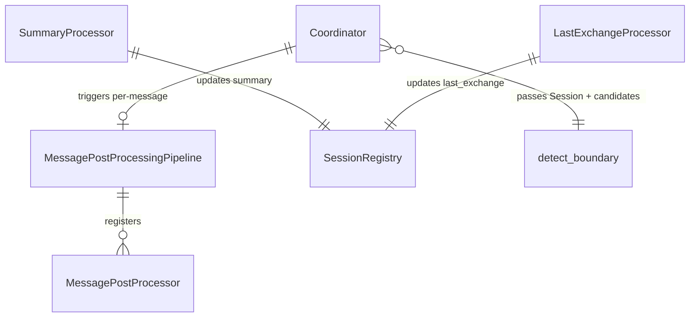

# Design: DLT-096 - Include Last Exchange in Session Resumption Candidates

**Delta Spec**: [../delta-specs/DLT-096.md](../delta-specs/DLT-096.md)
**Status**: Draft

## Purpose

This document explains the design rationale for this delta: the modeling choices, data flow, system behavior, and architectural approach.

After implementation, the "Detected Impacts" section will guide reconciliation into feature design docs.

## Problem Context

The boundary detector evaluates whether an incoming message should resume a previous session, but it only receives the candidate sessions' summaries — rolling condensations of the full conversation. These summaries lose recency: a conversation about "debugging the authentication middleware" might have a summary focused on the initial problem description, while the last exchange was about a specific CORS header fix. When the user sends "did that CORS fix work?", the summary doesn't provide enough signal to match the session.

**Constraints:**
- `last_exchange` must be nullable — sessions start without it, and it may be missing due to pipeline failures
- Boundary detection must proceed with summary-only when `last_exchange` is null (graceful degradation, R2)
- The `agent_response` string is already the pre-aggregated final response text assembled by the coordinator — no additional extraction needed (R5)
- Per-message pipeline error isolation already guarantees that processor failures don't block response delivery

**Interactions:**
- Coordinator: passes the full active `Session` to `detect_boundary()` instead of just the summary string
- Session model: gains a `last_exchange` field, persisted and updated by the per-message pipeline
- Boundary detection: receives richer input for both current session and candidate sessions
- Per-message pipeline: gains a new `LastExchangeProcessor` alongside the existing `SummaryProcessor`

## Design Overview

Four changes layer onto the existing boundary detection and per-message pipeline infrastructure:

```
┌──────────────────────────────────────────────────────────────────┐
│  Per-message pipeline                                            │
│                                                                  │
│  SummaryProcessor       LastExchangeProcessor (NEW)              │
│  summary → session.summary   agent_response → session.last_exchange│
│         ↓                          ↓                              │
│    SessionRegistry.update_summary()  SessionRegistry.update_last_exchange()│
└──────────────────────────────────────────────────────────────────┘

┌──────────────────────────────────────────────────────────────────┐
│  Boundary detection flow (BEFORE → AFTER)                        │
│                                                                  │
│  BEFORE: detect_boundary(text, summary, defaults, candidates)    │
│  AFTER:  detect_boundary(text, session, defaults, candidates)    │
│          → extracts session.summary + session.last_exchange       │
│          → prompt includes last exchange for current + candidates │
└──────────────────────────────────────────────────────────────────┘
```

1. **Session model extension** — Add `last_exchange: str | None` to `Session` dataclass and `SessionRecord` ORM model, with an Alembic migration for the new nullable column.

2. **LastExchangeProcessor** — A new `MessagePostProcessor` that stores the `agent_response` string directly to `session.last_exchange` via the session registry. Simpler than `SummaryProcessor` — no SDK call needed.

3. **detect_boundary signature change** — Accept the full `Session` object instead of a `summary` string, extracting `summary` and `last_exchange` internally when building the prompt.

4. **Prompt enrichment** — Boundary detection prompts include the last assistant response for both the current session and candidate sessions when available.

## Shape

| Part | Mechanism | Flag |
|------|-----------|:----:|
| **S1** | Add `last_exchange` nullable text field to `Session`/`SessionRecord` model + Alembic migration | |
| **S2** | Create `LastExchangeProcessor` (`MessagePostProcessor`) that persists `agent_response` to `session.last_exchange` via registry | |
| **S3** | Add `last_exchange: str | None` to `SessionCandidate` dataclass | |
| **S4** | Update `_query_resume_candidates()` in coordinator to pass `last_exchange` from session records into `SessionCandidate` | |
| **S5** | Change `detect_boundary()` to accept full `Session` object instead of `summary` string — extracts `summary` and `last_exchange` internally | |
| **S6** | Update boundary detection prompt templates to include last exchange for current session and candidates. Current session gets a conditional "Last assistant response" section; each candidate includes `last_exchange` when non-null | |

## Components

### Implementation Structure

| Layer/Component | Responsibility | Key Decisions |
|-----------------|----------------|---------------|
| `sessions/model.py` | Add `last_exchange: str \| None` to `Session` dataclass and `SessionRecord` ORM model | Nullable, no default — null until first exchange processed |
| `sessions/repository.py` | Accept `last_exchange` in `update()` method kwargs | Follows existing `**fields` pattern — no method changes needed |
| `sessions/registry.py` | Add `update_last_exchange(session_id, last_exchange)` method | Mirrors `update_summary()` pattern — re-fetches session after update |
| `alembic/versions/` | Migration adding `last_exchange` column | Nullable column, no default — existing rows get null |
| `boundary/last_exchange.py` | `LastExchangeProcessor(MessagePostProcessor)` — stores `agent_response` to session | New file, no SDK call needed |
| `boundary/detector.py` | Change signature: `detect_boundary(message, session, agent_defaults, *, candidates)` | Extracts `session.summary` and `session.last_exchange` internally |
| `boundary/detector.py` | Extend `SessionCandidate` with `last_exchange: str \| None` | Parallel to existing `summary` field |
| `boundary/prompts.py` | Update prompt templates to include last exchange sections | Conditional sections — only rendered when `last_exchange` is non-null |
| `coordinator.py` | Pass `active` session to `detect_boundary()` instead of `active.summary`; pass `last_exchange` when building `SessionCandidate` | Coordinator is thinner — boundary detector owns field selection |
| `__main__.py` | Register `LastExchangeProcessor` on `MessagePostProcessingPipeline` | Follows existing `SummaryProcessor` registration pattern |

### Cross-Layer Contracts

**Integration Points:**
- Coordinator → `detect_boundary`: passes full `Session` object + `list[SessionCandidate]`. The detector extracts the fields it needs internally.
- `LastExchangeProcessor` → `SessionRegistry.update_last_exchange()`: persists the agent response text.
- Coordinator → `_query_resume_candidates()`: builds `SessionCandidate` with both `summary` and `last_exchange` from session records.

**Error contract:**
- `LastExchangeProcessor` failures: caught by `MessagePostProcessingPipeline`'s `asyncio.gather(return_exceptions=True)`, logged per DES-002. Conversation continues. `last_exchange` retains its previous value (or null).
- Empty/whitespace `agent_response`: processor skips the update — previous value retained.

### Shared Logic

- **`Session` dataclass** (`sessions/model.py`): gains `last_exchange` field — shared input to boundary detection, per-message pipeline, and session queries.
- **`SessionCandidate`** (`boundary/detector.py`): gains `last_exchange` — lightweight session data passed to the detector, parallel to `summary`.
- **`update_last_exchange`** (`sessions/registry.py`): mirrors `update_summary()` — same re-fetch-and-replace pattern.

## Modeling

### Updated Session dataclass

```
Session (frozen dataclass)
├── ... (existing fields unchanged)
├── last_exchange: str | None           (nullable - set by LastExchangeProcessor after each agent response)
```

### Updated SessionCandidate dataclass

```
SessionCandidate (frozen dataclass)
├── id: str                             (session ID)
├── summary: str                        (session summary for LLM matching)
└── last_exchange: str | None           (last assistant response, nullable)
```

### Updated detect_boundary signature

```
detect_boundary(
    message: str,
    session: Session,                    # was: summary: str
    agent_defaults: AgentDefaults,
    *,
    candidates: list[SessionCandidate] | None = None,
) -> BoundaryResult
```

### Component relationships



## Data Flow

### LastExchangeProcessor data flow (after each agent response)

```
1. MessagePostProcessingPipeline.run(session, user_message, agent_response)
2. LastExchangeProcessor.process(session, user_message, agent_response) called
3. If agent_response is empty or whitespace-only → skip, log debug
4. Otherwise: call registry.update_last_exchange(session.id, agent_response)
5. Registry calls repository.update(id, last_exchange=agent_response)
6. Repository updates SessionRecord, commits
7. Registry re-fetches session, replaces _active_session
```

### Updated boundary detection flow

```
1. Coordinator.await_pending_msg_task() (ensures last_exchange is current)
2. Coordinator._query_resume_candidates()
   → builds SessionCandidate(id=s.id, summary=s.summary, last_exchange=s.last_exchange)
3. detect_boundary(text, active_session, agent_defaults, candidates=candidates)
4. Detector builds prompt:
   a. Extract session.summary → "Current conversation summary" section
   b. If session.last_exchange is not None → "Last assistant response" section
   c. For each candidate: summary + last_exchange (if available)
5. Standalone Opus query returns BoundaryResult
```

### Prompt template update (S6)

The current session prompt gains a conditional last exchange section:

```
Current conversation summary:
{summary}

{last_exchange_section}

New message:
{message}
```

Where `last_exchange_section` is rendered as:

```
Last assistant response:
{last_exchange}
```

...when `session.last_exchange` is not null, or omitted entirely when null.

The candidates section similarly includes `last_exchange` for each candidate when available:

```
--- Previous Session {id} ---
Summary: {summary}
Last assistant response: {last_exchange}
```

### Coordinator call site change

```
BEFORE:
    result = await detect_boundary(
        text,
        active.summary,
        self._agent_defaults,
        candidates=candidates,
    )

AFTER:
    result = await detect_boundary(
        text,
        active,
        self._agent_defaults,
        candidates=candidates,
    )
```

## Key Decisions

### Pass full Session object to detect_boundary

**Choice**: Change `detect_boundary(message, summary, ...)` to `detect_boundary(message, session, ...)`, extracting `summary` and `last_exchange` internally.
**Why**: The coordinator shouldn't need to know which specific fields the boundary detector needs. Passing the session object lets the detector select relevant fields without coordinator changes when future fields are added (e.g., topic tags, participant count). This follows the principle that the caller provides context, the consumer selects what it needs.
**Alternatives Considered**:
- Separate `current_last_exchange` parameter: works but adds a parameter for every new session field the detector needs
- Include in summary string: mixes data concerns, fragile formatting

**Consequences**:
- Pro: Future additions to the boundary prompt don't require coordinator changes
- Pro: Clear ownership — the detector decides what's relevant from the session
- Con: Slightly broader coupling to the `Session` dataclass (already imported in the boundary module)

### LastExchangeProcessor as a separate processor (not part of SummaryProcessor)

**Choice**: Create a dedicated `LastExchangeProcessor` rather than updating `summary` inside `SummaryProcessor`.
**Why**: Single responsibility. Storing the last exchange is a trivial field update (no SDK call), while summary generation is an LLM-based operation. Combining them would make the simple operation dependent on the complex one failing. Separate processors also allow independent error isolation — if the summary LLM call fails, `last_exchange` still gets updated.
**Alternatives Considered**:
- Combined in SummaryProcessor: couples a simple DB write to an LLM call
- Direct coordinator write: bypasses the per-message pipeline's error isolation

**Consequences**:
- Pro: Independent failure domains — `last_exchange` updates succeed even when summarization fails
- Pro: Trivial processor — ~20 lines, no SDK interaction
- Con: One more processor to register (minimal overhead)

### Skip update on empty/whitespace agent_response

**Choice**: If `agent_response` is empty or whitespace-only, the processor does nothing — `last_exchange` retains its current value (which may be null for the first exchange, or a previous response for subsequent exchanges).
**Why**: An empty response provides no useful signal for boundary detection. Overwriting with empty would lose the previous (potentially useful) value, degrading matching quality for the next message. The spec explicitly requires this behavior (AC: "Given the agent_response is empty or whitespace-only... last_exchange is not updated").
**Alternatives Considered**:
- Set to None: loses useful previous signal
- Set to empty string: would need null-check at prompt rendering time anyway

**Consequences**:
- Pro: Preserves the most useful signal for boundary detection
- Pro: No special handling for empty strings in prompt rendering — null is the only "missing" state

### No Alembic default for existing rows

**Choice**: The migration adds `last_exchange` as nullable with no server default.
**Why**: Existing sessions don't have last exchange data. Null is the correct value — it means "no last exchange available." Setting a default like empty string would be semantically incorrect and require filtering at the prompt level.
**Alternatives Considered**:
- Empty string default: requires distinguishing "" from null at prompt level
- Data backfill: impossible — the agent responses weren't stored

**Consequences**:
- Pro: Clean semantics — null means "not available"
- Pro: Prompt templates use a single null check
- Pro: Existing rows remain unchanged

## System Behavior

### Scenario: Normal exchange — last_exchange updated

**Given**: An active session with null `last_exchange` (first exchange)
**When**: The per-message pipeline runs after the agent responds
**Then**: `LastExchangeProcessor` stores the agent response text to `session.last_exchange`. The next boundary detection call will include this response in the prompt.

### Scenario: Subsequent exchange — last_exchange overwritten

**Given**: An active session with `last_exchange` from a previous exchange
**When**: The per-message pipeline runs after a new agent response
**Then**: `last_exchange` is overwritten with the new response. Only the most recent response is kept — earlier responses are superseded.

### Scenario: Empty agent response — last_exchange preserved

**Given**: An active session with `last_exchange = "Here are the test results..."`
**When**: The agent response is empty or whitespace-only
**Then**: `LastExchangeProcessor` skips the update. The previous value is retained. Boundary detection uses the previous response as context.

### Scenario: Boundary detection with current session's last_exchange

**Given**: An active session with both `summary` and `last_exchange`
**When**: Boundary detection runs
**Then**: The prompt includes both the summary and a "Last assistant response" section with the current session's last exchange.

### Scenario: Boundary detection with null last_exchange

**Given**: An active session with `summary` but `last_exchange = None`
**When**: Boundary detection runs
**Then**: The prompt includes only the summary — no "Last assistant response" section. This matches pre-delta behavior.

### Scenario: Candidate sessions with last_exchange

**Given**: Candidate sessions where some have `last_exchange` and some don't
**When**: The candidates section is rendered in the prompt
**Then**: Each candidate with a non-null `last_exchange` shows it alongside its summary. Candidates without it show only their summary.

### Scenario: Session reopened — last_exchange retained

**Given**: A closed session with `last_exchange = "The deployment succeeded"`
**When**: The session is reopened for resumption
**Then**: `last_exchange` retains its value. After new exchanges in the resumed session, it's overwritten normally.

### Scenario: LastExchangeProcessor failure — graceful degradation

**Given**: The per-message pipeline is running
**When**: `LastExchangeProcessor` encounters a database error
**Then**: The error is caught by `asyncio.gather(return_exceptions=True)` and logged. `SummaryProcessor` still runs independently. `last_exchange` retains its previous value (or null). Boundary detection proceeds with whatever `last_exchange` is available.

### Scenario: LastExchangeProcessor succeeds, SummaryProcessor fails

**Given**: The per-message pipeline runs after an agent response
**When**: `LastExchangeProcessor` stores the response successfully, but `SummaryProcessor` encounters an LLM error
**Then**: `last_exchange` is updated, `summary` retains its previous value. On the next boundary detection call, the current session has a fresh `last_exchange` but potentially stale `summary`. The detector uses both — the fresh last exchange provides strong recency signal even with a stale summary.

### Scenario: All sessions have null last_exchange (post-migration)

**Given**: The migration just ran and all existing sessions have `last_exchange = None`
**When**: Boundary detection runs for the first time
**Then**: Behavior is identical to pre-delta — summary-only for all sessions. `last_exchange` data accumulates naturally as new exchanges occur.

## Open Questions

- [ ]

---

## Detected Impacts

### Affected Feature Designs
- **docs/feature-designs/agent/boundary-detection.md** - Modifies: `detect_boundary()` signature changes from `summary: str` to `session: Session`; `SessionCandidate` gains `last_exchange` field; prompt templates include last exchange sections; new scenario for last exchange in boundary detection
- **docs/feature-designs/agent/sessions.md** - Modifies: `Session` dataclass gains `last_exchange` field; `SessionRecord` ORM model gains `last_exchange` column; registry gains `update_last_exchange()` method; new data flow for last exchange persistence
- **docs/feature-designs/agent/post-processing-pipeline.md** - Modifies: `LastExchangeProcessor` registered as new per-message processor

### Notes for Reconciliation
- boundary-detection.md: Update `detect_boundary` signature in modeling section; add `last_exchange` to `SessionCandidate`; update data flow diagrams; add last exchange prompt rendering to system behavior
- sessions.md: Add `last_exchange` to Session dataclass, SessionRecord model, and ERD diagram; add `update_last_exchange` method to registry; add data flow for last exchange persistence; update registry sequence diagram
- post-processing-pipeline.md: Add `LastExchangeProcessor` to the per-message pipeline description

## Notes

- `LastExchangeProcessor` is intentionally simpler than `SummaryProcessor` — it's a direct field update with no SDK call, no prompt, no LLM interaction. The per-message pipeline's parallel execution ensures it doesn't block or delay the summary update.
- The `detect_boundary` signature change from `summary: str` to `session: Session` is a breaking change to the function's public API, but `detect_boundary` is only called from one place (the coordinator), so the migration is trivial.
- The prompt template uses conditional sections (only rendered when `last_exchange` is non-null) rather than unconditional placeholders, ensuring the prompt doesn't include empty/placeholder text when the data is missing.
