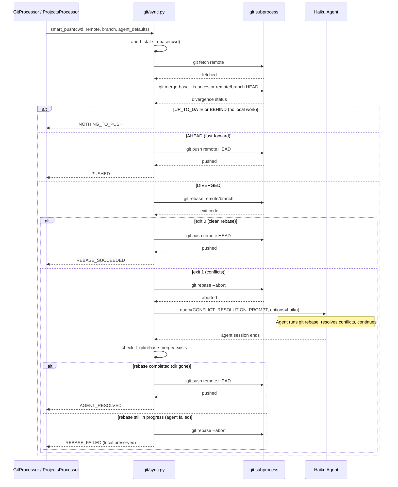
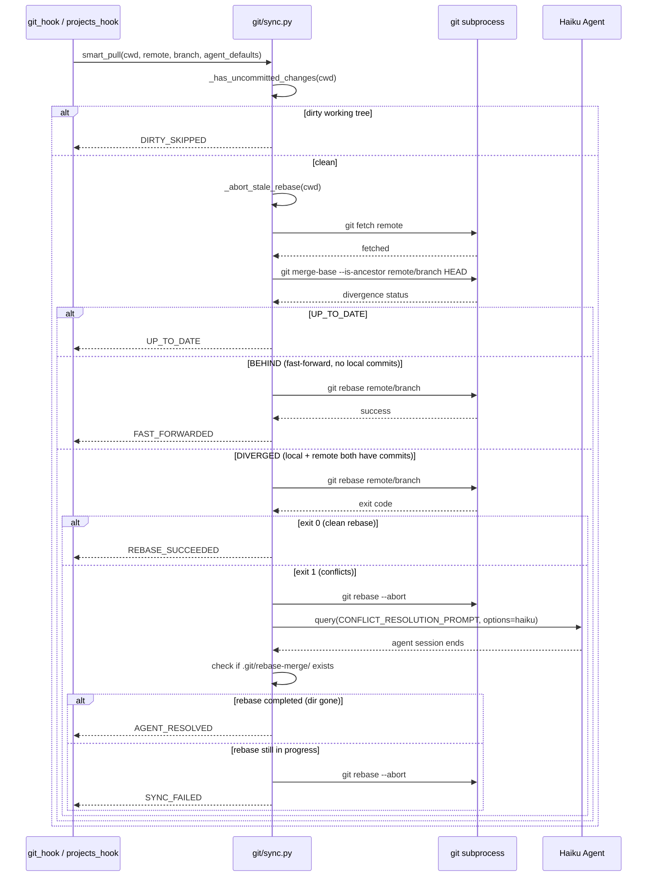

# Design: DLT-097 - Keep local repositories in sync with remotes

<!--
NOTE: This is a DELTA design template (working document for implementing changes).
For FEATURE design templates (long-lived documentation), see feature-design.md.
For detailed design guidelines, see design-template.md.
-->

**Delta Spec**: [../delta-specs/DLT-097.md](../delta-specs/DLT-097.md)
**Status**: Draft

## Purpose

This document explains the design rationale for this delta: the modeling choices, data flow, system behavior, and architectural approach.

After implementation, the "Detected Impacts" section will guide reconciliation into feature design docs.

## Problem Context

The workspace and project submodules are git repositories that need to stay in sync with their remotes. Currently, the workspace is never pulled from its remote at startup, projects are synced with a plain `git pull` (no divergence detection), and both post-processors do bare `git push` with no prior fetch. When the remote has advanced, the push fails — and stays failed until the next manual intervention.

**Constraints:**
- Must maintain linear history (R7) — no merge commits
- Must always fetch before divergence detection (R8)
- Must skip sync gracefully when uncommitted local changes exist
- Failures in one repo must not block others (R6)
- All git operations use subprocess (no GitPython dependency)

**Interactions:**
- Workspace bootstrap (DES-003): git hook expands from init-only to init + sync
- Post-processing pipeline: GitProcessor (finalize phase) and ProjectsProcessor (pre_finalize phase) replace bare push with smart push
- Projects bootstrap: `_sync_submodule` replaces plain pull with smart pull
- Conflict resolution follows the fresh `query()` pattern from `query_and_consume()` in `git/processor.py` (not DES-004 — conflict resolution uses a stateless query, not a session fork)

## Design Overview

A new `git/sync.py` module provides shared async utilities for divergence detection and smart push/pull. The smart operations follow a two-tier strategy: try a naive `git rebase` first, and if it fails with conflicts, abort and delegate the full rebase to a Haiku agent that runs git commands directly.

Four call sites consume these utilities:
- **S3**: `git_hook` adds workspace sync after init
- **S4**: `_sync_submodule` uses smart pull instead of plain `git pull`
- **S5**: `GitProcessor` replaces bare `git push origin HEAD` with smart push
- **S6**: `ProjectsProcessor` replaces bare `git push` with smart push

```
┌──────────────────────────────────────────────────────────────┐
│                      git/sync.py                             │
│  detect_divergence()  smart_push()  smart_pull()             │
│       │                   │              │                    │
│       └───────────────────┴──────────────┘                    │
│                           │                                   │
│                    naive rebase attempt                       │
│                      │        │                               │
│                   success   failure                           │
│                      │        │                               │
│                   push    spawn Haiku agent                   │
│                              │                                │
│                          agent rebase                         │
│                         (resolve + continue)                  │
│                              │                                │
│                      success ──→ push                         │
│                      failure ──→ log + preserve               │
└──────────────────────────────────────────────────────────────┘
         │              │                │              │
     git_hook     _sync_submodule  GitProcessor  ProjectsProcessor
      (S3)            (S4)            (S5)           (S6)
```

## Shape

| Part | Mechanism | Flag |
|------|-----------|:----:|
| **S1** | Shared sync utilities (`git/sync.py`): reusable async functions for divergence detection (`git fetch` + `git merge-base --is-ancestor`), smart push (fetch→detect→naive rebase→agent rebase on failure→push), and smart pull (fetch→detect→naive rebase→agent rebase on failure) | |
| **S2** | Conflict resolution agent: when naive rebase fails, Python aborts and spawns a Haiku agent that handles the full rebase — running git commands (`GIT_EDITOR=true git rebase`, `git add`, `git rebase --continue`), editing files to resolve conflicts, looping until complete or aborting on failure | |
| **S3** | Workspace startup sync: add fetch + smart pull to `git_hook` after the existing init, using shared sync utilities | |
| **S4** | Enhanced project startup sync: replace plain pull in `_sync_submodule` with smart pull using shared sync utilities | |
| **S5** | GitProcessor push enhancement: replace bare `_push()` call with smart push using shared sync utilities | |
| **S6** | ProjectsProcessor push enhancement: replace bare `push()` call in `_commit_and_push` with smart push using shared sync utilities |

### Requirements Coverage

| Requirement | Shape Parts | Notes |
|-------------|-------------|-------|
| R0 | S1, S3, S4, S5, S6 | Up-to-date state via startup sync + smart push/pull |
| R1 | S1, S3 | Workspace startup sync via git_hook expansion |
| R2 | S1, S2, S4 | Submodule startup sync with conflict resolution |
| R3 | S1, S5, S6 | fetch→detect→push in both post-processors |
| R4 | S2 | Agent-driven conflict resolution |
| R5 | S2 | Agent aborts on failure, local commits preserved |
| R6 | S4, S5, S6 | Each repo handled independently in parallel |
| R7 | S1, S2 | Rebase-based approach, no merge commits |
| R8 | S1 | All operations begin with git fetch |

## Components

### Implementation Structure

| Layer/Component | Responsibility | Key Decisions |
|-----------------|----------------|---------------|
| `src/tachikoma/git/sync.py` | Shared sync utilities: `detect_divergence()`, `smart_push()`, `smart_pull()`, `_try_naive_rebase()`, `_agent_rebase()`, `_abort_stale_rebase()` | New module; pure async subprocess + agent spawning |
| `src/tachikoma/git/hooks.py` | Workspace startup sync added to `git_hook` after existing init logic | Follows DES-003; reuses shared sync utilities |
| `src/tachikoma/git/processor.py` | `GitProcessor._push()` replaced by `smart_push()` | Push extracted from processor to shared module |
| `src/tachikoma/projects/hooks.py` | `_sync_submodule` replaces `git pull` with `smart_pull()` | Existing retry logic preserved around smart_pull |
| `src/tachikoma/projects/processor.py` | `_commit_and_push` replaces `git push` with `smart_push()` | Minimal change — only the push call changes |
| `src/tachikoma/git/__init__.py` | Re-export `smart_push`, `smart_pull` from sync module | Public API for the git package |

### Cross-Layer Contracts

**`detect_divergence(cwd, remote, branch)` contract:**
```
Input:  cwd: Path, remote: str = "origin", branch: str = "HEAD"
Pre:    git fetch <remote> has been called (updates remote tracking refs)
Output: DivergenceStatus enum:
          - UP_TO_DATE     (local == remote)
          - AHEAD          (remote is ancestor of local)
          - BEHIND         (local is ancestor of remote)
          - DIVERGED       (neither is ancestor)
Raises: subprocess.CalledProcessError on git failure
```

**`smart_push(cwd, remote, branch, agent_defaults)` contract:**
```
Input:  cwd: Path, remote: str, branch: str, agent_defaults: AgentDefaults
Output: PushResult enum:
          - PUSHED           (pushed successfully)
          - NOTHING_TO_PUSH  (already up to date)
          - REBASE_SUCCEEDED (naive rebase worked, then pushed)
          - AGENT_RESOLVED   (agent resolved conflicts, then pushed)
          - PUSH_FAILED      (push itself failed after rebase)
          - REBASE_FAILED    (naive + agent rebase both failed, local preserved)
Side effects: may spawn Haiku agent, modifies git history (rebase)
Exceptions: catches all git/subprocess errors internally, returns result enums
```

**`smart_pull(cwd, remote, branch, agent_defaults)` contract:**
```
Input:  cwd: Path, remote: str, branch: str, agent_defaults: AgentDefaults
Output: SyncResult enum:
          - UP_TO_DATE       (already up to date)
          - FAST_FORWARDED   (local was behind with no local commits, rebase fast-forwarded)
          - REBASE_SUCCEEDED (local had commits, naive rebase worked cleanly)
          - AGENT_RESOLVED   (agent resolved conflicts)
          - SYNC_FAILED      (naive + agent rebase both failed)
          - DIRTY_SKIPPED    (uncommitted changes, sync skipped)
Side effects: may spawn Haiku agent, modifies git history (rebase)
Exceptions: catches all git/subprocess errors internally, returns result enums
```

**`_agent_rebase(cwd, remote_branch, agent_defaults)` contract:**
```
Input:  cwd: Path, remote_branch: str (e.g. "origin/main"), agent_defaults: AgentDefaults
Output: bool (True = rebase completed, False = agent failed)
Detection: After agent completes, checks if .git/rebase-merge/ still exists:
           - gone → rebase completed successfully → return True
           - still exists → agent failed → git rebase --abort → return False
Side effects: spawns Haiku agent with full rebase workflow
```

**Integration Points:**
- `git/sync.py` ↔ subprocess: `git fetch`, `git merge-base --is-ancestor`, `git rebase`, `git rebase --abort`, `git push`, `git rev-parse --verify REBASE_HEAD` (stale rebase detection)
- `git/sync.py` ↔ agent SDK: `query()` with `ClaudeAgentOptions(model="haiku", cwd=cwd, permission_mode="bypassPermissions")` for conflict resolution — follows the fresh `query()` pattern from `git/processor.py:query_and_consume()`, not DES-004's session-fork pattern
- `git/hooks.py` ↔ `sync.py`: calls `smart_pull()` after existing init
- `git/processor.py` ↔ `sync.py`: calls `smart_push()` instead of bare `git push`
- `projects/hooks.py` ↔ `sync.py`: calls `smart_pull()` instead of bare `git pull`
- `projects/processor.py` ↔ `sync.py`: calls `smart_push()` instead of bare `git push`
- All callers handle result enums uniformly: info log for success, warning log for failure/skip, then continue (non-blocking)

### Shared Logic

- **`git/sync.py`**: Centralizes all sync-related git operations. Used by git hook (workspace startup), git processor (session-end push), projects hook (submodule startup), projects processor (submodule push). Avoids duplicating the fetch-detect-rebase-resolve-push sequence across four call sites.
- **`CONFLICT_RESOLUTION_PROMPT`**: Instructs the agent to perform a full rebase with conflict resolution:

```
You are resolving git conflicts during a rebase operation.

Run: GIT_EDITOR=true git rebase {remote_branch}

If conflicts are detected:
1. Read each conflicted file to understand the content
2. Resolve conflicts by understanding what the files contain and
   intelligently merging the content — do NOT simply pick one side
3. Run: git add <resolved-files>
4. Run: GIT_EDITOR=true git rebase --continue
5. Repeat until the rebase completes fully

If you cannot resolve a conflict (the changes are truly incompatible):
1. Run: git rebase --abort
2. Report that the conflicts are unresolvable

Do NOT run git push. Do NOT modify files unrelated to the conflicts.
```

- **Logging**: All sync operations use DES-002 structured logging with `component="git.sync"`. Result enums are logged at appropriate levels (info for success, warning for failure/skip).

## Modeling

```
DivergenceStatus (enum)
├── UP_TO_DATE
├── AHEAD
├── BEHIND
└── DIVERGED

PushResult (enum)
├── PUSHED
├── NOTHING_TO_PUSH
├── REBASE_SUCCEEDED
├── AGENT_RESOLVED
├── PUSH_FAILED
└── REBASE_FAILED

SyncResult (enum)
├── UP_TO_DATE
├── FAST_FORWARDED
├── REBASE_SUCCEEDED
├── AGENT_RESOLVED
├── SYNC_FAILED
└── DIRTY_SKIPPED

git/sync.py (stateless functions)
├── detect_divergence(cwd, remote, branch) → DivergenceStatus
├── smart_push(cwd, remote, branch, agent_defaults) → PushResult
├── smart_pull(cwd, remote, branch, agent_defaults) → SyncResult
├── _try_naive_rebase(cwd, remote_branch) → bool
├── _agent_rebase(cwd, remote_branch, agent_defaults) → bool
├── _abort_stale_rebase(cwd) → bool (detect + abort in-progress rebase)
└── _has_uncommitted_changes(cwd) → bool
```

## Data Flow

### Smart Push (used by GitProcessor and ProjectsProcessor)



### Smart Pull (used by git_hook and projects_hook)



### Workspace Startup Sync (git_hook expansion)

```
1. git_hook(ctx) runs as today:
   a. Check if .git exists → init if needed (existing logic)
2. NEW: after init, check if origin remote exists
   ├─ no origin → skip sync (debug log)
   └─ origin exists → smart_pull(cwd, "origin", "HEAD", agent_defaults)
      All results logged per DES-002 (info for success, warning for failure/skip):
      ├─ DIRTY_SKIPPED → log warning, continue
      ├─ UP_TO_DATE → log debug, continue
      ├─ FAST_FORWARDED → log info
      ├─ REBASE_SUCCEEDED → log info
      ├─ AGENT_RESOLVED → log info
      └─ SYNC_FAILED → log warning, continue (non-blocking)
```

### Project Submodule Startup Sync (_sync_submodule replacement)

```
1. For each submodule (parallel):
   a. git submodule update --init <path> (existing)
   b. Resolve default branch (existing)
   c. Checkout to default branch (existing)
   d. NEW: smart_pull(path, "origin", branch, agent_defaults)
      replaces: git pull
      All results logged per DES-002 (info for success, warning for failure/skip):
      ├─ DIRTY_SKIPPED → log warning, continue
      ├─ UP_TO_DATE → log debug, continue
      ├─ FAST_FORWARDED → log info
      ├─ REBASE_SUCCEEDED → log info
      ├─ AGENT_RESOLVED → log info
      └─ SYNC_FAILED → log warning, continue (non-blocking)
```

## Key Decisions

### Agent-Driven Full Rebase (not Python-Orchestrated File Resolution)

**Choice**: When naive rebase fails, spawn a Haiku agent that handles the entire rebase process — running git commands, editing files, continuing the rebase.
**Why**: Delegating the full rebase cycle to the agent eliminates the complex Python-agent handoff loop (extract file stages → call agent → write resolved content → git add → rebase --continue → check for more conflicts → repeat). The agent already has bash and file-editing tools, so it can handle the complete workflow naturally. The naive rebase attempt first avoids agent cost for the common case.
**Alternatives Considered**:
- Python orchestrates git operations, agent resolves file-level conflicts: More testable Python-side, but requires a complex orchestration loop that extracts `:1:`, `:2:`, `:3:` stage versions, calls the agent per-file or per-batch, writes resolved content, runs `git add` and `git rebase --continue` in a loop. High implementation complexity for marginal testability gains.
- Mechanical rebase only (no agent): Cannot intelligently merge markdown content (memories, context files). Conflict markers would remain in files.

**Sources**: Git documentation for `git rebase` (https://git-scm.com/docs/git-rebase), `git merge-base` (https://git-scm.com/docs/git-merge-base), `GIT_EDITOR` environment variable; Claude Agent SDK `query()` API with `ClaudeAgentOptions` (model="haiku", permission_mode="bypassPermissions", DES-005 for generator consumption).
**Options Researched**:
- Python-orchestrated rebase with agent file resolution
- Agent-driven full rebase (chosen)
- Mechanical rebase only (no intelligent resolution)
- Merge-based approach (rejected due to R7 — linear history)

**Why This Over Alternatives**: The agent-driven approach trades Python testability for dramatically simpler implementation. The naive rebase first means the agent only activates on actual conflicts — a relatively rare event. When it does activate, giving it the full job avoids fragile Python↔agent handoff loops.

**Consequences**:
- Pro: Much simpler implementation — one agent prompt handles the entire workflow
- Pro: Agent can use cross-file context when resolving (e.g., understanding how memory entries relate)
- Pro: Naive rebase first means zero agent cost for clean rebases (the common case)
- Con: Agent rebase is harder to unit-test than Python orchestration (mitigated: integration tests with real git operations)
- Con: Agent could leave repo in broken state if it crashes mid-rebase (mitigated: `_abort_stale_rebase()` detects and recovers on next sync)

### Agent Success/Failure Detection via Rebase State

**Choice**: Python determines agent success by checking whether `.git/rebase-merge/` still exists after the agent completes.
**Why**: The agent may crash, time out, or explicitly abort. Rather than parsing agent output (fragile), checking the filesystem state is deterministic: if the rebase directory is gone, the rebase completed; if it's still there, the agent failed. This works regardless of how the agent terminates.
**Alternatives Considered**:
- Parse agent text output for success/failure markers: Fragile — agent output format varies, and a crashed agent produces no output
- Check `git status` for conflict markers: Conflicts might exist in the final rebased state if the agent resolved some but not all

**Consequences**:
- Pro: Deterministic — filesystem state doesn't lie
- Pro: Works even if agent crashes without producing output
- Con: Requires the agent to either complete the rebase (dir removed) or abort it (dir removed) — if the agent gets stuck mid-resolution, the dir persists and we detect failure

### Fresh `query()` Pattern (not DES-004)

**Choice**: The conflict resolution agent uses a fresh `query()` call, following the `query_and_consume()` pattern from `git/processor.py`, not DES-004's `PromptDrivenProcessor`/`fork_and_consume()` session-fork pattern.
**Why**: Conflict resolution doesn't need conversation context — it only needs the repo's current git state. A fresh query is cheaper and simpler than a session fork. This matches how `GitProcessor` already spawns commit agents (fresh `query()`, not a forked session). DES-004's `fork_and_consume()` would be appropriate if the agent needed access to the session transcript, which it doesn't.

**Consequences**:
- Pro: Consistent with GitProcessor's existing agent pattern
- Pro: No session dependency — the agent is fully self-contained
- Pro: Cheaper than a forked session (no transcript context)

### Naive Rebase First, Agent as Fallback

**Choice**: Always attempt `git rebase <remote_branch>` before spawning the agent. Only spawn the agent if the rebase fails with conflicts.
**Why**: Most divergences involve non-overlapping files — the rebase succeeds mechanically without conflicts. Spawning an agent is expensive (time + cost). The naive attempt is near-instant and handles the common case.

**Consequences**:
- Pro: Zero agent cost for non-conflicting rebases
- Pro: Simpler happy path — no agent involvement at all
- Con: Two-pass (naive + agent) adds one abort cycle on conflict, but abort is instant

### `GIT_EDITOR=true` for Non-Interactive Rebase Continue

**Choice**: The conflict resolution agent uses `GIT_EDITOR=true git rebase --continue` to suppress the commit message editor.
**Why**: During a rebase, `git rebase --continue` opens an editor for the commit message. Setting `GIT_EDITOR=true` makes the editor command a no-op, preserving the original commit message without requiring interactive input. This is a well-documented pattern for scripted rebases.

**Sources**: Git documentation for `GIT_EDITOR` environment variable (https://git-scm.com/book/en/v2/Git-Internals-Environment-Variables); confirmed via research that `true` (the no-op command) is the standard approach.

**Consequences**:
- Pro: Agent doesn't need to handle editor interactions
- Pro: Original commit messages are preserved automatically
- Con: None significant

### Shared Sync Module in git Package

**Choice**: Place sync utilities in `src/tachikoma/git/sync.py` rather than a new top-level module or in `projects/git.py`.
**Why**: The sync logic is inherently git-related. Both the git and projects subsystems consume it, but the git package is the natural home since it's the domain module. The projects subsystem already imports from `git/` (e.g., `query_and_consume`).

**Consequences**:
- Pro: Consistent with existing `projects → git` cross-subsystem import pattern
- Pro: Git package stays self-contained for git operations
- Con: Projects imports from git for sync — acceptable, already established

### Push Stays Python-Side

**Choice**: The conflict resolution agent never pushes. Python handles the final `git push` after the agent completes the rebase.
**Why**: Matches the existing pattern where push is done by the processor, not the agent (per workspace-version-tracking design: "Push is Python-side, not agent-side"). Keeps push failure handling in Python (structured logging per DES-002) rather than relying on agent behavior.

**Consequences**:
- Pro: Consistent with existing commit-agent pattern (agent commits, Python pushes)
- Pro: Push failures are handled with structured logging in Python
- Con: Agent could theoretically push as part of its workflow — restricted via prompt instructions

### Skip Sync When Dirty

**Choice**: `smart_pull` checks for uncommitted changes before attempting any rebase. If the working tree is dirty, sync is skipped entirely with a warning.
**Why**: Rebasing with uncommitted changes requires `--autostash`, which adds complexity (autostash conflicts after successful rebase, stash management). The spec explicitly requires skipping: "Given uncommitted local changes exist... sync is skipped." During active sessions, the agent is the primary writer, so dirty state during startup sync is rare.

**Consequences**:
- Pro: Simplest safe behavior — no risk of losing uncommitted work
- Pro: Matches spec requirements (R1, R2 AC)
- Con: If the workspace is persistently dirty, it never gets synced (acceptable — the next clean state will sync)

### Stale Rebase Recovery

**Choice**: Both `smart_push` and `smart_pull` call `_abort_stale_rebase()` before starting any operations. This checks for `.git/rebase-merge/` or `.git/rebase-apply/` directories and aborts any in-progress rebase.
**Why**: If the agent crashes mid-rebase (timeout, API error, process kill), the repo is left in a mid-rebase state. Subsequent git operations would fail or behave unexpectedly. Aborting first ensures a clean starting state. The abort restores the pre-rebase branch position, so no local commits are lost.

**Consequences**:
- Pro: Self-healing — any stale rebase state is cleaned up on the next sync attempt
- Pro: No manual intervention needed after agent crashes
- Con: Any partial rebase work is discarded (acceptable — the rebase will be retried from scratch)

## System Behavior

### Scenario: Fast-forward push (no divergence)

**Given**: Local commits to push, remote has not advanced
**When**: Smart push runs
**Then**: Fetch → detect local is ahead → `git push` directly
**Rationale**: Most common case, zero rebase overhead

### Scenario: Clean rebase (diverged, no conflicts)

**Given**: Local commits to push, remote has new commits in non-overlapping files
**When**: Smart push runs
**Then**: Fetch → detect divergence → naive rebase succeeds → push
**Rationale**: Non-overlapping changes rebases cleanly — no agent cost

### Scenario: Diverged push with resolvable conflicts

**Given**: Local commits to push, remote has new commits that touch overlapping files
**When**: Smart push runs
**Then**: Fetch → detect divergence → naive rebase fails → abort → spawn agent → agent resolves conflicts → check rebase state (completed) → push
**Rationale**: Agent understands file content (markdown memories, context) and can merge intelligently

### Scenario: Diverged push with unresolvable conflicts

**Given**: Local commits to push, remote has new commits that conflict irreconcilably
**When**: Smart push runs
**Then**: Fetch → detect divergence → naive rebase fails → abort → spawn agent → agent detects unresolvable conflicts → agent runs `git rebase --abort` → check rebase state (aborted) → log warning, return REBASE_FAILED
**Rationale**: Safe fallback — local commits preserved for next sync opportunity

### Scenario: Agent crashes mid-rebase

**Given**: Agent is resolving conflicts but times out or hits an API error
**When**: The agent session terminates unexpectedly
**Then**: Agent session ends. Python checks `.git/rebase-merge/` — it still exists. Python runs `git rebase --abort` to clean up. Returns REBASE_FAILED. On the next sync attempt, `_abort_stale_rebase()` runs as a safety net.
**Rationale**: Stale rebase state is recoverable — `git rebase --abort` restores the pre-rebase state. Double recovery (immediate + on-next-sync) handles edge cases.

### Scenario: Network failure during sync

**Given**: Remote is unreachable
**When**: Any sync operation runs
**Then**: Fetch fails → subprocess raises → caught internally → log warning (DES-002) → return failure result → continue (non-blocking)
**Rationale**: System degrades gracefully, operates on local state

### Scenario: Workspace startup with dirty state

**Given**: Uncommitted local changes exist in the workspace
**When**: Startup sync runs
**Then**: Detect dirty state via `git status --porcelain` → skip sync → log warning (DES-002) → continue
**Rationale**: Never risk losing uncommitted work to a rebase

### Scenario: Project submodule startup with resolvable conflict

**Given**: A submodule has local commits that conflict with remote
**When**: Startup sync runs
**Then**: Smart pull detects divergence → naive rebase fails → agent resolves → submodule synced
**Rationale**: Submodules get the same conflict resolution as workspace

### Scenario: Multiple submodules, one fails

**Given**: Three submodules need sync, one has unresolvable conflicts
**When**: Startup sync runs
**Then**: The failing submodule returns SYNC_FAILED (logged as warning). The other two sync successfully. Each is processed independently in parallel.
**Rationale**: Error isolation (R6) — one repo's failure doesn't block others

### Scenario: Post-rebase push fails

**Given**: Agent successfully resolved conflicts and completed the rebase
**When**: Python attempts `git push` after agent rebase
**Then**: Push fails (e.g., another concurrent push happened). Return PUSH_FAILED. Local commits are rebased and intact. Next sync will detect they're still ahead and retry.
**Rationale**: Push is idempotent — a failed push doesn't lose work

## Open Questions

None — all unknowns from the seed design have been resolved during the design phase.

---

## Detected Impacts

### Affected Feature Designs

- **docs/feature-designs/agent/workspace-version-tracking.md** - Modifies: `GitProcessor` push flow changes from bare `git push origin HEAD` to `smart_push()` with divergence detection and agent-driven conflict resolution; `_push()` helper removed; `_has_remote()` replaced by divergence detection
- **docs/feature-designs/agent/project-management.md** - Modifies: startup sync `_sync_submodule` changes from plain `git pull` to `smart_pull()`; session-end push changes from bare `git push` to `smart_push()`; adds conflict resolution scenarios
- **docs/feature-designs/agent/workspace-bootstrap.md** - Modifies: git hook behavior expands from init-only to init + sync (adds workspace startup sync); git hook AC need updating

### Notes for Reconciliation

- workspace-version-tracking.md: Push contract section needs updating to describe the fetch→detect→rebase→push flow; add smart push result handling; update sequence diagram; remove `_push()` and `_has_remote()` from modeling; add `smart_push()` import
- project-management.md: Startup sync flow sequence diagram needs updating for smart_pull; session-end push flow needs updating for smart_push; add conflict resolution scenario; update error contract for PushResult/SyncResult enums
- workspace-bootstrap.md: Registered hooks section needs updating — git hook now includes workspace sync behavior after init; add AC for workspace sync scenarios (origin configured, no origin, dirty state, fetch failure, agent-resolved sync)

## Notes

- The scope was narrowed during spec interview from "pre-message pull + session-close push" to "session-close-only + startup sync" — pre-message sync was deemed unnecessary since the agent is typically the only writer during an active session
- Conflict resolution uses Haiku model (same as commit agents) for cost efficiency
- Workspace startup sync lives in the existing `git_hook` bootstrap hook (same domain)
- The two-tier rebase strategy (naive first, agent fallback) was chosen over Python-orchestrated file resolution during the design interview, based on user preference for simplicity
- Branch resolution: callers pass the branch name explicitly. For workspace, `git_hook` uses `"HEAD"`. For submodules, `_sync_submodule` passes the resolved default branch. The `remote/branch` ref is fully specified after `git fetch` (e.g., `origin/main`)
- Submodule reference updates: ProjectsProcessor runs in `pre_finalize` phase, pushes submodule changes via smart_push. GitProcessor runs in `finalize` phase, commits the updated submodule references. This ordering is preserved — only the push mechanism changes
