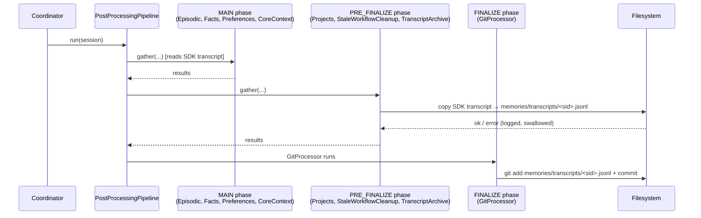

# Design: DLT-099 - Archive conversation transcripts to project workspace

**Delta Spec**: [../delta-specs/DLT-099.md](../delta-specs/DLT-099.md)
**Status**: Ready for planning

## Purpose

This document explains the design rationale for this delta: the modeling choices, data flow, system behavior, and architectural approach.

After implementation, the "Detected Impacts" section will guide reconciliation into feature design docs.

## Problem Context

Conversation transcripts are currently stored only by the Claude Agent SDK at `~/.claude/projects/<sanitized-cwd>/<sdk-session-id>.jsonl`. This location is:

- **External to the project workspace** — not tracked in git, not durable across machines, and not searchable via project-local tooling
- **Subject to SDK storage changes** — the path format (sanitized cwd, directory structure) is an SDK implementation detail that can change without notice
- **Coupled to `~/.claude`** — conflicts with the goal of making the project workspace the source of truth for conversation history

For durable memory extraction, audit, and future analysis features, transcripts must live inside the workspace. The spec (`R0`) calls this out as the primary goal.

## Design Overview

A new `TranscriptArchiveProcessor` is added to the post-processing pipeline. It runs in the `PRE_FINALIZE` phase — after memory-extraction processors have finished reading the transcript from its SDK location, but before the `GitProcessor` in `FINALIZE` commits workspace changes.

The processor:

1. Reads `session.transcript_path` (already populated by the coordinator when the SDK session starts) and `session.sdk_session_id`
2. Copies the file to `memories/transcripts/<sdk-session-id>.jsonl` inside the workspace
3. Logs and skips on any failure — never raises, so other processors and the git commit remain unaffected

The memory bootstrap hook is extended to create the `memories/transcripts/` directory alongside `episodic/`, `facts/`, and `preferences/`.

No new database field is introduced. The archived path is a pure convention derivable from `session.sdk_session_id` (spec `R8`).

## Shape

| Part | Mechanism | Flag |
|------|-----------|:----:|
| **S1** | `TranscriptArchiveProcessor(PostProcessor)` — plain (non-prompt-driven) processor that copies `session.transcript_path` to `memories/transcripts/<sdk-session-id>.jsonl` using `shutil.copy2`, with per-failure logging and no raises | |
| **S2** | Register processor in the `PRE_FINALIZE` phase so it runs after memory extraction (which reads the SDK transcript) and before `GitProcessor` commits in `FINALIZE` | |
| **S3** | Extend the existing `memory_hook` to also create `memories/transcripts/` during bootstrap, alongside the existing memory subdirectories | |
| **S4** | Defensive per-run `mkdir(parents=True, exist_ok=True)` of `memories/transcripts/` inside `process()`, so the archive survives directory removal between bootstrap and session close | |

## R → Shape Coverage

| Requirement | Covered by |
|-------------|-----------|
| R0 — Archive transcripts to workspace | S1 |
| R1 — Copy transcript on session close | S1 + S2 |
| R2 — Integrate as pipeline processor before git commit | S2 |
| R3 — Graceful handling (log, don't crash) | S1 |
| R4 — Idempotent (overwrite existing) | S1 (`shutil.copy2` overwrites) |
| R5 — Archived files committed via existing GitProcessor | S2 (phase ordering) |
| R6 — `<sdk-session-id>.jsonl` naming | S1 |
| R8 — Path derivable, no new model field | S1 (convention only) |
| Bootstrap directory creation | S3 + S4 |

## Components

### Implementation Structure

| Layer/Component | Responsibility | Key Decisions |
|-----------------|----------------|---------------|
| `tachikoma.memory.transcripts.TranscriptArchiveProcessor` | Concrete `PostProcessor` that copies `session.transcript_path` → `memories/transcripts/<sdk-session-id>.jsonl` | Plain `PostProcessor` subclass (no sub-agent needed); `shutil.copy2` for metadata preservation; swallow all exceptions with structured logging |
| `tachikoma.memory.hooks.memory_hook` (extended) | Bootstrap hook that now also creates `memories/transcripts/` | Reuse existing hook rather than register a new one — same subsystem ownership |
| `tachikoma.__main__` (pipeline wiring) | Registers the new processor on `PRE_FINALIZE` phase | Registered only on the main post-processing pipeline (not background-task pipeline) since transcripts belong to user sessions |
| `tachikoma.memory.__init__` | Re-export `TranscriptArchiveProcessor` | Follows the pattern used by the other memory processors |

### Cross-Layer Contracts

- **Processor ↔ Session**: The processor consumes only two fields from `Session`: `transcript_path` (Path | None) and `sdk_session_id` (str | None). No new fields added.
- **Processor ↔ Filesystem**: Destination directory is derived from `agent_defaults.cwd / "memories" / "transcripts"`. The processor treats this directory as its exclusive scope.
- **Processor ↔ GitProcessor**: Contract is purely via filesystem state. The archive must exist on disk before `FINALIZE` runs; `GitProcessor` picks it up via its normal "stage everything in workspace" behavior.

### Shared Logic

No new shared utilities. The processor uses the existing `PostProcessor` base class and stdlib (`shutil`, `pathlib`, `loguru`).

## Modeling

No data model changes. The design is deliberately schema-free:

- `Session.transcript_path` already exists and is populated by the coordinator when the SDK session is created.
- `Session.sdk_session_id` already exists and is the canonical filename component.
- The archived path is always `{cwd}/memories/transcripts/{sdk_session_id}.jsonl` — computable from these two fields without persistence.

This keeps the migration surface at zero and satisfies spec `R8`.

## Data Flow

1. **Session start** — Coordinator starts an SDK session; `session.transcript_path` is populated pointing at `~/.claude/projects/<sanitized-cwd>/<sdk-session-id>.jsonl`; `session.sdk_session_id` is set.
2. **Conversation proceeds** — SDK writes turns into the transcript file at its location.
3. **Session close** — Coordinator marks the session closed and invokes the post-processing pipeline.
4. **MAIN phase** — Memory extraction processors (`Episodic`, `Facts`, `Preferences`, `CoreContext`) fork sub-agents that read the transcript from its SDK location.
5. **PRE_FINALIZE phase** — `TranscriptArchiveProcessor.process(session)`:
   - Returns early if `transcript_path` or `sdk_session_id` is `None` (debug log).
   - Ensures `memories/transcripts/` exists (`mkdir(parents=True, exist_ok=True)`).
   - Invokes `shutil.copy2(session.transcript_path, dest)`.
   - On `FileNotFoundError`: warn log, return.
   - On any other exception: error log, return.
6. **FINALIZE phase** — `GitProcessor` stages the new/updated `memories/transcripts/<sdk-session-id>.jsonl` and commits it with the normal auto-commit message.

## Key Decisions

### D1. Plain `PostProcessor`, not `PromptDrivenProcessor`

- **Choice**: `TranscriptArchiveProcessor` extends `PostProcessor` directly and implements `process()` with filesystem calls.
- **Why**: The task is deterministic file I/O. Forking a sub-agent (the `PromptDrivenProcessor` pattern) would add LLM latency, cost, and failure modes for an operation that has no reasoning component. DES-004 sub-agents are justified when scoped tool use and prompt-driven reasoning are needed.
- **Sources**: `src/tachikoma/post_processing.py` (PostProcessor ABC), `docs/design/DES-004-prompt-driven-processors.md` pattern criteria.
- **Alternatives**:
  - `PromptDrivenProcessor` subclass that prompts a sub-agent to copy the file — rejected (needless complexity and cost).
  - Inline copy in the coordinator after close — rejected (breaks the pipeline abstraction; loses error isolation).
- **Consequences**: No prompt/tool configuration; tests can run with pure filesystem assertions; processor module is small and dependency-free beyond stdlib + `loguru`.

### D2. `PRE_FINALIZE` phase placement

- **Choice**: Register on the `PRE_FINALIZE` phase.
- **Why**: (a) `MAIN` phase processors read the SDK transcript — they must complete first so we don't copy while they're still reading. (b) `FINALIZE` is `GitProcessor`'s phase — the archive must land before git stages. `PRE_FINALIZE` is the only phase that satisfies both constraints.
- **Sources**: `src/tachikoma/post_processing.py` (phase constants and pipeline ordering), `src/tachikoma/__main__.py` (current registrations).
- **Alternatives**:
  - `MAIN` phase — rejected (races with memory-extraction readers).
  - `FINALIZE` — rejected (same phase as GitProcessor; no ordering guarantee within a phase since `asyncio.gather` runs processors concurrently).
- **Consequences**: Archive is guaranteed to be present for the git commit. Other `PRE_FINALIZE` processors (`ProjectsProcessor`, `StaleWorkflowCleanup`) run concurrently with archival — no conflict since they touch disjoint filesystem scopes.

### D3. SDK session ID as filename, path derivable

- **Choice**: Archived path is `memories/transcripts/<sdk-session-id>.jsonl`; no `archived_transcript_path` field added to `Session`.
- **Why**: Spec `R8` explicitly requires no new model field. The SDK session ID is already globally unique per session, already stored on `Session`, and already file-system safe.
- **Sources**: Spec `R6`, `R8`; `src/tachikoma/sessions/model.py`.
- **Alternatives**:
  - Add `Session.archived_transcript_path` column — rejected per spec.
  - Use the local session UUID — rejected (`sdk_session_id` is the traceability anchor that ties back to SDK logs).
- **Consequences**: Consumers compute the path with a one-line helper (or inline `f-string`). Migration cost is zero.

### D4. `shutil.copy2` for the copy

- **Choice**: Use `shutil.copy2(src, dest)`.
- **Why**: Preserves mtime, which is useful for future tooling (e.g., "most recent transcript" queries, retention policies under DLT-099's excluded `R9`). Overwrites on conflict, satisfying idempotency (`R4`).
- **Sources**: Python stdlib `shutil` docs (verified current behavior).
- **Alternatives**:
  - `shutil.copyfile` — loses mtime; no reason to prefer it here.
  - `Path.read_bytes` + `Path.write_bytes` — loads entire file into memory; transcripts can be large for long sessions.
  - `os.link` / `os.symlink` — rejected; would not survive SDK-side deletion and defeats the durability goal.
- **Consequences**: Overwrite semantics are implicit — idempotency comes for free. Disk usage doubles for each archived session (one copy in `~/.claude`, one in workspace), accepted trade-off for durability.

### D5. Extend `memory_hook`, not a new bootstrap hook

- **Choice**: Add `memories/transcripts/` creation to the existing `memory_hook`.
- **Why**: DES-003 encourages subsystems to own a single hook that initializes all their filesystem state. Transcripts are a memory subdirectory by topology (`memories/transcripts/`) even though the archive mechanism is simpler than the other memory processors.
- **Sources**: `src/tachikoma/memory/hooks.py`, `docs/design/DES-003-bootstrap-hooks.md`.
- **Alternatives**:
  - New `transcripts_hook` — rejected (unnecessary fragmentation).
  - Create directory inside the processor only (no bootstrap) — rejected (bootstrap-time creation makes the workspace layout predictable for tooling that inspects the directory before any session has closed).
- **Consequences**: One-line change to `memory_hook`. Processor still creates the directory defensively at run time (S4).

### D6. Defensive `mkdir` inside `process()` (self-healing)

- **Choice**: Processor calls `Path(dest_dir).mkdir(parents=True, exist_ok=True)` every run.
- **Why**: Handles the edge case where `memories/transcripts/` was removed after bootstrap (user cleanup, fresh clone into an existing workspace, etc.). Cost is negligible and failure modes align with the "log and continue" policy.
- **Sources**: Spec acceptance criterion "Given the destination directory `memories/transcripts/` does not exist at copy time…".
- **Alternatives**:
  - Rely on bootstrap only — rejected (fragile to directory deletion during a session).
- **Consequences**: Processor is self-healing and covers the spec AC without special-case handling.

## System Behavior

### 1. Normal archival
- **Given** a session with populated `transcript_path` and `sdk_session_id`, and the SDK transcript file exists
- **When** the post-processing pipeline runs
- **Then** after `PRE_FINALIZE` completes, `memories/transcripts/<sdk-session-id>.jsonl` exists and is byte-identical to the SDK transcript; `GitProcessor` commits it.

### 2. Null transcript_path
- **Given** `session.transcript_path is None`
- **When** `TranscriptArchiveProcessor.process(session)` runs
- **Then** a debug log is emitted ("no transcript path, skipping") and the processor returns normally. Other processors and phases are unaffected.

### 3. Null sdk_session_id
- **Given** `session.sdk_session_id is None`
- **When** the processor runs
- **Then** a debug log is emitted ("no sdk_session_id, skipping") and the processor returns normally. (Archive path cannot be derived without the session ID.)

### 4. SDK transcript file missing
- **Given** `transcript_path` points at a file that no longer exists (e.g., SDK cleanup, `~/.claude` wiped between session close and post-processing)
- **When** the processor runs
- **Then** `FileNotFoundError` is caught, a warning is logged with both paths, and the processor returns normally.

### 5. Filesystem error on copy
- **Given** the destination directory is read-only or disk is full
- **When** `shutil.copy2` raises `PermissionError` / `OSError`
- **Then** the error is caught, logged at `error` level with the session ID and paths, and the processor returns normally. `GitProcessor` still runs and commits whatever other workspace changes exist.

### 6. Destination directory missing at copy time
- **Given** `memories/transcripts/` was removed after bootstrap
- **When** the processor runs
- **Then** `mkdir(parents=True, exist_ok=True)` recreates it, then the copy proceeds.

### 7. Idempotent re-run / partial prior copy
- **Given** an earlier run already produced `memories/transcripts/<sid>.jsonl` (complete or partial)
- **When** the processor runs again for the same session
- **Then** `shutil.copy2` replaces the prior destination file. The final file matches the current source transcript.

## Open Questions

None. The crash-recovery open question (prior S4) was resolved by deferring to DLT-066; the new S4 (defensive `mkdir`) has a defined mechanism.

---

## Detected Impacts

### Affected Feature Designs

- **docs/feature-designs/agent/post-processing-pipeline.md** — Adds: new `TranscriptArchiveProcessor` registered in `PRE_FINALIZE`. Note rationale for phase placement (between MAIN readers and FINALIZE git commit).
- **docs/feature-designs/agent/sessions.md** — Clarifies: `transcript_path` points at the SDK-owned location; the durable archived path is a convention derived from `sdk_session_id`.
- **docs/feature-designs/memory/memory-extraction.md** — Adds: `memories/transcripts/` as a bootstrap-created subdirectory of the memory workspace.

### Notes for Reconciliation

- Document `TranscriptArchiveProcessor` alongside other post-processors, highlighting that it is a plain `PostProcessor` (not `PromptDrivenProcessor`) — a precedent for deterministic I/O processors in the pipeline.
- Update the memory directory structure diagram/listing to include `transcripts/`.
- Note the archived-path convention (`memories/transcripts/<sdk-session-id>.jsonl`) in session docs, since downstream features may consume it.

## Notes

- Crash recovery archival (originally part of the shape as S4) is deferred to DLT-066. That delta will re-run post-processing for interrupted sessions on startup, at which point this processor will naturally run for recovered sessions without additional code.
- Retention/lifecycle (`R9`) is explicitly out of scope. Archived files accumulate indefinitely until a future delta adds cleanup policy.
