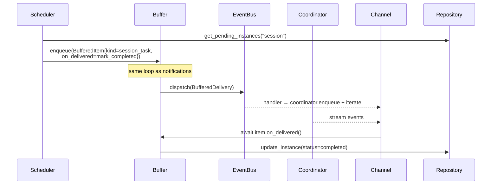
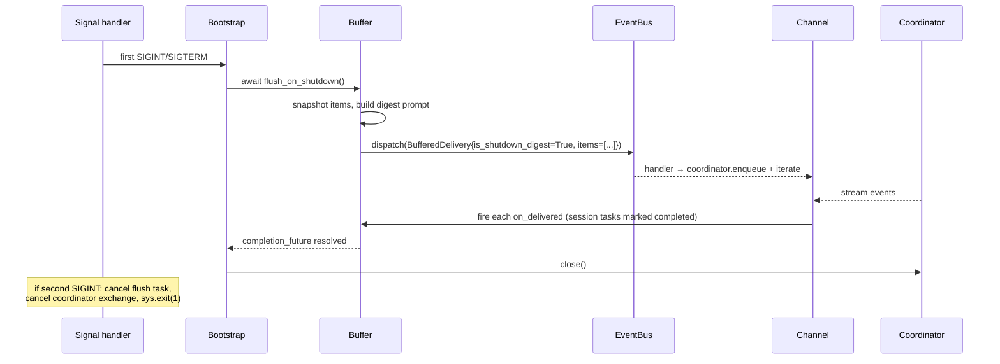

# Design: DLT-112 - Buffer background task notifications until conversation is idle

**Delta Spec**: [../delta-specs/DLT-112.md](../delta-specs/DLT-112.md)
**Status**: ✓ Design

## Purpose

This document explains the design rationale for this delta: the unified priority buffer that holds notifications and session tasks until the coordinator is idle, the event-driven wake mechanism, and the shutdown-flush behavior.

After implementation, the "Detected Impacts" section will guide reconciliation into feature design docs.

## Problem Context

Today, background-task notifications and session-task dispatches reach the user through two independent paths with inconsistent behavior:

- **Notifications** (`notifications.py` → `Notification` event) are dispatched on the bus and handled immediately by channels. The channel queues and drains them between prompts (REPL) or mid-stream (Telegram's `_is_processing` gate) — there is no guarantee the user is at a natural pause when they arrive. The spec calls this pattern "steering messages" because delivery can interleave with an active exchange.
- **Session tasks** (`tasks/scheduler.py` → `SessionTaskReady` event) are idle-gated by the scheduler itself (5-minute window), but silently skipped if the gate is not met — they are not held for later delivery.

Constraints:
- We cannot persist across restarts: the SDK conversation is ephemeral, and session-task instances are already tracked in the database by the scheduler.
- We must preserve the bus-based decoupling (ADR-009) — the executor, MCP tool, and scheduler should not need to know about the buffer's internals.
- The coordinator's existing `last_message_time` and `_is_busy` are the only idle signals; they are read from many places (idle post-processing loop, session-task scheduler today).
- Python/asyncio is single-threaded per event loop — we leverage this for race-free transition detection without locks.

## Design Overview

A new **Buffer subsystem** (`src/tachikoma/buffer/`) owns a priority queue of pending deliveries and a single asynchronous loop that wakes only when something could change the outcome: a new item is enqueued, the coordinator transitions from busy to idle, or a per-cycle timer fires for the next actionable moment.

The buffer is fed two ways:
- **Notifications**: the buffer subscribes to the existing `Notification` event on the bus. Executor and `send_notification` MCP tool keep dispatching to the bus without knowing about the buffer.
- **Session tasks**: the scheduler is refactored to call `buffer.enqueue(...)` directly; `SessionTaskReady` is retired. This is a tighter coupling but it lets the scheduler hand the `on_complete` callback straight to the buffer item, and it removes the scheduler's own idle gate.

Delivery goes through a new **`BufferedDelivery`** event. Channels replace their `Notification`/`SessionTaskReady` subscriptions with a single `BufferedDelivery` subscription. Channels enqueue the digest prompt into the coordinator and iterate `send_message()`; after completion, the channel fires each item's `on_delivered` callback.

The coordinator gains a tiny responsibility: dispatch a new **`CoordinatorIdle`** event exactly once on each busy→idle transition. This is the buffer's primary wake source.

On graceful shutdown, the buffer runs a dedicated hook (before coordinator close) that builds a single digest message from all pending items and routes it through the normal delivery path. A second SIGINT cancels the flush and the in-flight coordinator exchange.

## Shape

| Part | Mechanism | Flag |
|------|-----------|:----:|
| **S1** | Event-driven priority buffer loop — single `asyncio.Task` owning a `heapq`-backed priority queue keyed by `(priority_level, arrival_seq)`. Per cycle: inspect front, evaluate eligibility against `coordinator._is_busy`, `last_message_time`, and front-time accumulator, dispatch `BufferedDelivery` if eligible, otherwise `await asyncio.wait({wake_event_task, timer_task}, FIRST_COMPLETED)` with `timer_task` sleeping until the earliest of (idle-window satisfaction, max-hold expiry). Wake sources: enqueue, `CoordinatorIdle`, or timer expiry. | |
| **S2** | BufferedItem model — dataclass: `priority: Priority`, `prompt: str`, `kind: Literal["notification","session_task"]`, `source_id: str \| None`, `metadata: dict[str, Any]` (convention key `"instance": TaskInstance` for session tasks), `on_delivered: Callable[[], Awaitable[None]] \| None`, `arrival_seq: int` (monotonic within process lifetime — counter resets on restart since items do not persist). Carries everything the channel needs to route and finalize delivery. | |
| **S3** | Preemption-aware front-time accounting — per-item state `total_front_time: float` + `current_front_since: datetime \| None`. On becoming front: set `current_front_since = now`. On leaving front (preemption or delivery): `total_front_time += now - current_front_since; current_front_since = None`. Max-hold evaluated against `total_front_time + (now - current_front_since)`; idle-window evaluated against `now - coordinator.last_message_time` (and requires `current_front_since` non-None). | |
| **S4** | `CoordinatorIdle` event — new `BaseEvent` subclass emitted by the coordinator on busy→idle transitions, carrying `timestamp: datetime`. Synchronous helper `_maybe_emit_idle()` compares current `_is_busy` against a `_was_busy: bool` flag; on True→False transition, schedules `asyncio.create_task(self._bus.dispatch(CoordinatorIdle(...)))`. Invocation sites: (a) `send_message()` *after* `_pending_msg_task` is created (end of the method, not inside its `finally`) — avoids a transient false-idle window between `_client = None` and task creation; (b) attached to `_pending_msg_task` via `add_done_callback(lambda t: self._maybe_emit_idle())`; (c) after `enqueue()` — purely to re-capture `_was_busy=True` (this site never emits because `enqueue` transitions *to* busy, but it ensures the next idle transition is observed). Coordinator `__aenter__` initializes `_was_busy=False` (initial state is idle; never emitted). | |
| **S5** | `BufferedDelivery` event — new `BaseEvent` subclass carrying `prompt: str`, `items: list[BufferedItem]`, `is_shutdown_digest: bool`. Single delivery path for normal-case (single item) and shutdown-digest (multiple items). | |
| **S6** | Priority field on `Notification` — add `priority: Priority` (default `Normal`); `dispatch_notification()` accepts optional `priority`; executor failure sites pass `Priority.URGENT`. | |
| **S7** | Priority parameter on `send_notification` MCP tool — extend `SendNotificationArgs` with `priority: Literal["urgent","normal","low"] = "normal"`; `handle_send_notification` maps string → enum → `dispatch_notification`. System prompt for background tasks documents the three levels, intended uses, and default. | |
| **S8** | Session-task scheduler refactor — remove idle-gating block (`scheduler.py:263–272`); remove `SessionTaskReady` dispatch; replace with direct `buffer.enqueue(BufferedItem(kind="session_task", priority=Normal, prompt=instance.prompt, on_delivered=on_complete, metadata={"instance": instance}))`. `SessionTaskReady` class retired. Scheduler no longer holds a bus reference. | |
| **S9** | Channel subscription swap — REPL and Telegram remove `bus.on(Notification, ...)` and `bus.on(SessionTaskReady, ...)`; add `bus.on(BufferedDelivery, ...)`. Handler routes prompt through `coordinator.enqueue` + `send_message()` iteration; preserves existing concurrency guards. Rendering chrome resolved from `is_shutdown_digest` and items' `kind`. | |
| **S10** | Buffer subscription to `Notification` — buffer subscribes to existing `Notification` on the bus; builds a `BufferedItem(kind="notification", priority=event.priority, prompt=event.prompt, source_id=event.source_id)` and calls internal `enqueue`. | |
| **S11** | Graceful shutdown flush — buffer exposes `async flush_on_shutdown()`: snapshots pending items, builds combined digest prompt, dispatches one `BufferedDelivery(is_shutdown_digest=True)`, awaits a `Future` resolved by the channel's handler once delivery completes (after the item's `on_delivered` callbacks fire). No internal timeout. **Invocation**: called by each channel's `.run()` exit path — not by bootstrap — because the channel's `BufferedDelivery` subscription must still be active to drain the digest through the coordinator. Bootstrap's shutdown path (in `__main__.py` `finally`) sees a normal return from `channel.run()` and proceeds to coordinator close. | |
| **S12** | Channel shutdown integration — both channels gain a small shutdown-flush phase in their `.run()` teardown: (a) **REPL**: after the `while True` input loop exits (via `"exit"/"quit"` or `KeyboardInterrupt`), `await buffer.flush_on_shutdown()` before returning. The existing `BufferedDelivery` handler drains through `_execute_through_coordinator`. (b) **Telegram**: in the `try/finally` around `start_polling`, after `stop_polling()` completes and before cleaning up the terminal state, `await buffer.flush_on_shutdown()`. The existing handler and `_is_processing` gate continue to apply. In both cases, the flush runs while the channel's subscription is still live; the channel returns only after flush completes. | |
| **S15** | Second-SIGINT force-exit — each channel's shutdown-flush phase installs a one-shot signal handler scoped to the flush window: first SIGINT arriving during the flush cancels the flush task and the coordinator's active send task (via `coordinator.interrupt()`), then re-raises `KeyboardInterrupt` so the process exits via the normal error path. REPL's flush-phase handler uses `loop.add_signal_handler` (REPL has no prior handler, so no collision). Telegram's existing signal handler is removed in its `try/finally` at line 651-652 before the flush begins, and re-registered for the flush window with the force-exit logic. On flush completion, the flush-window handler is removed; normal exit proceeds. | |
| **S13** | Timing configuration — `BufferSettings` Pydantic model under config: per-priority `idle_window_seconds: int` and `max_hold_seconds: int \| None`. Defaults match spec table (Urgent 30/120, Normal 120/900, Low 300/None). | |
| **S14** | Buffer subsystem bootstrap — `src/tachikoma/buffer/` package with `hooks.py`, `buffer.py`, `events.py`, `items.py`, `priority.py`, `__init__.py` following DES-003. Hook creates `Buffer(bus, coordinator, settings)`, subscribes to `Notification` and `CoordinatorIdle`, starts its loop task, stores in `ctx.extras["buffer"]` for channel + scheduler wiring. `Priority` lives in its own module (`buffer.priority`) so `notifications.py` can import it without creating a circular dependency on the buffer package as a whole. | |

### Flagged Unknowns

*None.* S1 resolved (event-driven with `asyncio.wait(FIRST_COMPLETED)` + single cancellable timer).

## Components

### Implementation Structure

| Layer/Component | Responsibility | Key Decisions |
|-----------------|----------------|---------------|
| `buffer.buffer.Buffer` | Owns priority queue, loop task, per-item front-time state, delivery dispatch | `heapq` for ordering; single loop task; event-driven wake via `asyncio.Event` + cancellable timer |
| `buffer.items.BufferedItem` | Dataclass model for queued items | Unified model with `kind` discriminator; optional `on_delivered` callback |
| `buffer.items.Priority` | `IntEnum`: `URGENT=1`, `NORMAL=2`, `LOW=3` | IntEnum for direct use as heap sort key |
| `buffer.events.BufferedDelivery` | Event dispatched when an item (or shutdown digest) should reach the user | Unified event for single-item and shutdown-digest delivery |
| `buffer.events.CoordinatorIdle` | Event dispatched by coordinator on busy→idle transition | Lives under `buffer.events` because it exists to serve the buffer |
| `buffer.hooks.buffer_hook` | Bootstrap hook following DES-003 | Constructs buffer with settings, subscribes handlers, starts loop task, registers shutdown hook |
| `config.BufferSettings` | Per-priority timing configuration | Pydantic model with spec-table defaults |
| `coordinator.Coordinator` | Dispatches `CoordinatorIdle` on busy→idle transitions | `_was_busy` flag + `_maybe_emit_idle()` helper; invoked at busy-changing sites |
| `notifications.Notification` | Existing event; gains `priority: Priority` field | Default `Priority.NORMAL`; backward-compatible for existing callers |
| `notifications.dispatch_notification` / `handle_send_notification` | Thread priority through the stack | Optional parameter with `NORMAL` default |
| `tasks.scheduler.session_task_scheduler` | Refactored to call `buffer.enqueue` directly; idle-gate removed | Takes `buffer: Buffer` parameter instead of `bus: EventBus` + `get_last_message_time` |
| `repl.REPL` / `telegram.Telegram` | Swap subscriptions; single `BufferedDelivery` handler | Reuses existing concurrency guards (`_is_processing`, queue drain between prompts) |

### Cross-Layer Contracts

**Buffer public API:**

```
class Buffer:
    def __init__(self, bus: EventBus, coordinator: Coordinator, settings: BufferSettings): ...
    async def start(self) -> None        # spawn loop task; subscribe to Notification + CoordinatorIdle
    async def stop(self) -> None         # cancel loop task; drain
    async def enqueue(self, item: BufferedItem) -> None  # used by scheduler; also used internally from Notification handler
    async def flush_on_shutdown(self) -> None  # snapshot + dispatch digest + await completion
```

**Coordinator addition** (minimal, synchronous — single event loop guarantees atomicity):

```
def _maybe_emit_idle(self) -> None:
    """Dispatch CoordinatorIdle exactly once per busy→idle transition.

    Sync so it can be attached as a Task.add_done_callback target.
    Uses asyncio.create_task to schedule the async bus dispatch.
    """
    is_busy_now = self._is_busy
    if self._was_busy and not is_busy_now:
        asyncio.create_task(
            self._bus.dispatch(CoordinatorIdle(timestamp=datetime.now(UTC)))
        )
    self._was_busy = is_busy_now
```

Invocation sites:
1. **End of `send_message()`** — placed AFTER `_pending_msg_task` is created (not inside the `finally` that clears `_client`). This avoids the transient window between `_client = None` and task creation where `_is_busy` would otherwise read False.
2. **`_pending_msg_task.add_done_callback(lambda t: self._maybe_emit_idle())`** — attached when the task is created, so its completion triggers the check even when no new `send_message` call follows.
3. **`enqueue()`** — invoked for *state capture only* (resyncs `_was_busy=True`); it never emits because the transition is idle→busy. Ensures the subsequent busy→idle transition is correctly detected if `_was_busy` had drifted.
4. **Coordinator `__aenter__`** — initializes `_was_busy=False`. Initial state is idle by convention; no emission on startup.

**Channel handler contract:**

```
async def _handle_buffered_delivery(self, event: BufferedDelivery) -> None:
    # 1. Render chrome based on event.is_shutdown_digest / item kinds
    # 2. coordinator.enqueue(event.prompt)
    # 3. async for ev in coordinator.send_message(): render(ev)
    # 4. For each item in event.items: if item.on_delivered: await item.on_delivered()
```

### Shared Logic

- **`Priority` enum and timing lookup** — lives in its own module `buffer.priority` so `notifications.py` can import `Priority` without depending on the larger buffer package (avoids a circular dependency buffer.items → BufferedItem → Notification → buffer.items). Used by notifications module (priority field), scheduler (hardcoded `Priority.NORMAL`), and the buffer itself. Central definition prevents drift.
- **`BufferedItem` construction helpers** — `BufferedItem.from_notification(event)` and `BufferedItem.from_session_instance(instance, on_complete)` keep callers from duplicating wiring logic.
- **Digest-prompt builder** — module-level function `build_shutdown_digest(items: list[BufferedItem]) -> str`. Output format:

  ```
  ⟨Shutdown digest⟩ The assistant is shutting down. The items below were
  buffered and are being delivered now as a final batch. Summarize them
  concisely for the user; do not act on them.

  — Item 1 (urgent, notification, source: task:daily-digest) —
  [original prompt body]

  — Item 2 (normal, session_task) —
  [original prompt body]

  …
  ```

  Easy to unit-test independently of the buffer.

## Modeling

```
Priority (IntEnum)
├── URGENT = 1    (front of queue; FIFO within tier)
├── NORMAL = 2    (middle; FIFO within tier)
└── LOW    = 3    (back; FIFO within tier)

BufferedItem
├── priority: Priority
├── prompt: str
├── kind: "notification" | "session_task"
├── source_id: str | None
├── metadata: dict            # session-task instance payload, etc.
├── on_delivered: Callable[[], Awaitable[None]] | None
├── arrival_seq: int          # monotonic, assigned on enqueue — ensures FIFO within tier
├── total_front_time: float   # mutable; accumulated across preemptions
└── current_front_since: datetime | None

Heap key: (priority.value, arrival_seq)
    → Urgent items sort before Normal; Normal before Low.
    → Within a tier, earlier arrival_seq (smaller) sorts first.
```

**Why `heapq` over `asyncio.PriorityQueue`**: we need to peek at the front without popping (to decide whether the front is deliverable), which `PriorityQueue` does not expose. `heapq` with explicit list access handles this cleanly, and the loop is the only reader/writer (no concurrency concerns within a single event loop).

**Mutable item state and heap invariants**: `BufferedItem.total_front_time` and `current_front_since` are mutated in place while the item sits in the heap. This is safe because those fields are **not part of the heap key** — sort order depends only on `(priority.value, arrival_seq)`, both immutable once set. The heap invariant is preserved regardless of front-time mutations.

**Item lifecycle:**
```
          enqueue
            │
            ▼
     ┌───────────┐           preempted
     │  queued   │◄───────────────────────┐
     └─────┬─────┘                        │
           │ becomes front                │
           ▼                              │
     ┌───────────┐   new higher-priority  │
     │  fronted  │───── item enqueued ────┘
     └─────┬─────┘
           │ eligible + coordinator idle
           ▼
     ┌───────────┐
     │ delivered │  → on_delivered callback (if set) → removed
     └───────────┘
```

## Data Flow

### Normal notification delivery

```mermaid
sequenceDiagram
    participant Exec as Executor / MCP tool
    participant Bus as EventBus
    participant Buf as Buffer
    participant Coord as Coordinator
    participant Ch as Channel

    Exec->>Bus: dispatch(Notification{prio=Normal})
    Bus-->>Buf: Notification handler
    Buf->>Buf: enqueue(BufferedItem); wake_event.set()
    Note over Buf: loop wakes, front=item,<br/>not idle enough → schedule timer<br/>(last_message_time + 2min)
    Note over Coord: user inactive for 2min
    Coord-->>Bus: CoordinatorIdle (from earlier state transition)
    Bus-->>Buf: CoordinatorIdle handler → wake_event.set()
    Buf->>Buf: loop wakes, eligible → dispatch BufferedDelivery
    Bus-->>Ch: BufferedDelivery handler
    Ch->>Coord: enqueue(prompt) + iterate send_message()
    Coord-->>Ch: stream events → render
    Coord->>Bus: CoordinatorIdle (next busy→idle transition)
```

### Session-task delivery



### Preemption scenario (Normal fronted, Urgent arrives)

```mermaid
sequenceDiagram
    participant A as Normal item (A)
    participant Buf as Buffer
    participant B as Urgent item (B)

    Note over A,Buf: A is front; current_front_since = T0
    Note over Buf: timer scheduled for idle window
    B->>Buf: enqueue(Urgent)
    Buf->>A: leaves front:<br/>total_front_time += now - T0
    Buf->>B: becomes front: current_front_since = now
    Note over Buf: cancel old timer, schedule new one<br/>using B's idle window (30s)
    Note over Buf: later, B delivered and removed
    Buf->>A: returns to front:<br/>current_front_since = now (fresh idle window)<br/>total_front_time preserved (max-hold accumulates)
```

### Graceful shutdown flush



## Key Decisions

### KD-1: Event-driven wake via `asyncio.wait(FIRST_COMPLETED)` + cancellable timer

**Choice**: Single `asyncio.Event` as the "wake flag" set by the `Notification` handler, the `CoordinatorIdle` handler, and the `enqueue` method; a second task wrapping `asyncio.sleep(delta)` as the max-hold / idle-window timer. The loop awaits `asyncio.wait({wake_event_task, timer_task}, return_when=FIRST_COMPLETED)`, cancels the loser explicitly, and `await`s it to drain the `CancelledError`.

**Why**: Avoids interval polling (user's stated preference). Wakes exactly when something actionable changes. Clear-before-work idiom on the `Event` prevents signal coalescing — `wait()` returns immediately if `set()` was called since the last `clear()`.

**Sources**:
- Python 3.12+ asyncio docs (via katachi:doc-researcher, 2026-04): `asyncio.wait` losers must be cancelled and awaited manually; `asyncio.Event.wait()` + clear-before-work idiom avoids lost signals in single-threaded event loops; for state-transition emission a boolean flag is safe (no data race within a single event loop).
- ADR-009: project-wide use of bubus `EventBus` for decoupled signalling — matches our pattern of subscribing to `Notification`/`CoordinatorIdle`.

**Options Researched**:
- **Interval polling** (like `_idle_post_processing_loop`): simplest, matches existing pattern, minimal CPU cost even at 5s. Rejected by user preference for no polling.
- **`asyncio.Condition` with predicate**: natural fit for "wake when predicate true" but heavier than needed; we have one waiter, not many. Chosen alternative only if we later need multiple consumers of the wake.
- **`asyncio.TaskGroup` (3.11+)**: structured concurrency but cancels all tasks on any error — wrong semantics for "first-wins, cancel the rest".
- **`asyncio.timeout()` (3.11+) wrapping `wake_event.wait()`**: simpler than a separate timer task, but no way to add a second wake source cleanly; reschedule semantics (`asyncio.Timeout.reschedule()`) would work but readability suffers.

**Why This Over Alternatives**: `asyncio.wait(FIRST_COMPLETED)` is the canonical cross-source wait in current asyncio; the coalescing-free clear-before-work pattern on `Event` is documented best practice; cancellable timer task handles the "reschedule when front changes" case cleanly. Polling was rejected per user choice; `Condition`/`TaskGroup` don't fit the semantics.

**Consequences**:
- Pro: No CPU used while waiting; immediate response to state changes.
- Pro: Deterministic single-loop model, easy to reason about and test.
- Con: Slightly more code than polling (two tasks to manage per cycle).
- Con: Timer cancellation requires care — must `await` the cancelled task to drain `CancelledError`.

### KD-2: New `CoordinatorIdle` event on the bus (not a coordinator callback)

**Choice**: Coordinator dispatches a typed `CoordinatorIdle` event via the existing `bubus.EventBus` on each busy→idle transition. Buffer subscribes to it.

**Why**: ADR-009 standardized the bus for inter-subsystem signalling. Using it here preserves decoupling — any future consumer (diagnostics, scheduler, UI) can subscribe without coordinator code changes. Emission is exactly-once per transition via a `_was_busy` bool, safe under asyncio's single-threaded execution.

**Sources**:
- ADR-009 (existing project decision)
- Python asyncio docs (via doc-researcher, 2026-04): no data races on booleans within a single event loop — `_was_busy` requires no lock.

**Options Researched**:
- **Callback registration on coordinator**: tighter coupling; future consumers would force API changes.
- **`asyncio.Event` exposed by coordinator**: harder for the buffer to distinguish "became idle once" from "is currently idle"; `bubus` events model the edge naturally.
- **Polling `_is_busy`**: rejected per the no-polling choice.

**Why This Over Alternatives**: Bus is the project's standard signalling mechanism; matches `Notification` dispatch pattern; minimal coordinator surface change.

**Consequences**:
- Pro: Loosely coupled; additional consumers trivial.
- Pro: No coordinator API contract for buffer-specific concerns.
- Con: One more event class to maintain.
- Con: Requires careful instrumentation of every busy-state-changing site (we centralize via `_maybe_emit_idle()` helper).

### KD-3: Buffer subscribes to `Notification`; scheduler calls buffer directly

**Choice**: Asymmetric integration. Buffer subscribes to the existing `Notification` event on the bus. Session-task scheduler is refactored to call `buffer.enqueue(...)` directly, and the `SessionTaskReady` event is retired.

**Why**:
- Notifications come from many places (executor failure paths, MCP tool closures in each background-task process). Forcing each to depend on the buffer would require threading `buffer` through every call site. Bus subscription preserves loose coupling.
- Session tasks have exactly one producer (the scheduler). Direct coupling is simpler than round-tripping through the bus, and the scheduler must pass an `on_complete` callback that's more naturally embedded in the `BufferedItem` than carried through an event.
- `SessionTaskReady` has no consumer outside the channels once the buffer takes over; retiring it reduces dead surface area.

**Sources**:
- ADR-009 (bus for multi-producer/multi-consumer decoupling — fits notifications)
- Current codebase: `notifications.py:71-99` (many callers), `scheduler.py:225-326` (single dispatch site)

**Options Researched**:
- **Both via bus**: cleaner symmetry but adds an event type (`SessionTaskReady` remains) with a single producer and single consumer — dead weight.
- **Both via direct call**: forces threading `buffer` through every `Notification` producer (executor internals, MCP-tool closures) — significant coupling.

**Why This Over Alternatives**: Matches the natural cardinality of each producer set.

**Consequences**:
- Pro: Minimal changes to notification producers.
- Pro: Cleaner scheduler — no bus dependency.
- Con: Asymmetry may surprise readers; mitigated by a comment in `buffer.enqueue()` documenting the dual entry points.

### KD-4: Unified `BufferedItem` with `kind` discriminator (not a protocol)

**Choice**: Single concrete dataclass with a `kind` field and an optional `on_delivered` callback. Channels switch on `kind` for rendering chrome.

**Why**: The two current item types (notification, session task) share 90% of fields and lifecycle — the only real difference is whether a completion callback runs. A protocol with two implementations would add ceremony without separation. The `kind` discriminator keeps extension straightforward (add a new literal value, new chrome in channels).

**Options Researched**:
- **Protocol / abstract base with concrete subclasses**: more ceremonial; no behavior differs except `on_delivered` presence.
- **Two separate queues, one per kind**: loses the single-priority-ordering property required by the spec (Urgent across both types must come first).

**Consequences**:
- Pro: Trivial to add new item kinds (webhook delivery, proactive prompts, etc.) — one literal, one chrome handler.
- Con: Channels need a match/if-elif on `kind`; acceptable for 2-4 kinds, would warrant revisiting at higher counts.

### KD-5: Shutdown flush as a single `BufferedDelivery` with `is_shutdown_digest=True`

**Choice**: One combined `BufferedDelivery` event carrying all items and a preamble. Channel routes as a normal delivery; callbacks fire on completion.

**Why**: Reuses the existing delivery path — no separate channel code for the shutdown case. The preamble gives the agent the context it needs to summarize the dump rather than act on each item individually. One combined turn avoids thrashing the coordinator with N exchanges during shutdown.

**Sources**:
- User decision (interview): explicit preference for a single digest with an interpreting preamble.

**Options Researched**:
- **Discard on shutdown** (original spec): simplest; user changed it.
- **N separate `BufferedDelivery` events**: each is a full coordinator turn; shutdown could stretch to many minutes unnecessarily.
- **Persist and redeliver on next start**: notifications are ephemeral — the originating task is gone; nothing to persist meaningfully. Session tasks are already persisted at the DB level.

**Consequences**:
- Pro: Minimal code path reuse; one more message flag to handle in the channel.
- Pro: Agent gets one context-rich prompt it can summarize.
- Con: No grace-window bound — shutdown can hang on a slow model response until second SIGINT.

### KD-6: Second-SIGINT force-exit scoped to the channel's flush window

**Choice**: No global signal handler installed by `__main__.py`. Each channel's existing first-SIGINT handler continues to tear down input normally. When the channel's `.run()` reaches its flush phase (after input loop exit, before return), it installs a one-shot signal handler via `loop.add_signal_handler` scoped to the flush window; on first SIGINT during flush it cancels the flush task plus the coordinator's active send via `coordinator.interrupt()`, then re-raises `KeyboardInterrupt`. Removed on flush completion.

**Why**: Avoids collision with Telegram's existing `loop.add_signal_handler` (which is last-writer-wins) during normal operation. Keeps signal ownership with the component that currently owns it (channel). The flush window is the only period needing second-SIGINT semantics, so the scope is minimal.

**Sources**: Python `asyncio.AbstractEventLoop.add_signal_handler` docs (stdlib); current `telegram/__init__.py:599-600, 651-652` signal handler lifecycle; `coordinator.interrupt()` (existing API for cancelling in-flight exchanges).

**Options Researched**:
- **Global `__main__.py` signal handler**: cleanest in principle, but collides with Telegram's existing handler; would require refactoring Telegram's signal-aware `start_polling` lifecycle — out of scope.
- **Unified `shutdown_event: asyncio.Event`**: requires modifying both channel run() methods to watch the event alongside their input loops; larger delta scope.
- **Fixed grace window**: rejected by user.
- **No force-exit**: leaves the user unable to quit if the model hangs.

**Why This Over Alternatives**: Minimal footprint; localized to the flush phase where second-SIGINT semantics actually matter; no conflict with existing channel signal handlers.

**Consequences**:
- Pro: Surgical change; channels retain signal ownership during their normal lifecycle.
- Pro: User retains a clean "abandon ship" escape during flush.
- Con: Slight asymmetry between REPL (no prior handler, fresh registration) and Telegram (re-registration replacing its own torn-down handler).
- Con: Second SIGINT during flush leaves session-task instances in `running` state — crash recovery (`tasks/hooks.py:32`) handles this on next start.

### KD-7: `heapq` list + monotonic `arrival_seq` for priority ordering

**Choice**: Plain `list[BufferedItem]` maintained as a heap via `heapq.heappush`/`heapq.heappop`, ordered by `(priority.value, arrival_seq)` where `arrival_seq` is a monotonically increasing counter.

**Why**:
- `heapq` gives O(log n) insert and O(1) front-peek.
- Explicit `arrival_seq` guarantees FIFO-within-tier (don't rely on timestamps — two enqueues in the same microsecond would tie).
- Standard library, no dependency.

**Sources**: Python stdlib docs — `heapq` remains the canonical priority-queue primitive.

**Options Researched**:
- **`asyncio.PriorityQueue`**: doesn't support peek without popping; we need peek to decide whether the front is deliverable.
- **`sortedcontainers.SortedList`**: third-party dep; unnecessary for our scale.

**Consequences**:
- Pro: Zero deps; simple; easy to test.
- Con: Preemption implies resort (heap handles naturally on push); individual-item state (front-time) lives outside the heap order — fine because it only matters for the front item.

## System Behavior

### Scenario: Normal notification during active conversation

**Given**: User just sent a message 10s ago; a background task dispatches `Notification(priority=Normal)`.
**When**: Notification event is handled.
**Then**: Item enqueued; buffer wakes; front-time starts; coordinator is busy (or will be soon). Buffer schedules timer for `last_message_time + 2min`. On `CoordinatorIdle`, if idle-window satisfied, delivers; otherwise timer reschedules.
**Rationale**: Normal priority is the default for task completion messages — user shouldn't be interrupted mid-thought.

### Scenario: Urgent notification preempts Normal

**Given**: Normal item A has been front for 45s of a 120s idle window.
**When**: Urgent item B is enqueued.
**Then**: A's `current_front_since` is accumulated into `total_front_time` (45s) and cleared. B becomes front with fresh `current_front_since`. Timer cancelled and rescheduled for B's 30s idle window. When B delivers and is removed, A returns to front; `current_front_since` resets but `total_front_time=45s` persists — max-hold countdown continues.
**Rationale**: Spec AC: "max hold timer does NOT reset across preemptions".

### Scenario: Low-priority item holds indefinitely

**Given**: Low item is front; no higher-priority item arrives; user is continuously active.
**When**: Time passes indefinitely.
**Then**: Timer only watches idle-window completion (max_hold is `None` for Low). Item waits forever. If `CoordinatorIdle` fires and `now - last_message_time >= 300s`, delivers.
**Rationale**: Spec AC R5: "Given the front item has priority Low (max hold = never), then it is never force-delivered".

### Scenario: Max-hold fires while coordinator is busy

**Given**: Normal item is front; `total_front_time` reached 900s; coordinator is mid-response to the user.
**When**: Max-hold timer fires.
**Then**: Loop wakes, evaluates eligibility. `_is_busy` is True → not eligible. Cancel timer (already fired); do not reschedule. Wait for next `CoordinatorIdle`. When that fires, re-evaluate: `total_front_time` already past max-hold → dispatch delivery.
**Rationale**: Spec AC R14: force-delivery never interrupts mid-response; waits for `CoordinatorIdle`.

### Scenario: `last_message_time` is None at startup

**Given**: Process just started; no messages exchanged; item enqueued immediately.
**When**: Loop evaluates eligibility.
**Then**: Idle-window check fails (`last_message_time is None`). Max-hold timer still applies (counts from `current_front_since`). If user never sends a message, coordinator is never "busy" so `_is_busy=False` permits delivery when max-hold expires. For Low items with no max-hold, the item waits forever.

**Channel difference**: In REPL, delivery requires the user to be at the prompt — the `BufferedDelivery` handler calls `_execute_through_coordinator`, which drives `coordinator.send_message()` whenever the handler runs (regardless of prompt state, since the handler runs on the event-loop task, not the prompt task). In Telegram, delivery is truly proactive (the bot pushes messages at any time). Both are correct per R9.

**Rationale**: Prevents spurious delivery before any conversation exists for priorities that require idle-window satisfaction; max-hold still governs Urgent/Normal.

### Scenario: Shutdown flush with mid-response coordinator

**Given**: User triggered a long-running exchange; in-flight response is streaming. SIGTERM arrives; channel's existing signal handler fires and initiates teardown (Telegram: `stop_polling`; REPL: input loop break).
**When**: Channel calls `buffer.flush_on_shutdown()` in its teardown phase.
**Then**: Buffer dispatches `BufferedDelivery` to bus. Channel's handler (still subscribed) picks it up. If the coordinator is still processing the user's exchange (Telegram's `_is_processing=True`, or REPL's coordinator buffer non-empty), the channel's normal concurrency pattern queues the digest: in Telegram, `_handle_buffered_delivery` returns without calling `_process_through_coordinator`, and the ongoing `_process_through_coordinator` drains the digest via `while self._coordinator.has_pending_messages` (line 767). In REPL, `_execute_through_coordinator` runs after the current exchange completes. Completion resolves the flush future; channel returns from `.run()`; bootstrap proceeds to coordinator close.
**Rationale**: Reuses existing channel concurrency guards; no special-case for shutdown mid-response. The race between a late user message and the flush is benign: Telegram's drain loop will process both sequentially within the same `_is_processing=True` cycle — this is acceptable because the user already signalled shutdown; new user messages received during teardown are out-of-scope.

### Scenario: Second SIGINT during flush

**Given**: Flush is in progress (coordinator processing digest).
**When**: User Ctrl+C's again.
**Then**: Signal handler counter increments to 2; cancels the flush task; cancels the coordinator's current exchange task; calls `sys.exit(1)`. Running session-task instances remain in `running` state in DB.
**Rationale**: Crash-recovery hook (`tasks/hooks.py:32`) already exists to heal `running` → `pending` on next start.

### Scenario: Buffer loop encounters an unhandled exception

**Given**: Loop's body raises (e.g., bus dispatch error).
**When**: Exception propagates inside the loop.
**Then**: Caught at the outer `try/except Exception`; logged with `_log.exception`; loop continues at the next iteration (wake event still valid).
**Rationale**: Spec AC R1: "error is logged and the loop continues on the next cycle without affecting the coordinator or channels".

## Open Questions

*None remaining.*

## Additional Decisions

### AD-1: Flush error handling

If `flush_on_shutdown()` itself raises (bus dispatch error, channel handler crash) before the completion future resolves, the channel's `.run()` teardown catches the exception, logs it via `_log.exception`, and proceeds to return normally. Bootstrap then closes the coordinator. Pending items are lost — acceptable on shutdown. A safety-net `try/except Exception` wraps the flush call in each channel.

**Why**: On shutdown we prioritize "process exits cleanly" over "every pending item reaches the user". A crash during flush should not prevent coordinator close and DB shutdown.

### AD-2: `Coordinator.__aexit__` ordering

Because the flush runs *inside* `channel.run()` (before it returns), and `Coordinator.__aexit__` runs in the bootstrap's `async with` exit path *after* `channel.run()` returns, the flush's digest delivery completes through a live coordinator and bus. `__aexit__` then tears down `_pending_msg_task` and post-processing as usual. No ordering change to `__aexit__` required.

**Why**: This is the exact reason S11 moved the flush out of bootstrap into the channel layer — to keep it inside the window where the coordinator is still alive and the channel's bus subscription is still active.

### AD-3: Rate-limiting `CoordinatorIdle` emission

The `_was_busy` flag guarantees exactly one emission per busy→idle transition — there is no rapid-fire risk under normal operation. The `add_done_callback` on `_pending_msg_task` and the tail of `send_message()` can both fire during a single transition, but the second call observes `_was_busy=False` and emits nothing. No debouncing or suppression window needed.

**Why**: Transitions are discrete events driven by user exchanges (seconds-to-minutes apart). Emission cost is a single `bus.dispatch`, which is cheap. Adding rate-limiting would only add complexity without a scenario that requires it.

---

## Detected Impacts

### Affected Feature Designs

- **docs/feature-designs/tasks/background-task-execution.md** — Modifies: notification generation/delivery section; sequence diagrams; add priority-field description and its propagation through `dispatch_notification` and `send_notification` MCP tool.
- **docs/feature-designs/tasks/session-task-execution.md** — Modifies: delivery mechanism (scheduler no longer dispatches `SessionTaskReady`; instead calls `buffer.enqueue`); idle-gating removed from scheduler; integration diagram updated to show buffer in the path; idle window 5min → 2min.
- **docs/feature-designs/channels/terminal-repl.md** — Modifies: subscription list swaps `Notification`/`SessionTaskReady` → `BufferedDelivery`; handler logic updated; digest rendering chrome documented.
- **docs/feature-designs/channels/telegram.md** — Modifies: same subscription swap; `_is_processing` gate continues to apply to `BufferedDelivery`; shutdown flush digest handled like any delivery.
- **docs/feature-designs/agent/core-architecture.md** — Modifies: add buffer component to startup flow; document `CoordinatorIdle` event and coordinator's emission responsibility; reference `last_message_time` + `_is_busy` as buffer inputs.

### New Design Sections Needed

- **Buffer subsystem design** — introduce a new subsection under `docs/feature-designs/` (likely `docs/feature-designs/delivery/buffer.md` or grouped with `tasks/`) documenting: priority model, event-driven wake, preemption semantics, shutdown flush. Placement to be decided at reconciliation.

### Code Impacts (retiring `SessionTaskReady`)

- `src/tachikoma/tasks/__init__.py` (lines 14, 30) — remove `SessionTaskReady` from imports and `__all__`.
- `src/tachikoma/tasks/events.py` — delete the `SessionTaskReady` class definition.
- `tests/tasks/test_events.py` — delete or update tests that exercise `SessionTaskReady`.
- `tests/tasks/test_scheduler.py` (around lines 549, 579) — update scheduler tests: remove expectations about bus dispatch of `SessionTaskReady`; assert direct `buffer.enqueue(...)` calls via injected mock buffer instead.
- Any channel tests that assert `Notification` / `SessionTaskReady` subscriptions — update to assert `BufferedDelivery` subscription.

### Notes for Reconciliation

- Background-task feature design: add a subsection on priority assignment (Urgent for executor-side failures; Normal default for agent `send_notification`; per-call override).
- Session-task feature design: remove the scheduler idle-gating discussion; replace with a note that the scheduler directly enqueues at Normal priority and hands the completion callback through the buffer item.
- Channel feature designs: document the `BufferedDelivery` handler pattern and the shutdown-digest rendering variation.
- Core architecture: document the `CoordinatorIdle` event contract and its emission sites (end of `send_message()`, `_pending_msg_task` completion, after `enqueue()`, coordinator startup).
- ADR-009 "Current event types" footer: add `CoordinatorIdle` and `BufferedDelivery`; note `SessionTaskReady` is retired by DLT-112.

## Notes

- Research sources cited in Key Decisions use the `katachi:doc-researcher` synthesis dated 2026-04 and project ADR/DES documents.
- No new third-party dependencies required — `heapq` and `asyncio` primitives from stdlib, `bubus` already a project dep.
- The pattern of "loop task + wake event + cancellable timer" is reusable; if a second subsystem needs the same shape, consider extracting a helper (not for this delta — YAGNI).
