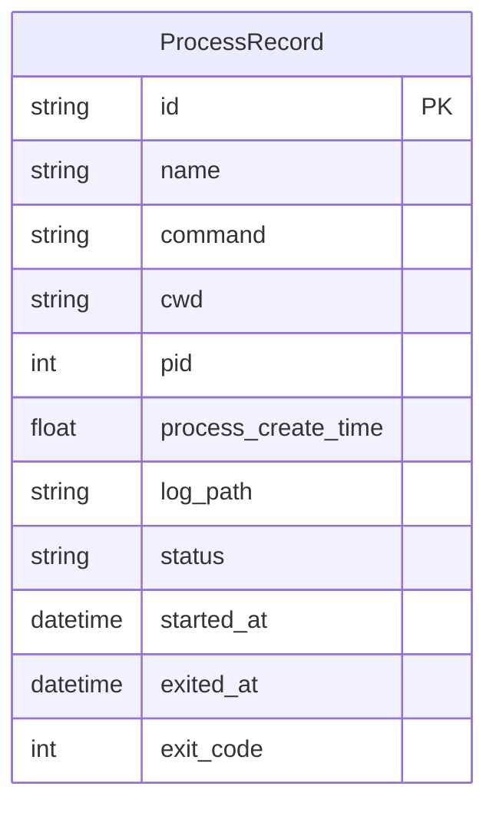
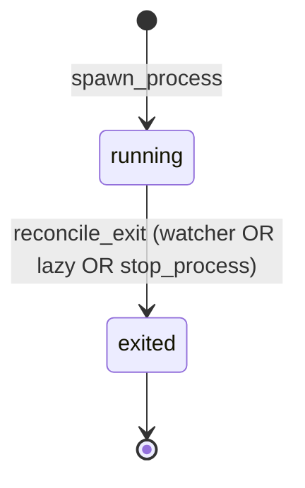

# Design: DLT-115 — Run and monitor detached shell commands

**Delta Spec**: [../delta-specs/DLT-115.md](../delta-specs/DLT-115.md)
**Status**: Draft

## Purpose

This document explains the design rationale for this delta: the modeling choices, data flow, system behavior, and architectural approach.

After implementation, the "Detected Impacts" section will guide reconciliation into feature design docs.

## Problem Context

The agent needs to spawn OS-level shell commands that survive Tachikoma's own exit, restart, or crash — e.g. a worker started on a VPS — and later query their status, read their logs, or stop them without shelling in. Tachikoma here is a lightweight process supervisor: the spawned process has no Claude/SDK involvement.

**Constraints:**
- Shared SQLite via the `Database` class (ADR-007) is the persistence layer. New tables share the same `Base(DeclarativeBase)` and `async_sessionmaker`.
- Bootstrap hooks (DES-003) are the initialization mechanism for subsystems.
- MCP tools follow the SDK MCP Tool Server Factory pattern (DES-006).
- Notifications flow through `tachikoma.notifications.dispatch_notification`, landing on the event bus (ADR-009); the priority buffer idle-gates delivery.
- Running processes must survive parent crash — no reliance on the parent being alive for process lifetime.
- PID reuse is a real concern: a naive `os.kill(pid, 0)` check can hit a recycled PID.
- POSIX-only (Linux + macOS) is acceptable; Windows is out of scope.

**Interactions:**
- Repository ↔ `Database`: shares `Base` and the async session factory.
- Bootstrap: `detached_processes_hook` runs after `database_hook`, creates the log directory, instantiates the repo, and reconciles crash-recovery records.
- Coordinator: the detached-process MCP server is merged into `all_mcp_servers` in `__main__.py` alongside `task-tools` and `workflow-tools`.
- Event bus (ADR-009): exit watcher calls `dispatch_notification`, producing `Notification` events.
- Priority buffer: subscribes to `Notification`; our events are just another producer, no bespoke delivery path.

## Design Overview

A new `tachikoma.detached_processes` subsystem owns a `ProcessRepository` (async SQLAlchemy, mirroring `TaskRepository`'s shape), a `spawn_process` / `terminate` / `is_alive` helper surface, a six-tool MCP server (DES-006), and an exit watcher.

Detachment is implemented with a single `asyncio.create_subprocess_exec("sh", "-c", wrapper, ..., start_new_session=True)` call. The wrapper wraps the user's command so it captures the exit code to a sidecar file:

    sh -c '<user command>; echo $? > {id}.exit'

Identity is a pair: the child's PID and its OS-reported creation time, read via `psutil.Process(pid).create_time()` at spawn. That pair protects against PID reuse: PID alone can't identify the process we launched.

Exit detection is hybrid:
- **Primary — event-driven**: `watchfiles.awatch()` on the per-process log directory. When the wrapper writes `{id}.exit`, the event fires within milliseconds. This is the common path for both clean exits and signal-induced exits where the wrapper survived long enough to run the second half of the shell line.
- **Fallback — periodic**: a ~5s loop lists `running` records and checks each via `psutil` liveness. Catches cases where the wrapper itself died without writing the sidecar (most importantly external `SIGKILL` of the wrapper, or shell process crash).

Both paths share a single `reconcile_exit(record)` reconciler that reads the sidecar when present, updates the record, and dispatches a notification with Normal priority on exit code 0 or Urgent on non-zero / unknown.

All MCP tool paths that touch a record (`list_processes`, `get_process`, `read_process_output`, `stop_process`) run the same liveness check inline as lazy reconciliation — this keeps record state consistent even if both watcher paths missed the event.

## Shape

| Part | Mechanism | Flag |
|------|-----------|:----:|
| **P0** | `ProcessRecord` frozen dataclass + `ProcessRecordRow` SQLAlchemy ORM model: `id`, `name`, `command` (original user string), `cwd`, `pid`, `process_create_time` (float; OS-reported `psutil.Process.create_time()` output — the PID-reuse identity anchor from R12; deliberately named differently from `started_at` to avoid confusion with the wall-clock persistence timestamp), `log_path`, `status` (`running` / `exited`), `started_at` (wall-clock UTC), `exited_at`, `exit_code` (nullable int). | |
| **P1** | `ProcessRepository`: async CRUD mirroring `TaskRepository`'s shape — frozen dataclasses at the boundary, shared `async_sessionmaker` from `Database`. Methods: `create`, `get`, `list_running`, `list_exited`, `update`, `delete`. Crash-recovery runs in the hook (not on the repo) using `list_running` and the shared reconciler. | |
| **P2** | `spawn_process(...)` helper: builds the wrapper string `sh -c '<cmd>; echo $? > <exit_path>'`, calls `asyncio.create_subprocess_exec("sh", "-c", wrapper, ...)` with `stdin=DEVNULL`, `stdout=<log_fd>`, `stderr=STDOUT`, `start_new_session=True`, `env={**os.environ, **overrides}`, `cwd=<target>`. Captures `pid = proc.pid` and `start_time = psutil.Process(pid).create_time()` immediately. On spawn success but subsequent DB-write failure, sends `SIGKILL` to the child process group as cleanup. | |
| **P3** | `is_alive(record) -> bool`: `psutil.Process(record.pid).create_time() == record.process_create_time and .is_running()`, wrapping `psutil.NoSuchProcess` / `psutil.AccessDenied` to return `False`. Used by the fallback watcher, lazy reconciliation, and `stop_process`'s pre-check. | |
| **P4** | Log-file lifecycle: open `{workspace}/.tachikoma/detached-processes/{id}.log` append-binary at spawn; pass the file descriptor as `stdout`; file retained on disk after exit. The spawn helper re-validates that the log directory exists and is writable (creating it if missing, re-raising a clear error on permission/IO failure) before calling `subprocess_exec` — the bootstrap hook's `mkdir` is best-effort startup and may be invalid if the user later deleted the dir. Reads are served by a `read_tail(path, n=100)` reverse-seek chunked reader (no full-file load) and `read_window(path, line_offset, line_count)` for line-based paging (line-offset semantics match R5). | |
| **P5** | `terminate(record, sig=SIGTERM, timeout=10)`: sends the signal to the child *process group* via `os.killpg(os.getpgid(pid), sig)` (necessary because `sh -c` is the child, and its user command may be a sub-process — group signalling reaches both). Polls `is_alive(record)` up to `timeout`, escalates to `SIGKILL` if still alive. `timeout=0` returns immediately after sending. PID-reuse protected via the `is_alive` check before each signalling. When invoked by `stop_process`, the subsequent `reconcile_exit` is called with `dispatch_notification=False` (per R15 — user-initiated stops don't produce notifications). | |
| **P6** | `create_detached_process_tools_server(repository, bus, log_dir)` factory (DES-006): returns an `McpSdkServerConfig` exposing six tools — `start_process`, `list_processes`, `get_process`, `read_process_output`, `stop_process`, `rename_process` — with Pydantic arg models and extracted handler functions. Closures capture `repository`, `bus`, and the log-directory path. | |
| **P7** | `detached_processes_hook` (DES-003) in `detached_processes/hooks.py`: creates `{workspace}/.tachikoma/detached-processes/` directory; instantiates `ProcessRepository` from the shared `Database`; runs crash-recovery by iterating `list_running()` and calling the shared `reconcile_exit(..., dispatch_notification=False)` for records whose process is no longer alive. Stores the repo in `ctx.extras["process_repository"]`. | |
| **P8** | `__main__.py` wiring: register the hook, retrieve the repository from `extras`, build the tool server, merge it into `all_mcp_servers`, start the exit watcher tasks (both the event-driven and fallback loops) as entries in `scheduler_tasks`. | |
| **P9** | Base system-prompt preamble section listing the six tools with one-line descriptions (R14). Lives as a new section appended to `SYSTEM_PREAMBLE_TEMPLATE` after the Tasks section, following the existing pattern. | |
| **P10** | Exit-code capture via the wrapper's `echo $? > {id}.exit` sidecar. Reconciler reads the file when present; if absent on detection, `exit_code` stays `None` and notification priority is Urgent. | |
| **P11a** | Event-driven watcher: `watchfiles.awatch(log_dir)` async loop. Filters events to `.exit` file creations/writes, parses the `{id}` prefix from the filename, fetches the record by id, calls `reconcile_exit(record)`. Idempotent against races with the fallback via the `status=running` filter inside the reconciler. | |
| **P11b** | Fallback polling watcher: periodic loop (`DETACHED_PROCESS_POLL_INTERVAL = 5`s) calling `repository.list_running()` and `is_alive()` on each; dead records go through `reconcile_exit(record)`. Idles cheaply when no records are `running`. | |
| **P11c** | `reconcile_exit(record, *, dispatch_notification: bool = True)`: the shared reconciler. Re-fetches the record and no-ops if `status != "running"` (race guard). Reads `{id}.exit` sidecar if present; when the file is absent on entry, performs a single 100ms retry before giving up (covers the fallback-watcher race where the kernel hasn't flushed the wrapper's write yet). Updates are issued as a conditional UPDATE (`WHERE status='running'`) so concurrent reconcilers converge to a single winner — the loser's `rowcount==0` path skips the notification. Updates `status="exited"`, `exited_at=now`, `exit_code=<parsed or None>`. If `dispatch_notification` is True and the UPDATE won the race, calls `dispatch_notification(bus, source=f"Detached process: {name}", content=<summary>, severity="info" if code == 0 else "error", priority=Priority.NORMAL if code == 0 else Priority.URGENT, source_id=record.id)`. Per-record try/except logs and continues. | |
| **P11d** | Watcher task registration: both the `watchfiles` consumer and the fallback polling loop are started as `asyncio.Task`s in `__main__.py`, appended to the existing `scheduler_tasks` list so the existing `finally`-block shutdown cancellation already covers them. The event-driven task takes `repository, bus, log_dir`; the fallback task takes the same parameters plus the poll interval. | |

### Flagged Unknowns

All four initial unknowns are resolved:

- **P2 (detachment mechanics)**: `start_new_session=True` is sufficient on Linux and macOS; the child becomes a session leader, detaches from the controlling TTY, and is reparented to init on parent exit. No double-fork, no `preexec_fn` needed. Identity pair is PID + `psutil.Process.create_time()`.
- **P3 (PID-reuse check)**: `psutil.Process(pid).create_time() == stored and .is_running()` with `NoSuchProcess`/`AccessDenied` wrapped to False. Zombies are not a concern — detached children are reparented to init and reaped there.
- **P10 (exit-code capture)**: wrapper sidecar file mechanism (above). Signal propagation is handled by sending signals to the *process group*, not the wrapper PID.
- **P11 (exit watcher)**: hybrid `watchfiles` + periodic poll, shared reconciler, registered as regular scheduler tasks.

## Components

### Implementation Structure

| Layer/Component | Responsibility | Key Decisions |
|-----------------|----------------|---------------|
| `src/tachikoma/detached_processes/__init__.py` | Public API re-exports | Clean package boundary; re-exports `ProcessRepository`, `detached_processes_hook`, `create_detached_process_tools_server`, and the two watcher task functions. |
| `src/tachikoma/detached_processes/model.py` | `ProcessRecord` frozen dataclass; `ProcessRecordRow` ORM model; `ProcessStatus` constant map. | Domain types frozen; ORM models internal to persistence; `to_domain()` / `ensure_utc()` mirroring the tasks subsystem. |
| `src/tachikoma/detached_processes/repository.py` | `ProcessRepository` — async CRUD over `ProcessRecordRow`: `create`, `get`, `list_running`, `list_exited`, `update`, `delete`. | Receives shared `async_sessionmaker`; raises `ProcessRepositoryError` wrapping underlying exceptions (mirrors `TaskRepositoryError`). |
| `src/tachikoma/detached_processes/errors.py` | `ProcessRepositoryError` exception. | Same shape as `TaskRepositoryError`. |
| `src/tachikoma/detached_processes/spawn.py` | `spawn_process(...)` (builds wrapper, calls `asyncio.create_subprocess_exec`, captures identity, persists record); `terminate(...)` (process-group signalling + escalation); `is_alive(record)`. | Uses `psutil` for identity + liveness; uses `os.killpg` + `os.getpgid` for group signalling. Kept outside the repository so tests can stub spawn behavior easily. |
| `src/tachikoma/detached_processes/log_io.py` | `read_tail(path, n)` / `read_window(path, offset, count)` for serving logs. | Reverse-seek chunked reader; no full-file load. Consumed by the MCP `read_process_output` handler. |
| `src/tachikoma/detached_processes/reconcile.py` | `reconcile_exit(record, *, dispatch_notification=True)` — the shared reconciler (P11c). | Takes repo + bus + log-dir via parameters (factory closures pass them in). Idempotent via re-fetch + `status=="running"` guard. |
| `src/tachikoma/detached_processes/watcher.py` | `event_driven_watcher(repository, bus, log_dir)` — consumes `watchfiles.awatch`. `polling_watcher(repository, bus, log_dir, interval)` — periodic fallback. Both call `reconcile_exit`. | Plain async functions started as `asyncio.Task`s; mirror the existing `instance_generator` / `session_task_scheduler` shape. |
| `src/tachikoma/detached_processes/tools.py` | `create_detached_process_tools_server(repository, bus, log_dir)` — DES-006 factory. Six `@tool`-decorated async closures (`start_process`, `list_processes`, `get_process`, `read_process_output`, `stop_process`, `rename_process`) over extracted handler functions. | Pydantic arg models per tool (`StartProcessArgs`, `ListProcessesArgs`, etc.); factory closures capture repo + bus + log-dir. Each handler that operates on an existing record runs `is_alive` + `reconcile_exit` before its main action (lazy reconciliation). |
| `src/tachikoma/detached_processes/hooks.py` | `detached_processes_hook(ctx)` — DES-003 bootstrap hook. | Creates log dir; instantiates repo from `ctx.extras["database"]`; runs crash recovery via `list_running()` + `reconcile_exit(..., dispatch_notification=False)` for dead records; stores repo in `ctx.extras["process_repository"]`. |
| `src/tachikoma/__main__.py` | Register the hook; build the tool server; merge into `all_mcp_servers`; start the two watcher tasks in `scheduler_tasks`. | Identical pattern to how `task-tools` and the task scheduler tasks are wired today. |
| `src/tachikoma/context/loading.py` (`SYSTEM_PREAMBLE_TEMPLATE`) | Add a "Detached Processes" section listing the six tools with one-line descriptions. | Appended after the existing Tasks section. Static content — no placeholders. |
| `pyproject.toml` | Add `psutil>=6.0` to `[project].dependencies`. | New runtime dependency. `watchfiles` is already present. |

### Cross-Layer Contracts

**Tool server contract (DES-006 shape):**

```
start_process(name, command, cwd?, env?) -> {id, pid, log_path}
list_processes(archived?) -> [{id, name, command, pid, cwd, started_at, status, ...}]
get_process(id) -> {...full record fields...}
read_process_output(id, offset?, count?) -> [log lines] | "no output yet"
stop_process(id, signal?, timeout?) -> status message
rename_process(id, name) -> status message
```

All tool errors return `{"is_error": True, "content": [{"type": "text", "text": <msg>}]}`. `ProcessRepositoryError` is caught specifically to surface root cause via `__cause__`; other errors use a generic fallback.

**Spawn contract (internal):**

```python
async def spawn_process(
    name: str,
    command: str,
    cwd: Path | None,
    env_overrides: dict[str, str] | None,
    log_dir: Path,
    repository: ProcessRepository,
) -> ProcessRecord:
    """
    Build wrapper, subprocess_exec with start_new_session=True,
    capture (pid, start_time), persist record. On DB failure after
    successful spawn, SIGKILL the process group as cleanup and re-raise.
    """
```

**Watcher ↔ reconciler ↔ notifications ↔ buffer** (see ADR-009 + priority-buffer design):

```mermaid
sequenceDiagram
    participant Wrapper as sh -c wrapper
    participant FS as Filesystem
    participant EW as event-driven watcher
    participant PW as polling watcher
    participant Rec as reconcile_exit
    participant Repo as ProcessRepository
    participant Notif as dispatch_notification
    participant Bus as EventBus
    participant Buf as PriorityBuffer

    Wrapper->>FS: echo $? > {id}.exit
    FS-->>EW: watchfiles event (Change.added)
    EW->>Rec: reconcile_exit(record)
    Note over PW: separately, every ~5s
    PW->>Repo: list_running()
    PW->>PW: is_alive(rec) — psutil check
    alt record still alive
        PW-->>PW: skip
    else record dead
        PW->>Rec: reconcile_exit(record)
    end
    Rec->>Repo: re-fetch; no-op if status!="running"
    Rec->>FS: read {id}.exit if present
    Rec->>Repo: update status=exited, exit_code, exited_at
    Rec->>Notif: dispatch_notification(priority=Normal|Urgent)
    Notif->>Bus: dispatch(Notification)
    Bus-->>Buf: handler → enqueue BufferedItem
    Note over Buf: idle gating → BufferedDelivery → active channel
```

**Integration Points**:
- Repo ↔ Database: shared `async_sessionmaker`, shared `Base`.
- Hook ↔ Repo: hook stores repo in `ctx.extras` under key `"process_repository"`.
- Tool server ↔ Bus: factory receives `bus`, tool closures don't dispatch directly — only `reconcile_exit` dispatches (invoked from watchers and lazy reconciliation).
- Watchers ↔ reconciler: both watchers use the same `reconcile_exit`; the re-fetch + `status=="running"` guard ensures idempotency.
- Tool handlers ↔ reconciler: every tool that operates on a record runs a liveness check and calls `reconcile_exit` for records that have died; this keeps `stop_process`-the-already-dead and `list_processes`-the-stale-record consistent (R15 acceptance criteria for lazy reconciliation).

**Error contract:**
- Tool errors: MCP-style `{"is_error": True, ...}`; `ProcessRepositoryError` surfaces its `__cause__`.
- Watcher errors: caught per-record; logged via `_log.exception`; loops continue.
- Spawn failures (child never ran): tool returns clear error; no record persisted.
- Post-spawn DB failure: child process group sent `SIGKILL`; error surfaced to tool.

## Modeling

### ProcessRecord

```
ProcessRecord (frozen dataclass)
├── id: str                         (UUID)
├── name: str                       (display label, non-unique — R16)
├── command: str                    (original user command string)
├── cwd: str                        (absolute path string)
├── pid: int                        (OS pid of the wrapper shell)
├── process_create_time: float      (psutil.Process.create_time(); identity anchor — R12)
├── log_path: str                   (absolute path string)
├── status: str                     ("running" or "exited")
├── started_at: datetime            (wall-clock UTC, set at spawn)
├── exited_at: datetime | None      (UTC; set on reconciliation)
└── exit_code: int | None           (None when wrapper died before sidecar)
```

### Entity



No foreign keys — detached processes are standalone records. Their lifecycle is independent of tasks, sessions, and everything else.

### Status lifecycle



There is deliberately no intermediate `stopping` state — `stop_process` either reconciles immediately (already dead) or sends a signal + reconciles after polling. A record is `running` until the reconciler writes `exited`.

## Data Flow

### Spawn flow

```
1. Agent calls start_process({name, command, cwd?, env?})
2. Handler validates: name/command non-empty; cwd exists (if provided)
3. Handler assigns id = uuid4()
4. exit_path = log_dir / f"{id}.exit"
5. log_path = log_dir / f"{id}.log"
6. wrapper = f"{command}; echo $? > {exit_path}"   (shell-safe quoting)
7. Open log_path in "ab"; get fd
8. asyncio.create_subprocess_exec(
       "sh", "-c", wrapper,
       stdin=DEVNULL, stdout=fd, stderr=STDOUT,
       start_new_session=True,
       env={**os.environ, **(env or {})},
       cwd=cwd_or_tachikoma_cwd,
   )
9. process_create_time = psutil.Process(proc.pid).create_time()
10. Persist ProcessRecord(status="running", ...)
    On DB failure: os.killpg(os.getpgid(proc.pid), SIGKILL); re-raise
11. Return {id, pid, log_path}
```

### Exit detection — event-driven path

```
1. wrapper finishes user cmd → shell writes echo $? > {id}.exit
2. watchfiles.awatch emits Change.added for {id}.exit
3. event_driven_watcher parses id from filename
4. repository.get(id) → record
5. reconcile_exit(record)
   a. re-fetch; if status != "running": return (race with fallback / lazy)
   b. exit_code = parse {id}.exit if exists else None
   c. repository.update(id, status="exited", exited_at=now, exit_code=exit_code)
   d. dispatch_notification(...)
```

### Exit detection — fallback polling path

```
Every 5s:
  for record in repository.list_running():
      if not is_alive(record):
          await reconcile_exit(record)
```

### Lazy reconciliation (tool-call path)

Every tool that operates on an existing record (`list_processes`, `get_process`, `read_process_output`, `stop_process`):

```
  for each record in scope:
      if record.status == "running" and not is_alive(record):
          await reconcile_exit(record)
      proceed with tool-specific logic using reconciled record
```

### Crash recovery (bootstrap)

```
detached_processes_hook:
  - mkdir -p {workspace}/.tachikoma/detached-processes/
  - repository = ProcessRepository(database.session_factory)
  - for record in await repository.list_running():
      if not is_alive(record):
          await reconcile_exit(record, dispatch_notification=False)
  - ctx.extras["process_repository"] = repository
```

Notifications are suppressed during startup — a user rebooting Tachikoma shouldn't receive a barrage of Urgent notifications for workers that died days ago.

### Stop flow

```
1. Agent calls stop_process({id, signal?, timeout?})
2. Handler gets record; if not found → clear error
3. Lazy is_alive check; if already dead → reconcile_exit(record, dispatch_notification=False); return "already stopped"
4. os.killpg(os.getpgid(record.pid), signal_or_SIGTERM)
   - If OSError PermissionError → clear error without mutating record
5. If timeout == 0: return "signal sent" (watcher will reconcile; a notification may fire from the watcher — acceptable, as it reflects the actual process exit)
6. Poll is_alive(record) with small sleeps until alive==False or timeout exceeded
7. If still alive: os.killpg(..., SIGKILL); poll briefly to confirm
8. reconcile_exit(record, dispatch_notification=False)

Note: R15 disallows stop_process from dispatching a notification. If a watcher fires first for the same exit (e.g. wrapper wrote the sidecar between signal and local poll), the conditional UPDATE ensures only one reconcile wins; if the watcher wins, a notification does fire — this is the watcher reporting the actual process exit, not stop_process. Eliminating that possibility entirely would require a "stopping" intermediate state and is out of scope here.
```

## Key Decisions

### psutil as the identity + liveness mechanism

**Choice**: Add `psutil>=6.0` to runtime dependencies. Use `Process.create_time()` for the identity anchor and `Process.is_running()` / `send_signal()` for interactions where PID-reuse protection matters.
**Why**: psutil is the canonical cross-platform answer on Linux and macOS. `Process.create_time()` is cached after first call (stable for equality comparison), and destructive methods like `send_signal()` internally run a PID+creation-time check. Implementing the same ourselves against `/proc/<pid>/stat` would be Linux-only and reinvent the wheel.
**Sources**: psutil 6.x docs — `psutil.Process.create_time()` (returns process creation time as POSIX float, cached after first call; https://psutil.readthedocs.io/en/latest/#psutil.Process.create_time), `Process.is_running()` (https://psutil.readthedocs.io/en/latest/#psutil.Process.is_running), and the project-recommended PID-reuse pattern in the psutil README's "Recipes" section. Python 3.12/3.13 both supported.
**Options Researched**: `psutil`; `/proc/<pid>/stat` parsing; `os.kill(pid, 0)` (no reuse protection); `psutil.pid_exists` (no reuse protection, returns True for zombies).
**Why This Over Alternatives**: psutil provides reuse protection, is cross-platform, actively maintained, and avoids reinventing the wheel. `/proc` parsing is Linux-only. `pid_exists` / `os.kill(pid, 0)` don't guard against PID reuse.

**Consequences**:
- Pro: Cross-platform (Linux + macOS) with zero custom OS code.
- Pro: Reuse protection for signalling methods, shrinking bug surface in `stop_process`.
- Pro: Simpler testing (psutil is mockable; fewer platform `if`s).
- Con: One new runtime dependency. psutil is widely-used and actively maintained — low cost.

### Wrapper-based exit-code capture

**Choice**: Spawn the child as `sh -c '<cmd>; echo $? > {id}.exit'`. The sidecar file carries the exit code after the user command returns.
**Why**: R13 is Nice-to-have, but R15 uses exit code 0 vs non-zero to choose Normal vs Urgent notification priority. Without a capture mechanism, every notification is Urgent, which defeats the priority distinction. The wrapper is the simplest mechanism that actually delivers the exit code without a long-running supervisor process.
**Sources**: Python `asyncio.create_subprocess_exec` docs (https://docs.python.org/3/library/asyncio-subprocess.html — `start_new_session` parameter inherited from `subprocess.Popen`); POSIX `sh(1)` for `$?` semantics and compound-statement execution.
**Options Researched**: sidecar wrapper (chosen); skip R13 (all Urgent); long-running helper process that waits on the child (too heavy, fails the survive-parent requirement anyway); capture via `proc.wait()` (only works while Tachikoma is alive — fails survival).
**Why This Over Alternatives**: Sidecar wrapper works across restarts (file on disk survives anything short of the disk itself). No helper process to manage. Skipping R13 makes notification priority meaningless.

**Consequences**:
- Pro: Exit codes captured across Tachikoma restarts — both crash recovery and the event watcher read the same sidecar.
- Pro: Enables meaningful Normal/Urgent notification priority.
- Con: `ps` output shows `sh -c '<cmd>; echo $? ...'`, not the raw user command. Mitigated: the MCP tools display the stored `command` field, not what `ps` shows. A human on the host directly sees the wrapper but this is a minor surprise, not a correctness issue.
- Con: SIGKILL of the wrapper itself leaves no sidecar. Mitigated: the fallback watcher detects this and reconciles with `exit_code=None`, which maps to Urgent priority — the correct signal for an abnormal termination.

### Hybrid exit watcher: `watchfiles` event-driven + periodic fallback

**Choice**: Two parallel watcher tasks sharing a single `reconcile_exit` reconciler. The event-driven one uses `watchfiles.awatch()` (already a dependency) for fast common-case detection; the fallback polls `psutil.is_running()` every 5s for edge cases where the wrapper died without writing the sidecar.
**Why**: Pure polling is slow (a 30s+ poll interval can't meet R15's Urgent idle-window of 30s); pure event-driven misses `SIGKILL`-of-wrapper. The hybrid is both fast-common and robust. Both paths converge on one reconciler so there's no duplicated logic; the reconciler's `status=="running"` guard makes duplicate wake-ups no-ops.
**Sources**: `watchfiles` docs for `awatch()` (https://watchfiles.helpmanual.io/api/watch/#watchfiles.awatch — async generator yielding `set[tuple[Change, str]]`, Rust-backed, inotify/FSEvents/kqueue). `watchfiles` is already a project dependency (used by skills watching). psutil `is_running()` docs as above.
**Options Researched**:
- Pure periodic polling — simple but can't meet the 30s Urgent window with a reasonable interval.
- Pure event-driven `watchfiles` — fast but fails on SIGKILL-of-wrapper.
- `asyncio.subprocess.Process.wait()` — only works during parent lifetime; fails the survive-parent requirement.
- POSIX `SIGCHLD` signal handler — only valid for direct children and only while parent is alive.
- Hybrid (chosen).

**Why This Over Alternatives**: Fast common-case + robust edge-case without much extra code. watchfiles is already integrated; psutil is already required for P3. Reuses the existing scheduler-task pattern for registration.

**Consequences**:
- Pro: Sub-second detection in the common case.
- Pro: Robust against wrapper crashes and external `SIGKILL`.
- Pro: Idle-cheap — when no records are `running`, both loops do near-nothing.
- Con: Two tasks instead of one; marginally more code to manage. Mitigated by sharing the reconciler.

### Notifications via the existing priority buffer (no new delivery path)

**Choice**: The exit watcher calls `dispatch_notification` (shared helper in `tachikoma.notifications`), producing a `Notification` event. The existing priority buffer subscribes to `Notification` and handles idle-gated delivery. No bespoke channel integration.
**Why**: ADR-009 standardized inter-subsystem signalling on the bus; the priority buffer was designed explicitly to be the single producer-agnostic delivery path. Adding a direct-to-channel path for this subsystem would duplicate idle-gating logic and violate that architecture.
**Sources**: ADR-009; `docs/feature-designs/delivery/priority-buffer.md` (buffer subscribes to `Notification` already — no changes to buffer code needed).
**Consequences**:
- Pro: Zero changes to buffer or channels.
- Pro: Consistent idle-gating behavior across all notification producers.
- Pro: Shutdown-flush behavior inherited for free.
- Con: Priority semantics (Normal vs Urgent) are the only knob; no custom chrome. Acceptable — notifications are plain text.

### Process-group signalling via `os.killpg`

**Choice**: `stop_process` and the DB-failure cleanup path signal the child process *group* via `os.killpg(os.getpgid(pid), sig)`, not the wrapper PID directly.
**Why**: The wrapper is `sh -c 'cmd; echo $? > file'`. The shell forks for `cmd` (most shells don't `exec` when there's a second statement). Signalling only the shell PID leaves the user's command running. `start_new_session=True` places the wrapper (and its descendants) into a dedicated process group, so group-signalling reaches the whole tree cleanly.
**Sources**: Python `os.killpg` docs (https://docs.python.org/3/library/os.html#os.killpg), `os.getpgid` docs (https://docs.python.org/3/library/os.html#os.getpgid); `subprocess.Popen(..., start_new_session=True)` semantics (https://docs.python.org/3/library/subprocess.html#subprocess.Popen — creates a new session; child becomes session leader; `pgid == pid`).
**Consequences**:
- Pro: Reliable termination of the real workload, not just the wrapper.
- Pro: Predictable pgid — with `start_new_session=True`, `getpgid(pid) == pid`.
- Con: None practical; this is the canonical POSIX pattern.

### Lazy reconciliation on every tool call

**Choice**: Every tool that reads a record (`list_processes`, `get_process`, `read_process_output`, `stop_process`) runs the liveness check and reconciles if dead, before running the tool's main logic.
**Why**: R15 explicitly requires this as a fallback AC. Even with the event-driven watcher, there's a small detection window; lazy reconciliation ensures that whenever the agent touches a record, it sees consistent state. Implementation-wise, it's just `reconcile_exit(record)` at the top of each handler.
**Consequences**:
- Pro: Consistent state regardless of watcher timing.
- Pro: `stop_process` on an already-dead record yields the correct "already stopped" message, never accidentally signalling a reused PID.
- Con: Tools pay an extra psutil call per record. psutil calls are microseconds; negligible.

### Crash-recovery in the bootstrap hook, with notifications suppressed

**Choice**: The bootstrap hook runs `reconcile_exit(..., dispatch_notification=False)` for dead `running` records at startup.
**Why**: Rebooting Tachikoma shouldn't produce a flood of Urgent notifications for processes that died hours or days ago. Reconciliation is still necessary so records reflect truth; suppressing the notifications is the user-friendly choice.
**Consequences**:
- Pro: Clean startup; records accurate.
- Pro: No surprise notification burst.
- Con: The user loses "your worker died while offline" signals. Acceptable — `list_processes(archived=true)` surfaces those on demand.

### Subsystem lives under `src/tachikoma/detached_processes/` mirroring `tasks/`

**Choice**: New package with `__init__.py`, `model.py`, `repository.py`, `errors.py`, `spawn.py`, `log_io.py`, `reconcile.py`, `watcher.py`, `tools.py`, `hooks.py`.
**Why**: The `tasks/` subsystem is the closest analog (persistent records, MCP tools, scheduler tasks, crash recovery). Mirroring its layout keeps the codebase consistent and makes the new code immediately navigable for anyone who already knows `tasks/`.
**Consequences**:
- Pro: Zero structural surprise.
- Pro: Each concern lives in its own module — testable in isolation.
- Con: More files than a monolithic module; consistent with the rest of the codebase.

## System Behavior

### Scenario: Clean exit (user command returns 0)

**Given**: A record is `running` with a wrapper that just finished its user command with exit code 0.
**When**: The shell writes `0` to `{id}.exit` and terminates.
**Then**: `watchfiles` fires for `{id}.exit`. The event-driven watcher calls `reconcile_exit`. The record transitions to `exited` with `exit_code=0` and `exited_at=now`. A `Notification` is dispatched with Normal priority. The priority buffer idle-gates it and the active channel delivers it at the next natural idle window.

### Scenario: Non-zero exit

**Given**: A record is `running`; the user command exits with code 1.
**When**: Same as above; wrapper writes `1` to the sidecar.
**Then**: Same reconciliation, but `exit_code=1` and priority is Urgent. The buffer delivers sooner (30s idle window for Urgent vs 120s for Normal).

### Scenario: External SIGKILL on wrapper

**Given**: A record is `running`; someone runs `kill -9 <pid>` against the wrapper.
**When**: The wrapper dies without writing `{id}.exit`.
**Then**: No `watchfiles` event (no file written). The fallback polling watcher's next tick (≤5s later) sees `is_alive(record) == False`, calls `reconcile_exit(record)`. The reconciler finds no sidecar, sets `exit_code=None`, and dispatches Urgent.

### Scenario: Tachikoma down while process exits

**Given**: A record is `running`; Tachikoma is killed; later the user command exits cleanly while Tachikoma is offline.
**When**: Tachikoma restarts.
**Then**: `detached_processes_hook` calls `list_running` and iterates. `is_alive(record)` returns False. The hook calls `reconcile_exit(record, dispatch_notification=False)`, reads the sidecar (written while Tachikoma was offline), and updates the record. No notification. `list_processes(archived=true)` reveals the exit code on demand.

### Scenario: `list_processes` during a detection window

**Given**: A record is `running`; the user command just exited; the event-driven watcher hasn't fired yet.
**When**: The agent calls `list_processes`.
**Then**: The handler iterates running records, runs lazy `is_alive` on each; the just-exited one returns False; `reconcile_exit` runs inline; the record is updated and a notification dispatched. The `list_processes` response reflects reconciled state. When the watcher fires a beat later, its `reconcile_exit` re-fetches and finds `status != "running"` — no-op.

### Scenario: `stop_process` on an already-dead record

**Given**: A record whose process has died but hasn't been reconciled yet.
**When**: The agent calls `stop_process`.
**Then**: The handler calls `reconcile_exit(record, dispatch_notification=False)` (user-initiated stop); the record transitions to `exited` silently and the handler returns "already stopped". No notification is produced — satisfying R15's "stop_process does not dispatch Notification" requirement. If the record was reconciled concurrently by the watcher (it may have fired first), the reconciler's conditional UPDATE races cleanly: the first writer dispatches, the second (stop_process's) sees `rowcount==0` and skips regardless.

### Scenario: `stop_process` with `timeout=0`

**Given**: A running record.
**When**: Agent calls `stop_process(id, signal=SIGTERM, timeout=0)`.
**Then**: `os.killpg` sends SIGTERM; no polling; tool returns "signal sent". Record remains `running` until the watcher (or a subsequent tool call) reconciles the exit.

### Scenario: PID reuse between records

**Given**: Record A's process exited long ago; its PID has been reused by an unrelated process.
**When**: Any code path runs `is_alive(record_A)`.
**Then**: `psutil.Process(pid).create_time()` returns the new process's creation time, which differs from A's stored `process_create_time`. `is_alive` returns False. A's next reconciliation marks it `exited`. The unrelated process is never signalled — psutil's destructive methods would guard against this anyway.

### Scenario: Spawn succeeds but DB write fails

**Given**: `asyncio.create_subprocess_exec` returns a live child; the subsequent `repository.create` raises (e.g. disk I/O error).
**When**: The spawn helper's exception path runs.
**Then**: `os.killpg(os.getpgid(pid), SIGKILL)` cleans up the orphaned child; the error propagates to the tool handler, which returns a clear error. No record exists; no orphan process.

### Scenario: Log file missing on read

**Given**: A record exists; its log file has been deleted externally.
**When**: Agent calls `read_process_output(id)`.
**Then**: `read_tail` raises `FileNotFoundError`; the tool returns a clear "log file unreadable" error without altering the record.

### Scenario: Watcher error for one record

**Given**: The event-driven watcher receives an event for a record whose DB row has been deleted manually.
**When**: `repository.get(id)` returns None.
**Then**: The watcher logs a warning and continues processing subsequent events. The loop is not terminated. Same isolation applies to `reconcile_exit` errors (per-record try/except).

## Open Questions

None — all flagged unknowns are resolved.

### Accepted Edge-Case Tradeoffs

- **stop_process + watcher race (R15)**: stop_process passes `dispatch_notification=False` on its own reconcile calls. If the watcher fires first for the same exit (milliseconds possible), the conditional UPDATE hands the write to whichever arrives first — if the watcher wins, a notification is produced by the watcher (the canonical R15 producer). A fully race-free "no notification ever for stop-initiated exits" would require a `stopping` intermediate state; this is deliberately out of scope.
- **Sidecar flush race (R13)**: the reconciler does a single 100ms retry when the sidecar is absent at read time, covering the common kernel-buffer lag. A persistent absence still maps to `exit_code=None` → Urgent, which is the correct signal.

---

## Detected Impacts

### Affected Feature Designs

- **docs/feature-designs/delivery/priority-buffer.md** — Modifies: the list of `Notification` producers gains "detached-process exit watcher" alongside the background-task executor and agent-driven `send_notification`. No behavioral change in the buffer itself.
- **docs/feature-designs/tasks/background-task-execution.md** — Possibly modifies: if this design documents the canonical producers and priority conventions for `Notification`, add the detached-process exit watcher as another producer. (Minor; review during reconciliation.)

### Notes for Reconciliation

- Create `docs/feature-designs/detached-processes/` mirroring `docs/feature-specs/detached-processes/`. At minimum, a `README.md` plus a `process-supervision.md` design summarizing the subsystem's architecture.
- `DES-003` (bootstrap hooks) gains a new registered hook in its list of examples if that list is maintained.
- `DES-006` (MCP tool factory) gains another consumer in its example list if that list is maintained.
- ADR-007 (persistence layer) gains a new table but no structural change.
- `SYSTEM_PREAMBLE_TEMPLATE` in `context/loading.py` gets a new "Detached Processes" section listing the six tools.

## Notes

- Adds one new runtime dependency: `psutil>=6.0`. `watchfiles` is already present.
- The "wrapper shows up in `ps` output" tradeoff is accepted and documented here so anyone inspecting the host directly knows what they're looking at. The MCP tools display the stored `command` field, not `ps`.
- Both watcher tasks deliberately match the existing scheduler-task shape (`instance_generator`, `session_task_scheduler`, `background_task_runner`). This keeps the `__main__.py` startup/shutdown logic uniform and inherits cancellation on shutdown.
- `reconcile_exit`'s `dispatch_notification` suppression flag is only used in the bootstrap hook's crash-recovery path. All other call sites default to dispatching — the default behavior is correct and the suppression is explicit.
