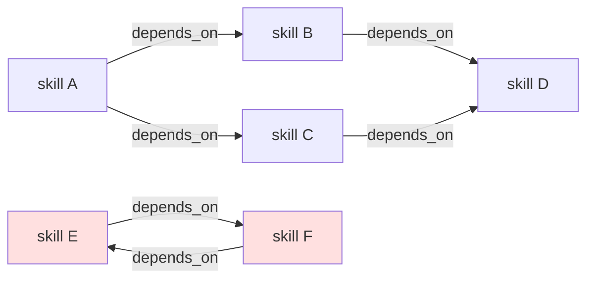

# Design: DLT-118 — Declare dependencies between skills

**Delta Spec**: [../delta-specs/DLT-118.md](../delta-specs/DLT-118.md)
**Status**: Draft

## Purpose

This document explains the design rationale for this delta: the modeling choices, data flow, system behavior, and architectural approach.

After implementation, the "Detected Impacts" section will guide reconciliation into feature design docs.

## Problem Context

Skills often assume foundations that live in *other* skills. The built-in `workflow-authoring-guide` is the canonical example: most skills that author workflows implicitly rely on its concepts and conventions. Today, a skill has no way to declare this relationship. The skills context provider classifies each candidate skill independently per message, so foundational skills are only loaded when the classifier happens to also detect them — a fragile outcome that depends on the user's wording rather than the skill's actual dependencies.

**Constraints:**

- Must not change the classification contract — dependency resolution runs strictly after classification and does not influence the candidate list (R9).
- Emitted dep-loaded entries must be shape-identical to classification-loaded entries so downstream agent derivation treats them uniformly (R8).
- Resolution must terminate on cycles (intentional or accidental) without error (R4).
- Unknown dependency names must be tolerated (typo, deleted skill) — one authoring-time warning per dependent skill, silent during resolution (R5).
- Must align with the existing workspace-over-builtin override precedence (R12) — a workspace skill that shadows a built-in uses the workspace version's `depends_on`.
- Per-message atomicity: the provider's `refresh() → resolve_chain()` sequence within a single message must observe a single registry snapshot (R11).

**Interactions:**

- `SkillRegistry` already parses `SKILL.md` frontmatter, stores `Skill` records, and supports `refresh()` / `add_source()` with swap-on-success. This delta extends the dataclass, parser, and registry with one new resolver method plus a validation/memoization hook.
- `SkillsContextProvider` already dedups against `existing_entries` (via `extract_skill_names`) and emits one `ContextResult` per classification-detected skill. This delta expands each detected skill through the resolver before dedup, keeping the per-skill emission shape.
- DLT-117 (task-attached skills) and DLT-119 (workflow step binding) are explicitly out of scope, but both will eventually call the same `resolve_chain` entry point — so the API has to be usable outside the classification path too.

## Design Overview

Three narrow extensions to the existing `skills/` subsystem:

1. **Dataclass + parser (P1)** — `Skill` gains a `depends_on: tuple[str, ...]` field; `_load_skill` parses the frontmatter value with the same "warn + fall back to empty" policy used for other optional fields.
2. **Registry resolver + memoization (P2, P4) + validation pass (P3)** — `SkillRegistry` gains `resolve_chain(skill_name) → list[Skill]` (DFS, deps-first, anchor-last, visited-set for cycle breaking and dedup) backed by a `_chain_cache` dict; `refresh()` and `add_source()` clear the cache alongside their existing bookkeeping. A post-discovery validation pass walks the freshly loaded skill set once and logs one warning per dependent skill whose `depends_on` contains unknown names.
3. **Provider chain expansion (P5)** — `SkillsContextProvider.provide()` calls `resolve_chain` for each classification-detected skill, flattens the combined chains into an ordered dedup list, filters against `existing_entries` using the existing `extract_skill_names` helper, and emits one `ContextResult` per remaining skill using the same `<skill>` XML shape and `skill_name` metadata as before.

No new files, no new modules, no new dependencies. Everything lives in `src/tachikoma/skills/registry.py` and `src/tachikoma/skills/context_provider.py`.

```
┌───────────────────────────────────────────────────────────────────┐
│  SkillsContextProvider.provide()                                  │
│                                                                   │
│  registry.refresh()                                               │
│      │                                                            │
│      ▼                                                            │
│  classify unloaded skills ──► detected_names: list[str]           │
│      │                                                            │
│      ▼                                                            │
│  for name in detected_names:                                      │
│      chain = registry.resolve_chain(name)   # deps-first          │
│      ordered_merge(chain)                   # dedup, preserve     │
│                                              # first-seen order   │
│      │                                                            │
│      ▼                                                            │
│  filter against extract_skill_names(existing_entries)             │
│      │                                                            │
│      ▼                                                            │
│  emit one ContextResult per remaining Skill                       │
└───────────────────────────────────────────────────────────────────┘

┌───────────────────────────────────────────────────────────────────┐
│  SkillRegistry                                                    │
│                                                                   │
│  resolve_chain(name) ─► cache hit? ─── yes ──► return cached      │
│                             │                                     │
│                             no                                    │
│                             ▼                                     │
│                         DFS with visited-set                      │
│                             │                                     │
│                             ▼                                     │
│                         cache and return                          │
│                                                                   │
│  refresh() / add_source() ─► clear _chain_cache alongside         │
│                              existing fresh-dict swap             │
│                                                                   │
│  _validate_deps() ─► one warning per dependent skill with any     │
│                      unknown dep names (called at end of          │
│                      __init__, refresh(), and add_source())       │
└───────────────────────────────────────────────────────────────────┘
```

## Shape

<!-- Seeded from spec phase (user-approved). Evolved during design; no flagged unknowns. -->

| Part | Mechanism | Flag |
|------|-----------|:----:|
| **P1** | Extend the `Skill` dataclass with a `depends_on: tuple[str, ...]` field; parse and validate the frontmatter value in `_load_skill` (must be a list of strings; malformed → warn + treat as empty). | |
| **P2** | Add `SkillRegistry.resolve_chain(skill_name) -> list[Skill]`: depth-first traversal, deps-first ordering with the anchor skill included last, a visited-set to break cycles (including self-references) and dedup, unknown dep names silently skipped during traversal. | |
| **P3** | After loading (end of `__init__`, `refresh()`, and `add_source()`), run a single validation pass that walks `_skills` and, for each skill with declared deps, collects the set of names not present in `_skills` and emits one warning per dependent skill listing all of its missing dep names. | |
| **P4** | Memoize `resolve_chain` results on the registry in `_chain_cache: dict[str, list[Skill]]` (keyed by skill name, unfiltered chain); clear the cache inside `refresh()` alongside the fresh-dict swap, and at the start of `add_source()` before `_discover(path)` runs (so that if the added source introduces skills that satisfy previously-unknown deps, no stale cache survives). | |
| **P5** | `SkillsContextProvider` expands each classification-detected skill via `resolve_chain`, merges the chains in order (first-seen-wins) into a single deduped list, filters the combined chain against skills already present in `existing_entries` (via `extract_skill_names`), and emits one `ContextResult` per remaining skill — preserving the existing `<skill>` XML shape and `skill_name` metadata so agent derivation treats dep-loaded and classification-loaded skills uniformly. | |

### Flagged Unknowns

_None — all mechanisms are understood._

### Requirements Coverage

| R | Covered by |
|---|------------|
| R1 | P1 (frontmatter parsing) |
| R2 | P1 (`Skill.depends_on` storage) |
| R3 | P2 (`resolve_chain` DFS, deps-first, anchor-last) |
| R4 | P2 (visited-set cycle break) |
| R5 | P3 (authoring-time warning) + P2 (silent skip during resolution) |
| R6 | P5 (provider expansion) |
| R7 | P5 (provider dedup against `existing_entries`); P2/P4 keep registry resolver unfiltered and cache key = name only |
| R8 | P5 (same `<skill>` XML + `skill_name` metadata shape) |
| R9 | P5 (expansion runs *after* classification produces `detected_names`) |
| R10 | P4 (`_chain_cache` + invalidation on refresh/add_source) |
| R11 | Provider calls `refresh()` once at the start of `provide()`; all subsequent `resolve_chain` calls in the same invocation hit the same registry state (existing per-message contract) |
| R12 | Falls out of registry's existing last-wins behavior — `_skills[name]` is whichever source registered it last, and `resolve_chain` only reads `_skills` |

## Components

### Implementation Structure

| Layer/Component | Responsibility | Key Decisions |
|-----------------|----------------|---------------|
| `skills/registry.py` — `Skill` dataclass | Carries the parsed `depends_on` tuple alongside existing metadata | Tuple (not list) for frozen-dataclass hashability and immutability; defaults to `()` so existing call sites constructing `Skill` without the field are unaffected |
| `skills/registry.py` — `_load_skill` | Parses `depends_on` from frontmatter with the same "warn + empty" policy as other optional fields | Malformed value (not a list, or any non-string element) → warn once, treat as empty; empty and missing collapse to the same state |
| `skills/registry.py` — `SkillRegistry.resolve_chain` | Returns the transitive dependency chain for a skill, deps-first with anchor last | DFS with a visited-set for both cycle-breaking and dedup; unknown dep names silently skipped at traversal time; pure function over `_skills`, no side effects |
| `skills/registry.py` — `SkillRegistry._chain_cache` | Memoizes resolved chains keyed by skill name | Plain `dict[str, list[Skill]]`; cleared inside `refresh()` alongside the fresh-dict swap, and at the start of `add_source()`; populated on first `resolve_chain(name)` call |
| `skills/registry.py` — `SkillRegistry._validate_deps` | One-time post-discovery validation pass that logs unknown dep names per dependent skill | Called at the end of `__init__`, at the end of a successful `refresh()`, and at the end of `add_source()`; walks `_skills` once; emits at most one warning per dependent skill |
| `skills/context_provider.py` — `SkillsContextProvider.provide` | Expands classification results into the transitive chain before dedup and emission | Chain expansion happens after classification and before the existing `extract_skill_names` dedup; same emission shape (tag, content, metadata) as today |

### Cross-Layer Contracts

**Resolver contract (`SkillRegistry.resolve_chain`):**

```
resolve_chain(skill_name: str) -> list[Skill]

Given a registered skill name, returns the transitive dependency chain
deps-first with the anchor skill included last. Each skill appears at
most once. Cycles (including self-references) are broken silently.
Unknown dependency names are silently skipped.

Preconditions:
  - skill_name is in self._skills

Postconditions:
  - returned list is non-empty and ends with self._skills[skill_name]
  - dependency ordering: for every declared edge X → Y where Y is reachable
    from the anchor without traversing a back-edge, Y appears before X in
    the returned list
  - every element of the returned list is in self._skills at call time
  - each skill appears exactly once

Errors:
  - KeyError if skill_name is not in self._skills. The provider already
    filters classified names against self._registry.skills (see the
    `valid_names` filter in context_provider.py) before calling, so the
    precondition holds in the classification path today. Future callers
    (DLT-117, DLT-119) must preserve this invariant.
```

**Provider expansion contract:**

```
Given: detected_names: list[str]  (from classifier, all in self._registry.skills)
       existing_entries: list[SessionContextEntry]

Pipeline:
  1. loaded_names = extract_skill_names(existing_entries)
  2. ordered_chain: list[Skill] = []
     seen: set[str] = set()
     for name in detected_names:
         for skill in self._registry.resolve_chain(name):
             if skill.name in seen:
                 continue
             seen.add(skill.name)
             ordered_chain.append(skill)
  3. ordered_chain = [s for s in ordered_chain if s.name not in loaded_names]
  4. emit one ContextResult per Skill in ordered_chain

Invariants:
  - ordered_chain preserves first-seen order (deps-first within each
    classification-detected skill, classification order across skills)
  - every emitted ContextResult has metadata={SKILL_NAME_META_KEY: skill.name}
    and tag=SKILLS_OWNER
```

**Integration Points:**

- `SkillRegistry.__init__` / `refresh()` / `add_source()` ↔ `_validate_deps`: all three load paths call `_validate_deps` after populating `_skills`.
- `SkillRegistry.refresh()` ↔ `_chain_cache`: cleared at the same moment the agents/skills/workflows dicts are swapped to fresh empty dicts. On `refresh()` failure, the cleared cache remains empty — since an empty cache is always consistent with any `_skills` state, no restore is needed (the next `resolve_chain` call pays a cold-cache recompute, nothing more). Only the agents/skills/workflows dicts need to be saved and restored.
- `SkillRegistry.add_source()` ↔ `_chain_cache`: cleared at the start of the method before `_discover(path)` runs. Cache is almost always empty at this point (startup-only call), but the clear is cheap insurance against future misuse. Note: `add_source()` does not use swap-on-success today — it simply appends to `_skill_sources` and calls `_discover(path)` — so the cache-clear here is independent of any swap.
- `SkillsContextProvider` ↔ `SkillRegistry.resolve_chain`: the provider holds the registry reference it already has; no new injection points.
- `SkillsContextProvider` ↔ `extract_skill_names`: already used today to dedup classification output; this delta reuses the same helper on the expanded chain.

### Shared Logic

- **Dependency parsing policy** — the parser uses a warn-and-fall-back policy on a malformed `depends_on` value (not a list, or any non-string element → warn once, treat as `()`). This is deliberately more lenient than `_load_agent`'s reject-on-invalid-`tools` policy, which drops the whole agent: a bad `depends_on` list should not hide the entire skill from classification, since the skill's core content is still valid and AC explicitly requires "loaded with an empty dependency list" on malformed values.
- **Warning emission** — unknown-dep warnings use the same `_log.bind(component="skills")` binding as the rest of the registry (DES-002).

## Modeling

### Data Types

```
Skill (dataclass, frozen)
├── name: str
├── description: str
├── body: str
├── path: Path
├── version: str | None = None
└── depends_on: tuple[str, ...] = ()     # NEW

SkillRegistry
├── _agents: dict[str, AgentDefinition]
├── _skills: dict[str, Skill]
├── _workflows: dict[tuple[str, str], WorkflowDefinition]
├── _chain_cache: dict[str, list[Skill]]      # NEW
├── _dirty: bool
├── _skill_sources: list[Path]
│
├── resolve_chain(skill_name: str) → list[Skill]    # NEW
├── mark_dirty() → None
├── add_source(path: Path) → None                    # clears _chain_cache, calls _validate_deps
├── refresh() → None                                 # clears _chain_cache, calls _validate_deps
├── _validate_deps() → None                          # NEW (private)
└── (existing methods unchanged)
```

### Graph Model

Dependencies form a **directed graph** over skill names. Nodes are registered skills; edges are `(dependent → dependency)`. The graph is not required to be a DAG — `resolve_chain` handles cycles via a visited-set.



For `resolve_chain("A")` with the diamond (A→B, A→C, B→D, C→D), the returned list is `[D, B, C, A]` (or `[D, C, B, A]` — deps-first order within a diamond is deterministic per the declared order in A's `depends_on`, but both satisfy the contract). For `resolve_chain("E")` with the cycle (E→F, F→E), the returned list is `[F, E]` and the traversal terminates.

## Data Flow

### Authoring-time validation (new)

```
SkillRegistry.__init__(sources)
  │
  ├── for source in sources: _discover(source)
  │       └── _load_skill() sets Skill.depends_on from frontmatter
  │
  └── _validate_deps()
          │
          └── for name, skill in self._skills.items():
                if not skill.depends_on: continue
                missing = [d for d in skill.depends_on if d not in self._skills]
                if missing:
                    _log.warning("Skill declares unknown dependencies: ...",
                                 skill=name, missing=missing)
```

Same sequence runs at the end of `refresh()` (after successful fresh-dict swap) and at the end of `add_source()`. The validation cost is O(total declared deps) across all skills — negligible.

### Resolution (new, on-demand)

```
resolve_chain(name)
  │
  ├── if name in self._chain_cache: return self._chain_cache[name]
  │
  ├── visited: set[str] = set()
  │   chain: list[Skill] = []
  │
  ├── def dfs(current_name):
  │       if current_name in visited: return         # cycle / diamond break
  │       if current_name not in self._skills: return  # unknown dep skip
  │       visited.add(current_name)
  │       current = self._skills[current_name]
  │       for dep in current.depends_on:
  │           dfs(dep)
  │       chain.append(current)                       # post-order: deps-first
  │
  ├── dfs(name)
  │
  └── self._chain_cache[name] = chain
      return chain
```

**Why post-order DFS:** Appending to `chain` only after recursing into all of a node's dependencies yields deps-first order naturally. The anchor is visited first (entering the recursion) but appended last (after all its deps are appended). Cycles are short-circuited by the visited-set check at the *start* of `dfs`, so back-edges never cause infinite recursion.

### Provider pipeline (modified)

```
SkillsContextProvider.provide(message, existing_entries=entries)
  │
  ├── self._registry.refresh()
  │
  ├── loaded_names = extract_skill_names(entries)
  │   unloaded = {n: s for n, s in registry.skills.items() if n not in loaded_names}
  │
  ├── classify(unloaded) → detected_names: list[str]
  │
  ├── # NEW: expand chains, preserve first-seen order, dedup
  │   ordered: list[Skill] = []
  │   seen: set[str] = set()
  │   for name in detected_names:
  │       for skill in self._registry.resolve_chain(name):
  │           if skill.name in seen: continue
  │           seen.add(skill.name)
  │           ordered.append(skill)
  │
  ├── # EXISTING dedup logic, now applied to the expanded chain
  │   emitted = [s for s in ordered if s.name not in loaded_names]
  │
  └── return [
        ContextResult(
          tag=SKILLS_OWNER,
          content=f'<skill name="{s.name}" directory="{s.path}">\n{s.body}\n</skill>',
          metadata={SKILL_NAME_META_KEY: s.name},
        )
        for s in emitted
      ]
```

**Shape preservation:** each emitted `ContextResult` has exactly the same `tag`, `content` template, and `metadata` as today's classification-only output — this is what makes dep-loaded skills indistinguishable from classification-loaded skills downstream (R8).

## Key Decisions

### DFS post-order for `resolve_chain` ordering

**Choice**: Use recursive DFS with post-order append (visit deps before appending self) backed by a visited-set.
**Why**: Post-order DFS naturally produces deps-first ordering with the anchor last. The visited-set serves double duty — cycle breaking and dedup. The algorithm is textbook, terminates in O(V+E) over the reachable subgraph, and needs no auxiliary data structures beyond the visited set and output list.
**Alternatives Considered**:
- **Iterative DFS with explicit stack**: Same result, more code. Python's default recursion limit (1000) is comfortably above realistic dep-chain depths for skills (usually 1–3 deep, rarely beyond 5).
- **Kahn's algorithm (BFS-based topological sort)**: Requires a DAG. Would force us to detect and reject cycles explicitly instead of tolerating them (R4 says tolerate).
- **lru_cache on `resolve_chain`**: Tempting but wrong — the cache would have to be invalidated on refresh, and `functools.lru_cache` on a method has instance-scoped quirks. A plain `dict[str, list[Skill]]` is clearer and explicitly controllable.

**Sources**: No external library — this is internal algorithm choice. DFS-with-visited-set is the canonical approach; documented in any graph algorithms reference. Python 3.11+ recursion limit default (1000) documented at `sys.getrecursionlimit()`.

**Consequences**:
- Pro: Minimal code, minimal state, O(V+E) per uncached call.
- Pro: Cycle handling is a consequence of the existing visited-set, not a special case.
- Con: Recursion depth bounded by Python's limit (acceptable — realistic dep chains are shallow).

### Unfiltered chain from the resolver; dedup in the provider

**Choice**: `resolve_chain` returns the full transitive chain without filtering anything except cycles and unknown names. The provider filters against `existing_entries`.
**Why**: Keeps the memoization key simple — just the skill name. If the resolver filtered against `existing_entries`, the cache key would need to include the entry set, and cross-message reuse would effectively never hit the cache. Keeping the resolver pure means the registry can be reused by future callers (DLT-117 task attachment, DLT-119 step binding) that have different filtering needs.
**Alternatives Considered**:
- **Resolver takes `exclude: set[str]` argument and pre-filters**: Couples resolver to caller's context, breaks memoization, harder to reuse.
- **Resolver returns both the chain and a "new vs already-loaded" split**: Over-engineers the resolver with a concern the provider can handle in two lines.

**Consequences**:
- Pro: Single cache key (skill name) → high hit rate within a message and across messages until refresh.
- Pro: Resolver API is reusable for non-provider callers.
- Pro: Dedup and ordering logic in the provider is simple list comprehension + set.
- Con: Provider does slightly more work per call (one pass to flatten+dedup, one pass to filter). Both are linear in the chain length — negligible.

### Post-discovery validation pass for unknown-dep warnings

**Choice**: Walk `_skills` once after all sources have been loaded (`__init__`, `refresh()`, `add_source()`) and log one warning per dependent skill whose `depends_on` contains any unknown names.
**Why**: During `_load_skill`, we can't distinguish "genuinely unknown" from "will be registered by a later source." A post-discovery pass is the only point where `_skills` is authoritative. Walking all skills once is O(total declared deps) — cheap enough to run on every load path.
**Alternatives Considered**:
- **Emit warnings in-line during `_load_skill`**: Produces false positives when a later source in the same load registers the "missing" skill. Would need a retraction-and-re-emission dance to stay correct.
- **Validate only at first `resolve_chain` call**: Defers warnings past the message boundary — an authoring error surfaces only when a user happens to trigger classification of the affected skill. Less useful for authors working on skills they haven't yet classified against.

**Consequences**:
- Pro: Single consistent warning point regardless of load path.
- Pro: Emitted exactly once per load — no duplicates across sources.
- Pro: Early enough for authors to see it at startup without needing to trigger the skill via a message.
- Con: Slight coupling — every load path needs to remember to call `_validate_deps`. Mitigated by the small number of load paths (three).

### Memoization cache cleared on both `refresh()` and `add_source()`

**Choice**: `_chain_cache` is cleared inside `refresh()` alongside the fresh-dict swap, and at the start of `add_source()` before `_discover(path)` runs. On `refresh()` failure, the cache is restored alongside `_agents`, `_skills`, `_workflows`.
**Why**: Both methods can change the set of registered skills, which can change the result of `resolve_chain` for any name (a new skill may become the resolution target of a previously unknown dep name). Stale cache entries would return obsolete chains. `add_source()` is called only during startup before message processing — the cache is almost always empty at that point, but clearing is cheap insurance against future misuse.
**Alternatives Considered**:
- **Don't clear on `add_source()`**: Works today (startup-only), but couples correctness to the "startup-only" constraint. A future change that allows add_source post-startup would need to remember to clear the cache — easy to miss.
- **Invalidate only affected entries**: Requires tracking reverse-dependency edges. Unnecessary complexity for what is already a cheap cache.

**Consequences**:
- Pro: Correctness is structural — any registry mutation clears the cache.
- Pro: Swap-on-success preserved for the cache the same way it is for the other dicts.
- Con: `add_source()` clearing is defensive, not strictly required today. Accepted.

### `depends_on` as `tuple[str, ...]` on the frozen dataclass

**Choice**: `Skill.depends_on: tuple[str, ...] = ()`, not `list[str] = field(default_factory=list)`.
**Why**: `Skill` is a `@dataclass(frozen=True)`. Frozen dataclasses with mutable defaults work but violate the "value object" expectation. Tuples are immutable, hashable, and the idiomatic choice for "a sequence of things that never changes after construction." Default `()` avoids the `field(default_factory=list)` boilerplate.
**Alternatives Considered**:
- **`list[str]`**: Requires `field(default_factory=list)`; breaks hashability if we ever want to cache `Skill` values directly; mutable default ergonomically awkward on a frozen dataclass.

**Consequences**:
- Pro: Consistent with the frozen-dataclass contract.
- Pro: Cheap default, no factory needed.
- Con: Callers constructing `Skill` manually (tests, etc.) need to pass a tuple. Minor.

### Case-sensitive skill-name comparisons

**Choice**: Dep name matching (both in `_validate_deps` and `resolve_chain`) uses exact string equality — no case folding, no whitespace normalization beyond the stripped strings that frontmatter produces.
**Why**: Skill names are folder names. Filesystem conventions on Linux are case-sensitive, and the rest of the registry (`self._skills[name]`, agent namespacing, entry metadata matching) is already case-sensitive. Introducing case-insensitive dep matching here would create a subtle asymmetry between "what the filesystem thinks a skill is called" and "what the dependency system thinks it's called."
**Alternatives Considered**:
- **Case-fold comparisons**: Would forgive typos like `Workflow-Authoring-Guide` vs `workflow-authoring-guide`. But would also silently resolve two skills with distinct folder names on case-sensitive filesystems. Inconsistent with the rest of the registry.

**Consequences**:
- Pro: Consistent with folder-name-as-identity throughout the registry.
- Pro: Predictable — if the skill loads, its name matches exactly.
- Con: Typos produce unknown-dep warnings rather than silent resolution. Acceptable — that's what the warnings are for.

## System Behavior

### Invariants

1. **Resolution terminates.** `resolve_chain` always terminates because the visited-set ensures each node is recursed into at most once. Worst case is O(V+E) over the reachable subgraph.
2. **Unfiltered chain.** `resolve_chain(name)` depends only on `self._skills` at call time (or the cached result from the last call). It never inspects `existing_entries`, message state, or any other external context.
3. **Shape identity at the provider boundary.** Every emitted `ContextResult` — whether the underlying skill was classification-detected or pulled in as a transitive dependency — has the same `tag`, `content` template, and `metadata` shape. Downstream agent derivation cannot distinguish the two.
4. **Cache-consistency under refresh.** After `refresh()` returns successfully, `_chain_cache` is empty. After `refresh()` fails, `_chain_cache` is also empty (an empty cache is trivially consistent with any `_skills` state — cold-recompute is the only cost).
5. **One warning per dependent skill per load.** `_validate_deps` emits at most one warning entry per skill with missing deps, regardless of how many deps are missing (the warning enumerates them all).

### Scenario: Linear chain

**Given**: Skill A depends on B; B depends on C; none loaded.
**When**: Classifier detects A; provider calls `resolve_chain("A")`.
**Then**: Resolver returns `[C, B, A]`. Provider emits three `ContextResult`s in that order.
**Rationale**: Deps-first ensures B's foundations are in the SDK prompt before B itself, and A's before A.

### Scenario: Diamond

**Given**: A depends on B and C; both B and C depend on D.
**When**: Classifier detects A.
**Then**: `resolve_chain("A")` returns `[D, B, C, A]` (or `[D, C, B, A]` — depends on the order of A's `depends_on` declaration). D appears once, before both B and C. A appears last.
**Rationale**: Visited-set dedup prevents D from being emitted twice. Deps-first ordering is preserved along each path.

### Scenario: Cycle A ↔ B

**Given**: A depends on B; B depends on A.
**When**: `resolve_chain("A")` is called.
**Then**: Traversal enters A, recurses into B, recurses from B back into A, hits the visited-set, returns. Final chain: `[B, A]`. Terminates cleanly, no warning logged at resolution time.
**Rationale**: The cycle is explicit back-edge — breaking it via visited-set is the documented behavior (R4).

### Scenario: Self-reference

**Given**: A declares `depends_on: [a]`.
**When**: `resolve_chain("A")` is called.
**Then**: `dfs(A)` → marks A visited → recurses into `dfs(A)` → cycle-break → back out → appends A. Final chain: `[A]`.
**Rationale**: Self-reference is a degenerate cycle — same mechanism handles it.

### Scenario: Unknown dep at load time

**Given**: A declares `depends_on: [missing-x, missing-y]`. Neither skill is registered.
**When**: The registry finishes loading and runs `_validate_deps`.
**Then**: One warning is logged for A listing both `missing-x` and `missing-y` as unknown. A itself is loaded normally.
**Rationale**: Authoring-time feedback surfaces typos and removed-skill references without blocking the load.

### Scenario: Unknown dep at resolution time

**Given**: Same state as above. Classifier detects A.
**When**: Provider calls `resolve_chain("A")`.
**Then**: DFS enters A, tries to recurse into `missing-x` (not in `_skills` → skip), tries `missing-y` (skip), appends A. Returns `[A]`. No warning emitted here — the load-time warning already covered it.
**Rationale**: Silent skip during resolution avoids log spam on every message; the load-time pass is the authoritative warning point (R5).

### Scenario: Partially missing deps

**Given**: A declares `depends_on: [missing-x, real-b]`. real-b is registered.
**When**: `resolve_chain("A")`.
**Then**: DFS skips missing-x, recurses into real-b (and whatever it transitively depends on), then appends A. Chain: `[real-b, A]` (modulo real-b's own deps).
**Rationale**: Missing deps don't block the real ones.

### Scenario: Chain already partially loaded

**Given**: Session entries contain skill B. Classifier detects A (depends on B).
**When**: Provider expands and dedups.
**Then**: `resolve_chain("A")` returns `[B, A]`. After filtering against `existing_entries` (`{B}`), emission is `[A]`.
**Rationale**: The provider's dedup against existing entries is where R7 happens — the resolver itself returns the unfiltered chain.

### Scenario: Classification detects two skills with overlapping chains

**Given**: Skill X depends on foundation F. Skill Y also depends on F. Classifier detects both X and Y. Neither loaded.
**When**: Provider expands.
**Then**: `resolve_chain("X")` → `[F, X]`. `resolve_chain("Y")` → `[F, Y]`. Merged with first-seen dedup: `[F, X, Y]`. Three entries emitted.
**Rationale**: Cross-skill dedup in the merge loop ensures F is emitted exactly once.

### Scenario: Workspace override of a built-in skill

**Given**: A built-in skill `foo` declares `depends_on: [a]`. A workspace skill at the same name declares `depends_on: [b]`.
**When**: Registry completes loading (last-wins: workspace overrides built-in). Classifier detects `foo`.
**Then**: `_skills["foo"]` is the workspace version with `depends_on: ("b",)`. `resolve_chain("foo")` returns `[b, foo]`, not `[a, foo]`.
**Rationale**: Falls out naturally from the existing last-wins semantics — `resolve_chain` only reads `_skills`, which is already last-wins.

### Scenario: Cross-source dependency

**Given**: A built-in skill `foo` depends on `bar`, where `bar` is a workspace-only skill (or vice versa).
**When**: Classifier detects `foo`.
**Then**: `resolve_chain("foo")` traverses into `bar` (which is in `_skills` regardless of source). Chain: `[bar, foo]`.
**Rationale**: `_skills` is a single flat namespace; the resolver doesn't care about source.

### Scenario: Cache hit within a message

**Given**: Classifier detects A, B, C — all three transitively depend on F.
**When**: Provider calls `resolve_chain` three times in the same message.
**Then**: First call for each top-level skill populates the cache keyed on that skill's name. Subsequent calls for the *same* top-level name return cached. Transitive subtrees (e.g., F when reached via A) are not cached as separate entries — each cached entry is the full chain rooted at its anchor.
**Rationale**: Memoization is keyed on the resolver's entry point. This is sufficient because the provider always asks for full chains starting from classification-detected names. Duplicating F across A/B/C chains costs a few bytes of list storage — negligible.

### Scenario: Cache invalidation after refresh

**Given**: Registry has cached the chain for A. A `SKILL.md` file changes on disk. The watcher marks the registry dirty.
**When**: Next `provide()` call invokes `refresh()`.
**Then**: `refresh()` clears `_chain_cache` alongside `_agents` / `_skills` / `_workflows`. The next `resolve_chain("A")` call traverses from scratch against the refreshed `_skills`.
**Rationale**: Stale cache after schema changes would produce inconsistent chains (R10).

### Scenario: `refresh()` fails mid-re-scan

**Given**: Registry has a populated `_chain_cache`. `refresh()` starts, clears the cache, and `_discover` raises.
**When**: Exception caught.
**Then**: `_agents`, `_skills`, and `_workflows` are restored from their saved references (existing swap-on-success behavior). `_chain_cache` is left empty — no restore is needed because an empty cache is consistent with any `_skills` state, and the next `resolve_chain` call simply pays a cold-cache recompute. Registry continues serving the pre-refresh state. `_dirty` remains True so the next refresh will retry.
**Rationale**: Extending swap-on-success to the cache would require saving and restoring it on every refresh for no correctness gain. Leaving the cache empty on failure is simpler and still consistent.

### Scenario: Classification returns nothing

**Given**: No classification matches.
**When**: Provider runs.
**Then**: No `resolve_chain` calls are made; provider returns `None` as today.
**Rationale**: Dependency expansion runs *after* classification produces names — no names, no expansion (R9).

### Scenario: Resolver exception for one skill

**Given**: `resolve_chain` raises unexpectedly for skill X (e.g., recursion limit exceeded on a pathological depth).
**When**: Provider is mid-expansion, iterating over `detected_names = [X, Y, Z]`.
**Then**: The provider's expansion loop wraps each `resolve_chain` call in a try/except — X's exception is logged and skipped; Y and Z are still expanded and emitted.
**Rationale**: Aligns with parent feature R14 (error isolation) — one bad chain does not block the message.

---

## Detected Impacts

### Affected Feature Designs

- **docs/feature-designs/agent/skills.md** — **Modifies**: documents the dependency-resolution mechanism (shape of `Skill.depends_on`, `resolve_chain` semantics, DFS + visited-set + memoization + refresh invalidation, authoring-time validation pass); updates the SkillsContextProvider section to describe chain expansion before dedup; notes that dep-loaded entries are shape-identical to classification-loaded entries so the coordinator's agent derivation treats them uniformly.

### Notes for Reconciliation

- Add a "Dependency Resolution" subsection to the feature design describing:
  - `Skill.depends_on` field on the dataclass.
  - `SkillRegistry.resolve_chain()` contract (deps-first, anchor-last, cycle-tolerant, unknown-skip, memoized).
  - Cache invalidation at `refresh()` / `add_source()` boundaries alongside the existing fresh-dict swap.
  - Authoring-time validation pass (`_validate_deps`) run at every load path.
- Update the feature design's Data Types block (`Skill` and `SkillRegistry`):
  - Add `depends_on: tuple[str, ...]` to the `Skill` block.
  - Add `_chain_cache: dict[str, list[Skill]]`, `resolve_chain(skill_name: str) → list[Skill]`, and `_validate_deps() → None` to the `SkillRegistry` block.
- Update the SkillsContextProvider section to note that expansion happens after classification and before `extract_skill_names`-based dedup; emission shape is unchanged.
- Update the Implementation Structure table entry for `registry.py` to include the new method and state.
- No change to the watcher, hooks, events, SYSTEM_PREAMBLE, or coordinator integration — dependency resolution is entirely contained within the registry + provider boundary.

## Notes

- No new dependencies; no new modules. Implementation is a surgical extension of `src/tachikoma/skills/registry.py` and `src/tachikoma/skills/context_provider.py`.
- DLT-117 (task-attached skills) and DLT-119 (workflow step binding) will reuse `SkillRegistry.resolve_chain` when they land. The resolver's signature is designed with those callers in mind — unfiltered chain, name-keyed memoization.
- **Concurrency assumption**: `add_source()` is documented as startup-only, called before message processing begins. This design preserves that assumption. If it is ever moved out of startup, a lock around the (`add_source` + in-flight `resolve_chain`) interaction will be required to prevent a concurrent resolver from observing a half-rebuilt registry — a separate delta.
- Future optimization opportunity (not in scope): if dep chains grow very deep or wide, consider caching transitive subtrees in addition to anchor-rooted chains. Note that a subtree cache would need to be keyed by (anchor, visited-prefix) — not just by sub-anchor — to preserve the deps-first-with-anchor-last postcondition. Not warranted today — realistic chains are short.
