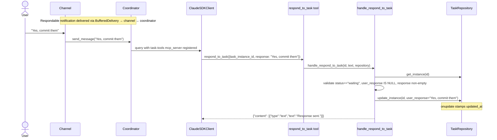
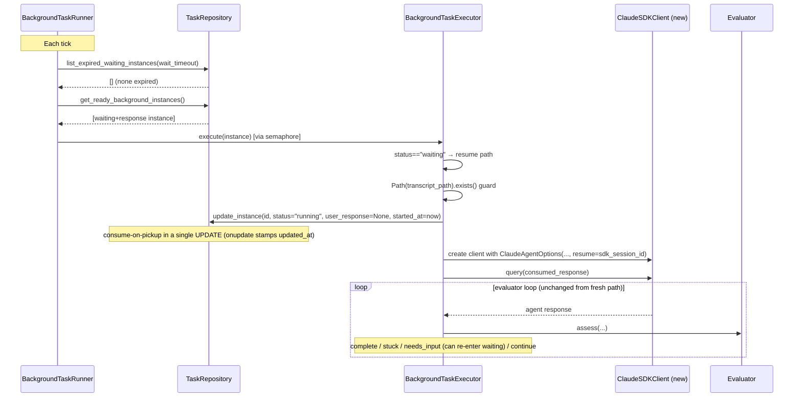
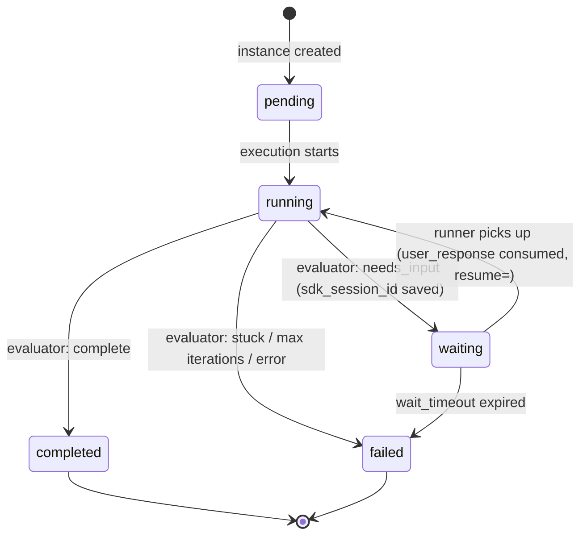
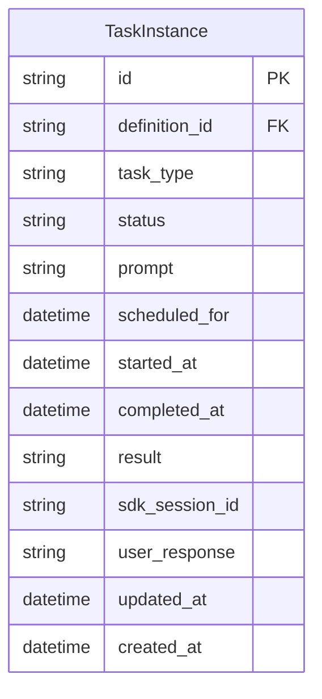

# Design: DLT-120 - Pause background tasks to request user input

**Delta Spec**: [../delta-specs/DLT-120.md](../delta-specs/DLT-120.md)
**Status**: Draft

## Purpose

Extend the background task lifecycle with a `"waiting"` state so a task can pause mid-execution, ask the user a question via a respondable notification, and resume later by injecting the user's response as the next turn in the same SDK session. The design reuses existing patterns: the coordinator's `resume=<session_id>` mechanism, the DES-006 MCP factory, the DES-007 classifier evaluator, and the unified `dispatch_notification()` path.

## Problem Context

Today, when the evaluator classifies an agent response as `needs_input`, the executor injects a "proceed without user" message (see `executor.py:382`) — the agent is forced to guess rather than ask. This blocks multi-step autonomous work that genuinely requires a human decision (e.g., "should I commit these changes?", "which file did you mean?").

**Constraints:**
- Waiting tasks must release the semaphore slot — `max_concurrent_background=3` is for *active* work, not blocked work
- Pause/resume must survive process restarts — the SDK's `resume` mechanism is file-backed, so the saved `sdk_session_id` works across restarts (confirmed via Claude Agent SDK docs)
- The response pathway must not allow the main agent to "respond" to an arbitrary task — two complementary gates (prompt instructions + tool enforcement)
- Long waits must not accumulate indefinitely — expired waiters become failures
- Existing crash recovery must not clobber waiting instances
- Duplicate prevention must treat `"waiting"` as an active state (cron must not spawn a parallel instance)

**Interactions:**
- `BackgroundTaskExecutor` (`tasks/executor.py`): evaluator loop's `needs_input` branch becomes the pause point; executor entrypoint branches on instance status to resume
- `BackgroundTaskRunner`: unchanged structure; relies on a new repository query that unions pending + waiting-with-response, and runs an inline timeout sweep per tick
- `TaskRepository` (`tasks/repository.py`): new columns, new query (`get_ready_background_instances`, `list_expired_waiting_instances`), `updated_at` auto-stamped at the ORM layer
- `tachikoma.notifications`: `build_notification_prompt()` / `dispatch_notification()` / `Notification` gain an optional `response_instance_id` that threads through to channel-side rendering
- `tasks/tools.py`: new `respond_to_task` tool added to the existing `task-tools` MCP server
- `context/loading.py`: `SYSTEM_PREAMBLE_TEMPLATE` Tasks/Tools subsection gains `respond_to_task`
- Main conversation coordinator: unchanged — it already exposes the `task-tools` MCP server on every turn

## Design Overview

Two axes of change:

1. **Lifecycle extension**: `TaskInstance` gains a `"waiting"` status plus the fields needed to resume (`sdk_session_id`, `user_response`, `updated_at`). `updated_at` is auto-stamped by SQLAlchemy on every `UPDATE` — callers never touch it.

2. **Pause/resume flow**: When the evaluator returns `needs_input`, the executor transitions `pending→waiting` and exits. When the user responds, the `respond_to_task` tool writes `user_response`; the next runner tick sees the waiting+response pair, transitions `waiting→running` (consuming the response atomically), and creates a new `ClaudeSDKClient(resume=sdk_session_id)`, injecting the response via `await client.query(...)`. The evaluator loop continues from there. Multiple pause/resume cycles are supported.

```
┌─────────────────────────────────────────────────────────────────────┐
│                    BackgroundTaskRunner (each tick)                   │
│  1. Expire waiting instances: updated_at < now - wait_timeout         │
│  2. Query ready: pending OR (waiting AND user_response IS NOT NULL)   │
│  3. For each ready instance, semaphore-gated BackgroundTaskExecutor   │
└─────────────────────────────────────────────────────────────────────┘

┌────────────────── BackgroundTaskExecutor.execute(instance) ──────────┐
│                                                                       │
│  If status == "waiting":   ← resume path                              │
│    - Validate transcript file exists (same guard as sessions)         │
│    - Atomically: status="running", consume user_response              │
│    - ClaudeSDKClient(options with resume=sdk_session_id)              │
│    - client.query(consumed_response) ─── enter evaluator loop         │
│                                                                       │
│  Else (status == "pending"):  ← fresh path (unchanged)                │
│    - status="running", ClaudeSDKClient(options), query(prompt)        │
│                                                                       │
│  Evaluator loop:                                                      │
│    - complete  → mark completed, post-processing                      │
│    - stuck     → mark failed, urgent notification                     │
│    - needs_input → save sdk_session_id, status="waiting",             │
│                    dispatch RESPONDABLE urgent notification, RETURN   │
│    - continue  → query(rationale), loop                               │
└──────────────────────────────────────────────────────────────────────┘
```

## Shape

| Part | Mechanism | Flag |
|------|-----------|:----:|
| **S1** | Extend `TaskStatus` literal with `"waiting"`; add `sdk_session_id: str \| None`, `user_response: str \| None`, and `updated_at: datetime` columns to `TaskInstance`/`TaskInstanceRecord`. Use SQLAlchemy `mapped_column(default=lambda: datetime.now(UTC), onupdate=lambda: datetime.now(UTC))` on `updated_at` so every `UPDATE` statement refreshes it automatically at the ORM layer — no caller changes required | |
| **S2** | In the evaluator loop's `needs_input` branch: update the instance to `status="waiting"` with `sdk_session_id=<captured from ResultMessage>` (the `onupdate` stamps `updated_at`), build a respondable notification carrying the evaluator's rationale (the question) and dispatch via `dispatch_notification(..., priority=Priority.URGENT, response_instance_id=instance.id)`, then return from `execute()` — the `async with ClaudeSDKClient` scope exits, releasing the semaphore slot. The persisted `sdk_session_id` is the value most recently observed on a `ResultMessage` during the loop (the SDK guarantees this is a valid resume target for subsequent turns, per Claude Agent SDK docs confirmed via context7) | |
| **S3** | Extend `build_notification_prompt()` with optional `response_instance_id: str \| None` parameter — when present, the built prompt appends the task question, instance ID, and explicit `respond_to_task(task_instance_id=..., response=...)` usage instructions. `dispatch_notification()` and the `Notification` event gain a matching optional field. Non-respondable notifications (success/failure) omit the parameter and get unchanged formatting | |
| **S4** | Add `respond_to_task` tool to the existing `task-tools` MCP server in `tasks/tools.py`: Pydantic `RespondToTaskArgs{task_instance_id: str, response: str}`; extracted handler `handle_respond_to_task(task_instance_id, response, repository)` validates non-empty trimmed response, fetches instance (404 → clear error), enforces `status == "waiting"` (→ "Task is not waiting for input"), enforces `user_response IS NULL` (→ "A response is already pending for this task"), then writes `user_response=<text>` (→ `onupdate` stamps `updated_at`). Follows DES-006 factory + extracted handler convention | |
| **S5** | Update two prompts: `BACKGROUND_TASK_SYSTEM_PROMPT` gains an "Asking questions" section explaining evaluator-mediated communication (agent output is intercepted by an evaluator, questions are routed to the user via notification, the user's response arrives as the next conversation turn); `SYSTEM_PREAMBLE_TEMPLATE`'s Tasks/Tools subsection adds `respond_to_task` with parameter documentation and usage guidance | |
| **S6** | Rename `get_pending_instances("background")` to `get_ready_background_instances()` — returns union of `status=="pending"` OR (`status=="waiting"` AND `user_response IS NOT NULL`). Runner code is unchanged; both new and resumed instances flow through the same semaphore-gated execution path | |
| **S7** | In `BackgroundTaskExecutor.execute()`, branch on the instance's status at entry. If `"waiting"` with a response: derive `transcript_path = _derive_transcript_path(sdk_session_id, cwd)` and guard `Path(transcript_path).exists()` (mirrors `sessions/registry.py:217`). If missing, fail the instance with a clear reason + dispatch urgent failure notification. Otherwise, atomically transition `status="running"` and consume (read + null out) `user_response` in the same update. Construct `ClaudeSDKClient(ClaudeAgentOptions(..., resume=sdk_session_id))`, `await client.query(consumed_response)`, then continue the existing evaluator loop — supporting multiple pause/resume cycles. The resume path reuses the same `ClaudeAgentOptions` construction as the fresh path (stderr accumulator, per-execution notification MCP server, system-prompt append, datetime injection) with only two differences: `resume=sdk_session_id` is set, and the initial `client.query(...)` payload is the consumed user response rather than the task prompt (which the transcript already contains) | |
| **S8** | Add `wait_timeout: int = 7200` to `TaskSettings`; inline at the top of each runner loop tick, call `repository.list_expired_waiting_instances(wait_timeout)` (returns `status=="waiting"` AND `updated_at < now - wait_timeout`). For each expired instance: mark `"failed"` with a timeout reason, dispatch a non-respondable urgent failure notification indicating the task timed out waiting for user input | |
| **S9** | Leave `mark_running_as_failed()` crash recovery unchanged so `"waiting"` instances survive restarts naturally. Update `get_active_instance_for_definition()` — include `"waiting"` in both the period-aware status list (`["pending", "running", "waiting", "completed"]`) and the backward-compat branch (`["pending", "running", "waiting"]`) so a cron task in `"waiting"` state doesn't spawn a duplicate instance on the next cron match | |

## Components

### Implementation Structure

| Layer/Component | Responsibility | Key Decisions |
|-----------------|----------------|---------------|
| `src/tachikoma/tasks/model.py` | Add `"waiting"` to `TaskStatus` literal; add `sdk_session_id`, `user_response`, `updated_at` fields on `TaskInstance` (frozen dataclass) and `TaskInstanceRecord` (ORM). `TaskInstanceRecord.updated_at` uses `mapped_column(DateTime(timezone=True), default=lambda: datetime.now(UTC), onupdate=lambda: datetime.now(UTC))` | Auto-stamping handled by SQLAlchemy at the ORM layer — no caller ever passes `updated_at`; Python-side `lambda` (not `func.now()`) keeps datetimes tz-aware on SQLite |
| `src/tachikoma/tasks/repository.py` | Add `get_ready_background_instances()` (unions pending + waiting-with-response); add `list_expired_waiting_instances(timeout_seconds)`; update `get_active_instance_for_definition()` to include `"waiting"` in both status lists. Schema upgrade logic in `Database.initialize()` adds new columns via pragma check | Repository is the single query boundary — executor and runner don't assemble SQL predicates |
| `src/tachikoma/tasks/executor.py` | Branch `execute()` on entry status (`"waiting"` → resume path; else → fresh path). Extract resume block: transcript existence check via `_derive_transcript_path()` imported from `coordinator`, atomic consume via a single `update_instance(status="running", user_response=None, started_at=now)`. Replace the `needs_input` branch with waiting transition + respondable dispatch + early return. Capture `sdk_session_id` from each `ResultMessage` in the loop (already tracked) so it can be persisted on waiting transition. The runner gains an inline `_sweep_expired_waiters()` call at the top of each tick | Single executor class handles both fresh and resumed flows — one `ClaudeSDKClient` lifecycle regardless of path, just differs in whether `resume=` is set and what the initial `query()` content is |
| `src/tachikoma/notifications.py` | `build_notification_prompt(source, content, response_instance_id=None)` appends respondable suffix when the id is present. `dispatch_notification()` gains matching `response_instance_id: str \| None = None`. `Notification` event gains matching optional `response_instance_id: str \| None` | Respondable/non-respondable is a property of the *prompt content* plus the tool-enforcement at `respond_to_task`; the buffer and channels don't need to care. The id on the event is informational metadata, not a consumer hook |
| `src/tachikoma/tasks/tools.py` | Add `RespondToTaskArgs` Pydantic model; `handle_respond_to_task()` extracted async handler (testable without SDK); `@tool("respond_to_task", ...)` closure registered inside the existing `create_task_tools_server()` alongside `list_tasks`/`create_task`/etc. Tool list passed to `create_sdk_mcp_server()` grows by one entry | Tool lives on the existing `task-tools` server — no new MCP server registration in `__main__.py`; handler receives `repository` from factory closure per DES-006 |
| `src/tachikoma/context/loading.py` | `SYSTEM_PREAMBLE_TEMPLATE` Tasks/Tools subsection adds a bullet for `respond_to_task` with parameter documentation and when-to-invoke guidance | Follows ADR-008 append pattern; in-place edit of the existing Tools subsection (no structural change) |
| `src/tachikoma/config.py` | `TaskSettings` gains `wait_timeout: int = Field(default=7200, description="Seconds a task may wait for user input before failing")` | Follows existing TaskSettings conventions — field is an int; default-config generator handles it automatically via the loop over `TaskSettings.model_fields` |

### Cross-Layer Contracts

**Pause: waiting entry flow**

```mermaid
sequenceDiagram
    participant Exec as BackgroundTaskExecutor
    participant SDK as ClaudeSDKClient
    participant Eval as Evaluator
    participant Repo as TaskRepository
    participant Notif as dispatch_notification
    participant Bus as EventBus
    participant Buffer as PriorityBuffer

    Note over Exec,SDK: Evaluator loop in progress; sdk_session_id captured from ResultMessage
    SDK-->>Exec: agent response ("Should I commit these changes?")
    Exec->>Eval: assess(response, task_prompt)
    Eval-->>Exec: {status: "needs_input", rationale: "Should I commit these changes?"}
    Exec->>Repo: update_instance(id, status="waiting", sdk_session_id=<captured>)
    Note over Repo: SQLAlchemy onupdate stamps updated_at
    Exec->>Notif: dispatch_notification(source, rationale, "info", instance_id,<br/>priority=URGENT, response_instance_id=instance_id)
    Notif->>Bus: dispatch(Notification(prompt, priority=URGENT, response_instance_id=...))
    Bus-->>Buffer: enqueued as BufferedItem (URGENT tier)
    Exec-->>Exec: return from execute() — async with ClaudeSDKClient scope exits, semaphore released
```

**Respond: user replies via main conversation**



**Resume: runner picks up waiting-with-response instance**



**Integration Points:**
- Executor ↔ Repository: `update_instance` now covers `sdk_session_id`/`user_response` fields too (ORM `setattr` is field-agnostic — no repository signature change); `updated_at` auto-stamped
- Executor ↔ Notifications: existing `dispatch_notification()` path — just passes `response_instance_id` through when pausing
- MCP tool ↔ Repository: `handle_respond_to_task` receives the shared repository via factory closure (DES-006)
- Runner ↔ Repository: two new query methods (`get_ready_background_instances`, `list_expired_waiting_instances`)
- Transcript validation: reuses `_derive_transcript_path` from `coordinator.py` (exported if not already module-public) — identical guard to `sessions/registry.py:217`

**Error contract:**
- `respond_to_task` failures: structured error dicts per DES-006, agent sees a clear message and can retry
- Missing transcript on resume: instance marked `failed` with reason "Transcript for resume not found: <path>"; urgent failure notification dispatched; executor returns cleanly
- Timeout expiration: instance marked `failed` with reason "Task timed out waiting for user input after Ns"; urgent failure notification
- Double-pickup protection: the single UPDATE that transitions `waiting→running` + nulls `user_response` is atomic at the row level; a concurrent tick that sees the same instance would observe `status="running"` and skip it (the runner's existing dedup via `running_tasks` dict also helps, and the union query doesn't match running instances)

## Modeling

### TaskInstance (updated)

```
TaskInstance (frozen dataclass)
├── id: str
├── definition_id: str | None
├── task_type: str
├── status: str                      ("pending", "running", "waiting", "completed", "failed")  ← +waiting
├── prompt: str
├── scheduled_for: datetime
├── started_at: datetime | None
├── completed_at: datetime | None
├── result: str | None
├── sdk_session_id: str | None       ← NEW  (set when transitioning to waiting; used for resume)
├── user_response: str | None        ← NEW  (written by respond_to_task; read+cleared on resume pickup)
├── updated_at: datetime             ← NEW  (auto-stamped by SQLAlchemy default/onupdate)
└── created_at: datetime
```

### Status lifecycle (updated)



Invariants:
- `sdk_session_id` is set iff the instance has ever entered `waiting` (persisted across cycles)
- `user_response` is set only transiently — written by `respond_to_task`, nulled on pickup
- `updated_at` is refreshed on every row write

### Entity additions



## Data Flow

### Pause (waiting entry)

```
1. Evaluator loop completes a turn; sdk_session_id captured from ResultMessage (already done)
2. Evaluator returns {status: "needs_input", rationale: "<the question>"}
3. Executor updates instance: status="waiting", sdk_session_id=<captured>
   (updated_at auto-stamped by onupdate)
4. Executor calls dispatch_notification(
       source=f"Background task: {definition.name}",
       content=rationale,
       severity="info",
       source_id=instance.id,
       priority=Priority.URGENT,
       response_instance_id=instance.id,
   )
   → build_notification_prompt includes question + instance ID + respond_to_task usage
   → Notification event dispatched with priority=URGENT, response_instance_id set
   → PriorityBuffer enqueues as URGENT-tier BufferedItem → BufferedDelivery when idle-gated
5. Executor returns from execute() — async with ClaudeSDKClient exits, semaphore slot released
```

### Respond (tool invocation from main conversation)

```
1. Main agent receives BufferedDelivery prompt (via channel → coordinator.send_message)
2. Main agent reads the respond_to_task usage instructions in the prompt
3. Main agent calls respond_to_task(task_instance_id=..., response=<user text>)
4. handle_respond_to_task:
   a. Pydantic validates required fields
   b. Trim response, reject if empty → clear error
   c. get_instance(id) → 404 if missing
   d. Reject if status != "waiting" → "Task is not waiting for input"
   e. Reject if user_response IS NOT NULL → "A response is already pending for this task"
   f. update_instance(id, user_response=<text>)  (updated_at auto-stamped)
5. Tool returns success to the agent
```

### Resume (runner pickup)

```
1. Runner tick starts
2. Runner calls _sweep_expired_waiters():
   a. repository.list_expired_waiting_instances(settings.wait_timeout)
   b. For each expired: mark failed + dispatch urgent non-respondable failure notification
3. Runner calls repository.get_ready_background_instances():
   SELECT * FROM task_instances
   WHERE task_type='background' AND
         (status='pending' OR (status='waiting' AND user_response IS NOT NULL))
4. For each ready instance (semaphore-gated), BackgroundTaskExecutor.execute(instance):
   a. If status == "waiting":
      i.   Derive transcript_path from sdk_session_id + cwd
      ii.  If not Path(transcript_path).exists(): mark failed ("Transcript for resume not found"),
           dispatch urgent failure notification, return
      iii. update_instance(id, status="running", user_response=None, started_at=now)
           → atomic consume, updated_at auto-stamped
      iv.  Build ClaudeAgentOptions with resume=sdk_session_id (other options unchanged)
      v.   async with ClaudeSDKClient(options) as client:
           await client.query(consumed_response)
           → enter evaluator loop (same as fresh path)
   b. Else (status == "pending"): existing fresh path unchanged
```

### Timeout sweep

```
1. At the top of each runner tick, before ready query:
   repository.list_expired_waiting_instances(timeout_seconds):
     SELECT * FROM task_instances
     WHERE status='waiting' AND updated_at < :now - :timeout_seconds
2. For each expired instance:
   a. update_instance(id, status="failed", completed_at=now,
                      result=f"Task timed out waiting for user input after {timeout}s")
   b. dispatch_notification(source, timeout_message, "error", instance_id,
                            priority=URGENT)  (non-respondable — no response_instance_id)
```

## Key Decisions

### `respond_to_task` on the existing `task-tools` MCP server

**Choice**: Add `respond_to_task` as a new tool inside the existing `create_task_tools_server()` factory (alongside `list_tasks`, `get_task`, `create_task`, `update_task`, `delete_task`), rather than creating a separate MCP server for response routing.
**Why**: `respond_to_task` is agent-facing task management — conceptually it belongs in the same logical group as the other task tools. Keeping one server simplifies registration in `__main__.py`, keeps the coordinator's `mcp_servers` dict stable, and avoids proliferation of narrow single-tool servers. The factory already receives `repository` and the tool needs only that.
**Sources**: [DES-006 SDK MCP Tool Server Factory](../design/DES-006-sdk-mcp-tool-server-factory.md) — exceptions section explicitly allows co-locating related tools when they share factory state.
**Options Researched**: Separate `task-response-tools` server (cleaner conceptual split but extra registration plumbing); attaching to the existing notifications MCP server (wrong lifetime — that server is per-background-execution, the response tool must live on the main conversation); adding to coordinator-level tools (same as current choice, just different module).
**Why This Over Alternatives**: Response tool is part of task management lifecycle; separating it would scatter same-domain tools across two servers without gaining isolation.
**Consequences**:
- Pro: One server registration path, one module to keep consistent
- Pro: Factory closure already holds `repository`
- Con: `task-tools` server grows from 5 to 6 tools

### SQLAlchemy `onupdate` for `updated_at` auto-stamping

**Choice**: Declare `updated_at` as `mapped_column(DateTime(timezone=True), default=lambda: datetime.now(UTC), onupdate=lambda: datetime.now(UTC))` on `TaskInstanceRecord`. No caller passes `updated_at`.
**Why**: The timestamp is a derived property of "this row was last written", not a piece of business data callers track. Handling it in the ORM layer means every `setattr` + commit path gets the refresh for free and there's no risk of a code path forgetting to stamp. Python-side `lambda` (not SQL-side `func.now()`) is required because SQLite + `DateTime(timezone=True)` needs tz-aware Python datetimes — `func.now()` yields naive UTC strings on SQLite.
**Sources**: SQLAlchemy 2.x Mapped column guide (confirmed `onupdate` fires on every unit-of-work UPDATE; the callable form is evaluated per-flush); matches the existing Tachikoma pattern of Python-side default callables (`created_at=datetime.now(UTC)` is already used in repositories).
**Options Researched**: (a) Caller-passed `updated_at=datetime.now(UTC)` at every call site — error-prone, easy to forget; (b) Repository-level wrapper that stamps in `update_instance()` — works but duplicates logic if future repos need the same field; (c) SQLite trigger — tightly coupled to SQLite, breaks if we ever change backends; (d) `func.now()` — wrong timezone semantics on SQLite.
**Why This Over Alternatives**: The ORM hook is the narrowest intervention that makes the invariant automatic across all call sites, present and future.
**Consequences**:
- Pro: Every `UPDATE` on the table refreshes `updated_at` without caller involvement
- Pro: Works uniformly for `update_instance`, `mark_running_as_failed`, any future update path
- Con: Writes triggered outside the ORM (raw SQL) would skip the hook — not a concern here since all writes go through SQLAlchemy
- Con: Slightly less observable (implicit behavior) — mitigated by documentation on the field

### Consume-on-pickup via single atomic UPDATE

**Choice**: When the executor picks up a waiting-with-response instance, transition to `running` and null `user_response` in one `update_instance()` call (single UPDATE statement).
**Why**: Prevents a narrow race where two runner ticks overlap and both see the same waiting+response instance. The first successful UPDATE moves it to `running` and clears the response; the second would find no matching record in the ready query (running instances don't match) and no-op. Reading the response and then issuing a separate UPDATE to clear it would widen the window.
**Options Researched**: Separate read-then-update (wider race window); advisory lock (SQLite doesn't support it cleanly); `SELECT ... FOR UPDATE` (aiosqlite lacks this); relying on the runner's `running_tasks` dict (helps within a single process but doesn't protect if two processes ever ran — we only have one today, but atomicity is still the correct contract).
**Why This Over Alternatives**: The ORM already batches field updates into a single statement; getting atomicity is free here.
**Consequences**:
- Pro: No lost responses, no double execution
- Pro: Matches existing patterns (runner already skips instances in its `running_tasks` dict)
- Con: The consumed response lives only in memory until the executor issues `client.query()` — if the executor crashes between consume and query, the response is lost. Acceptable: the agent will eventually time out and fail, and the user can re-initiate. Persisting the response through query completion would require a more complex state machine that isn't justified given single-process operation.

### Inline timeout sweep in the runner tick

**Choice**: The runner's main loop calls `_sweep_expired_waiters()` at the top of each tick, then proceeds to the ready-instance query. No separate async task.
**Why**: The sweep is cheap (single query + handful of updates), runs at the same cadence as the rest of the runner logic, and shares context (bus, repository, logging). A separate task would add a second source of writes for the same instance types with its own cancellation/shutdown considerations.
**Options Researched**: (a) Separate `asyncio.Task` running every N seconds — more moving parts, duplicate error handling; (b) Checked only on pickup — misses instances that time out with no subsequent pickup attempt; (c) Database trigger — backend-specific.
**Why This Over Alternatives**: Simplicity; the runner already owns all background task lifecycle.
**Consequences**:
- Pro: Single loop owns all background task scheduling decisions
- Pro: Timeout granularity bounded by `RUNNER_CHECK_INTERVAL_SECONDS` (~30s), which is fine for a 2h default
- Con: If the runner loop itself stalls, timeouts don't fire — but neither does anything else, so the failure mode is already visible

### Transcript-existence guard before resume

**Choice**: Before constructing the resuming `ClaudeSDKClient`, derive `transcript_path = _derive_transcript_path(sdk_session_id, cwd)` and check `Path(transcript_path).exists()`. If missing, fail the instance cleanly with a dispatch.
**Why**: Main sessions already do this guard (`sessions/registry.py:217`) because the SDK's resume mechanism is file-backed (confirmed via Claude Agent SDK docs research) — if the transcript file is gone (disk cleanup, user deletion, cross-host migration), `resume` produces an opaque runtime error. Matching the main-session guard gives a clear error message and keeps behavior consistent across both resume paths in Tachikoma.
**Sources**: Claude Agent SDK Python docs (via doc-researcher): `resume` is file-backed with no built-in TTL; persistence is bounded only by the transcript file remaining on disk. Existing Tachikoma session registry implements the exact same guard.
**Options Researched**: (a) Rely on timeout — too slow and produces an unclear error; (b) Pre-check on `respond_to_task` — shifts the check to the write side but doesn't help if the file is deleted between response and pickup; (c) Trust — produces confusing SDK errors.
**Why This Over Alternatives**: Matches the main-session pattern, gives the user a clear failure message.
**Consequences**:
- Pro: Deterministic failure mode with a useful reason
- Pro: Consistent with main-session resume
- Con: If `_derive_transcript_path` is not already exported from `coordinator.py`, it needs to be made module-public (trivial rename/export)

### Respondability as a dual-gate (prompt + tool enforcement)

**Choice**: A notification is "respondable" by virtue of two complementary mechanisms: (a) its prompt text includes `respond_to_task` usage instructions and the instance ID, and (b) the `respond_to_task` tool enforces `status == "waiting"` at invocation time. Success/failure notifications omit (a); (b) blocks misuse regardless of what the agent infers from prompt text.
**Why**: Prompts are advisory, tools are authoritative. The agent may hallucinate that a success notification is respondable and try to call `respond_to_task` anyway; the tool-level check stops that cold with a clear error. Conversely, the prompt guidance is how the agent knows the tool is the right next action in the first place.
**Consequences**:
- Pro: Mechanism and affordance are aligned — the agent is told what to do AND the tool enforces correctness
- Pro: No new concept introduced — reuses the existing notification prompt + MCP tool pattern
- Con: "Respondability" is not a first-class runtime property — just a convention around which notifications carry the instructions. Acceptable: making it first-class would add complexity without changing observable behavior

### Schema upgrade via pragma check (unchanged pattern)

**Choice**: Add the three new columns (`sdk_session_id`, `user_response`, `updated_at`) via `Database.initialize()`'s existing pragma-based column-check upgrade path — for each column, if absent from `PRAGMA table_info`, issue `ALTER TABLE task_instances ADD COLUMN ...`.
**Why**: Follows the established pattern (noted in `task-management.md` design). No migration framework is introduced for three additive columns.
**Consequences**:
- Pro: Zero new infrastructure
- Pro: Existing databases upgrade on next startup without manual intervention
- Con: Manual pragma check per column — already the project norm

## System Behavior

### Scenario: Agent pauses to ask a question

**Given**: A running background task where the agent produces "Should I commit these changes?"
**When**: The evaluator classifies as `needs_input` with rationale "Should I commit these changes?"
**Then**: The instance transitions to `"waiting"` with `sdk_session_id` set. A respondable urgent `Notification` is dispatched containing the question, the instance ID, and `respond_to_task` usage guidance. `execute()` returns, the semaphore slot is released. `updated_at` is stamped.

### Scenario: User responds and task resumes

**Given**: A waiting instance; the user receives the respondable notification via their active channel and replies "Yes, commit them"
**When**: The main agent calls `respond_to_task(task_instance_id, "Yes, commit them")`, then the next runner tick fires
**Then**: The tool validates status=="waiting" + no pending response, writes `user_response`. On the next tick, `get_ready_background_instances()` returns the instance. The executor validates the transcript file exists, atomically transitions to `running` + clears `user_response`, creates `ClaudeSDKClient(resume=sdk_session_id)`, and queries "Yes, commit them". The evaluator loop continues.

### Scenario: Multiple pause/resume cycles

**Given**: A resumed task that produces another clarifying question
**When**: The evaluator returns `needs_input` again
**Then**: The instance transitions back to `"waiting"` with the latest `sdk_session_id` (possibly the same, possibly updated from a new `ResultMessage`), a new respondable notification is dispatched. The flow repeats. There is no cap on pause/resume cycles beyond the existing `max_iterations` which applies to evaluator turns within a single resume — each resume starts a fresh execution with its own iteration counter (acceptable — the max is a safeguard against infinite evaluator loops, not a budget for user collaboration).

### Scenario: respond_to_task called on wrong status

**Given**: A completed task instance; the main agent calls `respond_to_task(id, "late response")`
**When**: `handle_respond_to_task` runs
**Then**: The tool returns `{is_error: true, content: [{type: text, text: "Task is not waiting for input"}]}`. The instance is unchanged.

### Scenario: respond_to_task called on already-responded task

**Given**: A waiting instance with `user_response` already set (e.g., the runner hasn't picked it up yet)
**When**: The agent calls `respond_to_task(id, "another response")`
**Then**: The tool returns "A response is already pending for this task". The existing `user_response` is unchanged.

### Scenario: Wait timeout expires

**Given**: A waiting instance whose `updated_at` is older than `settings.wait_timeout` (default 7200s)
**When**: The runner's next tick runs `_sweep_expired_waiters()`
**Then**: The instance is marked `failed` with reason "Task timed out waiting for user input after 7200s". A non-respondable urgent failure `Notification` is dispatched. A subsequent `respond_to_task` call would return "Task is not waiting for input" (since status is now `failed`).

### Scenario: Crash recovery with waiting instances

**Given**: The process restarts while instances are in `waiting` and `running` states
**When**: The tasks bootstrap hook runs
**Then**: `mark_running_as_failed()` sweeps only `running` instances (unchanged). `waiting` instances are left untouched — their `sdk_session_id` and transcript file persist on disk. On the first runner tick after startup, `_sweep_expired_waiters()` fails any whose `updated_at` has aged past `wait_timeout`; the rest remain waiting. If the user had already called `respond_to_task` before the crash, the instance is resumed on the first tick via the normal waiting-with-response pickup path.

### Scenario: Cron duplicate prevention for waiting tasks

**Given**: A cron task definition with an instance in `"waiting"` status
**When**: The next cron match fires and the instance generator runs
**Then**: `get_active_instance_for_definition()` returns the waiting instance (now in the status list), and no duplicate is created. Pre-existing `pending`/`running`/`completed` checks continue to work identically.

### Scenario: Resume with missing transcript file

**Given**: A waiting instance with a response, but the SDK transcript file at `_derive_transcript_path(sdk_session_id, cwd)` no longer exists
**When**: The executor picks it up
**Then**: The existence guard fires; the instance is marked `failed` with reason "Transcript for resume not found: <path>"; a non-respondable urgent failure notification is dispatched; the executor returns without creating an SDK client.

### Scenario: Semaphore release during waiting

**Given**: Three background tasks running at the default limit; one transitions to `waiting`
**When**: A fourth pending instance exists
**Then**: The `waiting` task releases its semaphore slot on `execute()` return. The fourth pending instance acquires the freed slot on the next runner tick. Multiple tasks can sit in `waiting` simultaneously with no concurrency cost.

## Open Questions

None. All clarifications resolved during spec + interview:
- Tool placement: existing task-tools server
- Timestamp management: SQLAlchemy `onupdate`
- Timeout check placement: inline in runner tick
- Transcript validation: matches main-session guard

---

## Detected Impacts

### Affected Feature Designs

- **docs/feature-designs/tasks/background-task-execution.md** — Modifies: evaluator loop's `needs_input` branch changes from "inject proceed message" to "transition to waiting + dispatch respondable notification + return"; runner gains inline timeout sweep; executor gains a resume branch at entry (transcript guard, atomic consume, `resume=sdk_session_id`); status lifecycle diagram adds `waiting` state
- **docs/feature-designs/tasks/task-management.md** — Modifies: `TaskInstance` model gains `sdk_session_id`, `user_response`, `updated_at` fields; `TaskStatus` gains `"waiting"` literal; repository gains `get_ready_background_instances()` and `list_expired_waiting_instances()`; `get_active_instance_for_definition()` status lists include `"waiting"`; `task-tools` MCP server gains `respond_to_task`; system preamble Tools subsection documents `respond_to_task`; `updated_at` auto-stamped by SQLAlchemy `onupdate` (noted as a modeling decision)
- **docs/feature-designs/configuration/config-system.md** — Modifies: `TaskSettings` gains `wait_timeout: int = 7200`

### Notes for Reconciliation

- `background-task-execution.md`: update the sequence diagram (waiting entry + resume entry), update the evaluator-loop data flow ("needs_input" step), update key decisions to reflect that agent questions are now routed to the user rather than suppressed, update the status lifecycle. The automatic-failure section gains a new failure cause (waiting timeout).
- `task-management.md`: extend the `TaskInstance` modeling section with the three new fields and their semantics; add `"waiting"` to the status lifecycle diagram; extend the `TaskStatus` literal description; extend the Tools subsection with `respond_to_task`. Note the SQLAlchemy `onupdate` decision for `updated_at` under Key Decisions.
- `config-system.md`: extend the `[tasks]` subsection with `wait_timeout` documentation (default 7200s / 2h, purpose: fail waiting tasks whose user response hasn't arrived in time).

## Notes

- Claude Agent SDK resume behavior verified via context7 research: `resume="<session_id>"` on `ClaudeAgentOptions` is file-backed and works across process boundaries, with no SDK-imposed TTL. Persistence bounded by disk retention only.
- `_derive_transcript_path` is implemented in `coordinator.py:94` — if not already module-public, implementation will export it for reuse by the executor. A trivial refactor.
- The `stderr_aware_query()` evaluator (DES-007, classifier model) is unchanged — it still returns the same four classifications. Only the executor's handling of `needs_input` changes.
- Respondable notifications still flow through the priority buffer (`delivery/priority-buffer`) exactly like success/failure notifications — the new `response_instance_id` is metadata on the `Notification` event, not a delivery-mechanism change.
