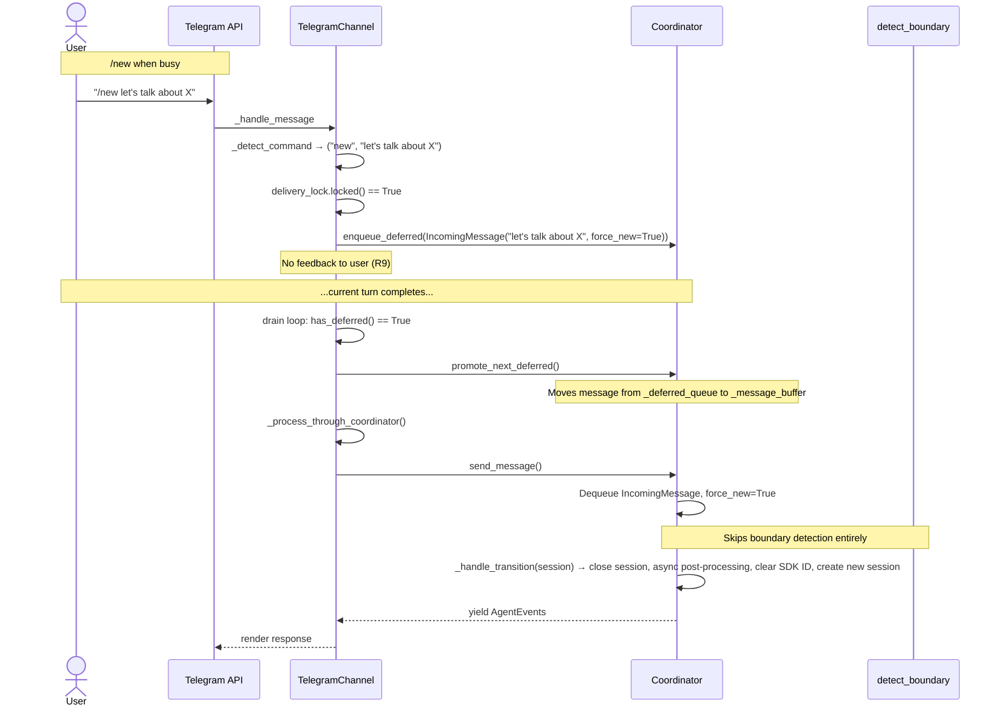
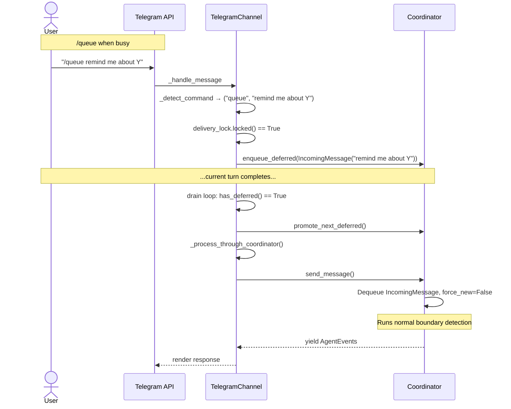

# Design: DLT-152 - Boundary-aware message queueing

**Delta Spec**: [../delta-specs/DLT-152.md](../delta-specs/DLT-152.md)
**Status**: Approved

## Purpose

This document explains the design rationale for boundary-aware message queueing: how `/new` and `/queue` bot commands are detected, how the deferred message queue integrates with the coordinator, and how the routing metadata flows through the existing message envelope.

## Problem Context

The current steering mechanism (`coordinator.enqueue()` while the delivery lock is held) always routes follow-up messages into the active session. Users have no way to explicitly start a fresh conversation or defer a message for boundary-detected processing after the current turn. Boundary detection is automatic — users cannot override it when they know their intent.

**Constraints:**
- Command detection must use Telegram's native `bot_command` entities (structured, reliable)
- Queueing infrastructure must be generic (coordinator-level), not Telegram-specific
- The existing steering path and DES-009 delivery lock pattern must remain unchanged
- No user feedback on queueing — silent operation (R9)
- Bare commands (no arguments) must be treated as normal messages (R12)

**Interactions:**
- Telegram channel (`channels/telegram`): Command detection in `_handle_message`, routing logic, deferred queue drain, command registration
- Coordinator (`agent/core-architecture`): Deferred queue, `force_new` routing in `send_message()`
- Boundary detection (`agent/boundary-detection`): `/new` bypasses boundary detection entirely

## Design Overview

Three mechanisms layer onto the existing message flow:

```
┌─────────────────────────────────────────────────────────────────────┐
│              Telegram _handle_message routing                        │
│                                                                     │
│  Message arrives                                                     │
│      │                                                              │
│      ▼                                                              │
│  _detect_command(message)                                           │
│      │                                                              │
│      ├── "/new" with args  ──┐                                      │
│      ├── "/queue" with args ─┤                                      │
│      └── None / bare cmd ───┤                                      │
│                              ▼                                      │
│                     delivery_lock.locked()?                         │
│                      │              │                               │
│                     Yes             No                              │
│                      │              │                               │
│                      ▼              ▼                               │
│  ┌──────────────────────┐  ┌────────────────────────────┐          │
│  │ cmd → deferred queue │  │ /new → enqueue(force_new)  │          │
│  │ normal → enqueue()   │  │ /queue → enqueue()         │          │
│  │                      │  │ normal → enqueue()          │          │
│  │  (steering unchanged)│  │                             │          │
│  └──────────────────────┘  │ then: _process_through_    │          │
│                             │        coordinator()       │          │
│                             └────────────┬───────────────┘          │
│                                          │                          │
│                                          ▼                          │
│                             ┌──────────────────────────┐           │
│                             │ Drain deferred queue      │           │
│                             │ promote → _process_through│           │
│                             │ _coordinator() (per item) │           │
│                             └──────────────────────────┘           │
└─────────────────────────────────────────────────────────────────────┘

┌─────────────────────────────────────────────────────────────────────┐
│              Coordinator send_message() routing                      │
│                                                                     │
│  Dequeue IncomingMessage from _message_buffer                       │
│      │                                                              │
│      ▼                                                              │
│  msg.force_new?                                                     │
│      │              │                                               │
│     Yes             No                                              │
│      │              │                                               │
│      ▼              ▼                                               │
│  Skip boundary    Run boundary                                      │
│  detection        detection                                         │
│      │              │                                               │
│      ▼              ▼                                               │
│  _handle_transition  Normal flow                                    │
│  (fresh session)    (continue/shift/resume)                         │
└─────────────────────────────────────────────────────────────────────┘
```

1. **Command detection** — Telegram channel inspects `bot_command` entities on incoming messages, extracts command name and arguments. Bare commands and unrecognized commands fall through to normal message handling.

2. **Deferred message queue** — Coordinator-level `asyncio.Queue[IncomingMessage]` for messages that should wait until the current turn completes. The channel defers command messages here when busy, then drains the queue after each delivery cycle.

3. **`force_new` routing** — `IncomingMessage` gains a `force_new` field. When True, the coordinator skips boundary detection and unconditionally triggers a fresh session transition.

## Shape

| Part | Mechanism | Flag |
|------|-----------|:----:|
| **S1** | Extend `IncomingMessage` with `force_new: bool = False` — routing metadata on the envelope | |
| **S2** | Coordinator gains `_deferred_queue: asyncio.Queue[IncomingMessage]` with `enqueue_deferred()`, `has_deferred()`, and `promote_next_deferred()` | |
| **S3** | Telegram `_detect_command()` inspects `bot_command` entities, returns `(name, args)` or `(None, text)` | |
| **S4** | Telegram `_handle_message` routing: commands when busy → deferred queue; commands when idle → normal enqueue with routing; normal messages → existing steering | |
| **S5** | Telegram drain loop after each delivery cycle: `while has_deferred(): promote → _process_through_coordinator()` — each iteration wrapped in try/except (log error, continue to next item) | |
| **S6** | Coordinator `send_message()` checks `msg.force_new` — when True, skips boundary detection and calls `_handle_transition()` for fresh session | |
| **S7** | Register `/new` and `/queue` via `bot.set_my_commands()` during Telegram channel startup | |
| **S8** | Graceful shutdown: channel drains deferred queue after polling stops, before coordinator cleanup | |

## Components

### Implementation Structure

| Layer/Component | Responsibility | Key Decisions |
|-----------------|----------------|---------------|
| `src/tachikoma/message.py` | Extend `IncomingMessage` with `force_new: bool = False` | Routing metadata on the envelope, not a `send_message()` parameter — consistent with user interview decision |
| `src/tachikoma/coordinator.py` | Add `_deferred_queue`, `enqueue_deferred()`, `has_deferred()`, `promote_next_deferred()`; check `force_new` in `send_message()` re-queue loop to skip boundary detection | Generic queue infrastructure in coordinator; channel controls delivery timing |
| `src/tachikoma/telegram/__init__.py` | `_detect_command()` method for entity inspection; routing logic in `_handle_message`; drain loop after delivery; `bot.set_my_commands()` in `run()` | Command detection is Telegram-specific (R2); drain reuses `_process_through_coordinator()` |
| `tests/` | Test `IncomingMessage` field, `_detect_command()`, routing logic, deferred queue drain, `force_new` flow | Unit tests for command parsing; integration tests for queue drain |

### Cross-Layer Contracts





**Integration Points:**
- Channel ↔ Coordinator: `enqueue_deferred(msg)` (deferred queue write), `has_deferred()` + `promote_next_deferred()` (drain control), existing `enqueue()` and `send_message()` unchanged
- Channel ↔ aiogram: Entity inspection via `message.entities` (type `"bot_command"`, offset, length); `bot.set_my_commands()` for registration
- Coordinator internal: `send_message()` re-queue loop reads `force_new` from dequeued `IncomingMessage` and skips `detect_boundary()` when True

### Shared Logic

- **`IncomingMessage`** (`message.py`): Extended with `force_new` field — the single envelope carries both text and routing intent, consistent with existing `pinned_skills` pattern
- **`_detect_command()`** (Telegram channel): Private method, returns `(name, args)` tuple — encapsulates entity parsing logic so `_handle_message` stays clean

## Modeling

### Domain type changes

```
IncomingMessage (frozen dataclass, existing)
├── text: str
├── pinned_skills: tuple[str, ...] = ()
└── force_new: bool = False              (NEW)
    — True: skip boundary detection, force fresh session
    — False (default): normal boundary detection flow
```

### Coordinator additions

```
Coordinator (existing)
├── _message_buffer: asyncio.Queue[IncomingMessage]     (existing)
├── _deferred_queue: asyncio.Queue[IncomingMessage]     (NEW)
├── enqueue_deferred(msg: IncomingMessage) -> None      (NEW — put into _deferred_queue)
├── has_deferred() -> bool                              (NEW — _deferred_queue non-empty?)
├── promote_next_deferred() -> None                     (NEW — move one item from _deferred_queue to _message_buffer)
├── enqueue(msg: IncomingMessage) -> None               (existing — unchanged)
└── send_message() → AsyncIterator[AgentEvent]          (existing — gains force_new check)
```

### Telegram channel additions

```
TelegramChannel (existing)
├── _detect_command(message: Message) -> tuple[str | None, str]  (NEW)
│   — Inspects message.entities for bot_command at offset 0
│   — Returns (command_name, args_text) or (None, full_text)
│   — Bare commands (no args or whitespace-only) → (None, full_text)
│   — First command wins: /new /queue msg → ("new", "/queue msg")
│
├── _handle_message: gains command routing logic                   (MODIFIED)
│   — Busy + command → enqueue_deferred()
│   — Busy + normal → enqueue() (steering, unchanged)
│   — Idle + /new → enqueue(force_new=True) + _process_through_coordinator()
│   — Idle + /queue → enqueue() + _process_through_coordinator() (normal boundary detection)
│   — Idle + normal → enqueue() + _process_through_coordinator() (unchanged)
│
├── After delivery: drain loop                                     (NEW)
│   — while coordinator.has_deferred(): promote + _process_through_coordinator()
│
└── run(): bot.set_my_commands() call after validation             (MODIFIED)
```

## Data Flow

### `/new` when busy

```
1. User sends "/new let's talk about X"
2. aiogram dispatches to _handle_message
3. _detect_command() finds bot_command entity at offset 0, command "new", args "let's talk about X"
4. delivery_lock.locked() == True → busy path
5. Channel creates IncomingMessage(text="let's talk about X", force_new=True)
6. Channel calls coordinator.enqueue_deferred(msg) — message sits in _deferred_queue
7. No feedback to user (R9)
8. ...current turn completes...
9. Drain loop: has_deferred() == True
10. promote_next_deferred() — moves msg from _deferred_queue to _message_buffer
11. _process_through_coordinator():
    a. Acquire delivery_lock
    b. send_message() dequeues IncomingMessage, sees force_new=True
    c. Skips boundary detection
    d. Calls _handle_transition(current_session, resume_id=None)
       — Close current session (async post-processing fires)
       — Clear SDK session ID
       — Create new session
    e. Pre-processing runs on new session
    f. SDK processes message "let's talk about X" in fresh session
    g. Events stream back, channel renders them
12. Drain loop: has_deferred() == False → done
```

### `/new` when idle

```
1. User sends "/new fresh start"
2. _detect_command() → ("new", "fresh start")
3. delivery_lock.locked() == False → idle path
4. Channel creates IncomingMessage(text="fresh start", force_new=True)
5. coordinator.enqueue(msg) — goes directly to _message_buffer
6. _process_through_coordinator():
    a. send_message() sees force_new=True
    b. Skips boundary detection
    c. _handle_transition() closes current session, creates fresh one
    d. Message processed in new session
7. Drain loop: has_deferred() == False → done
```

### `/queue` when busy

```
1. User sends "/queue remind me about Y"
2. _detect_command() → ("queue", "remind me about Y")
3. delivery_lock.locked() == True → busy path
4. Channel creates IncomingMessage(text="remind me about Y") — force_new defaults False
5. coordinator.enqueue_deferred(msg)
6. ...current turn completes...
7. Drain loop: promote → _process_through_coordinator()
   - send_message() sees force_new=False → normal boundary detection
   - Boundary detection classifies message (continue/shift/resume)
   - Message processed accordingly
```

### `/queue` when idle

```
1. User sends "/queue something"
2. _detect_command() → ("queue", "something")
3. delivery_lock.locked() == False → idle path
4. Channel creates IncomingMessage(text="something") — force_new defaults False
5. coordinator.enqueue(msg) + _process_through_coordinator()
   - Normal boundary detection runs
   - R8: bypasses the deferred queue entirely
```

### Bare command (no args)

```
1. User sends "/new" or "/queue   "
2. _detect_command() → args is empty/whitespace → returns (None, full_text)
3. Treated as normal message: enqueue(IncomingMessage(text="/new"))
4. Agent sees "/new" as literal text
```

### Nested command

```
1. User sends "/new /queue something"
2. _detect_command() finds first bot_command entity at offset 0
3. Command is "new", args is "/queue something"
4. Returns ("new", "/queue something")
5. IncomingMessage(text="/queue something", force_new=True)
6. Agent sees "/queue something" as literal text (R13: first command wins)
```

### Graceful shutdown with deferred messages

```
1. SIGTERM received → aiogram stops polling
2. Channel's run() method exits polling loop
3. Finally block: drain deferred queue
   while coordinator.has_deferred():
       coordinator.promote_next_deferred()
       await _process_through_coordinator()
4. Each deferred message gets a full delivery cycle
5. Coordinator __aexit__ runs post-processing
6. Process exits
```

## Key Decisions

### Routing metadata on IncomingMessage envelope

**Choice**: Add `force_new: bool = False` to `IncomingMessage` rather than a parameter on `send_message()`
**Why**: The envelope already carries routing metadata (`pinned_skills`). Adding `force_new` follows the established pattern — the coordinator reads routing intent from the message, not from method parameters. This also means the deferred queue holds the same type as the message buffer, and `promote_next_deferred()` simply moves items between queues without transformation.
**Alternatives Considered**:
- `send_message(force_new: bool)` parameter: Would require threading the flag through the channel's call chain; breaks the "send_message reads from buffer" pattern
- Separate `force_new_message()` method on coordinator: Duplicates send_message logic; two code paths to maintain
- Routing enum instead of bool: Over-engineering for two modes (force new vs normal); enum with `NORMAL` and `FORCE_NEW` adds indirection

**Consequences**:
- Pro: Consistent with existing envelope pattern (`pinned_skills`)
- Pro: Deferred queue and message buffer hold the same type
- Pro: `promote_next_deferred()` is a simple move between queues
- Con: `IncomingMessage` grows slightly (acceptable — already planned for enrichment per docstring)

### Deferred queue in coordinator, drain loop in channel

**Choice**: Coordinator owns the deferred queue data structure; channel drives the drain loop
**Why**: The spec requires "queueing infrastructure is generic" (R2) — the queue should be coordinator-level. But delivery timing is channel-specific — the channel holds the delivery lock and renders responses. The drain loop must acquire the lock per item, which only the channel can do.
**Alternatives Considered**:
- Channel-local deferred queue: Violates R2 (generic infrastructure requirement); would need per-channel reimplementations
- Coordinator drives drain via callback/event: Adds complexity — coordinator would need to signal the channel, which then calls back. The simple `has_deferred()` + `promote` + `_process_through_coordinator()` loop avoids this indirection
- Coordinator drains internally: Can't — coordinator doesn't hold the delivery lock or know how to render events

**Consequences**:
- Pro: Clean separation — coordinator owns data, channel owns timing
- Pro: Any future channel gets the same `enqueue_deferred()` / `has_deferred()` / `promote_next_deferred()` API
- Pro: Drain reuses existing `_process_through_coordinator()` — no new rendering logic
- Con: Channel must remember to drain (mitigated by putting drain in the same finally block as delivery)

### Entity-based command detection in _handle_message

**Choice**: Inspect `bot_command` entities inline in `_handle_message` rather than using aiogram's `Command` filter with separate handlers
**Why**: Command messages need custom routing logic (deferred queue vs immediate processing) that depends on the delivery lock state. Separate handlers would each need to check lock state and duplicate routing logic. Inline detection keeps the routing decision tree in one place.
**Sources**: aiogram 3.x documentation — `MessageEntity` with type `"bot_command"`, offset/length fields, `set_my_commands()` API
**Alternatives Considered**:
- aiogram `Command` filter with separate handlers: Each handler would need lock-state checks; routing logic spread across handlers
- String prefix matching (`text.startswith("/new")`): Fragile — misses entity-validated commands, doesn't handle `/new@botname`
- Middleware-based detection: Over-engineering for two commands

**Consequences**:
- Pro: Single method handles all routing logic
- Pro: Entity-based detection is Telegram-native and reliable
- Pro: No additional router handlers needed
- Con: `_handle_message` grows in complexity (mitigated by extracting `_detect_command()`)

### Command registration in channel run(), not bootstrap hook

**Choice**: Call `bot.set_my_commands()` in `TelegramChannel.run()` after bot validation
**Why**: Command registration needs the `Bot` instance, which is created during channel initialization. The bootstrap hook validates the token but doesn't own the bot lifecycle. Registering in `run()` ensures commands are set every time the channel starts, handling cases where commands were cleared externally.
**Alternatives Considered**:
- In `telegram_hook` (bootstrap): Bootstrap runs before channel creation; would need to pass bot instance back
- One-time manual registration via BotFather: Fragile — commands could be cleared; no automation guarantee

**Consequences**:
- Pro: Commands always up-to-date on startup
- Pro: No extra bootstrap dependencies
- Pro: Simple — one `await bot.set_my_commands([...])` call

## System Behavior

### Scenario: `/new` while agent is busy

**Given**: The agent is processing a message (delivery lock held)
**When**: The user sends `/new let's talk about X`
**Then**: `_detect_command()` finds the `bot_command` entity, extracts args "let's talk about X". Since the lock is held, the channel creates `IncomingMessage(text="let's talk about X", force_new=True)` and calls `coordinator.enqueue_deferred()`. No feedback is sent to the user. When the current turn completes, the drain loop promotes the message and processes it — the coordinator sees `force_new=True`, skips boundary detection, and triggers a fresh session transition.
**Rationale**: R3 (commands are queued, not steered) + R9 (no feedback) + R10 (session close at processing time, not enqueue time).

### Scenario: `/new` while agent is idle

**Given**: No exchange is in flight (delivery lock free)
**When**: The user sends `/new fresh start`
**Then**: The channel creates `IncomingMessage(text="fresh start", force_new=True)`, enqueues it normally, and processes it immediately. The coordinator skips boundary detection and transitions to a fresh session.
**Rationale**: R7 (`/new` works when both busy and idle) + R8 (immediate processing when idle).

### Scenario: `/queue` while agent is busy

**Given**: The agent is processing a message
**When**: The user sends `/queue remind me about Y`
**Then**: The channel creates `IncomingMessage(text="remind me about Y")` (force_new defaults False) and calls `coordinator.enqueue_deferred()`. When the current turn completes, the drain loop processes the message through normal boundary detection.
**Rationale**: R1 (defer for boundary-detected routing) + R3 (queued, not steered).

### Scenario: `/queue` while agent is idle

**Given**: No exchange is in flight
**When**: The user sends `/queue something`
**Then**: The channel enqueues and processes immediately through normal boundary detection. The deferred queue is not involved.
**Rationale**: R8 (`/queue` when idle bypasses the queue).

### Scenario: Bare `/new` with no arguments

**Given**: The user sends just `/new` (no message body)
**When**: `_detect_command()` runs
**Then**: The command is detected but args is empty, so the method returns `(None, "/new")`. The message is treated as a normal text message — enqueued and processed through the usual path. The agent sees `/new` as literal text.
**Rationale**: R12 (bare commands treated as normal messages).

### Scenario: Nested commands — `/new /queue message`

**Given**: The user sends `/new /queue message`
**When**: `_detect_command()` runs
**Then**: The first `bot_command` entity is at offset 0 with command "new". Args is "/queue message". The method returns `("new", "/queue message")`. R13 (first command wins) applies.
**Rationale**: R13 — only the first command entity is inspected.

### Scenario: Multiple deferred messages processed in FIFO order

**Given**: During a long agent response, the user sends `/new topic A` then `/queue remind about B`
**When**: The current turn completes
**Then**: The drain loop processes them in order: first `/new topic A` (force_new=True, fresh session), then `/queue remind about B` (boundary detection on the new session). Each gets its own delivery cycle.
**Rationale**: R4 (sequential processing) + R6 (FIFO ordering).

### Scenario: Regular message arrives during drain

**Given**: The drain loop is processing a deferred message
**When**: The user sends a regular text message (no command)
**Then**: Since the delivery lock is held by the drain's `_process_through_coordinator()`, the regular message goes through the existing steering path (`coordinator.enqueue()`) — it enters the message buffer and may be picked up by the SDK as a steering message within the current exchange.
**Rationale**: Steering behavior is unchanged during drain — regular messages are steered, not deferred.

### Scenario: Command arrives during drain

**Given**: The drain loop is processing a deferred message
**When**: The user sends `/new another topic`
**Then**: The delivery lock is held, so the command is deferred via `enqueue_deferred()`. After the current drain item finishes, the drain loop picks up the new deferred message.
**Rationale**: Commands during active processing always go to the deferred queue, even during drain.

### Scenario: Graceful shutdown with deferred messages

**Given**: The process receives SIGTERM while deferred messages are waiting
**When**: The shutdown sequence runs
**Then**: aiogram stops polling. The channel's `run()` method drains the deferred queue in its finally block before returning. Each message gets a full delivery cycle. After draining, the coordinator's `__aexit__` runs post-processing.
**Rationale**: R5 (no messages dropped on graceful shutdown) + spec AC for graceful shutdown.

### Scenario: Process crash — deferred messages lost

**Given**: Deferred messages are in the queue
**When**: The process crashes (OOM, kill -9, power loss)
**Then**: The in-memory queue is lost. On restart, the deferred queue is empty. This is the expected behavior — contrast with graceful shutdown above, which does drain the queue.
**Rationale**: Ephemeral in-memory queue per spec — no persistence guarantee across restarts.

### Scenario: `/new` with no active session

**Given**: The coordinator has no active session (first message ever, or after startup)
**When**: The user sends `/new let's begin`
**Then**: The coordinator sees `force_new=True` but there's no session to close. It skips the transition (no session to close, no post-processing to fire) and creates a new session. The message is processed normally.
**Rationale**: `_handle_transition()` already handles the "no active session" case gracefully.

### Scenario: `/new` triggers async post-processing

**Given**: The agent is idle, user sends `/new start fresh`
**When**: The coordinator processes the message with `force_new=True`
**Then**: `_handle_transition()` closes the current session. If the closed session has a valid SDK session ID, async post-processing fires as a background task (same as boundary detection topic shift). The new session starts without waiting for post-processing.
**Rationale**: R10 — session close with async post-processing, same mechanism as boundary detection.

---

## Detected Impacts

### Affected Feature Designs
- **docs/feature-designs/channels/telegram.md** - Modifies: `_handle_message` gains command detection and routing; `_detect_command()` new method; drain loop after delivery; `bot.set_my_commands()` in `run()`
- **docs/feature-designs/agent/core-architecture.md** - Modifies: coordinator gains `_deferred_queue`, `enqueue_deferred()`, `has_deferred()`, `promote_next_deferred()`; `send_message()` gains `force_new` routing
- **docs/feature-designs/agent/boundary-detection.md** - Adds: note that `force_new=True` bypasses boundary detection entirely

### Notes for Reconciliation
- Telegram feature spec: add bot commands section to message receiving behavior
- Core architecture spec: add deferred queue and `force_new` routing to coordinator message flow
- Boundary detection spec: add note about `/new` bypass
- `IncomingMessage` docstring: update to mention `force_new` field

## Notes

- aiogram 3.x `MessageEntity` uses UTF-16 code units for offset/length. For command extraction, use `message.text[entity.offset:entity.offset + entity.length]` — aiogram's Python string slicing already handles the UTF-16 offset/length correctly since Python strings are Unicode-aware. Command names are always ASCII (`/new`, `/queue`), so extraction is safe. For args extraction, take everything after the command entity: `message.text[entity.offset + entity.length:]` — this is a simple Python string slice starting at a character position, not affected by UTF-16 encoding.
- The deferred queue is intentionally separate from `_message_buffer` — they serve different purposes. The message buffer is for in-turn steering (messages the SDK may see within the current exchange). The deferred queue is for cross-turn messages that should wait until the exchange completes.
- `promote_next_deferred()` is a simple move: `self._message_buffer.put_nowait(self._deferred_queue.get_nowait())`. This works because both queues are unbounded and the drain loop only calls it after confirming `has_deferred()`.
- The drain loop must handle errors per-item (log and continue to next) to prevent one failing deferred message from blocking the rest of the queue.
