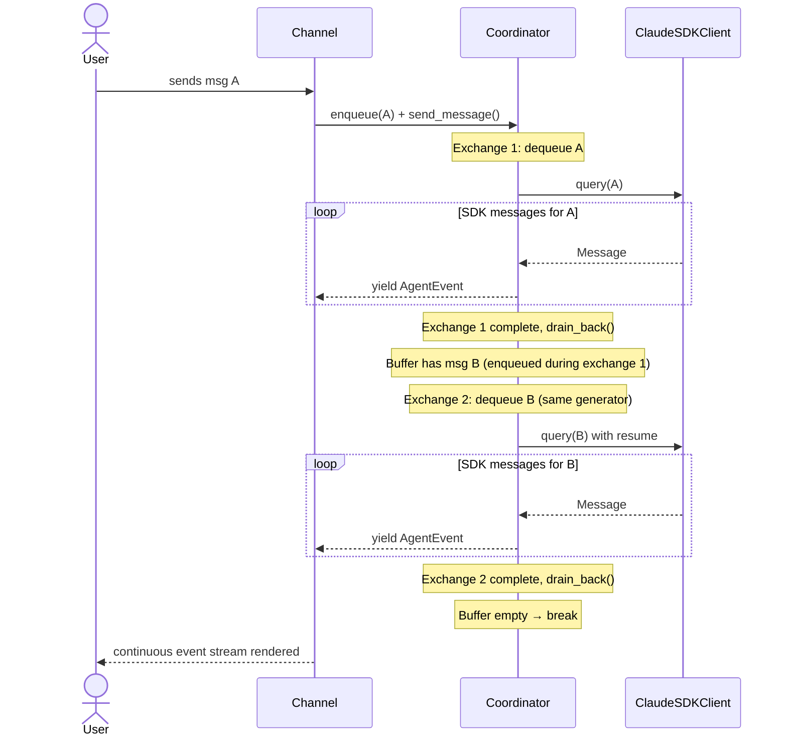

# Design: DLT-163 - Block message enqueue during exchange teardown

**Delta Spec**: [../delta-specs/DLT-163.md](../delta-specs/DLT-163.md)
**Status**: Approved

## Purpose

This document explains the design rationale for moving the message drain loop from the Telegram channel into the coordinator's `send_message()` generator, ensuring no user message is accepted by a session that cannot process it.

After implementation, the "Detected Impacts" section will guide reconciliation into feature design docs.

## Problem Context

When a `send_message()` generator completes one exchange (SDK `receive_response()` returns after `ResultMessage`), messages arriving in the gap between the final response and teardown can still be enqueued via `enqueue()` into `_message_buffer`. These messages have no consumer: the forwarder is cancelled, the SDK client is disconnected, and `_client` is set to `None`. They sit orphaned in the buffer until the Telegram channel's drain loop picks them up on the next `send_message()` call — but by then, the original exchange context is gone.

The Telegram channel has a `while has_pending_messages` drain loop in `_process_through_coordinator()` intended to handle leftover messages, but it runs **outside** the `send_message()` generator, creating the gap where messages can be enqueued with no active consumer.

**Constraints:**
- `send_message()` is an async generator — it yields `AgentEvent`s and must complete cleanly per Python async generator semantics
- The SDK client lifecycle is per-exchange (`async with ClaudeSDKClient` in a try/finally)
- The forwarder task must be cancelled and awaited before client disconnect to prevent race conditions
- `_drain_back()` recovers items from the per-turn `sdk_inbox` back to `_message_buffer` after the forwarder is cancelled
- Per-message post-processing fires after each individual exchange, not once at the end of all re-queued messages
- The change must be transparent to channels (same `AsyncIterator[AgentEvent]` interface)

**Interactions:**
- Telegram channel's `_process_through_coordinator()` currently owns the drain loop
- REPL channel has no drain loop — it calls `send_message()` once per user input
- The coordinator's `_forwarder()` and `_drain_back()` handle message routing during and after exchanges
- DES-009 (Channel Delivery Serialization): when `_delivery_lock.locked()` is True, channels bypass the lock and call `enqueue()` only, steering messages into the in-flight exchange via the forwarder. Messages enqueued during the teardown gap (forwarder cancelled, lock still held) land in `_message_buffer` and are recovered by `_drain_back()` → re-queue loop. The lock remains held for the entire `send_message()` call (including all re-queue iterations), preserving delivery serialization

## Design Overview

Move the drain loop **into** the coordinator's `send_message()` generator. After one exchange completes (the `try/finally` block), the generator checks `_message_buffer` for leftover messages. If present, it loops back to the top and processes the next message through the full pipeline (boundary detection, pre-processing, SDK client creation, streaming) — yielding all events as one continuous stream. The channel sees a single `AsyncIterator[AgentEvent]`.

The Telegram channel's drain loop is removed. Both channels now call `send_message()` once and consume the continuous stream until the generator returns.

```
Before (broken):
  Channel → while has_pending_messages:
              send_message() → one exchange → returns
            → send_message() → next exchange → returns

After (fixed):
  Channel → send_message() → exchange 1
                            → check buffer
                            → exchange 2 (same generator, same yield)
                            → check buffer
                            → empty → return
```

## Shape

| Part | Mechanism | Flag |
|------|-----------|:----:|
| **S1** | Outer re-queue loop in `send_message()`: after one exchange completes and `_drain_back()` recovers leftovers, check `_message_buffer`; if non-empty, loop to dequeue next message and run through full pipeline | |
| **S2** | Move `_pending_msg_task` creation and done-callback registration inside the re-queue loop so each exchange launches its own post-processing task; each iteration's task is awaited at the start of the next iteration | |
| **S3** | Remove `while has_pending_messages` drain loop from Telegram's `_process_through_coordinator()` — single `async for` iteration over `send_message()` | |
| **S4** | Guard clause before loop: return immediately if `_message_buffer` is empty on initial call (preserves current early-return behavior) | |
| **S5** | On re-queue failure, yield `Error` event to channel and log at ERROR level; messages remain in `_message_buffer` (recovered by `_drain_back()` or never dequeued) for next interaction | |

## Components

### Implementation Structure

| Layer/Component | Responsibility | Key Decisions |
|-----------------|----------------|---------------|
| `coordinator.py` — `send_message()` | Owns the re-queue loop; wraps entire exchange body in `while True` that breaks when buffer is empty | Full pipeline per iteration (Option A); per-message post-processing per iteration |
| `telegram/__init__.py` — `_process_through_coordinator()` | Remove drain loop; single `async for` over `send_message()` | No channel-side routing logic |
| `repl.py` | No changes | Already calls `send_message()` once per interaction |

### Cross-Layer Contracts

**Coordinator → Channel contract (unchanged):**
Channels call `send_message()` and consume `AsyncIterator[AgentEvent]`. The stream now contains events from potentially multiple exchanges (separated by `Result` events). The stream ends when the message buffer is empty.



**Integration Points:**
- Coordinator ↔ Channel: `send_message()` yields a continuous stream; `Result` events serve as exchange boundaries for renderer reset (unchanged). Channels must fully consume the generator (per DES-005) — if abandoned via exception, Python's async generator cleanup triggers the `finally` block for the in-flight exchange, but no further re-queue iterations execute.
- Coordinator ↔ SDK: each re-queue iteration creates a fresh `ClaudeSDKClient` with `resume=sdk_session_id` (unchanged per-exchange behavior)
- Per-message post-processing: fires after each individual exchange within the loop, stored as `_pending_msg_task` and awaited at the start of the next iteration. The final iteration's `_pending_msg_task` is **not** awaited before the generator returns — it runs as a background task and is awaited on the next `send_message()` call (or on coordinator shutdown via `__aexit__`). This matches the current single-exchange lifecycle.
- DES-009 lock interaction: the channel's `_delivery_lock` remains held for the entire `send_message()` call including all re-queue iterations. Messages enqueued during any re-queue exchange's teardown window are recovered by `_drain_back()` and processed by subsequent loop iterations.

### Shared Logic

No new shared logic. The change is confined to the coordinator's generator structure and the Telegram channel's loop removal.

## Modeling

No domain model changes. The `Coordinator` state remains the same:
- `_message_buffer: asyncio.Queue[str]` — unbounded FIFO queue
- `has_pending_messages → bool` — property checking buffer non-empty
- `_client: ClaudeSDKClient | None` — set during exchange, `None` between exchanges
- `_sdk_session_id: str | None` — preserved across re-queue iterations (same session)

The behavioral change is that `send_message()` now loops internally instead of returning after one exchange.

## Data Flow

### Re-queue message flow (new)

```
1. Channel calls send_message() → generator starts
2. Dequeue first message from _message_buffer
3. Run full pipeline: boundary detection, pre-processing, SDK client creation
4. Stream events, accumulate response text
5. finally block: cancel forwarder, disconnect client, drain_back(), _client = None
6. Fire per-message post-processing as background task
7. Check _message_buffer:
   ├─ Empty → break loop → return (generator ends)
   └─ Non-empty → loop back to step 2
8. Step 2: dequeue next message (same sdk_session_id for resume)
9. _pending_msg_task awaited at start (from previous iteration's post-processing)
10. Repeat from step 3
```

### Happy path (unchanged)

When no messages arrive during teardown, `_drain_back()` recovers nothing and `_message_buffer` is empty after step 7. The loop executes exactly once — identical to current behavior.

### Error path (re-queue failure)

```
1. Exchange completes normally (steps 1-6 above)
2. Buffer has leftover messages → loop back
3. Next exchange raises exception (e.g., SDK connection error)
4. Exception caught in try/except block → yield Error event
5. finally block: cancel forwarder, disconnect, drain_back()
6. _drain_back() recovers any messages from the failed exchange's sdk_inbox
7. Messages preserved in _message_buffer for next manual interaction
8. Loop continues checking buffer → may attempt another re-queue or break
```

## Key Decisions

### Full pipeline per re-queue iteration (Option A)

**Choice**: Each re-queue iteration runs the complete pipeline — boundary detection, pre-processing (session-gated), per-message pre-processing, SDK client creation, streaming, and post-processing.
**Why**: Simpler code — one code path for all exchanges. Re-queued messages are continuation turns in the same session, so boundary detection returns "continues" quickly and pre-processing is skipped (not a new session). The overhead is a DB read for session state, which is negligible.
**Alternatives Considered**:
- Option B (loop only around SDK exchange): More efficient but creates two code paths within `send_message()`. The saved overhead (one boundary detection call + one session read per re-queued message) does not justify the complexity.

**Consequences**:
- Pro: Single code path — all exchanges follow the same logic
- Pro: Easy to reason about — each iteration is a complete turn
- Pro: No behavioral divergence between first and subsequent messages
- Con: One extra boundary detection call per re-queued message (negligible: returns immediately for continuation)

### Per-message post-processing per exchange

**Choice**: Fire per-message post-processing (summary extraction) after each individual exchange within the re-queue loop, not once at the end. Each iteration's `_pending_msg_task` is awaited at the start of the next iteration. The final iteration's task is not awaited before the generator returns — it runs as a background task, awaited on the next `send_message()` call or on coordinator shutdown.
**Why**: Each re-queued message is an independent user turn with its own response. Summaries should be extracted per turn, not batched. This matches the current single-exchange lifecycle where the pending task is awaited on the next `send_message()` call.
**Alternatives Considered**:
- Batch post-processing after all re-queued exchanges: Would lose per-turn summary granularity and complicate the pending task tracking.
- Await final task before generator return: Would add latency to the generator's completion for no benefit — the task runs in the background and the next `send_message()` call awaits it anyway.

**Consequences**:
- Pro: Consistent per-turn processing — summaries captured for each message
- Pro: Same `_pending_msg_task` lifecycle as current code
- Con: Post-processing runs serially between exchanges (acceptable: the gap is minimal)

### Early return on empty buffer (guard clause)

**Choice**: Check `_message_buffer.empty()` at the top of `send_message()` and return immediately if true, before entering the re-queue loop. The loop's break condition (`if _message_buffer.empty(): break`) handles subsequent iterations after exchanges complete. These are two distinct checks: the guard prevents spurious calls from entering the loop; the break exits after an exchange completes.
**Why**: The current code already has this guard (line 410-411). Preserving it ensures no latency on the happy path. The break condition inside the loop is the natural exit for re-queue iterations.
**Alternatives Considered**:
- Remove the guard and rely on the loop's break condition only: Would enter the loop, attempt to dequeue, and raise `QueueEmpty` (or require a different dequeue strategy).

**Consequences**:
- Pro: Zero overhead when buffer is empty (R5)
- Pro: Backward-compatible with current channel behavior

### Generator cleanup on channel abandonment

**Choice**: If the channel stops consuming the generator mid-stream (e.g., exception during rendering), Python's async generator cleanup triggers the `finally` block for the in-flight exchange. No further re-queue iterations execute. Messages remaining in `_message_buffer` are preserved for the next `send_message()` call.
**Why**: This is standard Python async generator semantics. The `try/finally` block within each iteration ensures the in-flight exchange is cleaned up (forwarder cancelled, client disconnected, `_drain_back()` called). Channels are already required to fully consume `send_message()` per DES-005.

**Consequences**:
- Pro: Clean cleanup on exception — no leaked resources from in-flight exchange
- Pro: Messages preserved in buffer — no data loss
- Con: Re-queued messages not processed until next manual interaction (acceptable: channel abandonment is exceptional)

## System Behavior

### Scenario: Message arrives during active exchange (steering)

**Given**: The coordinator is processing message A, and the forwarder is alive
**When**: User sends message B via `enqueue()` (channel bypasses `_delivery_lock` per DES-009)
**Then**: B is placed in `_message_buffer`, the forwarder picks it up and puts it into `sdk_inbox`, and `_message_source()` yields it to the SDK as a steering message. B is handled within A's exchange — no re-queue needed.
**Rationale**: Existing steering message behavior (R4). The forwarder routes the message while the exchange is active.

### Scenario: Message arrives during teardown gap

**Given**: Exchange for message A just completed (`receive_response()` returned), but `_client` has not yet been set to `None`
**When**: User sends message C via `enqueue()`
**Then**: C lands in `_message_buffer`. The `finally` block runs: forwarder cancelled, client disconnected, `_drain_back()` recovers C from `sdk_inbox` to `_message_buffer`. The re-queue loop finds C, dequeues it, and starts a new exchange with `resume=sdk_session_id`. C is processed in the same session, and its events are yielded to the channel as a continuation of the same generator.
**Rationale**: No message is lost — C is recovered and processed within the same `send_message()` call.

### Scenario: Multiple messages during teardown

**Given**: Exchange for message A completes, and messages B, C, D were enqueued during the teardown gap
**When**: The re-queue loop checks `_message_buffer` and finds B, C, D
**Then**: B is dequeued and processed (exchange 2). After B completes, C is dequeued and processed (exchange 3). After C completes, D is dequeued and processed (exchange 4). Buffer empty → loop breaks. All four exchanges are yielded as one continuous stream with `Result` events separating each.
**Rationale**: FIFO ordering preserved. Each message gets its own exchange with proper post-processing.

### Scenario: Re-queue exchange fails

**Given**: Exchange for message A completes, message B is in the buffer
**When**: The re-queue loop starts processing B, but the SDK raises `CLIConnectionError`
**Then**: The error is caught, `Error(recoverable=True)` event yielded to channel, `finally` block runs (drain_back recovers any messages). The error is logged at ERROR level. The loop checks the buffer again. If B was the only message and it was consumed before the error, the buffer is empty → break. If additional messages arrived, the loop attempts to process them.
**Rationale**: Messages are preserved through `_drain_back()`. The user sees the error and can retry.

### Scenario: Channel abandons the generator mid-stream

**Given**: The coordinator is in the middle of a re-queue loop, processing exchange 2 of 3
**When**: The channel raises an exception during rendering (e.g., Telegram API failure)
**Then**: Python's async generator cleanup triggers the `finally` block for exchange 2 (forwarder cancelled, client disconnected, `_drain_back()` called). The generator does not continue to exchange 3. Message 3 remains in `_message_buffer` for the next `send_message()` call.
**Rationale**: Standard Python async generator semantics. Channels are required to fully consume `send_message()` per DES-005. Abandonment is exceptional — preserving messages in the buffer is the safe fallback.

### Scenario: No messages during teardown (happy path)

**Given**: Exchange for message A completes, no messages were enqueued during teardown
**When**: The re-queue loop checks `_message_buffer`
**Then**: Buffer is empty → loop breaks immediately. Behavior identical to current single-exchange flow.
**Rationale**: Zero overhead on the happy path (R5).

### Scenario: REPL channel behavior unchanged

**Given**: The REPL channel calls `send_message()` once per user input
**When**: A message is processed
**Then**: If no messages arrive during teardown, the loop runs exactly once — identical to current behavior. If messages do arrive (unlikely in REPL, but possible via programmatic `enqueue()`), they are processed as re-queued exchanges transparently.
**Rationale**: The change is transparent to all channels.

## Open Questions

None.

---

## Detected Impacts

### Affected Feature Designs
- **docs/feature-designs/agent/core-architecture.md** - Modifies: `send_message()` generator structure (re-queue loop), `Coordinator` state documentation, message buffer flow section
- **docs/feature-designs/channels/telegram.md** - Modifies: remove drain loop from `_process_through_coordinator()` description, update message buffer flow section

### Notes for Reconciliation
- Core architecture design's "Message buffer flow" section needs updating to describe the re-queue loop inside `send_message()` instead of the channel-owned drain loop
- Core architecture design's "Coordinator state and methods" section needs updating for the new `send_message()` loop behavior
- Telegram channel design's "Message buffer flow" section needs drain loop references removed
- Telegram channel design's "Scenario: Buffering mid-stream" needs updating to reflect coordinator-owned re-queue
- REPL channel is unaffected (no drain loop exists, no documentation changes needed)

## Notes

- The `_forwarder()` and `_drain_back()` methods are unchanged — they continue to route messages during and after exchanges
- The `enqueue()` method is unchanged — it remains sync with zero preconditions
- The `has_pending_messages` property is unchanged but its primary consumer shifts from the Telegram drain loop to the coordinator's re-queue loop
- This design depends on DES-005 (SDK generator consumption): `receive_response()` naturally terminates at `ResultMessage`, so each exchange in the loop completes cleanly
- **Message ID clarification**: The spec's acceptance criteria reference "original message ID preserved" and "channel can correlate it to the original message." The current `_message_buffer` is `asyncio.Queue[str]` — it holds plain text with no ID tracking. Channel correlation works through FIFO ordering: each `Result` event triggers renderer finalization and reset, so each re-queued message's response renders as a distinct Telegram message in order. No ID tracking mechanism is needed; FIFO order preservation is sufficient.
