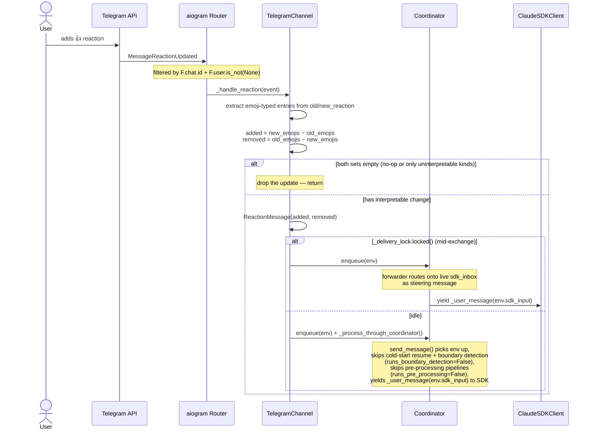
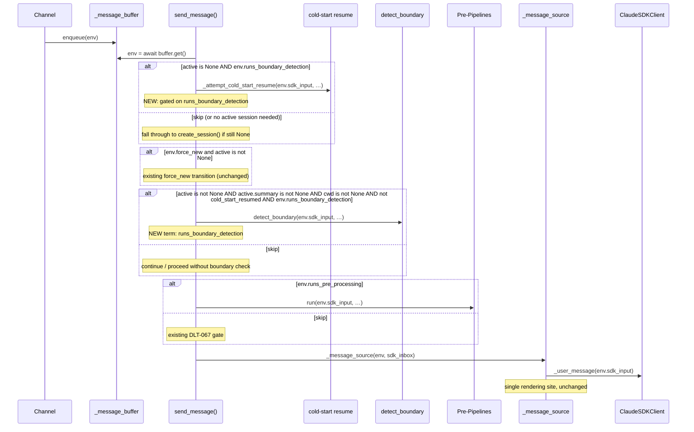
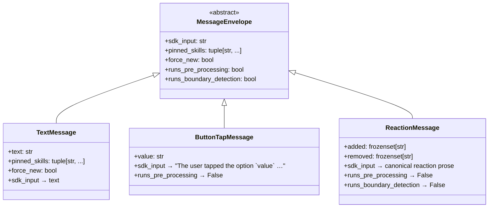

# Design: DLT-176 — Inbound Telegram reaction interpretation

**Delta Spec**: [../delta-specs/DLT-176.md](../delta-specs/DLT-176.md)
**Status**: Approved

## Purpose

This document explains the design rationale for treating user emoji reactions on Telegram messages as conversational turns: how the existing `MessageEnvelope` hierarchy (DLT-067) extends to cover reactions, which coordinator branches change, and how the channel produces reaction envelopes without re-introducing channel-specific routing logic.

After implementation, the "Detected Impacts" section will guide reconciliation into feature design docs.

## Problem Context

Today the user has two ways to send input through Telegram: typed text and supported media files. Both produce a `TextMessage` envelope at the coordinator boundary. Telegram also delivers a third kind of update — `message_reaction` — which fires whenever the user adds, removes, or replaces an emoji reaction on any message in the chat. Today the bot ignores these updates entirely: the `message_reaction` update type is not in aiogram's default `allowed_updates` list, and even if it were, no handler is registered for it.

This delta turns those reactions into conversational turns. A 👍 on the agent's last message should become a fresh agent turn whose prompt says "the user reacted with 👍, interpret in the context of the last exchange" — without the agent ever having to ask the user to type "thanks" or "got it." The friction reduction is the entire point: phones make typing expensive; tapping an emoji is essentially free.

**Constraints:**
- The coordinator must not grow `isinstance` checks. The DLT-067 refactor and DES-013 ("Typed Envelope with Property Hooks") established that subtype-specific behavior lives on the subtype via property hooks. Reactions must follow the same discipline.
- Telegram's `getUpdates` API does not deliver `message_reaction` updates unless explicitly opted in via `allowed_updates`. The opt-in must survive without becoming a brittle hardcoded list (deltas keep adding update types).
- Reaction updates arriving while the agent is mid-response must reach the agent as steering input, not become a fresh turn. The same `_delivery_lock.locked()` busy/idle pattern that text and media use must apply uniformly.
- Telegram delivers reactions as a list-replacement (`new_reaction` is the full new set, not a delta). The handler has to compute the diff against `old_reaction` and decide whether the change is interpretable at all (custom emoji and paid reactions carry no semantic content the agent can act on).
- The reaction event lacks any cheap, reliable way to tie the reaction back to a specific outbound agent message — the bot would need an outbound message-ID registry to do that. DLT-176 accepts this as a known limitation: the agent gets told "the user reacted with X" but not "to which message," and is expected to disambiguate from conversation context.

**Interactions:**
- **Telegram channel** (`src/tachikoma/telegram/__init__.py`): aiogram dispatcher, router, the chat-id authorization filter pattern, `_delivery_lock.locked()` busy/idle branching, `start_polling` parameters.
- **Coordinator** (`src/tachikoma/coordinator.py`): `_message_buffer` envelope queue, `send_message()` per-iteration cold-start and boundary-detection branches, `_message_source` rendering site.
- **Message envelope hierarchy** (`src/tachikoma/message.py`): `MessageEnvelope` ABC with property hooks (`sdk_input`, `pinned_skills`, `force_new`, `runs_pre_processing`).
- **DES-013**: the pattern this delta extends — one new hook on the base, one new concrete subtype.
- **Configuration** (`src/tachikoma/config.py`): `TelegramSettings` Pydantic model.
- **aiogram 3.x**: `@router.message_reaction()` observer, `MessageReactionUpdated`, `ReactionTypeEmoji`/`ReactionTypeCustomEmoji`/`ReactionTypePaid`, `dp.resolve_used_update_types()`.

## Design Overview

Two coupled changes land in this delta.

**1. Envelope hierarchy extension (foundation).** A new property hook `runs_boundary_detection: bool` is added to the `MessageEnvelope` base (default `True`), sibling to the existing `runs_pre_processing` hook. The coordinator gates both the cold-start resume branch and the active-session boundary-detection branch on this hook — adding one new term to two existing guards. No isinstance checks; no new dispatcher.

A new concrete subtype `ReactionMessage(added: frozenset[str], removed: frozenset[str])` joins `TextMessage` and `ButtonTapMessage`. It overrides `sdk_input` (rendered prose), `runs_pre_processing` (False — a single emoji is not a useful classifier signal), and `runs_boundary_detection` (False — reactions are inherently follow-ups). All other hooks inherit base defaults.

**2. Telegram reaction handling (the feature).** The `TelegramChannel` gains an `@router.message_reaction(F.chat.id == authorized_chat_id, F.user.is_not(None))` handler. The handler filters non-emoji reaction types out of `old_reaction` and `new_reaction`, computes the emoji-set diff, drops the update if both sets are empty, constructs a `ReactionMessage`, and routes through the same `_delivery_lock.locked()` busy/idle pattern used by `_handle_message`/`_handle_media`/`_handle_callback_query`. Polling gains `allowed_updates=self._dispatcher.resolve_used_update_types()` so Telegram actually delivers `message_reaction` updates. A new `inbound_reactions: bool = True` config field gates the handler registration — when `False`, the handler is never registered and `resolve_used_update_types()` automatically omits `message_reaction` from polling.

```
┌────────────────────────────────────────────────────────────────────────────┐
│                            Telegram Channel                                  │
│                                                                              │
│   @router.message_reaction(F.chat.id == auth, F.user.is_not(None))           │
│       │                                                                      │
│       ├── filter emoji-only entries from old/new reactions                   │
│       ├── added, removed = new_emojis - old_emojis, old_emojis - new_emojis  │
│       ├── drop if both sets empty (no-op or only uninterpretable kinds)      │
│       ├── ReactionMessage(added, removed)                                    │
│       └── _delivery_lock.locked() branching                                  │
│            ├── busy → coordinator.enqueue(env)         (steering)            │
│            └── idle → lock + enqueue + _process_through_coordinator()        │
│                       + drain deferred                                       │
└────────────────────────────────────────────────┼─────────────────────────────┘
                                                 │
                                                 ▼
┌────────────────────────────────────────────────────────────────────────────┐
│                                Coordinator                                   │
│                                                                              │
│   send_message():                                                            │
│      msg = await _message_buffer.get()                                       │
│      cold-start resume         only if msg.runs_boundary_detection           │
│      active boundary detection only if msg.runs_boundary_detection           │
│      pre-processing pipelines  only if msg.runs_pre_processing               │
│      _message_source yields _user_message(env.sdk_input) — unchanged         │
└────────────────────────────────────────────────────────────────────────────┘
```

Every producer-side and consumer-side code path that exists today for text and button-tap envelopes also works for reaction envelopes without change — the abstraction does the work.

## Shape

| Part | Mechanism | Flag |
|------|-----------|:----:|
| **S1** | **New `runs_boundary_detection: bool` hook on `MessageEnvelope` base**, default `True`. Sibling to DLT-067's `runs_pre_processing`. The coordinator's `send_message()` reads it once per iteration and gates BOTH the cold-start resume branch (`coordinator.py:473`) and the active-session boundary-detection branch (`coordinator.py:501-506`) on it. When `False`, both branches are skipped; if no active session exists, a fresh one is created directly via `_registry.create_session()`. Adds zero new state, zero new dispatch — one new term in each existing guard. Pattern follows DES-013 (one hook per coordinator decision; subtypes own their behavior). | |
| **S2** | **New `ReactionMessage(added: frozenset[str], removed: frozenset[str])` frozen-dataclass subtype** in `src/tachikoma/message.py`, alongside `TextMessage` and `ButtonTapMessage`. Inherits base defaults for `pinned_skills` (`()`) and `force_new` (`False`); overrides `runs_pre_processing` → `False` (no provider can interpret an emoji), `runs_boundary_detection` → `False` (reactions are inherently follow-ups), and `sdk_input` → the rendered prose described in S3. Carries only the emoji-set diff; no message-ID field (R10 accepted limitation), no chat-ID (already filtered upstream at the handler boundary). Frozensets give hashability + value equality + iteration determinism for testing. | |
| **S3** | **`ReactionMessage.sdk_input` renders one of four canonical shapes** as a pure function on the envelope's two frozensets. Added-only (`added={X}, removed={}`): *"The user reacted with X. Interpret it in the context of the last exchange and respond accordingly."* Removed-only (`added={}, removed={X}`): *"The user removed their X reaction. Interpret it in the context of the last exchange and respond accordingly."* Single replacement (`added={Y}, removed={X}`, both cardinality 1): *"The user changed their reaction from X to Y. Interpret it in the context of the last exchange and respond accordingly."* Multi-change (any other combination): *"The user reacted with X and Y and removed their Z reaction. Interpret these in the context of the last exchange and respond accordingly."* Emojis enumerated in iteration order (sorted for determinism). No emoji→meaning mapping. Never references the reacted-to message. | |
| **S4** | **aiogram reaction handler** in `TelegramChannel.__init__`: `self._router.message_reaction(F.chat.id == settings.authorized_chat_id, F.user.is_not(None))(self._handle_reaction)`. The `F.chat.id` filter applies chat-level authorization the same way `self._router.message.filter(...)` does for text/media (R5 — the existing chat-only auth policy). `F.user.is_not(None)` filters out anonymous-channel reactions cleanly per aiogram docs. Inside `_handle_reaction(event: MessageReactionUpdated)`: extract `ReactionTypeEmoji.emoji` strings from `event.old_reaction` and `event.new_reaction` (drop `ReactionTypeCustomEmoji` and `ReactionTypePaid` per R9), compute `added = new_emojis - old_emojis` and `removed = old_emojis - new_emojis`, drop the update if both sets are empty, construct `ReactionMessage(added=frozenset(added), removed=frozenset(removed))`, and apply the same `_delivery_lock.locked()` branching `_handle_message` uses. Busy → `coordinator.enqueue(env)` (mid-stream steering through the forwarder). Idle → `async with self._delivery_lock: enqueue + _process_through_coordinator() + _drain_deferred_queue()`. Reactions never use `enqueue_deferred()` — there's no force-new analog. | |
| **S5** | **Allowed-updates configuration:** the existing `await self._dispatcher.start_polling(self._bot, ...)` call gains one new keyword argument: `allowed_updates=self._dispatcher.resolve_used_update_types()`. aiogram inspects registered handlers to compute the set; once S4's handler is registered the set includes `"message_reaction"`. The list also auto-shrinks when handlers are absent (S7 disable flag), so the polling configuration tracks the handler set with zero coupling between the two registration sites. No hardcoded `["message", "callback_query", "message_reaction", ...]` to maintain. | |
| **S6** | **Coordinator boundary-skip wiring:** `coordinator.py:473` becomes `if active is None and msg.runs_boundary_detection:` (cold-start branch). `coordinator.py:501-506` becomes `will_detect_boundary = (active is not None and active.summary is not None and self._cwd is not None and not cold_start_resumed and msg.runs_boundary_detection)`. Two single-term additions. The `if active is None: active = await self._registry.create_session()` fallback (line 484) is unconditional, so a reaction arriving cold still gets a fresh session — just without first asking "does this match any closed session?". | |
| **S7** | **Optional disable flag** `inbound_reactions: bool = True` added to `TelegramSettings` in `src/tachikoma/config.py` with `Field(default=True, description="Receive Telegram emoji reactions as conversational input")`. When `False`, `TelegramChannel.__init__` skips the `self._router.message_reaction(...)(self._handle_reaction)` registration. Because `resolve_used_update_types()` (S5) inspects registered handlers, dropping the registration drops `message_reaction` from `allowed_updates` automatically and Telegram stops delivering reactions over polling. Applied at startup only; live toggling is out of scope (consistent with the rest of the Telegram configuration model). | |

### Flagged Unknowns

_None._ The seed shape's S1 unknown ("envelope protocol surface") was resolved by DLT-067 landing the `MessageEnvelope` ABC and DES-013 codifying the pattern. The five sub-decisions inside the seed S1 — routing surface, pinned_skills placement, buffer payload type, rendering site, cold-start handling for reactions — were all answered by inheriting DLT-067's decisions and adding one new hook for boundary-detection skipping.

## Components

### Implementation Structure

| Layer/Component | Responsibility | Key Decisions |
|-----------------|----------------|---------------|
| `src/tachikoma/message.py` | `MessageEnvelope` ABC gains the `runs_boundary_detection` property (default `True`). New `ReactionMessage(added, removed)` frozen-dataclass subtype joins `TextMessage` and `ButtonTapMessage`. Overrides `sdk_input`, `runs_pre_processing` → `False`, `runs_boundary_detection` → `False`. | One new hook, one new subtype — strictly additive against DLT-067's hierarchy. Follows DES-013 verbatim. |
| `src/tachikoma/coordinator.py` | `send_message()` gates the cold-start resume branch and the active-session boundary detection branch on `msg.runs_boundary_detection`. No other coordinator changes — `_message_source`, `_forwarder`, `_drain_back`, `enqueue`, `_message_buffer` typing all remain envelope-typed exactly as DLT-067 left them. | One new term in two existing guards. The hook is read from the envelope; the coordinator stays envelope-agnostic. |
| `src/tachikoma/telegram/__init__.py` | `TelegramChannel.__init__` conditionally registers `@router.message_reaction(F.chat.id == auth, F.user.is_not(None))(self._handle_reaction)` based on `settings.inbound_reactions`. New `_handle_reaction(event: MessageReactionUpdated)` method computes the emoji diff, drops no-ops, constructs `ReactionMessage`, applies the `_delivery_lock.locked()` busy/idle branching. `run()` passes `allowed_updates=self._dispatcher.resolve_used_update_types()` to `start_polling`. | Chat-level filter at the observer (not router-wide) because `router.message.filter(...)` applies only to the `message` observer in aiogram. `F.user.is_not(None)` excludes anonymous-channel reactions per aiogram docs. Filtering reaction types to emoji-only happens in-handler (in Python) rather than via aiogram filters — the `F.new_reaction[0].type == "emoji"` filter aiogram offers is too coarse (would reject mixed-kind updates outright). |
| `src/tachikoma/config.py` | `TelegramSettings` gains `inbound_reactions: bool = Field(default=True, description="...")`. | One-field addition; defaults preserve current observable behavior for users who do not customize. |

### Cross-Layer Contracts

#### Reaction reception sequence



#### Envelope through the coordinator (deltas from DLT-067 baseline)



**Integration Points:**
- **`TelegramChannel` ↔ aiogram router**: new `@router.message_reaction()` observer registered alongside the existing message, media, and callback_query observers. Chat-level filter on the observer; reaction-type filtering happens in-handler.
- **`TelegramChannel` ↔ `Coordinator`**: identical to text/media — `enqueue(MessageEnvelope)`. The handler does not need any new coordinator API.
- **`TelegramChannel.run` ↔ `dispatcher.start_polling`**: `allowed_updates=self._dispatcher.resolve_used_update_types()`. Single call; aiogram auto-computes the list from registered handlers.
- **`Coordinator` ↔ `MessageEnvelope`**: reads `msg.runs_boundary_detection` at two sites (cold-start guard + active-session boundary guard). No isinstance, no new types referenced.
- **Pre-processing pipelines ↔ `MessageEnvelope`**: unchanged from DLT-067 — pipelines see the envelope only when `runs_pre_processing=True`, which is False for reactions, so pipelines never see a `ReactionMessage`.

### Shared Logic

- **`runs_boundary_detection` hook**: lives on `MessageEnvelope`; coordinator reads it; subtypes override it. One source of truth.
- **Emoji extraction helper**: a module-level function `_emoji_set(reactions: Sequence[ReactionType]) -> frozenset[str]` in `telegram/__init__.py` filters a sequence of `ReactionType` entries (the aiogram base class for the discriminated-union on `MessageReactionUpdated.old_reaction`/`new_reaction`) to the emoji strings of `ReactionTypeEmoji` entries. `Sequence` (covariant) accepts the concrete `list[ReactionTypeEmoji | ReactionTypeCustomEmoji | ReactionTypePaid]` aiogram exposes; returning `frozenset[str]` lets the handler feed the result directly into `ReactionMessage` and use set arithmetic for the diff without a wrap step. Used twice in `_handle_reaction` (for old and new). Pure function; trivial to test in isolation.
- **Reaction prose rendering**: lives on `ReactionMessage.sdk_input`; pure function on the envelope's two frozensets. One source of truth for the canonical wording.

#### No-`isinstance` audit

Every coordinator site that touches a message envelope still reads only hooks. New hook (`runs_boundary_detection`) joins the existing four:

| Site | Access | Hook used |
|------|--------|-----------|
| `send_message()` cold-start guard | `if active is None and msg.runs_boundary_detection:` | `runs_boundary_detection` (NEW) |
| `send_message()` active-session boundary guard | `will_detect_boundary = (… and msg.runs_boundary_detection)` | `runs_boundary_detection` (NEW) |
| `send_message()` `force_new` branch | `msg.force_new` | `force_new` (existing) |
| `send_message()` pre-processing gate | `msg.runs_pre_processing` | `runs_pre_processing` (existing) |
| `_message_source` yield | `env.sdk_input` | `sdk_input` (existing) |
| `_msg_pre_pipeline.run(msg, ...)` | envelope passed; provider reads `sdk_input` + `pinned_skills` | `sdk_input`, `pinned_skills` (existing) |

No new `isinstance` discrimination introduced. Adding a future envelope subtype (e.g., DLT-125 media envelopes) does not require editing any coordinator site unless the subtype needs a new hook.

## Modeling

### Envelope hierarchy after DLT-176



Base defaults (post-DLT-176):
- `pinned_skills = ()`
- `force_new = False`
- `runs_pre_processing = True`
- `runs_boundary_detection = True` (new)

Each subtype overrides only the hooks whose value differs from the default. `TextMessage` declares three fields and overrides `sdk_input`. `ButtonTapMessage` declares one field and overrides two hooks. `ReactionMessage` declares two fields and overrides three hooks.

### `ReactionMessage` field semantics

- `added: frozenset[str]` — the emoji-typed entries present in `new_reaction` but not `old_reaction`.
- `removed: frozenset[str]` — the emoji-typed entries present in `old_reaction` but not `new_reaction`.
- Construction invariant: at least one of `added` or `removed` is non-empty. The handler enforces this by dropping no-op updates before constructing the envelope.
- Frozensets, not lists or tuples: ordering carries no meaning (Telegram doesn't preserve a tap order), set semantics give natural diff math, and hashability lets envelopes participate in any future deduplication if needed.

### Queue element types

```
_message_buffer  : asyncio.Queue[MessageEnvelope]   (unchanged)
_deferred_queue  : asyncio.Queue[MessageEnvelope]   (unchanged)
sdk_inbox        : asyncio.Queue[MessageEnvelope]   (per-turn, unchanged)
```

No type changes. The hierarchy expanded; the queue types didn't.

### Rendered prose canonical forms

| Diff shape | `added` | `removed` | Rendered `sdk_input` |
|------------|---------|-----------|----------------------|
| Added-only (1) | `{X}` | `{}` | *"The user reacted with X. Interpret it in the context of the last exchange and respond accordingly."* |
| Added-only (N) | `{X, Y, …}` | `{}` | *"The user reacted with X and Y. Interpret these in the context of the last exchange and respond accordingly."* |
| Removed-only (1) | `{}` | `{X}` | *"The user removed their X reaction. Interpret it in the context of the last exchange and respond accordingly."* |
| Removed-only (N) | `{}` | `{X, Y, …}` | *"The user removed their X and Y reactions. Interpret these in the context of the last exchange and respond accordingly."* |
| Replacement (1↔1) | `{Y}` | `{X}` | *"The user changed their reaction from X to Y. Interpret it in the context of the last exchange and respond accordingly."* |
| Mixed (any other) | `{X, Y, …}` | `{Z, …}` | *"The user reacted with X and Y and removed their Z reaction. Interpret these in the context of the last exchange and respond accordingly."* |

Iteration order: emojis are sorted (Python's stable `sorted()` on the frozenset) for deterministic rendering — useful for tests, harmless for the agent. Join policy for N≥3 emojis in a single list: `", "` between non-last items and `" and "` before the last (e.g. `{A, B, C}` renders as *"A, B and C"*). No Oxford comma. Same policy applies to the `removed`-list segment of mixed-shape prose.

## Data Flow

### Reaction reception (user → agent)

```
1. User adds, removes, or replaces an emoji reaction in Telegram
2. Telegram delivers MessageReactionUpdated via getUpdates (because
   `message_reaction` is in allowed_updates — see polling setup below)
3. Router matches: chat.id == authorized_chat_id, user is not None
4. _handle_reaction(event) runs:
   a. old_emojis = _emoji_set(event.old_reaction)
   b. new_emojis = _emoji_set(event.new_reaction)
   c. added     = new_emojis - old_emojis
   d. removed   = old_emojis - new_emojis
   e. if not added and not removed:
        - no-op update, OR only uninterpretable-kind changes
        - log at debug; return
   f. env = ReactionMessage(added=frozenset(added),
                            removed=frozenset(removed))
   g. if self._delivery_lock.locked():
        - mid-stream: enqueue and return
        - the coordinator's forwarder picks env up,
          renders env.sdk_input into the per-turn sdk_inbox,
          and the SDK receives it as a steering message in the
          current session
      else:
        - idle: async with self._delivery_lock:
            self._coordinator.enqueue(env)
            await self._process_through_coordinator()
            await self._drain_deferred_queue()
```

### Envelope through the coordinator

```
1. send_message() guard: buffer empty → return
2. msg = await _message_buffer.get()
3. (existing) await previous _pending_msg_task

4. if msg.runs_boundary_detection:                 # NEW guard
     if active is None:
       cold-start resume attempt (existing logic)
     if active is None:
       active = create_session()                    # new session
       is_new_session = True
   else:
     # ReactionMessage path: skip cold-start resume entirely
     if active is None:
       active = create_session()                    # straight to fresh
       is_new_session = True

5. (existing) force_new transition gate
   - For TextMessage from /new: msg.force_new=True → transition
   - For ReactionMessage / ButtonTapMessage: False → no-op

6. will_detect_boundary = (active is not None
                            and active.summary is not None
                            and self._cwd is not None
                            and not cold_start_resumed
                            and msg.runs_boundary_detection)   # NEW term
   - For TextMessage on a continuing topic → True (existing behavior)
   - For ReactionMessage → False (the new term short-circuits)
   - For ButtonTapMessage → True or False per existing gates (this delta
     does not change ButtonTap behavior — taps still go through boundary
     detection in DLT-067; DLT-176 leaves that alone)

7. Foundational context save for new sessions (existing)

8. Pre-processing pipelines: if is_new_session and msg.runs_pre_processing:
     pre_pipeline.run(msg.sdk_input, …)               # existing DLT-067 gate
   - For ReactionMessage: skipped (runs_pre_processing=False)

9. Per-message pre-processing: if msg.runs_pre_processing:
     msg_pre_pipeline.run(msg, …)                     # existing DLT-067 gate
   - For ReactionMessage: skipped

10. Build options, create ClaudeSDKClient, _message_source(msg, sdk_inbox)
    - _message_source yields _user_message(msg.sdk_input)
    - For ReactionMessage: yields the rendered prose

11. (existing) SDK exchange, response streaming, per-message post-processing,
    _drain_back recovery (envelopes flow back unchanged)

12. Re-queue loop: buffer empty → break; otherwise next iteration
```

### Polling configuration

```
1. TelegramChannel.__init__:
   if settings.inbound_reactions:
     self._router.message_reaction(
       F.chat.id == settings.authorized_chat_id,
       F.user.is_not(None),
     )(self._handle_reaction)
   # …other handler registrations…
   self._dispatcher.include_router(self._router)

2. TelegramChannel.run() (start_polling call):
   await self._dispatcher.start_polling(
     self._bot,
     handle_signals=False,
     close_bot_session=False,
     backoff_config=BackoffConfig(…),
     allowed_updates=self._dispatcher.resolve_used_update_types(),  # NEW
   )

3. resolve_used_update_types() inspects all registered handlers:
   - When inbound_reactions=True: returns
     ["message", "callback_query", "message_reaction"]
     (or whatever set matches the registered observers)
   - When inbound_reactions=False: returns
     ["message", "callback_query"]   — message_reaction omitted
   The list flows into the Telegram getUpdates parameter,
   determining what Telegram delivers.
```

## Key Decisions

### KD-1: `runs_boundary_detection` as a new envelope hook, not a generic "routing policy" enum

**Choice**: Add a new boolean property hook `runs_boundary_detection` on `MessageEnvelope` (default `True`); `ReactionMessage` overrides to `False`. The coordinator reads it directly at the two boundary-detection sites.

**Why**: DLT-067 established `runs_pre_processing: bool` as the pattern for "this envelope kind opts out of a coordinator decision." Adding a parallel hook for boundary detection is the smallest change that fits the established pattern (DES-013). The alternative — introducing a `session_routing` enum (`NORMAL` / `CONTINUE_CURRENT` / `FORCE_NEW`) that collapses the existing `force_new` bool plus the new opt-out into one field — would require touching all existing envelopes to pick a routing value, would require the coordinator to interpret the enum into the two physical branches it already has, and would not actually simplify anything. The codebase has two distinct boundary decisions (`force_new` triggers a fresh-session transition; `runs_boundary_detection` skips the active-session check); collapsing them adds indirection without removing branches.

**Sources**: `src/tachikoma/coordinator.py` (the actual two branches the hook gates); `src/tachikoma/message.py` (the existing hook precedent); `docs/design/DES-013-typed-envelope-with-property-hooks.md` (the codified pattern).

**Options Researched**:
- **One enum hook (`session_routing: SessionRouting`)**: cleaner data model on paper, but the coordinator still needs to branch on the enum's three values; meanwhile every existing envelope subtype has to declare a routing value (including `TextMessage`'s default, which today is "depends on `force_new`"). Net: more code, no fewer branches.
- **Reuse `runs_pre_processing` (interpret it as "no pre-processing → no boundary either")**: couples two semantically different concerns. A future envelope kind might want to skip one but not the other; pre-binding them to a single hook makes that future delta hard. Q1's user decision was explicit on this — keep the hooks separate.
- **isinstance discrimination in the coordinator (`if isinstance(msg, ReactionMessage): ...`)**: directly violates the DES-013 pattern. The whole point of property hooks is that consumers don't discriminate on subtypes.
- **Adopted**: one new hook on the base, sibling to `runs_pre_processing`, default `True`, `ReactionMessage` overrides to `False`.

**Why This Over Alternatives**: Smallest change, established pattern, minimal coordinator churn (one term added to each of two existing guards). Aligns with DES-013's principle that subtype-specific decisions live on the subtype, not in consumer dispatchers.

**Consequences**:
- Pro: Symmetric with `runs_pre_processing`; future readers recognize the pattern immediately.
- Pro: Adding the hook is purely additive — existing `TextMessage` and `ButtonTapMessage` inherit the default `True` and behave identically.
- Pro: Coordinator stays envelope-agnostic; no new dispatch logic.
- Con: Two boolean hooks instead of one richer enum — a hypothetical reader might wonder whether they should always vary together. The class-level overrides on `ReactionMessage` make the relationship visible in one place.

### KD-2: Strict skip — `runs_boundary_detection=False` skips cold-start resume too, not just active-session boundary

**Choice**: When `runs_boundary_detection` is False, the coordinator skips BOTH the cold-start resume branch (`coordinator.py:473`) AND the active-session boundary-detection branch (`coordinator.py:501-506`). A reaction arriving with no active session creates a fresh session immediately via `_registry.create_session()`, with no attempt to match against recently closed sessions.

**Why**: Both branches are "boundary detection" in the architectural sense — they invoke `detect_boundary()` to decide which session a turn belongs to. A single emoji carries no semantic content that would let `detect_boundary` make a useful match against a closed session's summary (the boundary detector is an LLM call working on prose); paying the latency and token cost to "match" 👍 against last week's debug-the-CI conversation is wasted work. R6's acceptance criterion says "a session is opened the same way as for any other incoming message" — which is satisfied by creating a fresh session, which is exactly what the existing fallback branch does when cold-start resume returns no match.

A future delta that maps reactions to specific outbound message IDs (and therefore to specific sessions) can revisit this — but that's not this delta's scope (R10 calls it out as an accepted limitation).

**Sources**: `src/tachikoma/coordinator.py:473-486` (cold-start branch); `src/tachikoma/coordinator.py:501-506` (active-session branch); spec R6 AC.

**Options Researched**:
- **Lenient skip (cold-start runs, only active-session branch skipped)**: would let cold reactions resume an unrelated old conversation by matching emoji prose to a session summary — an obviously bad fit. Also forces an extra LLM call on every cold reaction.
- **Strict skip (both branches)** (adopted): cold reactions become fresh sessions; the agent is told "the user reacted with X" with no prior context; spec R6 AC's "absurd-context case gracefully (e.g. asking what was reacted to)" applies.

**Why This Over Alternatives**: Matches the user's Q2 decision; aligns with the "no semantic content for boundary detection to act on" principle; saves a (small) LLM call per cold reaction; is symmetric with the active-session skip.

**Consequences**:
- Pro: One hook, one consistent rule — `runs_boundary_detection=False` means *no* `detect_boundary` call, period.
- Pro: Cheaper for the rare cold-reaction case.
- Con: A reaction that *would* have matched a closed session via cold-start now creates a fresh session instead. The cost is one slightly-confused agent turn for an edge case the user can resolve by typing a follow-up.
- Con: When a future delta introduces outbound message-ID tracking, this rule may need to be revisited — the reaction may then carry enough signal to do session matching. Documented as an accepted limitation.

### KD-3: `runs_pre_processing=False` on `ReactionMessage`, mirroring `ButtonTapMessage`

**Choice**: `ReactionMessage` overrides `runs_pre_processing` to `False`. Both the session-gated and per-message pre-processing pipelines are skipped for reactions.

**Why**: DLT-067 set the precedent for `ButtonTapMessage` (KD-3 in that design) on the reasoning that "a tap value carries no semantic intent the providers can act on, so the priming would be wasted." A single emoji is in the same category. Running a memory search for "👍" would return either nothing useful or a non-deterministic match against unrelated past conversations. The skills classifier would have no body text to classify against beyond the rendered prose, which is generic ("Interpret it in the context of the last exchange…").

The agent's existing session already has whatever context the most recent text turn surfaced — that's the right context for interpreting a follow-up reaction.

**Sources**: DLT-067 KD-3 (precedent); `src/tachikoma/memory/context_provider.py:276` and `src/tachikoma/skills/context_provider.py:192` (the call sites where `message.sdk_input` becomes the prompt seed).

**Options Researched**:
- **Run pre-processing on reactions**: every reaction triggers a memory search LLM call against generic prose. Wastes tokens; produces noisy memory hits.
- **Skip pre-processing** (adopted): memory and skills providers don't see reactions; the agent uses whatever was loaded for the most recent text turn.

**Why This Over Alternatives**: Same reasoning as DLT-067 KD-3; symmetric across all "low-semantic-content" envelope kinds (taps + reactions).

**Consequences**:
- Pro: No wasted LLM calls on reactions.
- Pro: Symmetric with `ButtonTapMessage`; the rule "low-content envelopes skip pre-processing" generalizes.
- Con: A reaction arriving as the very first message of a session (cold reaction) will leave the session with no provider-supplied context entries until a regular text message arrives. Same edge case as ButtonTapMessage cold-start; accepted.

### KD-4: Reaction-type filtering in-handler (not via aiogram filters)

**Choice**: `_handle_reaction` extracts `ReactionTypeEmoji.emoji` strings from `event.old_reaction` and `event.new_reaction` in Python, filtering out `ReactionTypeCustomEmoji` and `ReactionTypePaid` entries. aiogram's `F.new_reaction[0].type == "emoji"` filter is not used.

**Why**: aiogram's index-based filter (`F.new_reaction[0].type == "emoji"`) only inspects the first entry of `new_reaction`. If the user adds one standard emoji and one custom emoji in the same update, the filter's behavior depends on which Telegram delivers first — and the spec (R9 AC) explicitly requires that mixed updates render only the interpretable changes and produce one turn. In-handler filtering handles every shape correctly: pure emoji, pure custom, pure paid, any mix.

Additionally, the "no-op or only uninterpretable changes" drop (R9 AC) requires inspecting both the post-filter `added` and `removed` sets — which is a post-extraction comparison, not something aiogram filters can express.

**Sources**: aiogram docs on `F` magic filters and reaction handler patterns (from doc-researcher synthesis); Telegram Bot API on `ReactionType` union.

**Options Researched**:
- **`F.new_reaction[0].type == "emoji"` router filter**: too coarse, fails on mixed-kind updates.
- **`F.new_reaction.any(...)` magic filter**: aiogram's magic filter doesn't expose `.any()` semantics over reaction lists; even if it did, we'd still need in-handler processing to compute the diff.
- **In-handler filtering** (adopted): one pure helper function, exhaustive over all reaction subtypes, handles mixed updates correctly.

**Why This Over Alternatives**: Aiogram filters work well for binary include/exclude decisions on individual fields; they don't help when the decision depends on multiple fields and post-filter set arithmetic. Push that logic into the handler where it can be tested in isolation.

**Consequences**:
- Pro: Correct handling of mixed-kind updates (R9 AC's third bullet).
- Pro: Single testable helper (`_emoji_set(reactions)`).
- Pro: Future reaction-type variants (Telegram adds another subtype someday) are dropped automatically by the "emoji only" filter — no router-level update needed.
- Con: Every reaction update reaches the handler before being filtered; a tiny amount of wasted dispatch on custom-only or paid-only updates. Negligible at single-user scale.

### KD-5: `allowed_updates=resolve_used_update_types()` over a hardcoded list

**Choice**: Pass `allowed_updates=self._dispatcher.resolve_used_update_types()` to `start_polling`. aiogram inspects registered handlers and computes the list. No hardcoded `["message", "message_reaction", ...]` literal.

**Why**: A hardcoded list creates two registration sites that have to stay in sync — adding a new update type means editing both the handler registration and the polling list. `resolve_used_update_types()` reduces this to one registration site: the handler. The disable flag (S7) also falls out for free — when the handler isn't registered, the auto-resolved list omits `message_reaction` and Telegram stops delivering them.

aiogram's docs explicitly recommend this pattern as the default.

**Sources**: aiogram 3.x dispatcher docs (from doc-researcher synthesis); aiogram's `Dispatcher.resolve_used_update_types()` source.

**Options Researched**:
- **Hardcoded list** (`["message", "callback_query", "message_reaction"]`): brittle; every new update-type-using delta has to edit this in two places.
- **Auto-resolved list** (adopted): one source of truth (registered handlers).
- **No `allowed_updates` parameter** (current behavior pre-DLT-176): falls back to aiogram's default `allowed_updates` which excludes `message_reaction` — would mean reactions are never delivered. Not viable.

**Why This Over Alternatives**: Single source of truth; couples polling configuration to handler registration in the right direction (polling derives from handlers, not the reverse); enables S7 disable flag automatically.

**Consequences**:
- Pro: One registration site for any new update type.
- Pro: Disable flag (S7) works automatically — drop the handler, drop the update type.
- Pro: Matches aiogram's documented best practice.
- Con: Implicit coupling — a reader looking at `start_polling` doesn't see *which* update types are polled without checking the registered handlers. Acceptable: that's true of `resolve_used_update_types()` everywhere it's used.

### KD-6: Chat-level filter on the reaction observer, mirroring text/media policy

**Choice**: `self._router.message_reaction(F.chat.id == settings.authorized_chat_id, F.user.is_not(None))(self._handle_reaction)`. Authorization is by `chat.id`, identical to the policy text and media messages use today (spec R5 AC). The reactor's `user.id` is not checked separately.

**Why**: The Telegram channel's existing authorization model authorizes a single chat, not a single user. In a private chat the chat ID and user ID are equal; in a hypothetical group context they would not be. Adopting "chat-level only" for reactions keeps the policy uniform — there's one authorization concept ("the configured chat is trusted"), not two. Mixing in a per-message user check for reactions only would create a confusing asymmetry with text/media handling.

`F.user.is_not(None)` is a different concern — it screens out anonymous-channel reactions (where `event.user` is `None` and `event.actor_chat` is set). These are reactions made on behalf of a channel, not by an identified user, and they don't fit the conversational model at all. Filtering them at the router keeps the handler body clean.

**Sources**: `src/tachikoma/telegram/__init__.py:567` (existing chat-level filter on `router.message`); aiogram docs on `MessageReactionUpdated.user` vs `actor_chat` semantics; spec R5 AC ("the same field used by existing text and media handlers — and does not introduce a new 'authorized user' concept").

**Options Researched**:
- **User-level filter (`F.user.id == authorized_chat_id`)**: introduces a new authorization concept (user vs chat) for reactions only. R5 AC rules this out.
- **Chat-level filter + user-not-None** (adopted): matches existing policy; cleanly excludes anonymous-channel reactions.
- **No anonymous-channel filter**: lets `event.user is None` reach the handler; the handler would need a guard. Pushing the guard to the router keeps the handler simple.

**Why This Over Alternatives**: Uniform with text/media authorization (a hard requirement per R5 AC); anonymous-channel exclusion is a router-level concern with no relevance to handler logic.

**Consequences**:
- Pro: One authorization policy across all Telegram input types.
- Pro: Handler body never sees an anonymous-channel reaction.
- Con: A hypothetical future where the bot operates in a group context with reactions from different members would not distinguish reactors. Acceptable — same constraint applies to text messages today.

### KD-7: `ReactionMessage` carries no message-ID anchor

**Choice**: `ReactionMessage(added, removed)` has only the emoji-set diff. It does NOT carry `event.message_id`, `event.chat.id`, or any reference to the message that was reacted to. The rendered prose never claims the reaction was on the agent's specific message.

**Why**: To tie a reaction reliably to a specific outbound agent message, the system would need an outbound-message-ID registry (sent at every renderer finalize, queried at every reaction). That registry is a non-trivial addition: it lives across restarts to survive process bounces, it needs per-session scoping to disambiguate, and it interacts with the existing pinning machinery (`pinned_ids`) in ways that need separate design. Spec R10 accepts this scope limitation explicitly: "this delta does not introduce outbound message-ID tracking. This is an accepted limitation, addressable by a future delta if needed."

By omitting the message-ID, the envelope's contract is "an emoji set diff" and nothing else. The rendered prose tells the agent "the user reacted with X" — which is accurate regardless of which message was reacted to (the agent's, the user's own, an unrelated chat message). The agent disambiguates from conversation context, which is what it already does for typed messages that don't quote a target.

**Sources**: spec R10 (explicit accepted limitation); `src/tachikoma/telegram/__init__.py` (existing renderer's `_current_message_id` is per-renderer, not session-wide).

**Options Researched**:
- **Carry `message_id` + reference it in prose**: requires the registry described above; out of scope per R10.
- **Carry `message_id` but don't reference it**: dead field; misleading to consumers.
- **No anchor at all** (adopted): minimal envelope, no false promises, future deltas can extend.

**Why This Over Alternatives**: Matches the spec's accepted limitation; keeps the envelope minimal; the prose's "interpret in context of the last exchange" framing already addresses the case where the reaction was indeed on the agent's last message (by far the common case in a 1:1 chat).

**Consequences**:
- Pro: Minimal envelope, no scope creep.
- Pro: Future "reactions know their target" delta extends `ReactionMessage` with a new optional field or introduces a sibling subtype — neither requires reworking this delta's design.
- Con: When the user reacts to a non-agent message (their own, or quotes from a forwarded thread), the agent is told "the user reacted with X" with no signal that the X is on a different message. The agent has to infer from context. Documented in spec R10 AC.

### KD-8: Disable flag uses default-enabled, gates handler registration only

**Choice**: `inbound_reactions: bool = True` on `TelegramSettings`. When `False`, `TelegramChannel.__init__` skips the `self._router.message_reaction(...)(self._handle_reaction)` registration. The flag is read once at construction; live toggling is not supported.

**Why**: Default-enabled is the user-stated preference (Q5) and matches spec R11 ("default is enabled"). Gating at registration rather than at handler entry leans on aiogram's `resolve_used_update_types()` (KD-5) — without the registration, the polling layer never asks for `message_reaction` updates, and the bot's network traffic shrinks slightly. Gating at handler entry would still pull the updates over polling but ignore them, wasting bandwidth.

Live toggling (e.g., a `/reactions off` command) is out of scope. The Telegram channel's other configuration knobs (`push_notifications`, `send_file.extra_roots`) are all startup-only, consistent with how Tachikoma treats Telegram configuration generally.

**Sources**: spec R11 AC ("config changes apply at startup only"); `src/tachikoma/config.py` (existing `TelegramSettings` model with default-True fields like `push_notifications`).

**Options Researched**:
- **Default-disabled**: requires every user to opt in for a low-risk feature. Adds friction.
- **Gate at handler entry**: still polls; wastes network and dispatch.
- **Live toggling via MCP tool or `/reactions` command**: scope creep; can be added later if needed.
- **Adopted**: default-enabled, gate at registration, startup-only.

**Why This Over Alternatives**: Matches user direction and spec; cheapest implementation; consistent with the rest of the configuration model.

**Consequences**:
- Pro: One field on `TelegramSettings`, one conditional registration, no other code paths involved.
- Pro: When `False`, the bot never pulls reaction updates over the wire (KD-5 makes this automatic).
- Con: Users who want to flip the flag must restart the bot. Acceptable per spec R11 AC.

## System Behavior

### Scenario: Single emoji reaction while idle

**Given**: An active session with a prior agent response; user is idle (delivery lock free).
**When**: User adds a 👍 reaction to the agent's last message.
**Then**: `MessageReactionUpdated` is delivered to the router. Chat-id filter passes; user is not None. `_handle_reaction` extracts `old_emojis = set()`, `new_emojis = {"👍"}`. `added = {"👍"}`, `removed = set()`. `ReactionMessage(added=frozenset({"👍"}), removed=frozenset())` is constructed. Delivery lock is free; handler acquires it, enqueues the envelope, and calls `_process_through_coordinator()`. The coordinator's `send_message()` reads the envelope; `runs_boundary_detection=False` skips both the cold-start branch (active is not None anyway) and the active-session boundary branch; `runs_pre_processing=False` skips both pre-processing pipelines. `_message_source` yields `_user_message("The user reacted with 👍. Interpret it in the context of the last exchange and respond accordingly.")` to the SDK. The agent responds in the current session.

### Scenario: Reaction while the agent is mid-stream

**Given**: Agent is streaming a response to a prior typed message; delivery lock is held by the in-flight `_process_through_coordinator()` call.
**When**: User adds a 🤔 reaction.
**Then**: `_handle_reaction` constructs the envelope as above. `_delivery_lock.locked()` is True. The handler calls `coordinator.enqueue(env)` directly (bypassing the lock) and returns. The coordinator's forwarder picks the envelope off `_message_buffer`, puts it on the per-turn `sdk_inbox`, and `_message_source` yields the rendered prose to the SDK as a steering message. The agent receives it mid-stream and can incorporate it into its current response. Same path text steering messages already use (R8).

### Scenario: Reaction replacement (👍 → 🤔)

**Given**: User had previously reacted with 👍; active session.
**When**: User changes the reaction to 🤔 (Telegram delivers one update with `old_reaction=[Emoji("👍")]`, `new_reaction=[Emoji("🤔")]`).
**Then**: `added = {"🤔"}`, `removed = {"👍"}`. Both cardinalities are 1, so the single-replacement template applies. Rendered: *"The user changed their reaction from 👍 to 🤔. Interpret it in the context of the last exchange and respond accordingly."* One turn.

### Scenario: Multiple changes in one update (👍, ❤ added, 🤔 removed)

**Given**: Active session; user previously had 🤔 set.
**When**: User changes their reaction to {👍, ❤} (Telegram delivers one update with `old=[Emoji("🤔")]`, `new=[Emoji("👍"), Emoji("❤")]`).
**Then**: `added = {"👍", "❤"}`, `removed = {"🤔"}`. Falls through to the mixed template. Rendered (with sorted iteration): *"The user reacted with ❤ and 👍 and removed their 🤔 reaction. Interpret these in the context of the last exchange and respond accordingly."* One envelope, one turn (R9 AC's third bullet).

### Scenario: Reaction removed (`new_reaction` empty)

**Given**: User had 👍 set; active session.
**When**: User removes the reaction.
**Then**: `added = set()`, `removed = {"👍"}`. Removed-only template (cardinality 1). Rendered: *"The user removed their 👍 reaction. Interpret it in the context of the last exchange and respond accordingly."*

### Scenario: No-op update (`old_reaction == new_reaction`)

**Given**: Telegram occasionally delivers a `message_reaction` update where the new and old lists are identical (typically from rapid client-side state churn).
**When**: `_handle_reaction` computes the diff.
**Then**: `added = set()`, `removed = set()`. The handler drops the update at the early-return guard, logs at debug, and does not enqueue anything (R9 AC's first bullet).

### Scenario: Update with only uninterpretable kinds (custom emoji)

**Given**: User reacts with a custom emoji (`ReactionTypeCustomEmoji`).
**When**: `_emoji_set(event.new_reaction)` filters out the custom-emoji entry.
**Then**: `new_emojis = set()`. If `old_reaction` was also custom-only, `old_emojis = set()` too; `added` and `removed` are both empty; the handler drops the update. If the user previously had a standard emoji that's now removed in this update, that standard emoji shows up in `removed`; the handler renders the removal and ignores the new custom emoji (R9 AC's second and third bullets).

### Scenario: Mixed update (standard + custom emoji added simultaneously)

**Given**: Active session; user adds 👍 (standard) and a custom emoji together in one update.
**When**: `_emoji_set` filters to `{"👍"}` from `new_reaction`.
**Then**: `added = {"👍"}`, `removed = set()`. Single-added template applies; the custom emoji is silently dropped from the prose. One turn (R9 AC's third bullet).

### Scenario: Reaction with no active session (cold-start)

**Given**: No active session (e.g., previous session closed after idle timeout, no new message has yet opened a fresh one); `_message_buffer` empty.
**When**: User reacts with 👍.
**Then**: Handler enqueues the envelope; idle path acquires the lock and calls `_process_through_coordinator()`. The coordinator's `send_message()` reads `msg.runs_boundary_detection=False` and SKIPS the cold-start resume branch (KD-2 strict). `active is None`, so the unconditional fallback at line 484 creates a fresh session via `_registry.create_session()`. `is_new_session = True`. Pre-processing is also skipped (`runs_pre_processing=False`). The SDK receives `"The user reacted with 👍. Interpret it in the context of the last exchange and respond accordingly."` as the opening turn of a brand-new session. The agent handles the absurd-context case as the spec R6 AC suggests — e.g., responds with "I'm not sure what you reacted to; could you tell me more?" The rendered prose does NOT change based on session state.

### Scenario: Unauthorized chat reaction

**Given**: Bot is in a group chat alongside the authorized 1:1 chat (hypothetical multi-chat deployment).
**When**: Someone in the group reacts to a message.
**Then**: `F.chat.id == authorized_chat_id` filter at the router level fails; the handler is never invoked. No envelope is constructed, no log message beyond aiogram's debug-level dispatch trace.

### Scenario: Anonymous channel reaction

**Given**: In a hypothetical channel context, a reaction is performed by an anonymous channel admin (`event.user is None`, `event.actor_chat` set).
**When**: Telegram delivers the update.
**Then**: `F.user.is_not(None)` filter at the router level fails; the handler is never invoked. No envelope, no processing.

### Scenario: Disable flag set to False

**Given**: User has configured `[telegram] inbound_reactions = false`.
**When**: The Telegram channel starts up.
**Then**: `__init__` skips the `self._router.message_reaction(...)` registration. `self._dispatcher.resolve_used_update_types()` in `run()` returns a set without `"message_reaction"`. Telegram's getUpdates is called without `message_reaction` in `allowed_updates`. Telegram never delivers reaction updates over the wire. If the user reacts in Telegram, the bot is completely unaware.

### Scenario: Disable flag toggled at runtime

**Given**: Bot is running with `inbound_reactions=true`; operator edits the config file and sets it to `false`.
**When**: The change happens during a running session.
**Then**: No effect on the running process — the handler is already registered, polling is already configured, and the config is read once at `__init__`. The change applies only on the next process restart (R11 AC's third bullet; consistent with the rest of the Telegram config).

### Scenario: Reaction on user's own earlier message

**Given**: User reacts to a message they themselves sent earlier in the chat.
**When**: The handler processes the update.
**Then**: Identical to the agent-message scenario — the handler doesn't check authorship of the reacted-to message (KD-7 / R10 AC's first bullet). The agent receives "the user reacted with X" with no signal about whose message X was on. The agent disambiguates from context — typically by ignoring it as a self-reaction, or by asking what was reacted to.

### Scenario: TextMessage unchanged behavior (regression check)

**Given**: User types "what's the status of X?" via Telegram.
**When**: The channel's `_handle_message` constructs `TextMessage(text=...)` and enqueues it.
**Then**: `TextMessage.runs_boundary_detection` returns the inherited default `True` (since `TextMessage` does not override it). Both cold-start resume and active-session boundary detection run exactly as they did before DLT-176. `runs_pre_processing` is also the default `True`; pre-processing pipelines run. Observable behavior at the coordinator is identical to pre-DLT-176 (R7).

### Scenario: ButtonTapMessage unchanged behavior (regression check)

**Given**: User taps a button.
**When**: The handler constructs `ButtonTapMessage(value=...)` and enqueues it.
**Then**: `ButtonTapMessage.runs_boundary_detection` inherits the default `True` (DLT-067's design did not set this hook on taps; DLT-176 does not change that). Boundary detection runs as before. `runs_pre_processing=False` continues to skip pre-processing as before. The hook surface grew by one; ButtonTap's behavior didn't.

## Open Questions

_None._ Q1–Q5 are resolved by user decision; the seed shape's S1 unknowns are subsumed by DLT-067's envelope abstraction and DES-013.

---

## Detected Impacts

### Affected Feature Designs

- **`docs/feature-specs/channels/telegram.md`** — **Adds**: a new requirement (next available is R17) covering inbound reaction handling — handler registration, allowed-updates configuration, optional disable flag. The "Message Flow" breadboard gains a reaction branch alongside text, media, and callback_query. Adds a "Telegram Configuration (R8)" sub-bullet for the new `inbound_reactions` field.
- **`docs/feature-designs/channels/telegram.md`** — **Modifies/Adds**: a new sub-section in "Implementation Structure" for the reaction handler (`_handle_reaction`, `_emoji_set` helper). Cross-Layer Contracts gains a reaction-flow sequence diagram. The Notes section gains a paragraph on `resolve_used_update_types()` and `F.user.is_not(None)` anonymous-channel filtering.
- **`docs/feature-specs/agent/core-architecture.md`** — **Modifies**: rephrases the envelope-hook references to note the new `runs_boundary_detection` hook alongside the existing `runs_pre_processing` and `force_new`. R20's language about deferred-queue/force_new hook adds a sibling reference to the new hook.
- **`docs/feature-designs/agent/core-architecture.md`** — **Modifies**: the `Coordinator state and methods` block documents the two new guard terms on cold-start resume and active-session boundary detection. The Modeling section's envelope hierarchy gains the new `ReactionMessage` subtype and the new `runs_boundary_detection` default on the base.
- **`docs/feature-specs/agent/boundary-detection.md`** — **Modifies**: R21 (the `force_new` bypass requirement) gains a sibling clause documenting that `runs_boundary_detection=False` skips boundary detection entirely (both cold-start resume and active-session checks). The Edge Cases AC adds the reaction-cold-start scenario.
- **`docs/feature-designs/agent/boundary-detection.md`** — **Modifies (light)**: documents the new envelope hook gate and the strict-skip behavior for envelopes whose `runs_boundary_detection` returns False.
- **`docs/design/DES-013-typed-envelope-with-property-hooks.md`** — **Modifies (light, optional)**: the example list of hooks may be updated to include `runs_boundary_detection` for completeness, or left as-is (the pattern is unchanged). Recommendation: update for parity with the in-code surface.

### Notes for Reconciliation

- The Telegram spec R-table will renumber if a future delta merges between DLT-067 and DLT-176; today the next available ID is R17. Reaction handling becomes one requirement (handler + allowed-updates + disable flag) since they're one cohesive behavior.
- The "Bot Initialization (R1)" or "Message Receiving (R2)" section may grow a paragraph on `allowed_updates=resolve_used_update_types()` — this is initialization-side configuration, not a per-message behavior.
- The core-architecture envelope hook list (currently lists `sdk_input`, `pinned_skills`, `force_new`, `runs_pre_processing`) gains `runs_boundary_detection` in the same place.
- The boundary-detection feature design's "Cold-start resume" subsection becomes "Cold-start resume (gated on `runs_boundary_detection`)."
- No new ADR or DES anticipated. DES-013 stays the cross-cutting pattern; one extra hook is exactly the kind of additive change the pattern is designed for.

## Notes

- **DLT-067 inheritance:** This delta assumes DLT-067 has merged. Verified against the rebased branch: `MessageEnvelope`, `TextMessage`, `ButtonTapMessage`, the envelope-typed `_message_buffer`/`_deferred_queue`/`sdk_inbox`, `_message_source` reading `env.sdk_input`, and all consumer call sites using `msg.sdk_input` are all present in master. DES-013 codifies the pattern.
- **aiogram 3.x research (via katachi:doc-researcher):**
  - `@router.message_reaction()` is the standard observer. `MessageReactionUpdated` carries `chat`, `message_id`, `user` (Optional), `actor_chat` (Optional), `date`, `old_reaction: list[ReactionType]`, `new_reaction: list[ReactionType]`.
  - `ReactionType` is a union of `ReactionTypeEmoji` (has `.emoji: str`), `ReactionTypeCustomEmoji` (has `.custom_emoji_id: str`, opaque), `ReactionTypePaid` (no content).
  - Anonymous-channel reactions have `user=None` and `actor_chat` set; the design filters them out with `F.user.is_not(None)`.
  - `message_reaction` is NOT in Telegram's default `allowed_updates` — you must opt in via `getUpdates` parameters. aiogram's `dp.resolve_used_update_types()` auto-includes it once a handler is registered.
  - In private chats no special permissions; in groups the bot does not need admin status (this delta targets the configured private chat — group reactions are out of scope per the chat-level authorization filter).
- **Emoji set semantics:** Telegram's `new_reaction` carries the full new reaction list (not a delta). The handler computes the diff against `old_reaction`. Set subtraction handles all four diff shapes uniformly.
- **Frozenset choice for envelope fields:** sets give the right semantics (Telegram doesn't preserve a reaction order) and frozen makes them hashable, which matches the rest of the dataclass-frozen pattern. Iteration order in rendering is deterministic via `sorted()`.
- **No new MCP tools:** This delta is purely an inbound-message-path addition. The agent doesn't gain a tool; the user gains an input channel.
