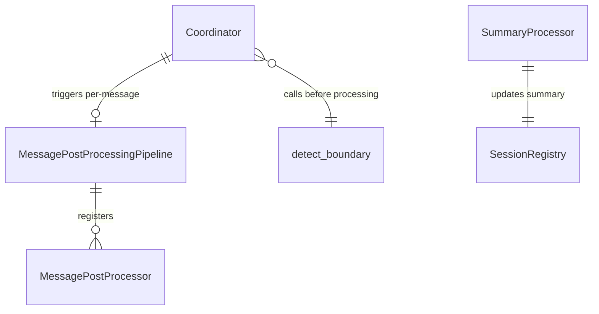

# Design: Conversation Boundary Detection

<!-- This design describes the current implementation approach. Updated through delta reconciliation. -->

**Feature Spec**: [../../feature-specs/agent/boundary-detection.md](../../feature-specs/agent/boundary-detection.md)
**Status**: Current

## Purpose

This document explains the design rationale for conversation boundary detection: the detection mechanism, session transition orchestration, per-message post-processing pipeline, and rolling summary maintenance.

## Problem Context

The system treats all messages as belonging to a single, long-running conversation. When the user changes topics, the old conversation's context bleeds into the new one — the SDK session carries prior history, and post-processing (memory extraction) doesn't run until full shutdown. This means: (a) the agent may reference stale context from a previous topic, (b) memory extraction is delayed until the process stops, and (c) there's no clean separation between distinct conversations for downstream analysis.

**Constraints:**
- Boundary detection must add no more than 1-2 seconds to message processing latency (R6)
- Detection must not interfere with or depend on the coordinator's active SDK session (R12)
- Failures must never block message processing — fail-open to continuation (R8)
- The rolling summary must stay concise regardless of conversation length (R13)
- On graceful shutdown, all background tasks must complete before exit (R14)

**Interactions:**
- Coordinator (`core-architecture`): `send_message()` gains boundary detection gating, per-message post-processing trigger, await-pending logic, and session ID clearing on topic shift
- Sessions (`sessions`): Session model gains a `summary` field; sessions can now close mid-conversation
- Post-processing pipeline (`post-processing-pipeline`): Pipeline infrastructure is reused for session-level post-processing during transitions (async, not just on shutdown)
- Memory extraction: Session post-processing is now triggered asynchronously on topic shift, not just on shutdown

## Design Overview

Three new mechanisms layer onto the existing coordinator:

```
┌──────────────────────────────────────────────────────────────────────┐
│                    Coordinator.send_message() flow                    │
│                                                                      │
│  ┌─────────────┐   ┌──────────────┐   ┌────────────┐   ┌─────────┐ │
│  │ Await       │──▶│ Boundary     │──▶│ Session    │──▶│ Process │ │
│  │ pending     │   │ detection    │   │ transition │   │ message │ │
│  │ post-proc   │   │ (Opus low)   │   │ (if shift) │   │ (SDK)   │ │
│  └─────────────┘   └──────────────┘   └────────────┘   └────┬────┘ │
│                                                              │      │
│                                        ┌─────────────────────┘      │
│                                        ▼                            │
│                              ┌──────────────────┐                   │
│                              │ Per-message       │                   │
│                              │ post-processing   │                   │
│                              │ (background task) │                   │
│                              └──────────────────┘                   │
└──────────────────────────────────────────────────────────────────────┘
```

1. **Boundary detection** — A standalone `query()` call using Opus with low effort that classifies whether a new message continues the current conversation or starts a new topic. Uses JSON schema output for reliable parsing. Runs before the coordinator processes the message.

2. **Session transition** — On topic shift, an orchestrated sequence closes the old session, fires async session post-processing, clears the SDK session ID (so the next message starts a fresh SDK session), stores the previous summary for injection into the new session's system prompt, and creates a new session.

3. **Per-message post-processing** — A separate pipeline (`MessagePostProcessingPipeline`) with its own processor interface that runs after each agent response. The summary processor generates/updates a rolling conversation summary using Opus with low effort, storing it on the session record for the next boundary check.

## Components

### Implementation Structure

| Layer/Component | Responsibility | Key Decisions |
|-----------------|----------------|---------------|
| `src/tachikoma/boundary/__init__.py` | Re-exports public API: `detect_boundary`, `BoundaryResult`, `SessionCandidate`, `SummaryProcessor` | New package for boundary detection |
| `src/tachikoma/boundary/detector.py` | `detect_boundary(message, summary, cwd, *, candidates=None, cli_path=None)` — standalone `query()` with Opus low effort, JSON schema output, returns `BoundaryResult(continues, resume_session_id)`. Uses defense-in-depth tool restriction: default permission mode, `allowed_tools=[]`, `max_turns=3` (DES-007 "Disabling Tools"). Accepts optional `candidates: list[SessionCandidate]` for session matching. `cwd` is passed from the coordinator's `self._cwd`. Fully consumes the query() generator (DES-005). Includes structured logging for results and warnings. Validates `resume_session_id` (sanitizes empty strings and non-string values to None). | Independent of coordinator; pure function + SDK call |
| `src/tachikoma/boundary/prompts.py` | Prompt templates for boundary detection (including session matching instructions) and summary generation. Includes `CANDIDATES_SECTION_TEMPLATE` for formatting candidate sessions into the user prompt. | Separated for easy iteration and testing |
| `src/tachikoma/boundary/summary.py` | `SummaryProcessor` — `MessagePostProcessor` that calls standalone `query()` with Opus low effort to update the rolling summary. Accepts `cli_path` parameter. Logs a warning on empty responses. Fully consumes the query() generator (DES-005). | Uses incremental pattern: previous summary + latest exchange → updated summary |
| `src/tachikoma/message_post_processing.py` | `MessagePostProcessor` ABC (`process(session, user_message, agent_response)`) and `MessagePostProcessingPipeline` class | Parallel to `post_processing.py` but with a different interface reflecting the per-message context |

### Cross-Layer Contracts

**Integration Points:**
- Coordinator ↔ `detect_boundary`: pure function call, accepts optional `candidates: list[SessionCandidate]`, returns `BoundaryResult`, catches all errors and defaults to `BoundaryResult(continues=True)` (continuation). Skipped when `cwd is None`.
- Coordinator ↔ `MessagePostProcessingPipeline`: `run(session, user_message, agent_response)`, launched as `asyncio.Task`, reference stored on coordinator
- `SummaryProcessor` ↔ `SessionRegistry`: calls `update_summary()` to persist the rolling summary

**Error contract:**
- Boundary detection errors: caught in coordinator, logged, default to continuation (fail-open per R8)
- Per-message pipeline errors: caught by `asyncio.gather(return_exceptions=True)` within the pipeline, logged
- Background session post-processing errors: caught in task wrapper, logged, no propagation

### Shared Logic

- **`MessagePostProcessor` ABC** (`message_post_processing.py`): shared interface for per-message processors. Separate from session-level `PostProcessor`.
- **`BoundaryResult` dataclass** (`boundary/detector.py`): shared between detector (produces) and coordinator (consumes). Contains `continues: bool` and `resume_session_id: str | None`.
- **`SessionCandidate`** (`boundary/detector.py`): lightweight `(id, summary)` pair passed to the detector. Avoids coupling the boundary package to the full `Session` dataclass.
- **`Session` dataclass** (`sessions/model.py`): extended with `summary` and `last_resumed_at` fields. Shared input to both pipelines and the boundary detector.
- **Prompt templates** (`boundary/prompts.py`): shared between summary processor and boundary detector. Centralized for easy iteration.

## Modeling

### New domain types

```
MessagePostProcessor (ABC)
└── process(session: Session, user_message: str, agent_response: str) → None

MessagePostProcessingPipeline
├── _processors: list[MessagePostProcessor]
├── _lock: asyncio.Lock  (serializes concurrent runs — defensive, since coordinator
│                          awaits the pending task before launching another, but
│                          protects against future callers or race conditions)
├── register(processor) → None
└── run(session: Session, user_message: str, agent_response: str) → None

SummaryProcessor (MessagePostProcessor)
├── _registry: SessionRegistry
├── _cwd: Path
├── _cli_path: str | None
└── process(session, user_message, agent_response) → None
    └── standalone query() with Opus low effort → update summary

BoundaryResult (frozen dataclass)
├── continues: bool                        (True = continuation, False = topic shift)
└── resume_session_id: str | None          (matched session ID, only when continues=False)

SessionCandidate (frozen dataclass)
├── id: str                                (session ID)
└── summary: str                           (session summary for LLM matching)

detect_boundary(message: str, summary: str, cwd: Path, *, candidates: list[SessionCandidate] | None = None, cli_path: str | None = None) → BoundaryResult
└── standalone query() with Opus low effort, JSON schema → BoundaryResult
```

The function returns a `BoundaryResult`, while the underlying query returns `{"continues_conversation": boolean, "resume_session_id": string | null}` JSON — the function parses and converts the structured output. When candidates are provided, the prompt includes their summaries for the LLM to match against.

### Component relationships



## Data Flow

### Normal message flow (continuation)

```
1. Channel calls coordinator.send_message(text)
2. Coordinator awaits any pending per-message task (S4)
   - If task pending: await it, log any errors
   - If no task: proceed immediately
3. Coordinator checks for active session; creates one if needed (existing behavior)
4. If active session exists AND session has a summary AND cwd is not None:
   a. Fetch recent closed session candidates via registry.get_recent_closed()
   b. Build SessionCandidate list from sessions (id + summary pairs)
   c. Call detect_boundary(text, session.summary, cwd, candidates=candidates)
   d. Standalone Opus low effort query returns {"continues_conversation": true, "resume_session_id": null}
   e. Proceed normally
5. Coordinator calls SDK client.query(text), streams response (existing behavior)
6. During streaming, coordinator accumulates response text:
   - Initialize response_chunks: list[str] = []
   - For each TextChunk event yielded, append event.text to response_chunks
   - Events are still yielded to the channel as before — accumulation is internal
7. After Result event triggers break from the message loop:
   a. Join accumulated chunks: response_text = "".join(response_chunks)
   b. Re-fetch active session from registry (it may have been updated by metadata)
   c. Launch per-message pipeline as background task (S3):
      asyncio.create_task(msg_pipeline.run(session, text, response_text))
   d. Store task reference on coordinator (S4)
   Note: The per-message pipeline launch happens inside the generator body,
   after the break but before the generator returns. The generator's execution
   frame holds the accumulated text and the active session reference.
8. Channel renders response (events were yielded during step 6)
```

### Topic shift flow (fresh session — no match)

```
1. Steps 1-3 same as above
4. detect_boundary returns BoundaryResult(continues=False, resume_session_id=None)
5. Coordinator calls _handle_transition(previous_session):
   a. Capture close timestamp, close session in registry (try/except, log errors)
   b. If session had sdk_session_id:
      - Fire session post-processing as background task
      - Prune completed tasks from list (avoid unbounded growth)
   c. No resume_session_id → fresh-session path:
      - Clear SDK session ID (self._sdk_session_id = None)
      - Persist previous summary as context entry to DB (owner="previous-summary", content=session.summary)
      - Create new session in registry (try/except, log errors)
   d. Return False (fresh session)
6. is_new_session = True, resume_id = None
7. Pre-processing runs, coordinator creates fresh ClaudeSDKClient (no resume)
8. Normal streaming + per-message post-processing trigger
```

### Topic shift flow (session resumption — match found)

```
1. Steps 1-3 same as normal message flow
4. detect_boundary returns BoundaryResult(continues=False, resume_session_id="abc123")
5. Coordinator calls _handle_transition(previous_session, resume_session_id="abc123"):
   a. Capture close timestamp, close session in registry
   b. Fire async session post-processing for closed session
   c. resume_session_id present → resume path:
      - Reopen matched session via registry.reopen_session()
      - If reopen succeeds: set _sdk_session_id to matched session's sdk_session_id,
        record resumption (best-effort), persist bridging context to DB via _persist_bridging_context(), return True
      - If reopen fails: fall through to fresh-session path, return False
6. is_new_session = False (resumed), resume_id = self._sdk_session_id
7. Pre-processing skipped (resumed SDK session has full prior context)
8. _build_options(resume=resume_id) appends bridging context to system prompt
9. ClaudeSDKClient created with resume=sdk_session_id, restoring full prior context
10. Normal streaming + per-message post-processing trigger
```

### System prompt composition on topic shift

```
1. During _handle_transition(), previous summary is persisted as a context
   entry to DB (owner="previous-summary", content=session.summary) on the
   new session — it is stored for the session's lifetime, not just the first message
2. Before _build_options(), coordinator loads all context entries from DB and
   calls build_system_prompt(entries) → system_prompt_append
3. build_system_prompt() assembles SYSTEM_PREAMBLE + all entries wrapped in XML tags,
   including <previous-summary>...</previous-summary>
4. _build_options(system_prompt_append=...) wraps in SystemPromptPreset(type="preset",
   preset="claude_code", append=system_prompt_append)
5. Return ClaudeAgentOptions with the composed system prompt
```

### System prompt composition on session resumption

```
1. During _handle_transition() resume path, bridging context is persisted
   as a context entry to DB (owner="bridging-context", content=concatenated
   summaries of intermediate sessions) via _persist_bridging_context()
2. Before _build_options(), coordinator loads all context entries from DB and
   calls build_system_prompt(entries) → system_prompt_append
3. build_system_prompt() assembles SYSTEM_PREAMBLE + all entries wrapped in XML tags,
   including <bridging-context>...</bridging-context>
4. _build_options(system_prompt_append=...) wraps in SystemPromptPreset(type="preset",
   preset="claude_code", append=system_prompt_append)
5. Return ClaudeAgentOptions with the composed system prompt
```

### Summary processor data flow

```
1. SummaryProcessor.process(session, user_message, agent_response) called
2. Read previous summary from session.summary (may be None for first exchange)
3. Build prompt:
   - System: "You are a conversation summarizer..."
   - User: previous summary + latest exchange + instructions
4. Call standalone query() with:
   - model="opus", effort="low", max_turns=3
   - system_prompt=SUMMARY_SYSTEM_PROMPT (plain string, not Claude Code preset)
   - No tools: allowed_tools=[], default permission mode (DES-007 "Disabling Tools")
   - cwd from constructor
5. Consume response, extract text from AssistantMessage
6. Call registry.update_summary(session.id, extracted_text)
7. Registry persists to DB via repository.update(session_id, summary=...),
   then re-fetches the session via repository.get_by_id() and replaces
   _active_session with the new frozen Session instance (same re-fetch
   pattern as update_metadata())
```

## Key Decisions

### Opus with low effort for boundary detection and summarization

**Choice**: Use `model="opus"` with `effort="low"` for both `detect_boundary` and `SummaryProcessor` standalone `query()` calls.
**Why**: Both tasks are simple (binary classification and short text summarization). Opus with low effort provides high classification quality while keeping latency within the 1-2 second budget (R6). The `model` and `effort` parameters on `ClaudeAgentOptions` are passed as `--model` and `--effort` to the CLI subprocess.
**Alternatives Considered**:
- Haiku (fastest, cheapest but lower quality for edge cases), Sonnet (good balance), Opus with low effort (best quality with controlled latency).

**Consequences**:
- Pro: Best classification quality for detecting topic shifts, especially ambiguous ones
- Pro: Both calls are independent — model choice doesn't affect the coordinator's main session
- Pro: Low effort keeps latency within budget for simple binary classification and short summarization
- Con: Higher per-token cost than Haiku, but the tasks use minimal tokens

### Incremental summarization over full-transcript fork

**Choice**: Summary processor receives previous summary + latest exchange via function arguments, not via SDK session fork.
**Why**: Constant-cost per invocation regardless of conversation length. No subprocess spawning for a text-only task. Research from progressive summarization literature shows incremental summaries are "reliable and usable" for topic tracking, with ~10% content drift (acceptable for boundary detection where topic identity, not factual precision, matters).
**Alternatives Considered**:
- Full-transcript fork via `fork_and_consume()` (costs grow linearly, spawns subprocess), hybrid periodic refresh (added complexity).

**Consequences**:
- Pro: O(1) cost per summarization call regardless of conversation length
- Pro: No subprocess spawning — uses lightweight standalone `query()`
- Con: Small accuracy drift over very long conversations (~10% content affected)
- Con: Cannot recover from a badly drifted summary without starting fresh

### JSON schema output for boundary detection

**Choice**: Use JSON schema `output_format` with `{"continues_conversation": boolean}` for the boundary detector.
**Why**: Eliminates parsing ambiguity entirely. The SDK passes `--json-schema` to the CLI, and the result is available in `ResultMessage.structured_output` as a parsed dict. Boolean field means no string matching or normalization needed.
**Alternatives Considered**:
- Plain text single word (fragile parsing), XML tags (unnecessary complexity).

**Consequences**:
- Pro: Zero parsing ambiguity — result is a Python dict with a boolean
- Pro: Schema validation happens at the SDK level
- Con: Requires the model to support structured output (Opus does)

### Separate `MessagePostProcessor` interface

**Choice**: New `MessagePostProcessor` ABC with `process(session, user_message, agent_response)` and `MessagePostProcessingPipeline`, separate from the existing `PostProcessor`/`PostProcessingPipeline`.
**Why**: Per-message processing is a fundamentally different concept from session-level processing. Session processors receive a closed session and fork it for analysis. Message processors receive the latest exchange inline and update session state. Different inputs, different lifecycle, different triggering semantics. A separate interface makes this distinction explicit.
**Alternatives Considered**:
- Extend existing `PostProcessor` ABC with extra parameters (changes signature for all existing processors), store exchange data on session model (pollutes session with transient data).

**Consequences**:
- Pro: Existing `PostProcessor` implementations untouched
- Pro: Clear semantic distinction between session-level and per-message processing
- Pro: Per-message pipeline can have its own error isolation and lifecycle
- Con: Two pipeline types to understand (but they serve clearly different purposes)

### Boundary detection in the coordinator (not a separate orchestrator)

**Choice**: Integrate boundary detection, transition logic, and per-message pipeline trigger directly into the coordinator's `send_message()`.
**Why**: The coordinator already owns session lifecycle (create, close, update metadata), per-message SDK client lifecycle, and post-processing triggering. Boundary detection is tightly coupled to these concerns — it reads session state, potentially closes/creates sessions, and clears the SDK session ID. A separate orchestrator would need access to all the coordinator's internals, creating tight coupling without clear separation.
**Alternatives Considered**:
- Separate `ConversationLifecycleManager` wrapping the coordinator (would need to reach into coordinator internals anyway).

**Consequences**:
- Pro: Related concerns stay together — session lifecycle, SDK lifecycle, boundary detection
- Pro: No new indirection layer
- Con: Coordinator grows in complexity (mitigated by extracting boundary detection and summary logic to a separate `boundary/` package)

### Session ID clearing for topic shift (replaces swap-on-success)

**Choice**: On topic shift, simply clear `_sdk_session_id` and store `_previous_summary`. The next `send_message()` call creates a fresh `ClaudeSDKClient` without `resume`, starting a clean SDK session.
**Why**: With the per-message client architecture, topic shifts no longer require client replacement. Clearing the session ID is sufficient — the next message's client will start fresh. This eliminates the swap-on-success complexity and the risk of holding two CLI subprocesses simultaneously.
**Alternatives Considered**:
- Swap-on-success (previous approach): required constructing and connecting a new client before disconnecting the old one, caused cancel scope leaks in anyio.

**Consequences**:
- Pro: Trivial implementation — just clear a field
- Pro: No risk of cancel scope leaks or dual-process overhead
- Pro: No failure modes to handle (clearing a field can't fail)

## System Behavior

### Scenario: Normal message (continuation)

**Given**: An active session with a summary from the previous exchange
**When**: A new message arrives on the same topic
**Then**: Pending per-message task is awaited, boundary detector classifies as continuation, message is processed normally by the existing SDK session, per-message pipeline is triggered as a background task to update the summary.

### Scenario: Topic shift detected (fresh session)

**Given**: An active session with a summary about "Python testing," no recent closed sessions match the new topic
**When**: A new message arrives about "What should I have for dinner?"
**Then**: Boundary detector classifies as topic shift with `resume_session_id=None`. Transition orchestrator: closes current session, fires async session post-processing (memory extraction), resets SDK client with summary of previous conversation in system prompt, creates new session, processes the message in the fresh context.

### Scenario: Topic shift matches a recent session (resumption)

**Given**: An active session about "dinner plans," a closed session from 2 hours ago about "Python testing" within the lookup window
**When**: The user sends "Let's get back to the Python tests"
**Then**: Boundary detector classifies as topic shift with `resume_session_id` pointing to the Python testing session. Coordinator closes the dinner session, fires its post-processing, reopens the Python testing session, records a resumption event, assembles bridging context (the dinner session summary), injects it into the system prompt. The next SDK call uses `resume=<python_session_sdk_id>`, restoring full Python testing conversation history. Pre-processing is skipped.

### Scenario: First message (no prior session)

**Given**: No active session exists (first message ever, or after startup)
**When**: A message arrives
**Then**: Boundary detection is skipped. A new session is created via the existing `create_session()` flow. Message processed normally.

### Scenario: Second message (no summary yet)

**Given**: An active session exists but has no summary (per-message pipeline hasn't completed yet after the first exchange)
**When**: The second message arrives
**Then**: Boundary detection is skipped (no summary to compare against). Message proceeds normally. After this exchange, the per-message pipeline produces a summary for future boundary checks.

### Scenario: Boundary detection fails (SDK error, timeout)

**Given**: An active session with a summary
**When**: The boundary detector's `query()` call fails
**Then**: Error is logged, message proceeds as continuation (fail-open). The coordinator catches the exception and defaults to `continues_conversation=True`.

### Scenario: Session transition completes

**Given**: A topic shift is detected and the transition sequence begins
**When**: The coordinator clears the SDK session ID and stores the previous summary
**Then**: The next `send_message()` call creates a fresh `ClaudeSDKClient` without `resume`, starting a clean SDK session. A new Tachikoma session is created in the registry. If the fresh client fails to connect, the error propagates as a recoverable error event.

### Scenario: Per-message post-processing still running when next message arrives

**Given**: The per-message pipeline (summary update) from the previous exchange is still running
**When**: A new message arrives
**Then**: The coordinator awaits the pending task before proceeding to boundary detection. If the task fails, the error is logged and boundary detection runs with whatever summary is available (possibly stale).

### Scenario: Multiple rapid topic shifts

**Given**: The user sends several messages that each trigger a topic shift
**When**: Background session post-processing tasks accumulate
**Then**: Each task runs independently. All tasks are tracked in the coordinator's `_background_tasks` list. Completed tasks are pruned from the list on each new topic shift. Failed tasks are logged but don't affect others. On shutdown, all remaining tasks are awaited.

### Scenario: Graceful shutdown with background tasks

**Given**: Background session post-processing tasks are running from previous topic shifts, and a per-message task is pending
**When**: The system shuts down gracefully
**Then**: The coordinator's `__aexit__` awaits the pending per-message task, runs shutdown pipeline for the current session, then awaits all background tasks via `asyncio.gather(return_exceptions=True)`. Errors are logged.

### Scenario: Per-message pipeline processor fails

**Given**: The summary processor encounters an error during its `query()` call
**When**: The per-message pipeline handles the failure
**Then**: The error is logged. The conversation continues uninterrupted. On the next exchange, the per-message pipeline runs again independently — no permanent failure state. The summary may be stale (from a prior successful run) or `None` (if it never succeeded), causing boundary detection to be skipped on the next message.

## Notes

- The `boundary/` package encapsulates all boundary detection logic (detector, summary processor, prompts), keeping the coordinator focused on orchestration. The `SummaryProcessor` lives in `boundary/summary.py` rather than alongside `message_post_processing.py` because it is cohesively tied to boundary detection — its output (the rolling summary) exists primarily to feed the boundary detector.
- Both Opus low effort calls (detection and summarization) use standalone `query()` — they never touch the coordinator's per-message `ClaudeSDKClient`. This satisfies R12 (independence from active session).
- Both `detect_boundary` and `SummaryProcessor` fully consume their `query()` generators (no early `return` or `break` inside `async for`). This follows DES-005 — preventing orphaned SDK resources from busy-looping the event loop.
- The `MessagePostProcessingPipeline` follows the same patterns as `PostProcessingPipeline` (parallel execution, error isolation via `asyncio.gather(return_exceptions=True)`, serialized execution) but with a different processor interface and no phased execution.
- Transition context (previous-summary, bridging-context) is persisted as DB context entries tied to the session. The coordinator no longer holds `_previous_summary` or `_bridging_context` in memory — the database is the canonical source. `build_system_prompt()` (in `context/assembly.py`) assembles the system prompt from all persisted entries including transition context.
- On a second (or subsequent) topic shift, only the *immediately previous* conversation's summary is injected — not a chain of all prior summaries. This is intentional: the summary serves as brief context to help the agent understand what just came before, not a complete history. Older conversations are preserved in memory extraction, not in the system prompt.
- The `fork_and_consume()` helper in `post_processing.py` is not used by the boundary detection or summary subsystem — those use direct `query()` calls without session forking.
