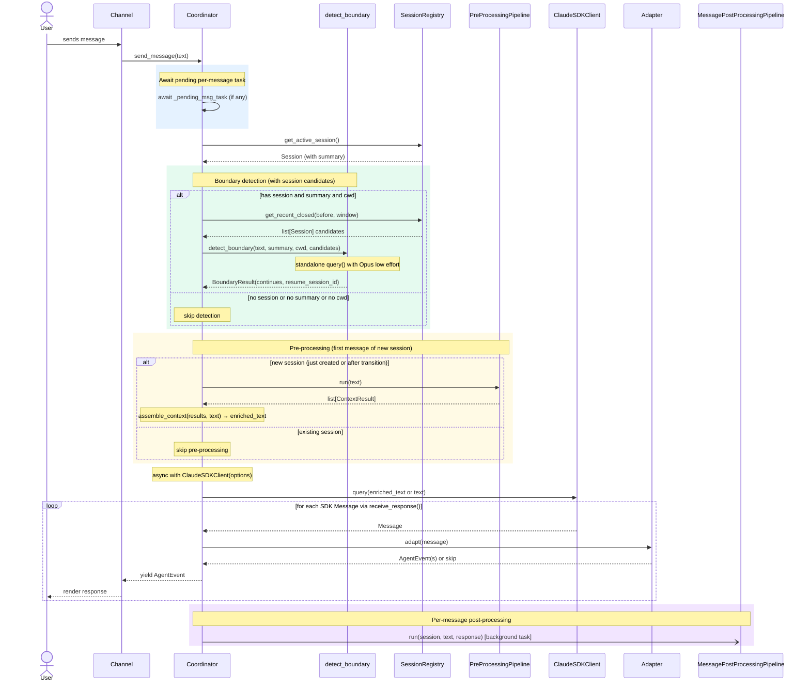
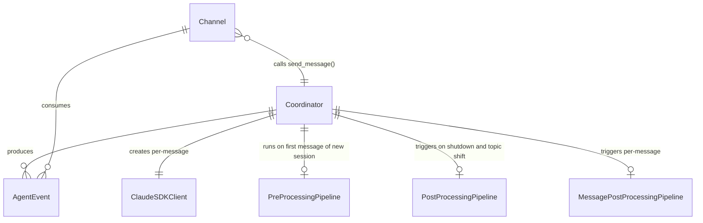

# Design: Core Architecture

<!-- This design describes the current implementation approach. Updated through delta reconciliation. -->

**Feature Spec**: [../feature-specs/agent/core-architecture.md](../../feature-specs/agent/core-architecture.md)
**Status**: Current

## Purpose

This document explains the design rationale for the core agent architecture: the modeling choices, data flow, system behavior, and architectural approach that every other feature builds on.

## Problem Context

Tachikoma needs a foundational agent architecture that wraps the Claude Agent SDK in a way that (a) provides a clean programmatic interface for channels to send messages and receive streamed responses, (b) keeps channels decoupled from SDK internals so the SDK can evolve independently, and (c) gives extension points where future features plug in pre-processing, post-processing, delegation, and idle task processing.

**Constraints:**
- The Claude Agent SDK (`claude-agent-sdk`) is async-first and spawns a Claude Code CLI process internally
- The SDK has two entry points: `query()` (stateless iterator) and `ClaudeSDKClient` (session-scoped client with `resume` for conversation continuity)
- This architecture implements pre-processing (context enrichment before the first session message) and post-processing (analysis after session close), with delegation as a future extension

**Interactions:**
- Channels (REPL, Telegram) call the coordinator's `send_message()` to interact with the agent
- Pre-processing pipeline runs registered context providers on first message of new session (see [pipeline design](pre-processing-pipeline.md)); memory context provider registers as the first provider (see [memory context retrieval](../memory/memory-context-retrieval.md))
- Post-processing pipeline runs registered processors after session close (see [pipeline design](post-processing-pipeline.md))
- Future features (delegation) will extend the coordinator's message flow

## Design Overview

Three-layer architecture with clear boundaries:

```
┌─────────────────────────────────────────────────────┐
│                    Channel Layer                     │
│  ┌─────────┐  ┌──────────┐                          │
│  │  REPL   │  │ Telegram │                          │
│  └────┬────┘  └────┬─────┘                          │
│       │             │                                │
│       ▼             ▼                                │
├─────────────────────────────────────────────────────┤
│                 Coordinator Layer                     │
│  ┌──────────────────────────────────────────┐        │
│  │  Coordinator                             │        │
│  │  send_message(text) → AsyncIterator      │        │
│  │  steer(text) → None                      │        │
│  │  [AgentEvent]                            │        │
│  └────┬─────────────────────────────────────┘        │
│       │                                              │
│       ▼                                              │
│  ┌──────────────────────────────────────────┐        │
│  │  Message Adapter                         │        │
│  │  SDK Message → AgentEvent                │        │
│  └──────────────────────────────────────────┘        │
├─────────────────────────────────────────────────────┤
│                    SDK Layer                          │
│  ┌──────────────────────────────────────────┐        │
│  │  ClaudeSDKClient                         │        │
│  │  (claude-agent-sdk)                      │        │
│  └──────────────────────────────────────────┘        │
└─────────────────────────────────────────────────────┘
```

The **Coordinator** is the programmatic entry point. Channels call `send_message()` and consume the resulting `AsyncIterator[AgentEvent]`. The coordinator creates a fresh `ClaudeSDKClient` per message exchange, using `resume=sdk_session_id` for conversation continuity. It transforms SDK messages into domain events via the message adapter. The `steer()` method allows mid-stream message injection for channels that support it (e.g., Telegram).

The **Message Adapter** is a pure transformation layer — it maps SDK `Message` objects into `AgentEvent` domain types, decoupling channels from SDK internals.

## Components

### Implementation Structure

| Layer/Component | Responsibility | Key Decisions |
|-----------------|----------------|---------------|
| `src/tachikoma/__main__.py` | Cyclopts CLI entry point: parses `--channel` flag, loads config via SettingsManager, applies CLI overrides at runtime, runs bootstrap hooks (workspace, logging, git, projects, skills, context, memory, session recovery, tasks, telegram), retrieves session objects, system_prompt, and task_repository from bootstrap extras, creates EventBus instance, reads `cli_path` from agent settings and threads it through all pipeline components, creates pre-processing pipeline (registers MemoryContextProvider, ProjectsContextProvider, and SkillsContextProvider), post-processing pipeline (registers memory processors and CoreContextProcessor in main phase per DES-004, ProjectsProcessor in pre_finalize phase, GitProcessor in finalize phase), and per-message pipeline (registers SummaryProcessor), creates task MCP tools server, wires up coordinator + channel dispatch (REPL or Telegram) with try/finally for engine disposal | Cyclopts for CLI parsing; SettingsManager with runtime-only overrides; SkillsContextProvider is self-contained (owns registry internally); channel dispatch based on `settings.channel`; enables `python -m tachikoma` |
| `src/tachikoma/coordinator.py` | Creates a per-message `ClaudeSDKClient`, manages session lifecycle via `resume`, exposes `send_message()`. Accepts `system_prompt`, `permission_mode`, `env`, `cli_path`, `mcp_servers`, and `session_resume_window` for SDK configuration, and an optional `on_status` callback for shutdown-phase notifications. Extracts detected agents and additional MCP servers from pre-processing pipeline results per-session (both are session-scoped, cleared on topic shift). Tracks `last_message_time` (updated on `send_message()` entry and response completion) for idle gating by external subsystems. Optionally integrates with `SessionRegistry` for persistent session tracking (see [sessions design](sessions.md)), `PreProcessingPipeline` for context enrichment on new sessions (see [pipeline design](pre-processing-pipeline.md)), `PostProcessingPipeline` for post-conversation analysis (see [pipeline design](post-processing-pipeline.md)), and `MessagePostProcessingPipeline` for per-message processing (see [boundary detection design](boundary-detection.md)). Extended with boundary detection gating (with session candidate fetching), per-message post-processing trigger, session transition orchestration (`_handle_transition` with resume branch), bridging context assembly (`_assemble_bridging_context`), and `_build_options()` for per-message option construction with both previous-summary and bridging-context injection. Stores base system prompt for recomposition on topic shift and resumption. Tracks `_sdk_session_id`, `_agents`, `_previous_summary`, `_bridging_context`, `_mcp_servers`, `_pending_msg_task`, and `_background_tasks` for lifecycle management. Extracts `mcp_servers` from pre-processing pipeline results per-session, merges with constructor-provided servers, and passes them to `ClaudeAgentOptions` via `_build_options()`. Clears `_agents` and `_mcp_servers` on session transition. | Async context manager pattern; creates fresh `ClaudeSDKClient` per `send_message()` call with `resume` for continuity; wraps system_prompt in SystemPromptPreset with append mode (see ADR-008); optional registry, pre_pipeline, pipeline, msg_pipeline, and on_status dependencies; `_agents` populated from pipeline results (not constructor), cleared on transition; passes `system_prompt`, `permission_mode`, `env`, `agents`, `mcp_servers`, and `cli_path` through to `ClaudeAgentOptions` |
| `src/tachikoma/events.py` | `AgentEvent` domain type hierarchy | Dataclasses; no SDK dependency |
| `src/tachikoma/adapter.py` | Transforms SDK messages to `AgentEvent`s | Pure function, stateless; only module that imports SDK message types |

### Cross-Layer Contracts

**Coordinator → Channel contract:**

Channels send a text message and receive an async stream of `AgentEvent`s. The stream ends naturally when the agent completes its response.



Note: `send_message()` is an async generator. The per-message pipeline launch happens inside the generator body, after the response stream completes but before the generator returns.

**Integration Points:**
- Coordinator ↔ SDK: per-message `async with ClaudeSDKClient(options)`, `query()` to send messages, iterate `receive_response()` for response stream (stops at `ResultMessage`). Uses `resume=sdk_session_id` for conversation continuity across messages
- Coordinator ↔ Adapter: pure function call `adapt(sdk_message) -> list[AgentEvent]` (returns empty list for filtered messages)
- Channel ↔ Coordinator: async iterator protocol
- Coordinator ↔ SessionRegistry (optional): `create_session()` on first message, `update_metadata()` on Result events, `close_session()` on shutdown and on topic shift (see [sessions design](sessions.md))
- Coordinator ↔ PreProcessingPipeline (optional): `pipeline.run(message)` in `send_message()`, on first message of new session (including after topic shift transition), before `client.query()` (see [pipeline design](pre-processing-pipeline.md))
- Coordinator ↔ PostProcessingPipeline (optional): `pipeline.run(session)` in `__aexit__` (after session close) and as background task during topic shift transitions. Note: `on_status` callback is NOT called for transition-triggered post-processing — only on shutdown (see [pipeline design](post-processing-pipeline.md))
- Coordinator ↔ `detect_boundary` (from `boundary` package): pure function call before processing, accepts optional `candidates: list[SessionCandidate]`, returns `BoundaryResult(continues, resume_session_id)`, errors caught and defaulted to `BoundaryResult(continues=True)` (continuation). Skipped when no session, no summary, or no cwd (see [boundary detection design](boundary-detection.md))
- Coordinator ↔ `MessagePostProcessingPipeline` (optional): `run(session, text, response_text)` as background `asyncio.Task` after each response, reference stored as `_pending_msg_task` (see [boundary detection design](boundary-detection.md))
- Coordinator ↔ MCP servers (optional): `mcp_servers` parameter passed to `ClaudeAgentOptions.mcp_servers` in `_build_options()` — used by task subsystem for task CRUD tools
- Coordinator ↔ Task subsystem: `last_message_time` property read by session task scheduler for idle gating
- `__main__.py` ↔ EventBus: created in `__main__.py`, passed to channels and task async loops; `bus.stop()` called on shutdown

### Shared Logic

- **AgentEvent types** (`events.py`): Shared between coordinator (produces) and channels (consume). No other shared logic — each layer has clear boundaries.

## Modeling

The domain model is intentionally minimal:



### AgentEvent hierarchy

```
AgentEvent (base)
├── TextChunk       — a piece of streamed text content
├── ToolActivity    — agent used a tool (name + input + result)
├── Result          — response complete (session, cost, usage metadata)
├── Status          — transient coordinator status update (e.g. "Thinking...")
└── Error           — error occurred (message, recoverable flag)
```

- **TextChunk**: `text: str` — one fragment of the agent's response
- **ToolActivity**: `tool_name: str`, `tool_input: dict`, `result: str` — a tool invocation by the agent
- **Result**: `session_id: str | None`, `total_cost_usd: float | None`, `usage: dict | None` — signals response completion with observability metadata
- **Status**: `message: str` — a transient status update from the coordinator, yielded before boundary detection and pre-processing to inform channels of pending work
- **Error**: `message: str`, `recoverable: bool` — something went wrong; recoverable errors let the conversation continue, non-recoverable errors signal exit

### SDK Message → AgentEvent mapping

| SDK Type | Content/Field | AgentEvent | Notes |
|----------|--------------|------------|-------|
| `AssistantMessage` | `TextBlock` in `.content` | `TextChunk` | Extract text from each text block |
| `AssistantMessage` | `ToolUseBlock` in `.content` | `ToolActivity` | Extract tool name and input parameters |
| `AssistantMessage` | `.error` field set | `Error` | Auth/billing → non-recoverable; others → recoverable |
| `ResultMessage` | `is_error=False` | `Result` | Extract session_id, cost, usage |
| `ResultMessage` | `is_error=True` | `Error` | Non-recoverable |
| `UserMessage` | — | (filtered) | Tool results echoed back by SDK |
| `SystemMessage` | — | (filtered) | Session metadata |

### Coordinator state and methods

```
Coordinator
├── _sdk_session_id: str | None           (SDK session ID for resume)
├── _agents: dict[str, AgentDefinition] | None  (session-scoped: populated from pipeline results, cleared on transition)
├── _previous_summary: str | None         (summary from last session, injected on topic shift)
├── _bridging_context: str | None         (summaries of intermediate sessions, injected on resumption)
├── _session_resume_window: int           (lookup window in seconds for resume candidates)
├── _mcp_servers: dict[str, McpServerConfig]  (MCP servers extracted from pre-processing, per-session)
├── _client: ClaudeSDKClient | None       (set only during send_message, None between messages)
├── _mcp_servers: dict[str, McpSdkServerConfig] | None  (MCP servers for SDK options)
├── _last_message_time: datetime | None      (timestamp of last exchange, for idle gating)
├── _pending_steers: int = 0              (count of steered messages)
├── _pending_msg_task: asyncio.Task | None  (background per-message post-processing)
├── _background_tasks: list[asyncio.Task]   (session post-processing from topic shifts)
├── _build_options(resume=...) → ClaudeAgentOptions  (constructs per-message options; includes mcp_servers and agents if set)
├── _handle_transition(session, *, resume_session_id=None) → bool  (True=resumed, False=fresh)
├── _assemble_bridging_context(resumed_session, closed_at) → None  (sets _bridging_context)
├── send_message(text) → AsyncIterator[AgentEvent]
│   └── creates fresh ClaudeSDKClient, handles steered messages via sequential receive_response() calls
└── steer(text) → None
    └── increments _pending_steers, calls client.query()
```

The `steer()` method allows channels to inject user messages mid-stream. When a steered message is queued, `send_message()` issues additional `receive_response()` calls after the initial response completes, yielding events for each steered message through the same async iterator.

## Data Flow

### Normal message flow

```
1. Channel receives user input
2. Channel calls coordinator.send_message(text)
3. Coordinator awaits any pending per-message task (logs errors, doesn't propagate)
4. Coordinator checks for active session; creates one via registry if needed — sets is_new_session flag
5. If boundary detection or pre-processing will run, yield Status("Thinking...")
6. If active session has a summary AND cwd is not None:
   a. Fetch recent closed session candidates via registry.get_recent_closed()
      (fail-open: if query fails, candidates=None)
   b. Build SessionCandidate list from sessions
   c. Call detect_boundary(text, session.summary, cwd, candidates=candidates, cli_path=cli_path)
      → returns BoundaryResult(continues, resume_session_id)
7. If topic shift → run _handle_transition(active, resume_session_id=result.resume_session_id)
   → returns bool (True=resumed, False=fresh); set is_new_session = not resumed;
   re-fetch active session
8. If continuation or detection error → proceed normally
9. If new session and pre_pipeline is set: pre-processing pipeline runs context
   providers in parallel; successful results assembled into XML-tagged blocks and prepended to message;
   coordinator extracts and merges mcp_servers and agent definitions from all results, stores per-session
10. Coordinator builds ClaudeAgentOptions via _build_options(resume=sdk_session_id or None) — includes self._agents and self._mcp_servers
11. Creates fresh ClaudeSDKClient via `async with ClaudeSDKClient(options)`
12. Calls client.query(text) (enriched or original)
13. Coordinator iterates client.receive_response(), accumulating response text
14. For each SDK Message, adapter maps to AgentEvent(s) or filters out
15. Coordinator yields AgentEvent(s)
16. TextChunk events are also accumulated for per-message post-processing
17. On Result event, sdk_session_id stored on coordinator, session metadata updated
18. Client context exits (disposed)
19. Re-fetch active session, launch per-message pipeline as background task
20. Stream ends
```

**Streaming granularity:** The SDK's `receive_response()` yields complete `Message` objects and stops at `ResultMessage`. Text appears in message-level chunks rather than token-by-token. This is simpler (adapter handles complete, well-typed objects) and still responsive since messages arrive as the agent produces them. The `AgentEvent` contract with channels remains unchanged if finer granularity is needed later.

### Steering flow

```
1. Channel A calls coordinator.send_message("msg_A")
2. send_message() creates ClaudeSDKClient, calls client.query("msg_A"), iterates receive_response()
3. Events for msg_A stream back, channel renders them
4. Channel B calls coordinator.steer("msg_B") (e.g., Telegram message during active response)
5. steer() increments _pending_steers to 1, calls client.query("msg_B")
6. CLI queues msg_B internally
7. msg_A completes → receive_response() yields ResultMessage for msg_A, iteration ends
8. send_message() checks _pending_steers > 0 → decrements, calls receive_response() again
9. CLI processes msg_B → receive_response() yields messages for msg_B
10. Events for msg_B stream back through the same send_message() iteration
11. msg_B completes → Result, _pending_steers == 0 → client context exits
```

The `Result` event serves as a turn boundary. Channels can detect it to reset their rendering state between steered messages. Each pending steer gets its own sequential `receive_response()` call, which picks up the CLI's queued response.

### Startup flow

```
1. cyclopts App parses CLI args (--channel flag)
2. Creates SettingsManager (loads configuration, see configuration/config-system design)
3. Applies CLI overrides via update_root() + reload() (runtime-only, no file write)
4. Creates Bootstrap, registers hooks: workspace, logging, git, projects, skills, context, memory, session recovery, tasks, telegram
5. Runs bootstrap — hooks execute in registration order (workspace creation, logging configuration, git init, projects dir creation + submodule sync, skills directory creation, core context init, memory directory creation, session DB init + crash recovery, task DB init + crash recovery, telegram validation)
6. If bootstrap fails → catch BootstrapError, log + print to stderr, exit (if logging hook itself failed, log may not reach file)
7. Reads final settings from SettingsManager
8. Retrieves session repository, registry, system_prompt, and task_repository from bootstrap extras
8a. Creates EventBus instance
9. Creates SkillsContextProvider(cwd=workspace_path, cli_path=cli_path) — provider creates SkillRegistry internally (no direct registry creation in startup)
10. Creates PostProcessingPipeline, registers memory processors (episodic, facts, preferences) and CoreContextProcessor in main phase, registers ProjectsProcessor in pre_finalize phase, registers GitProcessor in finalize phase — all with workspace_path
11. Creates PreProcessingPipeline, registers MemoryContextProvider(cwd=workspace_path), ProjectsContextProvider(workspace_path=workspace_path), and SkillsContextProvider
12. Creates MessagePostProcessingPipeline, registers SummaryProcessor with registry and workspace_path
12a. Creates task MCP tools server via `create_task_tools_server(task_repository)`
13. Creates Coordinator with allowed_tools, model, cwd=workspace_path, session_registry, system_prompt, pipeline, pre_pipeline, msg_pipeline, session_resume_window=settings.agent.session_resume_window, permission_mode="bypassPermissions", env={"CLAUDE_CODE_DISABLE_AUTO_MEMORY": "1"}, on_status callback (for channel display), cli_path, mcp_servers={"task-tools": task_tools_server}
14. Enters coordinator async context (no SDK client connection — clients are created per-message)
15. If any SDK error occurs during the first message → catch, log + print to stderr, exit
15a. Starts task async loops as `asyncio.Task`s: instance_generator, session_task_scheduler, background_task_runner — all receiving bus, coordinator, task_repository, and task settings
16. Dispatches based on settings.channel:
    ├─ "repl" → Repl(coordinator, history_path=..., bus=bus)
    └─ "telegram" → TelegramChannel(coordinator, settings.telegram, bus=bus)
17. Channel enters its main loop (channels subscribe to event bus at construction)
18. finally: cancels task async loops, awaits them, calls bus.stop(), disposes task and session repository engines (always runs, even on error)
```

### Shutdown flow

```
1. Channel signals exit (user action or non-recoverable error)
2. Coordinator __aexit__ awaits any pending per-message task (logs errors, doesn't propagate)
3. Captures active session (if any), then closes it via registry (errors logged, not propagated)
4. If captured session has a valid SDK session ID and a pipeline is registered, coordinator calls on_status callback then triggers post-processing pipeline (errors in both callback and pipeline logged, not propagated)
5. Awaits all background session post-processing tasks from previous topic shifts via asyncio.gather(return_exceptions=True), logs errors
6. No SDK disconnect step — per-message clients are already disposed after each exchange
7. finally block:
   a. Cancel task async loops (instance generator, session task scheduler, background task runner)
   b. Await cancelled tasks (background runner cancels running executions, which mark instances as failed)
   c. Call bus.stop() to shut down the event bus
   d. Dispose task repository engine
   e. Dispose session repository engine
8. asyncio.run() completes
```

## Key Decisions

### Per-message ClaudeSDKClient with resume

**Choice**: Create a fresh `ClaudeSDKClient` per `send_message()` call, using `resume=sdk_session_id` for conversation continuity
**Why**: Eliminates anyio cancel scope leaks that occurred during mid-lifecycle client swaps on topic shifts. Uses the SDK's recommended `receive_response()` pattern (stops at `ResultMessage`) instead of manual iteration over `receive_messages()`. Topic shifts become trivial: just clear the session ID — no client replacement needed. The `interrupt()` method is still available during the per-message client's lifetime.
**Alternatives Considered**:
- Persistent `ClaudeSDKClient` with swap-on-success for topic shifts: caused cancel scope leaks during client replacement, required holding two CLI subprocesses during swap
- `query()` stateless iterator: lacks `interrupt()` and `steer()` support mid-stream

**Consequences**:
- Pro: No cancel scope leaks — each client has a clean lifecycle
- Pro: Topic shifts are trivial (clear session ID, no client replacement)
- Pro: `receive_response()` aligns with SDK docs recommendation
- Pro: `interrupt()` available during each message exchange
- Con: Client connect/disconnect overhead per message (minimal in practice)

### Own domain types (AgentEvent)

**Choice**: Define `AgentEvent` type hierarchy instead of passing SDK messages to channels
**Why**: Channels should not depend on SDK internals. The SDK `Message` types expose implementation details (content blocks, tool use structures, error fields) that channels don't need. Named `AgentEvent` (not `StreamEvent`) to avoid collision with the SDK's own `StreamEvent` type.
**Alternatives Considered**:
- Pass-through SDK messages: Simple but couples channels to SDK
- Thin wrapper re-exporting SDK types: Middle ground but still coupled

**Consequences**:
- Pro: Channels have zero SDK dependency
- Pro: SDK changes isolated to adapter module
- Con: Additional mapping layer (small, pure function)

### Restricted tool set via allowed_tools

**Choice**: Use `allowed_tools=["Read", "Glob", "Grep"]` to constrain which tools the agent can use
**Why**: The `allowed_tools` list limits tool visibility — the agent can only use tools in this list. Combined with `permission_mode="bypassPermissions"`, the agent uses these tools without any prompts and cannot access tools outside this list. The tool list is configured via the configuration system (`agent.allowed_tools`) with these values as defaults.

**Consequences**:
- Pro: Agent's tool access is scoped to a controlled set
- Pro: Tool list is configurable without code changes

### SDK cwd for workspace directory (not os.chdir)

**Choice**: Pass `workspace_path` to Coordinator, forwarded as `cwd` in `ClaudeAgentOptions`
**Why**: `os.chdir()` is a global side effect affecting the entire process. The SDK's `ClaudeAgentOptions.cwd` sets the agent's working directory without affecting the host process.
**Alternatives Considered**:
- `os.chdir()` after bootstrap: Global side effect, affects entire process

**Consequences**:
- Pro: No global side effects
- Pro: SDK natively supports it
- Pro: Coordinator explicitly declares its working directory
- Con: Requires cwd parameter on Coordinator constructor

### Bypass permissions for the main session

**Choice**: Set `permission_mode="bypassPermissions"` on the main coordinator session
**Why**: Tachikoma is a personal assistant that needs full tool access to be useful — reading/writing files, running commands, etc. The default permission mode would prompt the user for each tool invocation, which defeats the purpose of an autonomous assistant.

**Consequences**:
- Pro: Agent can use all tools without user prompts
- Pro: Matches the UX expectation of a personal assistant
- Con: User must trust the system prompt and agent behavior

### Auto-memory disabled via environment variable

**Choice**: Pass `CLAUDE_CODE_DISABLE_AUTO_MEMORY=1` through `ClaudeAgentOptions.env`
**Why**: Claude Code has a built-in auto-memory feature that writes to `~/.claude/projects/<project>/memory/`. This conflicts with Tachikoma's own memory system (context files + post-processing extraction). The env var is the official mechanism (available since Claude Code v2.1.59) passed to the CLI subprocess.
**Alternatives Considered**:
- CLAUDE.md instruction to not use memory: Unreliable, prompt-level control
- No action: Would cause duplicate/conflicting memory systems

**Consequences**:
- Pro: Single memory system, no conflicts
- Pro: Official SDK mechanism, clean implementation
- Con: Depends on env var contract with Claude Code CLI

### cli_path configuration for native Claude binary

**Choice**: Add `AgentSettings.cli_path: str | None = None` to config, threaded through all `ClaudeAgentOptions` constructors (coordinator, memory context provider, boundary detector, summary processor, all post-processors, `fork_and_consume`)
**Why**: Allows using a native Claude binary instead of the SDK-bundled one. Useful for development and debugging. The `cli_path` parameter on `ClaudeAgentOptions` is passed as the path to the CLI subprocess.

**Consequences**:
- Pro: Development flexibility — can point to a local build
- Pro: Consistent configuration — single setting propagates everywhere
- Con: Must be threaded through all components that create `ClaudeAgentOptions`

### Message-level streaming via receive_response()

**Choice**: Use `receive_response()` for message-level streaming rather than `receive_messages()` or token-level streaming
**Why**: `receive_response()` yields complete `Message` objects and stops at `ResultMessage`, per SDK docs recommendation. This avoids the need for manual `break` in async iterators (which can leave SDK resources in an inconsistent state — see DES-005). Complete `Message` objects are simpler to adapt than token-by-token streaming.

**Consequences**:
- Pro: Simpler adapter — handles complete, well-typed Message objects
- Pro: Clean iterator lifecycle — `receive_response()` terminates naturally at `ResultMessage`
- Con: Text appears in message-level chunks rather than character-by-character
- Note: Can upgrade to token-level streaming later without changing the `AgentEvent` contract

## System Behavior

### Scenario: Normal conversation turn

**Given**: The coordinator is connected
**When**: A channel sends a message via `send_message()`
**Then**: The SDK processes the message and the response streams back as `AgentEvent`s. `TextChunk`s carry response text, `ToolActivity` shows tool use, and `Result` signals completion.

### Scenario: Multi-turn conversation

**Given**: One or more messages have already been sent in the current session
**When**: A follow-up message is sent
**Then**: The coordinator creates a fresh `ClaudeSDKClient` with `resume=sdk_session_id`, restoring conversation context. The agent can reference prior messages.

### Scenario: In-stream error (rate limit, server error)

**Given**: The agent is streaming a response
**When**: The SDK yields an `AssistantMessage` with `.error` set to a transient error type
**Then**: The adapter produces an `Error` event with `recoverable=True`. The channel shows the error and continues.

### Scenario: Non-recoverable error (auth failure, billing)

**Given**: The agent is streaming a response
**When**: The SDK yields an error indicating authentication failure or billing issue
**Then**: The adapter produces an `Error` event with `recoverable=False`. The channel exits.

### Scenario: Transient connection error mid-stream

**Given**: The agent is streaming a response
**When**: The API connection drops or the CLI process crashes
**Then**: The coordinator catches `CLIConnectionError` or `ProcessError` and yields an `Error` event with `recoverable=True`. The conversation remains usable.

### Scenario: Authentication failure on startup

**Given**: No valid authentication is available
**When**: The coordinator attempts to connect the SDK client
**Then**: The SDK raises an exception. The entry point catches it, prints the error to stderr, and exits.

## Notes

- The Claude Agent SDK wraps the Claude Code CLI binary internally — the Python package bundles the CLI (unless overridden via `cli_path`)
- The `AgentEvent` type hierarchy is designed to be extensible — future features can add new event types without modifying existing channels
- The adapter pattern used here (SDK types → domain types) may become a project-wide pattern if repeated in future features that integrate external services
- `ClaudeSDKClient.query()` returns `None` — messages are retrieved via `receive_response()` which yields `AsyncIterator[Message]` and stops at `ResultMessage` (per SDK docs, preferred over `receive_messages()` which requires manual `break`)
- The `Message` union type includes `StreamEvent` alongside the main message types — the adapter filters it along with other non-relevant types
- The `on_status` callback is a lightweight injection point for channels to display post-processing progress. The coordinator has no knowledge of rendering — the callback keeps rendering concerns in the channel layer.
- Logging configuration suppresses noisy third-party loggers (`sqlalchemy.engine`, `aiosqlite`, `aiogram`, `markdown_it`, `claude_agent_sdk`) to WARNING level. Per-session log rotation renames the previous session's log file on startup. `logger.remove()` is called at the start of `main()` to prevent console leaks before the logging bootstrap hook runs.
