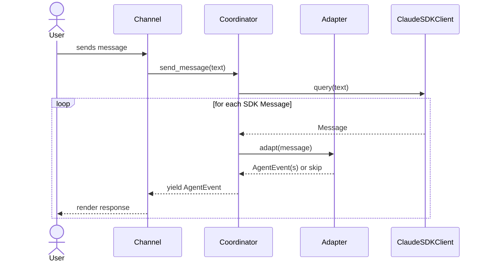
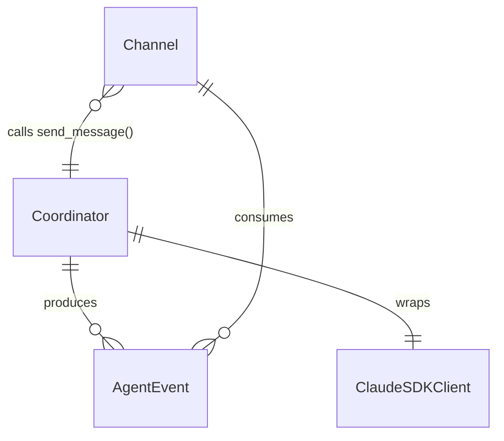

# Design: Core Architecture

<!-- This design describes the current implementation approach. Updated through delta reconciliation. -->

**Feature Spec**: [../feature-specs/agent/core-architecture.md](../../feature-specs/agent/core-architecture.md)
**Status**: Current

## Purpose

This document explains the design rationale for the core agent architecture: the modeling choices, data flow, system behavior, and architectural approach that every other feature builds on.

## Problem Context

Tachikoma needs a foundational agent architecture that wraps the Claude Agent SDK in a way that (a) provides a clean programmatic interface for channels to send messages and receive streamed responses, (b) keeps channels decoupled from SDK internals so the SDK can evolve independently, and (c) gives extension points where future features plug in pre-processing, post-processing, delegation, and idle task processing.

**Constraints:**
- The Claude Agent SDK (`claude-agent-sdk`) is async-first and spawns a Claude Code CLI process internally
- The SDK has two entry points: `query()` (stateless iterator) and `ClaudeSDKClient` (persistent session)
- This architecture deliberately avoids implementing pre/post processing or delegation — just the core loop

**Interactions:**
- Channels (REPL, Telegram) call the coordinator's `send_message()` to interact with the agent
- Future features (delegation, pre-processing, post-processing) will extend the coordinator's message flow

## Design Overview

Three-layer architecture with clear boundaries:

```
┌─────────────────────────────────────────────────────┐
│                    Channel Layer                     │
│  ┌─────────┐  ┌──────────┐                          │
│  │  REPL   │  │ Telegram │ (future)                  │
│  └────┬────┘  └────┬─────┘                          │
│       │             │                                │
│       ▼             ▼                                │
├─────────────────────────────────────────────────────┤
│                 Coordinator Layer                     │
│  ┌──────────────────────────────────────────┐        │
│  │  Coordinator                             │        │
│  │  send_message(text) → AsyncIterator      │        │
│  │  [AgentEvent]                            │        │
│  └────┬─────────────────────────────────────┘        │
│       │                                              │
│       ▼                                              │
│  ┌──────────────────────────────────────────┐        │
│  │  Message Adapter                         │        │
│  │  SDK Message → AgentEvent                │        │
│  └──────────────────────────────────────────┘        │
├─────────────────────────────────────────────────────┤
│                    SDK Layer                          │
│  ┌──────────────────────────────────────────┐        │
│  │  ClaudeSDKClient                         │        │
│  │  (claude-agent-sdk)                      │        │
│  └──────────────────────────────────────────┘        │
└─────────────────────────────────────────────────────┘
```

The **Coordinator** is the programmatic entry point. Channels call `send_message()` and consume the resulting `AsyncIterator[AgentEvent]`. The coordinator manages the SDK client lifecycle and transforms SDK messages into domain events via the message adapter.

The **Message Adapter** is a pure transformation layer — it maps SDK `Message` objects into `AgentEvent` domain types, decoupling channels from SDK internals.

## Components

### Implementation Structure

| Layer/Component | Responsibility | Key Decisions |
|-----------------|----------------|---------------|
| `src/tachikoma/__main__.py` | CLI entry point: loads config, wires up coordinator + channel, runs `asyncio.run(main())` | Minimal — loads config, wires up coordinator + channel; enables `python -m tachikoma` |
| `src/tachikoma/coordinator.py` | Wraps `ClaudeSDKClient`, manages session lifecycle, exposes `send_message()` | Async context manager pattern; owns SDK client instance |
| `src/tachikoma/events.py` | `AgentEvent` domain type hierarchy | Dataclasses; no SDK dependency |
| `src/tachikoma/adapter.py` | Transforms SDK messages to `AgentEvent`s | Pure function, stateless; only module that imports SDK message types |

### Cross-Layer Contracts

**Coordinator → Channel contract:**

Channels send a text message and receive an async stream of `AgentEvent`s. The stream ends naturally when the agent completes its response.



**Integration Points:**
- Coordinator ↔ SDK: async context manager lifecycle (`connect`/`disconnect`), `query()` to send messages, iterate `receive_messages()` for response stream
- Coordinator ↔ Adapter: pure function call `adapt(sdk_message) -> list[AgentEvent]` (returns empty list for filtered messages)
- Channel ↔ Coordinator: async iterator protocol

### Shared Logic

- **AgentEvent types** (`events.py`): Shared between coordinator (produces) and channels (consume). No other shared logic — each layer has clear boundaries.

## Modeling

The domain model is intentionally minimal:



### AgentEvent hierarchy

```
AgentEvent (base)
├── TextChunk       — a piece of streamed text content
├── ToolActivity    — agent used a tool (name + input + result)
├── Result          — response complete (session, cost, usage metadata)
└── Error           — error occurred (message, recoverable flag)
```

- **TextChunk**: `text: str` — one fragment of the agent's response
- **ToolActivity**: `tool_name: str`, `tool_input: dict`, `result: str` — a tool invocation by the agent
- **Result**: `session_id: str | None`, `total_cost_usd: float | None`, `usage: dict | None` — signals response completion with observability metadata
- **Error**: `message: str`, `recoverable: bool` — something went wrong; recoverable errors let the conversation continue, non-recoverable errors signal exit

### SDK Message → AgentEvent mapping

| SDK Type | Content/Field | AgentEvent | Notes |
|----------|--------------|------------|-------|
| `AssistantMessage` | `TextBlock` in `.content` | `TextChunk` | Extract text from each text block |
| `AssistantMessage` | `ToolUseBlock` in `.content` | `ToolActivity` | Extract tool name and input parameters |
| `AssistantMessage` | `.error` field set | `Error` | Auth/billing → non-recoverable; others → recoverable |
| `ResultMessage` | `is_error=False` | `Result` | Extract session_id, cost, usage |
| `ResultMessage` | `is_error=True` | `Error` | Non-recoverable |
| `UserMessage` | — | (filtered) | Tool results echoed back by SDK |
| `SystemMessage` | — | (filtered) | Session metadata |

## Data Flow

### Normal message flow

```
1. Channel receives user input
2. Channel calls coordinator.send_message(text)
3. Coordinator calls SDK client.query(text)
4. Coordinator iterates SDK client.receive_messages()
5. For each SDK Message:
   a. Adapter maps to AgentEvent(s) or filters out
   b. Coordinator yields AgentEvent(s)
6. Channel renders each AgentEvent
7. On Result event, stream ends
```

**Streaming granularity:** The SDK's `receive_messages()` yields complete `Message` objects. Text appears in message-level chunks rather than token-by-token. This is simpler (adapter handles complete, well-typed objects) and still responsive since messages arrive as the agent produces them. The `AgentEvent` contract with channels remains unchanged if finer granularity is needed later.

### Startup flow

```
1. __main__.py runs asyncio.run(main())
2. Loads configuration via load_settings() (see configuration/config-system design)
3. Ensures workspace directory exists (path from config)
4. Creates Coordinator with allowed_tools and model from config
5. Enters coordinator async context (connects SDK client)
6. If connection fails → catch SDK error, print to stderr, exit
7. Creates channel (REPL) with coordinator reference and history path from config
8. Channel enters its main loop
```

### Shutdown flow

```
1. Channel signals exit (user action or non-recoverable error)
2. Coordinator async context exits (disconnects SDK client)
3. SDK client disconnects, CLI process terminates
4. asyncio.run() completes
```

## Key Decisions

### ClaudeSDKClient over query()

**Choice**: Use `ClaudeSDKClient` as the SDK interface, not `query()`
**Why**: `ClaudeSDKClient` provides native multi-turn conversation (session state managed internally), `interrupt()` for Ctrl+C mid-stream, and lifecycle management (`connect`/`disconnect`). The `query()` function would require manual session ID tracking and lacks interrupt support.
**Alternatives Considered**:
- `query()` with `resume=session_id`: Simpler but no interrupt, manual session tracking

**Consequences**:
- Pro: Native multi-turn, interrupt support, clean lifecycle
- Pro: Future channels benefit from same session management
- Con: Tighter coupling to SDK client API shape

### Own domain types (AgentEvent)

**Choice**: Define `AgentEvent` type hierarchy instead of passing SDK messages to channels
**Why**: Channels should not depend on SDK internals. The SDK `Message` types expose implementation details (content blocks, tool use structures, error fields) that channels don't need. Named `AgentEvent` (not `StreamEvent`) to avoid collision with the SDK's own `StreamEvent` type.
**Alternatives Considered**:
- Pass-through SDK messages: Simple but couples channels to SDK
- Thin wrapper re-exporting SDK types: Middle ground but still coupled

**Consequences**:
- Pro: Channels have zero SDK dependency
- Pro: SDK changes isolated to adapter module
- Con: Additional mapping layer (small, pure function)

### Restricted tool set via allowed_tools

**Choice**: Use `allowed_tools=["Read", "Glob", "Grep"]` to pre-approve read-only file tools
**Why**: The agent is a conversationalist with basic file access. These tools work without prompting; any unlisted tools fall through to the default permission mode. The tool list is configured via the configuration system (`agent.allowed_tools`) with these values as defaults.

**Consequences**:
- Pro: Read-only tools work without interruption
- Pro: User prompted for anything beyond read access
- Pro: Tool list is configurable without code changes

### Message-level streaming

**Choice**: Use `receive_messages()` for message-level streaming rather than token-level streaming
**Why**: Complete `Message` objects are simpler to adapt. True token-by-token streaming (`include_partial_messages=True`) adds significant adapter complexity for marginal UX improvement in a developer tool.

**Consequences**:
- Pro: Simpler adapter — handles complete, well-typed Message objects
- Con: Text appears in message-level chunks rather than character-by-character
- Note: Can upgrade to token-level streaming later without changing the `AgentEvent` contract

## System Behavior

### Scenario: Normal conversation turn

**Given**: The coordinator is connected
**When**: A channel sends a message via `send_message()`
**Then**: The SDK processes the message and the response streams back as `AgentEvent`s. `TextChunk`s carry response text, `ToolActivity` shows tool use, and `Result` signals completion.

### Scenario: Multi-turn conversation

**Given**: One or more messages have already been sent in the current session
**When**: A follow-up message is sent
**Then**: The SDK client maintains conversation context internally. The agent can reference prior messages.

### Scenario: In-stream error (rate limit, server error)

**Given**: The agent is streaming a response
**When**: The SDK yields an `AssistantMessage` with `.error` set to a transient error type
**Then**: The adapter produces an `Error` event with `recoverable=True`. The channel shows the error and continues.

### Scenario: Non-recoverable error (auth failure, billing)

**Given**: The agent is streaming a response
**When**: The SDK yields an error indicating authentication failure or billing issue
**Then**: The adapter produces an `Error` event with `recoverable=False`. The channel exits.

### Scenario: Transient connection error mid-stream

**Given**: The agent is streaming a response
**When**: The API connection drops or the CLI process crashes
**Then**: The coordinator catches `CLIConnectionError` or `ProcessError` and yields an `Error` event with `recoverable=True`. The conversation remains usable.

### Scenario: Authentication failure on startup

**Given**: No valid authentication is available
**When**: The coordinator attempts to connect the SDK client
**Then**: The SDK raises an exception. The entry point catches it, prints the error to stderr, and exits.

## Notes

- The Claude Agent SDK wraps the Claude Code CLI binary internally — the Python package bundles the CLI
- The `AgentEvent` type hierarchy is designed to be extensible — future features can add new event types without modifying existing channels
- The adapter pattern used here (SDK types → domain types) may become a project-wide pattern if repeated in future features that integrate external services
- `ClaudeSDKClient.query()` returns `None` — messages are retrieved via `receive_messages()` which yields `AsyncIterator[Message]`
- The `Message` union type includes `StreamEvent` alongside the main message types — the adapter filters it along with other non-relevant types
