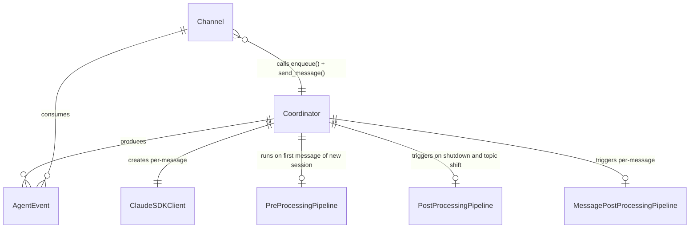

# Design: Core Architecture

<!-- This design describes the current implementation approach. Updated through delta reconciliation. -->

**Feature Spec**: [../feature-specs/agent/core-architecture.md](../../feature-specs/agent/core-architecture.md)
**Status**: Current

## Purpose

This document explains the design rationale for the core agent architecture: the modeling choices, data flow, system behavior, and architectural approach that every other feature builds on.

## Problem Context

Tachikoma needs a foundational agent architecture that wraps the Claude Agent SDK in a way that (a) provides a clean programmatic interface for channels to send messages and receive streamed responses, (b) keeps channels decoupled from SDK internals so the SDK can evolve independently, and (c) gives extension points where future features plug in pre-processing, post-processing, delegation, and idle task processing.

**Constraints:**
- The Claude Agent SDK (`claude-agent-sdk`) is async-first and spawns a Claude Code CLI process internally
- The SDK has two entry points: `query()` (stateless iterator) and `ClaudeSDKClient` (session-scoped client with `resume` for conversation continuity)
- This architecture implements pre-processing (context enrichment before the first session message) and post-processing (analysis after session close), with delegation as a future extension

**Interactions:**
- Channels (REPL, Telegram) call the coordinator's `enqueue()` and `send_message()` to interact with the agent
- Pre-processing pipeline runs registered context providers on first message of new session (see [pipeline design](pre-processing-pipeline.md)); memory context provider registers as the first provider (see [memory context retrieval](../memory/memory-context-retrieval.md))
- Post-processing pipeline runs registered processors after session close (see [pipeline design](post-processing-pipeline.md))
- Future features (delegation) will extend the coordinator's message flow

## Design Overview

Three-layer architecture with clear boundaries:

```
┌─────────────────────────────────────────────────────┐
│                    Channel Layer                     │
│  ┌─────────┐  ┌──────────┐                          │
│  │  REPL   │  │ Telegram │                          │
│  └────┬────┘  └────┬─────┘                          │
│       │             │                                │
│       ▼             ▼                                │
├─────────────────────────────────────────────────────┤
│                 Coordinator Layer                     │
│  ┌──────────────────────────────────────────┐        │
│  │  Coordinator                             │        │
│  │  send_message() → AsyncIterator           │        │
│  │  enqueue(text) → None                     │        │
│  │  [AgentEvent]                            │        │
│  └────┬─────────────────────────────────────┘        │
│       │                                              │
│       ▼                                              │
│  ┌──────────────────────────────────────────┐        │
│  │  Message Adapter                         │        │
│  │  SDK Message → AgentEvent                │        │
│  └──────────────────────────────────────────┘        │
├─────────────────────────────────────────────────────┤
│                    SDK Layer                          │
│  ┌──────────────────────────────────────────┐        │
│  │  ClaudeSDKClient                         │        │
│  │  (claude-agent-sdk)                      │        │
│  └──────────────────────────────────────────┘        │
└─────────────────────────────────────────────────────┘
```

The **Coordinator** is the programmatic entry point. Channels call `enqueue(text)` to buffer messages and `send_message()` to process them, consuming the resulting `AsyncIterator[AgentEvent]`. The coordinator uses an unbounded `asyncio.Queue` as a message buffer. `send_message()` takes no parameters — it reads from the buffer via `_message_source()`, a long-lived async generator that yields the enriched initial message then drains subsequent buffered messages. This generator is passed to `client.connect()` which runs it as a concurrent SDK-managed task. The coordinator creates a fresh `ClaudeSDKClient` per message exchange, using `resume=sdk_session_id` for conversation continuity. After one exchange completes and `_drain_back()` recovers leftover messages, `send_message()` checks `_message_buffer` and starts a new exchange if non-empty, yielding all events as one continuous stream. Each iteration creates fresh per-exchange state (status_queue, on_status, session/boundary variables, response accumulation, SDK client, and per-message post-processing task). The previous iteration's pending task is awaited at the start of the next iteration. It transforms SDK messages into domain events via the message adapter.

The **Message Adapter** is a pure transformation layer — it maps SDK `Message` objects into `AgentEvent` domain types, decoupling channels from SDK internals.

## Components

### Implementation Structure

| Layer/Component | Responsibility | Key Decisions |
|-----------------|----------------|---------------|
| `src/tachikoma/__main__.py` | Cyclopts CLI entry point: `cli()` wrapper for `[project.scripts]`, `@app.command run()` with `--channel` flag, `@app.default` delegation for bare `tachikoma` invocation; loads config via SettingsManager, applies CLI overrides at runtime, runs bootstrap hooks (workspace, logging, git, projects, skills, context, memory, session recovery, tasks, telegram), retrieves session objects, system_prompt, and task_repository from bootstrap extras, creates EventBus instance, builds `AgentDefaults` (merges auto-injected env, config env, and hardcoded env; rejects collisions between config and hardcoded), creates pre-processing pipeline (registers MemoryContextProvider, ProjectsContextProvider, and SkillsContextProvider), post-processing pipeline (registers memory processors and CoreContextProcessor in main phase per DES-004, ProjectsProcessor in pre_finalize phase, GitProcessor in finalize phase), and per-message pipeline (registers SummaryProcessor), creates task MCP tools server, wires up coordinator + channel dispatch (REPL or Telegram) with try/finally for engine disposal | Cyclopts for CLI parsing; SettingsManager with runtime-only overrides; `AgentDefaults` groups `cwd`, `cli_path`, and `env` into a single frozen object passed to all SDK construction sites; SkillsContextProvider receives registry via injection from bootstrap extras; channel dispatch based on `settings.channel`; enables `tachikoma` console script and `python -m tachikoma` |
| `src/tachikoma/agent_defaults.py` | `AgentDefaults` frozen dataclass grouping `cwd`, `cli_path`, `env`, and three role-based model fields (`searcher_model`, `processor_model`, `classifier_model`); `merge_env()` function for merging auto-injected, config, and hardcoded env layers (rejects collisions between config and hardcoded only; auto-injected defaults are silently overridable); `HARDCODED_ENV` constant | Single object replaces individual `cwd`/`cli_path`/`env` parameter threading across 10+ component signatures; role-based model fields default to `"opus"` / `"haiku"` / `"haiku"` and are sourced from `settings.agent.searcher_model`, `settings.agent.processor_model`, `settings.agent.classifier_model` (see DES-004 for role semantics) |
| `src/tachikoma/coordinator.py` | Creates a per-message `ClaudeSDKClient`, manages session lifecycle via `resume`, exposes `send_message()`. Accepts `agent_defaults` (for `cwd`, `cli_path`, `env`), `foundational_context` (list of (owner, content) tuples from bootstrap), `permission_mode`, `mcp_servers`, `session_resume_window`, and `timezone` for SDK configuration, and an optional `on_status` callback for shutdown-phase notifications. Saves context entries to DB at lifecycle points (foundational on session creation, provider results after pre-processing, transition context on boundary detection); loads entries and calls `build_system_prompt(entries, timezone=self._timezone)` before every `_build_options()`. `_build_options()` simplified: accepts `system_prompt_append: str | None` (the fully assembled system prompt from `build_system_prompt()`), no longer assembles context inline. Extracts detected agents and additional MCP servers from pre-processing pipeline results per-session (both are session-scoped, cleared on topic shift). Tracks `last_message_time` (updated on `send_message()` entry and response completion) for idle gating by external subsystems. Optionally integrates with `SessionRegistry` for persistent session tracking (see [sessions design](sessions.md)), `PreProcessingPipeline` for context enrichment on new sessions (see [pipeline design](pre-processing-pipeline.md)), `PostProcessingPipeline` for post-conversation analysis (see [pipeline design](post-processing-pipeline.md)), and `MessagePostProcessingPipeline` for per-message processing (see [boundary detection design](boundary-detection.md)). Extended with boundary detection gating (with session candidate fetching), per-message post-processing trigger, session transition orchestration (`_handle_transition` with resume branch), and `_persist_bridging_context` for assembling and saving bridging context to DB. Tracks `_sdk_session_id`, `_agents`, `_foundational_context`, `_mcp_servers`, `_pending_msg_task`, and `_background_tasks` for lifecycle management. Extracts `mcp_servers` from pre-processing pipeline results per-session, merges with constructor-provided servers, and passes them to `ClaudeAgentOptions` via `_build_options()`. Clears `_agents` and `_mcp_servers` on session transition; creates `StderrAccumulator` per message exchange and installs on `ClaudeAgentOptions.stderr` — on error, the accumulated stderr is included in the error log entry as a structured field | Async context manager pattern; creates fresh `ClaudeSDKClient` per `send_message()` call with `resume` for continuity; wraps assembled system prompt in SystemPromptPreset with append mode (see ADR-008); optional registry, pre_pipeline, pipeline, msg_pipeline, and on_status dependencies; `_agents` populated from pipeline results (not constructor), cleared on transition; unpacks `agent_defaults` for `cwd`, `cli_path`, `env` in `_build_options()` and passes `agent_defaults` to `detect_boundary()` |
| `src/tachikoma/sdk_query.py` | `StderrAccumulator` class (stateful callable for `ClaudeAgentOptions.stderr` callback with tail-truncation and silent error swallowing) + `stderr_aware_query()` async generator (drop-in `query()` replacement that creates an accumulator, logs stderr on any `Exception`, and re-raises unchanged). Catches broad `Exception` because the SDK re-wraps `ProcessError` as a plain `Exception` in its internal message reader | New module alongside `sdk_transport.py`; houses all stderr capture logic; all standalone `query()` consumers import `stderr_aware_query` from here |
| `src/tachikoma/events.py` | `AgentEvent` domain type hierarchy | Dataclasses; no SDK dependency |
| `src/tachikoma/adapter.py` | Transforms SDK messages to `AgentEvent`s; sanitizes text to strip invalid UTF-8 characters (surrogates, overlong encodings) via `sanitize_text()` | Pure function, stateless; only module that imports SDK message types; `sanitize_text()` is imported by all SDK-consuming sites that extract `TextBlock.text` (executor, summary processor, fork-and-capture) |

### Cross-Layer Contracts

**Coordinator → Channel contract:**

Channels send a text message and receive an async stream of `AgentEvent`s. The stream ends naturally when the agent completes its response.

```mermaid
sequenceDiagram
    actor User
    participant Channel
    participant Coord as Coordinator
    participant Detector as detect_boundary
    participant Registry as SessionRegistry
    participant PrePipeline as PreProcessingPipeline
    participant SDK as ClaudeSDKClient
    participant Adapter
    participant MsgPipeline as MessagePostProcessingPipeline

    User->>Channel: sends message
    Channel->>Coord: enqueue(text) + send_message()

    rect rgba(0, 128, 255, 0.1)
        Note over Coord: Await pending per-message task
        Coord->>Coord: await _pending_msg_task (if any)
    end

    Coord->>Registry: get_active_session()
    Registry-->>Coord: Session (with summary)

    rect rgba(0, 200, 100, 0.1)
        Note over Coord,Detector: Boundary detection (with session candidates)
        alt has session and summary and cwd
            Coord->>Registry: get_recent_closed(before, window)
            Registry-->>Coord: list[Session] candidates
            Coord->>Detector: detect_boundary(text, summary, cwd, candidates)
            Note over Detector: standalone query() with Opus low effort
            Detector-->>Coord: BoundaryResult(continues, resume_session_id)
        else no session or no summary or no cwd
            Note over Coord: skip detection
        end
    end

    rect rgba(255, 200, 0, 0.1)
        Note over Coord,PrePipeline: Pre-processing (first message of new session)
        alt new session (just created or after transition)
            Coord->>PrePipeline: run(text)
            PrePipeline-->>Coord: list[ContextResult]
            Note over Coord: save results as context entries to DB; load entries + build_system_prompt()
        else existing session
            Note over Coord: skip pre-processing
        end
    end

    Note over Coord: async with ClaudeSDKClient(options)
    Coord->>SDK: query(enriched_text or text)
    loop for each SDK Message via receive_response()
        SDK-->>Coord: Message
        Coord->>Adapter: adapt(message)
        Adapter-->>Coord: AgentEvent(s) or skip
        Coord-->>Channel: yield AgentEvent
        Channel-->>User: render response
    end

    rect rgba(128, 0, 255, 0.1)
        Note over Coord,MsgPipeline: Per-message post-processing
        Coord-)+MsgPipeline: run(session, text, response) [background task]
    end
```

Note: `send_message()` is an async generator. The per-message pipeline launch happens inside the generator body, after the response stream completes but before the generator returns.

**Integration Points:**
- Coordinator ↔ SDK: per-message `async with ClaudeSDKClient(options)`, `query()` to send messages, iterate `receive_response()` for response stream (stops at `ResultMessage`). Uses `resume=sdk_session_id` for conversation continuity across messages
- Coordinator ↔ Adapter: pure function call `adapt(sdk_message) -> list[AgentEvent]` (returns empty list for filtered messages)
- Channel ↔ Coordinator: async iterator protocol; `enqueue(msg)` (buffer write), `enqueue_deferred(msg)` (deferred queue write), `has_deferred` + `promote_next_deferred()` (drain control)
- Coordinator ↔ SessionRegistry (optional): `create_session()` on first message, `update_metadata()` on Result events, `close_session()` on shutdown and on topic shift (see [sessions design](sessions.md))
- Coordinator ↔ PreProcessingPipeline (optional): `pipeline.run(message)` in `send_message()`, on first message of new session (including after topic shift transition), before `client.query()` (see [pipeline design](pre-processing-pipeline.md))
- Coordinator ↔ PostProcessingPipeline (optional): `pipeline.run(session)` in `__aexit__` (after session close) and as background task during topic shift transitions (see [pipeline design](post-processing-pipeline.md))
- Coordinator ↔ `detect_boundary` (from `boundary` package): pure function call before processing, accepts optional `candidates: list[SessionCandidate]`, returns `BoundaryResult(continues, resume_session_id)`, errors caught and defaulted to `BoundaryResult(continues=True)` (continuation). Skipped when no session, no summary, or no cwd (see [boundary detection design](boundary-detection.md))
- Coordinator ↔ `MessagePostProcessingPipeline` (optional): `run(session, text, response_text)` as background `asyncio.Task` after each response, reference stored as `_pending_msg_task` (see [boundary detection design](boundary-detection.md))
- Coordinator ↔ MCP servers (optional): `mcp_servers` parameter passed to `ClaudeAgentOptions.mcp_servers` in `_build_options()` — used by task subsystem for task CRUD tools and workflow subsystem for workflow lifecycle tools (see [workflows design](../workflows/workflow-state-machine.md))
- Coordinator ↔ Priority buffer: `last_message_time` and `is_busy` properties consumed by the buffer for idle-gated delivery; coordinator dispatches `CoordinatorIdle(timestamp)` on every busy→idle transition via `_maybe_emit_idle()` so the buffer can wake without polling (see [delivery/priority-buffer](../../feature-designs/delivery/priority-buffer.md))
- `__main__.py` ↔ EventBus: created in `__main__.py`, passed to channels and task async loops; `bus.stop()` called on shutdown
- `__main__.py` ↔ Priority buffer: `create_and_start_buffer(bus, coordinator, settings)` is called after coordinator construction and before channel dispatch, subscribing the buffer to `Notification` + `CoordinatorIdle` and returning a started buffer instance wired to the coordinator

### Shared Logic

- **AgentEvent types** (`events.py`): Shared between coordinator (produces) and channels (consume). No other shared logic — each layer has clear boundaries.

## Modeling

The domain model is intentionally minimal:


```mermaid
erDiagram
    Coordinator ||--|| ClaudeSDKClient : "creates per-message"
    Coordinator ||--o{ AgentEvent : produces
    Coordinator ||--o| PreProcessingPipeline : "runs on first message of new session"
    Coordinator ||--o| PostProcessingPipeline : "triggers on shutdown and topic shift"
    Coordinator ||--o| MessagePostProcessingPipeline : "triggers per-message"
    Channel ||--o{ AgentEvent : consumes
    Channel }o--|| Coordinator : "calls enqueue() + send_message()"
```

### AgentEvent hierarchy

```
AgentEvent (base)
├── TextChunk       — a piece of streamed text content
├── ToolActivity    — agent used a tool (name + input + result)
├── Result          — response complete (session, cost, usage metadata)
├── Status          — transient, component-driven status update forwarded by the coordinator
└── Error           — error occurred (message, recoverable flag)
```

- **TextChunk**: `text: str` — one fragment of the agent's response
- **ToolActivity**: `tool_name: str`, `tool_input: dict`, `result: str` — a tool invocation by the agent
- **Result**: `session_id: str | None`, `total_cost_usd: float | None`, `usage: dict | None` — signals response completion with observability metadata
- **Status**: `message: str` — a transient, granular status update forwarded by the coordinator. Boundary detection, the session-gated pre-processing pipeline, and the per-message pre-processing pipeline each emit their own user-facing description (e.g. `"Analyzing message..."`, `"Searching memories..."`, `"Detecting relevant skills..."`) via a `StatusCallback`; the coordinator yields those as `Status` events on the stream while the originating work runs concurrently in a background task. Providers emit both start and completion messages (e.g. `"Searching memories..."` → `"Found 3 relevant memories"`)
- **Error**: `message: str`, `recoverable: bool` — something went wrong; recoverable errors let the conversation continue, non-recoverable errors signal exit

### Message envelope hierarchy

The coordinator's message-buffer / deferred-queue / per-turn SDK inbox all carry a `MessageEnvelope` abstract base with property hooks for the per-kind behavior consumers depend on. Concrete subtypes override only the hooks whose value differs from the default. Consumers (pipelines, boundary detector, SDK rendering site) read the hooks; they never `isinstance`-check the subtype. This pattern is captured in [DES-013](../../design/DES-013-typed-envelope-with-property-hooks.md).

```
MessageEnvelope (abstract)
├── sdk_input                 → str            (required: text yielded to the SDK)
├── pinned_skills             → tuple[str,...] (default: ())
├── force_new                 → bool           (default: False)
├── runs_pre_processing       → bool           (default: True)
├── runs_boundary_detection   → bool           (default: True)
└── target_session_id         → str | None     (default: None — routing instruction for session switching)

TextMessage(MessageEnvelope)                   — typed user input (and any non-tap producer)
├── text: str
├── pinned_skills: tuple[str, ...] = ()
├── force_new: bool = False
├── target_session_id: str | None = None
├── external_id: str | None = None            — platform-specific message ID
└── sdk_input → text

ButtonTapMessage(MessageEnvelope)              — Telegram inline-button tap
├── value: str
├── target_session_id: str | None = None
├── sdk_input → "The user tapped the option `<value>` out of the options you displayed."
└── runs_pre_processing → False

ReactionMessage(MessageEnvelope)               — Telegram inbound emoji reaction
├── added: frozenset[str]
├── removed: frozenset[str]
├── target_session_id: str | None = None
├── external_id: str | None = None            — platform-specific message ID of reacted-to message
├── sdk_input → canonical reaction prose (added-only / removed-only / replacement / mixed)
├── runs_pre_processing → False
└── runs_boundary_detection → False
```

The base type is the queue element type for `_message_buffer`, `_deferred_queue`, and the per-turn SDK inbox. SDK-input shaping happens at exactly one site — `_message_source` reads `envelope.sdk_input` for both the initial envelope and every envelope read from the per-turn inbox. The coordinator gates both pre-processing pipelines on `envelope.runs_pre_processing` and gates both the cold-start resume branch and the active-session boundary-detection branch on `envelope.runs_boundary_detection`. When `target_session_id` is set, the coordinator short-circuits boundary detection entirely — closing the current session and reopening the named target session (via `_route_to_target_session()`), skipping both cold-start resume and active-session boundary detection. When `runs_boundary_detection=False`, the coordinator skips both branches uniformly — a reaction arriving with no active session creates a fresh session immediately via `_registry.create_session()`, with no attempt to match against recently closed sessions. Adding a future envelope subtype (e.g., the modality-aware envelope DLT-125 anticipates) is one new class — no consumer site changes.

`target_session_id` is both a property hook on the base class (returns `None`) and a dataclass field on each concrete subtype. The property hook provides uniform consumer access (no `isinstance` checks needed); the dataclass field stores the actual value. This dual pattern extends DES-013 — routing fields are data (not behavioral variation) but benefit from a uniform interface on the base. `external_id` is a data field only (no base property hook) — only `TextMessage` and `ReactionMessage` carry it; `ButtonTapMessage` does not carry an external ID.

### SDK Message → AgentEvent mapping

| SDK Type | Content/Field | AgentEvent | Notes |
|----------|--------------|------------|-------|
| `AssistantMessage` | `TextBlock` in `.content` | `TextChunk` | Extract text from each text block |
| `AssistantMessage` | `ToolUseBlock` in `.content` | `ToolActivity` | Extract tool name and input parameters |
| `AssistantMessage` | `.error` field set | `Error` | Auth/billing → non-recoverable; others → recoverable |
| `ResultMessage` | `is_error=False` | `Result` | Extract session_id, cost, usage |
| `ResultMessage` | `is_error=True` | `Error` | Non-recoverable |
| `UserMessage` | — | (filtered) | Tool results echoed back by SDK |
| `SystemMessage` | — | (filtered) | Session metadata |

### Coordinator state and methods

```
Coordinator
├── _sdk_session_id: str | None           (SDK session ID for resume)
├── _agents: dict[str, AgentDefinition] | None  (session-scoped: populated from pipeline results, cleared on transition)
├── _foundational_context: list[tuple[str, str]] | None  (per-file entries from bootstrap: [(owner, content), ...])
├── _session_resume_window: int           (lookup window in seconds for resume candidates)
├── _disallowed_tools: list[str]          (tools unconditionally blocked via ClaudeAgentOptions.disallowed_tools)
├── _base_mcp_servers: dict[str, McpSdkServerConfig]  (constructor-provided, static: e.g., task-tools)
├── _timezone: str                            (configured timezone, passed to build_system_prompt)
├── _mcp_servers: dict[str, McpServerConfig]  (from pre-processing, session-scoped, merged with _base_mcp_servers in _build_options)
├── _client: ClaudeSDKClient | None       (set only during send_message, None between messages)
├── _last_message_time: datetime | None      (timestamp of last exchange, for idle gating)
├── _was_busy: bool                          (tracks prior is_busy state for busy→idle transition detection)
├── is_busy → bool (property)                (True while an exchange is in progress, messages pending, or deferred queue non-empty)
├── _maybe_emit_idle() → None                (dispatches CoordinatorIdle(now) on bus if state transitioned busy→idle; best-effort, swallows bus errors)
├── _message_buffer: asyncio.Queue[MessageEnvelope]   (unbounded FIFO queue for buffered envelopes; concrete subtypes today are TextMessage, ButtonTapMessage, and ReactionMessage)
├── _deferred_queue: asyncio.Queue[MessageEnvelope]   (unbounded FIFO queue for deferred envelopes)
├── _pending_msg_task: asyncio.Task | None  (background per-message post-processing)
├── _background_tasks: list[asyncio.Task]   (session post-processing from topic shifts)
├── _build_options(resume=..., system_prompt_append=...) → ClaudeAgentOptions  (constructs per-message options; system_prompt_append is pre-built from build_system_prompt())
├── _handle_transition(session, *, resume_session_id=None) → bool  (True=resumed, False=fresh)
├── _persist_bridging_context(resumed_session, closed_at) → None  (assembles and saves bridging context to DB)
├── enqueue(msg) → None
│   └── sync, zero preconditions, puts message into _message_buffer
├── enqueue_deferred(msg) → None
│   └── sync, puts message into _deferred_queue (for processing after current turn)
├── has_pending_messages → bool (property)
│   └── checks if _message_buffer has pending items
├── has_deferred → bool (property)
│   └── checks if _deferred_queue is non-empty
├── promote_next_deferred() → None
│   └── moves one item from _deferred_queue to _message_buffer
├── send_message() → AsyncIterator[AgentEvent]
│   └── guard clause returns if buffer empty; otherwise enters re-queue loop:
│       each iteration creates fresh ClaudeSDKClient, runs full pipeline,
│       awaits previous iteration's pending post-processing task, breaks when buffer empty;
│       force_new routing: if msg.force_new and active session exists, skips boundary detection
│       target_session_id routing: if msg.target_session_id is set, calls _route_to_target_session()
│           → returns (active, is_new_session, routed_successfully)
│           → if routed_successfully is False: yields Status event, preserves current session, falls through to normal routing
│           → if routed_successfully is True: message processed in target session
├── _route_to_target_session(target_session_id, active, is_new_session) → tuple[Session | None, bool, bool]
│   └── handles session switching with pre-validation:
│       if target == active → no-op, return (active, is_new_session, True)
│       pre-validates via registry.can_reopen_session(target_id):
│         if invalid → return (active, is_new_session, False), preserve current session
│       closes current via _close_and_fire_postprocessing(),
│       reopens target via registry.reopen_session(target_id), sets SDK session ID;
│       falls back to _clear_session_state() + create_session() on reopen failure (race condition)
│       returns (session, is_new_session, routed_successfully)
└── _message_source(initial, buffer) → AsyncGenerator[str]
    └── long-lived async generator: yields enriched initial message, then reads from buffer; passed to client.connect() as a concurrent SDK-managed task
```

The `enqueue()` method allows channels to buffer user messages at any time (sync, zero preconditions). The `_message_source()` async generator yields the enriched initial message first, then continuously reads from the `_message_buffer` queue, feeding messages to the SDK via `client.connect()`. Channels call `enqueue(text)` then trigger `send_message()` if the coordinator is idle. The `send_message()` generator runs a re-queue loop: after one exchange completes and `_drain_back()` recovers leftover messages, it checks `_message_buffer` and starts a new exchange if non-empty. The previous iteration's `_pending_msg_task` is awaited at the start of each iteration; the final iteration's task is not awaited before the generator returns (runs as background task, awaited on next `send_message()` call or coordinator shutdown). Channels see one continuous `AsyncIterator[AgentEvent]` stream spanning all re-queue iterations.

## Data Flow

### Normal message flow

```
1. Channel receives user input
2. Channel calls coordinator.send_message()
3. Coordinator awaits any pending per-message task (logs errors, doesn't propagate)
4. Coordinator builds a shared status_queue and an on_status callback that
   pushes messages onto it. Each emitter phase below runs as an asyncio.Task
   drained concurrently by _drain_status_while_running(task, status_queue),
   which yields Status AgentEvents on the stream while the task is running
   and cancels the task if the consumer abandons the generator.
5. Coordinator checks for active session; creates one via registry if needed — sets is_new_session flag
6. If no active session AND msg.runs_boundary_detection: cold-start resume
   attempt runs as a background task; its internal detect_boundary call emits
   "Analyzing message..." through on_status, the coordinator forwards it as
   Status. If msg.runs_boundary_detection is False (e.g., ReactionMessage),
   cold-start resume is skipped and the unconditional fallback that follows
   creates a fresh session directly.
7. If active session has a summary AND cwd is not None AND msg.runs_boundary_detection:
   a. Fetch recent closed session candidates via registry.get_recent_closed()
      (fail-open: if query fails, candidates=None)
   b. Build SessionCandidate list from sessions
   c. Call detect_boundary(text, session, agent_defaults, candidates=candidates, on_status=on_status)
      as a background task drained through _drain_status_while_running;
      the detector emits "Analyzing message..." once before its query.
      → returns BoundaryResult(continues, resume_session_id)
   When msg.runs_boundary_detection is False, the active-session boundary
   branch is skipped uniformly with the cold-start branch — no detect_boundary
   call is issued.
7a. If msg.force_new and active session exists:
    → skip boundary detection, call _handle_transition(active) for fresh session,
      re-fetch active session, set is_new_session = not resumed
8. If topic shift → run _handle_transition(active, resume_session_id=result.resume_session_id)
   → returns bool (True=resumed, False=fresh); set is_new_session = not resumed;
   re-fetch active session
9. If continuation or detection error → proceed normally
10. If new session: save foundational context entries to DB (best-effort).
    If pre_pipeline is set: pre-processing pipeline runs context providers in parallel
    as a background task drained through _drain_status_while_running; each
    provider emits status_message() via on_status before its provide() call
    and status_message(result) after, so the coordinator yields 2N Status events
    (start + completion per provider) without blocking provider parallelism.
    Successful results saved to DB as context entries (owner=result.tag, content=result.content);
    coordinator extracts and merges mcp_servers and agent definitions from all results, stores per-session
11. If msg_pre_pipeline is set: per-message pre-processing runs as a background
    task drained through _drain_status_while_running with on_status; each
    per-message provider emits status_message() before its provide() call
    and status_message(result) after.
12. Load context entries from DB, call build_system_prompt(entries, timezone=self._timezone) → system_prompt_append.
    Coordinator builds ClaudeAgentOptions via _build_options(resume=sdk_session_id or None, system_prompt_append=...) — includes self._agents and self._mcp_servers
13. Creates fresh ClaudeSDKClient via `async with ClaudeSDKClient(options)`
14. Calls client.query(text) (enriched or original)
15. Coordinator iterates client.receive_response(), accumulating response text
16. For each SDK Message, adapter maps to AgentEvent(s) or filters out
17. Coordinator yields AgentEvent(s)
18. TextChunk events are also accumulated for per-message post-processing
19. On Result event, sdk_session_id stored on coordinator, session metadata updated
20. Client context exits (disposed)
21. Re-fetch active session, launch per-message pipeline as background task
22. Stream ends
```

**Streaming granularity:** The SDK's `receive_response()` yields complete `Message` objects and stops at `ResultMessage`. Text appears in message-level chunks rather than token-by-token. This is simpler (adapter handles complete, well-typed objects) and still responsive since messages arrive as the agent produces them. The `AgentEvent` contract with channels remains unchanged if finer granularity is needed later.

### Message buffer flow

```
1. Channel calls coordinator.enqueue(env_A) — env_A is a MessageEnvelope (typically TextMessage)
2. Channel calls send_message() (if idle)
3. send_message() guard clause: buffer non-empty → enter re-queue loop
4. Dequeue env_A; run full pipeline:
   - cold-start resume + active-session boundary detection gated on
     env_A.runs_boundary_detection (skipped for envelopes that opt out —
     e.g. ReactionMessage); when skipped, an absent active session is created
     immediately via _registry.create_session() instead of cold-start resume
   - boundary detection (when run) reads env_A.sdk_input
   - both pre-processing pipelines gated on env_A.runs_pre_processing
     (skipped for envelopes that opt out — e.g. ButtonTapMessage, ReactionMessage)
   - SDK client creation
5. _message_source(env_A, sdk_inbox) yields _user_message(env_A.sdk_input) to client.connect()
6. Events for env_A stream back, channel renders them
7. Meanwhile, user sends another message → channel calls coordinator.enqueue(env_B)
8. _message_source reads env_B from sdk_inbox, yields _user_message(env_B.sdk_input)
9. Events for env_B stream back through the same send_message() iteration
10. env_B completes → Result event, exchange teardown (forwarder cancelled, client disconnected, _drain_back())
11. Per-message post-processing launched as background task (_pending_msg_task)
12. Re-queue loop check: _message_buffer empty? → break → generator returns
13. If more envelopes arrived during teardown → loop back to step 4 (await previous _pending_msg_task, dequeue next, new exchange in same session via resume)
```

`_drain_back` recovers envelopes from the per-turn inbox directly and pushes them back to `_message_buffer` unchanged — no string-to-envelope re-wrap. The forwarder's cancellation-defence `finally` clause re-enqueues an envelope (not a derived string) if cancellation lands between `get()` and `put_nowait()`.

The `Result` event serves as a turn boundary. Channels can detect it to reset their rendering state between buffered messages. The re-queue loop inside `send_message()` ensures all buffered messages are processed within the same generator call, with each iteration running a full pipeline exchange. The generator returns only when the buffer is empty after teardown.

### Startup flow

```
1. Entry point invoked (console script via [project.scripts] or python -m), cyclopts dispatches to run() subcommand (with --channel flag) or default_command() (bare invocation, delegates to run())
2. Creates SettingsManager (loads configuration, see configuration/config-system design)
3. Applies CLI overrides via update_root() + reload() (runtime-only, no file write)
4. Creates Bootstrap, registers hooks: workspace, logging, git, projects, skills, context, memory, session recovery, tasks, workflows, telegram
5. Runs bootstrap — hooks execute in registration order (workspace creation, logging configuration, git init, projects dir creation + submodule sync, skills directory + registry creation, core context init, memory directory creation, session DB init + crash recovery, task DB init + crash recovery, workflow repository creation, telegram validation)
6. If bootstrap fails → catch BootstrapError, log + print to stderr, exit (if logging hook itself failed, log may not reach file)
7. Reads final settings from SettingsManager
8. Retrieves session repository, registry, foundational_context, task_repository, skill_registry, and workflow_repository from bootstrap extras
8a. Creates EventBus instance
8b. Builds AgentDefaults: merge_env(settings.agent.env, auto_injected={"TZ": settings.tasks.timezone}) merges auto-injected, config, and hardcoded env (config/hardcoded collision = startup error; auto-injected is silently overridable), creates AgentDefaults(cwd=workspace_path, cli_path=settings.agent.cli_path, env=merged_env, searcher_model=settings.agent.searcher_model, processor_model=settings.agent.processor_model, classifier_model=settings.agent.classifier_model)
9. Creates SkillsContextProvider(agent_defaults, registry=skill_registry) — provider receives registry via constructor injection
10. Creates PostProcessingPipeline, registers memory processors (episodic, facts, preferences) and CoreContextProcessor in main phase, registers ProjectsProcessor in pre_finalize phase, registers GitProcessor in finalize phase — all with agent_defaults
11. Creates PreProcessingPipeline, registers MemoryContextProvider(agent_defaults), ProjectsContextProvider(workspace_path=workspace_path), and SkillsContextProvider(agent_defaults, registry=skill_registry)
12. Creates MessagePostProcessingPipeline, registers SummaryProcessor with registry and agent_defaults
12a. Creates task MCP tools server via `create_task_tools_server(task_repository, ZoneInfo(settings.tasks.timezone))`
12b. Creates workflow MCP tools server via `create_workflow_tools_server(workflow_repository, skill_registry, workspace_path)` and registers StaleWorkflowCleanupProcessor in post-processing pipeline pre_finalize phase
13. Creates Coordinator with allowed_tools, disallowed_tools, model, agent_defaults, session_registry, foundational_context, pipeline, pre_pipeline, msg_pipeline, session_resume_window=settings.agent.session_resume_window, permission_mode="bypassPermissions", mcp_servers={"task-tools": task_tools_server, "workflow-tools": workflow_tools_server}, timezone=settings.tasks.timezone
14. Enters coordinator async context (no SDK client connection — clients are created per-message)
15. If any SDK error occurs during the first message → catch, log + print to stderr, exit
15a. Starts task async loops as `asyncio.Task`s: instance_generator, session_task_scheduler, background_task_runner — all receiving bus, coordinator, task_repository, and task settings
15b. Calls `create_and_start_buffer(bus, coordinator, settings)` to construct the priority buffer, subscribe it to `Notification` + `CoordinatorIdle`, and start its internal loop (see [delivery/priority-buffer](../../feature-designs/delivery/priority-buffer.md))
16. Dispatches based on settings.channel:
    ├─ "repl" → Repl(coordinator, history_path=..., bus=bus)
    └─ "telegram" → TelegramChannel(coordinator, settings.telegram, bus=bus)
17. Channel enters its main loop (channels subscribe to event bus at construction)
18. finally: cancels task async loops, awaits them, calls bus.stop(), disposes task and session repository engines (always runs, even on error)
```

### Shutdown flow

```
1. Channel signals exit (user action or non-recoverable error)
2. Coordinator __aexit__ cancels idle close loop (prevents race with shutdown close)
3. Awaits any pending per-message task (logs errors, doesn't propagate)
4. Captures active session (if any), then closes it via registry (errors logged, not propagated)
5. If captured session has a valid SDK session ID and a pipeline is registered, coordinator triggers post-processing pipeline (errors logged, not propagated)
6. If background session post-processing tasks exist (from prior topic shifts or idle close), coordinator logs task count, then awaits all tasks via asyncio.gather(return_exceptions=True), logs errors
7. No SDK disconnect step — per-message clients are already disposed after each exchange
8. finally block:
   a. Cancel task async loops (instance generator, session task scheduler, background task runner)
   b. Await cancelled tasks (background runner cancels running executions, which mark instances as failed)
   c. Call bus.stop() to shut down the event bus
   d. Dispose task repository engine
   e. Dispose session repository engine
9. asyncio.run() completes
```

## Key Decisions

### Message envelope hook surface ([DES-013](../../design/DES-013-typed-envelope-with-property-hooks.md))

**Choice**: `MessageEnvelope` is an abstract base class with property hooks (`sdk_input`, `pinned_skills`, `force_new`, `runs_pre_processing`, `runs_boundary_detection`); subtypes override the hooks. Coordinator and pipelines invoke the hooks; they never `isinstance`-check the envelope or call into per-subtype helpers. SDK-input shaping is a single rendering site reading `envelope.sdk_input` at the `_message_source` boundary; the coordinator gates the pre-processing pipelines on `runs_pre_processing` and gates both the cold-start resume branch and the active-session boundary-detection branch on `runs_boundary_detection`.
**Why**: Adding a new envelope subtype (future media subtypes per DLT-125, future first-class command envelopes) means writing one new class. Consumers — coordinator, providers, post-processors — don't change. Defaults on the base mean subtypes only override what's actually different. The single rendering site keeps the SDK contract honest and prevents the forwarder from stripping structure before consumers can see it.
**Alternatives Considered**:
- **Pydantic discriminated union with a `Literal` tag**: adds Pydantic boilerplate for a value that never crosses a serialization boundary; consumers still need to dispatch on the tag.
- **Runtime-checkable `Protocol`**: avoids inheritance but loses default values on the base — every subtype must implement every hook, even the ones it would inherit verbatim.
- **External dispatch table (`render_sdk_input(env)` switching on type)**: every new subtype requires editing the dispatcher in the coordinator — exactly the smearing the hook approach avoids.

**Consequences**:
- Pro: New envelope kinds extend the type without touching consumers
- Pro: Type checker catches missing hook overrides via abstract-method errors
- Pro: Default values on the base mean subtypes only override what's actually different
- Pro: One rendering site = one source of truth for the SDK contract; `_drain_back` recovers envelopes directly without re-wrapping derived strings
- Con: The `@property @abstractmethod` + `@dataclass(frozen=True)` interaction has to be done carefully so dataclass machinery doesn't shadow the abstract property

### Per-message ClaudeSDKClient with resume

**Choice**: Create a fresh `ClaudeSDKClient` per `send_message()` call, using `resume=sdk_session_id` for conversation continuity
**Why**: Eliminates anyio cancel scope leaks that occurred during mid-lifecycle client swaps on topic shifts. Uses the SDK's recommended `receive_response()` pattern (stops at `ResultMessage`) instead of manual iteration over `receive_messages()`. Topic shifts become trivial: just clear the session ID — no client replacement needed. The `interrupt()` method is still available during the per-message client's lifetime.
**Alternatives Considered**:
- Persistent `ClaudeSDKClient` with swap-on-success for topic shifts: caused cancel scope leaks during client replacement, required holding two CLI subprocesses during swap
- `query()` stateless iterator: lacks `interrupt()` and mid-stream message injection support

**Consequences**:
- Pro: No cancel scope leaks — each client has a clean lifecycle
- Pro: Topic shifts are trivial (clear session ID, no client replacement)
- Pro: `receive_response()` aligns with SDK docs recommendation
- Pro: `interrupt()` available during each message exchange
- Con: Client connect/disconnect overhead per message (minimal in practice)

### Own domain types (AgentEvent)

**Choice**: Define `AgentEvent` type hierarchy instead of passing SDK messages to channels
**Why**: Channels should not depend on SDK internals. The SDK `Message` types expose implementation details (content blocks, tool use structures, error fields) that channels don't need. Named `AgentEvent` (not `StreamEvent`) to avoid collision with the SDK's own `StreamEvent` type.
**Alternatives Considered**:
- Pass-through SDK messages: Simple but couples channels to SDK
- Thin wrapper re-exporting SDK types: Middle ground but still coupled

**Consequences**:
- Pro: Channels have zero SDK dependency
- Pro: SDK changes isolated to adapter module
- Con: Additional mapping layer (small, pure function)

### Restricted tool set via allowed_tools

**Choice**: Use `allowed_tools=["Read", "Glob", "Grep", "Edit(.claude/**)"]` to declare which tools are auto-approved
**Why**: The `allowed_tools` list is a permission auto-approve list — under `permission_mode="bypassPermissions"`, all tools are already approved, so `allowed_tools` serves as a declarative record of the intended tool set. The `Edit(.claude/**)` entry uses Claude Code's gitignore-style pattern syntax to auto-approve edits to any file under `.claude/` directories, since the agent legitimately manages its own configuration and skill files. Note: the SDK has a known bug where an empty list `[]` is treated as falsy and never sent to the CLI (see DES-007), so a non-empty list is required to have effect. The tool list is configured via the configuration system (`agent.allowed_tools`) with these values as defaults.

**Consequences**:
- Pro: Declarative record of the intended tool set
- Pro: Tool list is configurable without code changes

### Tool blocking via disallowed_tools

**Choice**: Use `disallowed_tools` to unconditionally block specific tools (user-configurable defaults plus system-level blocks)
**Why**: `disallowed_tools` blocks tools regardless of `permission_mode` — it is evaluated before `allowed_tools` and `bypassPermissions` in the SDK's tool evaluation chain. User-configurable defaults block `AskUserQuestion` (autonomous assistant should not prompt interactively) and `CronCreate`/`CronDelete`/`CronList` (Tachikoma has its own persistent task system). A system-level `SYSTEM_DISALLOWED_TOOLS` constant additionally blocks `Skill` (shadows Tachikoma's skill subsystem) — these are merged via a field validator and cannot be removed by user configuration.
**Alternatives Considered**:
- Permission rules or hooks: More complex, require per-call evaluation logic
- System prompt instruction: Unreliable, prompt-level control

**Consequences**:
- Pro: Unconditional blocking regardless of permission mode
- Pro: Configurable without code changes
- Pro: Uses the SDK's built-in mechanism (no custom logic)

### SDK cwd for workspace directory (not os.chdir)

**Choice**: Pass `workspace_path` to Coordinator, forwarded as `cwd` in `ClaudeAgentOptions`
**Why**: `os.chdir()` is a global side effect affecting the entire process. The SDK's `ClaudeAgentOptions.cwd` sets the agent's working directory without affecting the host process.
**Alternatives Considered**:
- `os.chdir()` after bootstrap: Global side effect, affects entire process

**Consequences**:
- Pro: No global side effects
- Pro: SDK natively supports it
- Pro: Coordinator explicitly declares its working directory
- Con: Requires cwd parameter on Coordinator constructor

### Bypass permissions for the main session

**Choice**: Set `permission_mode="bypassPermissions"` on the main coordinator session
**Why**: Tachikoma is a personal assistant that needs full tool access to be useful — reading/writing files, running commands, etc. The default permission mode would prompt the user for each tool invocation, which defeats the purpose of an autonomous assistant.

**Consequences**:
- Pro: Agent can use all tools without user prompts
- Pro: Matches the UX expectation of a personal assistant
- Con: User must trust the system prompt and agent behavior

### Auto-memory disabled via environment variable

**Choice**: Pass `CLAUDE_CODE_DISABLE_AUTO_MEMORY=1` through `ClaudeAgentOptions.env`
**Why**: Claude Code has a built-in auto-memory feature that writes to `~/.claude/projects/<project>/memory/`. This conflicts with Tachikoma's own memory system (context files + post-processing extraction). The env var is the official mechanism (available since Claude Code v2.1.59) passed to the CLI subprocess.
**Alternatives Considered**:
- CLAUDE.md instruction to not use memory: Unreliable, prompt-level control
- No action: Would cause duplicate/conflicting memory systems

**Consequences**:
- Pro: Single memory system, no conflicts
- Pro: Official SDK mechanism, clean implementation
- Con: Depends on env var contract with Claude Code CLI

### AgentDefaults for unified SDK option threading

**Choice**: Group `cwd`, `cli_path`, `env`, and `model` into a frozen `AgentDefaults` dataclass (`src/tachikoma/agent_defaults.py`), passed as a single object to every component that creates `ClaudeAgentOptions`
**Why**: Before this change, `cwd` and `cli_path` were threaded as separate parameters through 10+ component signatures. Adding `env` would have meant yet another parameter everywhere. `model` was added to centralize sub-agent model configuration (defaulting to `"opus"`) instead of hardcoding it in each processor. `AgentDefaults` consolidates them — adding future common options means changing one dataclass, not 10+ signatures.
**Alternatives Considered**:
- Thread `env` as a separate parameter (like `cli_path` was): Works but keeps growing the parameter count

**Consequences**:
- Pro: Adding new common SDK options is one-line in `AgentDefaults`
- Pro: Cleaner constructor signatures across all components
- Con: Components must unpack `.cwd`, `.cli_path`, `.env`, `.model` when constructing `ClaudeAgentOptions`

### Configurable env via config with layered collision detection

**Choice**: Add `agent.env: dict[str, str]` to config, merged with auto-injected and hardcoded defaults in `__main__.py` via `merge_env()`. The merge uses three layers with different collision semantics: auto-injected defaults (lowest priority, silently overridable by user), user config env, and hardcoded defaults (highest priority, collision with config = startup error). The collision check only applies to config vs hardcoded — auto-injected keys bypass the check by design. The generic `auto_injected: dict[str, str] | None` parameter in `merge_env()` allows future auto-injected defaults without signature changes.
**Why**: Users may need to pass custom env vars to the SDK subprocess (e.g., for debugging or feature flags). Hardcoded defaults exist for correctness reasons and must not be silently overridden. Auto-injected defaults (like `TZ`) are convenience values that should be overridable without error.
**Alternatives Considered**:
- Config overrides hardcoded defaults (dict union): Dangerous — could silently break invariants like auto-memory disabling
- No config support (env-only via process environment): Less discoverable, doesn't propagate to all SDK sites
- Specific `timezone: str | None` parameter: Couples `merge_env()` to the TZ use case; signature grows with each new auto-injected default

**Consequences**:
- Pro: Custom env vars configurable via TOML
- Pro: Hardcoded defaults protected from accidental override
- Pro: Non-string values rejected at startup with clear error
- Pro: Auto-injected defaults extensible without function changes
- Con: Two collision models to understand (mitigated by clear error messages for the one that matters)

### Text sanitization at the adapter boundary

**Choice**: Define `sanitize_text()` in the adapter module and apply it at all 5 sites that consume `TextBlock.text` from SDK messages
**Why**: The SDK CLI subprocess occasionally produces text containing invalid surrogate code points (U+D800–U+DFFF) that cannot be encoded as UTF-8. These cause Telegram API 500 errors (`surrogates not allowed`) and SDK CLI crashes during post-processing fork operations. The function uses `str.encode('utf-8', errors='ignore').decode('utf-8')` to strip unencodable characters while preserving all valid Unicode. The adapter module is the SDK boundary layer, making it the natural home for sanitization logic. Other SDK-consuming sites (executor, summary processor, fork-and-capture) import the function.
**Alternatives Considered**:
- Sanitize only at the Telegram channel: Per-consumer fix, leaves other paths unprotected
- Sanitize in `TextChunk.__post_init__`: Couples encoding concerns to the data model
- `errors='replace'` (insert `?`): Creates confusing output; surrogates have no meaningful visual representation

**Consequences**:
- Pro: All SDK text paths guaranteed to produce valid UTF-8
- Pro: Single function definition, minimal maintenance surface
- Pro: Silent removal — no visual artifacts in rendered output
- Con: Removed characters are invisible (mitigated by debug-level logging when removal occurs)

### Message-level streaming via receive_response()

**Choice**: Use `receive_response()` for message-level streaming rather than `receive_messages()` or token-level streaming
**Why**: `receive_response()` yields complete `Message` objects and stops at `ResultMessage`, per SDK docs recommendation. This avoids the need for manual `break` in async iterators (which can leave SDK resources in an inconsistent state — see DES-005). Complete `Message` objects are simpler to adapt than token-by-token streaming.

**Consequences**:
- Pro: Simpler adapter — handles complete, well-typed Message objects
- Pro: Clean iterator lifecycle — `receive_response()` terminates naturally at `ResultMessage`
- Con: Text appears in message-level chunks rather than character-by-character
- Note: Can upgrade to token-level streaming later without changing the `AgentEvent` contract

## System Behavior

### Scenario: Normal conversation turn

**Given**: The coordinator is connected
**When**: A channel sends a message via `send_message()`
**Then**: The SDK processes the message and the response streams back as `AgentEvent`s. `TextChunk`s carry response text, `ToolActivity` shows tool use, and `Result` signals completion.

### Scenario: Multi-turn conversation

**Given**: One or more messages have already been sent in the current session
**When**: A follow-up message is sent
**Then**: The coordinator creates a fresh `ClaudeSDKClient` with `resume=sdk_session_id`, restoring conversation context. The agent can reference prior messages.

### Scenario: In-stream error (rate limit, server error)

**Given**: The agent is streaming a response
**When**: The SDK yields an `AssistantMessage` with `.error` set to a transient error type
**Then**: The adapter produces an `Error` event with `recoverable=True`. The channel shows the error and continues.

### Scenario: Non-recoverable error (auth failure, billing)

**Given**: The agent is streaming a response
**When**: The SDK yields an error indicating authentication failure or billing issue
**Then**: The adapter produces an `Error` event with `recoverable=False`. The channel exits.

### Scenario: Transient connection error mid-stream

**Given**: The agent is streaming a response
**When**: The API connection drops or the CLI process crashes
**Then**: The coordinator catches `CLIConnectionError` or `ProcessError`, logs the error with accumulated stderr (if any) from the subprocess as a structured field, and yields an `Error` event with `recoverable=True`. The conversation remains usable.

### Scenario: Authentication failure on startup

**Given**: No valid authentication is available
**When**: The coordinator attempts to connect the SDK client
**Then**: The SDK raises an exception. The entry point catches it, prints the error to stderr, and exits.

### Scenario: Target session pre-validation failure

**Given**: A message with `target_session_id` pointing to a stale session (missing transcript, too old)
**When**: The coordinator's `_route_to_target_session` validates the target
**Then**: `can_reopen_session` returns `False`. The method returns `(active, is_new_session, routed_successfully=False)` without closing the current session. The coordinator checks `if not routed:` and yields a `Status` event with message "Could not resume that conversation — its context is no longer available." The message proceeds through normal boundary detection in the current session.

## Notes

- The Claude Agent SDK wraps the Claude Code CLI binary internally — the Python package bundles the CLI (unless overridden via `cli_path`)
- The `AgentEvent` type hierarchy is designed to be extensible — future features can add new event types without modifying existing channels
- The adapter pattern used here (SDK types → domain types) may become a project-wide pattern if repeated in future features that integrate external services
- `ClaudeSDKClient.query()` returns `None` — messages are retrieved via `receive_response()` which yields `AsyncIterator[Message]` and stops at `ResultMessage` (per SDK docs, preferred over `receive_messages()` which requires manual `break`)
- The `Message` union type includes `StreamEvent` alongside the main message types — the adapter filters it along with other non-relevant types
- The coordinator's `_build_options()` accepts a pre-built `system_prompt_append` string from `build_system_prompt(entries, timezone=...)`. It no longer assembles context inline — the database is the canonical source of context entries, and `build_system_prompt()` (in `context/assembly.py`) handles assembly from the loaded entries. The preamble is rendered dynamically via `render_system_preamble(timezone)` from `SYSTEM_PREAMBLE_TEMPLATE`. The date command in the preamble does not include a `TZ=` prefix — timezone is set in the subprocess environment via the auto-injected `TZ` env var.
- `sdk_query.py` provides `StderrAccumulator` and `stderr_aware_query()` for capturing SDK subprocess stderr output on error. All standalone `query()` consumers use `stderr_aware_query()` as a drop-in replacement. The coordinator and background task executor create their own accumulator instances directly. The accumulator uses tail-truncation (default 10KB) to prevent log explosion while preserving the most diagnostic content. `stderr_aware_query()` catches broad `Exception` (not just `ProcessError`) because the SDK's internal message reader re-wraps transport errors as plain `Exception` via `Query.receive_messages()`.
- Logging configuration suppresses noisy third-party loggers (`sqlalchemy.engine`, `aiosqlite`, `aiogram`, `markdown_it`, `claude_agent_sdk`) to WARNING level. Per-session log rotation renames the previous session's log file on startup. `logger.remove()` is called at the start of `main()` to prevent console leaks before the logging bootstrap hook runs.
- Granular status forwarding in `send_message()`: a single `asyncio.Queue[str]` plus an `on_status` closure is built once per exchange. Each emitter phase (cold-start resume, active-session boundary detection, session-gated pre-processing pipeline, per-message pre-processing pipeline) runs as an `asyncio.Task` and is drained through `_drain_status_while_running(task, queue)`, which yields `Status` AgentEvents until the task completes, drains the remaining queued messages, and — importantly — cancels the task on consumer cancellation so it does not leak past an abandoned generator. `StatusCallback = Callable[[str], Awaitable[None]]` is defined alongside the `Status` event in `events.py`.
