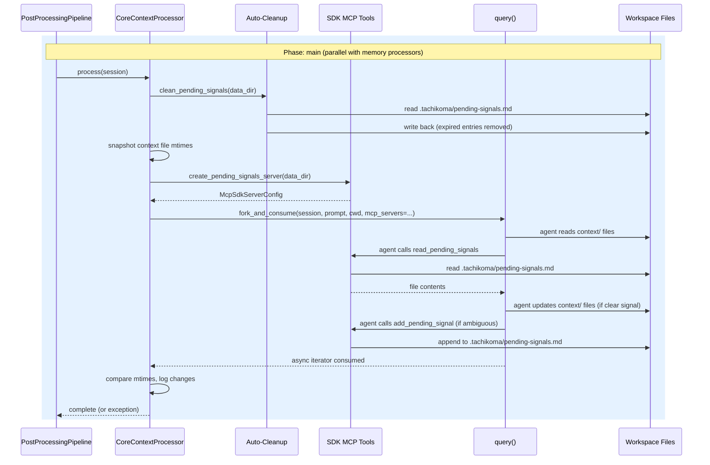
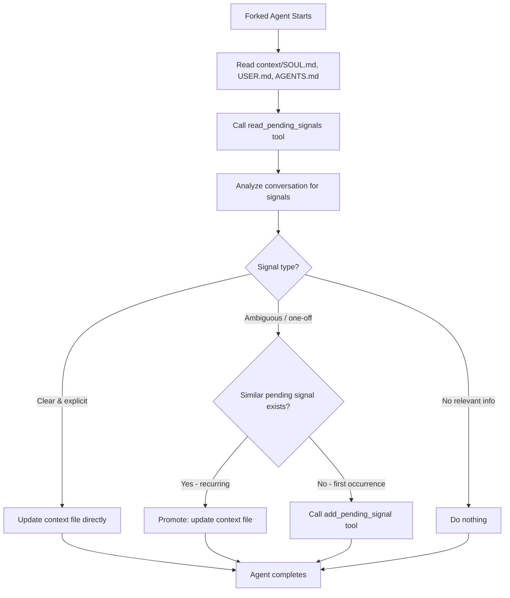

# Design: Core Context Updates

<!-- This design describes the current implementation approach. Updated through delta reconciliation. -->

**Feature Spec**: [../../feature-specs/agent/core-context-updates.md](../../feature-specs/agent/core-context-updates.md)
**Status**: Current

## Purpose

This document explains the design rationale for the core context update processor: how it analyzes completed conversations, updates foundational context files, and manages pending signals for ambiguous signal staging.

For the post-processing pipeline infrastructure that this processor plugs into, see the [post-processing pipeline design](post-processing-pipeline.md).

## Problem Context

The assistant's foundational context files (SOUL.md, USER.md, AGENTS.md) shape its personality, user knowledge, and operational behavior across all sessions. These files are loaded at startup via `context_hook` and layered onto the system prompt (ADR-008). Without automated updates, changes in user information, personality feedback, or operational instructions captured during conversations are only reflected in individual memory files (facts, preferences, episodic summaries) but not in the foundational documents.

**Constraints:**
- Context files carry higher weight than individual memories — they shape the system prompt via `SystemPromptPreset` (ADR-008). Updates must be conservative: only when there's clear conversational evidence
- The processor plugs into the existing post-processing pipeline (main phase), running in parallel with memory extraction processors
- All file I/O is performed by the forked LLM agent, not by processor code — consistent with the established pattern (DES-004)
- Ambiguous signals must be staged and only promoted after recurrence, preventing single-conversation noise from altering foundational behavior
- The pending signals file must be managed through constrained tools (read + add), not direct file access, to prevent accidental deletion or corruption by the agent

**Interactions:**
- Post-processing pipeline: processor registers in `main` phase alongside memory processors (see [pipeline design](post-processing-pipeline.md))
- Context loading: reads context files assembled by `context_hook` at startup (see [core-architecture design](core-architecture.md))
- Git processor: finalize-phase processor auto-commits any changes made by context updates
- Memory extraction: runs in parallel, may extract overlapping information — this is acceptable (R11)

## Design Overview

`CoreContextProcessor` extends `PromptDrivenProcessor` (DES-004) and plugs into the post-processing pipeline's main phase. On each run, the processor:

1. **Pre-step (Python code)**: auto-cleans expired entries from the pending signals file
2. **Creates SDK MCP tools**: in-process `read_pending_signals` and `add_pending_signal` tools
3. **Snapshots context file mtimes**: records modification times before the fork
4. **Forks the SDK session**: sends a comprehensive prompt instructing the agent to read context files, analyze the conversation, classify signals, and act accordingly
5. **Post-step (Python code)**: compares mtimes and logs which files were modified

```
┌───────────────────────────────────────────────────────────┐
│                       __main__.py                          │
│                                                           │
│  pipeline = PostProcessingPipeline()                      │
│  pipeline.register(EpisodicProcessor(cwd))   ─┐          │
│  pipeline.register(FactsProcessor(cwd))       │ main     │
│  pipeline.register(PreferencesProcessor(cwd)) │ phase    │
│  pipeline.register(CoreContextProcessor(cwd))─┘(parallel)│
│  pipeline.register(GitProcessor(cwd), phase=FINALIZE)     │
└───────────────────────────────────────────────────────────┘
                          │
           ┌──────────────┼──────────────┬──────────────┐
           ▼              ▼              ▼              ▼
      ┌─────────┐   ┌─────────┐   ┌─────────┐   ┌──────────┐
      │Episodic │   │  Facts  │   │  Prefs  │   │  Context │
      │Processor│   │Processor│   │Processor│   │ Processor│
      └────┬────┘   └────┬────┘   └────┬────┘   └────┬─────┘
           │              │              │              │
           ▼              ▼              ▼              ▼
      fork_and_consume(prompt, cwd)              fork_and_consume(
           │              │              │          prompt, cwd,
           ▼              ▼              ▼          mcp_servers=...)
      memories/      memories/      memories/         │
      episodic/      facts/         preferences/      ▼
                                                 context/SOUL.md
                                                 context/USER.md
                                                 context/AGENTS.md
                                                 .tachikoma/
                                                   pending-signals.md
```

## Components

### Implementation Structure

| Layer/Component | Responsibility | Key Decisions |
|-----------------|----------------|---------------|
| `src/tachikoma/context/` | Package containing all context concerns: loading (startup) and updating (post-processing) | Groups loading, processor, and tools cohesively under one package |
| `src/tachikoma/context/__init__.py` | Re-exports: `load_context`, `context_hook`, `CoreContextProcessor`, plus all constants from `loading.py` (`CONTEXT_DIR_NAME`, `CONTEXT_FILES`, `DEFAULT_*_CONTENT`, `SYSTEM_PREAMBLE`) | Clean public API; existing imports (`from tachikoma.context import context_hook`) continue to work |
| `src/tachikoma/context/loading.py` | `load_context()`, `context_hook()`, constants (`CONTEXT_FILES`, `CONTEXT_DIR_NAME`, default content, `SYSTEM_PREAMBLE`) | All startup context behavior; unchanged from original `context.py` |
| `src/tachikoma/context/processor.py` | `CoreContextProcessor(PromptDrivenProcessor)` + `CONTEXT_UPDATE_PROMPT` constant | Overrides `process()` for pre-step cleanup, MCP tools, and post-step observability; prompt co-located with processor (DES-004) |
| `src/tachikoma/context/tools.py` | `read_pending_signals` and `add_pending_signal` SDK MCP tools + `create_pending_signals_server()` factory + `clean_pending_signals()` utility | Uses `tool()` and `create_sdk_mcp_server()` from `claude_agent_sdk`; tools have closure over `data_dir` path |

### Cross-Layer Contracts



**Integration Points:**
- Processor ↔ Pipeline: registers in default `main` phase via `pipeline.register(CoreContextProcessor(cwd))`
- Processor ↔ SDK: `fork_and_consume(session, prompt, cwd, mcp_servers={"pending-signals": server})` — standalone `query()`, independent of `ClaudeSDKClient`
- Forked agent ↔ Context files: agent reads/writes `context/SOUL.md`, `context/USER.md`, `context/AGENTS.md` using standard Claude Code file tools
- Forked agent ↔ Pending signals: agent uses only the custom `read_pending_signals` and `add_pending_signal` MCP tools — prompt instructs against direct file access
- Processor ↔ Pending signals file: Python code manages auto-cleanup pre-fork; MCP tools manage agent interactions during fork
- Git processor ↔ Context changes: finalize-phase git processor auto-commits any file changes after all main-phase processors complete

## Modeling

The domain model remains minimal — no database entities. Context files and pending signals are plain markdown managed by the forked agent (context files) and Python code + MCP tools (pending signals).

```
CoreContextProcessor(PromptDrivenProcessor)   [DES-004]
├── _data_dir: Path                           (.tachikoma/)
├── CONTEXT_UPDATE_PROMPT: str                (module-level constant)
└── process(session) → cleanup + fork with MCP tools + log changes
```

### Pending Signals File Format

The file at `.tachikoma/pending-signals.md` uses a simple structured markdown format. Each entry is a markdown list item with a date prefix:

```markdown
# Pending Signals

- **2026-03-10**: User seemed to prefer shorter responses (one-off comment: "that was too verbose")
- **2026-03-12**: User mentioned preferring dark themes in IDEs
- **2026-03-14**: User again mentioned wanting more concise responses
```

**Why markdown list items with bold date prefix:**
- Trivial to parse programmatically (regex on `- **YYYY-MM-DD**:`)
- Human-readable if the user inspects the file
- Easy for the `add` tool to append (just add a new line)
- Easy for auto-cleanup to filter by date

## Data Flow

### Context update processor flow

```
1. Pipeline calls processor.process(session)
2. Pre-step — auto-cleanup:
   a. Read .tachikoma/pending-signals.md (no-op if missing)
   b. Parse entries, filter out those older than 30 days
   c. Write back filtered content (or delete file if empty after cleanup)
   d. On parse error: log warning, continue
3. Create SDK MCP tools:
   a. Define read_pending_signals and add_pending_signal tools
   b. Bundle into McpSdkServerConfig via create_sdk_mcp_server()
4. Snapshot context file mtimes:
   a. Record mtime of context/SOUL.md, USER.md, AGENTS.md
5. Fork session with custom tools:
   a. Call fork_and_consume(session, CONTEXT_UPDATE_PROMPT, cwd,
      mcp_servers={"pending-signals": server})
   b. Forked agent autonomously:
      - Reads all three context files
      - Reads pending signals via read_pending_signals tool
      - Analyzes conversation for context-relevant information
      - For clear, explicit signals:
        → Updates the appropriate context file directly
      - For ambiguous, one-off signals:
        → Checks pending signals for semantic recurrence
        → If recurring: promotes to context file update
        → If new: stages via add_pending_signal tool
      - For conversations with no relevant information:
        → Does nothing (no-op)
6. Post-step — observability:
   a. Compare current mtimes to snapshots
   b. Log which files were modified (if any)
7. Return to pipeline
```

### Fork session data flow



## Key Decisions

### Convert context.py to context/ package

**Choice**: Transform the flat `context.py` module into a `context/` package with `loading.py`, `processor.py`, and `tools.py`.
**Why**: Groups all context concerns (loading at startup + updating post-conversation + pending signals tools) under one cohesive package. Follows the same pattern as `memory/` (which groups memory processors and hooks).

**Consequences**:
- Pro: All context concerns cohesive under one package
- Pro: Existing imports (`from tachikoma.context import context_hook`) continue to work via `__init__.py` re-exports
- Con: Requires moving existing code (low risk — pure move with no logic changes)

### SDK MCP tools for pending signals

**Choice**: Use the Claude Agent SDK's `tool()` function and `create_sdk_mcp_server()` to create in-process MCP tools for pending signals interaction. `read_pending_signals` uses an empty input schema (no arguments); `add_pending_signal` takes `{"signal": str}`.
**Why**: The SDK provides first-class support for custom in-process tools. Tools run in the same process with no IPC overhead, have direct access to the filesystem, and integrate cleanly with `ClaudeAgentOptions.mcp_servers`. The tool API reinforces the intended access pattern (read-only + append-only) while the prompt instructs the agent not to access the file directly.

**Consequences**:
- Pro: Clean, type-safe tool definitions with schema validation
- Pro: In-process execution — no subprocess overhead
- Pro: Tools reinforce the intended access pattern alongside prompt instructions

### Pending signals created on first use (no bootstrap hook)

**Choice**: The pending signals file is created by the `add_pending_signal` tool on first use. No bootstrap hook.
**Why**: The `.tachikoma/` directory already exists (created by `workspace_hook`). The auto-cleanup and read tool handle missing files gracefully (no-op / return empty). Adding a bootstrap hook would add ceremony for a file that may never be created if conversations always have clear signals.

**Consequences**:
- Pro: No unnecessary file creation
- Pro: No bootstrap coupling — processor is self-contained
- Con: First `add` call creates the file (trivial)

### Observability via mtime comparison

**Choice**: Snapshot context file modification times before the fork and compare after. Changed files are logged.
**Why**: The forked agent performs file I/O, so the processor code has no direct visibility into what was changed. Mtime comparison is a simple, reliable way to detect which files were modified without parsing file contents.

**Consequences**:
- Pro: Simple, reliable detection — Python `stat()` calls before and after fork
- Pro: No agent cooperation required
- Con: Only detects which files changed, not what changed (git diff provides the detail)

## System Behavior

### Scenario: Clear user information change

**Given**: A conversation where the user states "I just started a new job at Acme Corp"
**When**: The processor runs after session close
**Then**: The forked agent reads USER.md, finds the relevant section, and updates it with the new employer. The mtime changes, and the processor logs "Context file updated: file=USER.md". The finalize-phase git processor commits the change.

### Scenario: Ambiguous personality feedback (first occurrence)

**Given**: A conversation where the user says "that was too verbose"
**When**: The processor runs
**Then**: The forked agent classifies this as ambiguous. It calls `read_pending_signals` — none found. It calls `add_pending_signal` to stage the signal with today's date. No context files are modified.

### Scenario: Recurring signal promoted to update

**Given**: A pending signals file contains a previous entry about shorter responses, and the user says "your answers are way too long" in a new conversation
**When**: The processor runs
**Then**: The forked agent reads pending signals and finds a semantically similar entry. It determines this is a recurring pattern and updates SOUL.md with a preference for concise responses. The old entry naturally ages out after 30 days.

### Scenario: No relevant content in conversation

**Given**: A purely technical debugging session
**When**: The processor runs
**Then**: The forked agent reads context files and pending signals, determines nothing warrants an update. No files modified, no signals added.

### Scenario: Auto-cleanup removes expired entries

**Given**: The pending signals file contains entries from 45 and 60 days ago, plus one from 5 days ago
**When**: The processor's pre-step runs
**Then**: The two expired entries are removed. The 5-day-old entry remains. If the file would be empty, it is deleted entirely.

### Scenario: Pending signals file does not exist

**Given**: No `.tachikoma/pending-signals.md` file exists
**When**: The processor runs
**Then**: Auto-cleanup is a no-op. The forked agent calls `read_pending_signals` and receives empty content. If it has ambiguous signals, `add_pending_signal` creates the file on first write.

### Scenario: Malformed pending signals file

**Given**: The pending signals file contains unparseable content
**When**: Auto-cleanup attempts to parse entries
**Then**: A warning is logged and cleanup is skipped. The forked session still runs.

### Scenario: Context file deleted after bootstrap

**Given**: A user manually deletes `context/USER.md`
**When**: The processor runs
**Then**: The processor's mtime snapshot treats a missing file as `None`. The forked agent handles the missing file gracefully.

## Notes

- The pending signals auto-cleanup threshold (30 days) is hardcoded but tunable via a constant
- Recurrence detection is LLM-judgment-based (semantic similarity via the prompt), not exact string matching
- Context file updates take effect on the next session, not mid-conversation — the coordinator loads context once at startup via `context_hook`
