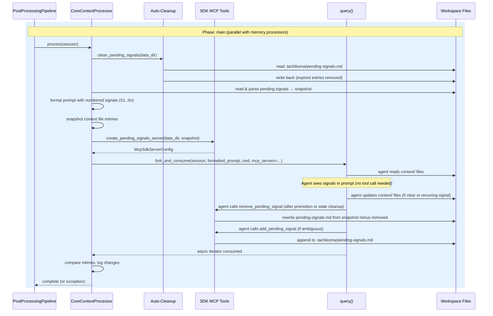
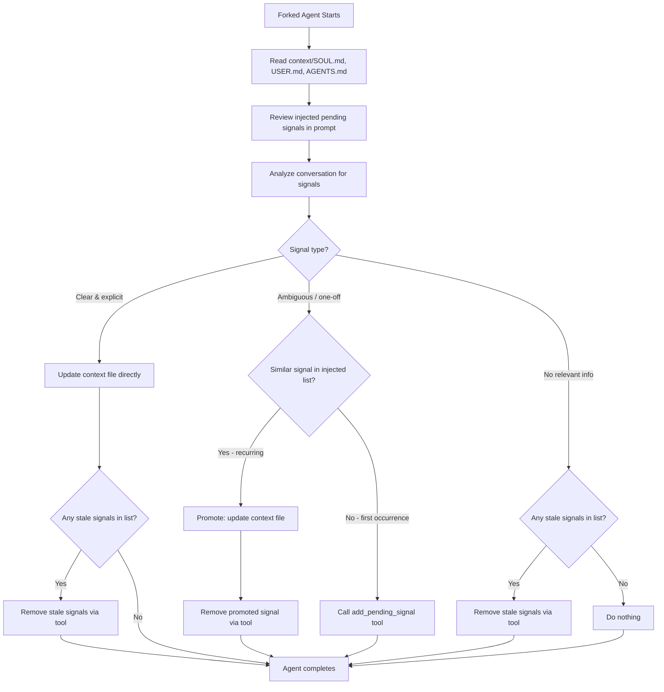

# Design: Core Context Updates

<!-- This design describes the current implementation approach. Updated through delta reconciliation. -->

**Feature Spec**: [../../feature-specs/agent/core-context-updates.md](../../feature-specs/agent/core-context-updates.md)
**Status**: Current

## Purpose

This document explains the design rationale for the core context update processor: how it analyzes completed conversations, updates foundational context files, and manages pending signals for ambiguous signal staging.

For the post-processing pipeline infrastructure that this processor plugs into, see the [post-processing pipeline design](post-processing-pipeline.md).

## Problem Context

The assistant's foundational context files (SOUL.md, USER.md, AGENTS.md) shape its personality, user knowledge, and operational behavior across all sessions. These files are loaded at startup via `context_hook` and layered onto the system prompt (ADR-008). Without automated updates, changes in user information, personality feedback, or operational instructions captured during conversations are only reflected in individual memory files (facts, preferences, episodic summaries) but not in the foundational documents.

**Constraints:**
- Context files carry higher weight than individual memories — they shape the system prompt via `SystemPromptPreset` (ADR-008). Updates must be conservative: only when there's clear conversational evidence
- The processor plugs into the existing post-processing pipeline (main phase), running in parallel with memory extraction processors
- All file I/O is performed by the forked LLM agent, not by processor code — consistent with the established pattern (DES-004)
- Ambiguous signals must be staged and only promoted after recurrence, preventing single-conversation noise from altering foundational behavior
- The pending signals file must be managed through auto-injection (for visibility) and constrained tools (add + remove), not direct file access, to prevent accidental deletion or corruption by the agent

**Interactions:**
- Post-processing pipeline: processor registers in `main` phase alongside memory processors (see [pipeline design](post-processing-pipeline.md))
- Context loading: reads context files assembled by `context_hook` at startup (see [core-architecture design](core-architecture.md))
- Git processor: finalize-phase processor auto-commits any changes made by context updates
- Memory extraction: runs in parallel, may extract overlapping information — this is acceptable (R11)

## Design Overview

`CoreContextProcessor` extends `PromptDrivenProcessor` (DES-004) and plugs into the post-processing pipeline's main phase. On each run, the processor:

1. **Pre-step (Python code)**: auto-cleans expired entries from the pending signals file
2. **Reads and snapshots pending signals**: parses the file into a snapshot (list of tuples), builds a numbered list (S1..Sn), and injects it into the prompt via `str.replace()` on a `{pending_signals_section}` placeholder
3. **Creates SDK MCP tools**: in-process `add_pending_signal` and `remove_pending_signal` tools via factory (DES-006), passing the snapshot for index-based removal
4. **Snapshots context file mtimes**: records modification times before the fork
5. **Forks the SDK session**: sends the formatted prompt instructing the agent to read context files, review injected signals, analyze the conversation, classify signals, and act accordingly
6. **Post-step (Python code)**: compares mtimes and logs which files were modified

```
┌───────────────────────────────────────────────────────────┐
│                       __main__.py                          │
│                                                           │
│  pipeline = PostProcessingPipeline()                      │
│  pipeline.register(EpisodicProcessor(cwd))   ─┐          │
│  pipeline.register(FactsProcessor(cwd))       │ main     │
│  pipeline.register(PreferencesProcessor(cwd)) │ phase    │
│  pipeline.register(CoreContextProcessor(cwd))─┘(parallel)│
│  pipeline.register(GitProcessor(cwd), phase=FINALIZE)     │
└───────────────────────────────────────────────────────────┘
                          │
           ┌──────────────┼──────────────┬──────────────┐
           ▼              ▼              ▼              ▼
      ┌─────────┐   ┌─────────┐   ┌─────────┐   ┌──────────┐
      │Episodic │   │  Facts  │   │  Prefs  │   │  Context │
      │Processor│   │Processor│   │Processor│   │ Processor│
      └────┬────┘   └────┬────┘   └────┬────┘   └────┬─────┘
           │              │              │              │
           ▼              ▼              ▼              ▼
      fork_and_consume(prompt, cwd)              fork_and_consume(
           │              │              │          prompt, cwd,
           ▼              ▼              ▼          mcp_servers=...)
      memories/      memories/      memories/         │
      episodic/      facts/         preferences/      ▼
                                                 context/SOUL.md
                                                 context/USER.md
                                                 context/AGENTS.md
                                                 .tachikoma/
                                                   pending-signals.md
```

## Components

### Implementation Structure

| Layer/Component | Responsibility | Key Decisions |
|-----------------|----------------|---------------|
| `src/tachikoma/context/` | Package containing all context concerns: loading (startup) and updating (post-processing) | Groups loading, processor, and tools cohesively under one package |
| `src/tachikoma/context/__init__.py` | Re-exports: `load_context`, `context_hook`, `CoreContextProcessor`, plus all constants from `loading.py` (`CONTEXT_DIR_NAME`, `CONTEXT_FILES`, `DEFAULT_*_CONTENT`, `SYSTEM_PREAMBLE`) | Clean public API; existing imports (`from tachikoma.context import context_hook`) continue to work |
| `src/tachikoma/context/loading.py` | `load_context()`, `context_hook()`, constants (`CONTEXT_FILES`, `CONTEXT_DIR_NAME`, default content, `SYSTEM_PREAMBLE`) | All startup context behavior; unchanged from original `context.py` |
| `src/tachikoma/context/processor.py` | `CoreContextProcessor(PromptDrivenProcessor)` + `CONTEXT_UPDATE_PROMPT` template constant (composed: `_BASE_PROMPT + WORKSPACE_VALIDATION_SECTION + _PERMISSIONS_SECTION`) + `_read_pending_signals_snapshot()` and `_format_pending_signals_section()` module-level helpers | Overrides `process()` for pre-step cleanup, snapshot reading, prompt formatting, MCP tools, and post-step observability; prompt includes workspace claim validation section (shared via `post_processing.py`); tools include `Agent` for spawning validation sub-agents; `Read` is unrestricted (needed for validation) while Edit/Write remain scoped to `context/`; prompt uses `$WORKSPACE` placeholders (DES-008) and `{pending_signals_section}` placeholder filled via `str.replace()` (DES-004) |
| `src/tachikoma/context/tools.py` | `create_pending_signals_server(data_dir, snapshot)` factory (DES-006) + `add_pending_signal` and `remove_pending_signal` SDK MCP tools + `handle_add_pending_signal()` and `handle_remove_pending_signal()` extracted handlers + `clean_pending_signals()` utility + `parse_pending_signals()` public parser | Tools have closure over `data_dir` and `snapshot`; handlers extracted for testability; remove tool uses immutable snapshot for index-based file rewrite |

### Cross-Layer Contracts


```mermaid
sequenceDiagram
    participant Pipeline as PostProcessingPipeline
    participant Proc as CoreContextProcessor
    participant Cleanup as Auto-Cleanup
    participant Tools as SDK MCP Tools
    participant SDK as query()
    participant FS as Workspace Files

    rect rgba(0, 128, 255, 0.1)
        Note over Pipeline,FS: Phase: main (parallel with memory processors)
        Pipeline->>Proc: process(session)
        Proc->>Cleanup: clean_pending_signals(data_dir)
        Cleanup->>FS: read .tachikoma/pending-signals.md
        Cleanup->>FS: write back (expired entries removed)
        Proc->>FS: read & parse pending signals → snapshot
        Proc->>Proc: format prompt with numbered signals (S1..Sn)
        Proc->>Proc: snapshot context file mtimes
        Proc->>Tools: create_pending_signals_server(data_dir, snapshot)
        Tools-->>Proc: McpSdkServerConfig
        Proc->>SDK: fork_and_consume(session, formatted_prompt, cwd, mcp_servers=...)
        SDK->>FS: agent reads context/ files
        Note over SDK: Agent sees signals in prompt (no tool call needed)
        SDK->>FS: agent updates context/ files (if clear or recurring signal)
        SDK->>Tools: agent calls remove_pending_signal (after promotion or stale cleanup)
        Tools->>FS: rewrite pending-signals.md from snapshot minus removed
        SDK->>Tools: agent calls add_pending_signal (if ambiguous)
        Tools->>FS: append to .tachikoma/pending-signals.md
        SDK-->>Proc: async iterator consumed
        Proc->>Proc: compare mtimes, log changes
        Proc-->>Pipeline: complete (or exception)
    end
```

**Integration Points:**
- Processor ↔ Pipeline: registers in default `main` phase via `pipeline.register(CoreContextProcessor(cwd))`
- Processor ↔ SDK: `fork_and_consume(session, formatted_prompt, cwd, mcp_servers={"pending-signals": server}, tools=..., allow=..., pre_tool_use_hooks=[UTILITY_BASH_HOOK], model=agent_defaults.processor_model)` — standalone `query()`, independent of `ClaudeSDKClient`; runs on the configured processor tier (default `"haiku"`, same pattern as memory processors); tools include `Agent` for workspace claim validation (haiku Explore sub-agents); `Read` is unrestricted (needed for validation) while Edit/Write remain scoped to `context/`; utility-only Bash (DES-004)
- Processor ↔ Prompt: `CONTEXT_UPDATE_PROMPT` is a template constant; `str.replace()` fills the `{pending_signals_section}` placeholder at runtime into a local `formatted_prompt` variable
- Forked agent ↔ Context files: agent reads/writes `context/SOUL.md`, `context/USER.md`, `context/AGENTS.md` using standard Claude Code file tools and utility Bash commands
- Forked agent ↔ Pending signals: agent sees current signals via auto-injection in prompt; uses `add_pending_signal` (staging) and `remove_pending_signal` (cleanup) MCP tools — prompt instructs against direct file access
- Remove tool ↔ File: rewrites file from immutable snapshot minus removed entries (not in-place editing); indices are stable across sequential removals
- Processor ↔ Pending signals file: Python code manages auto-cleanup pre-fork and snapshot reading; MCP tools manage agent interactions during fork
- Git processor ↔ Context changes: finalize-phase git processor auto-commits any file changes after all main-phase processors complete

## Modeling

The domain model remains minimal — no database entities. Context files and pending signals are plain markdown managed by the forked agent (context files) and Python code + MCP tools (pending signals).

The **snapshot** is the key data structure: a `list[tuple[str, str]]` of `(date_str, signal_text)` tuples, created by parsing the pending signals file pre-fork. Indices are 1-based (matching `S1..Sn` in the prompt) and stable for the session.

```
CoreContextProcessor(PromptDrivenProcessor)              [DES-004]
├── _data_dir: Path                                      (.tachikoma/)
├── CONTEXT_UPDATE_PROMPT: str                           (module-level template constant)
└── process(session)
    ├── clean_pending_signals()                          (pre-step)
    ├── _read_pending_signals_snapshot()                  (module-level helper → snapshot)
    ├── _format_pending_signals_section()                 (module-level helper → numbered list)
    ├── str.replace() → local formatted_prompt           (template stays in self._prompt)
    ├── create_pending_signals_server(data_dir, snapshot) (DES-006 factory)
    ├── fork_and_consume(formatted_prompt, …)
    └── mtime comparison                                 (post-step)
```

### Pending Signals File Format

The file at `.tachikoma/pending-signals.md` uses a simple structured markdown format. Each entry is a markdown list item with a date prefix:

```markdown
# Pending Signals

- **2026-03-10**: User seemed to prefer shorter responses (one-off comment: "that was too verbose")
- **2026-03-12**: User mentioned preferring dark themes in IDEs
- **2026-03-14**: User again mentioned wanting more concise responses
```

**Why markdown list items with bold date prefix:**
- Trivial to parse programmatically (regex on `- **YYYY-MM-DD**:`)
- Human-readable if the user inspects the file
- Easy for the `add` tool to append (just add a new line)
- Easy for auto-cleanup to filter by date

## Data Flow

### Context update processor flow

```
1. Pipeline calls processor.process(session)
2. Pre-step — auto-cleanup:
   a. Read .tachikoma/pending-signals.md (no-op if missing)
   b. Parse entries, filter out those older than 30 days
   c. Write back filtered content (or delete file if empty after cleanup)
   d. On parse error: log warning, continue
3. Read and snapshot pending signals:
   a. Read .tachikoma/pending-signals.md (no-op if missing/empty)
   b. Parse entries with _ENTRY_PATTERN → snapshot: list[(date, text)]
   c. Build numbered section string (S1..Sn) or "No pending signals"
   d. Replace {pending_signals_section} placeholder via str.replace() → local formatted_prompt
4. Create SDK MCP tools:
   a. Define add_pending_signal and remove_pending_signal tools
   b. Pass snapshot to factory (remove tool closure)
   c. Bundle into McpSdkServerConfig via create_sdk_mcp_server() (DES-006)
5. Snapshot context file mtimes:
   a. Record mtime of context/SOUL.md, USER.md, AGENTS.md
6. Fork session with custom tools:
   a. Call fork_and_consume(session, formatted_prompt, cwd,
      mcp_servers={"pending-signals": server})
   b. Forked agent autonomously:
      - Reads all three context files
      - Reviews pending signals already visible in prompt context
      - Analyzes conversation for context-relevant information
      - For clear, explicit signals:
        → Updates the appropriate context file directly
      - For ambiguous, one-off signals:
        → Checks injected signals for semantic recurrence
        → If recurring: promotes to context file update
          AND removes promoted signal via remove_pending_signal
        → If new: stages via add_pending_signal tool
      - For stale/irrelevant injected signals:
        → Removes via remove_pending_signal tool
      - For conversations with no relevant information:
        → Does nothing (no-op)
7. Post-step — observability:
   a. Compare current mtimes to snapshots
   b. Log which files were modified (if any)
8. Return to pipeline
```

### Fork session data flow


```mermaid
flowchart TD
    Fork[Forked Agent Starts] --> ReadCtx[Read context/SOUL.md, USER.md, AGENTS.md]
    ReadCtx --> Review[Review injected pending signals in prompt]
    Review --> Analyze[Analyze conversation for signals]
    Analyze --> Classify{Signal type?}

    Classify -->|Clear & explicit| Update[Update context file directly]
    Classify -->|Ambiguous / one-off| CheckRecur{Similar signal in injected list?}
    Classify -->|No relevant info| CheckStale{Any stale signals in list?}

    CheckRecur -->|Yes - recurring| Promote[Promote: update context file]
    Promote --> Remove1[Remove promoted signal via tool]
    CheckRecur -->|No - first occurrence| Stage[Call add_pending_signal tool]

    CheckStale -->|Yes| Remove2[Remove stale signals via tool]
    CheckStale -->|No| NoOp[Do nothing]

    Update --> CheckStale2{Any stale signals in list?}
    CheckStale2 -->|Yes| Remove3[Remove stale signals via tool]
    CheckStale2 -->|No| Done[Agent completes]
    Remove1 --> Done
    Stage --> Done
    Remove2 --> Done
    Remove3 --> Done
    NoOp --> Done
```

## Key Decisions

### Convert context.py to context/ package

**Choice**: Transform the flat `context.py` module into a `context/` package with `loading.py`, `processor.py`, and `tools.py`.
**Why**: Groups all context concerns (loading at startup + updating post-conversation + pending signals tools) under one cohesive package. Follows the same pattern as `memory/` (which groups memory processors and hooks).

**Consequences**:
- Pro: All context concerns cohesive under one package
- Pro: Existing imports (`from tachikoma.context import context_hook`) continue to work via `__init__.py` re-exports
- Con: Requires moving existing code (low risk — pure move with no logic changes)

### SDK MCP tools for pending signals

**Choice**: Use the Claude Agent SDK's `tool()` function and `create_sdk_mcp_server()` to create in-process MCP tools for pending signals interaction (DES-006). `add_pending_signal` takes `{"signal": str}`; `remove_pending_signal` takes `{"indices": list[int]}`. The factory `create_pending_signals_server(data_dir, snapshot)` receives a pre-fork snapshot for index-based removal. Handler logic is extracted into standalone `handle_add_pending_signal()` and `handle_remove_pending_signal()` functions for testability.
**Why**: The SDK provides first-class support for custom in-process tools. Tools run in the same process with no IPC overhead, have direct access to the filesystem, and integrate cleanly with `ClaudeAgentOptions.mcp_servers`. The tool API reinforces the intended access pattern (auto-injection for reads + tools for add/remove) while the prompt instructs the agent not to access the file directly.

**Consequences**:
- Pro: Clean, type-safe tool definitions with schema validation
- Pro: In-process execution — no subprocess overhead
- Pro: Tools reinforce the intended access pattern alongside prompt instructions
- Pro: Extracted handlers are testable without SDK overhead

### Pending signals created on first use (no bootstrap hook)

**Choice**: The pending signals file is created by the `add_pending_signal` tool on first use. No bootstrap hook.
**Why**: The `.tachikoma/` directory already exists (created by `workspace_hook`). The auto-cleanup and read tool handle missing files gracefully (no-op / return empty). Adding a bootstrap hook would add ceremony for a file that may never be created if conversations always have clear signals.

**Consequences**:
- Pro: No unnecessary file creation
- Pro: No bootstrap coupling — processor is self-contained
- Con: First `add` call creates the file (trivial)

### Enhanced pruning scope via prompt expansion

**Choice**: Expand the existing pruning instruction in `CONTEXT_UPDATE_PROMPT` to cover additional staleness categories (resolved bugs, completed work, time-specific events, procedural details) and add consolidation of duplicate sections, all within the existing step 5 of the prompt.
**Why**: The original pruning instruction only covered projects, employer info, tool instructions, and reversed personality adjustments. In practice, other content types accumulate (resolved bug descriptions, past trip plans, step-by-step procedures that belong in skills). These are all instances of the same problem — stale content persisting because the prompt didn't explicitly direct the agent to clean it up. Adding categories to the existing pruning step is the lightest-weight approach: no new steps, no code changes, just expanded instructions.

Consolidation is treated as a distinct concern from removal — it merges semantically equivalent sections rather than deleting content. The prompt includes a safeguard against over-merging: related-but-distinct topics must remain separate.

**Consequences**:
- Pro: Zero code changes — fully leverages the prompt-driven pattern (DES-004)
- Pro: All new pruning categories use the same conservative evidence threshold as existing ones
- Con: Effectiveness depends on LLM judgment (same tradeoff as all prompt-driven processors)

### Correction detection via prompt guidance

**Choice**: Add correction detection instructions directly to `CONTEXT_UPDATE_PROMPT` rather than creating a new pipeline component. The prompt identifies three correction types (explicit user corrections, implicit user corrections after agent errors, agent self-corrections) and instructs the agent to write concise behavioral entries to AGENTS.md under domain-appropriate sections. Entries are framed as positive instructions describing the correct behavior (e.g., "Use rebase on shared branches"), not "don't/do" correction pairs — the entry teaches the right approach as if explaining to a colleague.
**Why**: Correction detection is a signal classification task that fits naturally into the existing prompt-driven processor pattern (DES-004). No new infrastructure is needed — the forked agent already reads AGENTS.md and has write access. Keeping it prompt-level avoids pipeline complexity for what is essentially a new signal type alongside the existing identity/behavioral/instructional signals.

**Consequences**:
- Pro: Zero code changes beyond the prompt — fully leverages the existing architecture
- Pro: Correction entries are deduplicated against existing AGENTS.md content via the prompt's read-first strategy
- Con: Detection quality depends on LLM judgment (same tradeoff as all prompt-driven processors)

### Workspace claim validation via shared prompt section

**Choice**: The context processor reuses the `WORKSPACE_VALIDATION_SECTION` prompt constant from `post_processing.py` (shared processor infrastructure), appending it to the prompt before the permissions section. The `Agent` tool is enabled, allowing the forked agent to spawn haiku Explore sub-agents that verify workspace-referencing claims against actual files before writing to context files. `Read` is unrestricted (needed for validation sub-agents to read anywhere in the workspace).
**Why**: Context files (especially AGENTS.md) can contain verifiable claims about workspace state — project structure, tool configuration, implementation patterns. The same validation pattern used by memory processors (facts, preferences) applies directly. Sharing the prompt section via `post_processing.py` avoids duplication and cross-package dependencies (the context processor already imports from `post_processing`, not from `memory`).

**Consequences**:
- Pro: Consistent validation behavior across all processors that write workspace-referencing content
- Pro: No new pipeline components — purely prompt-driven, consistent with DES-004
- Pro: Invalid claims are omitted, preventing inaccurate information from persisting in foundational context files
- Con: Adds API cost and extraction latency (haiku sub-agents for validation)
- Con: Unrestricted `Read` expands the agent's visibility beyond `context/` (necessary for validation; write remains scoped)

### Observability via mtime comparison

**Choice**: Snapshot context file modification times before the fork and compare after. Changed files are logged.
**Why**: The forked agent performs file I/O, so the processor code has no direct visibility into what was changed. Mtime comparison is a simple, reliable way to detect which files were modified without parsing file contents.

**Consequences**:
- Pro: Simple, reliable detection — Python `stat()` calls before and after fork
- Pro: No agent cooperation required
- Con: Only detects which files changed, not what changed (git diff provides the detail)

## System Behavior

### Scenario: Clear user information change

**Given**: A conversation where the user states "I just started a new job at Acme Corp"
**When**: The processor runs after session close
**Then**: The forked agent reads USER.md, finds the relevant section, and updates it with the new employer. The mtime changes, and the processor logs "Context file updated: file=USER.md". The finalize-phase git processor commits the change.

### Scenario: Ambiguous personality feedback (first occurrence)

**Given**: A conversation where the user says "that was too verbose"
**When**: The processor runs
**Then**: The forked agent classifies this as ambiguous. It reviews the injected pending signals list — none similar found. It calls `add_pending_signal` to stage the signal with today's date. No context files are modified.

### Scenario: Recurring signal promoted and removed

**Given**: A pending signals file contains a previous entry about shorter responses (injected as S1), and the user says "your answers are way too long" in a new conversation
**When**: The processor runs
**Then**: The forked agent reviews injected signals and finds S1 is semantically similar. It determines this is a recurring pattern, updates SOUL.md with a preference for concise responses, and calls `remove_pending_signal` with `indices: [1]` to clean up the promoted entry immediately.

### Scenario: No relevant content in conversation

**Given**: A purely technical debugging session
**When**: The processor runs
**Then**: The forked agent reads context files and pending signals, determines nothing warrants an update. No files modified, no signals added.

### Scenario: Auto-cleanup removes expired entries

**Given**: The pending signals file contains entries from 45 and 60 days ago, plus one from 5 days ago
**When**: The processor's pre-step runs
**Then**: The two expired entries are removed. The 5-day-old entry remains. If the file would be empty, it is deleted entirely.

### Scenario: Pending signals file does not exist

**Given**: No `.tachikoma/pending-signals.md` file exists
**When**: The processor runs
**Then**: Auto-cleanup is a no-op. Snapshot is empty. The prompt section says "No pending signals at this time." If the agent has ambiguous signals, `add_pending_signal` creates the file on first write.

### Scenario: Malformed pending signals file

**Given**: The pending signals file contains unparseable content
**When**: Auto-cleanup attempts to parse entries
**Then**: A warning is logged and cleanup is skipped. The forked session still runs.

### Scenario: Context file deleted after bootstrap

**Given**: A user manually deletes `context/USER.md`
**When**: The processor runs
**Then**: The processor's mtime snapshot treats a missing file as `None`. The forked agent handles the missing file gracefully.

### Scenario: User correction extracted as behavioral instruction

**Given**: A conversation where the user says "no, don't use force push on shared branches" after the agent suggested force-pushing
**When**: The processor runs
**Then**: The forked agent detects the explicit correction, reads AGENTS.md, finds or creates the appropriate domain section, and adds a concise entry like `- Use rebase and push normally on shared branches.` If a semantically similar entry already exists, it is skipped or refined.

### Scenario: Agent self-correction captured

**Given**: A conversation where the agent says "I was wrong, let me fix that" and corrects its approach
**When**: The processor runs
**Then**: The forked agent detects the self-correction and writes the lesson as a behavioral instruction to AGENTS.md under the relevant domain section.

### Scenario: Style correction routes to SOUL.md

**Given**: A conversation where the user says "be more casual with me"
**When**: The processor runs
**Then**: The forked agent detects the correction but recognizes it as a communication style preference, routing it to SOUL.md as a personality adjustment rather than AGENTS.md.

### Scenario: Time-specific entry pruned from USER.md

**Given**: USER.md contains a trip entry "- Planning trip to Berlin (March 15-20)" and the conversation confirms the trip happened and is past
**When**: The processor runs
**Then**: The forked agent recognizes the time-specific entry as stale and removes it from USER.md.

### Scenario: Resolved bug description pruned from context files

**Given**: USER.md contains an entry about a bug the user was experiencing, and the conversation confirms the bug was resolved
**When**: The processor runs
**Then**: The forked agent removes the stale bug description from USER.md.

### Scenario: Procedural details pruned from AGENTS.md

**Given**: AGENTS.md contains step-by-step procedural instructions for a task that belongs in a skill reference, and the conversation confirms these are procedural rather than foundational
**When**: The processor runs
**Then**: The forked agent removes the procedural details, keeping only high-level operational instructions in AGENTS.md.

### Scenario: Duplicate sections consolidated

**Given**: AGENTS.md has both a "Code Review" section and a "PR Conventions" section covering the same review workflow rules with semantically equivalent content
**When**: The processor runs
**Then**: The forked agent merges the two sections into a single "Code Review" section combining the rules from both, rather than leaving redundant content.

### Scenario: Related-but-distinct sections kept separate

**Given**: AGENTS.md has a "Remote Work" section and a "Home Office Equipment" section that are related but cover distinct topics
**When**: The processor runs
**Then**: The forked agent recognizes these as related-but-distinct and does not merge them — only semantically equivalent sections are consolidated.

## Notes

- The pending signals auto-cleanup threshold (30 days) is hardcoded but tunable via a constant
- Recurrence detection is LLM-judgment-based (semantic similarity via the prompt), not exact string matching
- Context file updates take effect on the next session, not mid-conversation — the coordinator loads context once at startup via `context_hook`
