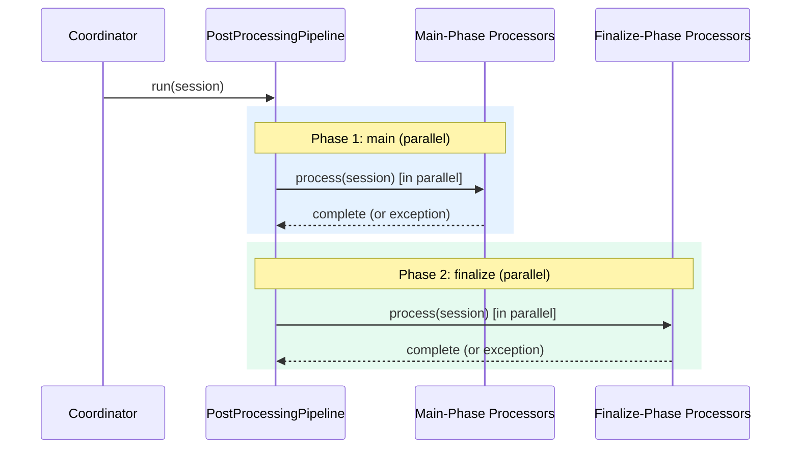
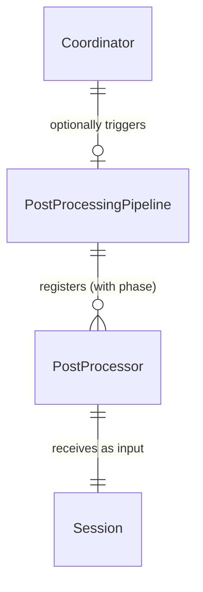

# Design: Post-Processing Pipeline

<!-- This design describes the current implementation approach. Updated through delta reconciliation. -->

**Feature Spec**: [../../feature-specs/agent/post-processing-pipeline.md](../../feature-specs/agent/post-processing-pipeline.md)
**Status**: Current

## Purpose

This document explains the design rationale for the post-processing pipeline: the phased execution mechanism, processor interface, shared helpers, and how it integrates with the coordinator.

## Problem Context

After a conversation ends, various post-processing tasks need to run — memory extraction, git commits, future tasks. These tasks must run in parallel for efficiency, but some tasks depend on others completing first (e.g., git commits need to see all memory file writes). A single flat parallel execution model doesn't support ordering constraints.

**Constraints:**
- Pipeline is domain-agnostic — knows nothing about what processors do
- Must be backward-compatible — existing processors should work without changes
- Individual processor failures must not affect others
- Must support ordering constraints between groups of processors

**Interactions:**
- Coordinator (`core-architecture`): triggers `pipeline.run(session)` on session close
- Memory processors (`memory-extraction`): register in `main` phase
- Git processor (`workspace-version-tracking`): registers in `finalize` phase

## Design Overview

A `PostProcessingPipeline` manages registered `PostProcessor` instances across sequential phases. Processors declare their phase at registration (defaulting to `main` for backward compatibility). The pipeline runs phases in order — `main` then `finalize` — with processors within each phase executing in parallel via `asyncio.gather`.

A parallel concept — the `MessagePostProcessingPipeline` — follows a similar structural pattern (processor ABC, serialized execution, error isolation) but as a separate implementation with a distinct per-message processor interface. Unlike this pipeline, it has no phased execution. See [boundary detection design](boundary-detection.md) for details.

```
┌───────────────────────────────────────────────────────────┐
│             PostProcessingPipeline                        │
│             (src/tachikoma/post_processing.py)            │
│                                                           │
│  run(session):                                            │
│    async with lock:    ◄── serializes concurrent runs     │
│      for each phase in [main, finalize]:                  │
│        await gather(                                      │
│          *phase_processors,                               │
│          return_exceptions=True                           │
│        )                                                  │
└───────────────────────────────────────────────────────────┘
```

A `PromptDrivenProcessor` base class (DES-004) standardizes the pattern for processors that fork the SDK session with a prompt. Accepts an optional `cli_path` parameter. Simple processors inherit `process()` from the base; complex processors override it for pre/post steps while still using `fork_and_consume()` internally. The base `process()` method automatically applies resumption-aware prompt augmentation via `augment_prompt_for_resumption()` when `session.last_resumed_at` is set.

A standalone `fork_and_consume()` helper encapsulates the SDK session forking pattern, available to any processor that needs to fork a session. It accepts an optional `mcp_servers` parameter for providing custom in-process MCP tools to the forked agent, and an optional `cli_path` parameter for the Claude CLI binary path.

## Components

### Implementation Structure

| Layer/Component | Responsibility | Key Decisions |
|-----------------|----------------|---------------|
| `src/tachikoma/post_processing.py` | `PostProcessor` ABC (interface only), `PromptDrivenProcessor` base class (DES-004, accepts `cli_path`), `PostProcessingPipeline` class (with phased execution), `fork_and_consume` standalone helper (with optional `mcp_servers` and `cli_path`), `augment_prompt_for_resumption(prompt, session)` shared helper for resumption-aware prompt augmentation, phase constants (`MAIN_PHASE`, `FINALIZE_PHASE`) | Separate module from any processor domain; ABC has no SDK coupling; `PromptDrivenProcessor` standardizes the fork pattern with built-in resumption awareness; fork helper uses standalone `query()` and accepts optional `mcp_servers` for custom in-process tools and `cli_path` for native binary; pipeline supports sequential phases for ordering dependencies |

### Cross-Layer Contracts



**Integration Points:**
- Coordinator ↔ Pipeline: `pipeline.run(session)` in `__aexit__`, after session close
- Pipeline ↔ Processors: `register(processor, phase="main"|"finalize")`, `process(session)` called in parallel within each phase
- `fork_and_consume`: calls `query(prompt, options=ClaudeAgentOptions(resume=session.sdk_session_id, fork_session=True, ...))` — available to processors needing session context

**Error contract:**
- Individual processor failures caught by `asyncio.gather(return_exceptions=True)` and logged per DES-002
- Phase-level errors don't prevent subsequent phases — the finalize phase always runs even if the main phase has failures
- Pipeline failures in coordinator logged but never propagate — don't block shutdown
- Pipeline serializes concurrent invocations via `asyncio.Lock`

### Shared Logic

- **`PostProcessor` ABC** (`post_processing.py`): shared interface between all processors. Defines only the `process()` contract.
- **`PromptDrivenProcessor`** (`post_processing.py`): base class for processors that fork the SDK session with a prompt (DES-004). Stores `_prompt`, `_cwd`, and `_cli_path`, implements `process()` via `augment_prompt_for_resumption()` + `fork_and_consume()`. Simple subclasses inherit `process()`; complex subclasses override it for pre/post steps and must call `augment_prompt_for_resumption()` before `fork_and_consume()` to maintain resumption awareness.
- **`augment_prompt_for_resumption` function** (`post_processing.py`): standalone helper that appends a resumption boundary instruction to a prompt when `session.last_resumed_at` is set. Used by `PromptDrivenProcessor.process()` automatically; must be called explicitly by subclasses that override `process()`.
- **`fork_and_consume` function** (`post_processing.py`): standalone helper encapsulating SDK `query()` forking pattern. Accepts optional `mcp_servers` parameter for providing custom in-process MCP tools to the forked agent, and optional `cli_path` for the Claude CLI binary path. Available to processors needing session context.
- **`Session` dataclass** (`sessions/model.py`): shared input to the pipeline — processors read `sdk_session_id`.
- **Phase constants** (`post_processing.py`): `MAIN_PHASE = "main"`, `FINALIZE_PHASE = "finalize"` — centralized alongside pipeline validation logic.

## Modeling

```
PostProcessingPipeline
├── _phases: dict[str, list[PostProcessor]]  (processors grouped by phase)
├── _phase_order: list[str]                  (["main", "finalize"])
├── _lock: asyncio.Lock                      (serializes concurrent runs)
├── register(processor, phase="main") → None (validates phase, appends)
└── run(session: Session) → None             (phases sequential, processors parallel)

PostProcessor (ABC)
└── process(session: Session) → None     (abstract)

PromptDrivenProcessor(PostProcessor)                    [DES-004]
├── _prompt: str
├── _cwd: Path
├── _cli_path: str | None
└── process(session) → augment_prompt_for_resumption(prompt, session) + fork_and_consume(session, augmented_prompt, cwd, cli_path=cli_path)

augment_prompt_for_resumption(prompt: str, session: Session) → str  (standalone helper)
└── If session.last_resumed_at is set, appends resumption boundary instruction
    If None, returns prompt unchanged

fork_and_consume(session, prompt, cwd, mcp_servers=None, cli_path=None) → None  (standalone helper)
```



## Data Flow

### Pipeline execution flow

```
1. pipeline.run(session) acquires asyncio.Lock
2. For each phase in ["main", "finalize"]:
   a. Collect processors registered for this phase
   b. If none → skip phase
   c. Run all via asyncio.gather(return_exceptions=True)
   d. Log exceptions per-processor with phase context (DES-002):
      "Processor failed: processor={name} phase={phase} err={err}"
3. Releases lock
```

## Key Decisions

### Pipeline separate from processor domains

**Choice**: `PostProcessingPipeline` and `PostProcessor` live in `src/tachikoma/post_processing.py`, separate from `memory/` and `git/`.
**Why**: The pipeline is reusable — features register processors without touching other domains' code. Separating mechanism from domain follows the same pattern as `bootstrap.py` (mechanism) vs subsystem hooks.
**Alternatives Considered**:
- Single `memory/` package: simpler but couples reusable pipeline to memory

**Consequences**:
- Pro: Clean separation — pipeline is domain-agnostic
- Pro: Future processors import from `post_processing.py`, not any specific domain
- Pro: Consistent with bootstrap mechanism-vs-hook pattern

### Phased execution via registration parameter

**Choice**: `register(processor, phase="main")` with default for backward compatibility.
**Why**: The pipeline controls phase knowledge, not individual processors. The ABC stays clean (no phase property). Existing callers don't change — `register(proc)` defaults to `"main"`.
**Alternatives Considered**:
- ABC property (couples processor to phase concept)
- Separate register methods (less extensible)

**Consequences**:
- Pro: Zero changes to existing `register()` calls
- Pro: ABC stays generic — processors don't know about phases
- Pro: Phase ordering is pipeline's responsibility

### Phase set as a fixed collection

**Choice**: Valid phases are `["main", "finalize"]` — a fixed list validated at registration.
**Why**: Only two phases are needed (regular processing, then cleanup/finalization). Validation at registration catches typos immediately.

**Consequences**:
- Pro: Typos caught at startup, not at runtime
- Con: Adding a new phase requires a code change (acceptable)

### ABC with standalone fork helper

**Choice**: `PostProcessor` ABC with only `process()`. Shared forking logic in standalone `fork_and_consume()`.
**Why**: ABC defines interface contract. Fork helper is convenience for processors needing SDK session forking. Standalone avoids coupling ABC to SDK's `query()`.
**Alternatives Considered**:
- Plain callable: lacks structure
- ABC with fork as method: couples interface to SDK

**Consequences**:
- Pro: `PostProcessor` ABC is truly generic — no SDK coupling
- Pro: `fork_and_consume` available to any processor
- Pro: Future processors can implement `process()` without inheriting forking behavior

### PromptDrivenProcessor convenience base class

**Choice**: Introduce `PromptDrivenProcessor(PostProcessor)` base class that stores prompt + cwd and implements `process()` via `fork_and_consume()` (DES-004).
**Why**: All prompt-driven processors follow the same pattern: store a prompt, call `fork_and_consume()`. The base class eliminates identical boilerplate. Complex processors override `process()` for pre/post steps.

**Consequences**:
- Pro: Simple subclasses become near-empty — just a prompt constant and `super().__init__()` call
- Pro: Complex processors override `process()` naturally and call `fork_and_consume()` directly
- Pro: Standardized pattern across all prompt-driven processors

## System Behavior

### Scenario: Normal phased execution

**Given**: Memory processors registered in main phase, git processor in finalize phase
**When**: Pipeline runs
**Then**: Main-phase processors execute in parallel. After all complete, finalize-phase processors execute. Error isolation applies per-processor and across phases.

### Scenario: Main-phase failure doesn't block finalize

**Given**: A main-phase processor throws an exception
**When**: Main phase completes
**Then**: The exception is logged. Finalize phase still runs with all its registered processors.

### Scenario: Empty phase

**Given**: No processors registered for the finalize phase
**When**: Pipeline runs
**Then**: Main phase runs normally. Finalize phase is skipped (no error).

### Scenario: Invalid phase at registration

**Given**: A processor is registered with `phase="cleanup"` (invalid)
**When**: `register()` is called
**Then**: `ValueError` raised immediately listing valid phases.

## Notes

- The pipeline's `asyncio.Lock` serialization is forward-looking — currently at most one concurrent invocation per shutdown.
- `fork_and_consume` fully consumes the async iterator, ensuring the forked session ends cleanly.
