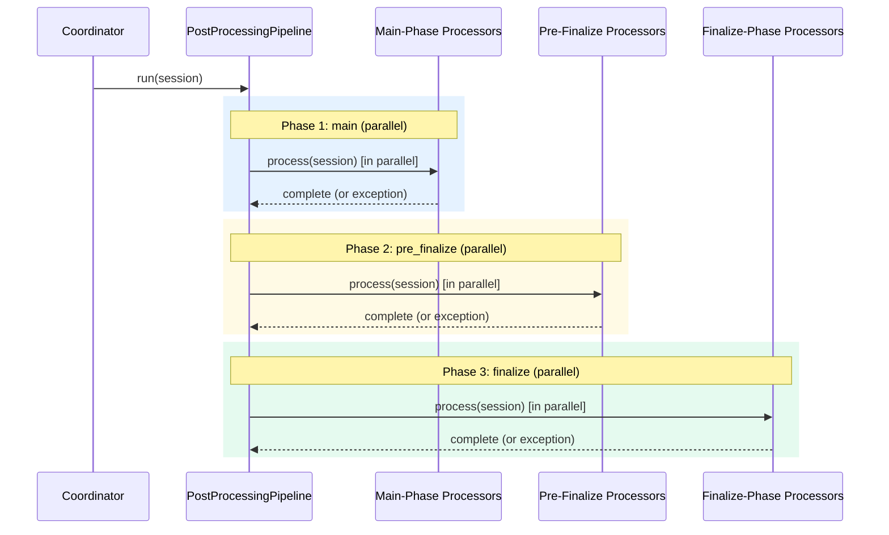
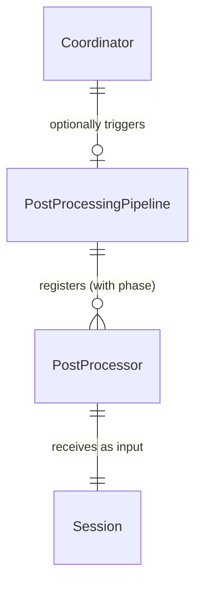

# Design: Post-Processing Pipeline

<!-- This design describes the current implementation approach. Updated through delta reconciliation. -->

**Feature Spec**: [../../feature-specs/agent/post-processing-pipeline.md](../../feature-specs/agent/post-processing-pipeline.md)
**Status**: Current

## Purpose

This document explains the design rationale for the post-processing pipeline: the phased execution mechanism, processor interface, shared helpers, and how it integrates with the coordinator.

## Problem Context

After a conversation ends, various post-processing tasks need to run — memory extraction, git commits, future tasks. These tasks must run in parallel for efficiency, but some tasks depend on others completing first (e.g., git commits need to see all memory file writes). A single flat parallel execution model doesn't support ordering constraints.

**Constraints:**
- Pipeline is domain-agnostic — knows nothing about what processors do
- Must be backward-compatible — existing processors should work without changes
- Individual processor failures must not affect others
- Must support ordering constraints between groups of processors

**Interactions:**
- Coordinator (`core-architecture`): triggers `pipeline.run(session)` on session close
- Memory processors (`memory-extraction`): register in `main` phase
- Projects processor (`project-management`): registers in `pre_finalize` phase
- Stale workflow cleanup processor (`workflows/workflow-state-machine`): registers in `pre_finalize` phase
- Git processor (`workspace-version-tracking`): registers in `finalize` phase

## Design Overview

A `PostProcessingPipeline` manages registered `PostProcessor` instances across sequential phases. Processors declare their phase at registration (defaulting to `main` for backward compatibility). The pipeline runs phases in order — `main → pre_finalize → finalize` — with processors within each phase executing in parallel via `asyncio.gather`.

A parallel concept — the `MessagePostProcessingPipeline` — follows a similar structural pattern (processor ABC, serialized execution, error isolation) but as a separate implementation with a distinct per-message processor interface. Unlike this pipeline, it has no phased execution. See [boundary detection design](boundary-detection.md) for details.

```
┌───────────────────────────────────────────────────────────┐
│             PostProcessingPipeline                        │
│             (src/tachikoma/post_processing.py)            │
│                                                           │
│  run(session):                                            │
│    async with lock:    ◄── serializes concurrent runs     │
│      for each phase in [main, pre_finalize, finalize]:    │
│        await gather(                                      │
│          *phase_processors,                               │
│          return_exceptions=True                           │
│        )                                                  │
└───────────────────────────────────────────────────────────┘
```

A `PromptDrivenProcessor` base class (DES-004) standardizes the pattern for processors that fork the SDK session with a prompt. Accepts optional `tools` and `allow` parameters for restricting the forked agent's tool set and file path access via `dontAsk` permission mode (DES-004). Simple processors inherit `process()` from the base; complex processors override it for pre/post steps while still using `fork_and_consume()` internally. The base `process()` method automatically applies resumption-aware prompt augmentation via `augment_prompt_for_resumption()` when `session.last_resumed_at` is set.

A standalone `fork_and_consume()` helper encapsulates the SDK session forking pattern, available to any processor that needs to fork a session. It accepts optional `mcp_servers`, `system_prompt_append`, `tools`, and `allow` parameters. When `tools` and `allow` are provided, the forked agent uses `dontAsk` permission mode with explicit allow rules instead of `bypassPermissions`. A companion `fork_and_capture()` helper follows the same pattern but returns the captured response text.

## Components

### Implementation Structure

| Layer/Component | Responsibility | Key Decisions |
|-----------------|----------------|---------------|
| `src/tachikoma/post_processing.py` | `PostProcessor` ABC (interface only), `PromptDrivenProcessor` base class (DES-004, accepts `tools`/`allow` for permission scoping), `PostProcessingPipeline` class (with phased execution), `_build_permissions_settings(allow)` helper for serializing allow rules to settings JSON, `fork_and_consume` standalone helper (with optional `mcp_servers`, `system_prompt_append`, `tools`, `allow`), `fork_and_capture` standalone helper (same parameters, returns captured text), `augment_prompt_for_resumption(prompt, session)` shared helper, phase constants | Separate module from any processor domain; ABC has no SDK coupling; `PromptDrivenProcessor` standardizes the fork pattern with built-in resumption awareness and permission scoping; fork helpers use standalone `query()` with `dontAsk` mode when tools/allow are provided; pipeline supports sequential phases for ordering dependencies |

### Cross-Layer Contracts


```mermaid
sequenceDiagram
    participant Coordinator
    participant Pipeline as PostProcessingPipeline
    participant MainProcs as Main-Phase Processors
    participant PreFinalProcs as Pre-Finalize Processors
    participant FinalProcs as Finalize-Phase Processors

    Coordinator->>Pipeline: run(session)

    rect rgba(0, 128, 255, 0.1)
        Note over Pipeline,MainProcs: Phase 1: main (parallel)
        Pipeline->>MainProcs: process(session) [in parallel]
        MainProcs-->>Pipeline: complete (or exception)
    end

    rect rgba(255, 200, 0, 0.1)
        Note over Pipeline,PreFinalProcs: Phase 2: pre_finalize (parallel)
        Pipeline->>PreFinalProcs: process(session) [in parallel]
        PreFinalProcs-->>Pipeline: complete (or exception)
    end

    rect rgba(0, 200, 100, 0.1)
        Note over Pipeline,FinalProcs: Phase 3: finalize (parallel)
        Pipeline->>FinalProcs: process(session) [in parallel]
        FinalProcs-->>Pipeline: complete (or exception)
    end
```

**Integration Points:**
- Coordinator ↔ Pipeline: `pipeline.run(session)` in `__aexit__` (shutdown), idle post-processing, and topic shifts. Callers check `pipeline.needs_processing(session, last_message_time)` before calling `run()` to skip when already processing or already processed.
- Pipeline → SessionRegistry: `mark_processed(session.id)` after all phases complete (sets `processed_at` on the session)
- Pipeline ↔ Processors: `register(processor, phase="main"|"pre_finalize"|"finalize")`, `process(session)` called in parallel within each phase
- `fork_and_consume`: calls `query(prompt, options=ClaudeAgentOptions(resume=session.sdk_session_id, fork_session=True, ...))` — available to processors needing session context

**Error contract:**
- Individual processor failures caught by `asyncio.gather(return_exceptions=True)` and logged per DES-002
- Phase-level errors don't prevent subsequent phases — the finalize phase always runs even if the main phase has failures
- Pipeline failures in coordinator logged but never propagate — don't block shutdown
- Pipeline serializes concurrent invocations via `asyncio.Lock`

### Shared Logic

- **`PostProcessor` ABC** (`post_processing.py`): shared interface between all processors. Defines only the `process()` contract.
- **`PromptDrivenProcessor`** (`post_processing.py`): base class for processors that fork the SDK session with a prompt (DES-004). Stores `_prompt`, `_cwd`, `_tools`, `_allow`, and `_model`, implements `process()` via `augment_prompt_for_resumption()` + `fork_and_consume()`. At construction time, replaces `$WORKSPACE` placeholders in the prompt with the absolute workspace path (`str(agent_defaults.cwd)`). When `tools` and `allow` are provided, the forked agent uses `dontAsk` permission mode with explicit allow rules instead of `bypassPermissions`. The optional `model` constructor parameter lets a subclass pin the forked agent to a specific model tier (e.g. `"haiku"`); when omitted, the fork inherits the parent session's model. Simple subclasses inherit `process()`; complex subclasses override it for pre/post steps and must call `augment_prompt_for_resumption()` before `fork_and_consume()` to maintain resumption awareness, and pass `tools=self._tools, allow=self._allow, model=self._model` to maintain permission scoping and model selection.
- **`augment_prompt_for_resumption` function** (`post_processing.py`): standalone helper that appends a resumption boundary instruction to a prompt when `session.last_resumed_at` is set. Used by `PromptDrivenProcessor.process()` automatically; must be called explicitly by subclasses that override `process()`.
- **`_build_permissions_settings` function** (`post_processing.py`): serializes allow-only permission rules into a JSON string suitable for `ClaudeAgentOptions.settings`. Used by `fork_and_consume`, `fork_and_capture`, and `query_and_consume`.
- **`fork_and_consume` function** (`post_processing.py`): standalone helper encapsulating SDK `query()` forking pattern. Accepts optional `mcp_servers`, `system_prompt_append`, `tools`, `allow`, and `model` parameters. When `tools`/`allow` are provided, switches from `bypassPermissions` to `dontAsk` mode with the allow rules set as settings. When `model` is provided, that model alias is set on the forked `ClaudeAgentOptions`; otherwise the fork inherits the parent session's model. Memory-extraction processors (`EpisodicProcessor`, `FactsProcessor`, `PreferencesProcessor`) opt in to `model="haiku"` to keep fork-time cost low; `CoreContextProcessor` leaves the model unset because its reasoning task benefits from the parent's higher-tier model.
- **`fork_and_capture` function** (`post_processing.py`): same as `fork_and_consume` but returns the captured response text instead of discarding it. Same optional `model` parameter semantics.
- **`Session` dataclass** (`sessions/model.py`): shared input to the pipeline — processors read `sdk_session_id`.
- **Phase constants** (`post_processing.py`): `MAIN_PHASE = "main"`, `PRE_FINALIZE_PHASE = "pre_finalize"`, `FINALIZE_PHASE = "finalize"` — centralized alongside pipeline validation logic.

## Modeling

```
PostProcessingPipeline
├── _registry: SessionRegistry               (required — for mark_processed after completion)
├── _phases: dict[str, list[PostProcessor]]  (processors grouped by phase)
├── _phase_order: list[str]                  (["main", "pre_finalize", "finalize"])
├── _lock: asyncio.Lock                      (serializes concurrent runs)
├── _is_processing: bool                     (transient flag, True during run())
├── is_processing: property                  (exposes _is_processing)
├── needs_processing(session, last_message_time) → bool  (False if processing or processed_at >= last_message_time)
├── register(processor, phase="main") → None (validates phase, appends)
└── run(session: Session) → None             (sets is_processing, phases sequential, processors parallel, mark_processed on completion)

PostProcessor (ABC)
└── process(session: Session) → None     (abstract)

PromptDrivenProcessor(PostProcessor)                    [DES-004]
├── _prompt: str                    ($WORKSPACE replaced with absolute path at __init__)
├── _cwd: Path
├── _tools: list[str] | None       (tool restriction list)
├── _allow: list[str] | None       (allow-only permission rules)
└── process(session) → augment_prompt_for_resumption(prompt, session) + fork_and_consume(session, prompt, defaults, tools, allow)

augment_prompt_for_resumption(prompt: str, session: Session) → str  (standalone helper)
└── If session.last_resumed_at is set, appends resumption boundary instruction
    If None, returns prompt unchanged

_build_permissions_settings(allow: list[str]) → str  (standalone helper, serializes allow rules to settings JSON)

fork_and_consume(session, prompt, defaults, mcp_servers=None, system_prompt_append=None, tools=None, allow=None) → None
└── When tools+allow provided: dontAsk mode with allow rules; otherwise: bypassPermissions

fork_and_capture(session, prompt, defaults, system_prompt_append=None, tools=None, allow=None) → str
```


```mermaid
erDiagram
    PostProcessingPipeline ||--o{ PostProcessor : "registers (with phase)"
    PostProcessor ||--|| Session : "receives as input"
    Coordinator ||--o| PostProcessingPipeline : "optionally triggers"
```

## Data Flow

### Pipeline execution flow

```
1. pipeline.run(session) acquires asyncio.Lock
2. For each phase in ["main", "pre_finalize", "finalize"]:
   a. Collect processors registered for this phase
   b. If none → skip phase
   c. Run all via asyncio.gather(return_exceptions=True)
   d. Log exceptions per-processor with phase context (DES-002):
      "Processor failed: processor={name} phase={phase} err={err}"
3. Releases lock
```

## Key Decisions

### Pipeline separate from processor domains

**Choice**: `PostProcessingPipeline` and `PostProcessor` live in `src/tachikoma/post_processing.py`, separate from `memory/` and `git/`.
**Why**: The pipeline is reusable — features register processors without touching other domains' code. Separating mechanism from domain follows the same pattern as `bootstrap.py` (mechanism) vs subsystem hooks.
**Alternatives Considered**:
- Single `memory/` package: simpler but couples reusable pipeline to memory

**Consequences**:
- Pro: Clean separation — pipeline is domain-agnostic
- Pro: Future processors import from `post_processing.py`, not any specific domain
- Pro: Consistent with bootstrap mechanism-vs-hook pattern

### Phased execution via registration parameter

**Choice**: `register(processor, phase="main")` with default for backward compatibility.
**Why**: The pipeline controls phase knowledge, not individual processors. The ABC stays clean (no phase property). Existing callers don't change — `register(proc)` defaults to `"main"`.
**Alternatives Considered**:
- ABC property (couples processor to phase concept)
- Separate register methods (less extensible)

**Consequences**:
- Pro: Zero changes to existing `register()` calls
- Pro: ABC stays generic — processors don't know about phases
- Pro: Phase ordering is pipeline's responsibility

### Phase set as a fixed collection

**Choice**: Valid phases are `["main", "pre_finalize", "finalize"]` — a fixed list validated at registration.
**Why**: Three phases support ordering constraints: regular processing, then pre-finalization tasks (e.g., submodule commits), then cleanup/finalization (e.g., workspace commits). Validation at registration catches typos immediately.

**Consequences**:
- Pro: Typos caught at startup, not at runtime
- Con: Adding a new phase requires a code change (acceptable)

### ABC with standalone fork helper

**Choice**: `PostProcessor` ABC with only `process()`. Shared forking logic in standalone `fork_and_consume()`.
**Why**: ABC defines interface contract. Fork helper is convenience for processors needing SDK session forking. Standalone avoids coupling ABC to SDK's `query()`.
**Alternatives Considered**:
- Plain callable: lacks structure
- ABC with fork as method: couples interface to SDK

**Consequences**:
- Pro: `PostProcessor` ABC is truly generic — no SDK coupling
- Pro: `fork_and_consume` available to any processor
- Pro: Future processors can implement `process()` without inheriting forking behavior

### PromptDrivenProcessor convenience base class

**Choice**: Introduce `PromptDrivenProcessor(PostProcessor)` base class that stores prompt + cwd and implements `process()` via `fork_and_consume()` (DES-004).
**Why**: All prompt-driven processors follow the same pattern: store a prompt, call `fork_and_consume()`. The base class eliminates identical boilerplate. Complex processors override `process()` for pre/post steps.

**Consequences**:
- Pro: Simple subclasses become near-empty — just a prompt constant and `super().__init__()` call
- Pro: Complex processors override `process()` naturally and call `fork_and_consume()` directly
- Pro: Standardized pattern across all prompt-driven processors

### Permission scoping via dontAsk mode

**Choice**: Sub-agents use `dontAsk` permission mode with allow-only rules instead of `bypassPermissions`. Each processor declares its tool set and allowed paths explicitly (DES-004).
**Why**: `bypassPermissions` grants unrestricted access. `dontAsk` auto-denies anything not explicitly allowed — ideal for headless sub-agents with specific purposes. Two-layer restriction: `tools` limits available tools, allow rules restrict paths/commands.
**Alternatives Considered**:
- `bypassPermissions` with deny rules: deny-first evaluation means deny always wins over allow — can't express "deny all except specific path"
- `can_use_tool` callback: requires `AsyncIterable` prompts, more complex
- PreToolUse hooks: more code, same effect as allow rules

**Consequences**:
- Pro: Each agent's scope is auditable from its constructor
- Pro: `dontAsk` + allow rules is declarative — no custom callback code
- Pro: Prompts include a Permissions section so agents understand their boundaries
- Con: Glob/Grep don't support path-specific allow rules (allowed unrestricted)

## System Behavior

### Scenario: Normal phased execution

**Given**: Memory processors registered in main phase, projects processor in pre_finalize phase, git processor in finalize phase
**When**: Pipeline runs
**Then**: Main-phase processors execute in parallel. After all complete, pre_finalize-phase processors execute. After those complete, finalize-phase processors execute. Error isolation applies per-processor and across phases.

### Scenario: Main-phase failure doesn't block finalize

**Given**: A main-phase processor throws an exception
**When**: Main phase completes
**Then**: The exception is logged. Finalize phase still runs with all its registered processors.

### Scenario: Empty phase

**Given**: No processors registered for the finalize phase
**When**: Pipeline runs
**Then**: Main phase runs normally. Finalize phase is skipped (no error).

### Scenario: Invalid phase at registration

**Given**: A processor is registered with `phase="cleanup"` (invalid)
**When**: `register()` is called
**Then**: `ValueError` raised immediately listing valid phases.

### Scenario: Stale workflow cleanup during session close

**Given**: An active workflow with `updated_at` older than 24 hours, and a `StaleWorkflowCleanupProcessor` registered in `pre_finalize` phase
**When**: The post-processing pipeline runs during session close
**Then**: The cleanup processor soft-deletes the stale workflow record and deletes its scratchpad file, committed atomically with the session's git commit
**Rationale**: Stale cleanup piggybacks on existing post-processing lifecycle, running in `pre_finalize` to ensure cleanup is committed before the git commit in `finalize`.

## Notes

- The pipeline's `asyncio.Lock` serialization prevents overlapping runs. The `is_processing` flag provides a non-blocking check for callers who want to skip rather than wait.
- `is_processing` is set before the lock (for immediate caller visibility) and cleared in a `finally` block.
- `mark_processed` is called inside the lock block — if an unexpected error exits the lock early, the session is not incorrectly marked as processed.
- `fork_and_consume` fully consumes the async iterator, ensuring the forked session ends cleanly.
- The background task executor (`tasks/executor.py`) creates a separate `PostProcessingPipeline` instance with only `EpisodicProcessor` (main phase) and `GitProcessor` (finalize phase) — this is a distinct pipeline from the main conversation pipeline assembled in `__main__.py`. For synthetic sessions (background tasks), `mark_processed` is a no-op (session ID not in the database). See [background task execution design](../tasks/background-task-execution.md).
