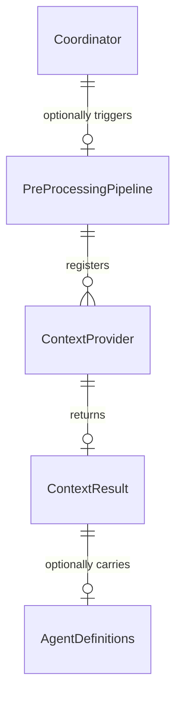

# Design: Pre-Processing Pipeline

<!-- This design describes the current implementation approach. Updated through delta reconciliation. -->

**Feature Spec**: [../../feature-specs/agent/pre-processing-pipeline.md](../../feature-specs/agent/pre-processing-pipeline.md)
**Status**: Current

## Purpose

This document explains the design rationale for the pre-processing pipeline: the parallel execution mechanism, context provider interface, context assembly, and how it integrates with the coordinator.

For the memory context provider that plugs into this pipeline, see the [memory context retrieval design](../memory/memory-context-retrieval.md).

## Problem Context

Before the coordinator processes a user message, context providers need to run in parallel to gather relevant information (memories, skills, etc.) and inject it into the message. Each provider is independent and domain-specific, but the pipeline mechanism itself must be domain-agnostic.

**Constraints:**
- Pipeline is domain-agnostic — knows nothing about what providers do
- Individual provider failures must not affect others or block the message
- Context injection must use XML tags consistent with the `<soul>`, `<user>`, `<agents>` convention (per ADR-008)
- Pipeline is stateless — no serialization lock needed (unlike post-processing, which serializes concurrent invocations)

**Interactions:**
- Coordinator (`core-architecture`): calls `pipeline.run(message)` on first message of new session; persists successful results as context entries to the database (owner=result.tag, content=result.content) for system prompt assembly. The `assemble_context()` function is used by the background task executor (`tasks/executor.py`) which does not use database persistence.
- Memory context provider (`memory-context-retrieval`): registers as the first provider (see [memory context retrieval design](../memory/memory-context-retrieval.md))
- Projects context provider (`project-management`): registers alongside other providers, returns both text context and MCP server configurations (see [project-management design](project-management.md))
- Skills context provider (`skills`): registers alongside other providers, classifies and injects relevant skills (see [skills design](skills.md))

## Design Overview

A `PreProcessingPipeline` manages registered `ContextProvider` instances. Providers are run in parallel via `asyncio.gather`. The coordinator persists successful results as session context entries to the database and assembles them into the system prompt via `build_system_prompt()`. A standalone `assemble_context()` function wraps results in XML tags and prepends them to a message, used by the background task executor which does not use database persistence.

```
┌──────────────────────────────────────────────────────────────────┐
│                    PreProcessingPipeline                         │
│                    (src/tachikoma/pre_processing.py)             │
│                                                                  │
│  ContextProvider ABC ──► ContextResult(tag, content, agents=None) │
│                                                                  │
│  run(message):                                                   │
│    await gather(                                                 │
│      *[provider.provide(message) for provider in providers],     │
│      return_exceptions=True                                      │
│    )                                                             │
│    → list[ContextResult]  (successful, non-None results)         │
│                                                                  │
│  assemble_context(results, message) → enriched message           │
└──────────────────────────────────────────────────────────────────┘
```

## Components

### Implementation Structure

| Layer/Component | Responsibility | Key Decisions |
|-----------------|----------------|---------------|
| `src/tachikoma/pre_processing.py` | `ContextProvider` ABC (interface only), `ContextResult` dataclass (with `__post_init__` tag validation via regex, optional `agents` field for structured data), `PreProcessingPipeline` class (parallel execution with error isolation), `assemble_context()` standalone function | Mirrors `post_processing.py` pattern — mechanism separate from domain; assembly function is a pure standalone helper; no serialization lock needed (unlike post-processing) because the pipeline is stateless; `agents` field uses a specific named property (not generic extras) for type safety |

### Cross-Layer Contracts

```mermaid
sequenceDiagram
    participant Coordinator
    participant Pipeline as PreProcessingPipeline
    participant Providers as Context Providers

    Coordinator->>Pipeline: run(message)
    Pipeline->>Providers: provide(message) [in parallel]
    Providers-->>Pipeline: ContextResult or None (or exception)
    Pipeline-->>Coordinator: list[ContextResult]
    Note over Coordinator: persist results as context entries to DB; build_system_prompt() for system prompt assembly
```

**Integration Points:**
- Coordinator ↔ Pipeline: `pipeline.run(message)` returns `list[ContextResult]`; called in `send_message()` before `client.query()`
- Pipeline ↔ Providers: `register(provider)` at setup; `provide(message)` called in parallel during `run()`
- Coordinator ↔ DB: persists successful results as context entries (owner=result.tag, content=result.content); loads entries and calls `build_system_prompt()` before `_build_options()`
- Task executor ↔ assemble_context: pure function call to format enriched message (non-DB path)

**Error contract:**
- Individual provider failures caught by `asyncio.gather(return_exceptions=True)` and logged per DES-002
- Pipeline failures in coordinator logged but don't propagate — message proceeds unmodified

### Shared Logic

- **`ContextProvider` ABC** (`pre_processing.py`): shared interface between all context providers. Defines only the `provide()` contract.
- **`ContextResult` dataclass** (`pre_processing.py`): shared return type for all providers. Tag name validated via regex to ensure valid XML tag format (starts with letter/underscore, contains only alphanumeric, hyphens, underscores). Optional `mcp_servers` field allows providers to pass MCP server configurations to the coordinator alongside text context. Optional `agents` field allows providers to return agent definitions alongside text context.
- **`assemble_context()` function** (`pre_processing.py`): standalone helper for wrapping results in XML tags and prepending to message.

## Modeling

```
PreProcessingPipeline
├── _providers: list[ContextProvider]
├── register(provider: ContextProvider) → None
└── run(message: str) → list[ContextResult]

ContextProvider (ABC)
└── provide(message: str) → ContextResult | None  (abstract)

ContextResult (dataclass)
├── tag: str                                           (validated: non-empty + valid XML tag name via regex)
├── content: str                                       (provider's output text)
├── mcp_servers: dict[str, McpServerConfig] | None     (optional MCP server configs for coordinator)
└── agents: dict[str, AgentDefinition] | None = None   (optional structured data for agent definitions)

assemble_context(results: list[ContextResult], message: str) → str  (standalone, handles text only)
```



## Data Flow

### Pipeline execution flow

```
1. pipeline.run(message) is called
2. If no providers registered → return empty list immediately
3. Run all providers via asyncio.gather(return_exceptions=True)
4. Iterate results:
   - Exceptions logged per DES-002: "Provider failed: provider={name} err={err}"
   - None results filtered out
   - ContextResult instances collected
5. Return list of successful ContextResult instances
```

### Context assembly flow

```
1. assemble_context(results, message) is called
2. If no results → return original message unchanged
3. For each result: wrap in XML tags (<{tag}>\n{content}\n</{tag}>)
4. Join blocks with blank lines
5. Append original message after blank line
6. Return enriched message
```

## Key Decisions

### Pipeline separate from provider domains

**Choice**: `PreProcessingPipeline` and `ContextProvider` live in `src/tachikoma/pre_processing.py`, separate from `memory/` and future provider domains.
**Why**: The pipeline is reusable — providers register without touching other domains' code. Separating mechanism from domain follows the same pattern as `post_processing.py` (mechanism) vs memory/git processor modules.

**Consequences**:
- Pro: Clean separation — pipeline is domain-agnostic
- Pro: Future providers import from `pre_processing.py`, not any specific domain
- Pro: Consistent with post-processing pipeline pattern

### Pre-processing pipeline separate from post-processing

**Choice**: Create `pre_processing.py` as a separate module from `post_processing.py`, with its own ABC and pipeline class.
**Why**: Despite architectural parallels, the two pipelines have fundamentally different data flow: pre-processing receives a message string and returns results (`list[ContextResult]`), while post-processing receives a `Session` and performs side effects (void). Separate modules keep each pipeline's contract clear.

**Consequences**:
- Pro: Clear, focused contracts for each pipeline
- Pro: Each module is self-contained and easy to understand
- Con: Some structural duplication (both have ABC + Pipeline + helper)

### No serialization lock

**Choice**: No `asyncio.Lock` in the pre-processing pipeline, unlike the post-processing pipeline.
**Why**: The pipeline is stateless — it simply runs providers and collects results. Concurrent session creation is prevented by the session registry, so concurrent first-messages are not possible. The post-processing pipeline uses a lock because it serializes shutdown-triggered runs, which is a different lifecycle concern.

**Consequences**:
- Pro: Simpler implementation
- Pro: No unnecessary synchronization overhead

### Non-deterministic context block ordering

**Choice**: Context blocks are assembled in the order results are collected from `asyncio.gather()` — no explicit ordering.
**Why**: The order of XML context blocks in the enriched message does not affect correctness. The main agent receives all blocks regardless of order. If ordering becomes important (e.g., memories should appear before skills), a priority/ordering mechanism can be added to `assemble_context()` later.

**Consequences**:
- Pro: Simpler implementation — no ordering logic needed
- Con: Block order may vary between runs (cosmetic, not functional)

### Specific named property for structured data

**Choice**: Add `agents: dict[str, AgentDefinition] | None = None` as a specific named field on `ContextResult`, not a generic extras dict.
**Why**: Type-safe and self-documenting. The coordinator knows exactly what property to read without runtime type narrowing or key lookups. Backward compatible — existing providers don't set it, defaults to None.
**Alternatives Considered**:
- Generic `extras: dict[str, Any] | None`: Flexible but weakly typed; consumption requires `isinstance` checks
- Separate `ContextResultWithAgents` subclass: Breaks uniform `list[ContextResult]` return type

**Consequences**:
- Pro: Type-safe at both production (provider) and consumption (coordinator)
- Pro: Backward compatible — default None means existing providers unchanged
- Con: Adding new structured data in the future requires a new field on ContextResult (acceptable — each extension is explicit)
- Con: Introduces `AgentDefinition` import from `claude_agent_sdk.types` into `pre_processing.py` — an intentional tradeoff for type safety

### XML tag validation via regex

**Choice**: `ContextResult.__post_init__` validates tag names against a regex pattern (`^[a-zA-Z_][a-zA-Z0-9_-]*$`), checking both non-emptiness and valid XML tag name conformance.
**Why**: Invalid tag names (spaces, special characters, leading numbers) would produce malformed XML in the assembled context. Validating at construction time catches errors early.

**Consequences**:
- Pro: Catches malformed tags at construction, not at assembly time
- Pro: Clear error messages for invalid tags

## System Behavior

### Scenario: Normal parallel execution

**Given**: Multiple context providers registered
**When**: Pipeline runs
**Then**: All providers execute in parallel. Successful results are collected. The coordinator assembles them into XML-tagged blocks and prepends to the message.

### Scenario: Provider failure doesn't block others

**Given**: A provider raises an exception
**When**: Other providers are running
**Then**: The exception is caught by `asyncio.gather(return_exceptions=True)` and logged. Other providers complete normally.

### Scenario: No providers registered

**Given**: PreProcessingPipeline exists but has no registered providers
**When**: The pipeline runs
**Then**: Returns an empty list immediately. The message proceeds unmodified.

### Scenario: All providers fail

**Given**: All registered providers raise exceptions
**When**: The pipeline collects results
**Then**: All failures are logged. Returns an empty list. The message proceeds unmodified.

### Scenario: Pipeline not configured

**Given**: Coordinator created without a pre-processing pipeline (`pre_pipeline=None`)
**When**: A message arrives
**Then**: Pre-processing step is skipped entirely. Behavior is identical to before pre-processing was added.

## Notes

- The pipeline supports both text context and structured data (via the `mcp_servers` and `agents` fields on `ContextResult`). The coordinator persists text context as session context entries to the database and assembles them into the system prompt via `build_system_prompt()`. The `assemble_context()` function is retained for the background task executor path, which does not use database persistence. The coordinator extracts and merges both `mcp_servers` and `agents` from all results per-session, stores them, and passes them to `ClaudeAgentOptions` in `_build_options()`.
- Unlike post-processing, the pre-processing pipeline has no concurrency control. This is deliberate — the pipeline is stateless, and concurrent first-messages are prevented by the session registry.
