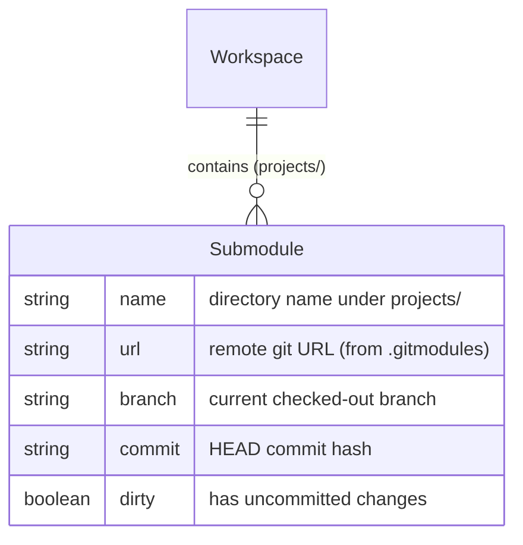
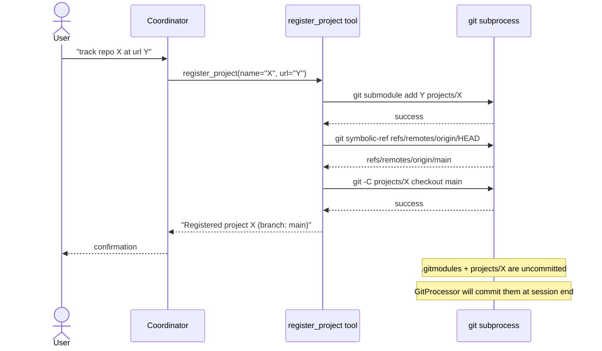
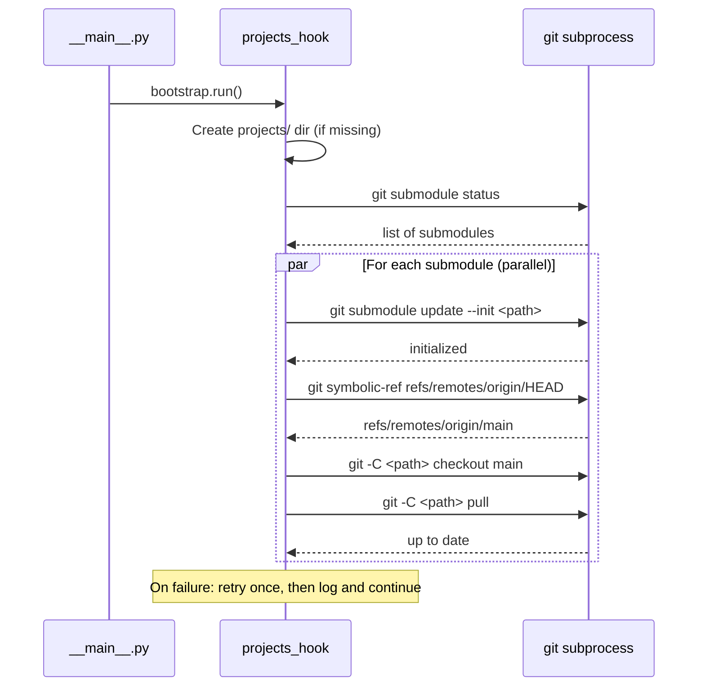
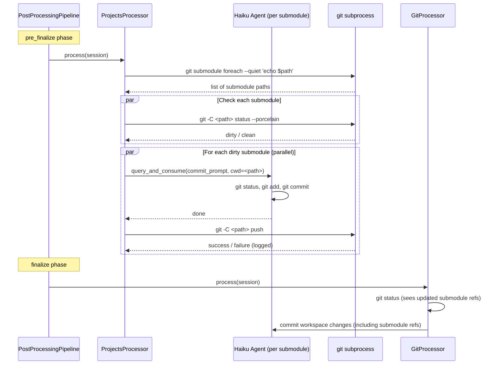

# Design: Project Management

<!-- This design describes the current implementation approach. Updated through delta reconciliation. -->

**Feature Spec**: [../../feature-specs/agent/project-management.md](../../feature-specs/agent/project-management.md)
**Status**: Current

## Purpose

This document explains the design rationale for project management: how external repositories are managed as git submodules, how they integrate with the bootstrap, post-processing, and pre-processing pipelines, and how MCP tools enable registration/deregistration during conversations.

## Problem Context

The assistant operates within a single workspace git repository that tracks internal state (memories, context files, configuration). Users want the assistant to also manage external code repositories — checking out projects, making changes, and contributing back — alongside this workspace.

**Constraints:**
- External repos must not pollute the workspace's internal git history with unrelated file changes
- The workspace git history should track *which version* of each external repo is checked out (for reproducibility)
- Multiple submodules must be synced, committed, and pushed without creating a sequential bottleneck
- Git authentication is the user's responsibility — the system must fail clearly on auth errors, not silently
- The coordinator agent must be able to register/deregister projects during live conversations (not just in post-processing)

Git submodules satisfy the first two constraints natively: they isolate each project's history while recording the checked-out commit in the parent repo's tree.

**Interactions:**
- Workspace bootstrap ([workspace-bootstrap design](workspace-bootstrap.md)): projects hook runs after git hook in registration order
- Post-processing pipeline ([post-processing-pipeline design](post-processing-pipeline.md)): projects processor runs in `pre_finalize` phase, before GitProcessor in `finalize`
- Pre-processing pipeline ([pre-processing-pipeline design](pre-processing-pipeline.md)): projects context provider registers alongside other providers
- Workspace version tracking ([workspace-version-tracking design](workspace-version-tracking.md)): GitProcessor commits submodule reference updates
- Core architecture ([core-architecture design](core-architecture.md)): coordinator extracts `mcp_servers` from pipeline results per-session

## Design Overview

A `projects` package (`src/tachikoma/projects/`) with five components, plus a system prompt section:

1. **System prompt preamble** — permanent "Projects" section in `SYSTEM_PREAMBLE` (`context/loading.py`) explaining the projects system, available MCP tools, and structure — ensures baseline understanding before any runtime context is injected
2. **Bootstrap hook** — creates `projects/` dir, initializes and pulls all submodules on startup
3. **Post-processor** — commits and pushes dirty submodules at session end, before GitProcessor
4. **Context provider** — injects project awareness and MCP tools at session start
5. **MCP tools** — `register_project` and `deregister_project` available to coordinator during conversations
6. **Git helpers** — shared async subprocess wrappers for submodule operations

```
┌─────────────────────────────────────────────────────────────────┐
│                        __main__.py                              │
│  registers: hook, processor, context provider                   │
└─────────┬──────────┬──────────────┬──────────────┬──────────────┘
          │          │              │              │
     ┌────▼────┐ ┌──▼───────┐ ┌───▼────────┐ ┌───▼──────────┐
     │ Hook    │ │ Processor│ │ Context    │ │ MCP Tools    │
     │ (boot)  │ │ (post)   │ │ Provider   │ │ (coordinator)│
     └────┬────┘ └────┬─────┘ └─────┬──────┘ └──────┬───────┘
          │           │             │                │
          └───────────┴─────────────┴────────────────┘
                              │
                      ┌───────▼───────┐
                      │  git helpers  │
                      │  (shared)     │
                      └───────────────┘
```

No database entities. Project state is entirely filesystem-derived — `.gitmodules` is the registry, git status is the source of truth.

## Components

### Implementation Structure

| Layer/Component | Responsibility | Key Decisions |
|-----------------|----------------|---------------|
| `src/tachikoma/projects/__init__.py` | Package exports | Re-exports hook, processor, provider, server factory |
| `src/tachikoma/projects/hooks.py` | Bootstrap hook (`projects_hook`) | Follows DES-003; runs after git hook in registration order |
| `src/tachikoma/projects/processor.py` | `ProjectsProcessor` post-processor | Extends `PostProcessor` directly (not `PromptDrivenProcessor` — no session fork needed); session param unused; registered in `pre_finalize` phase |
| `src/tachikoma/projects/context_provider.py` | `ProjectsContextProvider` pre-processor | Extends `ContextProvider`; always returns a `ContextResult` (never `None`) with MCP tools and project info or guidance text |
| `src/tachikoma/projects/tools.py` | MCP tool server factory (DES-006) + extracted handlers | Factory `create_projects_server(workspace_path)` defines tools via closure; `handle_register_project()` and `handle_deregister_project()` extracted for testability |
| `src/tachikoma/projects/git.py` | Shared async git helpers | Pure subprocess wrappers; no SDK dependency |

### Cross-Layer Contracts

**MCP Tool Contract — `register_project`:**
```
Input:  { "name": str, "url": str }
Output: { "content": [{"type": "text", "text": "..."}] }
        | { "content": [...], "is_error": true }
```

**MCP Tool Contract — `deregister_project`:**
```
Input:  { "name": str, "force": bool (default false) }
Output: { "content": [{"type": "text", "text": "..."}] }
        | { "content": [...], "is_error": true }
```

**Context Provider Contract — `ProjectsContextProvider`:**
```
Input:  message: str (unused — projects context is static per session)
Output: ContextResult(
          tag="projects",
          content="<project list or guidance>",
          mcp_servers={"projects": McpSdkServerConfig}
        )
        (always returns a ContextResult, never None — MCP tools must be available
         even before any project is registered)
```

**Integration Points:**
- Bootstrap hook writes to `BootstrapContext.extras` — no direct coupling to other components
- Processor uses `query_and_consume()` from `git/processor.py` — reuses existing pattern for spawning commit agents (DES-005)
- MCP tools and context provider both read filesystem state independently — no shared mutable state
- Error isolation: each component handles its own failures (log + continue) without affecting others

### Shared Logic

- **`projects/git.py`**: Centralizes all git subprocess calls. Used by hooks (init/pull), processor (status/push), tools (add/remove), and context provider (branch detection). Avoids duplicating subprocess boilerplate and ensures consistent error handling across components.
- **`git/processor.py:query_and_consume()`**: Reused by `ProjectsProcessor` to spawn Haiku commit agents. Not duplicated — imported directly. Note: this creates a `projects` → `git` cross-subsystem import for a generic utility function. Acceptable for now; if more subsystems need fresh agent spawning, extract to a shared module.

**Submodule commit prompt**: The processor uses a dedicated `SUBMODULE_COMMIT_PROMPT` constant (not the workspace-specific `GIT_COMMIT_PROMPT`). The submodule prompt instructs the Haiku agent to: (1) read recent `git log` entries to learn the project's commit style and conventions, (2) check for any commit instructions in the repo (CONTRIBUTING.md, CLAUDE.md, etc.), (3) inspect `git status` and `git diff`, (4) group changes by purpose/directory, (5) create descriptive commits following the project's own commit style. Unlike the workspace prompt, it does **not** reference workspace-specific directories (`memories/`, `context/`).

## Modeling

No database entities. Project state is entirely filesystem-derived:



**State sources:**
- **Registry**: `.gitmodules` file (managed by `git submodule add/remove`)
- **Current branch**: `git -C <path> symbolic-ref --short HEAD` (or commit hash if detached)
- **Dirty status**: `git -C <path> status --porcelain`
- **Default branch**: `git -C <path> symbolic-ref refs/remotes/origin/HEAD` (after fetch)

## Data Flow

### Registration Flow



### Startup Sync Flow



### Session-End Commit/Push Flow



## Key Decisions

### New `pre_finalize` Pipeline Phase

**Choice**: Add a third phase `pre_finalize` between `main` and `finalize` in `PostProcessingPipeline`.
**Why**: The projects processor must complete before `GitProcessor` so that submodule reference updates are included in the workspace commit. Within a phase, processors run in parallel — there's no ordering guarantee. A new phase provides clean sequential ordering without changing the parallel semantics of existing phases.
**Alternatives Considered**:
- Sequential execution within finalize: Would change existing finalize semantics; any future finalize processor would also be forced sequential.
- Composite processor (GitProcessor calls projects internally): Couples unrelated concerns; breaks single-responsibility.

**Consequences**:
- Pro: Minimal change (add constant to `_VALID_PHASES` and `_phase_order`); clean phase separation
- Con: Pipeline now has three phases instead of two; slight additional complexity in phase model

### MCP Tools via ContextResult (Pipeline-Driven Pattern)

**Choice**: Extend `ContextResult` with an optional `mcp_servers` field. The `ProjectsContextProvider` creates the MCP server internally and returns it alongside text context. The coordinator extracts `mcp_servers` from pipeline results and stores them per-session, passing to `ClaudeAgentOptions` in `_build_options()`.
**Why**: Context providers become the single entry point for injecting both knowledge (text) and capabilities (MCP tools) into the coordinator. This avoids adding ad-hoc parameters to the Coordinator constructor for each new capability type.
**Alternatives Considered**:
- Add `mcp_servers` parameter directly to `Coordinator.__init__()`: Works but creates a separate wiring path outside the pipeline. Each new capability type would need another constructor parameter.

**Consequences**:
- Pro: Coordinator constructor stays clean — no per-capability parameters needed
- Pro: MCP servers are session-scoped (created fresh each session) with automatic cleanup on transition
- Con: Introduces `McpSdkServerConfig` type import into `pre_processing.py`

### Fresh `query()` for Submodule Commits (Not Session Fork)

**Choice**: Use `query_and_consume()` (fresh agent, no session fork) to generate commits per submodule, matching the `GitProcessor` pattern.
**Why**: Commit generation doesn't need conversation context — it only needs to inspect the submodule's git status and create descriptive commits. A fresh Haiku agent is cheaper and faster than forking the full session. This exactly matches how `GitProcessor` already works.
**Alternatives Considered**:
- Direct `git add -A && git commit` via subprocess: Simpler but produces generic single commits without intelligent grouping by purpose.
- Single agent for all submodules: Would process sequentially; violates R4.3 (no sequential bottleneck).

**Consequences**:
- Pro: Consistent with existing workspace commit pattern; descriptive grouped commits; parallel execution
- Con: One Haiku agent call per dirty submodule (cost scales with number of dirty submodules)

### Default Branch via `git symbolic-ref`

**Choice**: Resolve default branch using `git symbolic-ref refs/remotes/origin/HEAD` after fetch/clone.
**Why**: This reads the locally cached remote HEAD reference — no network call needed after the initial clone/fetch. It's fast and reliable.
**Alternatives Considered**:
- `git remote show origin`: Makes a network call every time; slower and can fail if offline.
- `git ls-remote --symref <url> HEAD`: Requires the URL; always a network call.

**Consequences**:
- Pro: Fast (local read), no network dependency after initial clone
- Con: If the remote's default branch changes *after* clone, the local ref won't update until the next `git fetch` (which happens on every startup sync, so staleness is bounded)
- Edge case: `refs/remotes/origin/HEAD` may not exist on cold init. The git helpers include a three-tier fallback: `symbolic-ref` → `git remote show origin` → default to `"main"`

## System Behavior

### Scenario: First Project Registration

**Given**: No projects exist yet; `projects/` directory exists (created by bootstrap hook)
**When**: The coordinator calls `register_project(name="my-app", url="git@github.com:user/my-app.git")`
**Then**: The submodule is added under `projects/my-app`, checked out to the remote's default branch, and `.gitmodules` + `projects/my-app` appear as uncommitted changes in the workspace.
**Rationale**: The uncommitted state is intentional — `GitProcessor` will commit the submodule addition at session end.

### Scenario: Registration with Invalid URL

**Given**: The provided git URL is unreachable or requires unconfigured authentication
**When**: `register_project` calls `git submodule add`
**Then**: The subprocess fails; the tool cleans up any partial state (`git submodule deinit`, remove directory) and returns an error with the git stderr output.
**Rationale**: Partial state would break subsequent operations; cleanup ensures idempotent retry.

### Scenario: Startup with Conflicting Submodule

**Given**: A submodule has local unpushed commits that conflict with remote changes
**When**: The startup pull runs and `git pull` fails with merge conflict
**Then**: The failure is logged with details, the submodule is left in its pre-pull state, and other submodules continue syncing.
**Rationale**: The user must resolve conflicts manually; the system shouldn't silently discard local work.

### Scenario: Session End with Multiple Dirty Submodules

**Given**: Two submodules (`project-a`, `project-b`) have uncommitted changes; one submodule (`project-c`) is clean
**When**: The projects post-processor runs in `pre_finalize` phase
**Then**: `project-c` is skipped. `project-a` and `project-b` each get a Haiku agent spawned in parallel. After commits complete, each is pushed. If `project-b`'s push fails (e.g., non-fast-forward), the failure is logged and `project-a`'s push succeeds independently. Then `GitProcessor` runs in `finalize` and commits the updated submodule references.

### Scenario: Push Failure (Non-Fast-Forward)

**Given**: A submodule's remote has advanced since last pull
**When**: The push fails with non-fast-forward error
**Then**: The failure is logged. The local commits remain intact and will be reconciled on the next startup pull.
**Rationale**: Force-pushing would destroy remote work. The next startup sync will attempt to pull and merge.

### Scenario: No Submodules Registered

**Given**: No `.gitmodules` file exists or no submodules are configured
**When**: The bootstrap hook runs
**Then**: It creates `projects/` directory (idempotent) and completes as a no-op.

### Scenario: Deregistration with Uncommitted Changes

**Given**: `projects/my-app` has uncommitted modifications
**When**: `deregister_project(name="my-app")` is called without `force=true`
**Then**: The tool returns a warning listing the uncommitted changes and requires `force=true` to proceed.
**Rationale**: Prevents accidental data loss.

### Scenario: Context Injection with Detached HEAD

**Given**: A project's submodule is in detached HEAD state
**When**: The context provider runs
**Then**: It reports the short commit hash instead of a branch name (e.g., `abc1234 (detached)`).

## Notes

- The `query_and_consume()` function from `git/processor.py` is reused for submodule commit generation — no duplication needed. This creates a `projects → git` cross-subsystem import for a generic utility. If more subsystems need fresh agent spawning, extract to a shared module.
- All git operations use `asyncio.create_subprocess_exec()` for async subprocess management.
- The MCP tool pattern follows DES-006 (SDK MCP Tool Server Factory): factory takes `workspace_path`, defines tools via closure, handler logic extracted into standalone `handle_register_project()` and `handle_deregister_project()` for testability.
- Per DES-005, all `query()` generators are fully consumed (no early `break` or `return`).
- The context provider always returns a `ContextResult` (never `None`) because MCP tools must be available even when no projects are registered, so the user can register their first project.
