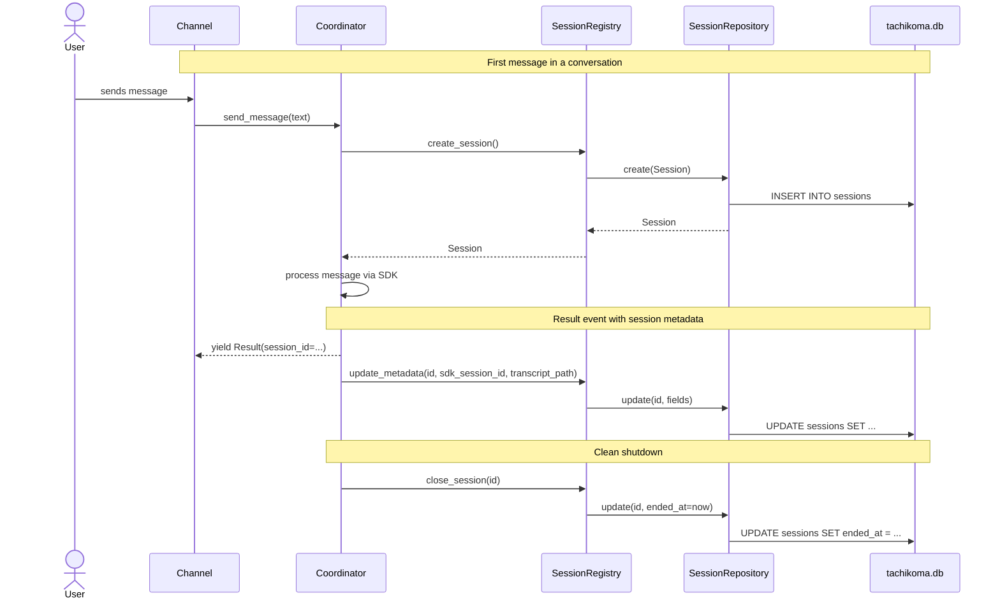
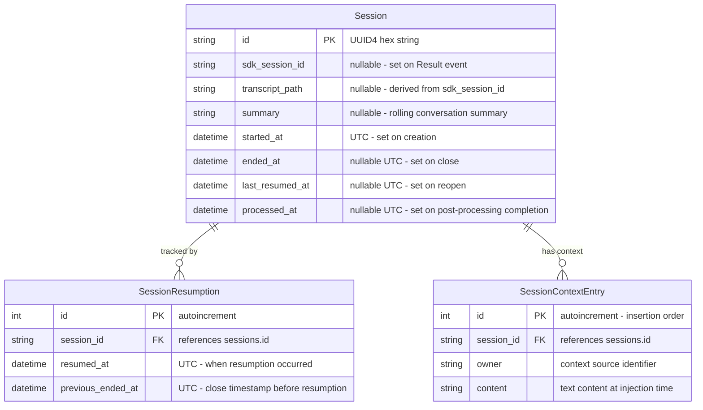

# Design: Session Tracking

<!-- This design describes the current implementation approach. Updated through delta reconciliation. -->

**Feature Spec**: [../../feature-specs/agent/sessions.md](../../feature-specs/agent/sessions.md)
**Status**: Current

## Purpose

This document explains the design rationale for the session tracking system: the persistence approach, model/repository/registry layering, crash recovery mechanism, and integration with the coordinator and bootstrap system.

## Problem Context

The system needs a persistent record of conversation sessions so that downstream features (memory extraction, boundary detection) can identify which conversation to analyze and when sessions start and end. The coordinator manages an SDK client session, but nothing persists session metadata across restarts or provides queryable history.

**Constraints:**
- Single-user, single-process deployment — no concurrent writers
- Sessions table will be small (at most thousands of rows after extended use)
- Must integrate with the bootstrap hook system for crash recovery
- Async-first codebase

**Interactions:**
- Coordinator (core-architecture): creates sessions on first message, updates metadata on Result events, closes on shutdown
- Boundary detectors (future): signal session close
- Post-processing pipeline: receives `Session` as input on session close (see [memory-extraction design](../../feature-designs/memory/memory-extraction.md))
- Bootstrap system (workspace-bootstrap): recovery hook runs on startup

## Design Overview

Four components implement session tracking:

```
┌──────────────────────────────────────────────────────────────┐
│                     Coordinator Layer                          │
│  ┌────────────────────────────────────────────────────────┐   │
│  │  Coordinator                                           │   │
│  │  ┌──────────────────────┐                              │   │
│  │  │ SessionRegistry      │ create / close / update      │   │
│  │  └──────────┬───────────┘                              │   │
│  └─────────────┼──────────────────────────────────────────┘   │
│                │                                               │
├────────────────┼──────────────────────────────────────────────┤
│                │        Persistence Layer                       │
│                ▼                                               │
│  ┌────────────────────────────────────────────────────────┐   │
│  │  SessionRepository (receives shared session_factory)   │   │
│  └─────────────┬──────────────────────────────────────────┘   │
│                │                                               │
│                ▼                                               │
│  ┌────────────────────────────────────────────────────────┐   │
│  │  Database (shared AsyncEngine + async_sessionmaker)    │   │
│  │  → tachikoma.db (.tachikoma/tachikoma.db)              │   │
│  └────────────────────────────────────────────────────────┘   │
├──────────────────────────────────────────────────────────────┤
│                     Bootstrap Layer                             │
│  ┌────────────────────────────────────────────────────────┐   │
│  │  database_hook (async) → creates shared Database       │   │
│  │  session_recovery_hook (async)                          │   │
│  │  → creates SessionRepository(database.session_factory)  │   │
│  │  → registry.recover_interrupted()                       │   │
│  └────────────────────────────────────────────────────────┘   │
└──────────────────────────────────────────────────────────────┘
```

The **SessionRegistry** is the facade that the coordinator calls. It owns the business logic (creation serialization, status derivation, crash recovery) and delegates persistence to the **SessionRepository**. The repository uses SQLAlchemy 2.0's async ORM with `aiosqlite` for the SQLite backend.

The session domain also includes **SessionContextEntry** — a persisted record of each context entry injected into a session's system prompt. Entries are saved at lifecycle points (session creation, pre-processing, boundary detection) and loaded by the coordinator for system prompt assembly. Context entry persistence follows the same layered pattern: `SessionRepository` provides CRUD, `SessionRegistry` exposes a facade.

## Components

### Implementation Structure

| Layer/Component | Responsibility | Key Decisions |
|-----------------|----------------|---------------|
| `src/tachikoma/sessions/model.py` | SQLAlchemy ORM models (`SessionRecord`, `SessionResumptionRecord`, `SessionContextEntryRecord`) + frozen dataclasses (`Session`, `SessionResumption`, `SessionContextEntry`) + `DeclarativeBase` | Separate ORM models from domain dataclasses; callers never see SQLAlchemy types |
| `src/tachikoma/sessions/repository.py` | `SessionRepository`: CRUD operations, time-range queries, `get_recent_closed()` for resumption candidates, `create_resumption()`/`get_resumptions_for_session()` for resumption tracking, `save_context_entries()`/`load_context_entries()` for context entry persistence | Receives shared `async_sessionmaker` from `Database`; all SQL is behind async methods; `save_context_entries` takes list of `(owner, content)` tuples, bulk saves via `session.add_all()`; `load_context_entries` ordered by PK ascending |
| `src/tachikoma/sessions/registry.py` | `SessionRegistry`: business logic facade, creation lock, crash recovery, status derivation, `close_session()` returns `bool` (True if actually transitioned from open to closed — enables callers to distinguish real closes from no-ops), `update_summary()` for persisting rolling summaries, `reopen_session()` for session resumption (uses `dataclasses.replace()` to construct reopened session — avoids redundant DB fetch), `get_recent_closed()` for candidate queries, `record_resumption()` for best-effort tracking, `save_context_entries()` (best-effort — logs on failure per R9/R17, does not raise), `load_context_entries()` (raises on failure — caller handles graceful degradation) | Receives repository via constructor; owns the `asyncio.Lock` |
| `src/tachikoma/sessions/errors.py` | `SessionRepositoryError`: wraps SQLAlchemy exceptions for clean error contract | Callers catch one domain exception, not SQLAlchemy internals |
| `src/tachikoma/sessions/hooks.py` | `session_recovery_hook`: retrieves shared `Database` from extras, creates repository + registry, runs recovery, stores on context extras | Registered as bootstrap hook; runs after `database_hook` |
| `src/tachikoma/sessions/__init__.py` | Re-exports public API: `Session`, `SessionContextEntry`, `SessionResumption`, `SessionRegistry`, `SessionRepository`, `SessionRepositoryError` | Clean public API for the sessions package |

### Cross-Layer Contracts



**Integration Points:**
- Coordinator → SessionRegistry: `get_active_session()` + `create_session()` on first message, `update_metadata()` on Result events, `close_session()` on shutdown and topic shift, `get_recent_closed()` for resumption candidates, `reopen_session()` for session resumption, `record_resumption()` for best-effort tracking, `get_by_time_range()` for bridging context assembly, `save_context_entries(session_id, entries)` for persisting context (always takes a list of (owner, content) tuples), `load_context_entries(session_id)` for loading entries for system prompt assembly
- PostProcessingPipeline → SessionRegistry: `mark_processed()` after pipeline completion (sets `processed_at`)
- SummaryProcessor → SessionRegistry: `update_summary()` after each per-message pipeline run (see [boundary detection design](boundary-detection.md))
- SessionRegistry → SessionRepository: all persistence delegated
- SessionRepository → shared Database (AsyncEngine → aiosqlite → tachikoma.db)
- Bootstrap → SessionRegistry: `recover_interrupted()` on startup via `session_recovery_hook`

**Session close mechanism:**

Sessions close via two runtime mechanisms and one startup mechanism. Idle timeout triggers post-processing without closing:
1. **Boundary detection** (primary, mid-conversation): When a topic shift is detected, the coordinator closes the current session and opens a new one. Post-processing runs as a background task.
2. **Idle timeout** (post-processing only, trails-off conversations): A periodic check (every 60s) fires the post-processing pipeline on the active session after a configurable period of inactivity (`session_idle_timeout`, default 900s), without closing the session. The session stays open so the next message goes through boundary detection, which either continues the session or routes to a new/resumed one. If the coordinator is busy, the check is snoozed and retried. The pipeline's `needs_processing(session, last_message_time)` method prevents re-triggering when `is_processing` is True or `processed_at >= last_message_time`.
3. **Coordinator disconnect** (shutdown safety net): On clean shutdown, the coordinator's `__aexit__` cancels the idle post-processing loop first (preventing a race condition), then calls `registry.close_session()`, awaits all background post-processing tasks (so `is_processing` is cleared), and then triggers post-processing for the active session only if `pipeline.needs_processing()` returns True (skips if idle already handled it).
4. **Crash recovery** (startup): On next launch, the bootstrap recovery hook closes interrupted sessions.

**Error contract:**

Repository methods raise `SessionRepositoryError` on persistence failures (wrapping the underlying SQLAlchemy exception). The registry propagates these to callers. Session tracking errors in the coordinator are logged but never crash the conversation (graceful degradation).

### Shared Logic

- **`Session` dataclass** (`sessions/model.py`): shared between registry (produces) and future consumers like post-processing pipelines. No SQLAlchemy dependency for consumers.
- **`SessionRepository`** lifecycle: created in the recovery hook with the shared `database.session_factory`, stored on `ctx.extras`. The shared `Database` engine is disposed in `__main__.py`'s finally block.

## Modeling

### Domain model



### Session dataclass (domain representation)

```
Session (frozen dataclass)
├── id: str                           (UUID4 hex, generated at creation)
├── sdk_session_id: str | None        (populated from Result event)
├── transcript_path: str | None       (derived from SDK session ID)
├── summary: str | None               (rolling conversation summary, updated by per-message pipeline)
├── started_at: datetime              (UTC, set at creation time)
├── ended_at: datetime | None         (UTC, set when session closes; cleared on reopen)
├── last_resumed_at: datetime | None  (UTC, set when session is reopened for resumption)
├── processed_at: datetime | None     (UTC, set when post-processing completes on this session)
└── status: SessionStatus (property)  (derived, not persisted)
    ├── "open"        — ended_at is None
    ├── "closed"      — ended_at is set AND sdk_session_id is set
    └── "interrupted" — ended_at is set AND sdk_session_id is None

SessionResumption (frozen dataclass)
├── session_id: str                   (FK → sessions.id)
├── resumed_at: datetime              (UTC, when resumption occurred)
└── previous_ended_at: datetime       (UTC, close timestamp before this resumption)

SessionContextEntry (frozen dataclass)
├── id: int                           (autoincrement PK, determines assembly order)
├── session_id: str                   (FK → sessions.id)
├── owner: str                        (context source identifier: soul, user, agents, memories, etc.)
└── content: str                      (text content at time of injection)
```

`SessionStatus` is a `Literal["open", "closed", "interrupted"]` type.

### SQLAlchemy ORM model

```
SessionRecord (DeclarativeBase)
├── __tablename__ = "sessions"
├── id: Mapped[str]                   (primary_key=True)
├── sdk_session_id: Mapped[str | None]
├── transcript_path: Mapped[str | None]
├── summary: Mapped[str | None]       (rolling conversation summary)
├── started_at: Mapped[datetime]      (DateTime(timezone=True))
├── ended_at: Mapped[datetime | None] (DateTime(timezone=True))
├── last_resumed_at: Mapped[datetime | None] (DateTime(timezone=True))
├── processed_at: Mapped[datetime | None]   (DateTime(timezone=True))
└── index on started_at               (for time-range queries)

SessionResumptionRecord (DeclarativeBase)
├── __tablename__ = "session_resumptions"
├── id: Mapped[int]                   (primary_key=True, autoincrement)
├── session_id: Mapped[str]           (ForeignKey("sessions.id"))
├── resumed_at: Mapped[datetime]      (DateTime(timezone=True))
├── previous_ended_at: Mapped[datetime] (DateTime(timezone=True))
└── index on session_id

SessionContextEntryRecord (DeclarativeBase)
├── __tablename__ = "session_context_entries"
├── id: Mapped[int]                   (primary_key=True, autoincrement)
├── session_id: Mapped[str]           (ForeignKey("sessions.id"))
├── owner: Mapped[str]
├── content: Mapped[str]
└── index on session_id               (for load-by-session queries)
```

The ORM models are internal to the persistence layer. A `to_domain()` method on each record converts to the frozen dataclass. The registry and all callers work exclusively with domain instances. The `session_context_entries` table is created via a pragma-check migration in `Database._run_migrations()`, consistent with the `session_resumptions` migration pattern.

## Data Flow

### Session creation (first message)

```
1. Coordinator receives first message of a conversation
2. Coordinator checks registry.get_active_session() — returns None
3. Coordinator calls registry.create_session()
4. Registry acquires asyncio.Lock
5. Registry generates UUID4 hex string as session ID
6. Registry creates Session(id=..., started_at=utcnow(), ...)
7. Registry calls repository.create(session)
8. Repository opens AsyncSession, adds SessionRecord, commits
9. Registry releases lock, returns Session to coordinator
10. Coordinator proceeds with send_message()
```

### Session metadata update (on Result event)

```
1. Coordinator receives Result event with session_id from SDK
2. Coordinator derives transcript_path from SDK session ID
3. Coordinator calls registry.update_metadata(session_id, sdk_session_id, transcript_path)
4. Registry calls repository.update(id, sdk_session_id=..., transcript_path=...)
5. Repository queries by ID, updates fields, commits
```

The `transcript_path` is derived from the SDK session ID using the known Claude SDK directory structure: `~/.claude/projects/<sanitized-cwd>/<session-id>.jsonl`, where `<sanitized-cwd>` replaces `/` with `-` and strips the leading `-`. This derivation is isolated to a single helper function (`_derive_transcript_path` in the coordinator) so it can be updated in one place.

### Session close (shutdown)

```
1. Coordinator __aexit__ triggers (clean shutdown or exception)
2. Coordinator checks for active session via registry
3. Coordinator calls registry.close_session(id) — errors logged, not propagated
4. Registry calls repository.update(id, ended_at=utcnow())
5. Idempotent: already-closed sessions are no-ops
6. Await all background post-processing tasks (idle PP, topic-shift PP) — clears is_processing
7. Check pipeline.needs_processing(active, last_message_time) — skip if already processed
8. If needed, run pipeline.run(active) synchronously
```

### Idle post-processing (idle timeout)

```
1. Coordinator's idle post-processing loop detects inactivity exceeding session_idle_timeout
2. Loop checks pipeline.needs_processing(session, last_message_time) — skips if already processed or processing
3. Loop verifies coordinator is not busy (no active exchange, no queued messages, no pending post-processing)
4. Coordinator calls registry.get_active_session()
5. If session has sdk_session_id and pipeline.needs_processing: fires async post-processing as background task
6. Session stays open — SDK state preserved, no session close or creation
7. Next user message goes through boundary detection (session has summary)
8. Pipeline sets processed_at on completion via registry.mark_processed()
```

Note: The `needs_processing()` check prevents re-triggering: once `processed_at` is set (by `mark_processed` at pipeline completion), the check `processed_at >= last_message_time` returns False, causing the loop to skip. When a new message arrives, `last_message_time` advances past `processed_at`, allowing idle post-processing to fire again for the new content.

### Crash recovery (bootstrap)

```
1. database_hook runs (after workspace_hook) — creates shared Database
2. session_recovery_hook runs (after database_hook)
3. Retrieves Database from ctx.extras["database"]
4. Creates SessionRepository(database.session_factory)
5. Creates SessionRegistry(repository)
6. Calls registry.recover_interrupted():
   a. Queries open sessions (ended_at IS NULL)
   b. For each: sets ended_at from transcript file mtime (if available) or current time
7. Stores repository + registry on ctx.extras for __main__.py retrieval
```

### Summary update (per-message pipeline)

```
1. SummaryProcessor completes, calls registry.update_summary(session_id, summary)
2. Registry calls repository.update(session_id, summary=...)
3. Repository queries by ID, updates summary field, commits
4. Registry re-fetches session via repository.get_by_id()
5. Registry replaces _active_session with new frozen Session instance
   (same re-fetch-and-replace pattern as update_metadata())
```

### Session reopen (resumption)

```
1. Coordinator calls registry.reopen_session(session_id)
2. Registry fetches session via repository.get_by_id()
3. Registry validates: exists
4. Registry validates: transcript_path is not None
5. Registry validates: Path(transcript_path).exists() (transcript on local machine)
6. Registry validates: now - started_at <= max_session_age (session not too old)
7. Registry validates: is closed (ended_at not None), is not already active
8. If any validation fails: log warning, return None
9. Registry calls repository.update(id, ended_at=None, last_resumed_at=now)
10. Registry constructs reopened Session via dataclasses.replace()
   (avoids a second DB fetch since all field values are known)
11. Registry sets _active_session = reopened
12. Returns reopened Session
```

**Max session age**: Configured via `session_resume_window` setting (default: 86400s / 1 day), passed to the registry constructor from the bootstrap hook. The same setting controls both the candidate lookup window (`get_recent_closed`) and the per-session age validation, ensuring consistent behavior.

### Recent sessions query (resumption candidates)

```
1. Coordinator calls registry.get_recent_closed(before=now, window=timedelta)
2. Registry delegates to repository.get_recent_closed(before, window) for the DB query
3. Repository queries:
   SELECT * FROM sessions
   WHERE ended_at IS NOT NULL
     AND sdk_session_id IS NOT NULL
     AND summary IS NOT NULL
     AND ended_at > (before - window)
   ORDER BY ended_at DESC
4. Registry filters results:
   - transcript_path is not None
   - Path(transcript_path).exists() (file on local machine)
   - started_at > (before - max_session_age)
5. Returns filtered list of Session dataclass instances
```

**Why filter in registry, not coordinator**: The registry owns session lifecycle and knows what makes a session valid for resumption. The DB can't check filesystem existence, so post-query filtering in the registry keeps the coordinator thin and the business logic centralized.

### Resumption tracking

```
1. Coordinator calls registry.record_resumption(session_id, previous_ended_at)
2. Registry creates SessionResumption(session_id, resumed_at=now, previous_ended_at)
3. Registry calls repository.create_resumption(resumption)
4. Repository persists SessionResumptionRecord, commits
5. On failure: error logged, not raised (best-effort per R7)
```

### Context entry persistence

```
1. Coordinator saves entries at lifecycle points via registry.save_context_entries(session_id, entries)
   - Foundational: after session creation (soul, user, agents — one entry per file)
   - Pre-processing: after pipeline completes (one entry per successful provider)
   - Transition: in _handle_transition (previous-summary or bridging-context)
2. Registry delegates to repository.save_context_entries(session_id, entries)
3. Repository creates SessionContextEntryRecord for each (owner, content) tuple
4. Bulk save via session.add_all(), commit
5. On failure: registry's save_context_entries logs warning but doesn't raise (best-effort)
```

### Context entry loading

```
1. Coordinator calls registry.load_context_entries(session_id) before each client creation
2. Registry delegates to repository.load_context_entries(session_id)
3. Repository SELECT ... WHERE session_id = ? ORDER BY id ASC
4. Returns list[SessionContextEntry] via to_domain()
5. On failure: SessionRepositoryError propagates to caller
   (coordinator handles graceful degradation by falling back to base preamble only)
```

### Query by time range

```
1. Caller provides (start, end) datetime range
2. Registry calls repository.get_by_time_range(start, end)
3. Repository queries:
   SELECT * FROM sessions
   WHERE started_at < :range_end
     AND (ended_at IS NULL OR ended_at > :range_start)
   ORDER BY started_at DESC
4. Open sessions (ended_at IS NULL) are included if started_at < range_end
5. Returns list of Session dataclass instances
```

## Key Decisions

### SQLAlchemy 2.0 async over raw aiosqlite

**Choice**: Use SQLAlchemy 2.0 with async ORM and `aiosqlite` backend (see ADR-007)
**Why**: Provides typed ORM models with `Mapped[T]` columns, built-in schema creation, and establishes a persistence pattern for future tables. SQLAlchemy is the industry standard with robust async support and good type hints in 2.0.
**Alternatives Considered**:
- Raw aiosqlite: Lighter but no ORM benefits
- Tortoise ORM: Global init pattern, extra dependencies
- SQLModel: Async SQLite path under-documented

**Consequences**:
- Pro: Typed ORM model, built-in schema management, established pattern
- Pro: Scales naturally if more tables are added
- Con: Heavier dependency than raw aiosqlite for a single-table use case

### Separate ORM model from domain dataclass

**Choice**: `SessionRecord` (SQLAlchemy ORM) is internal to the persistence layer; callers receive frozen `Session` dataclasses
**Why**: Prevents SQLAlchemy types from leaking into the coordinator, boundary detectors, and post-processing pipelines. Consistent with the adapter pattern used for SDK messages (AgentEvent).

**Consequences**:
- Pro: Consumers never import SQLAlchemy
- Pro: Domain model is a plain frozen dataclass — easy to test, serialize, inspect
- Con: Requires a `to_domain()` mapping step in the repository

### Derived session status (not persisted)

**Choice**: Session status (`open`/`closed`/`interrupted`) is a computed property on the `Session` dataclass, not a database column
**Why**: Status is fully derivable from `ended_at` and `sdk_session_id`. Storing it would create a synchronization risk.

**Consequences**:
- Pro: No stale status — always consistent with underlying fields
- Pro: Simpler schema — fewer columns to maintain
- Con: Cannot query by status directly in SQL

### UUID4 hex string for session IDs

**Choice**: Use `uuid.uuid4().hex` (32-character hex string) as session IDs
**Why**: Universally unique without coordination. Compact, URL-safe, works as a plain string primary key in SQLite.

**Consequences**:
- Pro: No ID collision risk, no sequence coordination
- Pro: Meaningful as a standalone identifier for logs and cross-referencing

### Sessions as a package

**Choice**: Organize session-related code as `src/tachikoma/sessions/` package with separate modules
**Why**: Three distinct concerns (domain model, persistence, business logic facade) benefit from separate modules for clarity and independent testing.

**Consequences**:
- Pro: Clear separation of concerns, easy to navigate
- Pro: Each module can be tested independently

## System Behavior

### Scenario: First message creates a session

**Given**: No active session exists
**When**: The coordinator receives the first message
**Then**: `registry.create_session()` generates a new session with a UUID4 ID and UTC timestamp. The coordinator proceeds to process the message.
**Rationale**: Sessions are created eagerly on first message, before the SDK processes the request, so that even if the SDK call fails, the session start is recorded.

### Scenario: Result event populates metadata

**Given**: An active session with null SDK metadata
**When**: The coordinator receives a `Result` event with a `session_id`
**Then**: `registry.update_metadata()` sets `sdk_session_id` and derives `transcript_path`.
**Rationale**: The SDK assigns its own session ID internally; the registry captures it on the first Result event for cross-referencing with SDK transcripts.

### Scenario: Idle timeout triggers post-processing

**Given**: An active session with no message exchange for longer than `session_idle_timeout`
**When**: The idle post-processing loop detects the timeout and the coordinator is not busy
**Then**: The post-processing pipeline runs as a background task. The session stays open (`ended_at` remains None), SDK state is preserved. `processed_at` is set on completion. The next user message goes through boundary detection — if the follow-up is a different topic, boundary detection handles the transition; if same topic, the session continues.
**Rationale**: Conversations that trail off get their post-processing triggered automatically (memories extracted, changes pushed) without losing session continuity. Most follow-up messages relate to the same topic, so keeping the session open avoids unnecessary creation and preserves conversation context.

### Scenario: Idle post-processing skipped when already processed

**Given**: An active session where `processed_at >= last_message_time`
**When**: The idle loop checks again
**Then**: `pipeline.needs_processing()` returns False and the loop skips. No redundant post-processing.
**Rationale**: Once post-processing has run for all content since the last message, re-running would be wasteful.

### Scenario: Clean shutdown closes active session

**Given**: An active session exists
**When**: The coordinator exits its async context
**Then**: The idle post-processing loop is cancelled first (if running), then `registry.close_session()` sets `ended_at`. Background tasks (including any in-flight idle or topic-shift post-processing) are awaited first — this ensures `is_processing` is cleared before evaluating the active session. Then if `pipeline.needs_processing()` returns True, post-processing runs synchronously for the active session. If idle post-processing already handled it (`processed_at >= last_message_time`), shutdown skips redundant post-processing. Errors are logged but not propagated.
**Rationale**: Clean session close enables time-range queries and signals readiness for post-processing. Cancelling the idle loop first prevents a race between idle post-processing and shutdown close.

### Scenario: Close on already-closed session (idempotent)

**Given**: A session with `ended_at` already set and `_active_session` still referencing it
**When**: A close signal is received again
**Then**: `_active_session` is cleared (so `get_active_session()` returns None), no database update occurs, and `close_session` returns False.
**Rationale**: Multiple close sources may fire redundantly; idempotency prevents errors. Clearing `_active_session` on the idempotent path prevents stale references — without this, a race between `close_session` and `update_summary` (which re-fetches the session from DB) can leave `_active_session` pointing to a closed session.

### Scenario: Crash recovery on startup

**Given**: The application crashed leaving sessions with null `ended_at`
**When**: The recovery hook runs
**Then**: Open sessions are closed with best-effort timestamps (transcript file mtime if available, otherwise current time).
**Rationale**: Best-effort timestamps are more accurate than "now" when the crash happened some time ago.

### Scenario: Recovery with no open sessions (idempotent)

**Given**: All sessions have `ended_at` set
**When**: The recovery hook runs
**Then**: No changes are made. The hook completes silently.
**Rationale**: Idempotent — safe to run on every launch.

### Scenario: Session reopened for resumption

**Given**: A closed session with `sdk_session_id`, transcript file that exists locally, and `started_at` within the max age
**When**: The coordinator calls `reopen_session()` with the session ID
**Then**: `ended_at` is cleared, `last_resumed_at` is set to now, the session becomes the active session. The registry constructs the reopened session via `dataclasses.replace()` without a redundant DB fetch.

### Scenario: Reopen fails — session not found

**Given**: A session ID that doesn't exist in the database
**When**: `reopen_session()` is called
**Then**: A warning is logged and None is returned. The coordinator falls back to fresh-session behavior.

### Scenario: Reopen fails — transcript missing locally

**Given**: A closed session whose transcript file doesn't exist on the local machine (e.g., session created on a different server)
**When**: `reopen_session()` is called
**Then**: A warning is logged with the transcript path and None is returned. The coordinator falls back to fresh-session behavior.
**Rationale**: Prevents resuming sessions whose SDK context is unavailable, which would cause the Claude CLI to crash with exit code 1.

### Scenario: Reopen fails — session too old

**Given**: A closed session whose `started_at` exceeds the configured max session age
**When**: `reopen_session()` is called
**Then**: A warning is logged with the session's started_at timestamp and None is returned. The coordinator falls back to fresh-session behavior.
**Rationale**: Prevents resuming stale sessions from old deployments, which may have incompatible context or excessive transcript size.

### Scenario: Reopen fails — no transcript path

**Given**: A closed session whose `transcript_path` is None (interrupted session that never received a Result event)
**When**: `reopen_session()` is called
**Then**: A warning is logged and None is returned. The coordinator falls back to fresh-session behavior.

### Scenario: Resumption tracking recorded

**Given**: A session was successfully reopened
**When**: `record_resumption()` is called
**Then**: A `SessionResumption` record is persisted with the session ID, current timestamp, and previous close timestamp.

### Scenario: Resumption tracking fails gracefully

**Given**: A session was successfully reopened
**When**: `record_resumption()` encounters a database error
**Then**: The error is logged but the session remains resumed — tracking is best-effort.

### Scenario: Session resumed, closed, then resumed again

**Given**: A session that was previously resumed and then closed again
**When**: `reopen_session()` is called again
**Then**: `ended_at` is cleared, `last_resumed_at` is updated to the new timestamp. A second `SessionResumption` record is created.

### Scenario: Session tracking failure during conversation

**Given**: A conversation is active and a registry method fails
**When**: The coordinator catches the error
**Then**: The error is logged and the conversation continues uninterrupted.
**Rationale**: Session tracking is important but not critical to message processing. Graceful degradation is preferred.

## Notes

- All persistent subsystems (sessions, tasks) share a single `Database` instance with one `AsyncEngine` and `async_sessionmaker` backed by `tachikoma.db`
- `expire_on_commit=False` is used on the shared `async_sessionmaker` to allow attribute access on `SessionRecord` instances after commit (before `to_domain()` conversion)
- SQLite stores datetimes as naive ISO strings; a `_ensure_utc()` helper restores UTC tzinfo on read so callers always receive timezone-aware datetimes
- The `BootstrapContext.extras` field is used to pass the `Database`, repository, and registry between hooks and to `__main__.py` — see [workspace-bootstrap design](workspace-bootstrap.md)
